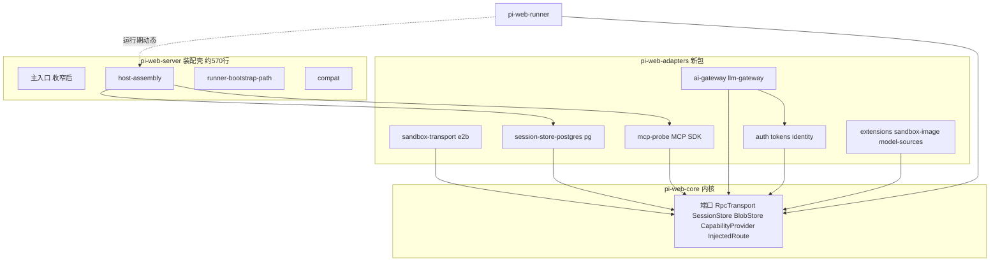
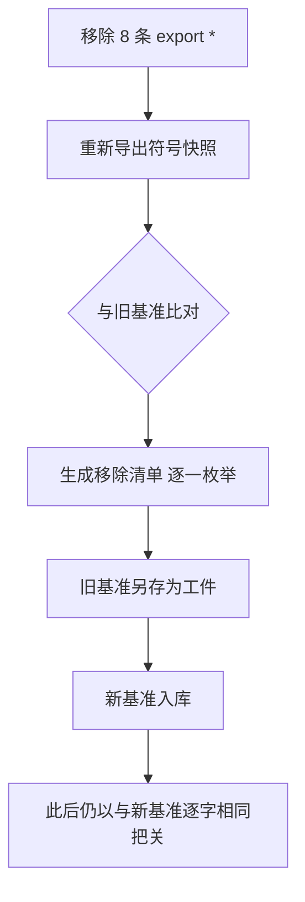
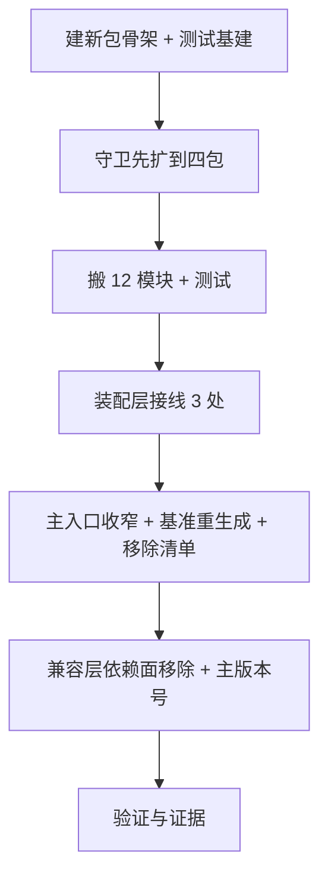

# Design Document: adapters-package-extraction

## Overview

**Purpose**：把「内核 ← adapters」这条线从**守卫维持的约定**变成**物理事实**：新建
`@blksails/pi-web-adapters` 承载 12 个外部绑定模块（57 文件 / 7612 行），
兼容层 `@blksails/pi-web-server` 缩为约 570 行的装配壳，其依赖声明不再含
云沙箱 SDK、数据库驱动与 MCP SDK。

**Users**：未来只跑内核的宿主（edge / 精简云端）；runner 包已是这种形态的先例。

**Impact**：★ 本特性含一次**有意的破坏性契约变更** —— 主入口不再导出 adapters 符号，
故须走主版本。这与前两轮「契约逐字不变」的姿态相反，是本轮的核心决定。

★ 与 runner 提取的关键差别：那一轮收益当场可测（沙箱镜像不再装云沙箱 SDK）。
本轮**对现有消费方零依赖收益** —— 他们用兼容层，而兼容层公开面含 adapters 符号。
唯一当场可测的收益是**兼容层依赖闭包缩小**（R2），故它是本设计的头号判据。

### Goals

- adapters 包承载 12 模块与三个重依赖，可整体不装（1.1–1.5）
- 兼容层依赖闭包**不再含**那三者，以机械断言为证（2.1–2.4）
- 主入口收窄留下**可逐一枚举**的痕迹，且此后仍以「与新基准逐字相同」把关（3.1–3.6）
- 只搬不改；无端口者不新造端口（4.1–4.4）
- 守卫扩到第四个包，空扫即失败（5.1–5.5）
- 通过面不回退，并专门搜索类型检查看不见的两类失效（6.1–6.6）

### Non-Goals

- 任何 adapter 的功能性改写
- 宿主契约 v1 的改动（已冻结）
- `server/cli` 的包注册表接线剥离（后续波次）
- 跨仓改动（只登记）
- 文档同步（与上一轮同一笔挂账）
- 把 adapters 再拆成多个按外部系统分的包（过早，见 research.md 方案评估）

---

## Boundary Commitments

### This Spec Owns

- `@blksails/pi-web-adapters` 包的成立：清单、依赖声明、导出面、测试基建
- 12 个 adapters 模块及其测试的物理归属
- **主入口导出面的收窄**与符号基准的有意重生成（含移除清单工件）
- 兼容层与 `host-assembly` 对新包的接线（3 处装配引用）
- 守卫扩到第四个包
- 兼容层的主版本号
- `resolvePiCliEntry()` 的依赖声明保障（静态断言）

### Out of Boundary

- adapter 的功能行为（含 `identity/` **不补端口**）
- 跨仓消费方的适配改动
- `server/cli` 的注册表接线
- 81 个文档文件的路径同步

### Allowed Dependencies

依赖方向（层序）：`neutral(0) ← core(1) ← { runner(2), adapters(2) } ← assembly(3)`

- 新包**可以**依赖：`core` / `protocol` / `logger` / `zod` / `e2b` / `pg` / MCP SDK
  + agent SDK 两包（peer）
- 新包**不得**依赖：兼容层（反向）、runner 包（同序互斥）
- 兼容层**可以**依赖新包（`assembly → adapters`，正向）
- ★ 实测：adapters 集合**对装配层完全闭合**（无 `host-assembly` / `compat` / 主 barrel 引用），
  故本轮**无反向边要解**

### Revalidation Triggers

| 触发条件 | 谁需要重新验证 |
|---|---|
| **主入口导出面收窄** | 全部跨仓消费方（pi-clouds / 桌面壳 / 已烘焙镜像）；须按新主版本适配 |
| 新包 `exports` 键增删 | 依赖闭包断言、`exportsMapOf` 驱动的守卫 |
| adapters 模块新增/移出 | 层→包映射断言、依赖审计的按包规则 |
| 装配层引用点变化 | 默认能力面装配测试 |
| 层序或 `PACKAGE_ROOTS` 变化 | 三组守卫全体 |

---

## Architecture

### Existing Architecture Analysis

- **源码直连分发**：`exports` 直指 `./src/*.ts`，无构建步骤；消费方 `tsc` 会编译被引用包每个文件
- **通配子路径导出** `"./*.js": "./src/*.ts"`：新包沿用，且它是依赖方向守卫**看得见跨包深路径边**的前提
- **守卫机制已就绪**（上一轮建立）：`pendingContributions`（语义「必须恰好为空」）、
  层→包映射表（`Record<Layer, LayerPlacement>`，漏表态即类型错误）、按包根声明的依赖规则
- **集合闭合**：12 模块不引用装配层；内部仅 2 条跨模块边（`ai-gateway → tokens`、`identity → auth`）

### Architecture Pattern & Boundary Map



**关键决策**：

- **主入口不再指向新包** —— 这是本轮与前两轮最大的结构差异。收窄后兼容层对新包的引用
  只剩 `host-assembly` 的 3 处（真实工厂，装配层按定义允许）。
- `identity/` **不接端口**：core 无 `IdentityProvider`（实测），补端口属逻辑变更（R4.2）。
- 新包**不引用** runner 包：两者同序互斥；实测集合内无 runner 引用。

### Technology Stack

| Layer | Choice / Version | Role | Notes |
|---|---|---|---|
| Runtime | Node ≥ 22.19.0 | 包解析、子进程 | 与既有 `engines` 一致 |
| 云沙箱 | `e2b` ^2.33.0 | `sandbox-transport` | **迁入新包** |
| 数据库 | `pg` ^8.13.1 | `session-store-postgres` | **迁入新包** |
| MCP | `@modelcontextprotocol/sdk` ^1.29.0 | `mcp-probe` | **迁入新包** |
| Agent SDK | `@earendil-works/pi-coding-agent` / `-ai` ^0.80.3 | 6+1 处值导入 | **peer，非可选** |
| Test | vitest ^2.1.8 | 四档分级 | 新包需自带 `vitest.config.ts`（否则静默继承根配置） |

---

## File Structure Plan

### 新建

```
packages/adapters/
├── package.json          # 三个重依赖归此 + 通配导出 + peer agent SDK
├── tsconfig.json         # rootDir ".."（跨包引 core 的 .ts）
├── vitest.config.ts      # ★ 必须存在，否则静默继承仓库根配置
├── vitest.workspace.ts   # 四档划分 + fast 档 child_process 抛错守卫别名
├── scripts/run-tests.mjs # 分档编排（core 副本；fast 档不给 --passWithNoTests）
├── src/                  # 12 个模块整体迁入，目录名保持
│   ├── extensions/ auth/ ai-gateway/ sandbox-transport/ identity/
│   ├── llm-gateway/ sandbox-image/ session-store-postgres/ tokens/ model-sources/
│   ├── mcp-probe.ts
│   └── attachment-example-tool.ts
└── test/                 # 对应测试自 packages/server/test/ 迁入
```

### 修改

| 文件 | 改什么 | 需求 |
|---|---|---|
| `packages/server/src/index.ts` | **移除 8 条 `export *`**（adapters 模块） | 3.1 |
| `packages/server/test/compat/main-entry-symbols.txt` | **有意重生成**；旧基准另存为移除清单工件 | 3.2, 3.3, 3.4 |
| `packages/server/package.json` | 加新包依赖；**移除** `e2b` / `pg` / MCP SDK；**主版本号** | 2.1, 3.5 |
| `packages/server/src/host-assembly/{session-store,default-capabilities}.ts` | 3 处引用改包级 specifier | 2.3 |
| `packages/adapters/src/extensions/cli/pi-cli.ts` | 修**第三处**被证伪的注释 | 6.6 |
| `vitest.config.ts`（根） | 加新包 alias（★ `$` 锚定裸名正则须在前缀条之前） | 6.4 |
| `package.json`（根） | `test:fast` / `test:e2e` 串上新包（★ 排在末尾，见上一轮教训） | 6.1 |
| `packages/core/test/tiering/package-roots.ts` | `PACKAGE_ROOTS` 加第四项 + `pendingContributions` | 5.1–5.3, 5.5 |
| `packages/core/test/tiering/module-roster.test.ts` | 层→包映射：`adapters → adapters` 包（原为 `server`） | 5.3 |
| `packages/core/test/tiering/dependency-guard.test.ts` | 通配集合与反向边检测纳入新包 | 5.1, 5.4 |
| `packages/core/test/tiering/package-deps.test.ts` | 新包的按根规则：**允许**三个重依赖；兼容层改为**禁止** | 1.2, 2.4 |

**不需改动**（沿用上一轮实测结论）：`scripts/pack-dist.mjs`（自动扫 `packages/`）、
`vite.config.ts`、`vitest.node-e2e.config.ts`、`tsconfig.base.json`、`pnpm-workspace.yaml`。

---

## System Flows

### 主入口收窄的留痕流程（本轮独有）



**决策要点**：★ 「有意移除」与「不小心弄丢」在 diff 上长得一样。唯一的区别是有没有
**逐一枚举的移除清单**。数量差（313 → N）不够 —— 它无法回答「少的是哪几个」。

---

## Requirements Traceability

| Requirement | Summary | Components | 判据 |
|---|---|---|---|
| 1.1 | 新包含全部 adapters 模块 | C1 | 层→包映射断言 |
| 1.2 | 三个重依赖归新包 | C1, C5 | 按根依赖规则 |
| 1.3 | agent SDK 列为 peer | C1 | 清单读取断言 |
| 1.4 | adapters 模块留在兼容层即失败 | C5 | 层⟹物理断言 |
| 1.5 | 无需预构建即可消费 | C1 | 源码直连 + 三包 typecheck |
| 2.1 | 兼容层依赖不再含三者 | C2 | 清单扫描 |
| 2.2 | 以**依赖闭包**为判据 | C2, C6 | 闭包遍历断言 |
| 2.3 | 装配能力保持不变 | C2 | 默认能力面装配测试 |
| 2.4 | 兼容层重新引入即失败 | C5 | 按根依赖规则（反向） |
| 3.1 | 主入口不再导出 adapters 符号 | C3 | 符号快照 |
| 3.2 | 基准有意重生成 + 理由留档 | C3 | 移除清单工件 + 提交信息 |
| 3.3 | 被移除符号**可逐一枚举** | C3 | 移除清单内容 |
| 3.4 | 此后以与新基准逐字相同把关 | C3 | 基准用例 |
| 3.5 | 版本号体现破坏性 | C3 | `package.json` |
| 3.6 | 登记跨仓消费方 | C6 | 交付报告 |
| 4.1 | 不改功能行为 | C4 | 既有测试全绿 |
| 4.2 | 无端口者不新造端口 | C4 | `identity/` 无新增端口文件 |
| 4.3 | 逻辑变更单独标注 | C4 | 任务单列 |
| 4.4 | 命名不是归属判据 | C4 | 层归属为准 |
| 5.1 | 守卫覆盖四包 | C5 | `PACKAGE_ROOTS` 4 项 |
| 5.2 | 空扫即失败 | C5 | `assertRootsContributed` |
| 5.3 | 层⟹物理覆盖新包 | C5 | 映射表 |
| 5.4 | 反向边失败并指出源与目标 | C5 | 判别实验 |
| 5.5 | 未填充时须恰好为空 | C5 | `pendingContributions` |
| 6.1 | 通过面不低于快照且两次一致 | C6 | 实测输出 |
| 6.2 | 类型检查通过 | C6 | 四包 + 根 |
| 6.3 | 真实 spawn 测试保持档位 | C6 | 逐档文件数 |
| 6.4 | 全仓解析配置纳入新包 | C1 | 根 alias |
| 6.5 | 提供实测输出 | C6 | 证据矩阵 |
| 6.6 | 专门搜索两类不可见失效 | C6 | 搜索命令与结果 |

---

## Components and Interfaces

| Component | Domain | Intent | Req |
|---|---|---|---|
| C1 新包骨架 | adapters | 清单、依赖面、导出、测试基建 | 1.1–1.3, 1.5, 6.4 |
| C2 兼容层依赖面缩小 | assembly | 三个重依赖移出 + 装配能力不变 | 2.1–2.4 |
| C3 主入口收窄与留痕 | assembly | 有意的契约变更 + 可枚举的移除清单 | 3.1–3.6 |
| C4 只搬不改 | adapters | 行为不变；无端口者不造端口 | 4.1–4.4 |
| C5 守卫扩到四包 | 测试基建 | 四包全覆盖，空扫即失败 | 1.2, 1.4, 2.4, 5.1–5.5 |
| C6 验证与证据 | 验收 | 闭包断言 + 两类不可见失效的搜索 | 2.2, 3.6, 6.1–6.6 |

### C1 · 新包骨架

**Responsibilities & Constraints**

- 依赖声明的权威：`core / logger / protocol / zod` + `e2b / pg / MCP SDK`
- agent SDK 两包走 `peerDependencies`，**不标可选**（集合内有 7 处值导入）
- ★ **必须补一条静态断言：agent SDK 已声明在本包清单里**。
  理由：`extensions/cli/pi-cli.ts` 的 `locatePackageDir()` **逐级向上**查找
  `node_modules/@earendil-works/pi-coding-agent`，而仓库根有它 ——
  **漏声明在 monorepo 里恒能解析成功**，只在真实安装树失败。
  这与上一轮 5.1 的 tool-kit 陷阱完全同构（实测过：摘声明并删链接，解析仍成功）。
- `exports` 沿用通配 `"./*.js": "./src/*.ts"` —— 它是依赖方向守卫看得见跨包深路径边的前提

### C2 · 兼容层依赖面缩小（本轮唯一当场可测的收益）

**Responsibilities & Constraints**

- `dependencies` 移除 `e2b` / `pg` / MCP SDK，加入新包
- ★ 判据是**依赖闭包**而非直接声明：上一轮终验正是靠算闭包才发现 MCP SDK 经 tool-kit
  传递引入。本轮须同样区分「声明层」与「闭包层」，并把结论写准。
  ⚠ 预期：MCP SDK 仍会经 `tool-kit` 出现在兼容层闭包中（tool-kit 是既有依赖），
  故 2.1 的达成范围须表述为「兼容层**自身声明**不再含三者」，
  闭包层的残留须显式说明来源与是否可消除。
- 装配能力不变：`host-assembly` 的 3 处引用改为包级 specifier（`assembly → adapters` 正向）

### C3 · 主入口收窄与留痕

**Responsibilities & Constraints**

- 移除 `index.ts` 的 8 条 `export *`
- ★ 基准重生成必须产出**移除清单**：被移除符号**逐一枚举**（R3.3）。
  数量差不够 —— 它回答不了「少的是哪几个」。
- 旧基准另存为工件，使「收窄前的契约」可考古
- 主版本号；跨仓消费方登记为 Revalidation Trigger
- ⚠ 与前两轮的硬约束**相反**：那两轮禁止改基准；本轮改基准是目标。
  但**改法**受约束：须留痕、须可枚举、改后继续以「逐字不变」把关。

### C5 · 守卫扩到四包

**Responsibilities & Constraints**

- `PACKAGE_ROOTS` 加第四项；新包三个维度初始为 `pendingContributions`
- 层→包映射：`adapters → "adapters"` 包（当前是 `"server"`）。
  ★ 过渡期用 `stagedIn: "server"`，且只允许在目标包根仍 `srcModules`-pending 时存在 ——
  搬迁落地即过期报红，判据自动恢复严格（上一轮机制，已验证）
- 依赖审计的按根规则：新包**允许**三个重依赖；兼容层从「允许」改为**禁止**
- 通配集合纳入新包（否则其跨包深路径边被当外部依赖跳过 → **守卫失明**）

### C6 · 验证与证据

| 验证项 | 判据 |
|---|---|
| 四包测试面 | 逐档 ≥ 快照，连跑两次一致；**汇总行算术** `passed+skipped==total` |
| 类型检查 | 四包 + 根（★ 排除 `desktop`，其 `typecheck` 是 Rust 构建，既有红） |
| ★ 依赖闭包 | 兼容层闭包中三者的去留，逐项列出并说明来源 |
| ★ 主入口移除清单 | 被移除符号逐一枚举；新基准用例通过 |
| ★ 两类不可见失效 | 专门搜索运行时路径字符串与重复写死的契约断言 |
| 装配能力 | 默认能力面装配测试通过 |
| 既有红 | 三处（desktop cargo / app 档 heap OOM / `e2e:cli` 登录门）须复核形态未变 |

---

## Error Handling

本特性不新增失败面。唯一的行为敏感点是装配层的 3 处引用 —— 改错会让**默认能力面静默缺失**
（不报错、能力消失），故以既有装配测试把关，而非以「没报错」为判据。

## Testing Strategy

### Unit Tests

1. 新包清单：三个重依赖在、agent SDK 为 peer 且未标可选
2. ★ agent SDK 的**静态声明**断言（monorepo 向上查找会掩盖遗漏）
3. 兼容层清单：三者已移除
4. 层⟹物理断言：把一个 adapters 模块留在兼容层 → 报红
5. 依赖审计：兼容层重新加入三者之一 → 报红并指出依赖名与字段

### Integration Tests

1. 主入口符号与**新**基准逐字相同
2. 默认能力面装配：会话存储与 MCP 探测能力仍可取得
3. 新包对兼容层的任何导入被判反向
4. 依赖闭包断言：兼容层闭包中三者的去留符合预期表述

### E2E Tests

1. `pnpm e2e:cli:reloc` —— 换机复现（上一轮的最强证据，本轮防回归）
2. `pnpm e2e:cli` —— 产物完整性（★ 浏览器冒烟有既有登录门失败，须分离）

---

## Migration Strategy



**次序理由**：守卫（P2）必须**先于**搬迁（P3）—— 源码直连 + 跨包导入使「搬错包」在类型层
完全可能通过。主入口收窄（P5）放在搬迁与接线之后，因为它要基于**搬完后的真实导出面**
重生成基准；提前做会得到一份中间态基准。

**回滚触发**：默认能力面装配测试失败、`e2e:cli:reloc` 失败、任一包守卫扫到 0 个文件。
