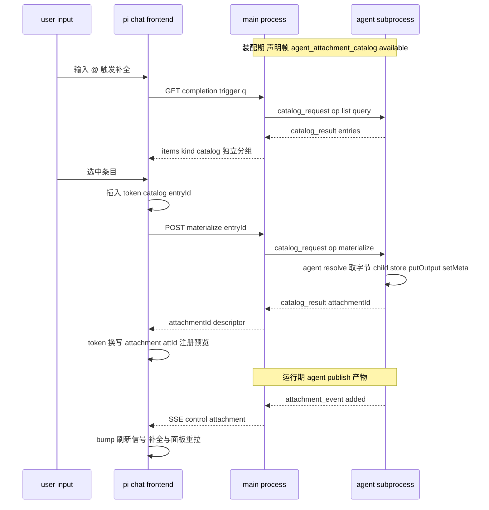

# Technical Design Document — agent-attachment-catalog

## Overview

**Purpose**:让 agent 为会话提供动态附件资源目录——用户经 @ 补全发现、选中惰性物化注入,agent 亦可运行期主动推送产物并让前端即时感知。交付给 agent 作者与终端用户。
**Users**:agent 作者声明 `attachmentCatalog`(list/resolve 两个 handler)与调用 `publish`;终端用户在 @ 补全的「catalog」分组发现条目;宿主零配置。
**Impact**:新增一个补全 provider、一组子进程帧(声明/请求/结果/事件)、一个物化端点、一种 SSE control 帧;attachment 系统与补全框架的既有对外语义不变。不声明目录的 agent 零变化。

### Goals
- 目录可枚举可过滤、busy 不阻塞、失败仅本组降级(2.x)。
- 惰性物化 + 幂等复用 + 与普通附件同等待遇(3.x)。
- agent 主动推送 + 前端免刷新感知(4.x);历史回放不依赖 agent 存活(5.x);纯旁路可隔离(6.x)。

### Non-Goals
- 目录持久化、跨会话共享、层级浏览 UI、未物化条目字节级预览、LLM 侧目录访问(requirements Boundary Context)。

## Boundary Commitments

### This Spec Owns
- `AgentDefinition.attachmentCatalog` 声明契约与条目类型(`CatalogEntry`);`AttachmentToolContext.publish` 扩展。
- 四种帧:装配期 `agent_attachment_catalog`(声明投影)、运行期 `piweb_attachment_catalog_request/result`(list/materialize)、`piweb_attachment_event`(推送事件);SSE `control:"attachment"` 载荷。
- 子进程 catalog 桥(独立 stdin reader、handler 派发、child store 物化、幂等锚、in-flight 串行化)。
- `catalog` 补全 provider(complete 经会话索 list;resolve 兜底物化)。
- 物化端点 `POST /sessions/:id/attachment-catalog/:entryId/materialize` 与其超时/错误语义。
- 前端 accept 异步换写状态机、事件驱动的刷新信号、`completion.kind.catalog` i18n。

### Out of Boundary
- 补全框架(注册表/分组/token 文法/resolve 位置重写)与附件系统(落库/引用标记/签名分发/写路由)的既有语义——只消费。
- `publish` 落库本身 = 既有 `putOutput` 语义(本 spec 只加事件广播)。
- readiness/会话生命周期协议(事件帧错过不补,非粘性)。

### Allowed Dependencies
- 上游:completion registry 注册缝(`opts.completionProviders` / create-handler 装配点)、`AttachmentToolContext`/child store、`pi-session.handleRawLine` 与 pending-map 先例、`ControlPayloadSchema` 扩展缝、agent-routes 桥的 reader/fd1 模式。
- 依赖方向:`protocol` ← `agent-kit`(类型)← `server(runner/completion/session/http)` ← `react` ← `ui` ← `lib/app`。禁止反向。

### Revalidation Triggers
- 帧类型集合或 control 载荷判别集再变更 → pi-session 分支、react connection、protocol barrel 复核。
- `CompletionItem`/token 文法变更 → provider 与前端 accept 逻辑复核。
- `AttachmentToolContext` 面再变更 → attachment-tool-bridge 消费方复核。

## Architecture

### Existing Architecture Analysis
见 research.md:补全框架即插槽(provider/分组/超时降级/resolve 全现成);帧桥全族先例(agent_routes);字节不过 JSONL 的关键手法 = 子进程 child store 落库、帧传 att_id;前端即时感知需新增 control 帧(queue 帧先例流程)。

### 端到端时序



**Architecture Integration**:
- 全部构件按既有先例同族复制:声明帧(slash_completions/agent_routes/profile 同族)、请求/结果帧(agent_routes 的 pending map + 独立 reader + fd1)、control 帧(queue 同族)、provider(attachment-provider 同族)。
- 物化主路径在 accept 时机(可反馈、可预览),resolve 为兜底;幂等由子进程 meta 锚 + in-flight 串行化保证,双路径安全(选型对比见 research.md)。

### Technology Stack
无新依赖;TypeScript strict;zod 帧校验。

## File Structure Plan

### 新增
```
packages/protocol/src/attachment/catalog.ts            # CatalogEntryDto + 四种帧 schema + control:"attachment" 载荷类型
packages/server/src/runner/attachment-catalog-wiring.ts # 子进程桥:声明帧/独立 reader/list-materialize 派发/幂等锚/in-flight 串行化
packages/server/src/completion/providers/catalog-provider.ts # kind:"catalog" provider(complete≤700ms 索 list;resolve 兜底物化)
packages/server/src/http/routes/attachment-catalog-routes.ts # POST /sessions/:id/attachment-catalog/:entryId/materialize
packages/ui/src/completion/use-catalog-materialize.ts   # accept 异步换写状态机(插 token→物化→换写/撤销+toast)
```

### 修改
- `packages/agent-kit/src/types.ts` — `AgentDefinition.attachmentCatalog?: AgentAttachmentCatalogDecl`;`CatalogEntry` 类型(1.1);`AttachmentToolContext` 增 `publish`(4.1)。
- `packages/protocol/src/transport/sse-frame.ts` — `ControlPayloadSchema` 增 `attachment` 变体(4.2)。
- `packages/protocol/src/index.ts` — barrel。
- `packages/server/src/runner/agent-loader.ts` — catalog 声明形状归一化(list/resolve 必须函数,非法抛 `InvalidAgentDefinitionError`)(1.1)。
- `packages/server/src/runner/runner.ts` — 按序装配 catalog 桥(attachment 桥后、runRpcMode 前)。
- `packages/server/src/runner/attachment-wiring.ts` — ctx 增 `publish`(putOutput + fd1 事件帧)(4.1)。
- `packages/server/src/session/pi-session.ts` — 声明帧缓存(`catalogAvailable`)+ catalog pending map + `requestCatalog(op,…)` + `piweb_attachment_event` → SSE `control:"attachment"`(节流合并)(1.4/2.x/4.2)。
- `packages/server/src/http/create-handler.ts` — 注册 catalog provider(注入会话访问器)+ 挂物化路由。
- `packages/react/src/client/pi-client.ts` — `materializeCatalogEntry(sessionId, entryId)`。
- `packages/react/src/sse/connection.ts` — 消费 `control:"attachment"` 暴露事件回调。
- `packages/ui/src/chat/pi-chat.tsx` — accept 分派(kind==="catalog" 走换写状态机)+ 事件回调 bump 附件刷新信号。
- `packages/ui/src/i18n/*` — `completion.kind.catalog`(zh/en)。
- `examples/`(交付项):`attachment-catalog-agent` 可跑范例 + `examples/README.md` 注册。

## Components and Interfaces

| Component | Domain | Intent | Requirements | Contracts |
|---|---|---|---|---|
| `attachmentCatalog` 声明 + loader 校验 | agent-kit/runner | 目录声明面 | 1.1, 1.2 | State |
| catalog 桥(子进程) | runner | 枚举/物化/幂等/隔离 | 1.3, 3.1–3.3, 5.3, 6.2–6.3 | Service/Event |
| 四种帧 + control 载荷 | protocol | 跨进程契约 | 1.4, 2.x, 4.2 | Event |
| pi-session catalog 面 | session | 声明缓存/请求转发/事件转 SSE | 1.4, 2.4, 4.2 | Service |
| catalog provider | completion | 补全分组/过滤/降级 + resolve 兜底 | 2.1–2.4, 3.2 | Service |
| 物化端点 | http | accept 主路径入口 | 3.2, 3.4, 5.4 | API |
| `publish` | attachment-bridge | 推送落库+事件 | 4.1, 4.4 | Service |
| 前端换写状态机 + 事件刷新 | react/ui | 注入 UX 与即时感知 | 3.2, 3.4, 4.2, 4.3 | State |

### 核心契约

```ts
// agent-kit(handler 只在子进程执行,不过进程边界)
export interface CatalogEntry {
  readonly id: string;             // 会话内稳定条目标识(^[A-Za-z0-9][\w.-]*$)
  readonly name: string;           // 展示名(补全过滤依据)
  readonly description?: string;
  readonly mimeType?: string;      // 内容类型提示(仅展示)
  readonly sizeHint?: number;
  readonly version?: string;       // 幂等锚的一部分;变更即视为新内容
}
export interface CatalogResolved {
  readonly bytes: Uint8Array;
  readonly name: string;
  readonly mimeType: string;
}
export interface AgentAttachmentCatalogDecl {
  list(query: string): CatalogEntry[] | Promise<CatalogEntry[]>;
  resolve(entryId: string): CatalogResolved | Promise<CatalogResolved>;
}
// AttachmentToolContext 扩展
publish(input: PutOutputInput): Promise<ToolOutputRef>;  // putOutput + 事件帧广播

// protocol · 帧(zod;示意)
{ type: "agent_attachment_catalog", available: true }                       // 装配期声明
{ type: "piweb_attachment_catalog_request", id, op: "list", query }         // 主→子
{ type: "piweb_attachment_catalog_request", id, op: "materialize", entryId }
{ type: "piweb_attachment_catalog_result", id, ok, entries? | attachmentId?, error? }
{ type: "piweb_attachment_event", event: "added", attachment: AttachmentDto }
// SSE control 载荷:{ control: "attachment", event: "added", attachment: AttachmentDto }(非粘性)

// completion provider
kind: "catalog"; trigger: "@"; insertText = "@catalog:<entryId>"
complete: 声明未缓存 → [];否则 requestCatalog("list", query) ≤700ms,超时/错 → [](2.4)
resolve("@catalog:<id>") → requestCatalog("materialize") → 成功回 [attachment id=…] 标记;失败 null(框架保留原文)

// http
POST /sessions/:id/attachment-catalog/:entryId/materialize
  → 200 { attachmentId, attachment, displayUrl } | 404 SESSION/ENTRY | 502 CATALOG_ERROR | 504 CATALOG_TIMEOUT
  超时 env:PI_WEB_ATTACHMENT_CATALOG_TIMEOUT_MS(缺省 20000)
```

**行为规约(桥,子进程)**:
- 无声明 → 零帧零 reader(1.2);声明存在 → 装配期发声明帧,挂独立 stdin reader(agent-routes 同族:非本桥帧放行、畸形丢弃、每帧独立派发、永不抛出)(6.2/6.3)。
- `materialize`:in-flight map 按 entryId 复用同一 Promise(并发串行化)→ 内存幂等映射 miss 时扫 `listBySession+getMeta` 匹配 `{entryId,version}` → 命中复用;未命中 → agent `resolve` → child store `putOutput`(继承拓扑/profile 写路由,3.5)→ `setMeta` 幂等锚 → 回 attachmentId(3.1–3.3)。条目不存在/handler 抛错 → 类型化错误结果帧(3.4/5.3)。
- `publish`(attachment-wiring 内):putOutput → fd1 写 `piweb_attachment_event`(4.1)。

**行为规约(主进程)**:
- pi-session:声明帧缓存会话级 `catalogAvailable`;请求帧 pending map(超时收敛);事件帧 → SSE `control:"attachment"`,尾沿节流 ≤1 帧/秒(4.2,防风暴)。
- 物化端点:复用既有 `:id` 会话鉴权门(5.4);转发 `requestCatalog("materialize")`。

**行为规约(前端)**:
- accept(kind==="catalog"):立即插入 `@catalog:<entryId>` token → 异步调物化端点 → 成功:按**精确原 token 文本**定位换写为 `@attachment:<attId>` + 注册预览(找不到原 token 则放弃换写,resolve 兜底);失败:撤 token + toast(3.2/3.4)。
- `control:"attachment"` → bump 会话附件刷新信号:补全浮层开启则重查、`PiMentionPreviews`/附件展示重拉(4.2/4.3)。

## Error Handling
- 声明形状非法 → `InvalidAgentDefinitionError`(exit-before-ready 链,既有)。
- 物化:`ENTRY_NOT_FOUND`(404)/`CATALOG_ERROR`(502,含 handler message)/`CATALOG_TIMEOUT`(504)。
- 补全路径永不冒错:超时/错误 → 空组(2.4);事件帧畸形 → warn+丢弃。

## Testing Strategy

### Unit
1. loader:catalog 声明合法/缺 handler/非函数 → 定义错误(1.1)。
2. 桥:无声明零帧零 reader(1.2);list/materialize 派发;幂等(内存命中/meta 扫描命中/version 变更 → 新落库);in-flight 并发串行化;handler 抛错 → 错误帧不崩(3.1–3.3/6.2)。
3. provider:声明未缓存 → 空;list 正常 → 条目形状(insertText token/分组 kind);超时 → 空组且不影响其他 provider(注册表级断言)(2.1/2.2/2.4);resolve 成功 → 标记文本,失败 → null(3.2/3.4)。
4. pi-session:声明帧缓存;pending 超时;事件帧 → control 帧 + 节流合并(1.4/4.2)。
5. 物化端点:200/404/502/504 全分支;会话鉴权(3.4/5.4)。
6. protocol schema:四帧 + control 载荷两态(合法/畸形)。
7. ui 换写状态机:成功换写/原 token 被编辑放弃换写/失败撤 token(3.2/3.4)。

### Integration
8. 真实子进程:声明 catalog 的 fixture → 主进程 list 拿到条目 → materialize 回 attachmentId → 主进程按 id 签名分发可读;重复 materialize 同 entryId+version → 同一 attachmentId(3.1–3.3/5.1)。
9. 真实子进程 busy 模拟(推理中):list 照常应答(2.3,agent-routes 并发先例同法)。
10. `publish` 集成:子进程 publish → 主进程收事件帧 → SSE 断言 control:"attachment";落库件按 id 可分发(4.1/4.2/4.4)。
11. 子进程重启:重启前物化件仍可分发;重启后 list 以新应答为准(5.1/5.2)。
12. 未声明 agent 回归:补全响应与既有完全一致(1.2)。

### E2E(浏览器,关键旅程)
13. @ 补全出现 catalog 分组 → 选中 → 输入区出现附件预览 → 发送 → 消息含附件引用且渲染;agent publish 后不刷新页面,@ 补全附件分组可见新件(2.1/3.2/4.2)。

### 回归
14. 全仓 typecheck + 测试全绿;既有补全/附件测试零改动(1.2)。

## Security
- handler 只在子进程执行,主进程只消费纯数据 + att_id(6.3);端点复用会话鉴权门(5.4);字节不过帧通道;事件帧节流防风暴;`@catalog:` token 的 resolve 同样受会话归属约束(provider ctx.sessionId 即请求会话)。

## Requirements Traceability

| Requirement | Components |
|---|---|
| 1.1–1.4 | agent-kit 声明/loader、声明帧、pi-session 缓存、桥零帧分支 |
| 2.1–2.4 | catalog provider、注册表超时语义、busy 旁路(独立 reader + GET 端点) |
| 3.1–3.5 | 桥 materialize(幂等/串行化/child store 写路径)、物化端点、accept 换写、resolve 兜底 |
| 4.1–4.4 | `publish`、事件帧→control 帧、前端刷新信号、同等待遇(标准 att_id) |
| 5.1–5.4 | 描述符权威链(上游语义)、重启集成、失效条目错误路径、会话鉴权 |
| 6.1–6.3 | 旁路帧协议、桥永不抛出、handler 子进程隔离 |
