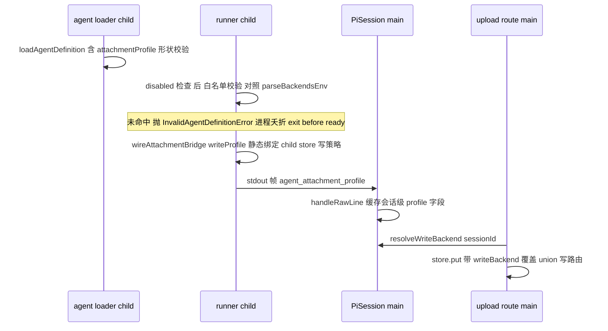

# Technical Design Document — agent-attachment-profile

## Overview

**Purpose**:让 agent 作者在定义中以纯名字声明产物落库目标(宿主注册的具名后端),交付给多 agent 共享宿主的运维者与 agent 作者。
**Users**:agent 作者声明 `attachmentProfile`;宿主运维者经白名单与关断开关保有最终控制权;终端用户无感。
**Impact**:在 `attachment-backend-pluggable` 已交付的多后端拓扑之上,把「写入目标」从宿主级静态单值下放为会话级可覆盖:agent-kit 加一个可选字段、协议加一种装配期帧、写路径开一个 per-call 覆盖口子。不声明的 agent 与未配置拓扑的宿主完全零变化。

### Goals
- agent 定义可选声明 profile 名;未注册 → 会话创建失败(白名单,2.x)。
- 该会话两条写入路径(上传/工具产物)落 profile 后端并固化描述符(3.x)。
- 运维可整体关断,关断 = 忽略声明回默认,不失败会话(5.x)。

### Non-Goals
- 按 route/按工具粒度写路由;运行期动态切换 profile。
- 读路由/探测链/描述符绑定语义(归上游 spec,本 spec 只消费)。

## Boundary Commitments

### This Spec Owns
- `AgentDefinition.attachmentProfile` 字段契约(agent-kit)。
- `agent_attachment_profile` 装配期帧的 schema、发射与消费。
- 子进程装配期白名单校验语义与关断语义(`PI_WEB_AGENT_ATTACHMENT_PROFILE_DISABLED`)。
- 写路径 per-call 覆盖口子:`BlobStore.put` 可选 `opts.writeBackend`、门面 `PutInput.writeBackend` 透传、union 的消费语义。
- 主进程 session→profile 投影(`PiSession` 字段)与上传路由的 `resolveWriteBackend` 注入。

### Out of Boundary
- 后端拓扑 schema/构建/passthroughEnv(归 `attachment-backend-pluggable`;本 spec 只调用 `parseBackendsEnv` 与消费名字集)。
- 描述符 `backend` 固化与读路由(上游已实现,本 spec 不改其语义——profile 只决定写目标,固化仍走既有回执链)。
- readiness handshake 协议(复用 exit-before-ready,不新增握手语义)。

### Allowed Dependencies
- 上游:`backends-config.parseBackendsEnv`、`UnionBlobStore`、`InvalidAgentDefinitionError`、装配期帧通道(stdout JSONL)、`pi-session.handleRawLine` 挂点。
- 依赖方向:`protocol` ← `agent-kit`(仅类型)← `server(runner/attachment/session/http)` ← `lib/app`。禁止反向。

### Revalidation Triggers
- `BlobStore.put` 签名再变更 → 上游 spec 的实现与 mock 复核。
- 帧类型集合变化 → `pi-session.handleRawLine` 分支与 protocol barrel 复核。
- 拓扑 schema 的名字规则变化 → 本 spec 的声明面校验规则同步。

## Architecture

### Existing Architecture Analysis
见 `research.md`:写路由 = 构造期静态闭包(`config.ts:139`);child store per-session、主进程 store 单例;失败链与帧通道均有现成先例(`InvalidAgentDefinitionError` → exit-before-ready;`agent_routes` 帧 → `pi-session` 会话级缓存)。

### 装配与写路径时序



**Architecture Integration**:
- Selected pattern:双轨写路由覆盖——子进程静态绑定(一会话一进程),主进程 per-call opts(单例门面)。选型对比见 research.md。
- 校验权威 = 子进程;主进程消费帧仅防御性核对(失配 warn+忽略,不二次失败)。
- 关断优先于校验:disabled → 不校验、不覆盖、不发帧(子)+ 丢弃帧(主)。

### Technology Stack
无新依赖、无新技术层;全部为既有 TypeScript strict 代码内的契约扩展。

## File Structure Plan

### 新增
```
packages/protocol/src/attachment/profile-frame.ts     # AgentAttachmentProfileFrameSchema(zod)+ 类型
packages/server/src/runner/attachment-profile-wiring.ts  # 装配期单帧发射(slash-completions 同族)+ disabled 门控
```

### 修改
- `packages/agent-kit/src/types.ts` — `AgentDefinition.attachmentProfile?: string`(JSDoc 说明白名单/凭据边界)(1.1/1.3)。
- `packages/protocol/src/index.ts` — barrel 导出新帧。
- `packages/server/src/runner/agent-loader.ts` — 归一化 profile 形状(非空字符串、`^[a-z0-9][a-z0-9-]*$` 与后端名同规);非法 → `InvalidAgentDefinitionError`(1.1/2.2 前半)。
- `packages/server/src/runner/runner.ts` — disabled 检查 → 白名单校验(对照 `parseBackendsEnv(process.env)`,未命中抛 `InvalidAgentDefinitionError` 含名字)→ 把 `writeProfile` 传入 `wireAttachmentBridge` → 调用 profile 帧 wiring(2.1/2.2/5.1)。
- `packages/server/src/runner/attachment-wiring.ts` — 入参加 `writeProfile?`,透传 `createChildAttachmentStore`(3.2)。
- `packages/server/src/attachment-bridge/child-store.ts` — `createChildAttachmentStore(env, opts?: { writeProfile?: string })`(3.2)。
- `packages/server/src/attachment/config.ts` — `attachmentStoreConfigFromEnv` options 加 `writeProfile?`:拓扑分支 writePolicy 改 `() => writeProfile ?? topology.write`,并校验 writeProfile ∈ 名字集(防御,失配抛既有配置错误)(3.2)。
- `packages/server/src/attachment/blob-store.ts` — `BlobStore.put(key, body, meta, opts?: PutOptions)`;`PutOptions = { readonly writeBackend?: string }`(3.1)。
- `packages/server/src/attachment/union-blob-store.ts` — `put` 消费 `opts.writeBackend`(优先于 writePolicy;未注册名字 throw 同语义)(3.1/3.3)。
- `packages/server/src/attachment/local-fs-backend.ts`、`s3/s3-blob-backend.ts` — 签名兼容(参数忽略)。
- `packages/server/src/attachment/attachment-store.ts` — `PutInput.writeBackend?: string` → 透传 `blob.put` 第 4 参(3.1)。
- `packages/server/src/session/pi-session.ts` — `handleRawLine` 消费 `agent_attachment_profile` 帧(zod 校验,disabled/失配 warn+丢弃)→ 会话级 `attachmentWriteProfile?: string` + 只读 getter(2.1/2.3)。
- `packages/server/src/http/routes/attachment-routes.ts` — `createAttachmentRoutes(store, opts?: { resolveWriteBackend?: (sessionId: string) => string | undefined })`;upload handler 解析后写进 `PutInput.writeBackend`(3.1)。
- `lib/app/pi-handler.ts` — 注入 resolver(经 manager 查 `PiSession` getter);`attachmentSpawnEnv` 下发 `PI_WEB_AGENT_ATTACHMENT_PROFILE_DISABLED`(3.1/5.1)。

## Components and Interfaces

| Component | Domain | Intent | Requirements | Contracts |
|---|---|---|---|---|
| `AgentDefinition.attachmentProfile` | agent-kit 声明面 | 纯名字声明,无凭据通道 | 1.1, 1.3 | State |
| loader/runner 校验 | runner | 形状 + 白名单 + 失败链复用 | 1.1, 2.1, 2.2, 2.3 | Service |
| `attachment-profile-wiring` | runner | 装配期单帧发射 + disabled 门控 | 2.3, 5.1 | Event |
| `AgentAttachmentProfileFrame` | protocol | `{type:"agent_attachment_profile", profile}` | 2.3 | Event |
| `PiSession` 帧消费 | session | 会话级 profile 投影 + 防御核对 | 2.1, 2.3 | State |
| `PutOptions.writeBackend` 链 | attachment | per-call 写目标覆盖(port→union→门面) | 3.1, 3.3 | Service |
| child store 静态绑定 | attachment-bridge | `writeProfile` 覆盖 writePolicy | 3.2, 3.3 | Service |
| 上传路由 resolver | http | session→profile 解析注入 | 3.1 | API |
| spawn env 下发 | assembly | DISABLED env 抵达子进程 | 5.1, 5.2 | State |

### 核心契约

```ts
// protocol
export const AgentAttachmentProfileFrameSchema = z.object({
  type: z.literal("agent_attachment_profile"),
  profile: z.string().min(1),
});

// blob-store.ts(端口;所有实现签名兼容,仅 union 消费)
export interface PutOptions { readonly writeBackend?: string }
export interface BlobStore {
  put(key: string, body: Uint8Array | NodeJS.ReadableStream, meta: BlobMeta, opts?: PutOptions): Promise<PutReceipt>;
  // 其余不变
}

// union:决策优先级 opts.writeBackend > writePolicy(meta);未注册名字 → throw(既有语义)
// 门面:PutInput 加 writeBackend?: string,原样透传;描述符固化仍走 receipt.backendName(不变)
// child-store:createChildAttachmentStore(env, opts?: { writeProfile?: string })
// config:attachmentStoreConfigFromEnv(env, { urlBasePath?, writeProfile? })
// attachment-routes:createAttachmentRoutes(store, opts?: { resolveWriteBackend?: (sessionId: string) => string | undefined })
```

**行为规约**:
- 校验顺序(子进程装配期):`DISABLED` 生效 → 全部跳过视同未声明;否则声明存在 → 形状校验(loader)→ 白名单校验(runner,`parseBackendsEnv(env)` 为 undefined 即空白名单 → 必失败)→ 通过后绑定 + 发帧。
- 主进程帧消费:zod 失败或 DISABLED → warn+丢弃;名字不在主进程拓扑 → warn+丢弃(env 漂移防御,不失败——子进程为权威)。
- resolver 查无会话/无 profile → `undefined` → union 走宿主默认 writePolicy(1.2/3.3)。

## Error Handling
- 声明形状非法 / 白名单未命中 → `InvalidAgentDefinitionError`(既有类型,message 含 profile 名与已注册名字集)→ exit-before-ready → 会话创建失败(2.2)。
- `opts.writeBackend` 未注册(理论不至,resolver 只回缓存值)→ union 既有 throw 语义,分发为 500(防御路径)。
- 无新错误类型。

## Testing Strategy

### Unit
1. loader 归一化:合法/空串/非法字符 → `InvalidAgentDefinitionError`(1.1)。
2. runner 白名单:命中通过;未命中(含无拓扑)抛错含名字;DISABLED 时非法名字也不抛且不发帧(2.1/2.2/5.1)。
3. profile-wiring:发帧形状;DISABLED 零帧(2.3/5.1)。
4. `pi-session` 帧消费:合法缓存;畸形/DISABLED/名字失配 warn+丢弃不失败(2.1/2.3/5.1)。
5. union `put` opts:writeBackend 优先于 writePolicy;未注册 throw;不传 = 现状(3.1/3.3/1.2)。
6. 门面透传:`PutInput.writeBackend` → blob.put 第 4 参;描述符固化不变(3.1)。
7. config `writeProfile`:writePolicy 覆盖;失配抛配置错误;不传 = 现状(3.2/1.2)。
8. 上传路由:注入 resolver 后 put 携带 writeBackend;resolver 回 undefined 走默认(3.1/1.2)。

### Integration
9. 真实子进程(复用 Spec 1 的 fixture 形态):definition 声明 profile → child store `putOutput` 落 profile 后端且描述符固化该名(3.2)。
10. 真实子进程:未注册 profile → 子进程 ready 前退出(exit code ≠ 0),主进程侧断言 exit-before-ready(2.2)。
11. 双会话隔离:profile 会话与未声明会话各落其目标(3.3)。
12. 生命周期:profile 会话落库 → 新建门面实例(模拟重启)按描述符读回与签发(4.1/4.2;进程级重启等价性已由上游 spec 的 e2e 证明,本 spec 验证 profile 落库对象走同一描述符权威链)。
13. DISABLED 双侧:仅主进程设 / 经 spawn 下发两态,会话正常创建、写入落宿主默认(5.1/5.2)。

### 回归
14. 全仓 typecheck + 既有 attachment/union/上传路由测试零改动全绿(1.2 的结构性证明:全部新参数可选)。

## Security
- agent 面只有 `attachmentProfile?: string`,类型层面不存在凭据/端点字段(1.3)。
- 白名单权威在子进程装配期,宿主拓扑 env 为唯一名字来源;主进程防御性二次核对。
- 关断开关服务端权威、装配期读取,与 `PI_WEB_AGENT_ROUTES_DISABLED` 同风格。

## Requirements Traceability

| Requirement | Components |
|---|---|
| 1.1–1.3 | agent-kit 字段、loader 形状校验、全参数可选回归 |
| 2.1–2.3 | runner 白名单、帧 wiring、PiSession 消费、exit-before-ready 链 |
| 3.1–3.3 | PutOptions 链、child store 静态绑定、上传 resolver、双会话隔离 |
| 4.1–4.2 | 描述符权威链集成验证(消费上游语义) |
| 5.1–5.2 | DISABLED 双侧门控 + spawn 下发 |
