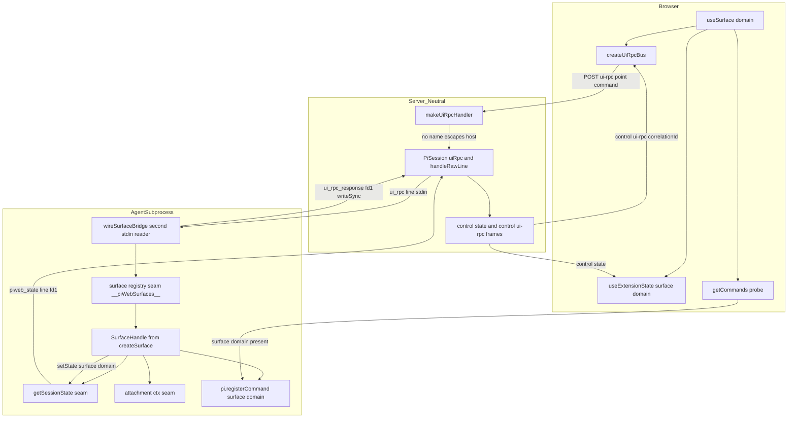
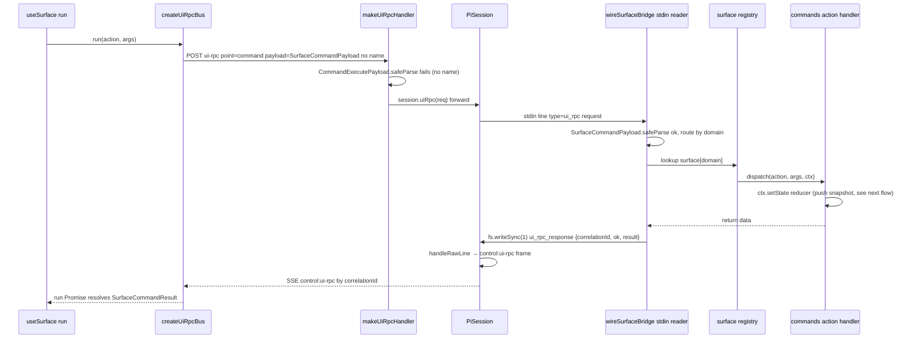
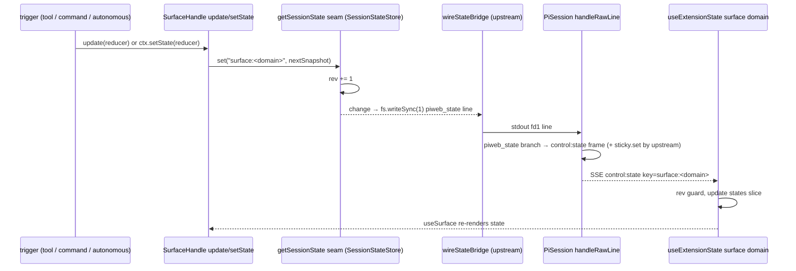
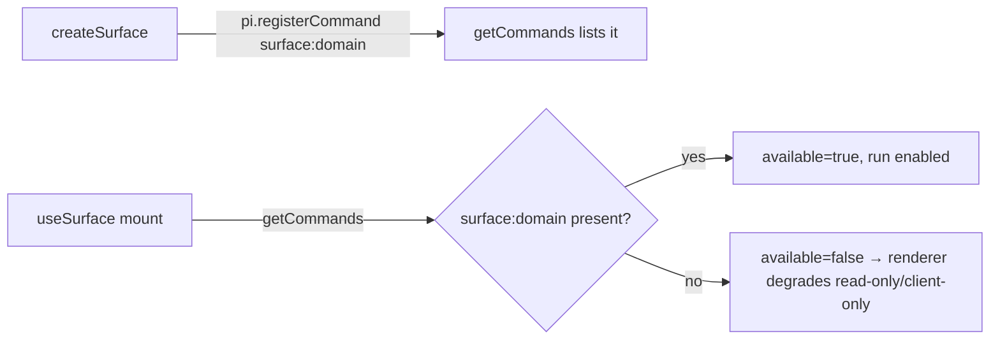

# Design Document — agent-authoritative-surface

> 语言:zh。权威 pre-spec 设计:`docs/agent-authoritative-surface-design.md`(范式、五通道、接口草案、实证结论、未决清单)。本设计与其一致,并把每个决策落到**真实代码接缝**(逐行核对,见 `research.md`)。基于 pi 的真实能力面(pi 是 npm 依赖,本仓无源码;事实源 = `node_modules` d.ts + repo 内既有接缝)。本设计**不改 pi 框架/协议结构、不新增 REST route、不认领任何领域语义**。

## Overview

**Purpose**:把"富交互 UI surface = agent 进程里某 `domain` 的瘦投影 + 命令发起端"这一已在 pi-web 跑通三次却未命名的 **CQRS 范式**,提炼为按 `domain` 命名的 SDK。状态权威永在 agent 子进程,UI 只镜像快照(`control:"state"` 下行)、只发结构化命令(Tier3 ui-rpc 上行),宿主做**领域无关**的中立搬运。

**Users**:agent 作者(`createSurface({domain, initialState, commands, hydrate})` 持权威 state + 派发命令 + 重建);UI 开发者(`useSurface(domain) → {state, run, available, rev}` 镜像 + 发命令 + 能力驱动退化);终端用户(在富 surface 上直接交互,命令不过 LLM)。

**Impact**:在既有 `state-injection-bridge`(下行 KV 桥)+ `unified-command-result-layer`(ui-rpc 命令)+ `attachment`(Bulk)之上加一层领域无关门面;并**补齐 `state-injection-bridge` 显式留下的缺口**——runner 子进程内没有真实的 ui-rpc 命令接收方(现仅 stub 有)。新建一个 surface 从"手接三条边"变成"填一个 config"。对未使用 AAS 的会话**零行为变化**。

### Goals
- agent 侧 `createSurface` 门面:持权威快照 + 派发结构化命令 + `hydrate` 钩子,全部复用现有 state 写入/attachment 原语。
- runner 子进程内**新建** ui-rpc 命令读取器 + 派发器(第二个 stdin reader),经 `fs.writeSync(1)` 回流。
- UI 侧 `useSurface` 复用 `useExtensionState` + `createUiRpcBus` + `getCommands` 探针。
- `SurfaceCommandPayload/Result` 细化 ui-rpc `unknown` payload/result(不改结构)。
- 宿主中立:grep `app/` + `packages/server` 无任何领域语义字符串。
- 单元 + 真实子进程集成 + 浏览器 e2e,新鲜运行证据。

### Non-Goals
- 任何具体 domain 落地(Canvas 归 `aigc-canvas`)。
- `control:"state"` 桥的**通用粘性帧修复本身**(归上游 `state-injection-bridge` 扩展;本 spec 消费它)。
- 任何新 REST 端点;`pi.appendEntry` 持久层。
- 宿主主进程 host 命令路径(surface 严禁走)。
- 路线 B(给 `ControlPayloadSchema` 封闭 union 松绑、类型化 snapshot);起步不需要。

## Boundary Commitments

### This Spec Owns
- **协议**:`SurfaceCommandPayloadSchema` / `SurfaceCommandResultSchema`(`packages/protocol/src/web-ext/surface.ts`),细化 ui-rpc 的 `unknown` payload/result;`SurfaceKey = \`surface:${string}\`` 类型别名。
- **agent 侧 SDK**:`createSurface(config)` → `SurfaceHandle`(`@blksails/pi-web-tool-kit` runtime 子入口),持权威快照、`update`/`dispatch`、注册探针命令、`hydrate` 钩子。含进程内 **surface 注册表** seam(`__piWebSurfaces__`)。
- **runner 接线**:`wireSurfaceBridge(runtime, input)`(`packages/server/src/runner/surface-wiring.ts`)—— 第二个 stdin JSONL 读取器截获 `{"type":"ui_rpc","request"}` 命令行 → 按 domain 派发 surface 注册表 → `fs.writeSync(1)` 回流 `ui_rpc_response`。惰性、优雅降级。
- **UI 侧**:`useSurface(domain)`(`@blksails/pi-web-react`),在 `useExtensionState` + `createUiRpcBus` + `getCommands` 之上封装 `{state, run, available, rev}`。
- **示例 + e2e**:`examples/surface-demo-agent`(领域无关的最小 counter/echo surface,验证 SDK 与退化,**不含 AIGC 语义**)+ 浏览器 e2e。

### Out of Boundary
- pi 框架/协议结构任何改动;`ControlPayloadSchema` 判别联合扩展(路线 B)。
- `control:"state"` 通用粘性帧修复(上游 `state-injection-bridge`;`pi-session.ts:580` 分支加 `sticky.set`)。本 spec 以"上游已就位"为前置。
- 任何 domain 业务(gallery/inpaint/血缘树 → `aigc-canvas`);`hydrate` 的**具体重建实现**(SDK 只定义钩子形态)。
- 新 REST 端点;宿主主进程 host 命令(`HostCommandRegistry`)对 surface 的认领。

### Allowed Dependencies
- pi 真实面:`pi.registerCommand`(探针)、`ExtensionAPI`/`ExtensionFactory`(装载形态,对齐 `aigcExtension`)。**不**依赖任何 `ctx.state`/持久 API(均不存在)。
- pi-web 既有接缝:`getSessionState()`(`tool-kit/session-state.ts:61`,写入原语)、`wireStateBridge`(`state-wiring.ts:83`,rev + fd1 下行 + 写回)、`getAttachmentToolContext()`(附件 seam,Bulk)、`ControlStore.states` + `useExtensionState`(`react`,镜像)、`createUiRpcBus`(`react/web-ext/ui-rpc-bus.ts:46`,命令)、`makeUiRpcHandler`(`command-routes.ts:281`,转发分流)、`PiSession.uiRpc`(`pi-session.ts:723`)、`getCommands`(`pi-session.ts:917`)、`SlotContribution`(`web-kit`,挂载)。
- 协议新增随 `protocolVersion`,遵循 protocol 包 semver。

### Revalidation Triggers
- `UiRpcRequestSchema` / `StateControlPayloadSchema` 结构变化 → surface schema 与 useSurface 需复验。
- pi 升级改动 `runRpcMode` 的 stdin 读取(`attachJsonlLineReader`)或 `takeOverStdout` → `wireSurfaceBridge` 需复验(与 `wireStateBridge` 同风险)。
- `makeUiRpcHandler` 的 host 拦截条件变化(若开始按 `domain` 拦截) → 命令转发路径需复验。
- 上游 `state-injection-bridge` 粘性修复未合并 → "刷新后 surface 仍在"退化,需复验前置。
- `protocolVersion` bump。

## Architecture

### Existing Architecture Analysis
- **进程模型**:Browser ─SSE/HTTP─ Next route handler ─JSONL─ agent 子进程(每会话一进程)。
- **方向性硬约束**:agent→server 仅 `event/response/extension_ui_request` 三类被 pi 分派;server→agent 仅 pi 封闭 `RpcCommand`。工具不能 pull,无 `ctx.state` ⇒ CQRS 是唯一稳定解。
- **现成接缝(复用)**:下行 `control:"state"`(`web-ext/state.ts:15`)+ `getSessionState()` 写入原语;上行 ui-rpc(`web-ext/ui-rpc.ts`)+ `createUiRpcBus`;命令分流 `makeUiRpcHandler`(无 `name` 逃逸 host 拦截 → `session.uiRpc` 转发);Bulk `att_`;挂载 `SlotContribution`。
- **关键缺口(新建)**:`PiSession.uiRpc`(`pi-session.ts:726`)把命令作为 `{"type":"ui_rpc","request"}` 写子进程 stdin,但**除 stub(`stub-agent-process.mjs:623`)外无真实接收方**。AAS 自建 `wireSurfaceBridge` 补齐,与 `wireStateBridge` 第二 stdin reader 同构。

### Architecture Pattern & Boundary Map

**选定模式**:单一权威 + 镜像视图 + 命令转发(CQRS)。权威快照在子进程(`getSessionState` KV,`key=surface:<domain>`),server 领域无关转发,UI 只读镜像 + 命令代理。



**关键决策**:
- 命令**必须**走 agent 转发(拿 provider/编排器);`SurfaceCommandPayload` 无 `name` ⇒ `CommandExecutePayloadSchema.safeParse` 失败 ⇒ 逃逸 host 拦截(`command-routes.ts:299-300`)⇒ `session.uiRpc` 转发。**并**在 `wireSurfaceBridge` 内以 `SurfaceCommandPayloadSchema` **显式**匹配 + 按 `domain` 路由(不只依赖隐晦逃逸,派发可读可测)。
- 命令回流 `ui_rpc_response` 与状态下行 `piweb_state` 都**必须 `fs.writeSync(1)` 直写 fd1**(`takeOverStdout` 吞 `process.stdout.write`)。
- setState 复用 `getSessionState().set("surface:<domain>", snapshot)`,rev + fd1 下行由 `wireStateBridge` 承担,AAS 不自造 state 帧。
- Capability 经 `pi.registerCommand("surface:<domain>")` + 前端 `getCommands` 探针。

### Technology Stack

| Layer | Choice / Version | Role in Feature | Notes |
|-------|------------------|-----------------|-------|
| Protocol | zod 3 + `@blksails/pi-web-protocol` | `SurfaceCommandPayload/Result` schema(细化 ui-rpc unknown) | 不改 UiRpc 结构;随 protocolVersion |
| Agent SDK | `@blksails/pi-web-tool-kit`(runtime 子入口) | `createSurface` + surface 注册表 seam | 含 pi 值导入,不进前端 bundle;对齐 `aigcExtension` |
| Runner | `@blksails/pi-web-server` runner 层 + Node 子进程 | `wireSurfaceBridge`(第二 stdin reader + fd1 回流) | 对齐 `wireStateBridge` |
| UI | React 19 + `@blksails/pi-web-react` | `useSurface`(封装 useExtensionState + uiRpcBus + getCommands) | 对齐 `useExtensionState` |
| Bulk | attachment store(签名 URL) | 二进制永不进帧 | 复用现成基础设施 |
| 挂载 | `@blksails/pi-web-kit` `SlotContribution` | surface 渲染器具名槽 | 不新造 renderer |

## File Structure Plan

### 新增文件
```
packages/protocol/src/web-ext/
└── surface.ts                    # SurfaceCommandPayloadSchema / SurfaceCommandResultSchema + SurfaceKey 类型

packages/tool-kit/src/surface/
├── create-surface.ts             # createSurface(config) → SurfaceHandle;写 __piWebSurfaces__ seam;setState 经 getSessionState;probe via pi.registerCommand
├── surface-registry.ts           # 进程内 surface 注册表 seam(__piWebSurfaces__)读写(get/register),纯逻辑可单测
└── index.ts                      # runtime 子入口 barrel(createSurface 等)

packages/server/src/runner/
└── surface-wiring.ts             # wireSurfaceBridge:第二 stdin reader 截获 ui_rpc 命令行 → 查注册表 seam 派发 → fs.writeSync(1) 回流;惰性 + 降级

packages/react/src/hooks/
└── use-surface.ts                # useSurface(domain) → {state, run, available, rev}

examples/surface-demo-agent/      # 领域无关最小 surface(counter/echo)+ 退化演示;e2e/集成夹具(无 AIGC 语义)
├── index.ts
├── README.md
└── .pi/web/web.config.tsx        # SlotContribution 具名槽挂 SurfaceDemoPanel
```

### 修改文件
- `packages/protocol/src/web-ext/index.ts` — barrel 导出 `surface.ts`。
- `packages/tool-kit/src/runtime.ts`(或 runtime 子入口 barrel）— 导出 `createSurface`。
- `packages/server/src/runner/runner.ts` — `startRunner` 内 `runRpcMode` **之前**(`wireStateBridge` 之后)调 `wireSurfaceBridge(runtime, {sessionId})`。
- `packages/react/src/index.ts`(或 hooks barrel)— 导出 `useSurface`。
- `lib/app/webext-registry.ts` — 注册 `surface-demo-agent` 的 `.pi/web`(供 e2e 静态加载,绕签名门控,对齐既有示例)。
- `examples/README.md` — 注册 `surface-demo-agent` 行。

> 依赖方向:`protocol ← (tool-kit, server, react) ← app/examples`。新增文件不反向依赖。`create-surface.ts` 含 pi 值导入,仅经 `@blksails/pi-web-tool-kit/runtime` 子入口加载(与 `aigcExtension` 同,不进前端 bundle)。

## System Flows

### 命令上行 → 子进程派发 → 回流(② UI 直接触发,LLM 不在场)


回流用 `fs.writeSync(1)`:`takeOverStdout` 把 `process.stdout.write` 转 stderr,只有 fd1 直写能被 server 的 `PiRpcProcess` 读到(与 `state-wiring.ts:113-126` 同)。非 surface 命令行(其它 point / 无匹配 payload)`wireSurfaceBridge` 放行,交 pi / webext(对齐 `state-wiring` 的 `continue`)。

### 状态下行(quad:① 工具触发 / ② 命令内 setState / ③ agent 自主)


> 粘性登记(`sticky.set(\`state:${key}\`, frame)`)在宿主 `PiSession`,由**上游 state-injection-bridge 扩展**提供(本 spec 前置);刷新后回放靠它。子进程重启的恢复靠 `hydrate()`(领域实现)重建后再 set 推粘性快照。

### 能力探针 + 退化


## Requirements Traceability

| Requirement | Summary | Components | Interfaces / Contracts | Flows |
|-------------|---------|------------|------------------------|-------|
| 1.1-1.6 | createSurface 门面 + hydrate | create-surface, surface-registry | `SurfaceHandle`, `SurfaceConfig` | 状态下行 |
| 2.1-2.6 | 命令走 agent 转发(无 name 逃逸) | use-surface, makeUiRpcHandler(既有), PiSession.uiRpc(既有) | `SurfaceCommandPayload` | 命令上行 |
| 3.1-3.6 | runner ui-rpc 接收派发 + fd1 回流 | wireSurfaceBridge | `WireSurfaceBridge` | 命令上行 |
| 4.1-4.5 | useSurface hook | use-surface | `UseSurfaceResult` | 状态下行 / 命令上行 |
| 5.1-5.5 | 能力探针 + 退化 | create-surface(probe), use-surface(available) | `pi.registerCommand`, `getCommands` | 能力探针 |
| 6.1-6.5 | payload/result 契约 | protocol/web-ext/surface.ts | `SurfaceCommandPayloadSchema` 等 | — |
| 7.1-7.3 | Bulk att_ | create-surface(ctx.attachments) | `AttachmentToolContext` | 命令上行 |
| 8.1-8.4 | 宿主中立 | 全组件(value/payload unknown) | — | 全流程 |
| 9.1-9.4 | 包边界 + 挂载 | tool-kit runtime / server / react / protocol / SlotContribution | — | — |
| 10.1-10.5 | 测试/e2e/strict | 全组件 + surface-demo-agent | — | 见测试策略 |

## Components and Interfaces

| Component | Layer | Intent | Req | Key Deps (P0/P1) | Contracts |
|-----------|-------|--------|-----|------------------|-----------|
| surface.ts(protocol) | protocol | 命令 payload/result schema | 6.x | zod(P0), ui-rpc(P0) | API |
| createSurface | tool-kit(runtime) | 权威快照 + 派发 + 探针 + hydrate | 1.x,5.1,7.x | getSessionState(P0), attachment seam(P0), pi.registerCommand(P0) | Service, State |
| surfaceRegistry | tool-kit(runtime) | 进程内 domain→handle 注册表 seam | 1.1,3.2 | 无 | State |
| wireSurfaceBridge | server/runner | 第二 stdin reader 派发 + fd1 回流 | 3.x | surfaceRegistry seam(P0), 子进程 stdin/stdout(P0) | Service |
| useSurface | react | 镜像 + run + available + rev | 4.x,5.2-5.4 | useExtensionState(P0), createUiRpcBus(P0), getCommands(P0) | Service, State |
| surface-demo-agent | examples | 领域无关最小 surface + 退化夹具 | 10.4 | createSurface(P0), SlotContribution(P0) | — |

### protocol 层

#### web-ext/surface.ts
**Contracts**: API [x]
```typescript
import { z } from "zod";

/** surface state 快照的 key 约定:与探针命令同名段。 */
export type SurfaceKey = `surface:${string}`;

/** point="command" / action="execute" 时,surface 命令的 payload 细化(无顶层 name,以逃逸 host 拦截)。 */
export const SurfaceCommandPayloadSchema = z.object({
  domain: z.string().min(1),
  action: z.string().min(1),
  args: z.unknown().optional(),
});
export type SurfaceCommandPayload = z.infer<typeof SurfaceCommandPayloadSchema>;

/** ui-rpc response.result 的 surface 细化。 */
export const SurfaceCommandResultSchema = z.object({
  domain: z.string().min(1),
  action: z.string().min(1),
  ok: z.boolean(),
  data: z.unknown().optional(),
  error: z.object({ code: z.string(), message: z.string() }).optional(),
});
export type SurfaceCommandResult = z.infer<typeof SurfaceCommandResultSchema>;
```
- 不改 `UiRpcRequestSchema` / `UiRpcResponseSchema` / `UiRpcControlPayloadSchema`(6.3);不新增顶层 control 帧(6.5)。

### tool-kit(runtime)层

#### surfaceRegistry(State 契约)
| Field | Detail |
|-------|--------|
| Intent | 进程内 `domain → SurfaceHandle` 注册表,挂 globalThis seam `__piWebSurfaces__` |
| Requirements | 1.1, 3.2 |

**Responsibilities & Constraints**
- `register(domain, handle)` / `get(domain)`;seam 供 `wireSurfaceBridge`(server 层)在派发时**懒读**(装配顺序无关,对齐 state seam)。
- 纯进程内、同步、零落盘。seam key 常量与 server 端一致(`SURFACE_REGISTRY_SEAM_KEY = "__piWebSurfaces__"`)。

```typescript
export const SURFACE_REGISTRY_SEAM_KEY = "__piWebSurfaces__";
export interface SurfaceDispatch {
  dispatch(action: string, args: unknown): Promise<SurfaceCommandResult>;
}
export interface SurfaceRegistry {
  register(domain: string, entry: SurfaceDispatch): void;
  get(domain: string): SurfaceDispatch | undefined;
}
/** 读/建 globalThis 上的注册表(server 侧 wireSurfaceBridge 亦读同一 seam)。 */
export function getSurfaceRegistry(scope?: Record<string, unknown>): SurfaceRegistry;
```

#### createSurface(Service + State 契约)
| Field | Detail |
|-------|--------|
| Intent | 按 domain 持权威快照、派发命令、注册探针、hydrate |
| Requirements | 1.1-1.6, 5.1, 7.x |

**Responsibilities & Constraints**
- `initialState` 默认值下沉函数体(1.5)。
- `update`/`ctx.setState` → `getSessionState().set("surface:<domain>", nextSnapshot)`(**不自造 control 帧**;rev + fd1 由 `wireStateBridge` 承担,1.2)。
- `dispatch(action, args)` → `commands[action]`,并把结果**归一化**为 `SurfaceCommandResult`(判别联合契约):
  - handler 返回普通值 → 包成 `{ok:true, data}`;
  - handler 返回 `{ok:false, error:{code,message}}`(**非抛错**失败路径,如下游 `runImageTool` 返回 `details.ok===false`)→ 原样透传 `{ok:false, error}`,保留稳定领域 `code`(如 `edit_failed`);
  - handler **抛出** error → 捕获成 `{ok:false, error}`,`error.code` 优先取 error 上的 `.code`(如 `SurfaceCommandError{code}`),无 code 时用兜底 `"dispatch_failed"`(3.5);
  - 缺失 action → `ok:false` `error.code="unknown_action"`(1.4)。
- 注册进 `getSurfaceRegistry().register(domain, {dispatch})`(3.2)。
- 探针:经 `pi.registerCommand("surface:<domain>", …)` 注册只读命令,使 `getCommands` 可见(5.1)。故 `createSurface` 需 pi ExtensionAPI —— 以 `ExtensionFactory` 形态装载(对齐 `aigcExtension`)。
- `hydrate?()` 在装配期由 SDK 调用(重建初始快照后 `set` 推粘性快照,1.6);SDK 只定义钩子,重建实现由领域填。

**Contracts**: Service [x] State [x]
```typescript
import type { AttachmentToolContext } from "@blksails/pi-web-agent-kit";
import type { SurfaceCommandResult } from "@blksails/pi-web-protocol";

export interface SurfaceCtx<S> {
  get(): S;
  /** 改快照并经 state-injection-bridge 写入原语推 control:"state" 帧(内部走 getSessionState().set)。 */
  setState(reducer: (prev: S) => S): void;
  /** 复用现有 attachment 工具上下文(Bulk:resolve att_ / putOutput)。 */
  attachments: AttachmentToolContext;
}

/** 处理器返回判别联合:成功值(→ dispatch 包成 {ok:true,data})或**非抛错**显式失败(→ dispatch 透传 {ok:false,error},保留稳定领域 code)。 */
export type SurfaceCommandHandlerResult =
  | SurfaceCommandResult["data"]
  | { ok: false; error: { code: string; message: string } };

export type SurfaceCommandHandler<S> = (
  args: unknown,
  ctx: SurfaceCtx<S>,
) => Promise<SurfaceCommandHandlerResult> | SurfaceCommandHandlerResult;

/** 处理器可抛出的携码错误;其 `.code` 由 dispatch 传播进 SurfaceCommandResult.error.code。 */
export class SurfaceCommandError extends Error {
  constructor(readonly code: string, message: string) {
    super(message);
  }
}

export interface SurfaceConfig<S> {
  domain: string;
  initialState: S;                                   // 默认值下沉函数体
  commands: Record<string, SurfaceCommandHandler<S>>;
  hydrate?(): Promise<S>;                            // 子进程(重)启动时从领域数据源重建
}

export interface SurfaceHandle<S> {
  readonly domain: string;
  /** ① 触发源:确定性代码直接改快照(推下行帧)。 */
  update(reducer: (prev: S) => S): void;
  /** ② 触发源:由 wireSurfaceBridge 命中 commands[action]。 */
  dispatch(action: string, args: unknown): Promise<SurfaceCommandResult>;
  /** 回放最新快照(粘性,重连收敛):经 setState 重推当前快照。 */
  replay(): void;
}

/** 以 ExtensionFactory 形态装载:createSurface 在工厂内经 pi 注册探针命令,并写注册表 seam。 */
export function createSurface<S>(pi: ExtensionAPI, config: SurfaceConfig<S>): SurfaceHandle<S>;
```

**Implementation Notes**
- Integration:agent `index.ts` 经 `extensions: [(pi) => { createSurface(pi, {...}); }]` 装载(对齐 `aigcExtension`);slot 渲染器在 `.pi/web`。
- Validation:单测断言 `update` 调 `getSessionState().set` 传对 key/snapshot;`dispatch` 未知 action → `ok:false`;探针经注入的 fake `pi.registerCommand` 被调。
- Risks:探针注册需 pi(工厂形态);若作者未装载工厂 → `available=false` → 退化(仍可用,5.3)。

### server/runner 层

#### wireSurfaceBridge(Service 契约)
| Field | Detail |
|-------|--------|
| Intent | 子进程内接收 ui_rpc 命令行 → 按 domain 派发注册表 → fd1 回流 |
| Requirements | 3.1-3.6 |

**Responsibilities & Constraints**
- 在 `runRpcMode` **之前**挂第二个 stdin JSONL 读取器(对齐 `state-wiring`),截获 `{"type":"ui_rpc","request":UiRpcRequest}`。
- 仅当 `req.point==="command"` && `req.action==="execute"` && `SurfaceCommandPayloadSchema.safeParse(req.payload).success` 时消费;否则**放行**(不干预,交 pi / webext,3.4)。
- 按 `payload.domain` 查 `getSurfaceRegistry().get(domain)`;命中 → `dispatch(action, args)`;未注册 → `ok:false` `error.code="surface_not_registered"`(3.5)。
- 回流经 `fs.writeSync(1, JSON.stringify({type:"ui_rpc_response",response})+"\n")` 直写 fd1(3.3);单次原子写(不半行,R-2)。
- 惰性:无 surface 注册时仍挂 reader 但所有命令回 `surface_not_registered`(或注册表空即放行,不破坏无 AAS 会话,3.6);env/挂载失败 → 记诊断 no-op 降级(对齐 `wireStateBridge`)。

**Contracts**: Service [x]
```typescript
export interface WireSurfaceBridgeInput {
  readonly sessionId: string;
  stdin?: NodeJS.ReadableStream;             // 默认 process.stdin(测试可注入)
  stdout?: { write(s: string): unknown };    // 默认 fs.writeSync(1)(测试可注入捕获)
  stderr?: { write(s: string): unknown };
  globalScope?: Record<string, unknown>;     // 默认 globalThis(读 __piWebSurfaces__)
}
export interface SurfaceBridgeWiring {
  readonly installed: boolean;
  cleanup(): void;
}
export function wireSurfaceBridge(
  runtime: AgentSessionRuntime,
  input: WireSurfaceBridgeInput,
): SurfaceBridgeWiring;
```

**Implementation Notes**
- Integration:`runner.ts startRunner` 在 `wireStateBridge(...)` 之后、`return runRpcMode(runtime)` 之前调用。
- Validation:真实子进程集成测试断言"发 ui_rpc 命令行 → dispatch → fd1 出现 ui_rpc_response 行 → server 合成 control:ui-rpc 帧";并断言命令内 setState → piweb_state 行 → control:state 帧(10.3)。
- Risks:与 `wireStateBridge`、pi reader 共存(R-1);非匹配行必须放行(避免吞 pi 命令)。

### react 层

#### useSurface(Service + State 契约)
| Field | Detail |
|-------|--------|
| Intent | 镜像 surface 快照 + run 命令 + 能力探针 + rev |
| Requirements | 4.1-4.5, 5.2-5.4 |

**Responsibilities & Constraints**
- `state`/`rev`:基于 `useExtensionState("surface:<domain>")` 读 `ControlStore.states[key]`(rev 守卫已在 `applyControlFrame`);未就绪 `state=null`(4.2/4.3/4.5)。
- `run(action, args?)`:经注入的 ui-rpc bus 发 `{point:"command", action:"execute", payload:{domain, action, args}}`;**不用** `client.uiRpcCommand`(host 同步路径);结果 `safeParse(SurfaceCommandResultSchema)` 后解析(4.4/2.3)。
- `available`:挂载时 `getCommands()` 查 `surface:<domain>` 是否存在(5.2);`false` → 调用方退化(5.3)。

```typescript
export interface UseSurfaceResult<S> {
  state: S | null;
  run(action: string, args?: unknown): Promise<SurfaceCommandResult>;
  available: boolean;
  rev: number;
}
export function useSurface<S>(domain: string): UseSurfaceResult<S>;
```

### 挂载(SlotContribution)
surface 渲染器经具名槽注册(复用 `web-kit` `SlotContribution`,不新造 renderer):
```tsx
// agent source 的 .pi/web(示意,领域无关 demo)
export default defineWebExtension({
  manifestId: "surface-demo",
  slots: { "panelRight": SurfaceDemoPanel },   // 槽名对宿主不透明
});
```

## Data Models

### Domain Model
- 聚合根:`SurfaceHandle<S>`(每 domain 一实例,子进程内),权威快照 `S`。
- 快照存储:复用 `SessionStateStore` 的 `key="surface:<domain>"` 条目(rev 单调,`wireStateBridge` 管理)。
- 注册表:`__piWebSurfaces__` seam(`domain → SurfaceDispatch`)。
- 不变量:权威只在子进程;二进制永不进快照/命令(只 `att_` 引用);命令返回"发生了什么",快照才是"现在是什么"。

### Data Contracts
- 命令上行:ui-rpc `payload = SurfaceCommandPayload`(随 protocolVersion)。
- 命令下行:`control:"ui-rpc"` 的 `response.result = SurfaceCommandResult`。
- 状态下行:`control:"state"` 帧(`key="surface:<domain>"`,既有 schema)。
- 内部行:`{"type":"ui_rpc","request"}`(下发,既有)/ `{"type":"ui_rpc_response","response"}`(fd1 回流,既有约定,AAS 新增真实生产者)/ `piweb_state`(既有)。
- 兼容:不改任何既有 schema 结构;surface schema 在消费侧细化 `unknown`。

## Error Handling

### Strategy
- **命令校验**:`wireSurfaceBridge` 对 `SurfaceCommandPayloadSchema` safeParse 失败 → 放行(非 surface 命令),不回错帧(3.4)。
- **dispatch 归一化(判别联合)**:`createSurface.dispatch` 把 handler 结果统一成 `SurfaceCommandResult` —— 成功值包 `{ok:true,data}`;handler 返回 `{ok:false,error}`(**非抛错**失败,如 `runImageTool` 的 `details.ok===false`)透传,保留稳定领域 `code`(如 `edit_failed`);handler **抛出** error 时 `error.code` 优先取 `.code`(如 `SurfaceCommandError{code}`),无则兜底 `"dispatch_failed"`。
- **未注册 domain / 未知 action / handler 显式失败 / 处理器抛出**:一律回 `ok:false` + 稳定 `error.code`(`surface_not_registered` / `unknown_action` / handler 透传领域码 / 抛错取 `.code` 兜底 `dispatch_failed`),不崩会话(1.4/3.5)。
- **超时/发送失败**:`createUiRpcBus` 既有 `TIMEOUT`/`SEND_FAILED`/`ABORTED` 以 `ok:false` 结算(2.6)。
- **能力缺失**:`available=false` → 渲染器退化,不发命令(5.3)。
- **降级**:`wireSurfaceBridge` 挂载失败 → 记诊断 no-op,会话正常起 prompt(3.6,对齐 `wireStateBridge`)。
- **fd1 半行**:回流单次 `writeSync(1, line+"\n")` 原子(R-2)。

### Monitoring
- runner 经 `createLogger({namespace:"agent:surface"})`(或 `runner:*`)记 wiring 安装/派发/降级;server 复用既有 ui-rpc/state 日志。

## Testing Strategy

### Unit Tests
1. `surface.ts` schema:`SurfaceCommandPayload`(无 name 合法、缺 domain/action 拒绝)、`SurfaceCommandResult` round-trip(6.1/6.2)。
2. `surfaceRegistry`:register/get/未注册返回 undefined;seam 读写隔离(1.1/3.2)。
3. `createSurface`:`update`→注入 fake `getSessionState().set` 收到 `("surface:<domain>", snapshot)`;`dispatch` **归一化**——命中普通返回值(包 `{ok:true,data}`)/ 未知 action(`ok:false`,`unknown_action`)/ handler **非抛错** 返回 `{ok:false,error}`(透传领域 `code` 如 `edit_failed`)/ 处理器抛出(捕获 `ok:false`,`SurfaceCommandError{code}` 的 `.code` 传播、无 code 兜底 `dispatch_failed`);探针经 fake `pi.registerCommand` 注册(1.2/1.4/5.1)。
4. `wireSurfaceBridge`(注入 stdin/stdout/registry):ui_rpc 命令行→dispatch→注入 stdout 出现 `ui_rpc_response`;非 surface 行放行(不写回);未注册 domain→`surface_not_registered`(3.1/3.2/3.4/3.5)。
5. `useSurface`:state 由 `ControlStore.states["surface:<domain>"]` 镜像 + rev 收敛;`run` 经 bus 发对形 payload、按 correlationId 解析;`available` 由 `getCommands` 探针(4.x/5.2)。

### Integration Tests(真实 agent 子进程)
1. **fd1 回流坑**:真实子进程装 `wireSurfaceBridge` + 一个 surface;server 发 ui-rpc 命令(经 `PiSession.uiRpc`)→ 子进程派发 → **fd1** 出现 `ui_rpc_response` → server `handleRawLine` 合成 `control:"ui-rpc"` 帧(3.3,stub 抓不到)。
2. **命令内 setState 下行**:命令处理器 `ctx.setState` → `piweb_state` 行(fd1)→ `control:"state"` 帧(`key="surface:<domain>"`,1.2/10.3)。
3. **hydrate**:装配期 `hydrate()` 重建初始快照 → 推粘性快照路径可见(1.6)。
4. **降级/放行**:无 surface 注册时非 surface 命令(如 webext slash list)不被 `wireSurfaceBridge` 吞、既有链路正常(3.4/3.6/10.5)。

### E2E(浏览器,external server + 隔离 `NEXT_DIST_DIR`)
1. **命令闭环**:`surface-demo-agent` 挂载 → UI 点击触发 `run("increment")` → 转发 → 派发 → 快照回流 → 视图计数更新(命令不进 LLM,断言无 `/messages`,2.x/4.x/10.4)。
2. **退化**:切到非该 domain 的 source(如 `hello-agent`)→ `getCommands` 无 `surface:demo` → `available===false` → 渲染器退化只读、不报错(5.3/5.5/8.x)。
3.（若上游粘性已就位)**刷新回放**:命令后刷新页面 → 经粘性 `control:"state"` 回放,视图快照仍在(前置依赖 state-injection-bridge)。

### 宿主中立性验收
- grep `app/` + `packages/server` 无 `demo`/领域字符串出现在 value/payload 解析路径(仅示例夹具与 UI 渲染器含 domain 名,8.3)。

### 质量门
- 全工作区 `typecheck`(strict、无 `any`,10.1);protocol/tool-kit/server/react + app 受影响包 `pnpm test`(10.2);上述 e2e 新鲜运行绿(10.4)。

## Open Questions / Risks
- **OQ(已决,见 research §3)**:包边界折入既有包(不新建 surface-kit);探针自动注册;命令承载既确认(无 name 逃逸 + agent 转发 + runner 侧显式 SurfaceCommandPayload 匹配)。
- **R-1/2/3/4**:见 `research.md` 风险表(reader 共存放行 / fd1 原子写 / 粘性依赖上游 / 命令-快照时序窗口),均有缓解,不阻塞实现。
- **前置**:上游 `state-injection-bridge` 的通用粘性帧修复须先合并,否则"刷新后 surface 仍在"退化为空白(e2e 3 相应门控)。
