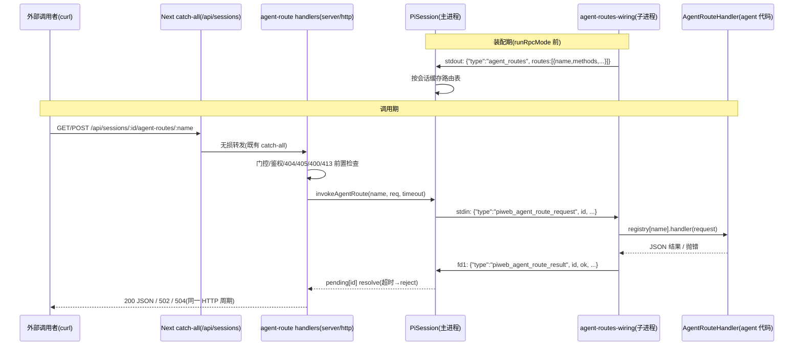

# Design Document — agent-declared-routes

## Overview

**Purpose**: 本特性让 agent source 作者在 agent 定义中声明具名 HTTP routes,pi-web 服务端将其挂载为以会话为锚的 HTTP 端点,请求转发进该会话的 agent 子进程处理并在同一 HTTP 请求-响应周期内同步返回,使外部系统(curl/webhook/第三方服务)无需订阅任何流即可调用 agent 能力。

**Users**: agent source 作者(声明面)、外部系统集成者(HTTP 调用面)、pi-web 运维者(安全门/配置面)。

**Impact**: 纯增量。新增 agent-kit 类型面(`AgentDefinition.routes`)、protocol 三个自建 JSONL 帧 schema、server 侧 runner 接线与 HTTP 端点、examples/aigc-canvas-agent 演示;不触碰 SSE 帧 union、不改前端包、不改宿主 `routes:` 注入接缝、不动 pi SDK。

### Goals
- agent 定义声明 routes → 会话命名空间 HTTP 端点自动可调(声明即生效)。
- 请求-响应闭环全同步(HTTP 响应体),错误语义确定(400/404/405/413/502/504/401/403)。
- 与既有安全面同门(请求级/会话级鉴权),含请求体上限与运维关断。
- 演示(aigc-canvas-agent)+ 文档 + 三层测试(单测/真实子进程集成/浏览器 e2e)。

### Non-Goals
- 流式/分块响应 route;不锚定会话的全局 routes;跨会话聚合调用。
- 宿主 `routes:` 注入接缝的任何行为变更;pi SDK 上游改动。
- 前端(react/ui 包)消费面;webhook 注册/回调编排。

## Boundary Commitments

### This Spec Owns
- `AgentDefinition.routes` 类型面与装配期校验规则(名称格式/唯一性/方法白名单 GET/POST)。
- 三个 pi-web 自建 JSONL 帧契约:`agent_routes`(装配期声明)、`piweb_agent_route_request` / `piweb_agent_route_result`(请求-响应对)。
- 会话命名空间端点 `GET /sessions/:id/agent-routes`(清单)与 `GET|POST /sessions/:id/agent-routes/:name`(调用)的行为与错误语义。
- runner 子进程侧 routes registry 与分发桥(`agent-routes-wiring`);PiSession 侧路由表缓存与同步配对(`invokeAgentRoute`)。
- stub agent 的演示 routes 支持(e2e 承载);examples/aigc-canvas-agent 演示与 README;产品手册对应章节。

### Out of Boundary
- SSE 帧 union 与 `control:*` 帧族(零触碰);`ui_rpc`/`ui_rpc_response` 既有翻译路径(零触碰)。
- host 命令注册表与统一命令层执行语义;surface/state/clearQueue 三条既有桥(只做同族并列,不改)。
- 附件、会话持久化、补全框架等相邻子系统。

### Allowed Dependencies
- `protocol ← 所有`(帧 schema 落 protocol);server 依赖 protocol;agent-kit 仅类型(零运行时依赖)。
- Router 的 `:param` 匹配、auth 双接缝、`validateBody`/`errorResponse`/`jsonResponse` 既有工具。
- runner 装配序接缝(`runRpcMode` 之前的 stdout 窗口与第二 stdin reader 模式)。

### Revalidation Triggers
- 帧契约(三帧任一)形状变更;端点路径/错误码字典变更。
- 装配序变更(若未来 runner 调整 `runRpcMode` 前窗口,声明帧与 stdin reader 需重验)。
- 鉴权接缝语义变更(authResolver/authorizeSession 行为调整需回归 4.1)。

## Architecture

### Existing Architecture Analysis
- 既有 ui-rpc agent 转发是 fire-and-ack + SSE 异步回流,不满足同步响应;同步配对先例是 clearQueue(pending map + 关联 id + 超时)。
- 声明下发先例是 `slash_completions`(装配期 stdout 帧 + PiSession 就绪门前缓存)。
- 子进程接收先例是 wireSurfaceBridge(第二 stdin reader,只消费自己的帧,回写 `fs.writeSync(1)` 直写 fd1)。
- 本设计对三个先例做同族复制,不发明新机制。方案评估与否决理由见 `research.md`(复用 ui_rpc 帧对因多路复用歧义被否决)。

### Architecture Pattern & Boundary Map



**Architecture Integration**:
- Selected pattern:声明帧(slash_completions 同族)+ 同步配对(clearQueue 同族)+ 子进程分发桥(surface-wiring 同族)。
- Domain boundaries:主进程只握纯数据路由表与配对;handler 函数只存在于子进程 registry(Req 4.4 的结构性保证)。
- Existing patterns preserved:SSE 帧 union 零新增(Req 7.1 零新增档);Router/auth/validate 复用。
- Steering compliance:`protocol ← server` 单向依赖;agent-kit 保持纯类型包。

### Technology Stack

| Layer | Choice / Version | Role in Feature | Notes |
|-------|------------------|-----------------|-------|
| Backend / Services | `@blksails/pi-web-server`(TS strict) | runner 接线、PiSession 配对、HTTP 端点 | 全部为既有包内新增模块 |
| 契约 | `@blksails/pi-web-protocol` + zod | 三帧 schema + route 声明 DTO | 不进 SSE 帧 union |
| Agent 套件 | `@blksails/pi-web-agent-kit` | `AgentDefinition.routes` 类型面 | 零运行时依赖不变 |
| Infrastructure | env:`PI_WEB_AGENT_ROUTES_DISABLED` / `PI_WEB_AGENT_ROUTE_TIMEOUT_MS`(默认 20000)/ `PI_WEB_AGENT_ROUTE_BODY_LIMIT`(默认 1 MiB) | 关断/超时/上限 | 服务端权威门控,关→404 |

## File Structure Plan

### New Files
```
packages/protocol/src/agent-routes/
└── frames.ts                 # AgentRouteDeclDto + AgentRoutesFrame + RequestFrame/ResultFrame zod schema 与类型

packages/server/src/runner/
└── agent-routes-wiring.ts    # 子进程侧:装配期声明帧发射 + 第二 stdin reader 分发 + fd1 结果回写 + handler registry

packages/server/src/http/routes/
└── agent-route-routes.ts     # GET 清单 + GET|POST 调用 两个 RouteHandler;门控/405/400/413/502/504 错误映射

packages/server/test/runner/agent-routes-wiring.test.ts      # wiring 单测(注入 write/stdin)
packages/server/test/session/pi-session-agent-routes.test.ts # 路由表缓存 + invokeAgentRoute 配对/超时单测
packages/server/test/http/agent-route-routes.test.ts         # HTTP 层错误语义单测
packages/server/test/integration/agent-routes-subprocess.test.ts # 真实子进程闭环集成(fixture agent 带 routes)

e2e/browser/agent-routes.e2e.ts   # stub 声明演示 routes;page.request 直调断言 + 对话 UI 零变化
```

### Modified Files
- `packages/protocol/src/index.ts` — 导出 agent-routes 契约(主入口,避子路径 alias 坑)。
- `packages/agent-kit/src/types.ts` — `AgentDefinition.routes?: AgentRouteDecl[]` + `AgentRouteHandler`/`AgentRouteRequest`/`AgentRouteDecl` 类型。
- `packages/server/src/runner/agent-loader.ts` — 归一化 `routes`(权威校验:名称 `^[a-z0-9][a-z0-9-]*$`、唯一、methods ⊆ {GET,POST};非法→抛含 route 名与原因的装配错误)。
- `packages/server/src/runner/runner.ts` — 装配序挂 `wireAgentRoutesBridge`(state/surface/clearQueue 之后、`runRpcMode` 之前)+ 装配期发声明帧。
- `packages/server/src/session/pi-session.ts` — `handleRawLine` 识别 `agent_routes`(就绪门前缓存,二次 zod 校验失败丢弃并记日志)与 `piweb_agent_route_result`(pending 配对);新增 `agentRoutes` 只读访问器与 `invokeAgentRoute(name, req, timeoutMs)`。
- `packages/server/src/http/create-handler.ts` — 注册两个 builtin 端点(读 env 门控;handler 工厂注入 store)。
- `lib/app/stub-agent-process.mjs` — stub 声明演示 routes(`gallery-stats` 等)并应答请求帧(e2e 承载)。
- `examples/aigc-canvas-agent/index.ts` — 声明演示 route `gallery-stats`(GET,返回 canvas/画廊统计 JSON)。
- `examples/aigc-canvas-agent/README.md` — 声明方式/URL 形态/取会话 id/完整 curl 示例与预期响应。
- `docs/product/13-http-api-reference.md` + `docs/product/07-agent-development.md` — 端点与声明面章节(zh;en 镜像同步)(Req 6.4)。

依赖方向:`protocol` ← `agent-kit`(仅类型)/`server`;`server/http` 与 `server/runner` 互不 import(经 protocol 契约与 PiSession 缝合)。

## Components and Interfaces

| Component | Domain | Intent | Requirements | Dependencies | Contracts |
|-----------|--------|--------|--------------|--------------|-----------|
| agent-routes 契约(protocol) | 契约 | 三帧 schema + 声明 DTO | 1.1, 7.1 | zod(Outbound/P0) | Event |
| `AgentDefinition.routes`(agent-kit) | 声明面 | 作者声明类型 | 1.1 | protocol 类型(Outbound/P2) | State |
| agent-loader 归一化校验 | runner | 权威校验+归一化 | 1.2, 1.3 | agent-kit 类型(Inbound/P0) | Service |
| `wireAgentRoutesBridge`(runner) | runner | 声明帧发射+分发桥+registry | 1.4, 3.1, 3.3, 5.2, 5.3 | protocol 帧(Outbound/P0) | Service/Event |
| PiSession routes 面 | session | 路由表缓存+同步配对 | 2.5, 3.2, 3.4, 5.1, 5.3 | protocol 帧(Inbound/P0) | Service |
| agent-route HTTP handlers | http | 端点+错误语义+门控 | 2.1–2.6, 3.2–3.6, 4.1–4.3 | PiSession(Inbound/P0)、auth/router(Outbound/P0) | API |
| stub routes 支持 | 宿主 stub | e2e 承载 | 6.1, 7.3 | protocol 帧(Outbound/P1) | Event |
| aigc-canvas-agent 演示 | examples | 演示+README | 6.1–6.3 | agent-kit(Outbound/P2) | — |

### 契约:JSONL 帧(protocol/src/agent-routes/frames.ts)

```ts
/** 纯数据声明投影(handler 函数不过进程边界)。 */
export interface AgentRouteDeclDto {
  readonly name: string;                       // ^[a-z0-9][a-z0-9-]*$
  readonly methods: ReadonlyArray<"GET" | "POST">;
  readonly description?: string;
}
/** 装配期声明帧(slash_completions 同族;runRpcMode 前 stdout 单次发射)。 */
export interface AgentRoutesFrame {
  readonly type: "agent_routes";
  readonly routes: ReadonlyArray<AgentRouteDeclDto>;
}
/** 主进程→子进程 请求帧(stdin 行)。 */
export interface AgentRouteRequestFrame {
  readonly type: "piweb_agent_route_request";
  readonly id: string;                         // 配对 id(主进程生成,唯一)
  readonly name: string;
  readonly method: "GET" | "POST";
  readonly query: Readonly<Record<string, string>>;
  readonly body?: unknown;                     // 已 JSON.parse 的请求体(GET 无)
}
/** 子进程→主进程 结果帧(fd1 直写行)。 */
export interface AgentRouteResultFrame {
  readonly type: "piweb_agent_route_result";
  readonly id: string;
  readonly ok: boolean;
  readonly result?: unknown;                   // ok=true:handler 返回的 JSON 值
  readonly error?: { readonly code: string; readonly message: string }; // ok=false
}
```
每个接口配套同名 zod schema(`XxxSchema`),`unknown` 字段以 `z.unknown()` 承载(顶层 HTTP 出口再序列化,类型安全边界在 handler 签名)。

### 契约:agent-kit 类型面(types.ts)

```ts
export interface AgentRouteRequest {
  readonly name: string;
  readonly method: "GET" | "POST";
  readonly query: Readonly<Record<string, string>>;
  readonly body?: unknown;
}
/** 返回值须 JSON 可序列化;抛错→主进程侧 502。 */
export type AgentRouteHandler = (req: AgentRouteRequest) => unknown | Promise<unknown>;
export interface AgentRouteDecl {
  readonly name: string;
  /** 缺省 ["GET"](演示主场景为只读查询)。 */
  readonly methods?: ReadonlyArray<"GET" | "POST">;
  readonly description?: string;
  readonly handler: AgentRouteHandler;
}
// AgentDefinition 增量:
//   routes?: AgentRouteDecl[];
```

### 契约:PiSession 服务面

```ts
/** 装配期声明帧缓存(无声明→空数组;就绪门前可写)。 */
get agentRoutes(): ReadonlyArray<AgentRouteDeclDto>;
/**
 * 同步转发一次 route 调用(clearQueue 模式):发请求帧→pending map 等结果帧→超时 reject。
 * @throws AgentRouteTimeoutError(→504) / 结果 ok=false 以返回值表达(→502)
 */
invokeAgentRoute(
  name: string,
  req: { method: "GET" | "POST"; query: Record<string, string>; body?: unknown },
  timeoutMs?: number,
): Promise<AgentRouteResultFrame>;
```

### 契约:HTTP API(server/http/routes/agent-route-routes.ts)

| Endpoint | 成功 | 错误语义 |
|----------|------|----------|
| `GET /sessions/:id/agent-routes` | 200 `{ routes: AgentRouteDeclDto[] }`(无声明→`{routes:[]}`) | 会话 404 / 401 / 403 / 门控关 404 |
| `GET\|POST /sessions/:id/agent-routes/:name` | 200 handler 返回的 JSON | 404 `ROUTE_NOT_FOUND` / 405 `METHOD_NOT_ALLOWED` / 400 `INVALID_BODY`(POST 非法 JSON)/ 413 `PAYLOAD_TOO_LARGE`(Content-Length 提前拒)/ 502 `ROUTE_HANDLER_ERROR` / 504 `ROUTE_TIMEOUT` / 401 / 403 / 门控关 404 |

前置检查顺序:门控 → (Router:会话 404/401/403) → 名称 404 → 方法 405 → 413 → 400 → 转发。错误体复用既有 `errorResponse` 结构 `{ error: { code, message } }`。

### 子进程分发桥(wireAgentRoutesBridge)

- 输入:归一化 routes(含 handler 函数)、可注入 stdin/stdout(单测接缝,surface-wiring 同形)。
- 装配期:routes 非空 → stdout 写一条 `agent_routes` 帧(纯数据投影);空声明不发帧(存量 source 零帧零行为变化,Req 1.1/7.2)。
- 运行期:第二 stdin reader 只消费 `piweb_agent_route_request`;name 不在 registry → `ok:false, code:"route_not_registered"`(防御,正常不发生——主进程已 404);handler 抛错→`ok:false, code:"handler_error"`;结果单次原子 `writeSync(1)`。
- 并发:每帧独立 `void handle(...)`,不排队不互斥(5.3);永不抛出到 runner 主流程(不崩会话)。

## Error Handling

- 错误码字典(D6):`ROUTE_NOT_FOUND`/`METHOD_NOT_ALLOWED`/`INVALID_BODY`/`PAYLOAD_TOO_LARGE`/`ROUTE_HANDLER_ERROR`/`ROUTE_TIMEOUT`;401/403/会话 404 由 Router/auth 既有语义承担,本特性不重复实现。
- 超时(3.4):pending 定时器 reject → 504;迟到的结果帧按未知 id 丢弃(clearQueue 同语义)。
- 装配期声明非法(1.3):agent-loader 抛含 route 名与原因的错误 → runner 启动失败 → 会话创建失败(既有失败路径);主进程收帧二次校验失败 → 丢弃 + 日志(routes 不挂载,清单空、调用 404)。

## Testing Strategy

| 层 | 载体 | 覆盖(验收标准) |
|----|------|-----------------|
| 单测:agent-loader 校验 | `packages/server/test`(既有 agent-loader 测试旁) | 1.1(无声明零变化)、1.2(格式/唯一/方法)、1.3(错误含名与原因) |
| 单测:wiring | `agent-routes-wiring.test.ts`(注入 write/stdin) | 1.4 声明帧形状、3.1 分发入参、3.3 handler 抛错归一化、5.3 并发独立配对、空声明不发帧 |
| 单测:PiSession | `pi-session-agent-routes.test.ts` | 2.5 路由表缓存(含就绪门前)、3.4 超时 reject、结果配对、非法帧丢弃 |
| 单测:HTTP | `agent-route-routes.test.ts` | 2.1–2.4(404/405)、3.2/3.3/3.6(200/502/400)、4.2(413 提前拒)、4.3(门控关→404)、清单空数组 |
| 集成:真实子进程 | `agent-routes-subprocess.test.ts`(spawn fixture agent) | 声明帧→缓存→请求帧→handler→fd1 结果帧全闭环(fd1 直写坑仅此层能抓);5.1 busy 中调用 |
| e2e:浏览器 | `agent-routes.e2e.ts`(stub 声明演示 routes) | 6.1(page.request 调用返回 JSON)、6.3/3.5(对话 UI 零变化)、2.6(经 Next catch-all 全链路可达)、401/403 语义抽查 |
| 回归 | 全量 `pnpm test` + 既有 e2e | 7.2(存量 source 零变化)、5.2(prompt 流回归绿) |

## Security Considerations

- 暴露面控制:仅声明绑定的 handler 可达(4.4,结构性保证——主进程无 handler 引用,name 不在表即 404);GET/POST 白名单;body 上限提前拒;运维关断(4.3)。
- 鉴权复用:与既有会话级端点同门(4.1),无自建鉴权逻辑。
- handler 代码信任级 = agent 代码自身(运维选择运行该 source 即已授信),与 bash(!)的任意命令场景不同类,故默认开启。
