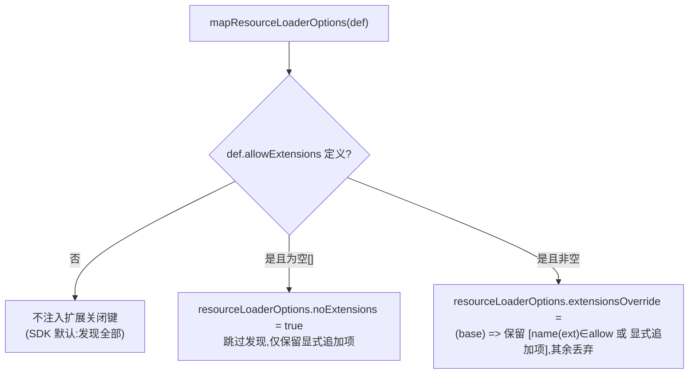

# Design Document — agent-minimal-preset

## Overview

**Purpose**:为 agent 作者提供一个可复用的「最小化默认预设」,一行即可让自定义 agent 以"无工具、无 skills、无系统扩展"的最小基线启动;并补齐当前缺失的"真正关闭系统扩展"能力,辅以 `allowExtensions` 白名单按名放行个别系统扩展。

**Users**:用 pi SDK 编写 `index.ts` 自定义 agent 的作者,以及 `@blksails/pi-web-server` 运行时(消费 `AgentDefinition`)。

**Impact**:在 `@blksails/pi-web-agent-kit` 公共表面新增预设产物与 `allowExtensions` 字段;在 `@blksails/pi-web-server` 运行时映射中落实扩展关闭/白名单语义。现状下 `extensions: []` 无法关闭 disk 发现的系统扩展,本特性修复该语义缺口。

### Goals
- 导出可复用的最小化预设(常量 + 工厂),一行启用且字段可覆盖。
- 让"关闭系统扩展"在运行时真实生效(不加载 disk 发现的系统/项目/用户扩展)。
- 提供 `allowExtensions` 白名单,在全关基线上按名放行系统扩展。
- 保持 `defineAgent` 恒等性、零强制运行时依赖,既有示例/测试不回归。

### Non-Goals
- 不修改 `@earendil-works/pi-coding-agent` SDK。
- 不关闭 prompt 模板 / theme / context 文件(超出本特性)。
- 不改前端 UI / RPC 协议 / 渲染层。
- 不重构 skills 关闭机制(沿用既有 `skills` 覆盖钩子范式)。

## Boundary Commitments

### This Spec Owns
- `@blksails/pi-web-agent-kit` 公共表面:最小化预设产物(`minimalAgentPreset`、`defineMinimalAgent`)与 `AgentDefinition.allowExtensions` 字段及其类型。
- `@blksails/pi-web-server` 运行时:`allowExtensions` → SDK 资源加载层(`noExtensions` / `extensionsOverride`)的映射语义。
- 上述能力的示例与单元/集成测试。

### Out of Boundary
- SDK 内部扩展发现/加载实现(仅消费其 `resourceLoaderOptions` 出口)。
- skills/prompt/theme/context 等其它资源类别的关闭(skills 全关复用既有 `skills` 字段,不新增机制)。
- 前端、协议、会话翻译层。

### Allowed Dependencies
- `@earendil-works/pi-coding-agent` 的 `resourceLoaderOptions`(`noExtensions`、`extensionsOverride`、`skillsOverride`)与 `LoadExtensionsResult` 类型。
- 既有 `option-mapper.ts` 的映射结构与 `buildRuntimeFactory` 流程。

### Revalidation Triggers
- `AgentDefinition` 结构变更(agent-kit 与 server 镜像必须同步)。
- `allowExtensions` 语义或映射目标(`noExtensions`/`extensionsOverride`)变更。
- SDK `resourceLoaderOptions` 扩展相关出口签名变更(peer 版本升级)。

## Architecture

### Existing Architecture Analysis
- `@blksails/pi-web-agent-kit` 为**类型/数据声明包**,零强制运行时依赖;`AgentDefinition`(`src/types.ts`)是作者面向的公共契约,`defineAgent`(`src/index.ts`)为恒等帮助。
- `@blksails/pi-web-server` **不依赖** agent-kit,通过结构镜像 `agent-definition.ts` 复刻同一形状,并在 `option-mapper.ts` 把定义拆为 `resourceLoaderOptions`(资源类)与 session 字段两路,组装 `buildRuntimeFactory`。
- 现有缺口:`extensions` 仅"追加"(`additionalExtensionPaths`/`extensionFactories`),无关闭;SDK 实际支持 `noExtensions` 与 `extensionsOverride`,但未在公共表面暴露。

### Architecture Pattern & Boundary Map

```mermaid
flowchart LR
  author["Agent 作者 index.ts"] -->|defineMinimalAgent / ...minimalAgentPreset| def["AgentDefinition\n(+ allowExtensions)"]
  def -->|结构鸭子类型| mirror["server: agent-definition.ts\n(镜像 + allowExtensions)"]
  mirror --> mapper["option-mapper.ts\nmapResourceLoaderOptions"]
  mapper -->|allowExtensions: []| noext["resourceLoaderOptions.noExtensions = true"]
  mapper -->|allowExtensions: 非空| override["resourceLoaderOptions.extensionsOverride = 白名单过滤"]
  noext --> sdk["createAgentSessionServices (SDK)"]
  override --> sdk
```

- **Selected pattern**:薄声明字段 + 薄运行时映射,复用 SDK 资源加载出口(adopt, not build)。
- **Boundaries**:agent-kit 只声明数据;server 只做映射;扩展加载仍归 SDK。
- **Preserved patterns**:`defineAgent` 恒等;absent 字段不注入(保留 SDK 默认);agent-kit/server 镜像并行。

### Technology Stack

| Layer | Choice / Version | Role in Feature | Notes |
|-------|------------------|-----------------|-------|
| Frontend / CLI | — | 不涉及 | |
| Backend / Services | `@blksails/pi-web-server`(TS strict) | `allowExtensions` → `resourceLoaderOptions` 映射 | `option-mapper.ts` + 镜像类型 |
| Agent 套件 | `@blksails/pi-web-agent-kit`(TS strict) | 预设产物 + `allowExtensions` 字段 | 零强制运行时依赖 |
| Infrastructure / Runtime | `@earendil-works/pi-coding-agent` `^0.79.6` | 提供 `noExtensions`/`extensionsOverride` | peer 依赖 |

## File Structure Plan

### 新建文件
```
packages/agent-kit/src/
└── minimal-preset.ts          # minimalAgentPreset 常量 + defineMinimalAgent(overrides) 工厂

packages/agent-kit/test/
└── minimal-preset.test.ts     # 预设结构/合并/覆盖、allowExtensions 行为的单测

examples/minimal-agent/
└── index.ts                   # 最小基线示例:工具/skills/系统扩展全关
```

### Modified Files
- `packages/agent-kit/src/types.ts` — `AgentDefinition` 新增 `allowExtensions?: string[]`(含 JSDoc 语义说明)。
- `packages/agent-kit/src/index.ts` — re-export `minimalAgentPreset`、`defineMinimalAgent`。
- `packages/server/src/runner/agent-definition.ts` — 镜像新增 `allowExtensions?: string[]`,保持结构一致。
- `packages/server/src/runner/option-mapper.ts` — `mapResourceLoaderOptions` 处理 `allowExtensions`:`[]`→`noExtensions: true`;非空→`extensionsOverride` 白名单过滤。
- `packages/server/test/runner/option-mapper.test.ts` — 新增 `allowExtensions` 映射用例。
- `packages/agent-kit/test/types.type-test.ts` — 覆盖 `allowExtensions` 类型(可选)。

## System Flows

`allowExtensions` 在运行时的判定:



- 选择依据:空白名单用 `noExtensions`,被关扩展代码**根本不执行**(最安全且最简单);非空白名单必须先发现才能保留命名项,故用 override 过滤。
- 显式追加项识别(override 内,基于 `path`,不依赖未定型的 `sourceInfo`):工厂扩展 `path` 形如 `"<inline:N>"`;字符串路径项按 `def.extensions` 的 basename 匹配 `ext.path`/`ext.resolvedPath`。

## Requirements Traceability

| Requirement | Summary | Components | Interfaces | Flows |
|-------------|---------|------------|------------|-------|
| 1.1 | 导出可复用预设 | `minimal-preset.ts` | `minimalAgentPreset` / `defineMinimalAgent` | — |
| 1.2 | 预设关闭工具 | `minimal-preset.ts` | `noTools: "all"` | — |
| 1.3 | 预设关闭 skills | `minimal-preset.ts` | `skills` 空覆盖 | — |
| 1.4 | 预设关闭系统扩展 | `minimal-preset.ts` + mapper | `allowExtensions: []` | allowExtensions 流 |
| 1.5 | 零强制运行时依赖 | agent-kit 包结构 | type-only 导入 | — |
| 2.1 | 独立的扩展关闭字段 | `types.ts` | `allowExtensions?: string[]` | — |
| 2.2 | 映射为 SDK 关闭语义 | `option-mapper.ts` | `noExtensions`/`extensionsOverride` | allowExtensions 流 |
| 2.3 | 不加载发现的系统扩展 | `option-mapper.ts` | 同上 | allowExtensions 流 |
| 2.4 | 显式追加项仍加载 | `option-mapper.ts` | `noExtensions` 保留追加 / override 放行追加 | allowExtensions 流 |
| 2.5 | server 镜像结构一致 | `agent-definition.ts` | 镜像 `allowExtensions` | — |
| 3.1 | `allowExtensions` 白名单字段 | `types.ts` / 镜像 | `allowExtensions?: string[]` | — |
| 3.2 | 保留命名扩展启用 | `option-mapper.ts` | `extensionsOverride` 保留 | allowExtensions 流 |
| 3.3 | 关闭未列出扩展 | `option-mapper.ts` | override 丢弃 | allowExtensions 流 |
| 3.4 | 空/缺省=全关或默认 | `option-mapper.ts` | `[]→noExtensions`;缺省不注入 | allowExtensions 流 |
| 3.5 | 未匹配名安全忽略 | `option-mapper.ts` | override 过滤无副作用 | allowExtensions 流 |
| 4.1 | 保留作者字段 | `defineMinimalAgent` | 浅合并 `{...preset, ...overrides}` | — |
| 4.2 | 保留 customTools | `defineMinimalAgent` | overrides.customTools 透传 | — |
| 4.3 | 关闭语义显式可读 | `minimal-preset.ts` | 命名常量 + JSDoc | — |
| 4.4 | 覆盖/重开能力 | `defineMinimalAgent` / `allowExtensions` | 字段覆盖 | — |
| 5.1 | defineAgent 恒等不变 | `index.ts` | 不改 `defineAgent` | — |
| 5.2 | 未用时默认不变 | `option-mapper.ts` | absent 不注入 | — |
| 5.3 | 既有示例/测试不回归 | 全量测试 | — | — |
| 5.4 | 新鲜证据测试 | 三处测试文件 | vitest 运行输出 | — |

## Components and Interfaces

| Component | Layer | Intent | Req Coverage | Key Dependencies | Contracts |
|-----------|-------|--------|--------------|------------------|-----------|
| `minimal-preset.ts` | agent-kit | 预设常量 + 工厂 | 1, 4 | `AgentDefinition` | State(数据) |
| `AgentDefinition.allowExtensions` | agent-kit/server 类型 | 扩展关闭/白名单声明 | 2.1, 3.1 | — | State |
| `mapResourceLoaderOptions` 扩展 | server | 映射 `allowExtensions` | 2, 3 | SDK resourceLoaderOptions | Service |

### Agent Kit

#### minimal-preset.ts

| Field | Detail |
|-------|--------|
| Intent | 提供"全关"基线预设与一行启用工厂 |
| Requirements | 1.1–1.5, 4.1–4.4 |

**Responsibilities & Constraints**
- 导出常量 `minimalAgentPreset`,显式声明三处关闭。
- 导出工厂 `defineMinimalAgent(overrides?)`,在预设上浅合并作者覆盖并经 `defineAgent` 返回。
- 纯数据/类型,不引入 SDK 运行时依赖。

**Contracts**: State [x]

```typescript
import type { AgentDefinition, SkillsOverride } from "./types.js";
import { defineAgent } from "./index.js";

/** 关闭全部 disk 发现 skills 的覆盖钩子(保留 diagnostics)。 */
const noSkills: SkillsOverride = ({ diagnostics }) => ({ skills: [], diagnostics });

/**
 * 最小化默认预设:工具全关 + skills 全关 + 系统扩展全关。
 * - `noTools: "all"`         → 不启用任何内置/扩展工具(customTools 仍可由作者叠加)。
 * - `skills` 空覆盖           → 解析得到的 skills 为空。
 * - `allowExtensions: []`     → 关闭全部 disk 发现的系统扩展(显式 `extensions` 追加项不受影响)。
 */
export const minimalAgentPreset: AgentDefinition = {
  noTools: "all",
  skills: noSkills,
  allowExtensions: [],
};

/**
 * 一行构建最小化 agent:在预设上叠加作者覆盖(浅合并,overrides 优先)。
 * 关闭语义默认保留;作者可通过覆盖字段或 `allowExtensions` 重新开启。
 */
export function defineMinimalAgent(
  overrides: Partial<AgentDefinition> = {},
): AgentDefinition {
  return defineAgent({ ...minimalAgentPreset, ...overrides });
}
```
- Preconditions:`overrides` 为合法 `Partial<AgentDefinition>`。
- Postconditions:返回的定义含三处关闭(除非被 `overrides` 显式覆盖);`overrides` 的 `model/systemPrompt/customTools/allowExtensions` 等优先生效。
- Invariants:`defineAgent` 恒等性不受影响(本工厂构造新对象,不改输入)。

#### types.ts(修改)

```typescript
export interface AgentDefinition {
  // ...既有字段...
  /**
   * 系统扩展白名单(关闭语义)。独立于仅"追加"语义的 `extensions`。
   * - 缺省:沿用 SDK 默认,发现并加载全部系统扩展。
   * - `[]`:关闭全部 disk 发现的系统扩展(显式 `extensions` 追加项不受影响)。
   * - `["a", ...]`:仅保留命名的发现扩展启用,其余关闭。
   */
  allowExtensions?: string[];
}
```

### Server

#### option-mapper.ts(修改 `mapResourceLoaderOptions`)

| Field | Detail |
|-------|--------|
| Intent | 把 `allowExtensions` 映射为 SDK 扩展关闭/白名单语义 |
| Requirements | 2.2–2.4, 3.2–3.5 |

**Contracts**: Service [x]

```typescript
// 在 mapResourceLoaderOptions(def) 内,extensions 处理之后追加:
if (def.allowExtensions !== undefined) {
  const allow = new Set(def.allowExtensions);
  if (allow.size === 0) {
    // 全关:跳过发现,被关扩展代码不执行;显式追加项由 SDK 保留。
    resourceLoaderOptions.noExtensions = true;
  } else {
    // 白名单:发现后过滤,保留命名扩展 + 显式追加项。
    const explicitPaths = new Set(
      (def.extensions ?? [])
        .filter((e): e is string => typeof e === "string")
        .map((p) => basename(p)),
    );
    resourceLoaderOptions.extensionsOverride = (base) => ({
      ...base,
      extensions: base.extensions.filter((ext) => {
        if (ext.path.startsWith("<inline:")) return true;      // 工厂显式追加
        if (explicitPaths.has(basename(ext.path))) return true; // 字符串路径显式追加
        return allow.has(extensionName(ext));                   // 命名白名单
      }),
    });
  }
}
```
- `extensionName(ext)`:取 `ext.path` 的 basename(去扩展名)作为扩展名,与 `allowExtensions` 逐项比较;实现期对真实扩展样例校准。
- Preconditions:`def.allowExtensions` 为 `string[]` 或缺省。
- Postconditions:`[]`→`noExtensions=true`;非空→`extensionsOverride` 保留白名单+显式追加,其余丢弃;缺省→不注入(保留 SDK 默认)。
- Invariants:override 保留 `base.errors` 与 `base.runtime`(经 `...base` 展开);未匹配的白名单名被安全忽略(无对应 ext 即不保留任何项,不抛错)。

**Implementation Notes**
- Integration:`basename` 用 `node:path`;`extensionName` 作为本文件内小工具,便于单测。
- Risks:**非空 `allowExtensions` 会先加载全部发现扩展再过滤**(被关扩展代码执行一次);需强隔离用 `allowExtensions: []`。在代码注释明示(对应 research.md R-1)。

## Error Handling

### Error Strategy
- 纯映射/数据,无 I/O 错误路径。映射对非法/空输入做防御:`allowExtensions` 缺省不注入;空集走 `noExtensions`;白名单未命中任何已发现扩展 → 过滤后为空,不抛错(Req 3.5)。

### Error Categories and Responses
- **作者输入**:`allowExtensions` 含未知名 → 安全忽略(无匹配项保留)。
- **加载错误**:override 透传 `base.errors`,不吞错。

### Monitoring
- 复用既有 `diagnostics` 传递路径(skills override 保留 diagnostics;扩展 errors 由 SDK 汇总),无新增遥测。

## Testing Strategy

### Unit Tests(agent-kit `minimal-preset.test.ts`)
- `minimalAgentPreset` 同时声明 `noTools:"all"`、`skills` 空覆盖(调用返回 `skills:[]` 且保留传入 diagnostics)、`allowExtensions:[]`(Req 1.2/1.3/1.4)。
- `defineMinimalAgent()` 返回的定义含三处关闭;`defineMinimalAgent({ model, systemPrompt, customTools })` 保留这些覆盖字段且不丢失关闭语义(Req 4.1/4.2)。
- `defineMinimalAgent({ allowExtensions: ["foo"] })` 覆盖白名单为 `["foo"]`(Req 4.4)。

### Integration Tests(server `option-mapper.test.ts`)
- `allowExtensions: []` → `resourceLoaderOptions.noExtensions === true`,且不设 `extensionsOverride`(Req 2.2/2.3/3.4)。
- `allowExtensions: ["keep"]` → 设 `extensionsOverride`;以伪造 `LoadExtensionsResult`(含发现扩展 `keep`/`drop`、工厂 `<inline:1>`、显式路径项)断言:保留 `keep` + `<inline:1>` + 显式路径项,丢弃 `drop`,且 `errors`/`runtime` 透传(Req 3.2/3.3/2.4)。
- `allowExtensions: ["missing"]` → override 过滤后无该项且不抛错(Req 3.5)。
- `allowExtensions` 缺省 → 不注入 `noExtensions`/`extensionsOverride`(Req 5.2)。

### Regression
- `packages/agent-kit` 与 `packages/server` 既有单测全绿;`examples/hello-agent` 语义不变(Req 5.1/5.3)。
- 类型检查 `tsc --noEmit`(两包)通过,守护 agent-kit↔server 镜像一致(Req 2.5)。

### E2E(轻量)
- 新增 `examples/minimal-agent/index.ts` 作为最小基线示例,纳入既有示例加载/类型校验路径,确保可被 runner 正常载入(冒烟级,非完整对话 e2e,避免与既有 e2e 重复)。
