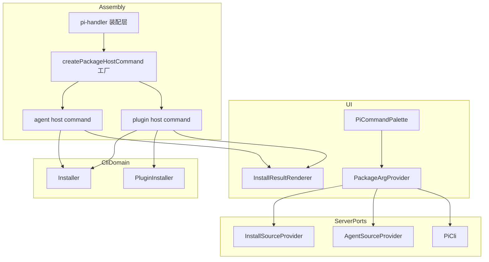
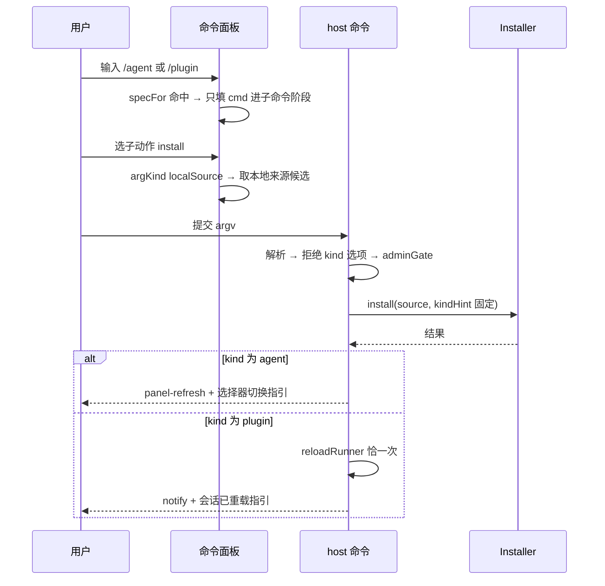

# Design Document — agent-plugin-commands

## Overview

**Purpose**：把 `/install` 一条多态 host 命令拆成 `/agent` 与 `/plugin` 两条单态命令，使"装什么"由命令名
而非参数决定。

**Users**：pi-web web 面的管理员（自托管 / 单用户 dev 场景），在聊天框里安装与卸载 agent 源、plugin。

**Impact**：命令面（argv 形态、补全树、内置词条、文案）重排；安装的真实逻辑、治理门控与生效分道全部
沿用。附带把 `install` 参数补全的来源枚举从写死的 `node:fs` 扫描提升为可替换端口。

### Goals

- 两条命令各自锁定类别，`--kind` 与 kind 自动判别在命令面消失。
- 补全候选按域分道，agent 候选不再靠拼接 `--kind agent` 走对通道。
- 可安装来源枚举获得与 `AgentSourceProvider` 同族的只读端口，本地实现行为零变化。
- 旧 `/install` 干净摘除，不留别名。

### Non-Goals

- 不改 CLI 侧 `pi-web install`（`server/cli/`）的形态。
- 不改 `Installer` / `PluginInstaller` 内部实现、白名单判定与注册表安装路径。
- 不新增在线注册表搜索端点——npm/git/registry 目标仍只能手输。
- 不扩展 `Workspace` 契约。
- 不重新实现"有 argSpec 的命令不得裸执行"（已独立热修，见 research.md §6）。

## Boundary Commitments

### This Spec Owns

- `agent` 与 `plugin` 两条 host 命令的 argv 契约、门控顺序、结果形状与用法文本。
- 内置命令词条集（`BUILTIN_COMMANDS`）中这两条的定义与其 `resultDataPart` 声明。
- 命令面板参数补全的 **spec 分道**：`CommandArgSpec` 的 `argKind` 取值域、子动作说明的 i18n 键、
  provider 工厂的构造与候选来源映射。
- `InstallSourceProvider` 端口的定义、其本地扫描实现，以及 `GET /sessions/:id/install-sources` 对它的消费。

### Out of Boundary

- `Installer` / `PluginInstaller` 的安装语义——本 spec 只**传入** `kindHint`。
  **例外(实施期修订)**:`determineKind()` 的裁断顺序被本 spec 改动一处——本地来源已读到的
  `pi-web.json#kind === "component"` 现在压过 `kindHint`。原因见 research.md §7:命令恒传
  `kindHint` 后,component 包会被当 agent 装进源根,绕过既有的 component 拒绝门(e2e 抓到)。
  这是"真实判据优先于提示"的修正,对 CLI 侧同样正确。
- `AgentSourceProvider`、`PiCli` 两个既有端口的接口形状——只消费，不改。
- `GET /extensions`、`GET /agent-sources` 的响应契约与治理。
- 结果卡片渲染器 `InstallResultRenderer` 的字段布局（data 形状不变，渲染器不动）。
- 命令面板的阶段解析 `parseCommandStage` 与键盘导航语义。

### Allowed Dependencies

- `lib/app/*`（装配层）→ `packages/server`、`packages/tool-kit`、`server/cli/install/*`（既有方向）。
- `packages/ui` 的 controls → `packages/ui` 的 i18n（既有方向）。
- 服务端路由 → `InstallSourceProvider` 端口（新增，方向与 `agent-source-list` 一致：路由依赖端口，端口不依赖路由）。
- **禁止**：`packages/server` 反向依赖 `lib/app`；`InstallSourceProvider` 依赖 `Workspace`。

### Revalidation Triggers

- `BUILTIN_COMMANDS` 词条名变更 → 前端 `builtinResultDataParts` 映射与 e2e 选择器需复核。
- `CommandArgSpec.argKind` 取值域变更 → 所有 provider 实现与 palette 的 `detail` 渲染需复核。
- `InstallSourceProvider.list` 签名变更 → 装配层注入点与 `install-sources` 端点需复核。
- `InstallResultData` 形状变更 → 卡片渲染器与其单测需复核（本 spec 不触发）。

## Architecture

### Existing Architecture Analysis

现有 `/install` 是「薄适配层 + CLI 子域委托」：`lib/app/install-host-command.ts` 负责 argv 解析、`adminGate`、
脱敏收集、kind 分派与结果卡片组装，安装本体一律委托注入的 `Installer` / `PluginInstaller`。这条"复用纪律"
在拆分后保持不变——两条新命令仍是薄适配层，只是把 kind 从**运行时判别**变成**构造时固化**。

命令面板一侧，`CommandArgProvider` 是装配层注入的窄接口（`specFor` + `listArgs`），面板不持有 HTTP。
拆分只改 provider 的 spec 分道与候选来源映射，面板的阶段解析与导航逻辑不动。

### Architecture Pattern & Boundary Map



**Key decisions**

- **参数化工厂而非双份实现**：两条命令的解析/门控/脱敏/组装完全同构，差异只有「子动作集合」与「固定
  kind」两个参数。工厂产出两个 `HostCommandHandler`，杜绝双份文案与门控漂移。
- **kind 在构造时固化**：调用 `Installer` 时恒传 `kindHint`，CLI 子域零改动（research.md §1）。
- **依赖方向**：`UI → provider → REST 端点`；`装配层 → 工厂 → CLI 子域`；`路由 → 端口`。端口不反向依赖路由或装配层。

### Technology Stack

| Layer | Choice | Role in Feature | Notes |
|-------|--------|-----------------|-------|
| Frontend | React + `packages/ui` controls / i18n | 命令面板分道补全、子动作中文说明、结果卡片 | 复用既有 `t()` 与字典 |
| Backend | `packages/server` 路由 + 端口 | `install-sources` 端点改经端口取数 | 新增端口与本地实现 |
| Assembly | `lib/app` | 两条 host 命令的构造、注册与审计适配 | 薄适配层纪律不变 |
| CLI domain | `server/cli/install/*` | 安装本体 | **不改** |

## File Structure Plan

### 新增文件

```
packages/server/src/extensions/install-sources/
├── types.ts            # InstallSourceProvider 端口与记录类型(零 IO)
└── scan-provider.ts    # 本地实现:按 cwd 浅层扫描(自 routes/install-sources.ts 迁出)

lib/app/
└── package-host-command.ts   # createPackageHostCommand 工厂(取代 install-host-command.ts)

packages/ui/src/controls/
└── package-arg-provider.ts   # createPackageArgProvider(取代 install-arg-provider.ts)
```

### 修改文件

- `packages/server/src/extensions/routes/install-sources.ts` — 去掉 `node:fs`，改为消费注入的
  `InstallSourceProvider`；保留 HTTP 层的会话查找与响应组装，新增 fail-soft 降级。
- `packages/server/src/extensions/routes.ts` — 装配默认本地实现，暴露注入接缝。
- `packages/server/src/extensions/index.ts` — 导出端口类型与本地实现工厂。
- `packages/tool-kit/src/commands/builtin.ts` — `INSTALL` 词条拆为 `AGENT` 与 `PLUGIN` 两条。
- `lib/app/pi-handler.ts` — 由工厂构造两个 handler 并注册；审计适配沿用同一 `onAudit`。
- `packages/ui/src/controls/command-arg.ts` — `argKind` 取值域收敛；`SubcommandSpec` 增 `descriptionKey`。
- `packages/ui/src/controls/pi-command-palette.tsx` — 子动作 `detail` 由占位符改为 `t(descriptionKey)`。
- `packages/ui/src/chat/pi-chat.tsx` — provider 工厂改名接线。
- `packages/ui/src/i18n/messages.ts` — 中英各补子动作说明键。
- `packages/ui/src/index.ts` — 导出更名。

### 删除文件

- `lib/app/install-host-command.ts`、`packages/ui/src/controls/install-arg-provider.ts`（由上述新增取代）。

### 测试文件迁移

- `test/commands/install-host-command.test.ts` → `test/commands/package-host-command.test.ts`（按两条命令重组）
- `test/commands/install-host-command-routes.test.ts` → 同名迁移 + 增 `/install` 不存在的回归
- `packages/ui/test/controls/install-arg-provider.test.ts` → `package-arg-provider.test.ts`
- `e2e/browser/install-host-command.e2e.ts` → `agent-plugin-commands.e2e.ts`
- `e2e/browser/install-subcommand-completion.e2e.ts` → 按两条命令重写候选断言

## System Flows

### `/agent install` 与 `/plugin install` 的分道



生效分道是唯一的运行期差异：agent 通道恒不重载会话，plugin 通道在 install/uninstall/update 成功时恰重载一次。

## Requirements Traceability

| Requirement | Summary | Components | Interfaces |
|-------------|---------|------------|------------|
| 1.1–1.7 | `/agent` 命令与 agent 生效分道 | PackageHostCommandFactory、BuiltinCommands | `HostCommandHandler`、`Installer` |
| 2.1–2.6 | `/plugin` 命令与会话重载 | PackageHostCommandFactory、BuiltinCommands | `HostCommandHandler`、`PluginInstaller` |
| 3.1–3.4 | 旧 `/install` 摘除 | BuiltinCommands、PackageArgProvider | `BuiltinCommandSpec` |
| 4.1–4.7 | 分道补全 | PackageArgProvider、CommandArgSpec、Palette | `CommandArgProvider` |
| 5.1–5.4 | 结果呈现与文案 | InstallResultRenderer（不改）、i18n 字典 | `InstallResultData` |
| 6.1–6.4 | 治理不回归 | PackageHostCommandFactory | `adminGate`、`InstallAuditEvent` |
| 7.1–7.4 | 验证与迁移 | 测试与 e2e 资产 | — |
| 8.1–8.6 | 来源枚举端口化 | InstallSourceProvider、ScanInstallSourceProvider、install-sources 路由 | `InstallSourceProvider` |

## Components and Interfaces

| Component | Layer | Intent | Req | Contracts |
|-----------|-------|--------|-----|-----------|
| PackageHostCommandFactory | Assembly | 由 kind + 子动作集参数化产出两个 host 命令 | 1, 2, 3, 6 | Service |
| BuiltinCommands（改） | tool-kit | 声明 `/agent`、`/plugin` 两个内置词条 | 1.1, 2.1, 3.1 | State |
| PackageArgProvider | UI | 单 provider 双 spec，候选按域分道 | 4 | Service |
| CommandArgSpec（改） | UI | `argKind` 域感知取值 + 子动作说明键 | 4.3, 4.6 | State |
| InstallSourceProvider | Server | 可安装来源的只读枚举端口 | 8 | Service |
| ScanInstallSourceProvider | Server | 端口的本地扫描实现 | 8.2, 8.3 | Service |

### Assembly

#### PackageHostCommandFactory

| Field | Detail |
|-------|--------|
| Intent | 以 kind 与子动作集为参数，产出语义单一的 host 命令 handler |
| Requirements | 1.1–1.7, 2.1–2.6, 3.4, 6.1–6.4 |

**Responsibilities & Constraints**

- 拥有 argv 解析、用法文本、门控顺序、脱敏与结果组装；**不**拥有安装语义。
- 门控顺序固定：参数校验（纯本地，`effect:"none"`，无 data）→ `adminGate`（拒绝→失败卡片 + 审计）→
  CLI 子域（allowlist 拒绝在此产生，装饰为 env 放行指引 + 审计）→ 结果组装。
- 本地来源解析基准恒取 `ctx.session.cwd`，装配 `cwd` 仅兜底（与补全端点同基准）。
- 输出面（卡片 `data.id`、审计事件、错误消息）一律使用 `redactSecrets` 副本。

**Dependencies**

- Outbound：`Installer` — install/uninstall（P0）；`PluginInstaller` — list/update（P0）。
- Outbound：`reloadRunner` — plugin 通道生效（P0）。
- Inbound：`pi-handler` 装配层（P0）。

##### Service Interface

```typescript
/** 命令承载的类别，构造时固化，运行期不可覆盖。 */
type PackageCommandKind = "agent" | "plugin";

interface PackageHostCommandDeps {
  readonly installer: Installer;
  readonly pluginInstaller: PluginInstaller;
  readonly adminGate: () => boolean;
  readonly reloadRunner: (session: PiSession) => Promise<void>;
  readonly audit?: (event: InstallAuditEvent) => void;
  /** 本地来源解析基准的装配兜底；执行时优先 ctx.session.cwd。 */
  readonly cwd?: string;
}

/**
 * 产出名为 `agent` 或 `plugin` 的 host 命令。
 * - kind "agent"：子动作 install / uninstall / list；成功恒 panel-refresh，不重载会话。
 * - kind "plugin"：子动作 install / uninstall / list / update；成功恰重载一次会话。
 */
function createPackageHostCommand(
  kind: PackageCommandKind,
  deps: PackageHostCommandDeps,
): HostCommandHandler;
```

- Preconditions：`deps.installer` 已注入 allowlist（装配层职责，本层不重复判断白名单）。
- Postconditions：返回的 handler 的 `name` 恒等于 `kind`；其产出的 `CommandResult.command` 亦为 `kind`。
- Invariants：`kind` 决定的通道在任何 argv 下都不可被改写；出现 `--kind` 一律判为参数错误。

**Implementation Notes**

- Integration：`Installer.install/uninstall` 恒收 `kindHint: kind`；`update` 仅 plugin 命令提供，agent 命令
  遇 `update` 按未知子动作处理。
- Validation：`--kind` 出现时返回专属错误文本（"该选项已移除，请改用 /agent 或 /plugin"），不静默忽略。
- Risks：`/agent install <npm 包>` 会强制走 agent 通道，绕过"直连来源默认 plugin"的保守约定——有意行为，
  用法文本需点明（research.md §1）。

#### BuiltinCommands（修改）

**Responsibilities & Constraints**

- `INSTALL` 词条删除，新增 `AGENT` 与 `PLUGIN` 两条，均 `target: {kind:"server-action"}`、`userOnly: true`、
  `resultDataPart: "data-install-result"`。
- part 名保持不变：`InstallResultData` 形状不变，卡片渲染器与其注册不动（Req 5.1/5.3 由 data 自带的
  `action`/`kind` 字段满足）。

### UI

#### PackageArgProvider

| Field | Detail |
|-------|--------|
| Intent | 单个 provider 同时服务两条命令，候选来源按域分道 |
| Requirements | 4.1–4.7 |

**Responsibilities & Constraints**

- `specFor("agent")` / `specFor("plugin")` 各返回独立 spec，其余命令返回 `undefined`。
- 候选来源映射固定：

  | 命令 · 子动作 | argKind | 数据源 |
  |---|---|---|
  | `agent install` | `localSource` | `GET /sessions/:id/install-sources?q` |
  | `agent uninstall` | `installedAgent` | `GET /agent-sources` |
  | `agent list` | —（terminal） | 无 |
  | `plugin install` | `localSource` | `GET /sessions/:id/install-sources?q` |
  | `plugin uninstall` / `plugin update` | `installedPlugin` | `GET /extensions` |
  | `plugin list` | —（terminal） | 无 |

- agent 候选的 `insertText` 只含标识本身，**不得**追加任何类别参数（Req 4.3）。
- 取数失败/非 2xx → 返回 `[]`（既有 fail-soft 语义保持，Req 4.7）。

##### Service Interface

```typescript
interface PackageArgProviderOptions {
  readonly baseUrl: string;
  readonly sessionId: string;
  readonly fetchImpl?: typeof fetch;
}

/** 返回同时认 "agent" 与 "plugin" 的单一 provider。 */
function createPackageArgProvider(
  opts: PackageArgProviderOptions,
): CommandArgProvider;
```

#### CommandArgSpec（修改）

```typescript
/** 域感知取值：删除遗留 installedExt 与合并语义的 installedPackage。 */
type CommandArgKind = "localSource" | "installedAgent" | "installedPlugin";

interface SubcommandSpec {
  readonly name: string;
  readonly aliases?: readonly string[];
  readonly terminal: boolean;
  readonly argKind?: CommandArgKind;
  /** i18n 字典键，命令面板据此渲染候选说明；缺省回退为 argKind 占位符。 */
  readonly descriptionKey?: string;
}
```

- 面板渲染 `detail` 时优先 `t(descriptionKey)`，缺省回退既有 `<argKind>` 形态，保证未声明说明的 spec 不炸。
- i18n 键命名沿用点分层级，中英字典**同时**补齐（Req 5.4）。

### Server

#### InstallSourceProvider

| Field | Detail |
|-------|--------|
| Intent | 可安装来源的只读枚举端口，与 `AgentSourceProvider` 同族 |
| Requirements | 8.1–8.6 |

**Responsibilities & Constraints**

- 只读、无副作用；按查询前缀返回候选记录。
- 端口本身零 IO、零 pi-SDK 依赖，可安全经 server barrel 重导出。
- **不得**依赖 `Workspace`、`SessionStore` 或任何 HTTP 类型。

##### Service Interface

```typescript
/** 一个可安装来源候选。insertText 为可直接提交给安装命令的来源串（如 `local:<rel>`）。 */
interface InstallSourceRecord {
  readonly path: string;
  readonly insertText: string;
}

interface InstallSourceQuery {
  /** 解析基准目录（会话 cwd）。 */
  readonly cwd: string;
  /** 前缀过滤，空串表示不过滤。 */
  readonly query: string;
}

interface InstallSourceProvider {
  list(q: InstallSourceQuery): Promise<readonly InstallSourceRecord[]>;
}

interface ScanInstallSourceOptions {
  /** 标志文件、深度与条数上限、跳过目录均有默认值，仅测试需要覆盖。 */
  readonly maxDepth?: number;
  readonly maxItems?: number;
}

function createScanInstallSourceProvider(
  opts?: ScanInstallSourceOptions,
): InstallSourceProvider;
```

- Preconditions：`cwd` 为绝对路径；不存在或不可 realpath → 返回 `[]`。
- Postconditions：返回项的 realpath 必仍位于 `cwd` 内（越界防护，行为与迁移前逐条一致）。
- Invariants：条数不超过上限；噪声目录（`node_modules`/`.git`/`dist` 等）恒跳过。

**Implementation Notes**

- Integration：`makeInstallSourcesHandler(store, provider?)` 增加可选注入位，缺省构造本地实现（Req 8.3）。
- Validation：迁移时对拍标志文件集合、深度与条数上限、SKIP 集合、realpath 越界四项。
- Risks：端点由"自己扫盘"变为"经端口"，若注入实现抛错会波及补全——以 fail-soft 兜底（Req 8.5）。

## Error Handling

### Error Strategy

沿用既有分类，不新增错误类型：

- **参数错误**（用户）：裸命令、未知子动作、缺必需参数、出现 `--kind` → `effect:"none"` + 用法文本，无 data、
  无副作用、不审计。
- **授权拒绝**：`adminGate` 不通过 → `ADMIN_DENIED` 失败卡片 + 放行指引 + 审计事件。
- **白名单拒绝**：`ALLOWLIST_REJECTED` → 按错误码装饰对应 env 放行指引 + 审计事件。
- **CLI 子域错误**：原样转达错误码，`KIND_COMPONENT_UNSUPPORTED` 等附既有 guidance。
- **取数失败**（补全侧与端口侧）：一律降级为空候选，不阻断输入与提交。

一切进入输出面的文本与标识使用脱敏副本，包括用户 argv 原样输入内嵌凭据的情形（Req 6.3）。

## Testing Strategy

### Unit Tests

1. `createPackageHostCommand("agent")` 对 `install`/`uninstall` 恒以 `kindHint:"agent"` 调用 `Installer`，
   且成功结果为 `panel-refresh` 并**未**调用 `reloadRunner`（1.2, 1.3, 1.7）。
2. `createPackageHostCommand("plugin")` 的 install/uninstall/update 成功时恰调用一次 `reloadRunner`（2.5）。
3. 两条命令遇 `--kind` 均返回参数错误、无任何 installer 调用（1.5, 3.4）。
4. agent 命令遇 `update` 按未知子动作处理并返回 `/agent` 专属用法文本（1.6）。
5. 带凭据 URL 作为 argv **输入本身**时，卡片 `data.id` 与审计事件均为脱敏副本（6.3）。
6. `createScanInstallSourceProvider` 的标志文件判定、深度/条数上限、SKIP 集合、realpath 越界四项与迁移前一致（8.2）。

### Integration Tests

1. `GET /sessions/:id/install-sources` 经注入的桩 provider 取数，端点自身不触碰文件系统（8.4）。
2. 注入实现抛错时端点返回空候选而非 5xx（8.5）。
3. host 命令注册后，命令列表含 `agent` 与 `plugin`、不含 `install`（3.1, 3.2, 7.3）。
4. `createPackageArgProvider` 对 `agent uninstall` 只打 `/agent-sources`、对 `plugin uninstall` 只打
   `/extensions`，且 agent 候选 `insertText` 不含 `--kind`（4.3, 4.4）。

### E2E Tests

1. `/agent ` → 子动作候选出现且带中文说明；选 `install` → 出现 `local:` 候选；提交后出现结果卡片且
   source 选择器可见新源（1.2, 1.7, 4.1, 4.2, 4.6）。
2. `/plugin ` → 子动作含 `update`；`/plugin list` 为终态（2.1, 2.3, 4.5）。
3. 命令面板中输入 `/inst` 无 `/install` 候选（3.2）。
4. 两条命令的结果卡片字段与拆分前一致（5.1）。

## Security Considerations

- 管理员门控与来源白名单的判定位置、顺序与拒绝语义完全不变；拆分不引入第二条绕过路径。
- `install-sources` 端点保持只读、不强制管理员门控的现状；端口化后越界防护由本地实现继续持有，
  且端口契约把"返回项必在 cwd 内"写为后置条件，供替换实现遵循。
- 用户 argv 是凭据泄露源：安装调用取原始值，输出面取脱敏副本——该纪律随实现一并迁移，回归样本保留。
