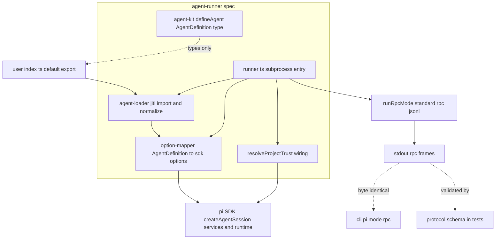
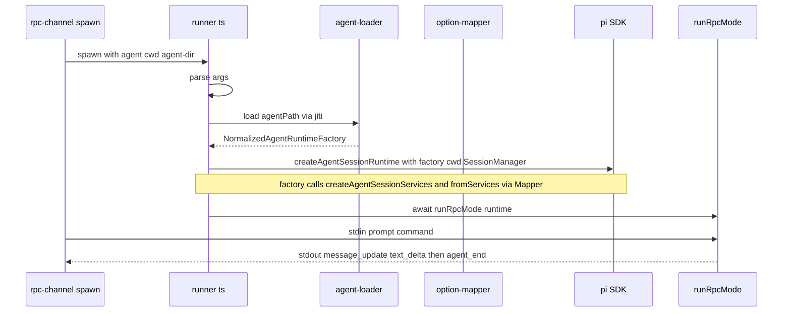
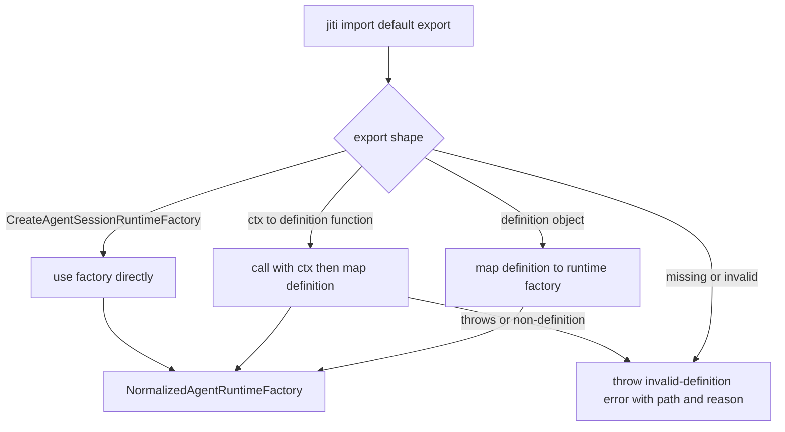

# Design Document — agent-runner

## Overview

**Purpose**:本特性交付 pi-web "自定义 agent 模式"的载入与 RPC 桥:一个被 spawn 的 **bootstrap runner** 子进程入口,加上轻量的 `@pi-web/agent-kit` 类型包。它把用户用 pi SDK 写的 `index.[ts|js]`(default export 为 `AgentDefinition` 或工厂)载入、归一化、映射为 pi SDK 的会话运行时,并以 `runRpcMode` 暴露为与 CLI 逐字节一致的标准 RPC 端点。

**Users**:编写自定义 agent 的用户(通过 `@pi-web/agent-kit` 的 `defineAgent()` 获得类型提示);下游 `rpc-channel`(spawn 本 runner)与 `session-engine`(消费 runner 的 RPC 帧)。

**Impact**:把"用户写好一个 pi agent"到"它能作为纯 RPC 子进程被 pi-web 驱动"之间的桥补齐。后端不在自身进程内执行用户代码(隔离),所有 agent 能力声明被映射到 pi 原生资源体系。

### Goals

- 提供 `@pi-web/agent-kit`:`defineAgent()` 类型帮助 + `AgentDefinition` 类型,运行时零强制依赖。
- 提供 agent-loader:jiti import + default export 三形态(对象 / `(ctx)=>定义` / `createRuntime`)归一化为单一 `CreateAgentSessionRuntimeFactory`。
- 提供 runner.ts:参数解析 → 选项映射 → `createAgentSessionRuntime` → `runRpcMode`,并接线 `resolveProjectTrust`。
- runner RPC 输出与 CLI `pi --mode rpc` 逐字节一致,且通过 protocol-contract schema 校验。

### Non-Goals

- 不解析 agent 源 / 探测入口 / 双模式判定 / 生成信任策略(归 `agent-source-resolver`)。
- 不实现从服务端 spawn、JSONL framing、response/event/extension_ui_request 分发(归 `rpc-channel` 的 `PiRpcProcess`)。
- 不实现 CLI 回退路径(`pi --mode rpc` 不经过 runner)。
- 不实现事件→UIMessage 翻译(归 `session-engine`)。
- 不定义协议类型/schema 本身(归 `protocol-contract`,本 spec 仅消费其 schema 做校验)。

## Boundary Commitments

### This Spec Owns

- `@pi-web/agent-kit`:`AgentDefinition` 类型与 `defineAgent()`(恒等返回 + 类型推导)。
- agent-loader:jiti import、default export 三形态归一化、`NormalizedAgentRuntimeFactory` 的产出、无效定义的错误表面。
- AgentDefinition → SDK 选项的映射逻辑(资源类 → `resourceLoaderOptions`;会话类 → `createAgentSessionFromServices` 入参)。
- runner.ts 子进程入口:`--agent/--cwd/--agent-dir` 参数解析、组装 `createAgentSessionRuntime`、创建 `SessionManager`、`await runRpcMode(runtime)`。
- `resolveProjectTrust` 钩子的接线(把外部信任布尔作用到 pi 资源加载)。
- 示例 agent `examples/hello-agent/index.ts`。
- 本 spec 全部单元/集成/e2e 测试。

### Out of Boundary

- agent 源解析、入口探测、模式判定、信任**策略生成**(`agent-source-resolver`)。
- 子进程 spawn、JSONL framing、三类 stdout 消息分发(`rpc-channel`)。
- CLI 回退(`pi --mode rpc`)。
- 事件→UIMessage 翻译(`session-engine`)。
- 协议 schema/类型的定义(`protocol-contract`)。

### Allowed Dependencies

- **运行时**:`@earendil-works/pi-coding-agent` SDK(`createAgentSessionServices`/`createAgentSessionFromServices`/`createAgentSessionRuntime`/`runRpcMode`/`SessionManager`);`jiti`(载入用户代码)。
- **类型 / 校验**:`@pi-web/protocol`(仅测试中用其 schema 做帧校验)。
- **`@pi-web/agent-kit`**:零强制运行时依赖(纯类型 + 恒等函数)。
- **依赖方向约束**:`agent-runner → protocol`(仅测试)、`→ pi SDK`、`→ jiti`;禁止依赖 `rpc-channel` / `agent-source-resolver` / `session-engine`(单向收敛)。

### Revalidation Triggers

- pi SDK 选项形状变化(`createAgentSessionServices` / `createAgentSessionFromServices` / `createAgentSessionRuntime` / `runRpcMode` 签名)。
- `AgentDefinition` 字段增删或映射目标变更。
- default export 三形态约定变更。
- runner 启动参数(`--agent/--cwd/--agent-dir`)或 `resolveProjectTrust` 接缝变更。
- protocol-contract 的 `AgentEvent` / `RpcResponse` schema 形状变更(影响帧校验)。
- pi 版本对齐迁移(`0.79.x` → 新版本)。

## Architecture

### Architecture Pattern & Boundary Map

模式:**Adapter + 子进程入口**。`agent-kit`(类型层)与 `agent-loader`(归一化适配器)、`option-mapper`(映射适配器)、`runner`(进程入口编排)分层单向依赖;runner 是隔离边界,所有用户代码只在子进程内经 jiti 执行。



**Architecture Integration**:

- **Selected pattern**:Adapter + 子进程入口。理由:把"用户多形态定义"收敛为单一 SDK 运行时,且把用户代码执行隔离进子进程;映射可独立单测。
- **Domain/feature boundaries**:`agent-kit`(类型)/`agent-loader`(归一化)/`option-mapper`(映射)/`runner`(编排+启动)严格分文件,单一职责。
- **Dependency direction**:`runner → loader → mapper`;`runner → trust`;`mapper/trust → pi SDK`;`agent-kit` 不被运行时引用(仅类型)。禁止反向与跨边界向下游(rpc-channel/session-engine)依赖。
- **New components rationale**:loader 解决"多形态归一",mapper 解决"字段映射",runner 解决"进程编排+RPC 启动",trust 解决"信任承接"——各自单一职责。
- **Steering compliance**:TypeScript strict、禁 `any`;Node `>=22.19.0`;runner 隔离用户代码(structure.md / tech.md);协议复用 SDK 单一来源。

### Technology Stack

| Layer | Choice / Version | Role in Feature | Notes |
|-------|------------------|-----------------|-------|
| Agent runtime | `@earendil-works/pi-coding-agent`(pi `0.79.x`)SDK | `createAgentSessionServices` / `createAgentSessionFromServices` / `createAgentSessionRuntime` / `runRpcMode` / `SessionManager` | 协议单一来源,运行时依赖 |
| Agent 载入 | `jiti` | 运行时直接 import 用户 `index.[ts|js]` | 载入即执行 = RCE,须受信/沙箱 |
| 类型包 | `@pi-web/agent-kit`(TS,零强制运行时依赖) | `defineAgent()` + `AgentDefinition` 类型 | 用户 `index.ts` 用 |
| 校验(仅测试) | `@pi-web/protocol`(zod schema) | e2e/集成对 runner 帧做 schema 校验 | 不进入运行时依赖 |
| Runtime | Node `>=22.19.0` | 子进程入口 `node --import jiti/register runner.ts` | 镜像 `node:24-bookworm-slim` |
| 测试 | vitest | 单元/集成/e2e | 单一命令运行全部 |

## File Structure Plan

### Directory Structure

```
lib/pi/
├── runner.ts                 # ★ bootstrap runner 子进程入口:参数解析 + 编排 + runRpcMode
├── agent-loader.ts           # jiti import + default export 三形态归一化 → NormalizedAgentRuntimeFactory
├── option-mapper.ts          # AgentDefinition → services/fromServices 选项映射
└── project-trust.ts          # resolveProjectTrust 钩子接线(承接外部信任布尔)

packages/agent-kit/
├── package.json              # name @pi-web/agent-kit;无强制运行时依赖;peer/dev: pi SDK 类型
├── tsconfig.json             # strict
└── src/
    ├── index.ts              # 导出 defineAgent + AgentDefinition 等类型
    └── types.ts              # AgentDefinition / AgentContext / 字段类型定义

examples/hello-agent/
└── index.ts                  # 示例自定义 agent(default export AgentDefinition;集成/e2e 目标)

test/                          # vitest
├── agent-loader.test.ts      # 三形态归一化 + 无效定义错误(单元)
├── option-mapper.test.ts     # 字段→选项映射正确性(单元)
├── runner.integration.test.ts# 对 hello-agent 启动 runner 完成一次 prompt(集成)
└── runner.e2e.test.ts        # stdin prompt → stdout message_update/text_delta + agent_end,帧过 protocol schema(e2e)
```

### Modified Files

- 无(greenfield)。若 monorepo 根存在 workspace 清单,将 `packages/agent-kit` 纳入 workspace 属仓库初始化接线,本 spec 仅创建包自身与 `lib/pi/` 文件。

> 每个文件单一职责;`runner.ts` 是唯一进程入口,`agent-loader`/`option-mapper`/`project-trust` 为可单测的纯/半纯模块。

## System Flows

### runner 启动与 RPC 流(e2e 主路径)



### default export 三形态归一化



形态判别顺序:先判 `createRuntime` 工厂(形态 c,签名/标记可辨识)→ 再判函数(形态 b)→ 再判对象(形态 a);均不符或缺失则抛错。

## Requirements Traceability

| Requirement | Summary | Components | Interfaces | Flows |
|-------------|---------|------------|------------|-------|
| 1.1 | AgentDefinition 类型覆盖全部字段 | agent-kit/types.ts | `AgentDefinition` | — |
| 1.2 | defineAgent 恒等返回 + 类型推导 | agent-kit/index.ts | `defineAgent` | — |
| 1.3 | 运行时零强制依赖,结构匹配即可载入 | agent-kit, agent-loader | 结构鸭子类型 | 归一化流 |
| 1.4 | 非法字段编译期报错 | agent-kit/types.ts | TS 类型 | — |
| 2.1 | jiti import default export | agent-loader.ts | `loadAgentDefinition` | 归一化流 |
| 2.2 | 对象 → factory(形态 a) | agent-loader.ts, option-mapper.ts | 归一化分支 | 归一化流 |
| 2.3 | 工厂调用 ctx → 映射(形态 b) | agent-loader.ts | `AgentContext` | 归一化流 |
| 2.4 | createRuntime 直接使用(形态 c) | agent-loader.ts | 透传 | 归一化流 |
| 2.5 | 缺失/类型不符 → 明确错误 | agent-loader.ts | `InvalidAgentDefinitionError` | 归一化流 |
| 2.6 | 工厂抛错/返回非定义 → 错误 | agent-loader.ts | `InvalidAgentDefinitionError` | 归一化流 |
| 3.1 | 资源类字段映射到 resourceLoaderOptions | option-mapper.ts | 映射函数 | — |
| 3.2 | 会话类字段映射到 fromServices | option-mapper.ts | 映射函数 | — |
| 3.3 | 未提供字段不注入 | option-mapper.ts | 条件映射 | — |
| 3.4 | 组装 CreateAgentSessionRuntimeFactory | option-mapper.ts, runner.ts | factory | 启动流 |
| 4.1 | 解析 --agent/--cwd/--agent-dir | runner.ts | arg parser | 启动流 |
| 4.2 | 缺 --agent → 非零退出 + stderr | runner.ts | 退出码 | 启动流 |
| 4.3 | createAgentSessionRuntime + SessionManager | runner.ts | SDK 调用 | 启动流 |
| 4.4 | await runRpcMode | runner.ts | `runRpcMode` | 启动流 |
| 4.5 | 隔离:不在后端进程跑用户代码 | runner.ts | 子进程边界 | 启动流 |
| 5.1 | 提供 resolveProjectTrust 钩子 | project-trust.ts | 回调 | — |
| 5.2 | 不信任 → 忽略 .pi/ 项目资源 | project-trust.ts | 返回 false | — |
| 5.3 | 信任 → 加载 .pi/ 项目资源 | project-trust.ts | 返回 true | — |
| 5.4 | 不改 context 文件/全局扩展行为 | project-trust.ts | 仅门控项目资源 | — |
| 6.1 | RPC 输出与 CLI 逐字节一致 | runner.ts | `runRpcMode` | RPC 流 |
| 6.2 | prompt → message_update/text_delta + agent_end | runner.ts | RPC 帧 | RPC 流 |
| 6.3 | 每帧通过 protocol schema | runner.ts(测试侧) | protocol schema | RPC 流 |
| 7.1 | 单元:三形态/映射/无效定义 | test/agent-loader, test/option-mapper | vitest | — |
| 7.2 | 集成:hello-agent 起 runner 完成 prompt | test/runner.integration | vitest | RPC 流 |
| 7.3 | e2e:stdin prompt → stdout 帧 + schema 校验 | test/runner.e2e | vitest + protocol | RPC 流 |
| 7.4 | 单一命令运行全部测试 | package.json scripts | `pnpm test` | — |

## Components and Interfaces

| Component | Layer | Intent | Req Coverage | Key Dependencies (P0/P1) | Contracts |
|-----------|-------|--------|--------------|--------------------------|-----------|
| agent-kit/types.ts | type | `AgentDefinition` 等类型定义 | 1.1, 1.4 | pi SDK 类型 (P1) | Service |
| agent-kit/index.ts | type | `defineAgent` 恒等帮助函数 | 1.2, 1.3 | types.ts (P0) | Service |
| agent-loader.ts | loader | jiti import + 三形态归一化 + 错误表面 | 1.3, 2.1–2.6, 3.4 | jiti (P0), option-mapper (P0) | Service |
| option-mapper.ts | mapper | AgentDefinition → services/fromServices 选项 | 3.1–3.4 | pi SDK (P0) | Service |
| project-trust.ts | trust | `resolveProjectTrust` 接线 | 5.1–5.4 | pi SDK (P0) | Service |
| runner.ts | entry | 参数解析 + 编排 + `runRpcMode` | 4.1–4.5, 6.1–6.3 | loader (P0), mapper (P0), trust (P0), pi SDK (P0) | Service, Event |
| examples/hello-agent/index.ts | example | 集成/e2e 目标 agent | 7.2, 7.3 | agent-kit (P1) | — |

### agent-kit(类型层)

#### AgentDefinition / defineAgent

| Field | Detail |
|-------|--------|
| Intent | `AgentDefinition` 类型 + `defineAgent()` 恒等返回(仅类型推导) |
| Requirements | 1.1, 1.2, 1.3, 1.4 |

**Responsibilities & Constraints**
- `AgentDefinition` 覆盖:`model`、`thinkingLevel`、`tools`、`customTools`、`excludeTools`、`noTools`、`systemPrompt`、`extensions`、`skills`、`promptTemplates`、`contextFiles`、`scopedModels`(全部可选,字段类型对齐 pi SDK 入参类型,禁止 `any`)。
- `defineAgent(def)` 运行时恒等返回 `def`;不做任何转换、不引入强制运行时依赖。
- 包零强制运行时依赖:用户未导入本包但 default export 结构匹配时仍可被 loader 载入(鸭子类型)。

**Dependencies**
- External: `@earendil-works/pi-coding-agent` 类型 — 字段类型对齐 (P1, 仅类型/peer)

**Contracts**: Service [x]

##### Service Interface
```typescript
export interface AgentContext {
  cwd: string;
  agentDir?: string;
  env: Record<string, string | undefined>;
}

// AgentDefinition 字段类型对齐 pi SDK 的 createAgentSession* 入参;以下为形状摘要(精确类型见实现,禁止 any)。
export interface AgentDefinition {
  model?: ModelSpec;                 // getModel(...) 结果或 { provider, modelId }
  thinkingLevel?: ThinkingLevel;
  tools?: string[];                  // 内置工具白名单
  excludeTools?: string[];
  noTools?: boolean;
  customTools?: CustomTool[];        // defineTool(...) 结果
  systemPrompt?: string | (() => string);
  extensions?: Array<string | ExtensionFactory>;
  skills?: SkillsOverride;
  promptTemplates?: PromptsOverride;
  contextFiles?: AgentsFilesOverride;
  scopedModels?: ScopedModels;
}

export function defineAgent(def: AgentDefinition): AgentDefinition; // 恒等返回
```
- Preconditions:无。
- Postconditions:`defineAgent(def) === def`(引用相等)。
- Invariants:无运行时副作用、无强制依赖。

**Implementation Notes**
- Integration:用户 `index.ts` `export default defineAgent({...})`;loader 不要求来自本包。
- Validation:类型测试(`tsc` 通过 + 非法字段编译失败,Req 1.4);`defineAgent` 恒等返回单测(Req 1.2)。
- Risks:pi SDK 类型升级 → 字段类型漂移,由 Revalidation Trigger 与 `tsc` 暴露。

### loader(归一化适配器)

#### agent-loader.ts

| Field | Detail |
|-------|--------|
| Intent | jiti import default export → 三形态归一化为 `NormalizedAgentRuntimeFactory` |
| Requirements | 1.3, 2.1, 2.2, 2.3, 2.4, 2.5, 2.6, 3.4 |

**Responsibilities & Constraints**
- 用 jiti(`createJiti()` 程序化或 `--import jiti/register`)import `agentPath`,取 default export。
- 形态判别顺序:createRuntime 工厂(c)→ 函数(b,以 `ctx` 调用)→ 定义对象(a)。形态 a/b 经 `option-mapper` 转为 factory;形态 c 透传。
- 非法/缺失 default export,或形态 b 工厂抛错/返回非定义对象 → 抛 `InvalidAgentDefinitionError`(含 `agentPath` 与原因)。
- loader 自身不调用 SDK 装配(由 factory 在被 `createAgentSessionRuntime` 调用时延迟执行);仅产出 factory。

**Dependencies**
- External: `jiti` — 运行时 import 用户代码 (P0)
- Outbound: `option-mapper.ts` — 形态 a/b 的字段映射 (P0)

**Contracts**: Service [x]

##### Service Interface
```typescript
export type NormalizedAgentRuntimeFactory = CreateAgentSessionRuntimeFactory;

export class InvalidAgentDefinitionError extends Error {
  constructor(public readonly agentPath: string, reason: string);
}

export async function loadAgentDefinition(
  agentPath: string,
  ctx: AgentContext,
): Promise<NormalizedAgentRuntimeFactory>;
```
- Preconditions:`agentPath` 指向可被 jiti 解析的模块。
- Postconditions:返回统一 factory,或抛 `InvalidAgentDefinitionError`。
- Invariants:用户代码仅在子进程内执行;形态 c 不再二次映射。

**Implementation Notes**
- Integration:`runner.ts` 调用后把 factory 交给 `createAgentSessionRuntime`。
- Validation:三形态归一化各自单测 + 无效定义(缺失/类型不符/工厂抛错/返回非定义)单测(Req 7.1)。
- Risks:形态 c 与 b 都为函数,需可靠区分(以工厂签名/返回值或显式标记判别);用单测覆盖边界。

### mapper(映射适配器)

#### option-mapper.ts

| Field | Detail |
|-------|--------|
| Intent | 把 `AgentDefinition` 映射为 `createAgentSessionServices` + `createAgentSessionFromServices` 选项,并组装 factory |
| Requirements | 3.1, 3.2, 3.3, 3.4 |

**Responsibilities & Constraints**
- 资源类字段映射(注入 `createAgentSessionServices` 的 `resourceLoaderOptions`):

  | AgentDefinition | → 选项 |
  |---|---|
  | `systemPrompt` | `systemPromptOverride` |
  | `extensions`(字符串项) | `additionalExtensionPaths` |
  | `extensions`(工厂项) | `extensionFactories` |
  | `skills` | `skillsOverride` |
  | `promptTemplates` | `promptsOverride` |
  | `contextFiles` | `agentsFilesOverride` |

- 会话类字段(传 `createAgentSessionFromServices`):`model`、`thinkingLevel`、`scopedModels`、`tools`、`excludeTools`、`noTools`、`customTools`。
- 未提供的可选字段不注入对应选项(保留 SDK 默认发现行为,Req 3.3)。
- 组装 `CreateAgentSessionRuntimeFactory`:在被调用时 `createAgentSessionServices(...)` → `createAgentSessionFromServices({ services, sessionManager, sessionStartEvent, ... })` → 返回 `{ ...result, services, diagnostics: services.diagnostics }`(Req 3.4)。

**Dependencies**
- External: `@earendil-works/pi-coding-agent` — `createAgentSessionServices` / `createAgentSessionFromServices` (P0)

**Contracts**: Service [x]

##### Service Interface
```typescript
export function buildRuntimeFactory(
  def: AgentDefinition,
  ctx: AgentContext,
  trust: ResolveProjectTrust,
): CreateAgentSessionRuntimeFactory;
```
- Preconditions:`def` 已归一化为定义对象(形态 a/b 的输出)。
- Postconditions:返回 factory;factory 调用时按上表注入选项,缺省字段不注入。
- Invariants:`extensions` 逐项二分(字符串=路径,函数/对象=工厂);`resolveProjectTrust` 接入 `resourceLoaderOptions`。

**Implementation Notes**
- Integration:被 loader(形态 a/b)与 runner 间接使用;`trust` 来自 `project-trust.ts`。
- Validation:每个字段映射的正例 + "未提供字段不注入"反例 + `extensions` 路径/工厂二分单测(Req 7.1)。
- Risks:SDK 选项键名/形状随版本变 → 集中此处便于修订,集成测试暴露。

### trust(信任接线)

#### project-trust.ts

| Field | Detail |
|-------|--------|
| Intent | 把外部(agent-source)给出的信任布尔接到 pi 的 `resolveProjectTrust` |
| Requirements | 5.1, 5.2, 5.3, 5.4 |

**Responsibilities & Constraints**
- 提供 `resolveProjectTrust` 回调注入 `resourceLoaderOptions`(或 runtime factory 的 `projectTrustContext`)。
- 返回 false → headless 下忽略 `.pi/` 项目资源;返回 true → 加载。
- 不触及 context 文件(AGENTS.md/CLAUDE.md)与 user/global 扩展的既有 pi 行为(它们不受门控)。
- runner 仅承接决策,不做"来源→是否信任"的策略判定(归 agent-source-resolver)。

**Dependencies**
- External: `@earendil-works/pi-coding-agent` — `resourceLoaderReloadOptions.resolveProjectTrust` (P0)
- Inbound: 外部信任决策(经 runner 启动参数/环境注入,本 spec 仅消费布尔)

**Contracts**: Service [x]

##### Service Interface
```typescript
export type ResolveProjectTrust = (projectPath: string) => boolean | Promise<boolean>;
export function makeResolveProjectTrust(trusted: boolean): ResolveProjectTrust;
```
- Preconditions:`trusted` 由上游决策给定。
- Postconditions:回调对项目路径返回一致的信任布尔。
- Invariants:仅门控 `.pi/` 项目资源,不影响 context/global。

**Implementation Notes**
- Integration:`option-mapper` 把回调放入 `resourceLoaderOptions`;runner 决定 `trusted` 来源(默认不信任)。
- Validation:信任/不信任两路径单测(钩子返回值),集成测试可观测 `.pi/` 资源加载差异(Req 7.1)。
- Risks:headless 默认 `ask` 静默丢弃 → 需显式表态,文档与测试覆盖。

### entry(进程编排)

#### runner.ts

| Field | Detail |
|-------|--------|
| Intent | 子进程入口:参数解析 + 组装运行时 + `runRpcMode` |
| Requirements | 4.1, 4.2, 4.3, 4.4, 4.5, 6.1, 6.2, 6.3 |

**Responsibilities & Constraints**
- 解析 `--agent`(必填)、`--cwd`、`--agent-dir`;缺 `--agent` → stderr 输出错误 + 非零退出码(Req 4.2)。
- `loadAgentDefinition(agentPath, ctx)` → factory;`createAgentSessionRuntime(factory, { cwd, agentDir, sessionManager: SessionManager.create(cwd) })`(Req 4.3)。
- `await runRpcMode(runtime)`(Req 4.4),之后即标准 RPC JSONL 协议。
- runner 作为独立子进程运行,后端进程不执行用户代码(Req 4.5)。
- 启动方式:`node --import jiti/register lib/pi/runner.ts --agent <path> --cwd <work> [--agent-dir ...]`,或运行时 `createJiti()` 程序化 import。

**Dependencies**
- Outbound: `agent-loader.ts` (P0)、`option-mapper.ts`(经 loader)(P0)、`project-trust.ts` (P0)
- External: `@earendil-works/pi-coding-agent` — `createAgentSessionRuntime` / `runRpcMode` / `SessionManager` (P0)

**Contracts**: Service [x] / Event [x]

##### Event Contract
- 输出:`runRpcMode` 在 stdout 产出 RPC JSONL 帧(`response` / `AgentEvent`),与 CLI `pi --mode rpc` 逐字节一致(Req 6.1)。
- 输入:stdin 接收 RPC 命令(如 `prompt`);收到 `prompt` 后产出 `message_update`(`text_delta`)与 `agent_end` 序列(Req 6.2)。
- 校验:每帧可被 `@pi-web/protocol` 的 `AgentEvent` / `RpcResponse` schema 校验通过(Req 6.3,测试侧)。
- 排序/交付:由 SDK `runRpcMode` 保证,本 spec 不重排。

**Implementation Notes**
- Integration:被 `rpc-channel` 的 `PiRpcProcess` spawn(范围外);本 spec 只负责入口与启动。
- Validation:集成测试对 hello-agent 起进程完成一次 prompt(Req 7.2);e2e 发 `{"type":"prompt"}` 断言帧并过 schema(Req 7.3);缺 `--agent` 退出码单测(Req 4.2)。
- Risks:SDK 运行时签名变化 → 集成/e2e 暴露。

## Data Models

### Data Contracts & Integration

- **序列化格式**:RPC 走 JSONL(LF 分隔);本 spec 不实现 framing(归 rpc-channel),只通过 `runRpcMode` 产出。
- **内部表示**:`AgentDefinition`(归一化输入)→ `NormalizedAgentRuntimeFactory`(`CreateAgentSessionRuntimeFactory`,统一中间表示)→ pi 运行时。
- **类型对齐**:`AgentDefinition` 字段类型对齐 pi SDK `createAgentSession*` 入参,禁止 `any`;协议帧形状以 `@pi-web/protocol` 为准。
- **来源可追溯**:映射表(资源/会话字段)源自 PLAN.md §3.0.3 / §10.0.B。

## Error Handling

### Error Strategy

- **无效定义(fail fast)**:loader 对缺失/类型不符 default export、形态 b 工厂抛错或返回非定义对象 → 抛 `InvalidAgentDefinitionError`(含 `agentPath` + 原因)(Req 2.5/2.6)。
- **参数错误**:runner 缺 `--agent` → stderr 输出可定位错误 + 非零退出码(Req 4.2)。
- **装配失败**:`createAgentSessionServices/FromServices/Runtime` 抛错时,runner 让错误冒泡并以非零码退出(子进程崩溃由上游 rpc-channel 观测)。
- **RPC 阶段错误**:进入 `runRpcMode` 后的错误由 SDK 协议表面(error 帧),本 spec 不另造。

### Error Categories and Responses

- **User Errors**(用户 `index.ts` 问题):无效定义 → 明确错误信息 + 入口路径;编译期非法字段 → `tsc` 报错。
- **System Errors**(SDK/运行时):装配/启动失败 → 非零退出 + stderr。
- **隔离保证**:用户代码异常不影响后端进程(运行在子进程内,Req 4.5)。

### Monitoring

- runner 自身不做监控;子进程退出码/stderr 由上游 `rpc-channel` 观测。
- 契约健康度由集成/e2e 测试在 CI 暴露。

## Testing Strategy

测试项直接源自验收标准。

### Unit Tests
- agent-loader 三形态归一化:(a) 定义对象、(b) `(ctx)=>定义`(验证 `ctx` 传入)、(c) `createRuntime` 透传,各产出 `NormalizedAgentRuntimeFactory`。(7.1, 2.2, 2.3, 2.4)
- agent-loader 无效定义:default export 缺失/为 null/既非对象非函数 → `InvalidAgentDefinitionError`(含 `agentPath`);形态 b 工厂抛错/返回非定义 → 同错误。(7.1, 2.5, 2.6)
- option-mapper 字段映射正例:`systemPrompt→systemPromptOverride`、`extensions` 路径/工厂二分、`skills/promptTemplates/contextFiles→*Override`、会话类字段透传到 `fromServices`。(7.1, 3.1, 3.2)
- option-mapper "未提供字段不注入"反例:缺省字段不出现在选项中。(7.1, 3.3)
- project-trust:`makeResolveProjectTrust(true|false)` 回调返回对应布尔。(7.1, 5.2, 5.3)
- agent-kit:`defineAgent(def) === def` 恒等返回;类型测试(`tsc` 通过 + 非法字段编译失败)。(1.2, 1.4)
- runner 参数:缺 `--agent` → 非零退出 + stderr。(4.2)

### Integration Tests
- 对示例 `examples/hello-agent/index.ts` 以 `node --import jiti/register runner.ts --agent <path> --cwd <tmp>` 启动 runner 子进程,完成一次 prompt,断言收到事件流并正常退出。(7.2, 4.3, 4.4)
- 信任接线集成:在 agent 源放 `.pi/` 资源,信任=false 时不加载、=true 时加载(可观测差异)。(5.2, 5.3)

### E2E Tests(硬性)
- 启动 runner 进程,向 stdin 写入 `{"type":"prompt"}`,从 stdout 收集帧:断言出现 `message_update`(含 `text_delta` 子事件)与 `agent_end`;并对每一帧用 `@pi-web/protocol` 的 `AgentEvent`/`RpcResponse` schema `safeParse`,全部必须通过。(7.3, 6.2, 6.3)
- 协议一致性回归:runner 帧通过 protocol schema 即视为与 CLI `pi --mode rpc` 同形(同 `runRpcMode` 实现)。(6.1, 6.3)

### 运行约定
- 单一命令(`pnpm test`)运行全部单元/集成/e2e 并产出可验证结果。(7.4)

## Security Considerations

- **RCE 面**:jiti 载入用户 `index.ts` = 任意代码执行(与扩展同级,PLAN.md §11.2)。runner 作为隔离子进程运行;来源可信/沙箱化由运行环境与 `agent-source-resolver` 保证,本 spec 不放宽。
- **信任门控**:`.pi/` 项目资源默认不信任(返回 false),仅在显式信任时加载,避免"无脑全开"导致项目内任意扩展自动执行(§10.0.C)。信任策略判定归 `agent-source-resolver`;runner 只承接布尔。
- **隔离**:后端进程不执行用户代码,降低后端被用户 agent 影响的面(Req 4.5)。
