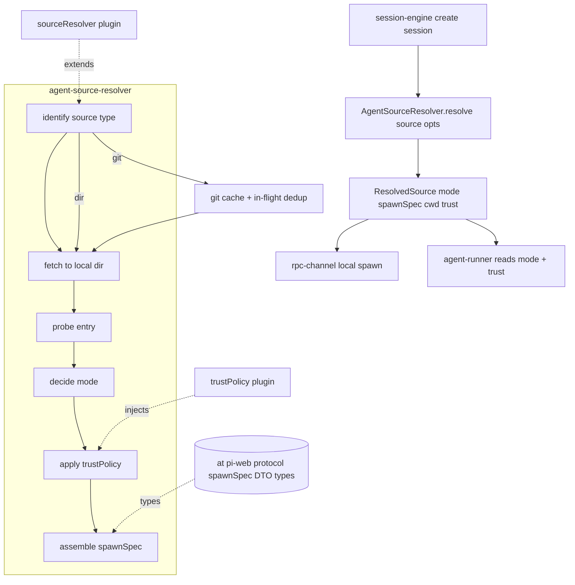
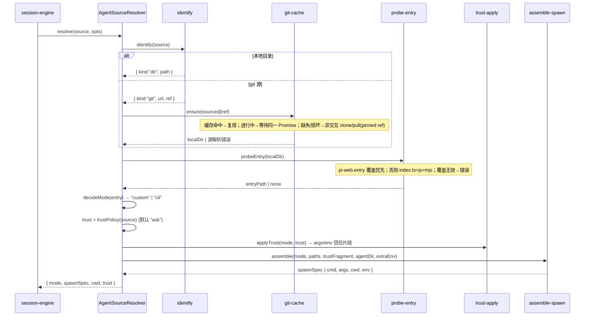
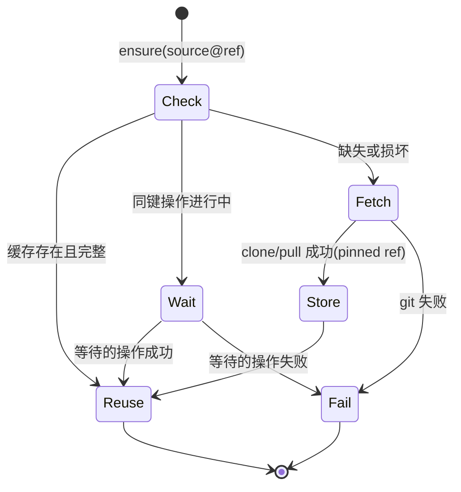

# Design Document — agent-source-resolver

## Overview

**Purpose**:本特性交付 `agent-source-resolver`——pi-web 后端引擎中的 **agent 源解析器**。它把会话创建入参 `source` 解析为一个统一的、可被下游直接消费的结果:`ResolvedSource = { mode, spawnSpec, cwd, trust }`。它集中处理三件易踩坑的事:目录/git 两类来源的统一化、有/无入口文件两类模式的判定、以及 headless 下 `.pi/` 项目资源默认被静默忽略的信任门控。

**Users**:`session-engine` 在创建会话时以单次调用获取 `ResolvedSource`;`rpc-channel` 的 local 通道据 `spawnSpec` 拉起子进程;`agent-runner` 据 `mode` 与传入的信任决策决定加载行为。本特性消费上游 `@blksails/pi-web-protocol` 的 spawnSpec/DTO 类型,处于依赖图内核层(`Depends on: protocol-contract`)。

**Impact**:把分散在"目录解析 / git 克隆 / 入口探测 / 模式判定 / 信任决策"的隐性逻辑收敛为一个边界清晰、可单测、可插拔的解析器,并把 §10.0.C 的信任门控显式化,消除"扩展明明在却没加载"的静默失败。

### Goals
- 把任意受支持的 `source`(本地目录 / git 三形态)解析为统一的本地工作目录与四元组结果。
- 以确定的优先级探测入口(`index.ts` > `index.js` > `index.mjs`,可被 `package.json#pi-web.entry` 覆盖)并据此判定 `mode ∈ {"custom","cli"}`。
- 产出形状稳定、与 `@blksails/pi-web-protocol` 对齐的 `spawnSpec = { cmd, args, cwd, env }`,满足 `rpc-channel` local 通道拉起契约。
- 以可插拔、按来源的 `trustPolicy(source)`(默认 `"ask"`)显式决定 `.pi/` 信任,并正确映射到两种模式的落地方式。
- 提供 git 缓存复用与并发去重、非交互安全。
- 满足"测试 + e2e(硬性)":单元 + 集成(本地 bare repo mock)+ 跨 spec spawnSpec 形状健全性。

### Non-Goals
- 不 spawn / 启动子进程(归 `rpc-channel`)。
- 不实现 bootstrap runner 本体,也不在本进程载入/执行用户 `index.ts`(归 `agent-runner`)。
- 不实现 RPC JSONL framing、SSE、HTTP 端点、会话注册与生命周期(归 `rpc-channel`/`http-api`/`session-engine`)。
- 不实现扩展安装(`pi install`,归 `extension-management`)与沙箱/容器隔离(归生产硬化)。
- 不定义 protocol 类型与 zod schema(归 `protocol-contract`,本 spec 仅消费)。

## Boundary Commitments

### This Spec Owns
- 源类型识别:本地目录(abs/rel)、git(`git:`、`https://...@ref`、`ssh://...`)。
- git 源克隆/更新到缓存(pinned ref、非交互)、缓存复用与并发去重;本地目录直接使用。
- 入口探测与优先级、`package.json#pi-web.entry` 覆盖。
- 双模式判定(custom/cli)与各自 `spawnSpec` 装配。
- 按来源信任策略 `trustPolicy(source)`(默认 `"ask"`)及其在 cli/custom 两模式的落地映射。
- 解析结果四元组 `ResolvedSource = { mode, spawnSpec, cwd, trust }` 的形状与语义。
- 可插拔接缝:`sourceResolver` 插件接口、`trustPolicy` 注入点。

### Out of Boundary
- 进程 spawn 与生命周期、RPC 通道实现(`rpc-channel`)。
- runner 本体、jiti 载入、`AgentDefinition` 归一化(`agent-runner`)。
- HTTP 端点、SSE、会话注册/翻译(`http-api`/`session-engine`)。
- 扩展安装、来源白名单落地、审计落库(`extension-management`/生产硬化)。
- protocol 类型/schema 定义(`protocol-contract`)。

### Allowed Dependencies
- **上游 spec**:`@blksails/pi-web-protocol`(protocol-contract)——**拥有** `SpawnSpec { cmd, args, cwd, env }` 及 DTO 类型与命名(单向依赖);本 spec 经 `import type { SpawnSpec } from "@blksails/pi-web-protocol"` 复用,绝不在本地定义该类型。
- **运行时**:Node `>=22.19.0`;Node 内置 `node:child_process`(仅用于执行 git 命令)、`node:fs`/`node:path`(探测与缓存)。**禁止**在本层 spawn agent 子进程或载入用户代码。
- **外部工具**:系统 `git`(经非交互 env 执行)。
- **开发/测试**:`vitest`;集成测试以本地 bare repo 作 git 远端 mock。

### Revalidation Triggers
- `ResolvedSource` 或 `spawnSpec` 形状/字段命名变化(影响 `rpc-channel`/`session-engine`/`agent-runner`)。
- `mode` 取值集合或判定规则变化(入口优先级、`pi-web.entry` 语义)。
- 信任落地映射变化(cli 标志、custom 传递点)或默认 `trustPolicy` 取值变化。
- 缓存路径约定 / 缓存键算法变化。
- pi CLI 信任/agentDir 相关标志或 env 名变化(对齐 pi 版本)。

## Architecture

### Architecture Pattern & Boundary Map

模式:**管道式解析器(staged resolver)**——`identify → fetch → probe → decide → trust → assemble`,纯逻辑阶段(识别/探测/模式/信任映射/装配)与 IO 阶段(git fetch、fs 探测)分层,IO 集中在少数适配器,使绝大多数行为可纯函数单测。源类型扩展经 `sourceResolver` 插件接缝,信任经 `trustPolicy` 注入。



**Architecture Integration**:
- **Selected pattern**:分阶段管道 + 插件接缝。理由:每阶段单一职责、可独立单测;IO 隔离便于以 bare repo mock 做集成测试。
- **Domain/feature boundaries**:`source/` 子域负责识别+获取+探测+判定;`trust/` 子域负责策略与落地映射;`spawn/` 负责 spawnSpec 装配。三者经类型契约衔接,不互相内联实现细节。
- **Dependency direction**:`agent-source-resolver → @blksails/pi-web-protocol`(单向);本 spec 不被 `rpc-channel`/`agent-runner` 反向依赖,只产出它们消费的数据。
- **New components rationale**:解析器是双模式与信任门控的唯一权威落点(PLAN §3.0.0 明确"检测逻辑放在 `agent-source.ts`")。
- **Steering compliance**:TypeScript strict、禁 `any`;安全做成可替换策略(`trustPolicy`/`sourceResolver` 插件点,structure.md);spec 边界 = 层边界。

### Technology Stack

| Layer | Choice / Version | Role in Feature | Notes |
|-------|------------------|-----------------|-------|
| Frontend / CLI | — | 不适用(后端引擎组件) | |
| Backend / Services | TypeScript strict;Node `>=22.19.0` | 解析逻辑、git 适配、入口探测、信任映射、spawnSpec 装配 | 位于 `lib/pi/`(或 `@blksails/pi-web-server`) |
| Data / Storage | 文件系统缓存 `~/.pi-web/agents/git/...` | git 源克隆缓存 | 本地目录来源不入缓存 |
| Messaging / Events | — | 不直接产生事件;产出 spawnSpec 供下游拉起 | |
| Infrastructure / Runtime | `node:child_process`(执行 git)、`node:fs`/`node:path`;系统 `git`;`vitest` | git 操作、探测、缓存、测试 | git 经 `GIT_TERMINAL_PROMPT=0` + ssh BatchMode 非交互执行 |

## File Structure Plan

### Directory Structure
```
lib/pi/
├── agent-source.ts              # ★ 公共入口:AgentSourceResolver.resolve()，编排各阶段，返回 ResolvedSource
└── source/
    ├── types.ts                 # ResolvedSource、SpawnSpec(对齐 @blksails/pi-web-protocol)、SourceKind、TrustDecision、ResolveOptions、插件接口
    ├── identify.ts              # 源类型识别(dir/git 三形态解析出 host/url/ref)+ sourceResolver 插件分发
    ├── git-cache.ts             # git clone/pull 到缓存(非交互 env)、缓存键派生、缓存损坏检测/重建、in-flight 去重
    ├── git-runner.ts            # node:child_process 执行 git 的薄适配器(注入非交互 env;唯一可被 mock 的 IO 点)
    ├── probe-entry.ts           # 入口探测(index.ts>js>mjs)+ package.json#pi-web.entry 覆盖与校验
    ├── decide-mode.ts           # 由入口存在性判定 mode(custom|cli)（纯函数）
    ├── trust-policy.ts          # 默认 trustPolicy(返回 "ask") + 注入点;TrustDecision 类型
    ├── trust-apply.ts           # 把 trust 映射到 spawnSpec(cli: --approve/--no-approve；custom: arg/env)（纯函数）
    └── assemble-spawn.ts        # 装配 SpawnSpec(cmd/args/cwd/env)：custom→runner、cli→pi CLI；并入 agentDir/额外 env（纯函数）
```

### Modified Files
- 无（greenfield）。若存在 monorepo workspace，本组件归入 `@blksails/pi-web-server` 包;接线属仓库初始化,本 spec 只创建组件文件。

> 每文件单一职责。IO 仅集中于 `git-runner.ts`（git 执行）与 `git-cache.ts`/`probe-entry.ts`（fs 读取），其余为纯函数，直接驱动单测。

### Public Exports（公共入口面）
本特性的公共入口 `agent-source.ts`（连同包级 barrel，如 `@blksails/pi-web-server` 的 index）**必须**再导出以下公共符号,使 `extension-management` 等下游可从公共面（而非深层 `source/types`）导入:
- 类型:`ResolvedSource`、`AgentMode`、`TrustDecision`、`TrustFragment`、`ResolveOptions`、`SourceResolverPlugin`。
- 函数:`AgentSourceResolver.resolve`（主入口）与 `applyTrust`（信任片段计算,供下游对齐信任落地映射复用）。
`SpawnSpec` 不在本特性公共面重新导出,下游应直接从 `@blksails/pi-web-protocol`（其拥有者）导入。深层路径 `source/types` 仅作内部实现细节,不作为下游稳定导入路径。

## System Flows

### 解析主流程（dir 与 git 分叉 + 信任落地）



要点:git 失败/`pi-web.entry` 覆盖无效/源类型不可识别均为**早退错误**且不产出 spawnSpec(Req 1.5/2.6/3.3）。信任阶段无论取值都不产生交互提示（headless）。

### git 缓存并发去重（状态）



## Requirements Traceability

| Requirement | Summary | Components | Interfaces | Flows |
|-------------|---------|------------|------------|-------|
| 1.1–1.4 | 源类型识别(dir/git 三形态 + 默认 ref) | identify.ts | `identify()` | 主流程 |
| 1.5 | 不可识别源 → 错误 | identify.ts | 错误类型 | 主流程 |
| 1.6 | source 缺省 → 默认 cwd + cli 路径 | identify.ts, decide-mode.ts | `identify()`/`decideMode()` | 主流程 |
| 2.1, 2.5 | git 克隆到缓存、pinned ref | git-cache.ts, git-runner.ts | `ensure()` | git 缓存 |
| 2.2, 6.1 | 同源缓存复用 | git-cache.ts | 缓存键 | git 缓存 |
| 2.3 | 非交互 git | git-runner.ts | 非交互 env 注入 | git 缓存 |
| 2.4, 6.2 | 并发去重 | git-cache.ts | in-flight Map | git 缓存 |
| 2.6 | git 失败 → 错误,不产 spawnSpec | git-cache.ts | 错误类型 | 主流程 |
| 6.3 | 缓存损坏重建 | git-cache.ts | 完整性检查 | git 缓存 |
| 6.4 | 本地目录直接用 | identify.ts | `identify()` | 主流程 |
| 3.1, 3.5 | 入口优先级 + 绝对路径 | probe-entry.ts | `probeEntry()` | 主流程 |
| 3.2, 3.3 | `pi-web.entry` 覆盖与校验 | probe-entry.ts | 覆盖逻辑/错误 | 主流程 |
| 3.4 | 无入口判定 | probe-entry.ts | `probeEntry()` | 主流程 |
| 4.1 | custom 模式 + runner spawnSpec | decide-mode.ts, assemble-spawn.ts | `decideMode()`/`assemble()` | 主流程 |
| 4.2 | cli 模式 + pi CLI spawnSpec | decide-mode.ts, assemble-spawn.ts | `assemble()` | 主流程 |
| 4.3 | 统一 spawnSpec 形状(`SpawnSpec` 从 @blksails/pi-web-protocol 导入复用,不本地定义) | types.ts, assemble-spawn.ts | `import type { SpawnSpec }` | — |
| 4.4 | cwd 一致(顶层与 spawnSpec) | assemble-spawn.ts | `assemble()` | 主流程 |
| 4.5 | 不 spawn / 不载入用户代码 | agent-source.ts | 边界约束 | — |
| 5.1, 5.2 | trustPolicy(默认 ask) | trust-policy.ts | `trustPolicy()` | 主流程 |
| 5.3, 5.4 | trust=always 落地(cli/custom) | trust-apply.ts | `applyTrust(): TrustFragment` | 主流程 |
| 5.5 | trust=never 落地 | trust-apply.ts | `applyTrust()` | 主流程 |
| 5.6 | trust=ask headless 忽略 `.pi/` | trust-apply.ts | `applyTrust()` | 主流程 |
| 5.7 | context/全局扩展不受 trust 影响 | trust-apply.ts | 不抑制约定 | — |
| 5.8 | 结果保留 trust 取值 | agent-source.ts, types.ts | `ResolvedSource.trust` | — |
| 7.1, 7.2 | agentDir(PI_CODING_AGENT_DIR)+ 额外 env | assemble-spawn.ts | `assemble()` env 合并 | — |
| 7.3 | env 敏感值不入日志/错误 | git-runner.ts, agent-source.ts | 错误构造约定 | — |
| 8.1 | sourceResolver 插件 | identify.ts, types.ts | `SourceResolverPlugin` | — |
| 8.2 | trustPolicy 注入 | trust-policy.ts, types.ts | `ResolveOptions.trustPolicy` | — |
| 8.3 | 单一解析入口 + 公共面再导出 `TrustDecision`/`TrustFragment`/`applyTrust` 供下游复用 | agent-source.ts, trust-apply.ts, types.ts | `AgentSourceResolver.resolve()` / `applyTrust()` / Public Exports | 主流程 |
| 9.1–9.6 | 单元/集成/e2e 健全性 + 单一命令 | 全部 + test/ | vitest | 全部 |

## Components and Interfaces

| Component | Layer | Intent | Req Coverage | Key Dependencies (P0/P1) | Contracts |
|-----------|-------|--------|--------------|--------------------------|-----------|
| agent-source.ts | engine | 公共入口,编排管道,返回 ResolvedSource | 4.5, 5.8, 7.3, 8.3, 9.* | source/* (P0), @blksails/pi-web-protocol (P1) | Service |
| source/identify.ts | source | 源类型识别 + 插件分发 | 1.1–1.6, 6.4, 8.1 | types (P0) | Service |
| source/git-cache.ts · git-runner.ts | source | git 克隆/缓存/去重/非交互执行 | 2.1–2.6, 6.1–6.3, 7.3 | node:child_process/fs (P0) | Service |
| source/probe-entry.ts | source | 入口探测 + entry 覆盖 | 3.1–3.5 | node:fs (P0) | Service |
| source/decide-mode.ts | source | 模式判定(纯) | 4.1, 4.2, 1.6 | — | Service |
| source/trust-policy.ts | trust | 默认 + 注入 trustPolicy | 5.1, 5.2, 8.2 | types (P0) | Service |
| source/trust-apply.ts | trust | trust→`TrustFragment` 映射(纯);经公共面导出 `applyTrust` | 5.3–5.7 | types (P0) | Service |
| source/assemble-spawn.ts | spawn | 装配 SpawnSpec(纯) | 4.1–4.4, 7.1, 7.2 | types (P0) | Service |
| source/types.ts | types | 共享类型/插件接口;`SpawnSpec` 从 @blksails/pi-web-protocol 导入复用,`TrustFragment` 本地定义并导出 | 4.3, 5.8, 8.1, 8.2 | @blksails/pi-web-protocol (P1) | State |

### engine

#### AgentSourceResolver（agent-source.ts）

| Field | Detail |
|-------|--------|
| Intent | 单次调用把 `source` 解析为 `ResolvedSource`,编排识别→获取→探测→判定→信任→装配 |
| Requirements | 4.5, 5.8, 7.3, 8.3 |

**Responsibilities & Constraints**
- 唯一对外入口;按管道顺序调用各阶段,任一阶段错误即早退并不产出 spawnSpec。
- 严禁在本进程 spawn agent 子进程或载入/执行入口文件(Req 4.5)。
- 错误信息中不得包含 env 敏感值(Req 7.3)。

**Dependencies**
- Inbound: `session-engine` — 会话创建时调用 (P0)
- Outbound: `source/*` 各阶段 — 编排 (P0)
- External: `@blksails/pi-web-protocol` — `SpawnSpec`/DTO 类型 (P1)

**Contracts**: Service [x]

##### Service Interface
```typescript
// SpawnSpec 由 @blksails/pi-web-protocol 拥有（protocol-contract 为上游单一来源）；本 spec 仅导入复用，不在本地定义
import type { SpawnSpec } from "@blksails/pi-web-protocol";

export type AgentMode = "custom" | "cli";
export type TrustDecision = "always" | "never" | "ask";

// applyTrust 的返回形状，作为命名公共类型导出供 extension-management 等下游复用
export interface TrustFragment {
  extraArgs: string[];
  extraEnv: Record<string, string>;
}

export interface ResolvedSource {
  mode: AgentMode;
  spawnSpec: SpawnSpec;          // { cmd, args, cwd, env }
  cwd: string;                   // 与 spawnSpec.cwd 一致
  trust: TrustDecision;
}

export interface ResolveOptions {
  cwd?: string;                  // 默认工作区(source 缺省/相对路径基准)
  agentDir?: string;             // → spawnSpec.env.PI_CODING_AGENT_DIR
  env?: Record<string, string>;  // 额外 env(如 provider key),并入 spawnSpec.env
  trustPolicy?: (source: string) => TrustDecision;     // 默认返回 "ask"
  sourceResolver?: SourceResolverPlugin;               // 扩展源类型
  runnerEntry?: string;          // bootstrap runner 路径(custom 模式 spawnSpec 目标，本 spec 不提供 runner 本体)
  piCliEntry?: string;           // pi CLI 入口(cli 模式 spawnSpec 目标)
}

export interface AgentSourceResolver {
  resolve(source: string | undefined, opts?: ResolveOptions): Promise<ResolvedSource>;
}
```
- Preconditions:`git` 可执行(git 源时);`runnerEntry`/`piCliEntry` 由调用方注入(指向真实文件由其负责)。
- Postconditions:成功时 `spawnSpec.cwd === cwd`;`trust` 与所用策略一致;失败时抛出可识别的源解析/入口错误且无 spawnSpec。
- Invariants:不 spawn、不载入用户代码;env 敏感值不外泄。

**Implementation Notes**
- Integration:`session-engine` 单次调用获取四元组,转交 `rpc-channel` 拉起。
- Validation:见 Testing Strategy。
- Risks:pi 标志/agentDir env 变化 → 收敛到 `trust-apply.ts`/`assemble-spawn.ts` 单点。

### source

#### git-cache.ts / git-runner.ts

| Field | Detail |
|-------|--------|
| Intent | 将 git 源非交互克隆/更新到按 `source@ref` 派生的缓存,复用 + 并发去重 + 损坏重建 |
| Requirements | 2.1–2.6, 6.1–6.3, 7.3 |

**Responsibilities & Constraints**
- 缓存路径 `~/.pi-web/agents/git/<host>/<path>@<ref>`;检出固定 ref(pinned)。
- `git-runner.ts` 是唯一执行 git 的 IO 点,强制注入 `GIT_TERMINAL_PROMPT=0` 与 `GIT_SSH_COMMAND="ssh -o BatchMode=yes -o StrictHostKeyChecking=accept-new"`,确保零交互(Req 2.3)。
- in-flight `Map<cacheKey, Promise<string>>` 去重并发(Req 2.4/6.2);缓存缺失或缺 `.git` 元数据视为损坏并重建(Req 6.3)。
- git 失败抛源解析错误(含 source、ref、原因摘要,不含敏感 env)(Req 2.6/7.3)。

**Contracts**: Service [x]

##### Service Interface
```typescript
export interface GitSource { url: string; ref: string; host: string; repoPath: string; }
export function deriveCacheKey(src: GitSource): string;          // 归一化 source@ref
export function ensureGitSource(src: GitSource, root?: string): Promise<string>; // 返回本地工作树目录
```
- Invariants:同 cacheKey 至多一个进行中操作;返回目录工作树固定在 `ref`。

**Implementation Notes**
- Integration:`identify.ts` 产出 `GitSource` 后调用 `ensureGitSource`,产物交 `probe-entry.ts`。
- Validation:集成测试用本地 bare repo 作远端(`file://` 或路径 remote),验证克隆到缓存、ref 定位、复用、损坏重建,全程离线(Req 9.4)。

#### probe-entry.ts

| Field | Detail |
|-------|--------|
| Intent | 在目标目录探测入口并应用 `pi-web.entry` 覆盖 |
| Requirements | 3.1–3.5 |

**Responsibilities & Constraints**
- 读取目录 `package.json`;若含 `pi-web.entry` → 解析为绝对路径并校验存在,不存在则抛覆盖无效错误(不静默回退,Req 3.3)。
- 否则按 `index.ts` > `index.js` > `index.mjs` 取首个存在者(Req 3.1)。
- 命中返回绝对路径(Req 3.5);均无则返回 `none`(Req 3.4)。

**Contracts**: Service [x]
```typescript
export type EntryProbe = { kind: "entry"; path: string } | { kind: "none" };
export function probeEntry(dir: string): Promise<EntryProbe>;
```

#### decide-mode.ts / trust-policy.ts / trust-apply.ts / assemble-spawn.ts（纯函数族）

**Summary-only**：
- `decideMode(entry)`：`entry.kind==="entry"` → `"custom"`，否则 `"cli"`（含 source 缺省 → cli，Req 1.6/4.1/4.2）。
- `trustPolicy(source)`：默认返回 `"ask"`；可被 `ResolveOptions.trustPolicy` 覆盖（Req 5.1/5.2/8.2）。
- `applyTrust(mode, trust)` → `TrustFragment`（`{ extraArgs, extraEnv }`）：
  | mode | trust | 落地 |
  |------|-------|------|
  | cli | always | `extraArgs += ["--approve"]` |
  | cli | never | `extraArgs += ["--no-approve"]` |
  | cli | ask | 无信任标志（headless 默认忽略 `.pi/`） |
  | custom | always | 经 spawnSpec 向 runner 传"信任 `.pi/`"决策（如 `--trust-project` arg 或 `PI_WEB_TRUST_PROJECT=1` env，runner 侧读取属 `agent-runner`） |
  | custom | never | 不传放行信号（默认忽略） |
  | custom | ask | 不传放行信号 |
  无论何种取值都不抑制 context 文件与全局/用户扩展加载，且不产生交互提示（Req 5.3–5.7）。
- `assemble(mode, paths, trustFragment, opts)` → `SpawnSpec`：
  - custom：`cmd="node"`，`args=["--import","jiti/register",runnerEntry,"--agent",entryPath,"--cwd",cwd, ...trustFragment.extraArgs]`，`cwd=work`。
  - cli：`cmd="node"`，`args=[piCliEntry,"--mode","rpc","--cwd",cwd, ...trustFragment.extraArgs]`，`cwd=source/默认工作区`。
  - `env = { ...process-injected-base, PI_CODING_AGENT_DIR: opts.agentDir?, ...opts.env, ...trustFragment.extraEnv }`，关键隔离变量不被额外 env 覆盖（Req 7.1/7.2）；`spawnSpec.cwd === 顶层 cwd`（Req 4.4）。

**Contracts**: Service。**Implementation Notes**：四者均为纯函数，直接驱动决策矩阵单测（Req 9.1/9.2）。

#### types.ts（含插件接口）

**Summary-only**：导出 `ResolvedSource`、`AgentMode`、`TrustDecision`、`TrustFragment`、`ResolveOptions`、`GitSource`、`EntryProbe` 与插件接口：
```typescript
export interface SourceResolverPlugin {
  canHandle(source: string): boolean;
  resolve(source: string, opts: ResolveOptions): Promise<{ localDir: string }>; // 返回供探测的本地目录
}
```
`SpawnSpec` 由上游 `@blksails/pi-web-protocol`（protocol-contract）拥有,本 spec **必须** `import type { SpawnSpec } from "@blksails/pi-web-protocol"` 复用,**不得**在本地定义或重声明该类型（Req 4.3）。`TrustFragment`（即 `applyTrust` 的返回形状 `{ extraArgs: string[]; extraEnv: Record<string,string> }`）在此处定义并导出。

## Data Models

### Data Contracts & Integration
- **核心契约**：`ResolvedSource = { mode, spawnSpec, cwd, trust }`，是本 spec 对外的唯一数据契约，被 `rpc-channel`（读 spawnSpec）、`session-engine`（读全部）、`agent-runner`（读 mode + custom 模式信任传递）消费。
- **spawnSpec**：`{ cmd, args, cwd, env }`，命名对齐 `@blksails/pi-web-protocol`；序列化为可被 `node:child_process.spawn(cmd, args, { cwd, env })` 直接使用的形状（Req 9.5 形状契约）。
- **缓存数据**：git 工作树缓存目录，键为归一化 `source@ref`；本地目录来源无持久数据。
- **trust**：`"always"|"never"|"ask"`，随结果返回供审计（Req 5.8）。

## Error Handling

### Error Strategy
- **源类型不可识别**（Req 1.5）：抛 `SourceKindError`，含原始 source 值，不产 spawnSpec。
- **git 失败**（Req 2.6）：抛 `GitResolveError`，含 source、ref、原因摘要；**剥离 env 敏感值**（Req 7.3）。
- **entry 覆盖无效**（Req 3.3）：抛 `EntryOverrideError`，含被覆盖路径，不静默回退。
- **fail fast**：任一阶段错误即早退，调用方（`session-engine`）据错误拒绝会话创建。
- 本 spec 不做重试/熔断（spawn 与生命周期归下游）。

### Monitoring
- 不在本组件内做监控/审计落库；`trust` 取值随结果返回供下游 `onAudit` 钩子记录（PLAN §13.4）。

## Testing Strategy

测试项直接源自验收标准（硬性：单元 + 集成 + e2e 健全性）。

### Unit Tests
- **源类型识别**：abs/rel 目录、`git:`、`https://...@ref`、`ssh://...`、缺 `@ref`（默认 ref）、不可识别 → 错误、source 缺省 → cli 路径。（1.1–1.6, 6.4）
- **入口探测优先级**：仅 `index.js` / 三者都在取 `.ts` / 无入口 → none；`pi-web.entry` 覆盖生效；覆盖指向不存在文件 → 错误（不回退）。（3.1–3.5）
- **双模式判定**：有入口 → custom + runner spawnSpec；无入口/缺省 → cli + pi CLI spawnSpec；`spawnSpec.cwd === cwd`。（4.1–4.4, 1.6）
- **trustPolicy 决策矩阵**（含 headless `ask`→忽略 `.pi/`）：六格矩阵（cli/custom × always/never/ask）逐格断言 `applyTrust` 产出的 args/env；显式断言 `ask` 不产生任何信任标志/放行 env。（5.1–5.7, 9.2）
- **env 合并 / 隔离**：`PI_CODING_AGENT_DIR` 来自 `agentDir`；额外 env 并入但不覆盖隔离关键变量；错误信息不含敏感值。（7.1–7.3）

### Integration Tests
- **本地目录(含 index)**：临时目录放 `index.ts` → 解析得 `mode="custom"`、spawnSpec 指向 runner 且 `--agent` 指向该 index。（9.3, 4.1, 3.1）
- **本地目录(不含 index)**：临时空目录 → `mode="cli"`、spawnSpec 为 `pi --mode rpc --cwd <dir>`。（9.3, 4.2, 3.4）
- **git clone-to-cache（bare repo mock）**：创建本地 bare repo 作远端，`ensureGitSource` 克隆到缓存目录、检出 pinned ref、再次解析复用缓存、删坏缓存后重建——全程离线、零交互。（9.4, 2.1–2.6, 6.1–6.3）

### E2E / 跨 spec 健全性
- **spawnSpec 形状健全性**：对"含 index"与"不含 index"两种 fixture，断言产出的 `spawnSpec` 满足 `rpc-channel` local 通道契约——即 `{ cmd:"node", args:string[], cwd:string, env:Record<string,string> }` 可作为 `child_process.spawn(cmd, args, { cwd, env })` 的合法入参；以轻量方式（参数形状 + 一次 `--version`/`--help` 级别可执行性探测，或纯结构断言）验证，不长期运行 agent 子进程。（9.5）

### 运行约定
- 单一命令（`pnpm test`）运行全部单元 + 集成 + e2e 健全性测试并产出可验证结果。（9.6）

## Security Considerations
- **RCE 边界**：本组件**不**载入/执行用户入口代码、**不** spawn 子进程（Req 4.5），把任意代码执行风险下移到 `agent-runner`/`rpc-channel` 与沙箱层（PLAN §11.2）。
- **信任显式化**：`trust` 默认 `"ask"`，绝不无脑全开；`always` 仅在调用方策略明确返回时落地，且建议仅用于可信来源 + 沙箱内（PLAN §10.0.C/§11.2）。
- **非交互 git**：强制 `GIT_TERMINAL_PROMPT=0` + ssh BatchMode，杜绝交互式凭据/主机确认导致的挂起或意外信任（Req 2.3）。
- **敏感数据**：env（provider key 等）只透传进 `spawnSpec.env`，不写日志、不入错误信息（Req 7.3）。

## 实现修正（post-implementation errata）

### ER-1：CLI 模式 spawnSpec 不得包含 `--cwd`（运行期 bug 修复）
- **现象**：选用无 `index.ts` 的目录（CLI 回退）创建会话后，`GET/POST /sessions/:id/*` 返回 404（`SESSION_NOT_FOUND`）；会话创建即从 store 消失。
- **根因**：`assemble-spawn.ts` 的 CLI 分支拼了 `node <pi cli.js> --mode rpc --cwd <dir>`，但 **pi CLI 没有 `--cwd` 选项** → 子进程以 `Error: Unknown option: --cwd` 退出（exit code 1）→ 通道崩溃 → `onClosed` → `store.delete` → 后续 `:id` 路由 404。
- **修复**：CLI 分支移除 `--cwd <dir>`；工作目录改由 **`spawnSpec.cwd`**（child_process 的 cwd 选项）设置，pi 从进程工作目录读取 cwd。最终 CLI args = `[piCliEntry, "--mode", "rpc", ...trustFragment.extraArgs]`。
- **影响**：custom 模式不受影响（自带 runner 接受 `--cwd`,继续传递）。更新了 `mode-trust.test.ts` / `resolver.test.ts` 中断言 CLI args 形状的用例（不再含 `--cwd`）。
- **验证**:浏览器 e2e 中 CLI 模式（源 `.`）多轮对话流式正常；real-mode get_state/stream 200。
