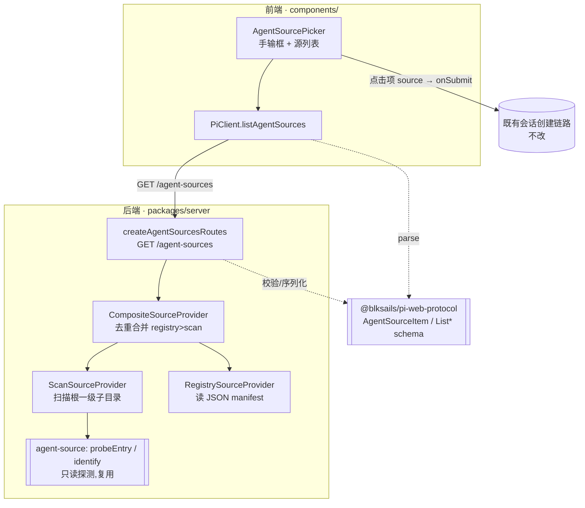
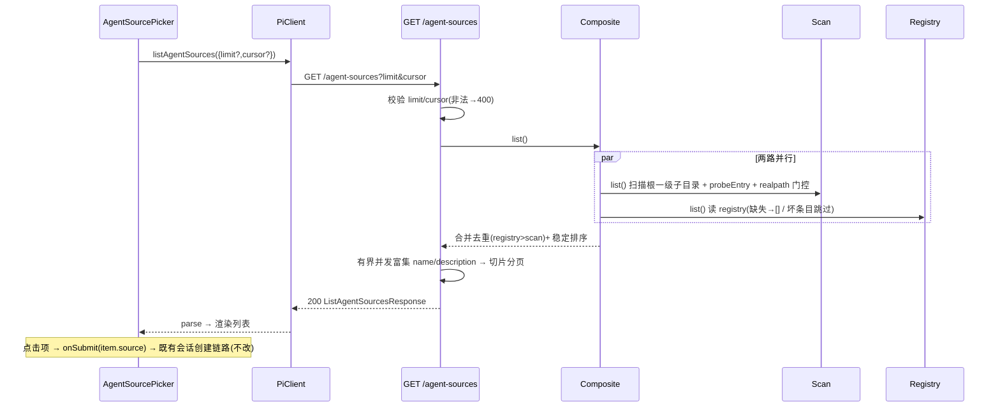

# Design Document — agent-sources-list

## Overview

**Purpose**:给 pi-web 的"新建会话"入口(`AgentSourcePicker`)补上一个**只读、可浏览的 agent source 列表**,让用户无需记忆并手输路径即可从列表点选一个 agent 开始会话。

**Users**:使用 pi-web 产品界面新建会话的终端用户(点选常用 agent);把多个 agent 放在一个根目录下的部署者/运维者(零登记自动发现)。

**Impact**:在既有"手输 source 字符串 → `onSubmit` → 创建会话"链路之前,前置一层可选的源列表。新增一个只读枚举端点 `GET /agent-sources`,数据来源为「目录扫描 ∪ 注册表文件」两路合并。会话创建引擎、协议会话流、`usePiSession` 均不改动。

### Goals
- 新增只读端点 `GET /agent-sources`,聚合目录扫描与注册表两路来源、去重后返回轻量元数据列表。
- 扩展 `AgentSourcePicker`:在手输框之上展示可选源列表,点击项等价于以其 source 字符串走既有 `onSubmit`。
- 严格只读、无副作用;扫描仅限配置根之内(realpath 门控);来源缺失/损坏容错。
- 复用既有源探测语义(`probeEntry`/`identify`),使枚举判定与真正建会话一致。

### Non-Goals
- 任何写操作:不增删改注册表、不 clone git、不改信任策略、不 spawn 会话。
- 不触发 `AgentSourceResolver.resolve()`。
- 不改 `POST /sessions`、`usePiSession`、REST/SSE 会话流。
- 不改 `sessions-list` 相关行为。

## Boundary Commitments

### This Spec Owns
- 只读端点 `GET /agent-sources` 及其请求/响应契约。
- `AgentSourceProvider` 抽象与三个实现(Scan / Registry / Composite),及其去重合并顺序。
- 协议层 `AgentSourceItem / ListAgentSourcesRequest / ListAgentSourcesResponse` schema。
- `AgentSourcePicker` 内"源列表"子视图与选取交互;`PiClient.listAgentSources` 客户端方法;pi-handler 端点装配。

### Out of Boundary
- 源的解析/克隆/装配子进程(归 `agent-source` resolver + 会话引擎,本 spec 只读引用其**探测**子集)。
- 会话创建、恢复、URL 同步、source→sessionId 记录(归既有 chat-app / usePiSession 链路,选中项仅复用其 `onSubmit`)。
- 信任策略与 git 缓存维护。

### Allowed Dependencies
- `packages/server/src/agent-source/`:仅 `probeEntry`、`identify`(只读、纯函数)。
- `packages/server/src/http/`:`InjectedRoute`、`errorResponse`、`jsonResponse`。
- `@blksails/pi-web-protocol`:新增 schema 挂靠既有 rest-dto。
- Node 内置 `fs/promises`、`path`(扫描/realpath/读 registry)。
- 前端:既有 `createPiClient`、`AgentSourcePicker` props 注入面。

### Revalidation Triggers
- `AgentSourceItem` 字段形状变化(协议 semver)。
- 端点路径/查询参数/错误码变化。
- provider 合并/去重顺序或 id 稳定策略变化(影响前端展示与选中语义)。
- 新增环境变量或其默认值/门控语义变化。

## Architecture

### Existing Architecture Analysis
- **注入式端点**:`createPiWebHandler({ routes })` 接受 `ReadonlyArray<InjectedRoute>`;`createSessionListRoutes` 是同构模板(惰性单例、参数校验、`errorResponse/jsonResponse`、base64url 游标、有界并发富集)。本特性照此增加 `createAgentSourcesRoutes`。
- **源探测语义**:`probeEntry(dir)`(entry→custom / none→cli)、`identify(source)`(dir/git)已是权威且被会话创建链路使用。枚举必须复用它们,保证"列表里能选的源"与"真能建会话的源"判定一致。
- **前端注入式面板**:`SessionListPanel` 由 chat-app 注入 `piClient.listSessions`,组件自身不持接线。`AgentSourcePicker` 照此接受注入的 `listAgentSources`。

### Architecture Pattern & Boundary Map



- **Selected pattern**:注入式只读端点 + provider 组合(Composite over Scan/Registry)。与 sessions-list 对齐,最小侵入。
- **Existing patterns preserved**:InjectedRoute 注入面、errorResponse/jsonResponse、协议 zod 单源、前端注入式组件。
- **New components rationale**:三个 provider 拆分让"扫描"与"注册表"两路各自可测、Composite 只管去重合并;端点只做校验/分页/序列化。

### Technology Stack

| Layer | Choice | Role in Feature | Notes |
|-------|--------|-----------------|-------|
| Frontend | React(既有 `AgentSourcePicker`) | 源列表展示与选取 | 复用注入式 props |
| Backend | Node + Web Fetch handler(`InjectedRoute`) | `GET /agent-sources` | 复用 `errorResponse/jsonResponse` |
| Discovery | `fs/promises` + `path` + 复用 `probeEntry/identify` | 扫描/registry/realpath 门控 | 纯读、无副作用 |
| Contract | zod(`@blksails/pi-web-protocol`) | 请求/响应 schema | semver 受控 |

## File Structure Plan

### Directory Structure
```
packages/server/src/agent-source-list/          # 新目录:只读源枚举
├── index.ts                                     # 公共导出(createAgentSourcesRoutes, provider, 类型)
├── types.ts                                     # AgentSourceRecord, AgentSourceProvider, 选项类型
├── scan-provider.ts                             # ScanSourceProvider:扫描根一级子目录 + probeEntry + realpath 门控
├── registry-provider.ts                         # RegistrySourceProvider:读 JSON manifest,容错
├── composite-provider.ts                        # CompositeSourceProvider:去重合并(registry 覆盖 scan)+ 排序
└── agent-sources-routes.ts                      # createAgentSourcesRoutes(opts): InjectedRoute[]

packages/protocol/src/transport/rest-dto.ts      # 追加 AgentSourceItem / ListAgentSourcesRequest / ListAgentSourcesResponse schema

packages/server/test/agent-source-list/          # 新测试目录
├── scan-provider.test.ts
├── registry-provider.test.ts
├── composite-provider.test.ts
└── agent-sources-routes.test.ts                 # 端点集成(参数校验/空态/去重/越界剔除)

packages/react/test/client/pi-client-agent-sources.test.ts  # listAgentSources 拼串 + parse
components/__tests__ 或就近                        # AgentSourcePicker 列表渲染/选取/空态(依既有测试落点)
e2e/                                              # 浏览器 e2e:弹 picker → 选源 → 建会话 → 流式回复
```

### Modified Files
- `packages/react/src/client/pi-client.ts` — 新增 `listAgentSources(req)` 方法(URLSearchParams + `ListAgentSourcesResponseSchema.parse`)与接口声明。
- `packages/react/src/index.ts` / `packages/server/src/index.ts` — 导出新增公共符号(端点工厂/类型)。
- `components/agent-source-picker.tsx` — 在表单之上增加源列表子视图 + 加载/空/错三态 + 点击项调 `onSubmit`;新增可选 props `listAgentSources?`、`enableSourceList?`。
- `components/chat-app.tsx` — ChatApp 层 `useMemo` 一个 `piClient`,把 `piClient.listAgentSources` 与门控开关注入 `AgentSourcePicker`。
- `lib/app/pi-handler.ts` — `routes:` 数组追加 `...createAgentSourcesRoutes({ scanRoots, registryPath })`,从 env 解析根目录与注册表路径。
- `app/api/agent-sources/[[...path]]/route.ts`(**新增**)— Next catch-all 转发器,把 `/api/agent-sources/**` 无损转发到单例 handler(与 `/api/sessions`、`/api/config` 等同构)。handler router basePath=`/api` 会 strip 前缀后匹配注入的 `/agent-sources` 路由。**没有此转发器则 `/api/agent-sources` 落到 Next 404,不会到达 handler**(sessions-list 借用 `/api/sessions/**` catch-all,新顶层段必须自带转发器)。
- `docs/product/07-agent-development.md`(或新增小节)+ `05-configuration.md` — 记录端点契约与两个新环境变量;中英双份。

## System Flows

### 枚举请求处理



门控:未配 `scanRoots` 且 registry 不存在 → Composite 返回 `[]` → 端点 200 空列表(Req 1.2/6.4)。任一 provider 抛错不使整表失败(各自 try/catch,退化为空贡献)。

## Requirements Traceability

| Requirement | Summary | Components | Interfaces | Flows |
|---|---|---|---|---|
| 1.1 | 返回源列表(含标识/source/名/kind/origin/mode) | Composite, Route | `AgentSourceItem` | 枚举请求 |
| 1.2 | 无来源→空列表且成功 | Composite, Route | list()→[] | 门控 |
| 1.3 | 参数非法→客户端错误 | Route | `errorResponse(400)` | 校验 |
| 1.4 | 超页→续取游标 | Route | cursor(base64url) | 分页 |
| 2.1–2.4 | 扫描发现 + custom/cli 判定 + 可提交路径 | Scan, `probeEntry` | `AgentSourceRecord` | 扫描 |
| 2.5 | realpath 越界剔除 | Scan | realpath 门控 | 扫描 |
| 3.1–3.4 | 注册表读取/缺失/损坏/ git 不 clone | Registry | manifest 解析 | 注册表 |
| 4.1–4.3 | 去重/registry 覆盖/稳定排序 | Composite | dedup by id | 合并 |
| 5.1–5.5 | 列表展示/选取/三态/空态/建会话中禁点 | AgentSourcePicker, Client | props 注入 | 前端 |
| 6.1–6.4 | 只读/仅扫描根/有界并发/无来源即无列表 | Scan, Route, chat-app | — | 全流程 |

## Components and Interfaces

| Component | Layer | Intent | Req | Key Deps | Contracts |
|---|---|---|---|---|---|
| AgentSourceProvider | server | 统一枚举抽象 | 1,2,3,4 | — | Service |
| ScanSourceProvider | server | 扫描根发现 + 门控 | 2,6 | probeEntry/identify, fs | Service |
| RegistrySourceProvider | server | 读 JSON manifest | 3 | fs | Service |
| CompositeSourceProvider | server | 去重合并 + 排序 | 4 | 上两者 | Service |
| createAgentSourcesRoutes | server | 端点校验/分页/序列化 | 1,6 | Composite, http | API |
| AgentSourceItem 等 schema | protocol | 请求/响应契约 | 1 | zod | Data |
| PiClient.listAgentSources | react | 客户端调用 | 5 | schema | Service |
| AgentSourcePicker(扩展) | components | 列表展示 + 选取 | 5 | Client(注入) | State |

### Server 层

#### AgentSourceProvider 与实现

**Responsibilities & Constraints**
- `AgentSourceProvider.list()` 返回 `AgentSourceRecord[]`,**只读、无副作用**(Req 6.1)。
- Scan 仅枚举配置根的一级子目录,realpath 后必须仍落在根内(Req 2.5/6.2)。
- Registry 缺失=空;坏文件/坏条目跳过而非整表失败(Req 3.2/3.3)。
- Composite 按 `id` 去重,registry 记录覆盖 scan 记录的元数据(Req 4.1/4.2),稳定排序(registry 优先,其后按 name)(Req 4.3)。

##### Service Interface
```typescript
/** provider 内部记录(未投影为对外 DTO 前)。 */
interface AgentSourceRecord {
  readonly id: string;          // 稳定标识:dir→realpath 绝对路径;git→`url@ref`
  readonly source: string;      // 可直接提交给会话创建的 source 字符串
  readonly name: string;        // 显示名:registry.name > package.json name > 目录/repo 末段
  readonly kind: "dir" | "git";
  readonly origin: "scan" | "registry";
  readonly mode: "custom" | "cli";  // dir 由 probeEntry 判定;git 记为 custom(枚举不 clone,乐观标注)
  readonly description?: string;
}

interface AgentSourceProvider {
  list(): Promise<AgentSourceRecord[]>;
}

interface ScanProviderOptions {
  readonly roots: readonly string[];     // PI_WEB_SOURCES_ROOT 解析而来(可多个)
  readonly concurrency?: number;         // 富集有界并发,默认 8
}
interface RegistryProviderOptions {
  readonly registryPath: string;         // PI_WEB_SOURCES_REGISTRY,默认 ~/.pi/... 见配置
}
```
- Preconditions:roots 为绝对路径;registryPath 可不存在。
- Postconditions:返回记录均满足"可被会话创建链路接受";越界/无效项已剔除。
- Invariants:无任何写 fs / 无 spawn / 无 network。

##### realpath 门控(Scan 核心)
```
for each root in roots:
  rootReal = await fs.realpath(root)            // root 不存在→跳过该 root
  for each dirent in readdir(root, withFileTypes):
    if !dirent.isDirectory(): continue
    cand = path.join(root, dirent.name)
    candReal = await fs.realpath(cand)          // 失败→跳过
    if !(candReal === rootReal || candReal.startsWith(rootReal + path.sep)): continue  // 逃逸→剔除
    probe = await probeEntry(candReal)          // 复用,勿重造
    mode  = probe.kind === "entry" ? "custom" : "cli"
    record ← { id: candReal, source: candReal, name: pkgName ?? basename, kind:"dir", origin:"scan", mode }
```
> git 源不经扫描发现(扫描只面向本地目录);git 源只来自 registry。

##### Registry manifest 形态
```jsonc
// PI_WEB_SOURCES_REGISTRY (默认 ~/.pi/agent 下的 sources.json;见配置小节)
{
  "sources": [
    { "source": "/abs/path/to/agent", "name": "My Agent", "description": "…" },
    { "source": "git:github.com/org/repo@main", "name": "Remote Agent" }
  ]
}
```
- 逐条 zod 校验;非对象/缺 `source` 的条目跳过(Req 3.3)。
- `kind` 由 `identify(source)` 派生;git 条目**不 clone**(Req 3.4)。id:dir→realpath(存在时)否则规范化路径;git→`url@ref`。

#### createAgentSourcesRoutes

**Contracts**: API ✓

##### API Contract
| Method | Endpoint | Request(query) | Response | Errors |
|---|---|---|---|---|
| GET | `/agent-sources` | `limit?`(正整数)`cursor?`(base64url) | `ListAgentSourcesResponse` | 400 INVALID_REQUEST, 500 INTERNAL |

- 校验 limit(非整/≤0→400)、cursor(解码失败→400)。
- 调 `composite.list()` → 稳定排序已由 Composite 保证 → base64url `{name,id}` 游标 keyset 切片(与 sessions-list 同法)。
- 有界并发富集 description(需读子目录 README/pkg 时);富集失败静默忽略(展示增强不致失败)。
- 惰性单例:首个请求构造 provider 并缓存。

### Protocol 层

```typescript
export const AgentSourceItemSchema = z.object({
  id: z.string(),
  source: z.string(),
  name: z.string(),
  kind: z.enum(["dir", "git"]),
  origin: z.enum(["scan", "registry"]),
  mode: z.enum(["custom", "cli"]),
  description: z.string().optional(),
});
export type AgentSourceItem = z.infer<typeof AgentSourceItemSchema>;

export const ListAgentSourcesRequestSchema = z.object({
  limit: z.number().int().positive().optional(),
  cursor: z.string().optional(),
});
export type ListAgentSourcesRequest = z.infer<typeof ListAgentSourcesRequestSchema>;

export const ListAgentSourcesResponseSchema = z.object({
  sources: z.array(AgentSourceItemSchema),
  nextCursor: z.string().optional(),
});
export type ListAgentSourcesResponse = z.infer<typeof ListAgentSourcesResponseSchema>;
```

### 前端

#### PiClient.listAgentSources
```typescript
listAgentSources(req: ListAgentSourcesRequest): Promise<ListAgentSourcesResponse>;
// URLSearchParams(limit,cursor) → GET /agent-sources → ListAgentSourcesResponseSchema.parse
```

#### AgentSourcePicker(扩展)

| Field | Detail |
|---|---|
| Intent | 在既有手输框之上展示可选源列表并支持点击选取 |
| Requirements | 5.1–5.5 |

**新增 props(向后兼容,均可选)**
```typescript
interface AgentSourcePickerProps {
  readonly onSubmit: (source: string) => void;      // 既有,不变
  readonly defaultSource?: string;                  // 既有
  readonly loading?: boolean;                        // 既有(会话创建中)
  readonly error?: string;                           // 既有
  // 新增:
  readonly listAgentSources?: (req: ListAgentSourcesRequest) => Promise<ListAgentSourcesResponse>;
  readonly enableSourceList?: boolean;               // 门控:未启用或无注入则不显示列表(Req 6.4)
}
```

**State / 交互**
- mount 时(`enableSourceList && listAgentSources`)拉首页;三态 `idle|loading|error`,竞态守卫(reqId ref,照 SessionListPanel)。
- 列表项显示 `name` + mode 徽标(custom/cli)+ 可选 description;`data-agent-source-list` / `data-agent-source-item` 供 e2e 选择。
- 点击项 → `onSubmit(item.source)`(Req 5.2),等价手输后提交。
- 加载失败:显示可识别错误,**不阻断**手输框(Req 5.3)。空列表:空态提示 + 保留手输框(Req 5.4/4)。
- `loading===true`(会话创建中)禁用列表项点击(Req 5.5)。

## Error Handling

### Error Strategy
- **端点**:参数错误 → `errorResponse(400,"INVALID_REQUEST",…,[field])`;provider 未捕获异常 → `500 INTERNAL`。但单个 provider 内部错误(root 不存在/registry 坏)被 provider 自身吞掉、退化为空贡献,不冒泡为 500(Req 1.2/3.2/3.3)。
- **Scan**:`realpath` 失败/越界/`readdir` 失败 → 跳过该项/该 root,不抛。
- **Registry**:文件缺失 → `[]`;`JSON.parse` 或条目校验失败 → 跳过坏部分。
- **前端**:列表加载失败 → 三态 error + 保留手输兜底,不 throw。

### Error Categories
- User(4xx):limit/cursor 非法 → 字段级 400。
- System(5xx):仅当装配/序列化等意外失败 → 500(正常来源缺失不算)。

### Monitoring
- 复用既有 logger;provider 内跳过项以 debug 级别记录(不刷屏、不致失败)。

## Testing Strategy

### Unit Tests
- `scan-provider`:fixture 目录 —— 含 `index.ts` 子目录→custom;空目录→cli 或按 mode 语义;非目录条目忽略;符号链接逃逸根→剔除(Req 2.2/2.3/2.5)。
- `registry-provider`:合法 manifest 读取;文件不存在→[];坏 JSON→[];个别坏条目跳过其余保留;git 条目 kind=git 且不发生 clone(Req 3.1–3.4)。
- `composite-provider`:scan∩registry 同源去重为一;registry 元数据覆盖 scan;稳定排序(registry 优先→name)(Req 4.1–4.3)。
- `pi-client`:`listAgentSources` 正确拼 `limit/cursor` 且对响应 `parse`(Req 5,协议一致)。

### Integration Tests
- `agent-sources-routes`:200 返回结构;未配来源→200 空列表(Req 1.2/6.4);`limit=0`/坏 cursor→400(Req 1.3);多于单页→带 `nextCursor` 且续取不重复(Req 1.4);扫描仅限根内、越界项不出现(Req 6.2)。
- **只读断言**:一次请求前后,fixture 目录/registry 文件字节与 mtime 不变,无子进程创建(Req 6.1)。

### E2E/UI Tests
- 浏览器 e2e(隔离 build `NEXT_DIST_DIR=.next-e2e` + external server):启动配好 `PI_WEB_SOURCES_ROOT=examples` 的实例 → 新建界面出现源列表(`data-agent-source-list`)→ 点击某项 → 会话创建 → 收到流式回复。验证"选列表项"与"手输等价字符串"结果一致的关键用户路径(Req 5.1/5.2)。
- 空态:未配来源 → 列表区显示空态、手输框仍可用(Req 5.4)。

## Security Considerations
- **路径遍历**:扫描的唯一外部可控面是"扫描根下的目录名 + 符号链接"。用 `fs.realpath` 规范化后前缀校验根,越界剔除(Req 2.5/6.2)。请求参数不参与路径构造(端点只收 limit/cursor)。
- **只读**:端点保证无写/无 clone/无 spawn(Req 6.1);git registry 条目仅读元数据。
- **拒绝服务**:有界并发富集 + 单页上限,避免超大根目录拖垮单请求(Req 6.3)。

## 配置(环境变量)

| 变量 | 作用 | 默认 |
|---|---|---|
| `PI_WEB_SOURCES_ROOT` | 扫描根目录,`path.delimiter`(: / ;)分隔多个;相对路径以 `config.defaultCwd` 解析为绝对 | 空(不扫描) |
| `PI_WEB_SOURCES_REGISTRY` | 注册表 JSON 路径 | `<agentDir>/sources.json`(存在才读) |
| `NEXT_PUBLIC_PI_WEB_SOURCE_PICKER` | 前端是否启用源列表入口(构建期内联);两端一致门控 | 关(`AgentSourcePicker` 仅显示手输框) |

> 未配 `PI_WEB_SOURCES_ROOT` 且 registry 不存在时,后端返回空列表;前端未开 `NEXT_PUBLIC_PI_WEB_SOURCE_PICKER` 时不渲染列表区(Req 6.4)。装配在 `lib/app/pi-handler.ts` 的 `routes:` 内追加,**改动后需重启 dev**(globalThis 单例)。
