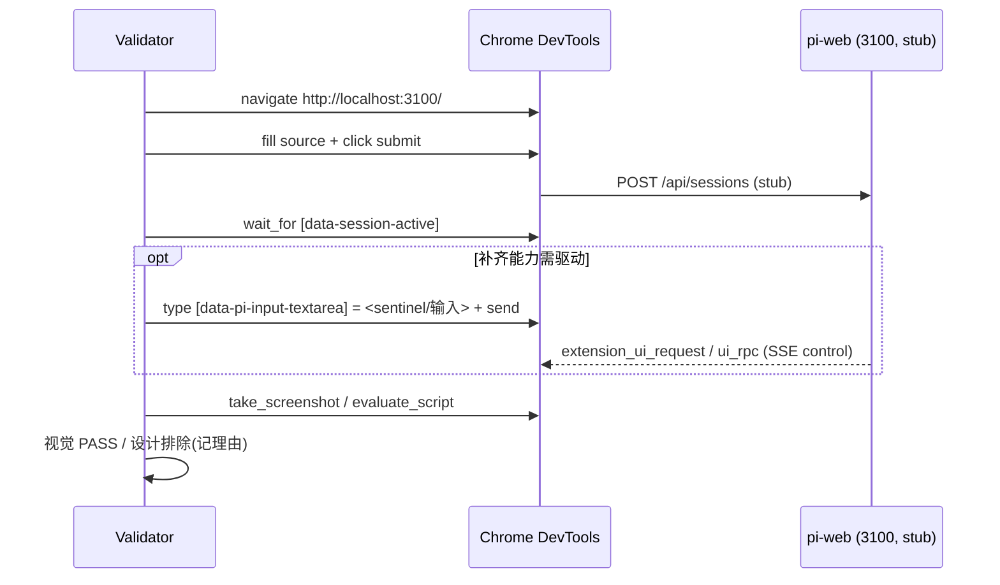

# Design Document — agent-web-extension-visual-acceptance

## Overview
本 spec 对 `agent-web-extension` 做**全量补齐 + 视觉验收**:既验证已接线能力,也补齐所有未接线/无驱动能力(9 接线缺口 + 12 协议保留插槽 + 4 未消费贡献点),直至 **29/29 在真实浏览器达成视觉 PASS**。被测应用 = 隔离生产构建(`.next-e2e`)经 `next start -p 3100`(`PI_WEB_STUB_AGENT=1`)。每条:选源 → 进会话 →(驱动)→ 截图/快照断言。

设计两大支柱:(1)**Slot/贡献点补齐设计**——逐一定义 12 插槽的挂载位置、`data` 属性、与现有环境 UI 的去重规则,及 4 贡献点的消费链路;(2)**Verification Matrix**——把 29 条按「Verify(已接线,直接截图)/ Implement+Verify(补齐后截图)」收口。Discovery 见 `research.md`(light 集成型)。

## Boundary Commitments
### This Spec Owns
- 补齐实现:`pi-chat.tsx` 新建 12 `SlotHost` + 4 贡献点消费;`chat-app.tsx` 透传 `extensionBaseUrl`/`theme`/`layout`;`stub-agent-process.mjs` 增确定性产出/sentinel;各示例 `web.config.tsx` 增 fixture。
- 浏览器视觉验收流程、截图/快照证据;复用既有 playwright 断言作回归层。
### Out of Boundary
- 重新设计 agent-web-extension 协议契约(`SlotKey`/`UiRpcPoint`/`extension_ui_request` 枚举本身不改)。
- 在线 LLM 路径:一律用 stub 确定性等价物替代。
### Allowed Dependencies
- `lib/app/webext-registry.ts`、6 `webext-*` 示例 + `server-driven-ui-agent`、`stub-agent-process.mjs`、Chrome DevTools MCP、`.next-e2e`、既有 `e2e/browser/*.e2e.ts`。
### Revalidation Triggers
- 任一宿主补齐改动(尤其 6 重叠插槽)完成后,回 `agent-web-extension` 主 spec 复验 R12–R17/R21/R28 既有断言不回归。

## 去重总原则(Coexistence Principle)
> 扩展插槽内容一律**追加(additive)**,赋独立 `[data-pi-ext-<slot>]` 属性,**绝不替换内核表面**。凡协议语义本意为「替换内核」(`promptInput` 全量替换输入、`dialogLayer` 接管模态)的,若与内核不变(R28)或交互闭环(R17)冲突且无法共存,则按 R6.5 标「设计排除」并记理由——这是唯一允许的非 PASS 出口。

## Slot 补齐设计(R6 的 12 插槽)
| 插槽 | `pi-chat.tsx` 挂载位置 | data 属性 | 重叠? | 去重/语义规则 |
|---|---|---|---|---|
| `sidebarLeft` | 会话列左侧,独立 `<aside>`(区别 basic `[data-pi-chat-sidebar]`) | `[data-pi-ext-sidebar-left]` | 否 | 干净新建 |
| `toolbar` | 消息区上方一行 | `[data-pi-ext-toolbar]` | 否 | 干净新建 |
| `accessoryAboveEditor` | `[data-pi-input-wrapper]` 内、Widgets(above)之上 | `[data-pi-ext-accessory-above]` | 否 | 与 ambient Widgets 并存(static vs 推送) |
| `accessoryBelowEditor` | `[data-pi-input-wrapper]` 内、Widgets(below)之下 | `[data-pi-ext-accessory-below]` | 否 | 同上 |
| `accessoryInlineLeft` | 输入行内、`[data-pi-input-textarea]` 左 | `[data-pi-ext-accessory-inline-left]` | 否 | flex 行内,不挤压 textarea |
| `accessoryInlineRight` | 输入行内、textarea 右 | `[data-pi-ext-accessory-inline-right]` | 否 | 同上 |
| `empty` | `[data-pi-chat-welcome]` 内,默认/`components.EmptyState` **之下追加** | `[data-pi-ext-empty]` | 是 | 追加,不替换默认空态 |
| `notifications` | ambient `[data-pi-notifications]` **旁**独立区 | `[data-pi-ext-notifications]` | 是 | 共存;ambient(PiInteraction)不动 |
| `statusBar` | ambient `[data-pi-extension-header]` 内、`[data-pi-status-bar]` **旁** | `[data-pi-ext-status-bar]` | 是 | 共存;ambient StatusBar 不动 |
| `artifactSurface` | 消息区下方独立区(非 panelRight) | `[data-pi-ext-artifact-surface]` | 是 | 与 panelRight artifact 并存于不同区 |
| `promptInput` | 包裹 `[data-pi-input-textarea]` 外层装饰,**不移除** textarea | `[data-pi-ext-prompt-input]` | 是 | 仅装饰追加;**全量替换语义 → 设计排除**(违 R28) |
| `dialogLayer` | 顶层 overlay,**不拦截** PiInteraction 的 confirm/select | `[data-pi-ext-dialog-layer]` | 是 | 附加模态宿主;**接管内核交互语义 → 设计排除**(违 R17) |

> 6 重叠插槽:`empty`/`notifications`/`statusBar`/`artifactSurface` 做共存追加;`promptInput`/`dialogLayer` 仅做附加装饰/附加宿主,全量替换/接管语义显式排除并记理由。

## 贡献点消费设计(R20 的 4 点)
| 贡献点 | 接入点 | 消费链路 | data 属性 / 效果 | 驱动 |
|---|---|---|---|---|
| `autocomplete` | 输入变更 → ui-rpc `point:"autocomplete" action:"complete"` | 复用 command-palette 浮层渲染候选 | `[data-pi-autocomplete]` 下拉 | stub 返回确定性 `{label,insertText}[]` |
| `inlineComplete` | 输入变更 → ui-rpc `point:"inlineComplete"` | textarea 灰字 ghost 后缀,Tab 接受 | `[data-pi-inline-complete]` | stub 返回确定性后缀串 |
| `keybindings` | 扩展声明 `Keybinding[]` | 全局 keydown 映射 combo→commandId 派发 | 隐藏标记 `[data-pi-keybindings]` + 触发后可见效果(如 notify) | 示例声明 combo;按键触发 |
| `custom` | ui-rpc `point:"custom"` | 通用派发到扩展自定义区 | `[data-pi-ext-custom]` 宿主区 | stub 回传 unknown payload |

## Environment & Tooling
| 项 | 选择 |
|---|---|
| 应用 | `NEXT_DIST_DIR=.next-e2e next start -p 3100`,env `PI_WEB_STUB_AGENT=1` + `SESSION_STORE=fs` |
| 浏览器驱动 | Chrome DevTools MCP:`navigate_page`/`take_snapshot`/`take_screenshot`/`fill`/`type_text`/`click`/`wait_for`/`evaluate_script`/`list_network_requests`/`press_key` |
| 选源 | `[data-agent-source-input]` → `[data-agent-source-submit]` → 等 `[data-session-active]` |
| 输入 | 可填元素 `[data-pi-input-textarea]`;`[data-pi-input-wrapper]` 仅定位 |
| sentinel | `ext-ui`→5 推送;`ext-select`→select+confirm;默认→confirm;新增 `ext-input`/`ext-editor` |

## 验收流程(每项)

## Verification Matrix(R1..R29)
> 类别:**Verify**=已接线,直接截图;**Impl+Verify**=补齐后截图。

| 需求 | 能力 | source/驱动 | 断言锚点 | 类别 |
|---|---|---|---|---|
| 1 | panelRight | webext-layout | `[data-pi-ext-panel-right]>[data-testid=layout-panel]` | Verify |
| 2 | headerCenter | webext-layout | `[data-pi-ext-header]>[data-testid=layout-header]` | Verify |
| 3 | headerLeft/Right | webext-layout(增节点) | `[data-pi-ext-header]` 左右内容 | Impl+Verify |
| 4 | footer | 示例增 footer | `[data-pi-ext-footer]` | Impl+Verify |
| 5 | background | webext-background | `[data-pi-chat-background] .pw-webext-background-aurora` | Verify |
| 6 | 12 协议保留插槽 | 示例 fixture×12 | `[data-pi-ext-<slot>]`(见上表) | Impl+Verify |
| 7 | data-metric 渲染器 | stub 增 data-metric | `[data-pi-data-part=data-metric]>[data-testid=metric-card]` | Impl+Verify |
| 8 | tool 渲染器 | 示例注册+stub 产 tool | 自定义 `tool-<name>` | Impl+Verify |
| 9 | 渲染边界 | stub 默认 | text/reasoning/tool/data/null 来源 | Verify(说明) |
| 10 | slash 扩展源 | webext-contrib | `[data-pi-command-item]` 扩展候选上浮 | Impl+Verify |
| 11 | @mention | webext-contrib | `@` 浮层候选 | Impl+Verify |
| 12 | setTitle | `ext-ui` | `[data-pi-extension-title]` | Verify |
| 13 | setStatus | `ext-ui` | `[data-pi-status][data-status-key=branch]` | Verify |
| 14 | setWidget | `ext-ui` | `[data-pi-widget][data-widget-key=ctx]` | Verify |
| 15 | notify | `ext-ui` | `[data-pi-notification][data-pi-notify-type=info]` | Verify |
| 16 | set_editor_text | `ext-ui` | `[data-pi-input-textarea]`=prefilled | Verify |
| 17 | confirm | 默认 | `[data-pi-interaction-active][method=confirm]` | Verify |
| 18 | select | `ext-select` | `[data-pi-interaction-active][method=select]` | Impl+Verify(sentinel 已存) |
| 19 | input/editor | stub 增 `ext-input`/`ext-editor` | `[data-pi-input]`/`[data-pi-editor]` | Impl+Verify |
| 20 | 4 贡献点 | stub/示例(见上表) | `[data-pi-autocomplete]`/`[data-pi-inline-complete]`/`[data-pi-keybindings]`/`[data-pi-ext-custom]` | Impl+Verify |
| 21 | artifact iframe | chat-app 传 extensionBaseUrl | `[data-pi-artifact][sandbox~=allow-scripts]` | Impl+Verify |
| 22 | postMessage 契约 | artifact.html 发 resize | iframe 高度变化 | Impl+Verify |
| 23 | server-driven builtin | stub 增 data-pi-ui builtin | `[data-pi-ui-builtin=<7类>]` | Impl+Verify |
| 24 | server-driven sandbox | stub 增 data-pi-ui sandbox | `[data-pi-ui-part=sandbox]`/`[data-pi-ui-fallback]` | Impl+Verify |
| 25 | 声明式零 bundle | webext-declarative | 无 ext-panel + 无 web-extension.mjs 请求 | Verify |
| 26 | theme token | chat-app 透传 theme | `--pw-<id>-*` 计算样式生效 | Impl+Verify |
| 27 | layout preset | chat-app 透传 layout | 容器命中 `max-w-*`/split | Impl+Verify |
| 28 | 内核会话/输入/消息 | 任一扩展×3 | session-active+textarea+messages | Verify |
| 29 | 核心控件 | 任一扩展 | model-selector+thinking-level+palette | Verify |

**统计**:Verify 11 · Impl+Verify 18。

## File Structure Plan
| 文件 | 动作 | 责任 |
|---|---|---|
| `packages/ui/src/chat/pi-chat.tsx` | 修改 | 新建 12 `SlotHost`(按上表位置/data 属性)+ 4 贡献点消费接入(autocomplete/inlineComplete 浮层与 ghost、custom 区、keybindings keydown);遵守去重原则 |
| `packages/ui/src/controls/pi-command-palette.tsx` 或新 `pi-autocomplete.tsx` | 修改/创建 | **slash 扩展源候选**经 ui-rpc 上浮(R10)+ **@mention 浮层**(R11)+ autocomplete 浮层(R20),复用 palette;`[data-pi-command-item]`(扩展源)/ mention 浮层 / `[data-pi-autocomplete]` |
| `packages/ui/src/elements/prompt-input.tsx` | 修改 | inlineComplete ghost 后缀 `[data-pi-inline-complete]` + Tab 接受 |
| `components/chat-app.tsx` | 修改 | 透传 `extensionBaseUrl`(R21)、`theme`/`layout`(R26/R27)到 `<PiChat>` |
| `lib/app/stub-agent-process.mjs` | 修改 | 增产出:`data-metric`(R7)、`tool-<name>`(R8)、`data-pi-ui` builtin/sandbox(R23/R24)、autocomplete/inlineComplete/custom rpc 应答(R20);增 sentinel `ext-input`/`ext-editor`(R19) |
| `examples/webext-layout-agent/.pi/web/web.config.tsx` | 修改 | R3/R4 增 headerLeft/Right/footer |
| `examples/webext-slots-agent/`(新)或复用现有示例 | 创建/修改 | R6 的 12 插槽 fixture + R20 keybindings 声明 |
| `examples/webext-artifact-agent/.pi/web/artifact.html` | 修改 | R22 发 `resize`/`rpc` postMessage |
| `examples/webext-declarative-agent/.pi/web/manifest.json` | 修改 | R26/R27 补全 theme token + 各 layout preset 声明 |
| `e2e/browser/webext-full.e2e.ts`(新) | 创建 | 对 Impl+Verify 项补 playwright 断言(回归层) |
| `test-results/visual-acceptance/va*.png` | 创建 | DevTools 截图证据 |

## Testing Strategy
- **断言层(回归)**:复用 `webext.e2e.ts`/`extension-ui-surfaces.e2e.ts`/`slash-command-palette.e2e.ts`(R1/2/5/12-17/25);新增 `webext-full.e2e.ts` 覆盖补齐项(12 插槽 data 属性、4 贡献点效果、artifact/theme/layout)。
- **证据层(人可见)**:矩阵每条 DevTools 截图;Impl+Verify 项实现后截图,设计排除项截「共存态 + 理由」。
- **去重回归(关键)**:补 6 重叠插槽后,必须重跑 R12–R17/R21/R28 断言确认内核表面未被替换/遮挡——这是去重原则的硬验证。
- **关键流**:选源→激活(全条前置);sentinel→环境 UI/交互;声明式→零 bundle/主题/布局;keybindings→combo 触发效果。

## Security Considerations
- 仅本地 stub、无 LLM、无密钥。
- R21 iframe `sandbox`=`allow-scripts` 且**无** `allow-same-origin`(不透明 origin)。
- R24 沙箱仅白名单样式/安全协议、无脚本执行,非法落 `[data-pi-ui-fallback]`。
- 新增 keybindings keydown 处理须限定在会话作用域、避免劫持浏览器/内核快捷键;`dialogLayer`/`promptInput` 附加宿主不得拦截内核键盘/焦点。

## Requirements Traceability
- Verify(直接截图):1.x, 2.x, 5.x, 9.x, 12.x, 13.x, 14.x, 15.x, 16.x, 17.x, 25.x, 28.x, 29.x
- Impl+Verify(补齐后截图):3.x, 4.x, 6.1-6.5, 7.x, 8.x, 10.x, 11.x, 18.x, 19.x, 20.1-20.3, 21.x, 22.x, 23.x, 24.x, 26.x, 27.x
- 设计排除候选(记理由):6.5(`promptInput` 全量替换 / `dialogLayer` 接管语义)
