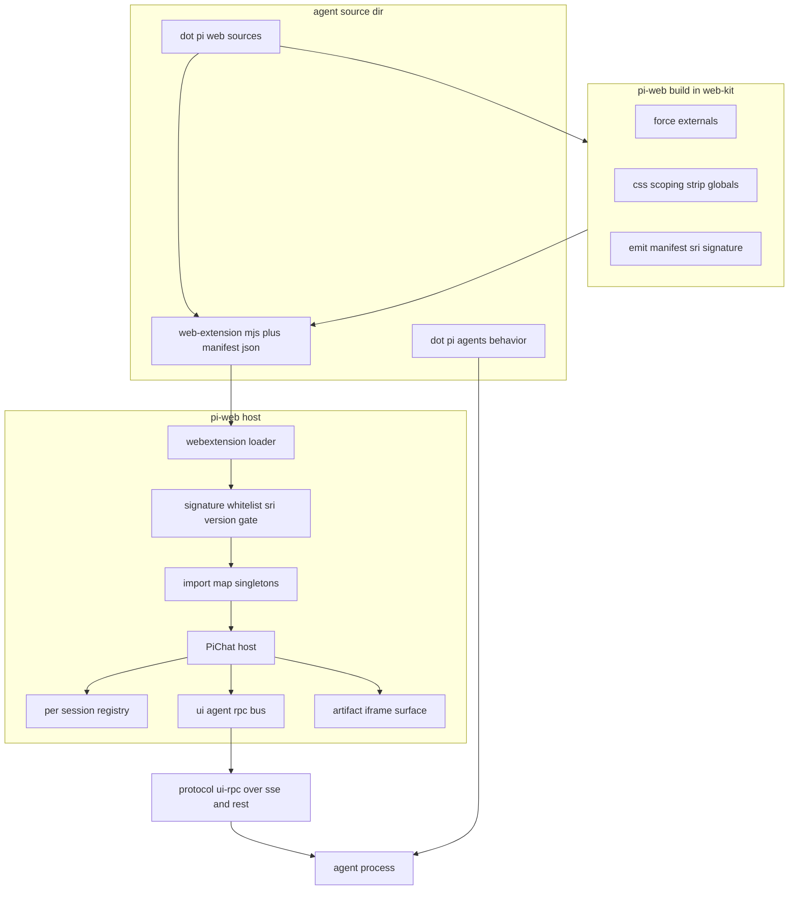
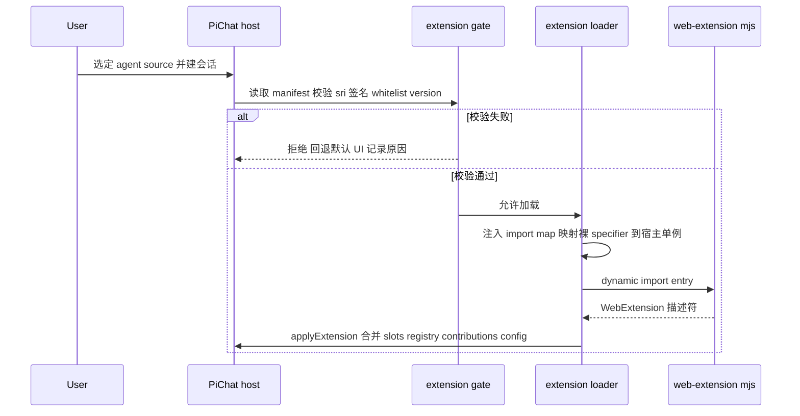
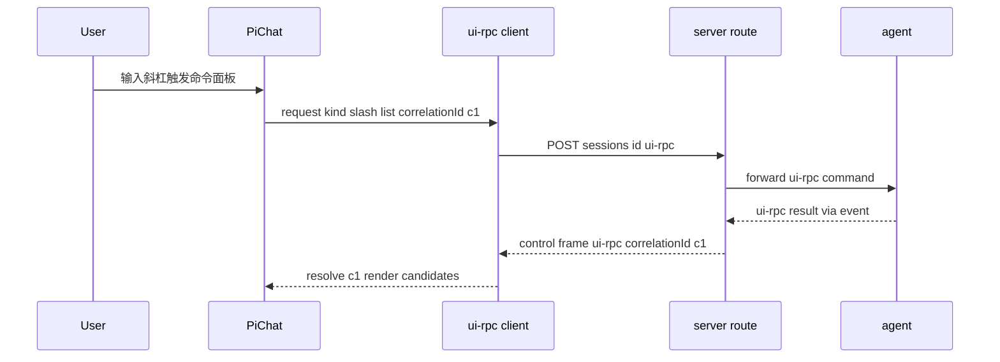

# Design Document — agent-web-extension

## Overview

**Purpose**: 为每个 agent source 提供一套「UI 控制层」。agent source 在 `.pi/web` 下声明并独立预构建一个 **WebExtension**(ESM bundle + manifest),宿主在该 source 的会话激活时经 **import map + 动态 `import()`** 懒加载它,从而自定义 pi-web 聊天宿主的布局(Tier 1 区域插槽)、渲染(Tier 2 registry)、交互(Tier 3 贡献点 + UI↔agent RPC 总线)、隔离表面(Tier 4 artifact iframe)与纯声明配置(Tier 5)。

**Users**: agent source 作者(写 `.pi/web`)、平台维护者(配置白名单/签名/CSP)、终端用户(获得领域化 UI)。

**Impact**: 把 `PiChat` 既有四维定制(slots/components/registry/presets)的「喂入源」从宿主装配点的 React props 迁移为 agent source 声明 + 运行时加载;新增 `@blksails/web-kit` 包与 `pi-web build` 工具;registry 从模块级单例改为 per-session 作用域;在既有 `@blksails/protocol` 通道上新增 UI↔agent RPC 子协议。

### Goals
- 模型 A:宿主永远拥有 document/session/transport/安全边界,扩展只填具名插槽 / 注册贡献点 / 在 iframe 内自由渲染。
- 一份 `defineWebExtension()` 描述符统一承载 Tier 1/2/3/5;Tier 4 由描述符声明、运行在 iframe。
- 独立预构建 + import-map 运行时加载 + per-session 懒加载,使携带 `.pi/web` 的 git source 无需宿主重新部署即可加载。
- 以一组示例 agent source + 浏览器 e2e 证明 Tier 1~5 闭环。

### Non-Goals
- runner 子进程内 SDK 导入与 agent 行为载入(归 `.pi/agents`,不变更)。
- module federation;Shadow DOM 隔离。
- agent 掌管整页 / 自带 `index.html` / 接管 React 根。

## Boundary Commitments

### This Spec Owns
- `.pi/web` 目录契约、`WebExtensionManifest` 与 `WebExtension` 描述符(`@blksails/protocol` + `@blksails/web-kit`)。
- 宿主侧 WebExtension 加载器(import-map 解析、懒加载、签名/白名单/SRI/版本门控)。
- 宿主侧 Tier 1 区域插槽的统一注册面、Tier 2 per-session registry 改造、Tier 3 贡献点宿主实现 + UI↔agent RPC 总线、Tier 4 artifact iframe 宿主与 postMessage 契约。
- `@blksails/web-kit` 包与 `pi-web build` 工具(externals 强制、CSS scoping、剥全局样式、产出 manifest+SRI)。
- 示例 agent source(`examples/*/.pi/web`)与覆盖 Tier 1~5 的单元/集成/e2e。

### Out of Boundary
- agent 行为/工具/技能的载入(`.pi/agents`、runner、agent-source-resolver 既有机制)。
- 后端 session/transport/RPC 通道实现本身(仅在其上新增 `ui-rpc` 载荷与端点)。
- 鉴权身份体系(复用既有 `authResolver`/`authorizeSession` 接缝);本特性只新增「扩展签名白名单」这一加载门。

### Allowed Dependencies
- `@blksails/protocol`(契约根;新增 manifest/ui-rpc schema 于此)。
- `@blksails/react`(transport/hooks)、`@blksails/ui`(PiChat 宿主)。
- 浏览器原生 ESM / import map;`esbuild`(构建工具内部)。
- 依赖方向恒为 `protocol ← {web-kit, react, ui, server}`;web-kit **不得**依赖 server 内部实现,仅经 protocol/RPC 通信。

### Revalidation Triggers
- `WebExtensionManifest` 或 `WebExtension` 描述符形状变更 → 所有示例与 `pi-web build` 重校验。
- UI↔agent RPC 载荷/端点契约变更 → react 客户端 + server 路由 + 示例 agent。
- `@blksails/web-kit` 公共 API 主版本变更 → 全量示例 bundle 重构建 + CI 冒烟。
- registry 作用域/优先级语义变更 → 既有 PiChat 宿主装配路径。

## Architecture

### Existing Architecture Analysis
- 分层:`protocol ← server`、`protocol ← react ← ui`、app 注入装配。SSE 帧分 `uiMessageChunk`/`control` 两类且带 `protocolVersion`;REST DTO 在 `@blksails/protocol`。
- `PiChat` 已支持 `slots`/`components`/`registry`/`layout|icons|theme|toolbarOrder`;`createRendererRegistry()` 工厂已存在但默认走模块级单例 `defaultRendererRegistry`。
- server-driven UI 已有 `SandboxRenderer` + 白名单组件(受限节点树)。
- 须维持的集成点:`PiChat` 现有 props 装配方式向后兼容;SSE/REST 契约版本化;`runtime="nodejs"` 路由。

### Architecture Pattern & Boundary Map



**Architecture Integration**:
- 选定模式:宿主插槽 + per-session registry + 运行时 ESM(import map)加载;贡献点经协议 RPC 回 agent;高危/LLM 内容入 iframe。
- 边界分离:协议契约(描述符 + ui-rpc) / 作者侧 SDK+build(web-kit) / 宿主加载器+安全门 / 宿主 UI 集成(PiChat 改造) / 示例与 e2e 各为独立可并行实现单元。
- 保留模式:PiChat 四维定制、SandboxRenderer 白名单、SSE/REST 版本化、依赖单向收敛。
- 新组件理由:加载器(运行时安全加载)、web-kit+build(作者侧契约与产物纪律)、ui-rpc(Tier 3 必需的双向通道)、artifact iframe(围栏)。

### Technology Stack

| Layer | Choice / Version | Role in Feature | Notes |
|-------|------------------|-----------------|-------|
| Frontend | React 19 + AI Elements + Tailwind 3 | 宿主 PiChat、插槽、registry、artifact 宿主 | 单例经 import map 共享给扩展 |
| Author SDK | `@blksails/web-kit`(新, workspace) | `defineWebExtension` + RPC client + 复用组件 + 类型 | 与 `@blksails/agent-kit` 对称 |
| Build | `esbuild` ^0.24 + 自研 CSS scoping 插件 | `pi-web build`:externals/scoping/manifest/SRI | 随 web-kit 发布 |
| Protocol | `@blksails/protocol`(扩展)+ zod | manifest schema、ui-rpc schema、artifact 消息 schema | 带 protocolVersion |
| Backend | `@blksails/server`(扩展 http)| `/sessions/:id/ui-rpc` 端点 + control 帧 `ui-rpc` 载荷转发 | runtime nodejs |
| Runtime | 浏览器原生 ESM + import map | 解析裸 specifier 到宿主单例后 `import()` | 非 MF |

## File Structure Plan

### Directory Structure
```
packages/
├── protocol/src/
│   └── web-ext/                         # 新增:UI 控制层契约
│       ├── manifest.ts                  # WebExtensionManifest zod schema + 类型
│       ├── descriptor.ts                # WebExtension 描述符形状(slots/renderers/contributions/config)
│       ├── ui-rpc.ts                    # UI↔agent RPC 请求/响应 + control 载荷 schema
│       ├── artifact.ts                  # artifact postMessage 消息 schema
│       └── index.ts                     # barrel
├── web-kit/                             # 新增包 @blksails/web-kit(作者侧 SDK + build)
│   ├── package.json                     # exports "." 与 "./build";bin: pi-web
│   ├── src/
│   │   ├── define-web-extension.ts      # defineWebExtension() identity + 类型校验
│   │   ├── rpc-client.ts                # 扩展内回 agent 的 RPC client(经宿主注入桥)
│   │   ├── slots.ts                     # 区域插槽 key 常量 + 类型(与 protocol descriptor 对齐)
│   │   ├── components.ts                # re-export 可复用设计原语(从 ui 选择性导出)
│   │   ├── host-context.ts             # 扩展运行时从宿主取的上下文(registry/bus/theme)
│   │   └── index.ts
│   └── build/
│       ├── build.ts                     # pi-web build:esbuild 编排 + externals + 产物
│       ├── css-scope-plugin.ts          # 前缀 pw-extId-hash;剥全局选择器/preflight;命名空间 keyframes/font-face
│       ├── externals-guard.ts           # 校验产物未内联 react/web-kit,违者失败
│       ├── manifest-emit.ts             # 产出 manifest.json + SRI integrity（+ 可选签名）
│       └── cli.ts                       # bin 入口
├── react/src/
│   └── web-ext/                         # 新增:客户端加载与 RPC
│       ├── extension-loader.ts          # import-map 注入 + 动态 import + 加载状态
│       ├── extension-gate.ts            # 签名/白名单/SRI/targetApiVersion 校验
│       └── use-ui-rpc.ts                # Tier 3 客户端:发起 ui-rpc、关联响应、防抖/取消
└── ui/src/
    ├── registry/renderer-registry.ts    # 改造:per-session 实例 + extId 命名空间(保留单例兼容)
    ├── web-ext/                          # 新增:宿主集成
    │   ├── apply-extension.tsx          # 将 WebExtension 描述符并入 PiChat slots/registry/contributions
    │   ├── slot-host.tsx                # Tier 1 具名插槽统一宿主(含 PromptInputAccessory 子位)
    │   ├── contributions/               # Tier 3 宿主端:slash/mention/autocomplete/inline-complete/keybindings
    │   │   └── *.tsx
    │   └── artifact-surface.tsx         # Tier 4:沙箱 iframe 宿主 + postMessage 桥
    └── chat/pi-chat.tsx                  # 改造:接受 extension 描述符,per-session registry,挂 slot-host/bus

examples/
├── webext-layout-agent/                 # Tier 1 区域插槽演示
├── webext-renderer-agent/               # Tier 2 渲染器演示(走白名单/registry)
├── webext-contrib-agent/                # Tier 3 slash/@mention/autocomplete + RPC 回 agent
├── webext-artifact-agent/               # Tier 4 artifact iframe
└── webext-declarative-agent/            # Tier 5 纯声明(theme/layout,零代码)
    每个含: index.ts(agent) + .pi/web/{web.config.ts, components/*, 预构建产物}

e2e/
└── browser/webext-*.e2e.ts              # 各示例的浏览器闭环(隔离 build)
```

### Modified Files
- `packages/ui/src/registry/renderer-registry.ts` — 增加 per-session 实例化路径与 `extId` key 命名空间;保留 `defaultRendererRegistry` 兼容。
- `packages/ui/src/chat/pi-chat.tsx` — 接受 `extension?: WebExtension` 与 per-session registry;经 `apply-extension` 合并;挂 `slot-host` 与 ui-rpc 总线。
- `packages/protocol/src/index.ts` — re-export `web-ext/*`。
- `packages/server/src/http/routes/command-routes.ts`(或新增 `ui-rpc-route.ts`)— 新增 `POST /sessions/:id/ui-rpc` 转发到 agent;`control` 帧支持 `ui-rpc` 下行。
- `packages/server/src/session/translate/translate-event.ts` — 将 agent 侧 ui-rpc 事件翻译为 `control: ui-rpc` 帧。
- `lib/app/pi-handler.ts` — 装配扩展白名单/签名公钥/CSP 配置来源(env)。
- `next.config.ts` — 应用收紧的 CSP 头(connect-src、禁 unsafe-eval)。
- `pnpm-workspace.yaml` — 已含 `packages/*`,新包自动纳入;`examples` 若需纳入工作区另议(默认按现状)。

## System Flows

### 加载流程(import-map + 安全门 + 懒加载)


### Tier 3 贡献点 RPC(以 slash 为例)


## Requirements Traceability

| Requirement | Summary | Components | Interfaces | Flows |
|-------------|---------|------------|------------|-------|
| 1.1–1.5 | `.pi/web` 探测 + manifest 校验 + 零代码声明路径 | extension-loader, extension-gate, manifest.ts | `WebExtensionManifest` | 加载流程 |
| 2.1–2.5 | Tier 1 区域插槽 + 提交契约保留 | slot-host, apply-extension, descriptor.ts | `WebExtension.slots` | — |
| 3.1–3.5 | Tier 2 per-session registry + 命名空间 + 内联白名单 | renderer-registry(改), apply-extension, SandboxRenderer | `RendererRegistry` | — |
| 4.1–4.6 | Tier 3 贡献点 + UI↔agent RPC 总线 | contributions/*, use-ui-rpc, ui-rpc-route, translate-event | `UiRpcRequest/Response` | Tier 3 RPC |
| 5.1–5.4 | Tier 4 artifact iframe + postMessage 契约 | artifact-surface, artifact.ts | `ArtifactMessage` | — |
| 6.1–6.6 | 独立预构建 + import-map + 懒加载 + 版本门 | build.ts, externals-guard, extension-loader | `WebExtensionManifest` | 加载流程 |
| 7.1–7.5 | 签名 + 白名单 + SRI + CSP | extension-gate, manifest-emit, next.config CSP, pi-handler | gate 配置 | 加载流程 |
| 8.1–8.6 | 构建期 CSS scoping | css-scope-plugin | build 选项 | — |
| 9.1–9.5 | web-kit 包 + build 工具 + 对称 defineWebExtension | web-kit/*, build/* | `defineWebExtension` | — |
| 10.1–10.4 | 内核不可变边界(模型 A) | pi-chat(改), apply-extension(错误隔离) | — | — |
| 11.1–11.5 | 示例 source + 单测/集成 + e2e 闭环 | examples/webext-*, e2e/browser/webext-* | — | 全部 |

## Components and Interfaces

| Component | Domain/Layer | Intent | Req | Key Deps | Contracts |
|-----------|--------------|--------|-----|----------|-----------|
| manifest/descriptor/ui-rpc/artifact schema | protocol | 契约根 | 1,2,4,5,6 | zod (P0) | State |
| `defineWebExtension` + web-kit | author SDK | 作者侧编写契约 | 9,2,3,4 | protocol (P0) | Service |
| `pi-web build` + scope plugin + externals guard | build | 产物纪律 | 6,8,9,7 | esbuild (P0) | Batch |
| extension-loader + extension-gate | react | 运行时加载+安全门 | 1,6,7 | protocol (P0) | Service |
| use-ui-rpc | react | Tier 3 客户端 | 4 | react transport (P0) | Service |
| ui-rpc route + translate | server | RPC 转发 | 4 | session/http (P0) | API/Event |
| renderer-registry(per-session) | ui | Tier 2 隔离 | 3 | — | State |
| apply-extension + slot-host + contributions | ui | 宿主集成 Tier1/2/3 | 2,3,4,10 | web-kit, registry (P0) | State |
| artifact-surface | ui | Tier 4 iframe | 5 | artifact schema (P0) | Event |
| examples/webext-* + e2e | examples/test | 验证 | 11 | 全部 (P0) | — |

### Protocol — 契约(`@blksails/protocol/web-ext`)

#### WebExtensionManifest（Req 1.3, 6.1, 6.5, 7.2）
```typescript
interface WebExtensionManifest {
  readonly id: string;                 // 扩展唯一 id（CSS/registry 命名空间根）
  readonly targetApiVersion: string;   // 兼容的 web-kit 主版本（semver range）
  readonly entry: string;              // 入口 ESM 相对路径（如 web-extension.mjs）
  readonly css?: string;               // 可选 scoped css 相对路径
  readonly integrity: string;          // entry 的 SRI 摘要（sha384-...）
  readonly signature?: string;         // 对 manifest 规范化字节的签名
  readonly capabilities?: readonly ("slots"|"renderers"|"contributions"|"artifact"|"config")[];
}
```
- Preconditions: 由 `pi-web build` 产出;`integrity` 必与 entry 字节一致。
- Invariants: `id` 在一次加载内唯一;声明式扩展可省略 `entry`(零代码路径,Req 1.4)。

#### WebExtension 描述符（Req 2,3,4,5,9）
```typescript
interface WebExtension {
  readonly manifestId: string;
  readonly slots?: Partial<Record<SlotKey, SlotContribution>>;       // Tier 1
  readonly renderers?: RendererContributions;                        // Tier 2
  readonly contributions?: ContributionPoints;                       // Tier 3
  readonly config?: { theme?: ThemeTokens; layout?: LayoutPreset };  // Tier 5
  readonly artifact?: ArtifactDeclaration;                           // Tier 4
}
type SlotKey =
  | "background" | "headerLeft" | "headerCenter" | "headerRight"
  | "sidebarLeft" | "panelRight" | "empty" | "footer"
  | "promptInput" | "accessoryAboveEditor" | "accessoryBelowEditor"
  | "accessoryInlineLeft" | "accessoryInlineRight" | "toolbar"
  | "notifications" | "statusBar" | "artifactSurface" | "dialogLayer";
```

#### UI↔agent RPC（Req 4.1, 4.3, 4.6）
```typescript
interface UiRpcRequest {
  readonly correlationId: string;
  readonly point: "slash"|"mention"|"autocomplete"|"inlineComplete"|"command"|"custom";
  readonly action: "list"|"resolve"|"execute"|"complete";
  readonly payload: unknown;          // 按 point 细分（zod 分辨联合）
  readonly protocolVersion: string;
}
interface UiRpcResponse {
  readonly correlationId: string;
  readonly ok: boolean;
  readonly result?: unknown;
  readonly error?: { code: string; message: string };
}
```
- 上行:`POST /sessions/:id/ui-rpc`(body=`UiRpcRequest`)→ `CommandAck`。
- 下行:`control` 帧 `{ control: "ui-rpc", response: UiRpcResponse }`,客户端按 `correlationId` 解析。
- Ordering/delivery:请求-响应配对,无序到达由 correlationId 兜底;超时由客户端控制(Req 4.5)。

#### ArtifactMessage（Req 5.1, 5.4）
```typescript
type ArtifactMessage =
  | { kind: "ready"; manifestId: string }
  | { kind: "resize"; height: number }
  | { kind: "rpc"; request: UiRpcRequest }       // artifact 经宿主中转回 agent
  | { kind: "event"; name: string; data: unknown };
```
- 宿主校验 `event.origin` 与结构,丢弃不符消息(Req 5.4);iframe `sandbox="allow-scripts"`,独立 origin,无同源凭证(Req 5.2)。

### Author SDK — `@blksails/web-kit`（Req 9）
```typescript
function defineWebExtension(ext: WebExtension): WebExtension; // identity + 编译期类型校验
interface UiRpcClient { request(req: Omit<UiRpcRequest,"protocolVersion">): Promise<UiRpcResponse>; }
```
- `rpc-client` 经宿主在加载时注入的桥发请求(扩展不直接持有 fetch/transport)。
- `components` 仅 re-export 受控设计原语;不暴露宿主内部状态。

### Build — `pi-web build`（Req 6.4, 8, 9.3）
- `externals-guard`: 产物 AST/字符串扫描,若内联了 `react`/`react-dom`/`@blksails/web-kit` 则 `exit 1`。
- `css-scope-plugin`: 前缀 `pw-<id>-<hash>`;剥/拒 `* html body :root` 顶层标签与 `@layer base`;命名空间 `@keyframes`/`@font-face`;拒 Tailwind preflight;`--pw-<id>-*` 变量前缀;资源 URL `import.meta.url` 化。
- `manifest-emit`: 计算 entry SRI,写 `manifest.json`,可选用配置私钥签名。

### Host — 加载、安全门、集成
- `extension-gate`(Req 7): `verify(manifest, opts)` → `Ok | Reject(reason)`;校验 SRI、签名 ∈ 白名单、`targetApiVersion` 兼容宿主 web-kit 主版本。
- `extension-loader`(Req 6): 注入 import map(`react`/`react-dom`/`@blksails/web-kit`/设计系统 → 宿主单例 URL)→ `import(entryUrl)` → 返回 `WebExtension`;失败回退默认 UI。
- `apply-extension`(Req 2,3,10): 把描述符并入 PiChat 的 per-session registry / slots / contributions;以 error boundary 隔离扩展渲染错误(Req 10.3)。
- `slot-host`(Req 2): 渲染具名插槽;未声明用默认;保证 PromptInput 提交契约不被改语义(Req 2.4, 10.4)。
- `artifact-surface`(Req 5): 宿主 iframe + postMessage 中转;LLM 输出强制走此(Req 5.3)。

**Implementation Notes**
- Integration: PiChat 既有 `slots/components/registry` props 路径保留;`extension` 为可选叠加,缺省即现行为(向后兼容,邻接期望)。
- Validation: 所有跨边界输入(manifest、ui-rpc、artifact 消息)经 zod 校验;加载器对非法描述符回退默认。
- Risks: 同源 bundle 无技术围栏 → 由 gate(签名/白名单)+ CSP + artifact iframe 兜底;高频 InlineComplete → 防抖+取消(use-ui-rpc)。

## Data Models
- **WebExtensionManifest / WebExtension / UiRpc* / ArtifactMessage**: 见上,均 zod schema 推导类型,置于 `@blksails/protocol/web-ext`,带 `protocolVersion`。
- **registry 状态**: per-session `Map<string, Renderer>`,key 形如 `<extId>:<type>`;会话结束清空(Req 3.5)。
- **gate 配置**: `{ whitelist: PublicKey[]; requireSignature: boolean; csp: {...} }`,来源 env(`pi-handler` 注入)。

## Error Handling
### Error Strategy
- 加载期(manifest 非法/SRI 不符/签名不在白名单/版本不兼容):**fail-safe** — 拒绝该扩展、回退默认 UI、记审计日志(Req 1.5, 6.5, 7.2/7.5)。
- 运行期(扩展渲染抛错):error boundary 隔离,保内核与其它会话(Req 10.3)。
- RPC(超时/失败):向用户呈现可恢复状态,不崩会话(Req 4.5)。
- artifact:非法 postMessage 丢弃(Req 5.4)。
### Monitoring
- 加载结果(accepted/rejected + reason)与 ui-rpc 失败计数记日志,供审计与排障。

## Testing Strategy
### Unit Tests
- `manifest`/`descriptor`/`ui-rpc` zod schema:合法/非法/缺字段。
- `css-scope-plugin`:前缀注入、全局选择器剥离、keyframes 命名空间、preflight 拒绝。
- `externals-guard`:内联 react/web-kit 的产物被拒。
- `extension-gate`:SRI 不符 / 签名不在白名单 / 版本不兼容 → reject;合法 → ok。
- `renderer-registry`(per-session):extId 命名空间不互覆盖;会话结束清空。
### Integration Tests
- `extension-loader` + import map:加载示例 bundle,react 单例不重复(无 invalid hook)。
- `use-ui-rpc` ↔ `ui-rpc-route` ↔ stub agent:correlationId 配对、超时、错误。
- `apply-extension`:描述符并入 PiChat,slots/registry/contributions 生效;扩展抛错被隔离。
### E2E/UI Tests(隔离 build,Req 11.3/11.4)
- webext-declarative:选 source → 仅声明 theme/layout 生效(零 bundle 路径)。
- webext-layout:区域插槽内容出现在指定位置。
- webext-renderer:自定义 data-part 渲染经 registry 命中。
- webext-contrib:输入 `/` → 经 RPC 回 agent → 渲染候选 → 执行回填。
- webext-artifact:artifact 在 sandbox iframe 渲染,postMessage resize 生效,无同源凭证访问。
### Performance/Load
- 多会话并发加载不同扩展,registry 无串扰;InlineComplete 防抖下不阻塞输入。

## Security Considerations
- **同源代码风险(允许 git bundle 的代价)**:技术围栏缺失,以运营围栏替代——签名 + 白名单(信任作者 key)、SRI(完整性)、CSP(收紧 connect-src、禁 unsafe-eval)。
- **LLM 输出**:一律入 artifact sandbox iframe(独立 origin、无凭证),不进同源 bundle。
- **CSS**:scoping 仅防撞;`pi-web build` 剥全局选择器降低误伤,但不视为安全边界。
- **回退**:任何门控失败均回退默认 UI 而非降级放行。
