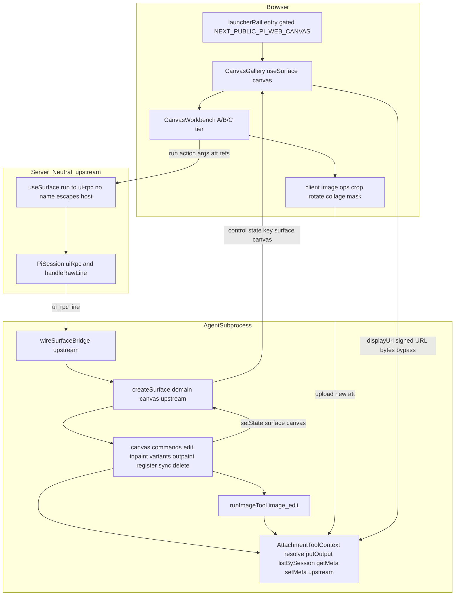
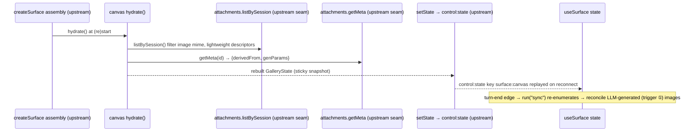
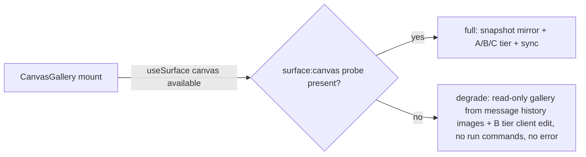

# Design Document — aigc-canvas

> 语言:zh。权威 pre-spec 设计:`docs/agent-authoritative-surface-design.md`(§5 端到端实例即 Canvas)。本设计**建在上游 `agent-authoritative-surface`(AAS)SDK 之上**:通信机制(`createSurface` / `useSurface` / `SurfaceCommandPayload` / `wireSurfaceBridge` / 探针 / 退化)一律复用,**不自造**。Canvas 只是 `domain = "canvas"` 的一个 AAS 实例。所有决策落到真实代码接缝(逐行核对 adjacent specs 与既有代码)。本设计**不改 pi 框架 / 协议结构、不新增宿主 REST route、宿主不认领任何领域语义**。

## Overview

**Purpose**:把 AIGC 生成 / 编辑图从"散落在对话流工具卡"聚合成**画廊 + 二次创作工作台**。画廊是 **attachment store 的物化视图**(非独立持久 state):图本就落 `att_`,画廊快照由 agent 侧 canvas extension 经 attachment 上下文枚举重建(`hydrate`),`control:"state"` 实时推 + 粘性回放。二次创作(A 档)经 AAS 命令通道在 agent 子进程内调 `runImageTool`(拿 `models.json` / provider / key)。

**Users**:AIGC agent 作者(在 extension 里 `createSurface(pi, {domain:"canvas", commands, hydrate})`);终端用户(在画廊直接二创,A 档命令绕过 LLM 推理);pi-web 维护者(宿主零领域语义,可换任意 source 优雅退化)。

**Impact**:在上游 AAS SDK + `aigc-*` 工具 + `attachment-*` + `sidebar-launcher-rail` 之上加一个 `canvas` domain 落地。对未开启门控 / 非 AIGC source **零行为变化**。**无跨层新增**:hydrate 与血缘持久所需的 attachment 会话枚举(`listBySession`)+ 不透明 meta(`getMeta` / `setMeta`)seam 由**上游 `attachment-tool-bridge` 的领域无关 seam 扩展**提供,Canvas 只经 `SurfaceCtx.attachments` 消费,不改 `agent-kit` / `server` / `attachment-store` 任何文件。

### Goals
- Canvas surface(`domain = "canvas"`):画廊快照(materialized view)+ A / B 档二创命令表 + `hydrate` 重建 + `sync` reconcile,全部经上游 `createSurface`。
- 画廊 UI:9 宫格默认 + 密度切换(概览 / 瀑布流 / 聚焦)+ 客户端分页 + 血缘 / 时间分组 + 格子展开工作台 / 关闭。
- A 档(`image_edit` 映射)/ B 档(客户端裁剪 / 旋转 / 拼贴 / 标注)/ C 档(血缘树 / 参数复用 / A-B 对比 / 工作图链)。
- 血缘经**上游 `setMeta` seam** 持久到附件不透明扩展 meta(`.att.json` 承载 `derivedFrom` / `genParams`),hydrate 经 `getMeta` 重建。
- 非 AIGC source 优雅退化(只读消息历史图库 + B 档);门控 `NEXT_PUBLIC_PI_WEB_CANVAS` 默认关;`launcherRail` 入口。
- 宿主中立(grep `app/` + `packages/server` 无 `canvas` / `gallery` / `image_edit`);单元 + 真实子进程集成 + 浏览器 e2e。

### Non-Goals
- AAS SDK 本身(上游);`control:"state"` 通用粘性帧机制(`state-injection-bridge`)。
- `runImageTool` / `image_edit` / `image_generation` / provider / model 路由(`aigc-*`,本 spec 只调用)。
- attachment 存储与签名 URL 生成(`attachment-store`,本 spec 只消费 resolve / putOutput / `listBySession` / `getMeta` / `setMeta`)。
- attachment 会话枚举(`listBySession`)+ 不透明 meta(`getMeta` / `setMeta`)seam 的**实现**(领域无关,归上游 `attachment-tool-bridge` 的 seam 扩展;本 spec 只消费)。
- 任何新宿主 REST 端点;`pi.appendEntry` 持久层;视频 / 海报导出(future)。

## Boundary Commitments

### This Spec Owns
- **agent 侧 canvas extension**(`packages/tool-kit/src/aigc/canvas/extension.ts`,runtime 子入口):以 `ExtensionFactory` 形态经上游 `createSurface(pi, {domain:"canvas", ...})` 装配;命令表(`edit` / `inpaint` / `reference` / `variants` / `outpaint` / `reframe` / `register` / `sync` / `delete`);`hydrate()` 枚举重建;命令处理器经 `runImageTool` 执行 A 档、写血缘 meta、`ctx.setState` 回流。
- **canvas 纯 schema / 类型**(`packages/tool-kit/src/aigc/canvas/schema.ts`,**无 pi 值导入**,浏览器安全子路径):`GalleryState` / `GalleryAsset` / `CanvasLineage` / A/B 档命令 `args` zod schema。UI 与 agent 双端共享。
- **canvas UI**(`packages/ui/src/canvas/`):`CanvasGallery`(经 `useSurface<GalleryState>("canvas")` 镜像 + 密度 / 分页 / 分组 / 退化)、`CanvasWorkbench`(格子展开态 + A/B 档工具栏 + mask 画布)、B 档客户端处理工具(crop / rotate / collage / annotate,产 `att_`)、C 档视图(血缘树 / 参数复用 / A-B 对比 / 工作图链)、`launcherRail` 入口按钮 + 门控。
- **示例接入 + e2e**:一个开启 canvas surface 的 AIGC 示例 agent source(`.pi/web` 经 `launcherRail` 槽挂 `CanvasGallery`)+ 浏览器 e2e。

### Out of Boundary
- AAS SDK(`createSurface` / `useSurface` / `wireSurfaceBridge` / `SurfaceCommandPayload/Result` / 探针 / 退化契约)—— 上游 `agent-authoritative-surface`,本 spec 以"已就位"为前置。
- `control:"state"` 通用粘性帧(`state-injection-bridge`,`pi-session.ts` 的 `piweb_state` 分支 `sticky.set`)—— 本 spec 以"已合并"为前置。
- `runImageTool` / `image_edit` routes / provider / model / key 解析(`aigc-*`);`att_` 存储 / 签名 URL 生成(`attachment-store`)。
- **attachment 会话枚举(`listBySession`)+ 不透明 meta(`getMeta` / `setMeta`)seam 的实现**(领域无关,归上游 `attachment-tool-bridge` 的 seam 扩展 —— 把 facade 既有 `listBySession` 透出到子进程 `AttachmentToolContext`、新增 `.att.json` 承载的不透明 meta 存取)—— 本 spec 以"已就位"为前置,只经 `SurfaceCtx.attachments` 消费,**不改 `packages/agent-kit/src/attachment.ts` / `packages/server` 的 `createAttachmentToolContext` / `attachment-store` 的 `.att.json` 任何文件**。
- 宿主主进程 host 命令路径;新 REST 端点;`ControlPayloadSchema` union 扩展(路线 B)。

### Allowed Dependencies
- 上游 AAS:`createSurface(pi, config)`(tool-kit runtime)、`SurfaceHandle` / `SurfaceCtx` / `SurfaceConfig`、`useSurface(domain)`(`@blksails/pi-web-react`)、`SurfaceCommandPayload/Result`(protocol)、探针 `surface:<domain>` + `available` 退化。
- `aigc-*`:`runImageTool(params, ext, signal, onUpdate, opts)`(`packages/tool-kit/src/aigc/run-image-tool.ts:244`)、`image_edit` routes / `mediaFields`(`packages/tool-kit/src/aigc/tools/image-edit.ts`)。
- `attachment-*`:`getAttachmentToolContext()` → `AttachmentToolContext{available, resolve(id), putOutput(input), listBySession(), getMeta(id), setMeta(id, meta)}`(`packages/agent-kit/src/attachment.ts:86`;后三者由上游 `attachment-tool-bridge` seam 扩展提供 —— `listBySession` 把 facade 既有会话枚举透出、`getMeta`/`setMeta` 存取不透明扩展 meta,Canvas 只消费)、签名 URL(`packages/server/src/attachment/url-signer.ts:45`)、`AttachmentSchema`(`packages/protocol/src/attachment/attachment-dto.ts:24`)。
- UI:`useSurface`、`SlotContribution` / `resolveSlot(ext, "launcherRail")`(`packages/ui/src/web-ext/apply-extension.tsx`、`packages/ui/src/elements/launcher-rail.tsx`)、`useExtensionState`(经上游 useSurface 间接)。

### Revalidation Triggers
- 上游 AAS `SurfaceCommandPayload` / `useSurface` / `wireSurfaceBridge` 接口变化 → canvas 命令 / UI 复验。
- 上游 `state-injection-bridge` 粘性修复未合并 → "刷新后画廊仍在"退化,e2e 相应门控。
- `runImageTool` 签名 / `ToolExecuteDetails.assets` 形状变化,或 `image_edit` routes / `mediaFields` 变化 → A 档命令处理器复验。
- `runImageTool` 的 `ext`(`ExtensionContext`)**仅用于交互补全**,附件解析独立于 `ext`(经子进程全局 attachment seam);Canvas 命令处理器传 `ext=undefined` + `requiredParams:[]` 安全。若上游 `runImageTool` 改变此约束(把附件解析耦合到 `ext`)→ A 档命令处理器复验。
- 上游 `attachment-tool-bridge` 的 `listBySession` / `getMeta` / `setMeta` seam 接口变化 → hydrate / 血缘持久复验(本 spec 只消费,seam 实现归上游)。
- `AttachmentSchema` 结构变化(尤其新增 / 移除 meta 字段)→ 血缘持久复验。

## Architecture

### Existing Architecture Analysis
- **AAS CQRS(上游)**:权威快照在 agent 子进程(`getSessionState` KV,`key = "surface:canvas"`),server 领域无关转发,UI 只读镜像 + 命令代理。Canvas 是其 `domain="canvas"` 实例。
- **三触发源**(`docs/…-surface-design.md` §2.2):① LLM 调 `image_generation` 工具 → 图落 `att_`(surface 经枚举 `sync` 收敛)/ ② UI 直接命令(A/B 档)→ `runImageTool` / `register` → `ctx.setState` 即时推 / ③ agent 自主(本 spec 不用)。**LLM 从不直接写画廊 state**(它只产 event/response),故 gallery 不因"LLM 忘输出 JSON"漏图。
- **画廊 = 物化视图**(§2.4-C):每张图已落 `att_`;transcript 工具卡与画廊格子指向同一 `att_id` = 同一素材两视图,天然去重;重启由 agent 侧 `hydrate` 经 attachment 枚举重建(**子进程内**,非前端 REST)。
- **现成接缝**:`runImageTool`(编排器,返回 `details.assets[].{attachmentId, displayUrl, mimeType, name}`);`image_edit`(params `image`/`prompt`/`mask`/`n`/`size`/`reference_images`/`model`,`mediaFields:["image","mask","reference_images"]`);`AttachmentToolContext`(`resolve`/`putOutput` 既有;`listBySession`/`getMeta`/`setMeta` 由上游 `attachment-tool-bridge` seam 扩展补齐);签名 URL(HMAC);`launcherRail` 槽(`resolveSlot(ext,"launcherRail")` → `LauncherRail` `webextSlot`)。
- **上游已补的接缝(本 spec 消费)**:`hydrate`(物化视图重建)与血缘持久(`.att.json` 不透明扩展 meta)所需的**会话枚举 + 不透明 meta** 由上游 `attachment-tool-bridge` 以**领域无关 seam** 提供(`listBySession` / `getMeta` / `setMeta`,附件层不认识 canvas);Canvas 经 `SurfaceCtx.attachments` 消费,不自建、不改附件层文件。

### Architecture Pattern & Boundary Map

**选定模式**:AAS 实例(单一权威 + 镜像视图 + 命令转发)+ **物化视图**(权威数据源是 attachment store,surface 快照是其派生投影,非独立持久)。



**关键决策**:
- **通信一律复用上游 AAS**:canvas 不碰 `control:"state"` 帧构造、不碰 ui-rpc 回流、不碰探针注册 —— 全经 `createSurface` / `wireSurfaceBridge` / `useSurface`。
- **画廊快照 = 物化视图**:单一真源是 attachment store。`hydrate`(冷启)、`sync`(轮末,收敛触发源 ①)、命令内 `ctx.setState`(触发源 ② 乐观即时)三条路径都最终与枚举收敛;快照只含 `att_id` + 签名 URL + 轻量元数据 + 血缘(**无二进制**)。
- **A 档在子进程调 `runImageTool`**:命令走 AAS agent 转发路径(`SurfaceCommandPayload` 无 `name` → 逃逸 host 拦截 → `session.uiRpc`),处理器在子进程拿 `models.json` / provider / key,**不经宿主、不经 LLM**。
- **血缘持久**:新 `att_` 的 `{derivedFrom, genParams}` 经**上游 `setMeta` seam** 写附件**不透明扩展 meta**(附件层存 opaque JSON、不解释),`hydrate` 经**上游 `getMeta`** 读回重建血缘树。
- **UI 本地偏好不进快照**:密度 / 页码 / 选中 / 分组 / 工作台开合 = 客户端 state(localStorage),对齐 AAS「UI 本地偏好走客户端」。
- **门控 + 中立**:`NEXT_PUBLIC_PI_WEB_CANVAS` 读在 canvas UI 组件侧(client bundle);canvas UI 在 `packages/ui`(非中立判据集 `app/` + `packages/server`),`launcherRail` 槽名对宿主不透明。

### Technology Stack

| Layer | Choice / Version | Role in Feature | Notes |
|-------|------------------|-----------------|-------|
| AAS SDK(上游) | `createSurface` / `useSurface` / `SurfaceCommandPayload` | 通信底座 | 一律复用,不自造 |
| Agent extension | `@blksails/pi-web-tool-kit`(runtime 子入口) | canvas 命令表 + hydrate + runImageTool 调用 | 含 pi 值导入,不进前端 bundle;对齐 `aigcExtension` |
| 编辑执行 | `runImageTool`(`image_edit`) | A 档在子进程执行 | provider / models.json 独立 |
| Bulk | attachment store 签名 URL | 二进制永不进帧 | 复用 HMAC 签名 |
| 血缘持久 | 上游 `attachment-tool-bridge` `getMeta`/`setMeta` seam | `.att.json` 扩展字段 | 附件层领域无关;上游提供,Canvas 只消费 |
| 画廊 UI | React 19 + `@blksails/pi-web-ui` | 9 宫格 / 密度 / 分页 / 工作台 / C 档 | `useSurface` 消费;门控 client 侧 |
| B 档客户端处理 | 浏览器 Canvas 2D | crop / rotate / collage / annotate / mask | 新代码(仅 `normalizeImageDataUri` 可复用) |
| 挂载 | `SlotContribution` `launcherRail` | Canvas 入口 | 复用 `resolveSlot`,不新造 renderer |

## File Structure Plan

### 新增文件
```
packages/tool-kit/src/aigc/canvas/
├── schema.ts               # 纯 zod:GalleryState / GalleryAsset / CanvasLineage / 命令 args schema(无 pi 值导入,浏览器安全子路径导出)
├── extension.ts            # canvasSurfaceExtension: ExtensionFactory — createSurface(pi,{domain:"canvas",commands,hydrate}); runtime 子入口
├── commands.ts             # 命令处理器实现:edit/inpaint/reference/variants/outpaint/reframe(→runImageTool)、register/sync/delete、写血缘 meta
├── hydrate.ts              # 经上游 listBySession 枚举 attachment(image mime)+ getMeta 读扩展 meta → 重建 GalleryState
└── index.ts                # runtime barrel(canvasSurfaceExtension)

# 注:attachment 会话枚举(listBySession)+ 不透明 meta(getMeta/setMeta)seam 由上游
# attachment-tool-bridge 提供,Canvas 经 SurfaceCtx.attachments 消费,本 spec 不新增 seam 文件、
# 不改 agent-kit / server / attachment-store。

packages/ui/src/canvas/
├── canvas-gallery.tsx      # useSurface("canvas") 镜像 + 9宫格 + 密度切换 + 分页 + 分组 + 退化
├── canvas-workbench.tsx    # 格子展开态 + A/B 档工具栏 + mask 画布 + 关闭
├── canvas-launcher.tsx     # launcherRail 入口按钮 + NEXT_PUBLIC_PI_WEB_CANVAS 门控
├── client-image-ops.ts     # B 档:crop/rotate/collage/annotate/mask → data URI(坐标系对齐)→ 上传 att_
├── lineage-view.tsx        # C 档:血缘树 / A-B 对比 / 工作图链
└── use-canvas-view.ts      # UI 本地视图偏好(密度/页码/选中/分组/工作台开合),localStorage

examples/aigc-canvas-agent/  # 开启 canvas surface 的 AIGC 示例 source(e2e/集成夹具)
├── index.ts                 # extensions: [aigcExtension, canvasSurfaceExtension]
├── README.md
└── .pi/web/web.config.tsx    # slots.launcherRail = CanvasLauncher(挂 CanvasGallery)
```

### 修改文件
- `packages/tool-kit/src/runtime.ts`(runtime 子入口 barrel)— 导出 `canvasSurfaceExtension`(含 pi 值导入,仅 `/runtime` 加载,不进前端 bundle)。
- `packages/tool-kit`(pure 子路径 exports)— 导出 `aigc/canvas/schema.ts` 的浏览器安全子路径(供 UI 导入纯类型 / schema;对齐 aigc-tools-interactive-params 的纯 schema 共享;⚠ 须同步 vitest 子路径 alias,见风险 R-3)。
- `packages/ui/src/index.ts`(或 canvas barrel)— 导出 `CanvasGallery` / `CanvasWorkbench` / `CanvasLauncher`。
- `lib/app/webext-registry.ts` — 静态注册 `aigc-canvas-agent` 的 `.pi/web`(供 e2e 静态加载,绕签名门控,对齐既有示例)。
- `examples/README.md` — 注册 `aigc-canvas-agent` 行。

> **不修改**:`packages/agent-kit/src/attachment.ts`(`AttachmentToolContext` 接口)、`packages/server` 的 `createAttachmentToolContext`、`attachment-store` 的 `.att.json` —— attachment 会话枚举 + 不透明 meta seam 归上游 `attachment-tool-bridge`,本 spec 只经 `SurfaceCtx.attachments` 消费。

> 依赖方向:`protocol ← (tool-kit, ui) ← app/examples`。`extension.ts` / `commands.ts` / `hydrate.ts` 含 pi 值导入,仅经 `@blksails/pi-web-tool-kit/runtime` 子入口加载(与 `aigcExtension` 同,不进前端 bundle)。`schema.ts` 纯,双端共享。canvas UI 在 `packages/ui`(不在中立判据集)。

## System Flows

### A 档命令 → 子进程 runImageTool → 血缘落库 → 画廊回流(触发源 ②,LLM 不在场)
```mermaid
sequenceDiagram
    participant Work as CanvasWorkbench
    participant US as useSurface run (upstream)
    participant Wire as wireSurfaceBridge (upstream)
    participant Cmd as canvas command edit/inpaint/...
    participant RIT as runImageTool image_edit
    participant Att as AttachmentToolContext (upstream seam)
    participant SS as ctx.setState (getSessionState surface canvas)
    Work->>US: run("inpaint", {image: att_a, mask: att_m, prompt, model})
    US->>Wire: ui-rpc point=command payload SurfaceCommandPayload no name
    Wire->>Cmd: dispatch("inpaint", args) via surface registry
    Cmd->>RIT: runImageTool({image,mask,prompt,model}, undefined, signal, undefined, {toolName:"image_edit", routes, mediaFields, requiredParams:[]})
    RIT->>Att: resolve att refs to data URIs (global seam, independent of ext), call provider (models.json), putOutput results
    RIT-->>Cmd: details.ok, assets [{attachmentId, displayUrl, mimeType, name}]
    Cmd->>Att: setMeta(newId, {derivedFrom: att_a, genParams: args})
    Cmd->>SS: setState prepend new GalleryAsset (with lineage)
    SS-->>US: control:state key surface:canvas (upstream bridge, fd1)
    Cmd-->>Wire: return data {ids:[newId]}
    Wire-->>US: control:ui-rpc by correlationId (upstream)
    US-->>Work: run resolves SurfaceCommandResult; gallery already updated via snapshot
```

### 物化视图重建(冷启 hydrate / 轮末 sync,收敛触发源 ①)


### 退化(非 AIGC source)


## Requirements Traceability

| Requirement | Summary | Components | Interfaces / Contracts | Flows |
|-------------|---------|------------|------------------------|-------|
| 1.1-1.5 | canvas surface 装配 | extension.ts | `createSurface`(上游), `SurfaceConfig` | A 档 / 物化视图 |
| 2.1-2.6 | 物化视图 hydrate + sync + delete | hydrate.ts, commands(sync/delete) | 枚举 seam, `ctx.setState` | 物化视图重建 |
| 3.1-3.5 | 画廊视图 9宫格/密度/分页/分组 | canvas-gallery.tsx, use-canvas-view.ts | `GalleryState`, `useSurface` | — |
| 4.1-4.6 | A 档 image_edit 映射 | commands.ts | `runImageTool`, `SurfaceCommandPayload` | A 档命令 |
| 5.1-5.4 | B 档客户端编辑 | client-image-ops.ts, commands(register) | 附件上传 seam, `register` | A 档(register 分支) |
| 6.1-6.4 | C 档血缘树/参数复用/对比/链 | lineage-view.tsx, canvas-workbench.tsx | `CanvasLineage`(读快照) | — |
| 7.1-7.4 | 血缘持久 .att.json 扩展字段 | commands.ts, hydrate.ts | 上游 `getMeta`/`setMeta` seam, `CanvasLineage` | 物化视图 / A 档 |
| 8.1-8.3 | Bulk att_ 签名 URL | schema(displayUrl), canvas-gallery | 签名 URL(既有) | 全流程 |
| 9.1-9.4 | 非 AIGC 退化 | canvas-gallery(available 分支) | `useSurface().available`(上游) | 退化 |
| 10.1-10.4 | 门控 + launcherRail 入口 | canvas-launcher.tsx | `resolveSlot(ext,"launcherRail")`, env 门控 | — |
| 11.1-11.4 | 宿主中立 | 全组件(领域只在两端) | grep 判据 | 全流程 |
| 12.1-12.4 | 消费上游枚举 + 不透明 meta seam | hydrate.ts, commands.ts | 上游 `SurfaceCtx.attachments.{listBySession,getMeta,setMeta}` | 物化视图 |
| 13.1-13.5 | 测试 / e2e / strict / 零回归 | 全组件 + 示例 source | — | 见测试策略 |

## Components and Interfaces

| Component | Layer | Intent | Req | Key Deps (P0/P1) | Contracts |
|-----------|-------|--------|-----|------------------|-----------|
| schema.ts | tool-kit(pure) | 画廊 / 血缘 / 命令 args schema | 4.x,7.3,2.4 | zod(P0) | API |
| canvasSurfaceExtension | tool-kit(runtime) | createSurface(domain=canvas)装配 | 1.x | createSurface 上游(P0), pi(P0) | Service |
| canvas commands | tool-kit(runtime) | edit/inpaint/…/register/sync/delete | 2.x,4.x,5.x,7.1 | runImageTool(P0), 上游 attachment seam(P0), ctx.setState(P0) | Service |
| canvas hydrate | tool-kit(runtime) | 枚举重建画廊 | 2.1,7.2,12.4 | 上游 `listBySession`(P0), 上游 `getMeta`(P0) | Service |
| CanvasGallery | ui | 镜像 + 9宫格/密度/分页/分组/退化 | 3.x,9.x | useSurface 上游(P0), 签名 URL(P0) | Service |
| CanvasWorkbench | ui | 展开态 + A/B 档工具栏 + mask | 4.1,5.4,6.2-6.4 | useSurface(P0), client-image-ops(P0) | — |
| client-image-ops | ui | B 档裁剪/旋转/拼贴/标注/mask | 5.1-5.4 | Canvas 2D(P0), 上传 seam(P0) | Service |
| lineage-view | ui | C 档血缘树/对比/链 | 6.1,6.3,6.4 | GalleryState(P0) | — |
| CanvasLauncher | ui | launcherRail 入口 + 门控 | 10.x | resolveSlot(P0), env(P0) | — |
| aigc-canvas-agent | examples | 端到端夹具 | 13.4 | canvasSurfaceExtension(P0), SlotContribution(P0) | — |

### tool-kit(pure)层

#### aigc/canvas/schema.ts
**Contracts**: API [x]
```typescript
import { z } from "zod";

/** 血缘:领域拥有;写入附件不透明 meta,附件层不解释。 */
export const CanvasLineageSchema = z.object({
  derivedFrom: z.string().optional(),   // 源 att_id(根节点无)
  genParams: z.unknown().optional(),     // 产出该图的命令参数(供参数复用)
});
export type CanvasLineage = z.infer<typeof CanvasLineageSchema>;

/** 画廊资产:仅引用 + 轻量元数据,无二进制(Bulk 走 displayUrl)。 */
export const GalleryAssetSchema = z.object({
  attachmentId: z.string(),
  displayUrl: z.string(),                // 签名 URL(既有 HMAC),二进制旁路
  mimeType: z.string(),
  name: z.string(),
  createdAt: z.string(),
  origin: z.enum(["upload", "tool-output"]),
  derivedFrom: z.string().optional(),
  genParams: z.unknown().optional(),
});
export type GalleryAsset = z.infer<typeof GalleryAssetSchema>;

/** surface 快照(control:"state" 的 value,key="surface:canvas")。 */
export const GalleryStateSchema = z.object({
  assets: z.array(GalleryAssetSchema),   // newest-first
});
export type GalleryState = z.infer<typeof GalleryStateSchema>;

/** A 档命令 args(仅 att_ 引用 + 文本,无二进制,Req 8)。 */
export const EditArgsSchema = z.object({
  image: z.string(),
  prompt: z.string(),
  model: z.string().optional(),
});
export const InpaintArgsSchema = EditArgsSchema.extend({ mask: z.string() });
export const ReferenceArgsSchema = EditArgsSchema.extend({ reference_images: z.array(z.string()) });
export const VariantsArgsSchema = EditArgsSchema.extend({ n: z.number().int().min(1).max(10), models: z.array(z.string()).optional() });
export const OutpaintArgsSchema = z.object({ image: z.string(), mask: z.string().optional(), prompt: z.string(), size: z.string().optional() });
export const ReframeArgsSchema = z.object({ image: z.string(), size: z.string(), prompt: z.string().optional() });
/** B 档回流。 */
export const RegisterArgsSchema = z.object({ attachmentId: z.string(), derivedFrom: z.string().optional(), genParams: z.unknown().optional() });
/** 视图收敛 / 删除。 */
export const SyncArgsSchema = z.object({}).optional();
export const DeleteArgsSchema = z.object({ attachmentId: z.string() });
```
- **纯模块,无 pi 值导入**,经浏览器安全子路径导出(UI 与 agent 双端共享);对齐 aigc-tools-interactive-params 的纯 schema 共享。

### tool-kit(runtime)层

#### canvasSurfaceExtension(Service 契约)
| Field | Detail |
|-------|--------|
| Intent | 以 ExtensionFactory 经上游 createSurface 装配 canvas surface |
| Requirements | 1.1-1.5 |

**Responsibilities & Constraints**
- `canvasSurfaceExtension: ExtensionFactory = (pi) => { createSurface(pi, { domain:"canvas", initialState: () 空画廊, commands, hydrate }); }`(`initialState` 默认下沉,1.3;`createSurface` 是上游,负责探针 + 注册表 + rev + fd1,canvas **不重造**,1.2)。
- `commands` = `{ edit, inpaint, reference, variants, outpaint, reframe, register, sync, delete }`(见 commands.ts)。
- `hydrate = () => rebuildGalleryFromAttachments(ctx)`(见 hydrate.ts,1.1 / 2.1)。
- 装载:AIGC 示例 source `extensions: [aigcExtension, canvasSurfaceExtension]`;非该 source → 无 `surface:canvas` 探针 → `available=false` 退化(1.5 / 9.x)。

**Implementation Notes**
- **附件上下文来源**:命令处理器经 `SurfaceCtx.attachments`(上游注入 `getAttachmentToolContext()`,含既有 `resolve`/`putOutput` + 上游 seam 扩展 `listBySession`/`getMeta`/`setMeta`)。`runImageTool` 第二参 `ext: ExtensionContext | undefined` **仅用于交互补全**,其**附件解析独立于 `ext`**(经子进程全局 attachment seam,与 `runImageTool` 内部 `getAttachmentToolContext()` 同源);故 surface 命令传 `ext = undefined` + `opts.requiredParams = []` 安全,无需 per-call `ExtensionContext`。**实现前**核对 `run-image-tool.ts` 内附件解析确未耦合 `ext`(见 Revalidation Triggers)。

#### canvas commands(Service 契约)
| Field | Detail |
|-------|--------|
| Intent | A 档经 runImageTool、B 档 register、sync/delete;写血缘;setState 回流 |
| Requirements | 2.3,2.5,4.x,5.2,5.3,7.1 |

**Responsibilities & Constraints**
- A 档(`edit`/`inpaint`/`reference`/`variants`/`outpaint`/`reframe`):`safeParse` 对应 args → 调 `runImageTool(params, undefined, signal, undefined, { toolName:"image_edit", routes: IMAGE_EDIT_ROUTES, defaultModel:"gpt-image-2", requiredParams:[], mediaFields:["image","mask","reference_images"] })`;`details.ok===false`/抛出 → `ok:false` + 稳定 `error.code`(不留半态,4.5)。
- 成功 → `details.assets.map(a => ({ ...a, derivedFrom: args.image, genParams: args }))`;`ctx.attachments.setMeta(a.attachmentId, { derivedFrom, genParams })`(上游 seam,7.1);`ctx.setState(s => ({ assets: [...fresh, ...s.assets] }))`(2.3 / 4.4);返回 `{ ids }`。
- `variants` 多模型:对 `args.models ?? [args.model]` 逐一 runImageTool 汇总。
- `register`(B 档):`ctx.attachments.resolve(attachmentId)` 校验属主 → `ctx.attachments.setMeta` 写血缘 → `setState` 推入(不调 provider,5.3)。
- `sync`:`rebuildGalleryFromAttachments(ctx)` → `setState`(reconcile 触发源 ①,2.2)。
- `delete`:`setState(s => ({ assets: s.assets.filter(x => x.attachmentId !== id) }))`(2.5;粘性 `delete` 清理由上游 state 桥承担)。
- **无二进制进 args / 快照**(8.1);资产 `displayUrl` 用 `runImageTool` 返回的签名 URL。

#### canvas hydrate(Service 契约)
| Field | Detail |
|-------|--------|
| Intent | 枚举 attachment(image mime)+ 读 meta → 重建 GalleryState |
| Requirements | 2.1,7.2,12.4 |

**Responsibilities & Constraints**
- `ctx.attachments.listBySession()`(上游 seam)取轻量描述符(`AttachmentSchema{id,name,mimeType,size,origin,sessionId,createdAt}`)→ filter `mimeType.startsWith("image/")`。
- 逐个 `ctx.attachments.getMeta(id)`(上游 seam)读 `{derivedFrom, genParams}`(无则根节点,7.4);签名 `displayUrl` 经既有签名 seam 生成。
- 按 `createdAt` newest-first 组 `GalleryState`;装配期异步(不阻塞会话启动,重建后推粘性快照,12.4)。

### 上游 attachment seam(消费契约,领域无关 —— 归 `attachment-tool-bridge`,本 spec 不实现)
| Field | Detail |
|-------|--------|
| Intent | 会话作用域只读枚举 + 按 att_id 不透明 meta 存取(附件层不解释);**由上游 `attachment-tool-bridge` seam 扩展提供,Canvas 经 `SurfaceCtx.attachments` 消费** |
| Requirements | 12.1-12.4,7.1,7.2 |

**Consumption Contract & Constraints**(上游承担实现;此处仅记录 Canvas 依赖的形状)
- `attachments.listBySession(): Promise<Attachment[]>` —— 子进程侧,会话作用域,只取描述符(不物化字节,12.4)。上游把 facade 既有 `listBySession` 透出到 `AttachmentToolContext`。
- `attachments.getMeta(id): Promise<Record<string, unknown> | undefined>` / `attachments.setMeta(id, meta): Promise<void>` —— 不透明 `Record<string,unknown>`,附件层不出现 `canvas`/`derivedFrom` 等领域名(12.3,上游保证)。
- 血缘 meta 落 `.att.json` 扩展字段(上游 seam 承担):`.att.json` 即描述符 sidecar,把不透明 meta 一并持久;canvas 语义只活在 meta 的 value,附件层视其为 opaque。
- **本 spec 不新增 seam 文件、不改 `agent-kit`(`AttachmentToolContext` 接口)/ `server`(`createAttachmentToolContext`)/ `attachment-store`(`.att.json`)**;仅调用下述上游形状:

```typescript
// 上游 attachment-tool-bridge 在 AttachmentToolContext 上扩展(本 spec 只消费):
interface AttachmentToolContext {
  // ...既有 available / resolve / putOutput
  listBySession(): Promise<import("@blksails/pi-web-protocol").Attachment[]>;
  getMeta(id: string): Promise<Record<string, unknown> | undefined>;
  setMeta(id: string, meta: Record<string, unknown>): Promise<void>;
}
```

### ui 层

#### CanvasGallery(Service 契约)
| Field | Detail |
|-------|--------|
| Intent | 镜像快照 + 9宫格/密度/分页/分组 + 退化 |
| Requirements | 3.x,9.x,8.2 |

**Responsibilities & Constraints**
- `const { state, run, available, rev } = useSurface<GalleryState>("canvas")`(上游 hook)。
- `available === false` → 退化:图库来源 = 当前消息历史图片附件(UI 已有,无 surface,9.2);A 档禁用;B 档仍可(本地呈现,不 register,9.3)。
- `available === true` → 9 宫格默认(3.1);密度切换概览/瀑布流/聚焦(3.2,`use-canvas-view.ts` 本地);客户端分页(3.3);血缘 / 时间分组(3.4);缩略用 `displayUrl`(8.2)。
- 轮末 idle 边沿(既有 onTurnEnd 信号)→ `run("sync")`(2.2)。
- 视图偏好经 `use-canvas-view.ts` localStorage 持久(3.5)。

#### CanvasWorkbench / client-image-ops / lineage-view / CanvasLauncher
- **CanvasWorkbench**:格子点击展开全屏工作台(4.1),工具栏发 A 档 `run`;mask 画布产 B/W mask att_(5.4);关闭回画廊(10.3);"带入对话"显式 Prompt 注入(4.6)。
- **client-image-ops.ts**:B 档 crop/rotate/collage/annotate 在 Canvas 2D 处理,坐标系按源图像素对齐(5.1);产 data URI(可先 `normalizeImageDataUri`)→ 既有上传接缝落 `att_` → `run("register", …)`(5.2)。
- **lineage-view.tsx**:C 档血缘树(读 `derivedFrom`,6.1)、参数复用(读 `genParams` 预填表单,6.2)、A-B 对比(6.3)、当前工作图链(6.4)。
- **CanvasLauncher**:`launcherRail` 槽渲染入口按钮;`NEXT_PUBLIC_PI_WEB_CANVAS`(`=== "true" || === "1"`)门控,关则 `null`(10.1);门控读在 UI 组件侧(10.4)。

### 挂载(SlotContribution)
```tsx
// examples/aigc-canvas-agent/.pi/web/web.config.tsx(示意)
export default defineWebExtension({
  manifestId: "aigc-canvas",
  slots: { launcherRail: CanvasLauncher },   // 槽名对宿主不透明;CanvasLauncher 内挂 CanvasGallery/Workbench
});
```

## Data Models

### Domain Model
- **单一真源**:attachment store(`att_` + `.att.json` 描述符 + 不透明扩展 meta)。画廊快照是其**物化视图**(派生投影),非独立持久。
- **聚合根**:`GalleryState`(子进程内,`getSessionState` `key="surface:canvas"` 条目,rev 由上游 state 桥单调管理)。
- **血缘**:`CanvasLineage{derivedFrom, genParams}` 存附件不透明 meta;血缘树 = UI 侧从快照 `derivedFrom` 派生。
- **UI 本地视图态**(不进快照):密度 / 页码 / 选中 / 分组 / 工作台开合 / 当前工作图链(localStorage)。
- **不变量**:二进制永不进快照 / 命令(仅 `att_` + 签名 URL);快照不喂 LLM、不占 context;命令返回"发生了什么"(新 ids),快照才是"现在是什么"。

### Data Contracts
- 命令上行:ui-rpc `payload = SurfaceCommandPayload{domain:"canvas", action, args}`(上游;args 为本 spec §schema)。
- 命令下行:`control:"ui-rpc"` `result = SurfaceCommandResult{domain:"canvas", action, ok, data:{ids?}, error?}`(上游)。
- 状态下行:`control:"state"` `key="surface:canvas"` `value=GalleryState`(上游 schema,value unknown)。
- 血缘持久:附件不透明扩展 meta(`Record<string,unknown>`,canvas 写 `{derivedFrom, genParams}`)。
- 兼容:不改任何既有 schema 结构;canvas schema 在 value/args 内细化 unknown。

## Error Handling

### Strategy
- **A 档失败**:`runImageTool` `details.ok===false` / 抛出 → `ok:false` + 稳定 `error.code`(`edit_failed` 等),不留半态快照(4.5)。
- **未知 action / 未注册 domain**:由上游 `createSurface.dispatch` / `wireSurfaceBridge` 处理(`unknown_action` / `surface_not_registered`),canvas 不重造(1.2)。
- **属主 / resolve 失败**(register):`ctx.attachments.resolve` 抛 → `ok:false`,不推快照(5.3)。
- **枚举 / meta seam 失败**:`hydrate` 记诊断、退到空画廊或已有快照,不崩会话(12.4)。
- **能力缺失**:`available===false` → 渲染器退化,不发命令(9.2)。
- **超时 / 发送失败**:上游 ui-rpc bus `TIMEOUT`/`SEND_FAILED` 以 `ok:false` 结算。
- **门控关闭**:入口 `null`,零行为(10.1 / 13.5)。

### Monitoring
- canvas 命令 / hydrate 经 `createLogger({namespace:"agent:canvas"})`(或 `aigc:canvas`)记派发 / 枚举 / 降级(走 stderr + 文件 sink,非浏览器面板);server 侧复用上游 ui-rpc / state 日志。

## Testing Strategy

### Unit Tests
1. `schema.ts`:`GalleryState`/`GalleryAsset`/`CanvasLineage` round-trip;各命令 args schema(合法 / 缺必填拒绝 / 无二进制)。
2. `commands.ts`(注入 fake `runImageTool` / **fake 上游 attachment ctx**(`listBySession`/`getMeta`/`setMeta`)/ `ctx.setState`):A 档成功 → setState 收到含血缘的新资产 + `setMeta` 被调 + 返回 ids;`details.ok=false` → `ok:false`;`register` 校验 resolve + 不调 runImageTool;`delete` filter;`sync` 调 hydrate。
3. `hydrate.ts`(注入 **fake 上游 `listBySession` + `getMeta`**):image mime filter、meta 附加、无 meta 根节点、newest-first;签名 URL 生成被调。(上游 seam 自身的单测 —— 枚举只取描述符、meta round-trip、领域无关 —— 归 `attachment-tool-bridge` spec,非本 spec。)
4. `CanvasGallery`:密度切换 / 分页 / 分组 UI 本地态;`available=false` 退化(消息历史图库 + B 档,无 run)。
5. `client-image-ops.ts`:crop/rotate/mask 坐标系对齐(源图像素坐标断言);产 data URI。
6. `lineage-view`:从快照 `derivedFrom` 建树;`genParams` 预填;工作图链前进 / 回退。

### Integration Tests(真实 agent 子进程)
1. **A 档端到端(fd1 坑经上游)**:真实子进程装 `canvasSurfaceExtension`(runImageTool 的 provider 可 stub);server 经 `PiSession.uiRpc` 发 `inpaint` 命令 → `wireSurfaceBridge` 转发 → 处理器调 runImageTool → 新 `att_` + 血缘 meta 落库 → `ctx.setState` → `control:"state"`(`key="surface:canvas"`)携新资产(含 `derivedFrom`);ui-rpc 回流 `data.ids`(13.3)。
2. **hydrate 重建**:预置若干 image `att_`(部分带血缘 meta)→ 装配期 `hydrate` 枚举重建 → 推粘性 `control:"state"`,断言资产数 + 血缘还原(2.1 / 7.2)。
3. **sync reconcile**:模拟 LLM 生成路径落新 `att_`(触发源 ①)→ `run("sync")` → 画廊出现新图(2.2)。
4. **register(B 档)**:上传新 `att_` → `run("register", {…, derivedFrom})` → setMeta + setState,不调 provider(5.3)。

### E2E(浏览器,external server + 隔离 `NEXT_DIST_DIR`,`NEXT_PUBLIC_PI_WEB_CANVAS=1`)
1. **闭环**:`aigc-canvas-agent` 挂载 → `launcherRail` 入口打开画廊 → 点格子展开工作台 → `run` A 档命令(provider stub)→ 快照回流 → 新图进 9 宫格;断言**无 `/messages`**(命令不过 LLM,4.x / 13.4)。
2. **刷新回放**(前置上游粘性已就位):命令后刷新 → 经粘性 `control:"state"` 回放,画廊仍在(2.6 / 13.4)。
3. **退化**:切非 AIGC source(如 `hello-agent`)→ `getCommands` 无 `surface:canvas` → `available===false` → 退化只读(消息历史图库)+ B 档,不报错(9.x / 13.4)。
4. **门控关**:`NEXT_PUBLIC_PI_WEB_CANVAS` 未开 → 入口不出现、无画廊、零回归(10.1 / 13.5)。

### 宿主中立性验收
- grep `app/` + `packages/server` 无 `canvas` / `gallery` / `image_edit`(领域只在 `packages/tool-kit/src/aigc/canvas`、`packages/ui/src/canvas`、示例 source;11.1)。

### 质量门
- 全工作区 `typecheck`(strict、无 `any`,13.1);tool-kit / ui + app 受影响包 `pnpm test`(13.2);集成 + e2e 新鲜运行绿(13.3 / 13.4);中立性 grep 无宿主匹配。

## Open Questions / Risks
- **R-1(runImageTool ext,已按 review 裁决简化)**:`runImageTool` 的 `ext`(`ExtensionContext`)**仅用于交互补全**,附件解析**独立于 `ext`**(经子进程全局 attachment seam)。故 Canvas surface 命令传 `ext=undefined` + `opts.requiredParams=[]` **安全**,**无需**"透传工厂期 `ExtensionContext` 进 `SurfaceCtx`"的 fallback(已删除)。**实现前**仅需核对 `run-image-tool.ts` 内附件解析确未耦合 `ext`。
- **R-2(attachment 枚举 / meta seam —— 已 carve 到上游)**:`AttachmentToolContext` 现无枚举 / 不透明 meta;cross-spec review IMPORTANT-1 裁定这两个 seam **领域无关、不该被 Canvas 私吞**。已 carve 到上游 `attachment-tool-bridge`(把 facade 既有 `listBySession` 透出 + 新增 `.att.json` 不透明 meta `getMeta`/`setMeta`),作为 Canvas 的**前置依赖**。Canvas 不再 owned 该 seam、不改 `agent-kit`/`server`/`attachment-store`,只经 `SurfaceCtx.attachments` 消费。
- **R-3(tool-kit 纯 schema 子路径 alias)**:UI 从 tool-kit 纯子路径导入 `schema.ts` —— 须同步 vitest 子路径 alias(既有坑:漏 alias 害 handler 集成测试全崩)。缓解:新增子路径即补 alias + typecheck。
- **R-4(粘性前置)**:"刷新后画廊仍在"依赖上游 `state-injection-bridge` 粘性修复已合并;未合则 e2e 2 门控(降级为 hydrate 重建验证)。
- **R-5(大量图 hydrate 性能)**:枚举只取轻量描述符 + 装配期异步(12.4);客户端分页 over 轻量列表。M1 全量枚举;若图数极大,future 加窗口化(仍零 REST,经命令分页快照)。
- **OQ(已决)**:密度 / 分页 / 分组 = UI 本地(不进快照);血缘 M1 即写(扁平画廊 + 血缘树同批);canvas UI 落 `packages/ui`(非中立判据集,合法)。
- **前置**:上游 `agent-authoritative-surface` SDK、`attachment-tool-bridge` 的领域无关 seam 扩展(`listBySession` + `getMeta`/`setMeta`)、`state-injection-bridge` 通用粘性帧修复须先就位(本 spec 三者皆只消费,不实现)。
