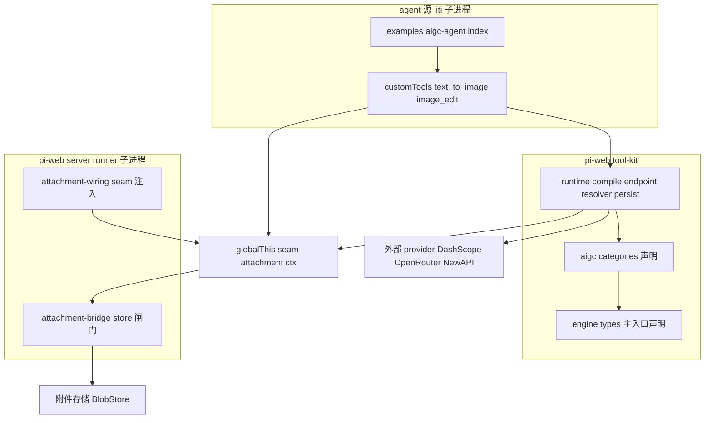
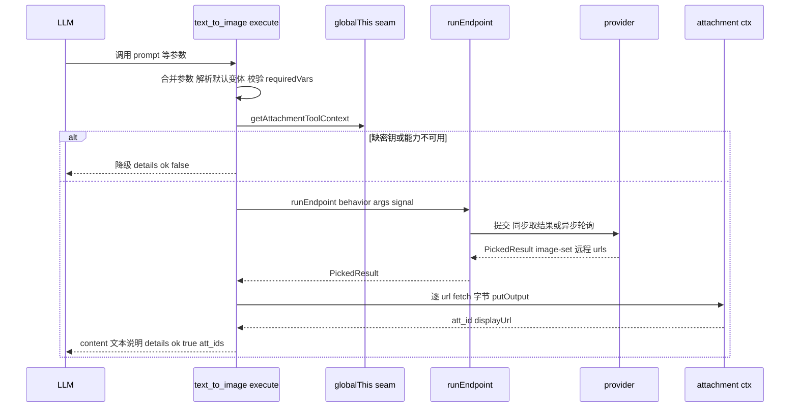

# Design Document — aigc-generation-tools

## Overview
本特性在 pi-web 引入 AIGC 生成工具首批能力(Wave 1):**文生图(`text_to_image`)** 与 **图像编辑(`image_edit`)**。两工具以 pi `customTools` 形式由 agent 启用,LLM 经工具参数驱动生成;产物(provider 远程 URL)经 fetch 取字节后落入既有附件存储(`ctx.putOutput`)并以 `att_<id>` 引用回流,在对话中以**默认工具卡片**呈现。

引擎承载于新建独立包 `@blksails/tool-kit`(通用工具套件,AIGC 为首批工具集),移植 pi-labs aigc 引擎的精简版:保留零依赖的声明式 `Category/Variant/EndpointBehavior` 与执行内核,去除其 DB/S3 耦合,把"产物稳定化"接缝换成 pi-web 附件落库。

**Impact**: 新增一个 workspace 包与一个示例 agent;不改 pi 协议、不改既有 attachment-bridge、不触碰 web-ext/前端。Wave 1 是纯后端执行链路。

### Goals
- 文生图、图像编辑两工具端到端可用:LLM 调用 → provider 生成 → 落库 → 默认卡片展示。
- 同步与异步(轮询)两类 provider 均支持,含超时与取消。
- 产物落附件存储、对话只存引用;缺密钥/失败优雅降级。
- 建立可声明式扩展的 `@blksails/tool-kit`,AIGC 工具集与未来工具集并列、互不影响内核。

### Non-Goals
- web-ext `panelRight` 面板、自定义媒体卡片 renderer、面板状态跨进程通道(后续 Wave)。
- 声明元数据向前端下发。
- 视频生成类工具、本地 ffmpeg 媒体处理工具。
- 安装/卸载(pi PackageManager)集成。
- provider 计费台账、资产库(pi-labs 的 aigc_assets/usage)。

## Boundary Commitments

### This Spec Owns
- 新建包 `@blksails/tool-kit`:声明式工具引擎(类型 + 执行内核 + env 变量解析)与 AIGC 首批工具集(`text_to_image`/`image_edit` 的 category 声明 + provider 变体)。
- 工具 `execute` 逻辑:参数合并/默认变体、调用 provider、产物落库回流、错误/超时/取消/降级。
- 一个端到端示例 agent(`examples/aigc-agent`)用于 e2e。

### Out of Boundary
- 附件存储本体(BlobStore、描述符注册表、签名分发 URL、属主校验、base64 剥离闸门)—— 复用 attachment-bridge,不改。
- runner 装配与 ctx 注入机制(`wireAttachmentBridge` / globalThis seam)—— 复用,不改。
- 前端渲染:沿用默认 `PiToolPart` 卡片,不注册自定义 renderer。
- pi 协议:不新增文件引用原语。

### Allowed Dependencies
- `@blksails/agent-kit`(**type-only**:`AttachmentToolContext`/`AttachmentToolHandle`/`ToolOutputRef`、`defineAgent`)。
- `@blksails/protocol`(经 agent-kit 间接,`Attachment` 类型)。
- peer:`@earendil-works/pi-coding-agent`(`defineTool`/`ToolDefinition`)、`@earendil-works/pi-ai`(`Type`)。
- runtime:`undici`(代理 fetch)。
- 运行期约定:globalThis seam `"__piWebAttachmentToolContext__"`(读 attachment ctx)、`process.env`(provider 密钥)。
- **禁止**:`@blksails/tool-kit` → `@blksails/server` 的值依赖(仅约定常量同值);主入口禁止顶层 import pi SDK/undici。

### Revalidation Triggers
- `AttachmentToolContext` 契约(resolve/putOutput/handle 形态)变化。
- seam key 字符串约定变化。
- attachment env 变量(`PI_WEB_ATTACHMENT_DIR`/`PI_WEB_ATTACHMENT_SECRET`)或子进程 store 行为变化。
- pi `defineTool` / `ToolDefinition` / execute 签名变化。
- 引入前端对 `@blksails/tool-kit` 主入口的 import(触发元数据下发设计,后续 Wave)。

## Architecture

### Existing Architecture Analysis
- pi-web 分层:`protocol`(契约) ← `agent-kit`/`web-kit`(作者面) ← `server`(runner 子进程 + attachment-bridge) / `ui`(前端)。本特性新增 `tool-kit`(作者面工具套件),被 agent 源(jiti 子进程)消费。
- 工具执行在 runner 子进程(Node 运行,不经 webpack);产物经 attachment-bridge 落库回流;`afterToolCall` 闸门自动把内联 base64 剥成文本引用。
- 必须遵守 webpack externals 边界:含 SDK/undici 值导入的模块不进 Next 服务端 bundle。

### Architecture Pattern & Boundary Map


**Architecture Integration**:
- 选定模式:**声明式编译引擎 + 运行时适配器**。Category 是纯数据;`compileCategory` 在 runtime 入口把它包成 pi `ToolDefinition`;`runEndpoint` 执行 HTTP/轮询;落库经 seam 取 ctx。
- 边界分离:声明(主入口,前端安全)与执行(runtime 入口,node-only)分入口,守 webpack externals。
- 既有模式保留:工具经 globalThis seam 取 attachment ctx(对齐 `edit-image-tool.ts`);`customTools` 经 `defineAgent` 装配;降级语义对齐 `available:false`。
- 依赖方向:`types → categories → runtime(compile/endpoint/resolver/persist) → agent 装配`;agent-kit 仅 type-only 入边。

### Technology Stack
| Layer | Choice / Version | Role in Feature | Notes |
|-------|------------------|-----------------|-------|
| Backend / Services | `@blksails/tool-kit`(新包,TS strict) | 声明式引擎 + AIGC 工具集 | 双入口;主入口零运行时依赖 |
| Agent runtime | `@earendil-works/pi-coding-agent` / `pi-ai`(peer) | `defineTool` / `Type` / `ToolDefinition` | 仅 runtime 入口值导入 |
| 外部集成 | `undici` 8.x | 代理 fetch(provider 调用、产物取字节) | runtime 入口 |
| Data / Storage | 既有 attachment-bridge(`ctx.putOutput`/`resolve`) | 产物落库与输入解析 | 复用,不改 |

## File Structure Plan

### Directory Structure
```
packages/tool-kit/                       # 新建 @blksails/tool-kit
├── package.json                         # exports: "." 主入口 + "./runtime" 子入口; peerDeps: pi SDK/pi-ai; deps: undici, @blksails/agent-kit
├── tsconfig.json / tsconfig.build.json / vitest.config.ts
└── src/
    ├── index.ts                         # 主入口:re-export engine 类型 + aigc 声明(禁顶层 import SDK/undici)
    ├── runtime.ts                        # ./runtime 子入口:导出 compileCategory / buildAigcTools / 落库适配
    ├── engine/
    │   ├── types.ts                     # Category/Variant/EndpointBehavior/PickedResult/UserParamSpec/AsyncSpec/EndpointInputSchema
    │   ├── var-resolver.ts              # env-only ${VAR} 解析 + requiredVars 校验
    │   ├── proxy-fetch.ts               # undici 代理 fetch(socks5/http;env 未配 → 直连)
    │   ├── endpoint-adapter.ts          # runEndpoint(behavior,args,{signal,onProgress}) 三路径 + 轮询/超时
    │   └── compile-category.ts          # compileCategory(category,deps)→ToolDefinition(defineTool 包装 + 参数合并 + 默认变体 + 降级)
    ├── attachment/
    │   ├── seam.ts                      # SEAM_KEY 常量 + getAttachmentToolContext()(同值约定,缺失→UNAVAILABLE_CTX)
    │   └── persist.ts                   # persistPicked(picked,ctx,fetch)→putOutput 回引用; resolveInputToDataUri(attId,ctx)
    └── aigc/
        ├── index.ts                     # AIGC_CATEGORIES 列表 + buildAigcTools(opts?) 编译为 ToolDefinition[]
        ├── categories/
        │   ├── text-to-image.ts         # text_to_image Category 声明
        │   └── image-edit.ts            # image_edit Category 声明
        └── providers/
            ├── dashscope.ts             # dashscope sync/async variant 工厂
            ├── openrouter.ts            # openrouter image variant 工厂(inline data URI 经注入 fetch)
            └── newapi.ts                # newapi variant 工厂
```

### Modified / New Files (仓库其它处)
- `examples/aigc-agent/index.ts` — 新增端到端示例 agent:`defineAgent({ customTools: buildAigcTools(), ... })`,供 e2e。
- `pnpm-workspace.yaml` — 无需改(已 `packages/*`)。
- 若示例 agent 经构建期注册表展示,可选在 `lib/app/*` 注册;Wave 1 e2e 经直接选 agent 源即可,默认不改。

## System Flows

### 文生图(text_to_image)执行流

关键决策:默认变体在缺 `model` 参数时启用;`requiredVars` 缺失走降级而非抛错;异步路径 `pollMs`/`timeoutMs` 由 variant 声明,`AbortSignal` 透传以支持取消。

### 图像编辑输入接缝
image_edit 的输入图为 `att_id`:`ctx.resolve(attId).bytes()` → 转 **data URI** 注入 provider 请求(不使用 `handle.url()`,因 dev 下 displayUrl 为 localhost、provider 不可达)。mask/参考图同理。

## Requirements Traceability
| Requirement | Summary | Components | Interfaces | Flows |
|-------------|---------|------------|------------|-------|
| 1.1–1.6 | 文生图 sync/async/参数/成功/失败 | text-to-image, compile-category, endpoint-adapter, persist | `runEndpoint`, `compileCategory` | 文生图执行流 |
| 2.1–2.5 | 图像编辑 输入解析/mask/属主/成功 | image-edit, persist(resolveInputToDataUri) | `resolveInputToDataUri`, `ctx.resolve` | 图像编辑输入接缝 |
| 3.1–3.4 | 落库与引用契约 | persist, (attachment-bridge 复用) | `persistPicked`/`ctx.putOutput` | 文生图执行流 |
| 4.1–4.3 | 默认变体/参数校验/schema 暴露 | compile-category | `compileCategory`(参数合并) | — |
| 5.1–5.3 | env 密钥/缺配置降级 | var-resolver, compile-category, seam | `resolveVars`/`getAttachmentToolContext` | 文生图执行流(降级分支) |
| 6.1–6.3 | 工具集承载/一致接入/执行半不进前端 | 包结构(双入口), aigc/index | `buildAigcTools` | — |
| 7.1–7.4 | 测试/超时/取消 | endpoint-adapter, 全包测试 | `runEndpoint`(signal/timeout) | 文生图执行流 |

## Components and Interfaces

| Component | Domain/Layer | Intent | Req Coverage | Key Dependencies (P0/P1) | Contracts |
|-----------|--------------|--------|--------------|--------------------------|-----------|
| engine/types | 声明/类型 | 引擎类型契约 | 6.1 | — | State(类型) |
| engine/endpoint-adapter | 执行内核 | provider 调用 + 轮询 | 1.3,1.4,1.6,7.3,7.4 | undici(External P1) | Service |
| engine/var-resolver | 执行内核 | env 变量解析 + 校验 | 5.1,5.2 | process.env(External P0) | Service |
| engine/compile-category | 编译器 | Category→ToolDefinition | 1.1,1.2,4.1,4.2,4.3,5.2 | pi SDK(External P0) | Service |
| attachment/seam | 运行期适配 | 读 attachment ctx | 3.1,5.3 | agent-kit type(P0) | State |
| attachment/persist | 运行期适配 | 产物落库 + 输入解析 | 2.1,3.1,3.2 | ctx.putOutput/resolve(P0) | Service |
| aigc/categories/* | 工具集声明 | 两工具 + variant 声明 | 1.x,2.x,4.1 | engine/types(P0) | State |
| aigc/index(buildAigcTools) | 工具集装配 | 编译为 ToolDefinition[] | 6.1,6.2 | compile-category(P0) | Service |

### 执行内核

#### engine/endpoint-adapter
| Field | Detail |
|-------|--------|
| Intent | 按 EndpointBehavior 执行一次生成(HTTP 同步 / 异步轮询),返回 PickedResult |
| Requirements | 1.3, 1.4, 1.6, 7.3, 7.4 |

**Responsibilities & Constraints**
- 三路径:同步 POST、异步(提交→轮询 status→取 response)、(runLocal 预留但 Wave 1 不用)。
- 轮询:`pollMs`(默认 2000)/`timeoutMs`(默认 300000)由 behavior.async 声明;`AbortSignal` 中断 sleep 与请求(取消,7.4)。
- 超时→抛超时错误(7.3);`detectError` 命中→抛 provider 错误(1.6)。

**Contracts**: Service [x]

```typescript
interface RunEndpointOptions {
  signal?: AbortSignal;
  onProgress?: (stage: RunStage) => void;
  // 注入式 fetch(默认 proxyFetch);测试以 mock 覆盖
  fetchImpl?: typeof fetch;
}
type RunStage = "submitting" | "queued" | "running" | "fetching" | "complete";

function runEndpoint(
  behavior: EndpointBehavior,
  args: Readonly<Record<string, unknown>>,
  options?: RunEndpointOptions,
): Promise<PickedResult>;
```
- Preconditions: HTTP 路径要求 `behavior.url`/`pickResult`;`requiredVars` 已在 compile 层校验。
- Postconditions: 返回 `PickedResult`(Wave 1 主要 `image`/`image-set`);失败抛 `ToolError`(可读 message)。
- Invariants: 不写任何持久状态(纯执行);不读 process.env 以外的外部依赖。

**Implementation Notes**
- Integration: `buildBody(args, {proxyUrl, fetchImpl})` 可异步(OpenRouter inline);headers/url 经 var-resolver 展开 `${VAR}`。
- Validation: 空/坏 JSON 响应容错(轮询继续 / 同步抛诊断)。
- Risks: R-1/R-2(provider 可达性、async 时长)→ 单测 mock fetch,e2e 优先 sync variant。

#### engine/var-resolver
**Contracts**: Service [x]
```typescript
function resolveVars(template: string): string;            // 缺失抛 ToolError
function resolveVarsOptional(template?: string): string | undefined; // 任一缺失→undefined
function checkRequiredVars(vars?: readonly string[]): { ok: true } | { ok: false; missing: string[] };
```
- env-only:`${NAME}` → `process.env[NAME]`;`checkRequiredVars` 供 compile 层在 execute 入口判定降级(5.2)。

#### engine/compile-category
| Field | Detail |
|-------|--------|
| Intent | 把 Category 编译成 pi ToolDefinition(参数 schema、默认变体、参数合并、落库、降级) |
| Requirements | 1.1, 1.2, 4.1, 4.2, 4.3, 5.2 |

**Contracts**: Service [x]
```typescript
interface CompileDeps {
  getCtx: () => AttachmentToolContext;          // 默认读 seam
  fetchImpl?: typeof fetch;                      // 默认 proxyFetch;测试注入
}
function compileCategory(category: Category, deps?: CompileDeps): ToolDefinition;
```
- 参数合并优先级(高→低):LLM args(去 `model`)> userParam 默认。(Wave 1 无面板状态层。)
- 默认变体:LLM `model` 参数 > `category.defaultVariant`(4.1)。
- 参数 schema 经 `category.inputSchema` 映射为 pi `Type.*`,暴露给 LLM(4.3);非法/越界 → 可读错误(4.2)。
- execute 入口:`checkRequiredVars` + `getCtx().available` 任一不满足 → 返回 `{ ok:false, error }` 降级(5.2/5.3),不抛。
- 成功:`runEndpoint` → `persistPicked` → 组装 content(文本说明 + 可选 inline image,base64 会被 afterToolCall 闸门剥离)+ details。

**Implementation Notes**
- Integration: `defineTool` 值导入 pi SDK ⇒ 本文件属 runtime 入口,绝不进主入口/Next bundle。
- Validation: details 用判别联合 `{ok:true,...}|{ok:false,error}`(对齐 example-tool)。

### 运行期适配

#### attachment/persist
**Contracts**: Service [x]
```typescript
interface PersistedAsset { attachmentId: string; displayUrl: string; mimeType: string; name: string; }

// 产物落库:逐 url fetch 字节 → ctx.putOutput;返回引用集
function persistPicked(
  picked: PickedResult,
  ctx: AttachmentToolContext,
  opts: { fetchImpl?: typeof fetch; namePrefix?: string },
): Promise<PersistedAsset[]>;

// 输入解析:att_id → bytes → data URI(供 provider 请求内联)
function resolveInputToDataUri(attachmentId: string, ctx: AttachmentToolContext): Promise<string>;
```
- Preconditions: `ctx.available === true`(否则上层已降级)。
- Postconditions: 产物以 `att_<id>` 引用回流(3.1/3.2);输入图属主由 `beforeToolCall` 前置保证,`resolve` 越权→错误(2.3/2.4)。
- Invariants: 不回半引用(putOutput 失败→抛,落工具 catch)。

#### attachment/seam
```typescript
const SEAM_KEY = "__piWebAttachmentToolContext__";
function getAttachmentToolContext(scope?: Record<string, unknown>): AttachmentToolContext; // 缺失→available:false
```

### 工具集

#### aigc/index — buildAigcTools
**Contracts**: Service [x]
```typescript
interface BuildAigcToolsOptions { deps?: CompileDeps; include?: readonly ("text_to_image" | "image_edit")[]; }
function buildAigcTools(options?: BuildAigcToolsOptions): ToolDefinition[];
```
- 遍历 `AIGC_CATEGORIES`(Wave 1 两项)→ `compileCategory`,返回可直接进 `defineAgent({ customTools })` 的数组(6.1/6.2)。

#### aigc/categories/text-to-image & image-edit (Summary-only)
- 纯声明(Category),无新边界;字段对齐 F-1。`text_to_image` required `prompt`;`image_edit` required `instruction`+输入图(以 `att_id` 承载,经 `resolveInputToDataUri` 转 provider 可用形态)。**禁止顶层 import** 运行时库(buildBody 用注入 fetch / 全局 fetch)。

## Error Handling
### Error Strategy
工具 execute 全程 try/catch,失败以 `details:{ok:false,error}` + 文本返回,**不崩溃子进程**(对齐 7.x / example-tool)。
### Error Categories
- **配置错误**(降级):缺 provider 密钥 / attachment 不可用 → `ok:false` "能力不可用/缺少配置"(5.2/5.3)。
- **参数错误**:非法/越界参数 → 可读参数错误并说明期望(4.2)。
- **provider 错误/超时**(1.6/7.3):`detectError` 或超时 → 可读失败说明。
- **输入越权/无效**(2.4):`resolve` 抛错 → 可读错误,不访问越权资源。
- **取消**(7.4):`AbortSignal` 触发 → 中断轮询,不遗留挂起。

## Testing Strategy
### Unit Tests
- `runEndpoint`:同步路径(mock fetch 返回 image-set)、异步轮询(mock status 序列 PENDING→SUCCEEDED)、超时(timeoutMs 到点抛)、取消(abort 中断 sleep)。
- `var-resolver`:`${VAR}` 命中/缺失、`checkRequiredVars` missing 列表。
- `compile-category`:默认变体选取、LLM `model` 覆盖、参数越界报错、缺密钥/ctx 不可用降级返回 `ok:false`。
- `persist`:`persistPicked` 多 url → 多次 putOutput;`resolveInputToDataUri` 字节→data URI。
### Integration Tests
- `buildAigcTools()` 产物可装进 `defineAgent({customTools})` 并通过类型;execute 在注入 mock ctx + mock fetch 下走通 text_to_image 与 image_edit 全链路(落库回引用)。
- 缺 seam ctx(未装配)→ 工具加载成功且调用返回降级(对齐 attachment-bridge 降级)。
### E2E (critical path)
- 选 `examples/aigc-agent` 源 → prompt 触发 `text_to_image`(优先 sync variant)→ 生成 → 落库 → 默认卡片展示产物;以新鲜证据(截图/输出)证明(7.2)。provider 密钥经本地 env;无密钥时验证降级路径。

## Security Considerations
- provider 密钥仅经 `process.env` 在子进程读取,**不进前端 bundle**(主入口禁 SDK/undici 值导入,6.3);不写入对话/历史。
- 产物经既有签名分发 URL 呈现;对话只存 `att_<id>` 引用(3.2/3.3)。
- 输入附件属主由 `beforeToolCall` 前置校验,工具内 `resolve` 不绕过(2.3/2.4)。
