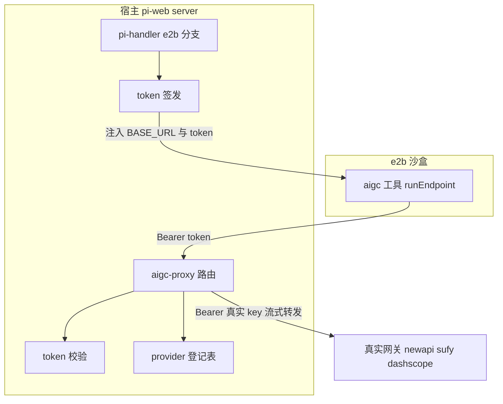
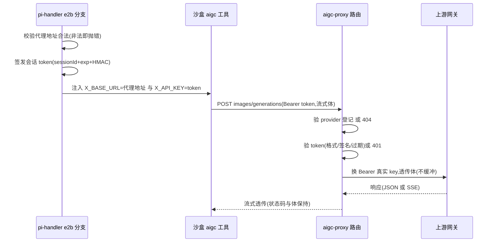

# Design Document — aigc-key-proxy

## Overview

**Purpose**: 本特性为 e2b 云沙盒会话消除 aigc 网关真实 key 的沙盒内暴露:沙盒里的 aigc 工具改经宿主凭据注入代理访问上游网关,真实 key 永不离开宿主进程边界。
**Users**: 部署 pi-web 并启用 e2b 沙盒的运维者(配置一个代理地址即启用);沙盒内运行的 agent 与 aigc 工具(无感知)。
**Impact**: e2b 会话创建路径的凭据注入内容改变(3 个 aigc 网关键);宿主新增一个顶层 API 段;Router 获得尾段通配能力;三个 provider 声明的 baseUrl 改为带默认值的 env 占位。本地 spawn 路径与前端零改动。

### Goals

- 代理模式下,newapi/sufy/dashscope 的真实 key 不进入沙盒 env、沙盒创建参数与任何发往沙盒的帧(Req 4)
- 沙盒内 aigc 工具经会话短期凭据访问宿主代理,行为(含流式、multipart、dashscope 异步轮询)与直连一致(Req 2、5)
- 单一配置项启用;未配置时向后兼容;本地 spawn 完全不变(Req 1)

### Non-Goals

- pi SDK 的 LLM/视觉模型凭据收口(APISERVICES_API_KEY 等——依赖 pi-clouds entrypoint 支持 baseURL 注入,另立 spec)
- NewAPI 子 key/配额方案(方案 B)、多租户 key 管理
- CONNECT 正向代理接缝(`behavior.proxy`/`proxyFetch`)的任何改动
- token 主动撤销存储(过期即失效)

## Boundary Commitments

### This Spec Owns

- 宿主代理端点 `/api/aigc-proxy/:provider/*` 的鉴权、凭据替换、上游白名单与流式转发
- 会话短期凭据(aigc-proxy token)的格式、签发与校验
- e2b 会话创建路径上 aigc 网关三键(NEWAPI/SUFY/DASHSCOPE)的注入切换逻辑
- 三个 aigc provider 声明中 baseUrl 的 env 占位化
- Router 尾段 `*` 通配匹配能力(通用基础设施的最小扩展)

### Out of Boundary

- `PROVIDER_KEY_NAMES` 中其余 7 个 LLM 键的透传行为(保持现状)
- 容器 entrypoint 与 models.json 生成(pi-clouds 仓)
- 附件系统的拓扑判定与 env 注入(仅复用其 secret 解析范式,不改其行为)
- `runEndpoint`/`var-resolver` 执行引擎(零改动,仅消费其既有占位能力)

### Allowed Dependencies

- `packages/server` 内部:`http/router`(扩展)、`http/handler.types`(InjectedRoute)、`attachment/url-signer` 的范式(不 import,同型新写以隔离签名域)
- Node 内置:`node:crypto`(HMAC/timingSafeEqual)、全局 `fetch`(undici,流式转发)
- `lib/app`:`config.ts`(新配置字段)、`pi-handler.ts`(e2b 分支注入切换 + 路由注入)
- 禁止:aigc-proxy 模块 import pi SDK;tool-kit 改动仅限三个 provider 声明文件的字面量

### Revalidation Triggers

- Router 匹配语义变化(通配段行为)→ 依赖 Router 的所有注入路由 spec 需回归
- 会话 token 格式/签名域变化 → 沙盒侧已发 token 全部失效(仅影响运行中会话)
- provider 上游地址变化 → 代理登记表与 tool-kit 默认字面量须同步修改(两处一致性)
- e2b envPassthrough 组装逻辑变化 → sandbox-baked-agent-image spec 的注入断言需回归

## Architecture

### Existing Architecture Analysis

- 全部 `/api` 流量经宿主 `app.all("/api/*")` → 单例 handler → 自研 `Router`(`packages/server/src/http/router.ts`);新顶层段经 `lib/app/pi-handler.ts` 的 `routes: [...]` 注入,无需 app 层改动
- aigc 工具全部请求收敛于 `runEndpoint`,URL 与 headers 经 `resolveVars` 支持 `${VAR:-default}` 占位(值源子进程 `process.env`)
- e2b 分支凭据注入:`config.providerKeys` → `e2bSpec.env` → `envPassthrough` 白名单 → `Sandbox.create envs`
- 既有 fail-fast 惯例:e2b 缺配置在会话创建路径抛清晰错误,绝不静默回退

### Architecture Pattern & Boundary Map



**Architecture Integration**:
- 模式:凭据注入反向代理(credential-injecting reverse proxy),token 换 key 发生在宿主进程内
- 边界分离:tool-kit 只知道「网关地址可被 env 覆盖」;server 只知道「验 token、换 key、转发」;lib/app 只做接线与注入切换——三层互不感知对方实现
- 保留既有模式:注入路由工厂(`create*Routes`)、`*ConfigFromEnv` 纯函数、HMAC+timingSafeEqual 签名、fail-fast 缺配置错误
- 新组件必要性:Router 通配(任意子路径转发的唯一阻塞)、token 模块(会话粒度短期凭据是方案 A 的安全核心)
- Steering 合规:server 仅依赖 protocol;安全(token 校验)做成模块内策略;spec 边界=层边界

### Technology Stack

| Layer | Choice / Version | Role in Feature | Notes |
|-------|------------------|-----------------|-------|
| Backend / Services | Node ≥22 全局 fetch(undici) | 上游流式转发(`duplex:"half"` 请求体透传) | 无新依赖 |
| Backend / Services | `node:crypto`(HMAC-SHA256 + timingSafeEqual) | 会话 token 签发/校验 | 复用 url-signer 范式,独立签名域 |
| Tool 执行 | 既有 `var-resolver` `${VAR:-default}` | 网关地址覆盖机制 | 零引擎改动 |

## File Structure Plan

### Directory Structure

```
packages/server/src/aigc-proxy/          # 新域:凭据注入代理(server 包内自洽)
├── session-token.ts                     # token 签发/校验(格式、HMAC、过期、常量时间比对)
├── provider-registry.ts                 # provider→{上游 base, keyEnv} 静态登记表 + 查找
├── proxy-routes.ts                      # createAigcProxyRoutes 注入路由工厂(鉴权→换 key→流式转发)
└── index.ts                             # barrel(不触 pi SDK)
```

### Modified Files

- `packages/server/src/http/router.ts` — `matchPath`/`compile` 支持模板尾段 `*`(余段捕获进 `params["*"]`),其余语义不变
- `packages/server/src/index.ts` — barrel 增加 `export * from "./aigc-proxy/index.js"`
- `packages/tool-kit/src/aigc/providers/newapi.ts` — baseUrl → `${NEWAPI_BASE_URL:-https://www.apiservices.top/v1}`
- `packages/tool-kit/src/aigc/providers/sufy.ts` — baseUrl → `${SUFY_BASE_URL:-https://openai.sufy.com/v1}`
- `packages/tool-kit/src/aigc/providers/dashscope.ts` — `BASE` → `${DASHSCOPE_BASE_URL:-https://dashscope.aliyuncs.com/api/v1}`
- `lib/app/config.ts` — 新增 `aigcProxyPublicBase?: string`(原始值,不在此校验)与 `AIGC_GATEWAY_KEY_NAMES` 子集常量导出
- `lib/app/pi-handler.ts` — e2b 分支:代理模式判定、token 签发、注入内容切换(剔除三真实键/并入 BASE_URL+token 键)、警告日志;`routes` 数组注入 `createAigcProxyRoutes`
- `test/route.integration.test.ts` — e2b 注入组合断言(代理模式三真实键不进 env/白名单)

## System Flows



关键门控:provider 校验先于 token 校验(未知 provider 不消耗 HMAC 计算);token 校验失败即 401 短路,绝不发起上游请求;上游 fetch 失败映射 502、超时映射 504,响应体只含脱敏消息。

## Requirements Traceability

| Requirement | Summary | Components | Interfaces | Flows |
|-------------|---------|------------|------------|-------|
| 1.1 | 代理模式注入切换 | pi-handler e2b 分支 | buildSandboxGatewayEnv | 注入流 |
| 1.2 | 未配置向后兼容+警告 | pi-handler e2b 分支 | — | 注入流 |
| 1.3 | 本地 spawn 不变 | (无改动,负向断言) | — | — |
| 1.4 | 非法地址 fail-fast | aigcProxyConfig 校验 | resolveAigcProxyConfig | 注入流 |
| 2.1 | 换 key 转发 | proxy-routes | createAigcProxyRoutes | 转发流 |
| 2.2 | provider 白名单 | provider-registry | lookupProvider | 转发流 |
| 2.3 | 任意子路径 | Router 通配 + proxy-routes | matchPath `*` | 转发流 |
| 2.4 | 流式不缓冲 | proxy-routes | fetch duplex/Response(body) | 转发流 |
| 2.5 | 上游错误透传 | proxy-routes | — | 转发流 |
| 2.6 | 502/504 且无 key | proxy-routes | — | 转发流 |
| 3.1 | 会话绑定短期 token | session-token | mintSessionToken | 注入流 |
| 3.2 | TTL 覆盖沙盒存活 | session-token + pi-handler | mintSessionToken(ttlMs) | 注入流 |
| 3.3 | 无效 token 401 | session-token + proxy-routes | verifySessionToken | 转发流 |
| 3.4 | token 可溯会话 | session-token | verifySessionToken 返回 sessionId | — |
| 4.1 | 真实 key 不进沙盒 | pi-handler e2b 分支 | buildSandboxGatewayEnv | 注入流 |
| 4.2 | 日志/响应无 key | proxy-routes | — | 转发流 |
| 4.3 | 日志凭据脱敏 | proxy-routes | — | 转发流 |
| 5.1 | 默认行为不变 | provider 声明占位 | `${X:-default}` | — |
| 5.2 | 覆盖生效(含轮询) | provider 声明占位 | dashscope BASE 占位 | 转发流 |
| 5.3 | 三网关独立覆盖 | provider 声明占位 | 三独立 env 键 | — |

## Components and Interfaces

| Component | Domain/Layer | Intent | Req Coverage | Key Dependencies | Contracts |
|-----------|--------------|--------|--------------|------------------|-----------|
| session-token | server/aigc-proxy | 会话 token 签发/校验 | 3.1–3.4 | node:crypto (P0) | Service |
| provider-registry | server/aigc-proxy | provider→上游/keyEnv 登记 | 2.2 | — | Service |
| proxy-routes | server/aigc-proxy | 鉴权→换 key→流式转发 | 2.1–2.6, 4.2, 4.3 | session-token (P0), provider-registry (P0), fetch (P0) | API |
| Router 通配 | server/http | 尾段 `*` 匹配 | 2.3 | — | Service |
| pi-handler e2b 切换 | lib/app | 注入内容切换/告警/fail-fast | 1.1, 1.2, 1.4, 3.2, 4.1 | session-token (P0), config (P0) | Service |
| provider 声明占位 | tool-kit/aigc | baseUrl env 覆盖 | 5.1–5.3 | var-resolver 既有能力 (P0) | — |

### server/aigc-proxy

#### session-token

| Field | Detail |
|-------|--------|
| Intent | 与会话绑定、可过期、可溯源的短期凭据的签发与校验 |
| Requirements | 3.1, 3.2, 3.3, 3.4 |

**Responsibilities & Constraints**
- token 格式:`pwap1.<sessionId>.<exp>.<sigHex>`;`sig = HMAC-SHA256(secret, "aigc-proxy.v1." + sessionId + "." + exp)`
- secret 解析:`PI_WEB_AIGC_PROXY_SECRET` → 回退 `PI_WEB_ATTACHMENT_SECRET`;两者皆缺时签发路径抛清晰错误(代理模式必须有稳定 secret)
- 签名域前缀 `aigc-proxy.v1.` 使 token 与附件签名 URL 不可互换
- 校验:格式→过期→`timingSafeEqual` 签名比对,全部通过才返回 sessionId;任何失败返回判别失败原因(不抛)

**Contracts**: Service [x]

```typescript
interface AigcProxyTokenService {
  /** 签发:exp = now + ttlMs;ttlMs 由调用方按沙盒最大存活时间给出 */
  mintSessionToken(input: {
    sessionId: string;
    ttlMs: number;
    secret: string | Buffer;
  }): string;
  /** 校验:成功返回所属会话,失败返回原因(malformed | expired | bad-signature) */
  verifySessionToken(input: {
    token: string;
    secret: string | Buffer;
    nowMs?: number;
  }):
    | { ok: true; sessionId: string; exp: number }
    | { ok: false; reason: "malformed" | "expired" | "bad-signature" };
}
```

- Preconditions: secret 非空;sessionId 不含 `.`(含则签发抛错——格式分隔符)
- Postconditions: 同 secret 互验通过;篡改任一字段必失败;过期判定用注入时钟便于测试
- Invariants: token 不含任何真实 provider key 的派生信息

#### provider-registry

| Field | Detail |
|-------|--------|
| Intent | 已登记 provider 的上游 base 与真实 key env 名的静态映射 |
| Requirements | 2.2 |

**Responsibilities & Constraints**
- 静态表:`newapi → { upstreamBase: "https://www.apiservices.top/v1", keyEnv: "NEWAPI_API_KEY" }`;`sufy → { upstreamBase: "https://openai.sufy.com/v1", keyEnv: "SUFY_API_KEY" }`;`dashscope → { upstreamBase: "https://dashscope.aliyuncs.com/api/v1", keyEnv: "DASHSCOPE_API_KEY" }`
- 上游 base 必须与 tool-kit 占位默认字面量一致(revalidation trigger,两处同改)
- 真实 key 在**请求期**从宿主 `process.env[keyEnv]` 读取,不缓存(与本地直连的 env 语义一致)

**Contracts**: Service [x]

```typescript
type AigcProxyProviderId = "newapi" | "sufy" | "dashscope";
interface AigcProxyProviderEntry {
  readonly upstreamBase: string;
  readonly keyEnv: string;
}
function lookupProvider(id: string): AigcProxyProviderEntry | undefined;
```

#### proxy-routes

| Field | Detail |
|-------|--------|
| Intent | 注入路由工厂:鉴权、凭据替换、白名单上游、双向流式转发 |
| Requirements | 2.1, 2.2, 2.3, 2.4, 2.5, 2.6, 4.2, 4.3 |

**Responsibilities & Constraints**
- 处理顺序:provider 查表(未登记→404)→ Bearer token 提取+校验(缺失/无效/过期→401)→ 真实 key 查 env(缺失→502,消息提示宿主未配 key,不含 key 值)→ 转发
- 转发:`fetch(upstreamBase + "/" + rest + search, { method, headers: 过滤后透传, body: req.body, duplex: "half" })`;headers 剔除 `host`、`authorization`、`content-length`、逐跳头,注入 `authorization: Bearer <真实key>`;其余(含 `content-type` multipart boundary、`x-dashscope-async`、`accept`)原样透传
- 响应:`new Response(upstream.body, { status, headers: 过滤后透传 })`——SSE 与大响应体不缓冲
- 上游 4xx/5xx:状态码与响应体原样透传(体本身来自上游,不含宿主 key)
- fetch 网络错误→502、AbortSignal 超时(可配,默认不设额外超时,交上游语义)→504;错误体固定脱敏文案
- 日志:仅记 `sessionId`(token 校验产物)、provider、path、status;绝不记 authorization 头与 token 全文

**Contracts**: API [x]

##### API Contract

| Method | Endpoint | Request | Response | Errors |
|--------|----------|---------|----------|--------|
| GET/POST/PUT/DELETE | `/api/aigc-proxy/:provider/*` | Bearer 会话 token + 任意体(JSON/multipart) | 上游响应流式透传 | 401(token)、404(provider)、502(上游不可达/宿主缺 key)、504(超时) |

工厂签名:

```typescript
function createAigcProxyRoutes(deps: {
  /** secret 解析结果(装配期注入,便于测试) */
  readonly secret: string | Buffer;
  /** 测试接缝:缺省 globalThis.fetch */
  readonly fetchImpl?: typeof fetch;
  /** 测试接缝:缺省 process.env(真实 key 查取) */
  readonly env?: Record<string, string | undefined>;
}): InjectedRoute[];
```

### server/http

#### Router 尾段通配

| Field | Detail |
|-------|--------|
| Intent | 模板尾段 `*` 捕获任意深度余段,支撑代理任意子路径 |
| Requirements | 2.3 |

**Responsibilities & Constraints**
- `compile` 识别模板尾段 `*`;`matchPath` 对通配路由放宽为 `segments.length >= route.segments.length - 1`(`*` 可匹配零段),余段以 `/` 连接存入 `params["*"]`(每段先 decodeURIComponent 再连接)
- 非通配模板语义零变化;内置路由仍在前、先匹配先赢;`*` 仅允许出现在尾段(中段 `*` 视为字面量,保持向后兼容)
- 405 语义:通配路由 path 匹配但方法不符时同现有行为

**Contracts**: Service [x](`matchPath` 内部契约,经路由行为间接观察)

### lib/app

#### pi-handler e2b 注入切换 + 配置

| Field | Detail |
|-------|--------|
| Intent | 代理模式判定、token 签发接线、注入内容切换、fail-fast 与告警 |
| Requirements | 1.1, 1.2, 1.4, 3.2, 4.1 |

**Responsibilities & Constraints**
- 配置:`lib/app/config.ts` 收原始 `PI_WEB_AIGC_PROXY_PUBLIC_BASE`;e2b 分支内 `resolveAigcProxyConfig` 校验(非 http/https URL → 抛携修复指引错误,Req 1.4;在会话创建路径,与 selectTransport 同位)
- 代理模式(已配置):
  - `ttlMs = (PI_WEB_E2B_TIMEOUT_MS ?? 默认沙盒 TTL) + 15min 余量`,可被 `PI_WEB_AIGC_PROXY_TOKEN_TTL_MS` 覆盖(Req 3.2)
  - 签发 token;构造 `buildSandboxGatewayEnv`:`{NEWAPI,SUFY,DASHSCOPE}_BASE_URL = <publicBase>/api/aigc-proxy/<provider>`、`{NEWAPI,SUFY,DASHSCOPE}_API_KEY = token`
  - `e2bSpec.env` 组装时:`config.providerKeys` 剔除 `AIGC_GATEWAY_KEY_NAMES` 三键后并入,再并入 gateway env;`envPassthrough` 同步(三真实键名不出现,六个 gateway 键名并入)(Req 1.1、4.1)
- 兼容模式(未配置):注入逻辑与现状完全一致,输出一条含 `aigc-proxy` 可检索标识的警告日志(Req 1.2)
- 本地 spawn 分支代码路径不触碰(Req 1.3 为负向断言,靠测试固定)
- `routes` 数组注入 `createAigcProxyRoutes({ secret })`(secret 与 token 签发同源)

### tool-kit/aigc

#### provider 声明占位(summary-only)

三个 provider 声明文件的 baseUrl/BASE 字面量改为 `${X_BASE_URL:-<原字面量>}`。执行期 `resolveVars` 展开:env 未设→默认字面量(Req 5.1),已设→覆盖地址(Req 5.2),三键独立(Req 5.3)。dashscope 的异步轮询 URL 由同一 `BASE` 拼接,自动跟随。模块顶层不读 `process.env` 的双入口约束保持(占位是字符串字面量,展开发生在 runEndpoint 执行期)。

## Error Handling

### Error Strategy

代理端点全部错误走既有 `errorResponse` JSON 形状;fail-fast 集中在会话创建路径(配置校验);转发期错误只向调用方暴露脱敏信息。

### Error Categories and Responses

- **401 UNAUTHORIZED**(token 缺失/malformed/expired/bad-signature):不区分对外文案(防探测),原因仅进服务端日志
- **404 NOT_FOUND**(provider 未登记):与 Router 既有 404 形状一致
- **502 BAD_GATEWAY**(上游网络错误 / 宿主缺真实 key):两种内因同码,文案区分「网关不可达」与「宿主凭据未配置」,均不含 key
- **504 GATEWAY_TIMEOUT**(转发超时)
- **上游 4xx/5xx**:原样透传(工具侧 detectError 语义与直连一致,Req 2.5)
- **会话创建错误**(非法代理地址):抛错文案含变量名与三种修复路径(改正地址/移除变量回兼容模式/切 local 传输)

### Monitoring

`toolkit:proxy` 命名空间之外新增 server 侧 `server:aigc-proxy` 日志命名空间:每请求一行(sessionId、provider、path、status、耗时),凭据字段一律脱敏(Req 4.3)。

## Testing Strategy

### Unit Tests

1. session-token:同 secret 互验/篡改 sessionId、exp、sig 任一字段必失败/过期判定(注入时钟)/sessionId 含 `.` 拒签(3.1, 3.3, 3.4)
2. provider-registry:三 provider 查表命中、未知 id 返回 undefined(2.2)
3. Router 通配:尾段 `*` 匹配零段/一段/多段;`params["*"]` 余段还原;非通配模板行为零回归;通配与精确路由共存时精确优先(2.3)
4. resolveAigcProxyConfig:合法 http/https 通过;非法值抛含修复指引错误;未设返回 undefined(1.4)
5. buildSandboxGatewayEnv:六键形状正确;publicBase 尾斜杠归一(1.1)

### Integration Tests

1. proxy-routes × 真实 HTTP stub 上游:有效 token → 上游收到 `Bearer <真实key>`、响应体透传(2.1);无效/过期 token → 401 且 stub 零请求(3.3);未知 provider → 404 且零请求(2.2)
2. 流式:stub 上游发 SSE 分片 → 调用方按片增量收到(非一次性)(2.4);multipart 请求体 → stub 收到 boundary 完整的原始体(2.4)
3. 错误:stub 返回 400/500 → 状态码与体透传(2.5);上游端口不通 → 502 且响应体无 key(2.6)
4. e2b 注入组合(`test/route.integration.test.ts` 风格):代理模式下 e2bSpec.env 与 envPassthrough 不含三真实键、含六 gateway 键且 `*_API_KEY` 值为 token 形状;未配置时与现状快照一致 + 警告日志(1.1, 1.2, 4.1)
5. runEndpoint × 占位:子进程 env 设 `NEWAPI_BASE_URL` 指 stub → 请求打到 stub;未设 → 默认字面量(5.1, 5.2, 5.3)
6. 本地传输回归:配置了代理地址时,local 分支 spawnSpec 组装结果与未配置时逐键一致(负向断言钉死 Req 1.3)

### E2E Tests

1. **核心链路(无 e2b 依赖)**:起真实 pi-web server(代理路由启用,宿主 env 含 `NEWAPI_API_KEY=sk-real-e2e`)+ node:http stub 上游;独立子进程(env 仅含 `NEWAPI_BASE_URL=<server>/api/aigc-proxy/newapi` 与 `NEWAPI_API_KEY=<token>`,无真实 key)经真实 runEndpoint 发起文生图 → 断言:产物 b64 正确回传;stub 收到且仅收到 `Bearer sk-real-e2e`;子进程全程 env 无 `sk-real-e2e`(4.1 安全性质的端到端证明)
2. 同链路负路径:子进程持过期 token → 工具收到 401 错误语义(3.3)
3. e2b 全链(条件跑):既有 `e2e:sandbox-browser` 基建可用时,沙盒内生图经代理完成(带凭据环境的回归项,缺基建 SKIP)

## Security Considerations

- token 与附件签名 URL 签名域隔离(前缀 `aigc-proxy.v1.`),互换必失败
- 代理绝不回显 upstream 请求头;日志脱敏走既有 redact 惯例(install-host-command 教训:Bearer/JSON/裸 token 三形态都要盖)
- 登记表写死,`:provider` 不参与 URL 拼接除查表命中项——无 SSRF 面
- 兼容模式(未配代理)不是安全终态:警告日志 + 文档标注,目标态为强制代理(后续 spec 决定翻转默认)

## Performance & Scalability

- 代理引入一跳 RTT(沙盒→宿主→上游 vs 沙盒→上游);图像生成请求秒级,一跳毫秒级,可忽略
- 双向流式(请求 `duplex:"half"`、响应 `Response(body)`)保证大 multipart 与 SSE 不占用宿主内存缓冲
- token 校验为纯内存 HMAC,每请求 O(1),无存储查询
