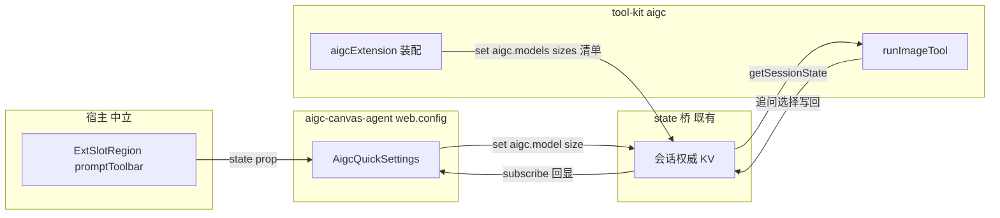

# Design Document — aigc-prompt-toolbar

## Overview

**Purpose**: 在输入区工具排(内核控件之后、发送键之前)为 aigc-canvas-agent 提供图像模型/尺寸快捷设置;所选偏好经既有会话共享状态通道抵达图像工具执行,免打断、可回显、跨会话保留。
**Users**: aigc-canvas-agent 的创作用户(选模型/尺寸后连续生图);agent source 作者(获得一个领域无关的工具排扩展点)。
**Impact**: 宿主新增一个具名槽 `promptToolbar` 与 state 透传(领域无关);aigc 工具的参数决定链插入"用户偏好"一级(显式 args > 偏好 > 默认/追问)。

### Goals
- 工具排内领域无关贡献扩展点(source 声明即渲染,未声明零占位)。
- 模型/尺寸选择 → 会话偏好 → 图像工具直接采用并跳过对应交互追问。
- 追问中的选择写回偏好并回显;同浏览器跨会话保留上次选择。

### Non-Goals
- 不改动工具排既有"模型"控件(对话 LLM 选择器)。
- 不重构 Canvas 工作台内的模型/尺寸表单(允许并存;后续可统一消费清单 KV)。
- 不新增 REST 端点、不改 state 桥协议语义、不做多浏览器同步。

## Boundary Commitments

### This Spec Owns
- SlotKey `promptToolbar` 的定义、渲染位置(发送键前)与 data 属性契约(`data-pi-ext-prompt-toolbar`)。
- `ExtSlotRegion` 的 `state` 可选透传(领域无关能力补齐)。
- KV 键约定:偏好 `aigc.model`/`aigc.size`,清单 `aigc.models`/`aigc.sizes`。
- `AigcQuickSettings` 组件(aigc 领域 UI)与 aigc-canvas-agent 的槽声明。
- `runImageTool` 参数决定链中的偏好一级(读取白名单 {model,size})与追问写回。

### Out of Boundary
- state 桥本体(写回端点、粘性帧、seam 装配)——既有,不改。
- 图像工具的 routes/provider 内容与交互追问 UI 形态。
- workbench 既有模型清单的重构;其他 source 的工具排贡献内容。

### Allowed Dependencies
- UI 组件仅依赖 props 注入的 `WebExtStateAccess` 与浏览器 localStorage(不 import tool-kit)。
- tool-kit 仅依赖自身 `session-state.ts` seam(deps 注入可覆盖);宿主(pi-chat/extension-slots/protocol)不得出现 aigc 领域词汇。
- 依赖方向:protocol → web-kit → ui(宿主中立层)/ tool-kit(领域层)互不 import。

### Revalidation Triggers
- SlotKey enum 形状变化(消费方 webext 声明与 chat-app 测试 mock 需同步)。
- KV 键约定变化(UI 与工具两侧同时改)。
- `resolveRequiredParams` 交互协议变化(写回点漂移)。

## Architecture

### Existing Architecture Analysis
- 工具排:`controlNodes` + `toolbarOrder` map(pi-chat.tsx:1103),`submit` 带 `ml-auto`;`SlotKeySchema` 的 `toolbar` 名已被 aside 区占用 → 新名 `promptToolbar`。
- 输入区其余 5 槽经 `ExtSlotRegion → SlotHost` 渲染,SlotHost 已支持 state prop,ExtSlotRegion 未透传(唯一宿主缺口)。
- 偏好通道:UI `WebExtStateAccess`(get/subscribe/set)↔ 子进程权威 KV ↔ 工具 `getSessionState()`(fail-safe)。全链既有(state-injection-bridge)。

### Architecture Pattern & Boundary Map



**Key Decisions**:
- 插入位置在 order map 内 `key === "submit"` 前(而非 fragment 尾部):submit 的 `ml-auto` 会把尾部元素挤到发送键右侧。
- 清单经 KV 下发(装配期 `aigcExtension` 写入),UI 不 import tool-kit(providers 有 Node 依赖);UI 留 fallback 常量。
- 追问写回白名单 `{model, size}`:通用 requiredParams 里的一次性输入(prompt 类)不得记住。

### Technology Stack

| Layer | Choice / Version | Role in Feature | Notes |
|-------|------------------|-----------------|-------|
| Frontend | React 18 + 既有 shadcn Select(packages/ui) | AigcQuickSettings 胶囊选择器 | 匹配工具排 ghost 风格 |
| Protocol | zod SlotKeySchema | `promptToolbar` 枚举值(additive) | 向后兼容 |
| 领域层 | tool-kit aigc(run-image-tool/extension) | 偏好 merge/写回/清单下发 | deps 注入可测 |
| 存储 | 会话权威 KV(既有)+ localStorage | 会话偏好 / 跨会话记忆 | 零新端点 |

## File Structure Plan

### New Files
```
packages/ui/src/canvas/aigc-quick-settings.tsx      # AigcQuickSettings 组件(模型/尺寸胶囊选择器,props 注入 state)
packages/ui/test/canvas/aigc-quick-settings.test.tsx # 组件单测(清单/回显/set/seed/降级)
packages/tool-kit/test/aigc/preference.test.ts       # KV 偏好优先级 + 追问写回单测(deps.getState fake)
e2e/browser/aigc-prompt-toolbar.e2e.ts               # 浏览器 e2e(渲染位置/选择回显/追问写回回显/退化)
```

### Modified Files
- `packages/protocol/src/web-ext/descriptor.ts` — SlotKeySchema 加 `promptToolbar`(已改,任务验收)
- `packages/ui/src/web-ext/extension-slots.tsx` — ExtSlotRegion 加 `state?` 透传 + data-attr(已改,任务验收)
- `packages/ui/src/chat/pi-chat.tsx` — toolbar map 在 submit 前插 `ExtSlotRegion slot="promptToolbar" state={webextState}`(已改,任务验收)
- `packages/tool-kit/src/aigc/run-image-tool.ts` — deps 加 `getState?`;merge 阶段偏好一级(白名单 {model,size});`resolveRequiredParams` hasUI 分支写回
- `packages/tool-kit/src/aigc/tools/image-generation.ts` — 导出 `IMAGE_GENERATION_ROUTES`
- `packages/tool-kit/src/aigc/extension.ts` — 装配期写清单 KV(models=gen∪edit routes;sizes 四档)
- `packages/ui/src/index.ts` — 导出 `AigcQuickSettings`
- `examples/aigc-canvas-agent/.pi/web/web.config.tsx` — `slots.promptToolbar` 挂组件
- `test/chat-app.test.tsx` / `test/chat-app-logs-wiring.test.tsx` — ui mock 补 `AigcQuickSettings`(webext-registry 静态 import 传染)
- `lib/app/stub-agent-process.mjs` — e2e 支撑:响应指令派发 `aigc.model` 偏好帧(模拟追问写回,R5.2 回归守卫)

## Requirements Traceability

| Requirement | Summary | Components | Interfaces |
|-------------|---------|------------|------------|
| 1.1–1.5 | 工具排扩展点 | ExtSlotRegion/pi-chat toolbar/protocol | SlotKey `promptToolbar`、`data-pi-ext-prompt-toolbar`、state 透传、ExtErrorBoundary(既有) |
| 2.1–2.4 | 模型快捷选择 | AigcQuickSettings + aigcExtension 清单 | KV `aigc.model`/`aigc.models` |
| 3.1–3.3 | 尺寸快捷设置 | AigcQuickSettings | KV `aigc.size`/`aigc.sizes`(四档) |
| 4.1–4.6 | 工具执行生效 | runImageTool 偏好 merge | 优先级 args > KV > 默认;seam fail-safe |
| 5.1–5.2 | 追问写回+回显 | resolveRequiredParams 写回;组件 subscribe | KV 白名单 {model,size} |
| 6.1–6.3 | 跨会话保留 | AigcQuickSettings localStorage seed | `pi-web.aigc.model/size` → mount 回填 KV |
| 7.1–7.3 | 退化/独立性 | 全体 | 未声明零占位;state 缺失不呈现;宿主无领域词汇 |

## Components and Interfaces

| Component | Domain/Layer | Intent | Req Coverage | Key Dependencies | Contracts |
|-----------|--------------|--------|--------------|------------------|-----------|
| promptToolbar 槽(protocol+ExtSlotRegion+pi-chat) | 宿主中立 | 工具排内贡献扩展点+state 透传 | 1.1–1.5, 7.1, 7.3 | SlotHost(P0) | State |
| AigcQuickSettings | aigc UI(source bundle) | 模型/尺寸选择、回显、seed | 2.x, 3.x, 5.2, 6.x, 7.2 | WebExtStateAccess(P0)、localStorage(P1) | State |
| runImageTool 偏好级 | tool-kit aigc | 偏好 merge + 追问写回 | 4.x, 5.1 | SessionStateAccess(P0, fail-safe) | Service |
| aigcExtension 清单下发 | tool-kit aigc | 装配期写 models/sizes 清单 | 2.2, 3.1 | getSessionState(P0) | State |

### 宿主中立层

#### promptToolbar 槽
| Field | Detail |
|-------|--------|
| Intent | 工具排内核控件后、发送键前的 source 贡献点 |
| Requirements | 1.1, 1.2, 1.3, 1.4, 1.5, 7.1, 7.3 |

**Responsibilities & Constraints**
- 渲染时机:`resolveSlot(ext,"promptToolbar") !== undefined`;否则 null 零占位(1.2)。
- 容器:`as="span"`、`data-pi-ext-prompt-toolbar`、flex 内联;ExtErrorBoundary 隔离(1.5,SlotHost 既有)。
- 宿主中立判据:`grep -r "aigc" packages/ui/src/chat packages/ui/src/web-ext packages/protocol/src` 零命中(7.3)。

**Contracts**: State [x] — `state?: WebExtStateAccess` 原样透传,不读不写。

### aigc 领域层

#### AigcQuickSettings
| Field | Detail |
|-------|--------|
| Intent | 工具排内模型/尺寸紧凑选择器 |
| Requirements | 2.1–2.4, 3.1–3.3, 5.2, 6.1–6.3, 7.2 |

**Responsibilities & Constraints**
- Props:`{ state?: WebExtStateAccess }`(经 SlotHost 注入);`state === undefined` → 返回 null(7.2)。
- 清单:`state.get("aigc.models"/"aigc.sizes")` + subscribe;KV 未就绪 fallback 内置常量(与 workbench DEFAULT_MODEL_OPTIONS 同值 + 四档尺寸)。
- 当前值:get + subscribe `aigc.model`/`aigc.size` → 回显(5.2);空值显示"默认"占位(2.4/3.3)。
- 变更:`void state.set("aigc.model", v)` + `localStorage["pi-web.aigc.model"]=v`(size 同)(2.3/3.2/6.1 前半)。
- seed:mount 时 KV 无值且 localStorage 有 → `state.set` 回填(6.1/6.3);localStorage 缺失 → 默认态(6.2)。
- data 属性:`data-aigc-quick-settings` / `data-aigc-model-select` / `data-aigc-size-select`(e2e 锚点)。

**Contracts**: State [x](上述 KV 键;只经 props 注入访问)。

#### runImageTool 偏好级
| Field | Detail |
|-------|--------|
| Intent | 参数决定链插入用户偏好一级 + 追问写回 |
| Requirements | 4.1–4.6, 5.1 |

**Service 接口(增量)**
```ts
// run-image-tool.ts deps(既有形状增一项)
interface RunImageToolDeps {
  getState?: () => SessionStateAccess; // 默认 getSessionState;测试注入 fake
  /* 既有 getCtx/fetchImpl… 不变 */
}
const PREF_PARAMS = ["model", "size"] as const; // 白名单
// merge 阶段(resolveRequiredParams 之前):
//   for p of PREF_PARAMS: merged[p] 为空 → merged[p] = state.get(`aigc.${p}`) ?? 原值
// 追问写回(hasUI 分支,select/input 成功后):
//   PREF_PARAMS.includes(spec.param) → state.set(`aigc.${spec.param}`, value)
```
- 优先级:显式 args(4.2/4.4)> KV 偏好(4.1/4.3/4.5,偏好命中即不入追问循环)> defaultModel/追问(既有)。
- seam 不可用:`available:false` → get undefined/set no-op → 行为与改动前完全一致(4.6)。

#### aigcExtension 清单下发
- 装配期(registerImageGeneration/Edit 之后):`getSessionState().set("aigc.models", union(GEN_ROUTES, EDIT_ROUTES).map(m=>m.model))`;`set("aigc.sizes", ["1024x1024","1536x1024","1024x1536","auto"])`(2.2/3.1)。
- 需要 `image-generation.ts` 导出 `IMAGE_GENERATION_ROUTES`(与 image-edit.ts:84 同款)。
- seam 缺失(非子进程)no-op——UI fallback 常量兜底。

## Error Handling
- 组件所有 `state.set` fire-and-forget(`void`),失败静默(状态桥自身有日志);不阻塞输入。
- localStorage 读写包 try/catch(隐私模式)。
- 工具侧全程 fail-safe(seam 降级),不新增错误路径。

## Testing Strategy
- **tool-kit 单测(preference.test.ts)**:①KV 有 model 且 args 未指定 → 采用偏好且不进追问;②args 显式 → 忽略偏好;③size 同①②;④seam 不可用 → 现行为不变(默认模型);⑤hasUI 追问选择 model → fake state 收到 `set("aigc.model", …)`;⑥非白名单 param 不写回。
- **ui 组件单测**:①无 state → null;②清单来自 KV(fallback 常量);③选择 → state.set + localStorage;④subscribe 推新值 → 回显更新(5.2);⑤mount seed:KV 空+localStorage 有 → set 回填;⑥默认态占位。
- **app 层**:chat-app 两测试 mock 补 `AigcQuickSettings`(回归守卫)。
- **浏览器 e2e(aigc-prompt-toolbar.e2e.ts,stub + 隔离 build)**:①选 aigc-canvas-agent → `[data-aigc-quick-settings]` 在工具排内、位于发送键前(DOM 顺序断言);②选模型 → 回显 + 刷新后仍在(localStorage+KV 粘性);③stub 指令模拟追问写回帧 → 选择器回显自动变(5.2 回归守卫);④hello-agent → 零渲染且输入可用(7.1)。跑法:`NEXT_DIST_DIR=.next-e2e` 隔离 build + `PI_WEB_E2E_EXTERNAL_SERVER=1` 手动 fs:3100。

## Security & Performance
- 无新端点、无新权限面;KV 写回沿用既有会话鉴权路径。
- 组件轻量(两个 Select),subscribe 仅两键;对非 AIGC source 零成本(null 早退)。
