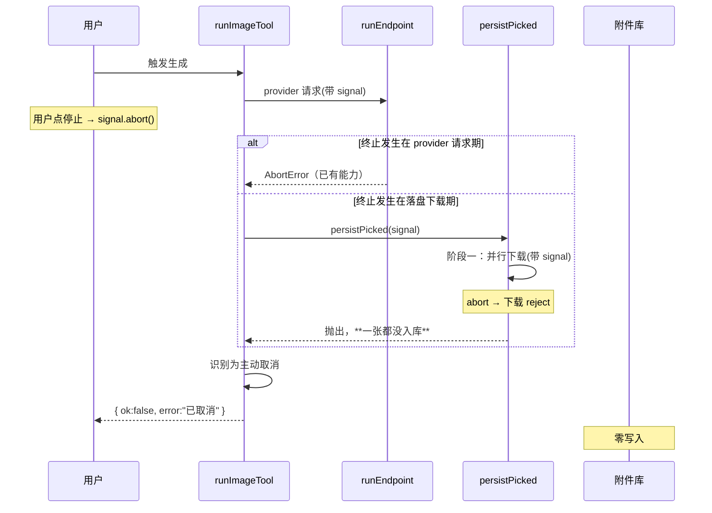

# Design Document — aigc-tool-abort

## Overview

补齐图像工具执行链路上**唯一停不掉的一段**（产出图落盘），并让终止在用户侧可感、在产物上不留半态。

本特性是**缺口补齐**而非新建能力：前端停止按钮、SDK abort 传播、`runEndpoint` 的 provider 请求/轮询/SSE 中断均已存在且经探针验证有效。真正要做的是三件事：把 `signal` 送进落盘下载、把落盘改成「下载与入库两阶段」以保证终止零入库、把终止结果与真实失败区分开。

### Goals

- 图像工具全程可终止，点击后 1 秒内结束等待，不依赖 30s 超时兜底
- 终止后零入库（含多图场景下已下载完成的那部分）
- 终止结果可被用户与代码识别为「主动取消」，区别于真实失败

### Non-Goals

- 新增前端停止按钮（已存在）
- 改动 pi SDK 的 abort 传播机制
- 取消 provider 侧已发生的计费（第三方不提供该能力）
- 非图像工具的终止行为

## Boundary Commitments

### This Spec Owns

- `persistPicked` 的可中断性与两阶段落盘语义
- `runImageTool` 对终止的识别与结果表达
- 终止时流式预览的停止

### Out of Boundary

- `engine/endpoint-adapter.ts` 的 abort 逻辑（已完备，不改）
- 前端 `pi-chat.tsx` / `pi-chat-basic.tsx` 的停止 UI（已存在，不改）
- `AttachmentToolContext.putOutput` 的实现与其是否支持删除

### Revalidation Triggers

- `PersistOptions` 契约变化 → 其它调用方（vision 工具等）
- 落盘由两阶段改回单阶段 → Req 3.2 的保证失效

## Architecture

### 现状分段与缺口

```
optimizePrompt ──✅可中断──┐
                          ├─→ runEndpoint ──✅可中断──→ picked
mediaFields 解析 ─────────┘   (fetch/轮询/SSE 均接 signal)
                                              │
                                              ▼
                                    persistPicked  ❌ 停不掉
                                    fetchImpl(url) ← 无 init，signal 进不去
                                    只能等 PERSIST_TIMEOUT_MS=30s
                                    （下载 + arrayBuffer 各一个窗口 → 最坏 60s）
```

### 关键决策

| # | 决策 | 理由 | 弃用的备选 |
|---|------|------|-----------|
| D1 | `PersistOptions` 增加 `signal?: AbortSignal`，`fetchImpl(url, { signal })` | 最小改动打通链路；`fetchImpl` 本就是 `typeof fetch`，第二参天然支持 | 「在 persistPicked 外层 race 一个 abort promise」——能提前返回但下载仍在后台跑，浪费带宽且违反「立即结束」的语义 |
| D2 | 落盘拆为**两阶段**：并行下载全部字节 → 统一入库 | 严格满足 Req 3.2（终止后零入库）。abort 发生在下载期 → 阶段一整体抛出，一张都没入库 | 「每张 putOutput 前检查 aborted」——并行下 A 已入库而 B 仍在下载的窗口无法覆盖，会留孤儿附件 |
| D3 | 保留既有 `withTimeout` 超时兜底 | Req 4.2：未传 signal 的调用方（如其它工具）仍受保护；signal 与超时是互补而非互斥 | 「有了 signal 就删掉超时」——会让无 signal 的调用方失去兜底 |
| D4 | 终止识别用 `signal.aborted` 优先、`AbortError` 名称兜底 | provider 的 fetch 抛的是 `AbortError`；但某些实现可能抛普通 Error，此时以 signal 状态为准更可靠 | 「只判 error.name === 'AbortError'」——依赖第三方实现细节，不稳 |
| D5 | 入库阶段（D2 的阶段二）**不再响应 abort** | 入库是本地操作、毫秒级；中途打断反而更容易产生半态。窗口极短，语义收益低于风险 | 「入库也可中断」——增加半态风险 |

### 内存影响评估

两阶段会让所有图片字节**同时驻留内存**（原先是逐张下载完即入库释放）。上界可控：单图受 `MAX_PAYLOAD_BYTES = 4MiB` 约束、`n` 上限 10 → 最坏约 40MB，属可接受范围。此判断写入注释，避免后人误以为是疏忽。

## File Structure Plan

### 修改文件

| 路径 | 改动 |
|------|------|
| `packages/tool-kit/src/attachment/persist.ts` | `PersistOptions` 加 `signal?`；下载传 `{ signal }`；落盘拆两阶段；下载后统一 `throwIfAborted` |
| `packages/tool-kit/src/aigc/run-image-tool.ts` | 把 `signal` 透传给 `persistPicked`；终止识别与结果表达；终止后不推流式预览 |

### 新建文件

| 路径 | 责任 |
|------|------|
| `packages/tool-kit/test/aigc/abort.test.ts` | 终止行为测试：分段可中断、零入库、结果可识别、不回归 |

## System Flows



## Requirements Traceability

| 需求 | 设计承接 |
|------|---------|
| 1.1 / 1.3 / 1.4 | 既有能力，本特性加测试钉死不回归 |
| 1.2 / 1.5 | D1：signal 进入落盘下载，abort 即刻 reject，不等 30s |
| 1.6 | D2 阶段一并行下载共享同一 signal，abort 时全部中止 |
| 2.1 / 2.2 | D4：识别终止后返回可区分的「已取消」描述 |
| 2.3 | 终止后不再调用 `onUpdate` / `emitLivePreview` |
| 2.4 | 落盘未完成即抛出 → 不报告成功 |
| 3.1 / 3.2 | D2 两阶段：下载期 abort → 零入库 |
| 3.3 | canvas `executeImageEdit` 见 `details.ok === false` → `fail("edit_failed")`，不新增资产（既有行为，加测试覆盖） |
| 4.1 | 未 abort 时两阶段的产物与顺序与既有一致 |
| 4.2 | D3：保留 `withTimeout` |
| 4.3 | 命名 `${namePrefix}-${i}.${ext}` 与 `PersistedAsset` 形态不变 |

## Testing Strategy

1. 落盘下载期 abort → `runImageTool` 在 1s 内结束（对照现状的 5s+ 未结束）— Req 1.2/1.5
2. 落盘下载期 abort → `ctx.putOutput` **零次调用** — Req 3.1
3. 多图：第 1 张已下完、第 2 张下载中 abort → `putOutput` 仍为零次 — Req 3.2
4. `signal` 确实出现在落盘下载的 `fetchImpl` init 中 — Req 1.2
5. 终止结果 `{ ok:false }` 且描述可识别为取消，与「凭据错误」等真实失败可区分 — Req 2.1/2.2
6. 终止后不再触发 `onUpdate` — Req 2.3
7. 未 abort 的正常路径：产物顺序、命名、`PersistedAsset` 形态与改动前一致 — Req 4.1/4.3
8. 未传 signal 时超时兜底仍生效 — Req 4.2
9. canvas 编辑被终止 → 画廊零新增资产 — Req 3.3
