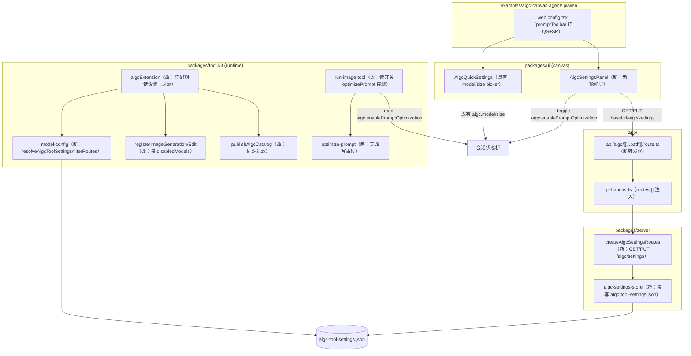
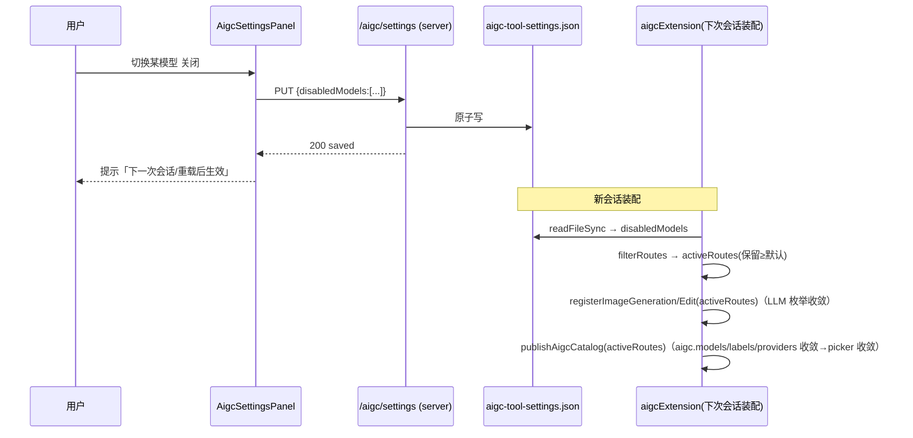

# Design Document

> **R2 修订(2026-07-04)—— 设置表面从 canvas 弹层改为 /settings config 域(取代下方 canvas 面板设计)**
>
> 用户反馈设置应在 **/settings 页面**。两项设置(关模型 + 提示词优化)统一为标准 **config 域 `aigc`**:
> - **Protocol**:`packages/protocol/src/config/domains/aigc.ts` = `aigcConfigSchema`(`disabledModels: string[]`
>   widget `aigcModelToggles` + `enablePromptOptimization: boolean`)+ `aigcFormSchema`;`index.ts` 加入
>   `ConfigDomainId`/`CONFIG_FORM_SCHEMAS`。
> - **Server**:`config-routes.ts` 的 `DOMAIN_SCHEMAS.aigc = aigcConfigSchema` → `/api/config/aigc` GET/PUT
>   自动落 `<agentDir>/aigc.json`。**模型目录端点** `GET /api/aigc/models`
>   (`packages/server/src/aigc-settings/aigc-models-routes.ts`,导入 tool-kit **主入口**纯
>   `AIGC_MODEL_CATALOG`,零 pi SDK 不进 bundle)供 widget 列举(/settings 无会话态)。
> - **UI**:自定义 widget `packages/ui/src/config/fields/aigc-model-toggles-field.tsx`(fetch `/api/aigc/models`
>   勾选清单 + provider 徽章,value = 被禁 id 数组);`lib/settings/register-panels.ts` 注册 `aigc` 面板 +
>   `aigcModelToggles` renderer。
> - **tool-kit**:`AIGC_MODEL_CATALOG`(纯,主入口导出,sync 测试防漂移);`resolveAigcToolSettings` 读
>   `aigc.json` 得 `{disabledModels, enablePromptOptimization}`;`aigcExtension` 装配期 filterRoutes(不变)
>   + `state.set("aigc.enablePromptOptimization", 持久值)` 使 run-image-tool 仍读会话状态(接缝不变)。
> - **两项均为持久配置、装配期读、下次会话生效**(提示词优化不再是 canvas 实时开关)。**移除**:canvas
>   `AigcSettingsPanel`、bespoke `aigc-settings-store`/`/aigc/settings`、web.config promptToolbar 改动、
>   ExtSlotRegion/pi-chat 的 baseUrl 透传。**复用**:filterRoutes/optimize-prompt/工具注册 disabledModels/
>   run-image-tool 接缝/provider 徽章元数据。
>
> 下方原始设计的「持久载体 REST + canvas 齿轮弹层」部分仅作历史参考,以本修订为准。

## Overview

**Purpose**：为 aigc-canvas-agent 提供「AIGC 图像工具设置」，让用户可（1）关闭某些图像模型、（2）实时开关工具的「提示词优化」。
**Users**：使用 aigc-canvas-agent 的用户在 canvas 内就地调整设置；维护者获得可测试的过滤与开关链路。
**Impact**：在既有 AIGC 图像工具 + webext slot + 会话状态桥 + 路由注入范式上做**双载体**集成——关模型走**装配期读取的持久 JSON 文件 + 专用 REST**（真正从 LLM 枚举与下发清单移除），提示词优化走 **会话状态 + localStorage** 的实时开关并预留读取接缝。

### Goals
- 被禁模型同时从 LLM 可见 `model` 枚举、下发清单（`aigc.models/labels/providers`）、前端 picker 移除。
- 关模型持久、装配期读取、可由 canvas UI 读写。
- 提示词优化实时开关，经会话状态桥双向同步 + 跨会话记忆；工具在派发前读开关并调 `optimizePrompt` 接缝。
- canvas 内一个可达的设置入口（齿轮弹层）。

### Non-Goals
- 真正的提示词改写算法 / 二次 LLM 调用（`optimizePrompt` 本期为无改写透传占位）。
- 声明式 config-ui schema 通道接入。
- 新增/修改 pi RPC 帧或协议 union；自动触发会话重载（关模型仅「告知 + 下次会话生效」）。

## Boundary Commitments

### This Spec Owns
- 持久配置 `<agentDir>/aigc-tool-settings.json`（形态 `{ disabledModels: string[] }`）及其读写权威。
- REST：`GET/PUT /aigc/settings`（`createAigcSettingsRoutes`）+ Next 转发器 `app/api/aigc/[[...path]]/route.ts`。
- 装配期模型过滤：`resolveAigcToolSettings()` + `registerImageGeneration/Edit` 接受 `disabledModels` 并按 activeRoutes 重建枚举/描述/路由集；`publishAigcCatalog` 同源过滤。
- 提示词优化：会话键 `aigc.enablePromptOptimization`、`run-image-tool` 读取接缝、`optimizePrompt` 无改写占位。
- canvas 设置面板 `AigcSettingsPanel`（齿轮弹层）：模型开关列表（REST 背书）+ 提示词优化开关（state + localStorage 背书）。

### Out of Boundary
- 真实 prompt 改写逻辑；config-ui 声明式 schema；协议/RPC 帧变更；自动会话重载；项目级（`<cwd>/.pi`）覆盖（本期仅全局 `<agentDir>`）。

### Allowed Dependencies
- 既有会话状态桥（`wireStateBridge` / `getSessionState` / `WebExtStateAccess`）——**不改其协议**。
- 既有图像路由（`IMAGE_GENERATION_ROUTES` / `IMAGE_EDIT_ROUTES`）+ `publishAigcCatalog` + `run-image-tool` 编排。
- 既有路由注入 seam（`pi-handler.ts` 的 `routes:[]`）+ favorites-store 原子写范式 + `SlotHost` 注入的 `state`/`baseUrl`。

### Revalidation Triggers
- `aigc-tool-settings.json` 的 `disabledModels` 形态变化。
- `aigc.models/labels/providers/enablePromptOptimization` 等会话键形态变化。
- `ImageRoute.model` 稳定标识语义变化（作为过滤键与配置键）。
- `registerImageGeneration/Edit` 签名变化（新增 opts 参数）。

## Architecture

### Existing Architecture Analysis
- **依赖方向**（沿用）：`protocol ← tool-kit(runtime) / server ← react ← ui ← app/examples`。本特性新增件各归其层，不逆向。
- **保留的既有模式**：路由注入 seam、favorites 单文件原子写、webext slot 的 props 注入、`publishAigcCatalog` 短退避重试、`AigcQuickSettings` 的 state 订阅 + localStorage seed 防竞态。

### Architecture Pattern & Boundary Map



- **选定模式**：双载体（持久文件 REST + 会话状态桥），各按数据本性归置。
- **新组件理由**：`model-config` 单点解析过滤集（注册与下发同源）；`optimize-prompt` 隔离占位接缝便于后续替换；`aigc-settings-store/routes` 复用 favorites 范式提供持久权威；`AigcSettingsPanel` 承载两组设置的就地 UI。

### Technology Stack

| Layer | Choice / Version | Role in Feature | Notes |
|-------|------------------|-----------------|-------|
| Frontend | React 19 + 既有 select/popover 原语 | `AigcSettingsPanel` 齿轮弹层 | 复用 `packages/ui/src/ui/*` |
| Backend | 既有 http router + node:fs | `/aigc/settings` + 原子写 | 复用 favorites-store 范式 |
| Data / Storage | 单 JSON 文件 `<agentDir>/aigc-tool-settings.json` | 持久 disabledModels | 原子写（tmp→rename）|
| Runtime | tool-kit runtime（含 pi SDK） | 装配期读文件 + 过滤 + 开关接缝 | `fs.readFileSync` try/catch fail-soft |

## File Structure Plan

### Directory Structure
```
packages/tool-kit/src/aigc/
├── model-config.ts          # 新：resolveAigcToolSettings(agentDir?) 读文件→{disabledModels:Set}；filterRoutes(routes,disabled,defaultModel) 保留≥默认
├── optimize-prompt.ts       # 新：optimizePrompt(prompt,opts?) 无改写透传占位
├── extension.ts             # 改：装配期读设置→过滤集喂注册函数 + publishAigcCatalog 过滤
├── tools/image-generation.ts# 改：registerImageGeneration(pi,opts?) 按 activeRoutes 建 params/描述/routes
├── tools/image-edit.ts      # 改：registerImageEdit(pi,opts?) 同款
├── run-image-tool.ts        # 改：读 aigc.enablePromptOptimization → resolveMediaFields 后、runEndpoint 前调 optimizePrompt
└── index.ts                 # 改：导出 optimizePrompt / resolveAigcToolSettings（如需）

packages/server/src/aigc-settings/
├── aigc-settings-store.ts   # 新：读写 <agentDir>/aigc-tool-settings.json（原子写、缺省 {disabledModels:[]}、校验）
├── aigc-settings-routes.ts  # 新：createAigcSettingsRoutes({agentDir}) → GET/PUT /aigc/settings
└── index.ts                 # 新：barrel

packages/ui/src/canvas/
├── aigc-settings-panel.tsx  # 新：齿轮弹层——模型开关列表(REST via baseUrl) + 提示词优化开关(state+localStorage)
└── index.ts                 # 改：导出 AigcSettingsPanel（若有 barrel）

app/api/aigc/
└── [[...path]]/route.ts     # 新：Next catch-all 转发器（否则 /api/aigc/* 静默 404）

examples/aigc-canvas-agent/.pi/web/
└── web.config.tsx           # 改：promptToolbar 由「仅 QS」改为「QS + AigcSettingsPanel」组合
```

### Modified Files
- `lib/app/pi-handler.ts` — 在 `routes:[]` 注入 `...createAigcSettingsRoutes({ agentDir: config.agentDir })`。
- `packages/server/src/index.ts` — 导出 `createAigcSettingsRoutes`（对齐既有 create*Routes 导出）。

> 依赖方向校验：`model-config`/`optimize-prompt`（tool-kit runtime）不 import server/ui；`aigc-settings-*`（server）不 import tool-kit runtime；`AigcSettingsPanel`（ui）只经 props 收 `state`/`baseUrl`，用 `fetch` 打 REST，不 import server。

## System Flows

### 关模型：写入 → 装配期生效



### 提示词优化：实时开关 → 工具读取

```mermaid
sequenceDiagram
  participant U as 用户
  participant SP as AigcSettingsPanel
  participant ST as 会话状态桥
  participant RUN as run-image-tool
  participant OPT as optimizePrompt
  U->>SP: 切换 提示词优化 开
  SP->>ST: state.set("aigc.enablePromptOptimization", true) + localStorage
  Note over RUN: 某次 image 工具执行
  RUN->>ST: prefState.get("aigc.enablePromptOptimization")
  alt 为真
    RUN->>OPT: optimizePrompt(merged.prompt)
    OPT-->>RUN: prompt（本期原样透传）
  else 为假/未设
    RUN->>RUN: 透传，不调用
  end
  RUN->>RUN: runEndpoint(route, merged)
```

## Requirements Traceability

| Requirement | Summary | Components | Interfaces | Flows |
|-------------|---------|------------|------------|-------|
| 1.1–1.6 | 关模型持久配置读写/键为 model id/缺省空/忽略无效 | aigc-settings-store, model-config | `AigcSettingsStore`, `resolveAigcToolSettings` | 关模型流 |
| 2.1 | 被禁模型不入 LLM 枚举 | registerImageGeneration/Edit, model-config | `register*(pi, {disabledModels})` | 关模型流 |
| 2.2 | 下发清单不含被禁模型 | extension.publishAigcCatalog | `publishAigcCatalog(activeRoutes)` | 关模型流 |
| 2.3 | 前端 picker 不列 | (清单收敛的自然结果) | `aigc.models/labels/providers` | 关模型流 |
| 2.4 | 未知/已移除 model 回退默认 | run-image-tool.selectRoute（既有） | `selectRoute` | — |
| 2.5 | 全禁则保留默认 | model-config.filterRoutes | `filterRoutes(...,defaultModel)` | 关模型流 |
| 2.6 | 未禁模型顺序/标签不变 | model-config.filterRoutes | 纯过滤不重排 | — |
| 3.1–3.3 | 装配期生效/不追溯/告知 | AigcSettingsPanel, aigcExtension | 保存后提示文案 | 关模型流 |
| 4.1–4.6 | 提示词优化键/写/读接缝/占位/默认关 | run-image-tool, optimize-prompt, AigcSettingsPanel | `optimizePrompt`, `aigc.enablePromptOptimization` | 优化流 |
| 5.1–5.5 | canvas 入口/两组设置/订阅回显/退化 | AigcSettingsPanel | props: `state`,`baseUrl` | 两流 |
| 6.1–6.4 | 跨会话记忆/seed/防竞态/隐私降级 | AigcSettingsPanel | localStorage + 延迟 seed | 优化流 |
| 7.1–7.5 | 单测/集成/组件/e2e/strict | 全组件 + e2e | Testing Strategy | — |

## Components and Interfaces

| Component | Layer | Intent | Req | Key Deps | Contracts |
|-----------|-------|--------|-----|----------|-----------|
| model-config | tool-kit | 读设置 + 纯过滤 | 1,2 | fs, ROUTES | Service/State |
| optimize-prompt | tool-kit | 无改写占位接缝 | 4 | — | Service |
| aigc-settings-store | server | 持久文件读写 | 1 | node:fs | State |
| aigc-settings-routes | server | REST GET/PUT | 1,3 | store | API |
| AigcSettingsPanel | ui | 齿轮弹层 UI | 3,5,6 | state,baseUrl | State/API |
| extension/register*/run-image-tool（改） | tool-kit | 装配过滤 + 开关读取 | 2,4 | 上述 | Service |

### tool-kit

#### model-config

| Field | Detail |
|-------|--------|
| Intent | 单点解析持久设置并提供纯过滤；注册与下发同源 |
| Requirements | 1.4, 1.5, 1.6, 2.1, 2.2, 2.5, 2.6 |

**Responsibilities & Constraints**
- `resolveAigcToolSettings` 在装配期 `fs.readFileSync(<agentDir>/aigc-tool-settings.json)`；解析失败/缺失/字段非法 → 返回空禁用集（fail-soft，Req 1.5）。
- `filterRoutes` 纯函数：剔除 `disabledModels` 命中项；若结果为空则保留默认模型对应 route（Req 2.5）；不重排、不改 label/provider（Req 2.6）；忽略未知 model id（Req 1.6，天然）。
- agentDir 解析：优先 `PI_CODING_AGENT_DIR` / `PI_WEB_AGENT_DIR`，缺省 `~/.pi/agent`（与既有一致）。

##### Service Interface
```typescript
export interface AigcToolSettings {
  readonly disabledModels: ReadonlySet<string>;
}
export function resolveAigcToolSettings(agentDir?: string): AigcToolSettings;
export function filterRoutes<R extends { model: string }>(
  routes: readonly R[],
  disabled: ReadonlySet<string>,
  defaultModel: string,
): readonly R[];
```
- Preconditions：无（任意缺省安全）。
- Postconditions：返回至少含默认模型的非空 routes（当输入非空）。
- Invariants：纯函数，无副作用（读文件仅在 `resolveAigcToolSettings`）。

#### optimize-prompt

##### Service Interface
```typescript
export interface OptimizePromptOptions { readonly signal?: AbortSignal; }
/** 本期：无改写透传占位（Req 4.4）。后续 spec 在此实现二次改写。 */
export function optimizePrompt(prompt: string, opts?: OptimizePromptOptions): Promise<string>;
```
- Postconditions（本期）：返回值 === 入参 prompt。

#### registerImageGeneration / registerImageEdit（改）

**Contracts**: Service ✔

##### Service Interface
```typescript
export interface RegisterImageToolOptions {
  /** 装配期被禁模型集合；缺省 = 空（全量）。 */
  readonly disabledModels?: ReadonlySet<string>;
}
export function registerImageGeneration(pi: ExtensionAPI, opts?: RegisterImageToolOptions): void;
export function registerImageEdit(pi: ExtensionAPI, opts?: RegisterImageToolOptions): void;
```
- **Implementation Note**：内部 `activeRoutes = filterRoutes(ROUTES, opts?.disabledModels ?? EMPTY, DEFAULT_MODEL)`；用 `activeRoutes` 现建 `parameters`（`model: optionalModelEnum(activeRoutes, DEFAULT_MODEL)`）、`description = buildModelsDescription(BASE, activeRoutes, DEFAULT_MODEL)`、并传 `routes: activeRoutes` 给 `runImageTool`。将模块级 `PARAMETERS` 拆为「非 model 字段常量 + 现建 model 字段」。

#### run-image-tool（改）

**Contracts**: Service ✔ / State ✔

**Implementation Note**
- 在 `resolveMediaFields` 之后、`runEndpoint` 之前：
  ```typescript
  const enableOpt = prefState.get<boolean>("aigc.enablePromptOptimization") === true;
  if (enableOpt && typeof merged.prompt === "string") {
    merged.prompt = await optimizePrompt(merged.prompt, { signal });
  }
  ```
- Req 4.5：flag 非真则完全不调 `optimizePrompt`，行为与现状一致。

### server

#### aigc-settings-store / aigc-settings-routes

**Contracts**: State ✔ / API ✔

##### State Management
- 文件 `<agentDir>/aigc-tool-settings.json`，形态 `{ "disabledModels": string[] }`；读缺省 `{ disabledModels: [] }`；写用 tmp→rename 原子替换（对齐 favorites-store）。
- 校验：`disabledModels` 必须为 string[]；非法 → 400。去重后落盘。

##### API Contract
| Method | Endpoint | Request | Response | Errors |
|--------|----------|---------|----------|--------|
| GET | /aigc/settings | — | `{ disabledModels: string[] }` | 500 |
| PUT | /aigc/settings | `{ disabledModels: string[] }` | `{ disabledModels: string[] }`（规范化后）| 400, 500 |

- **Implementation Note**：`createAigcSettingsRoutes({ agentDir })` 返回 route 数组，经 `pi-handler.ts` 注入；新增 `app/api/aigc/[[...path]]/route.ts` 转发（catch-all，否则静默 404）。zod 校验 DTO 就地定义于 server 模块（不改 protocol union）。

### ui

#### AigcSettingsPanel

| Field | Detail |
|-------|--------|
| Intent | canvas 齿轮弹层：模型开关列表 + 提示词优化开关 |
| Requirements | 3.3, 5.1, 5.2, 5.3, 5.4, 5.5, 6.1, 6.2, 6.3, 6.4 |

**Responsibilities & Constraints**
- Props：`{ state?: WebExtStateAccess; baseUrl?: string }`（由 `SlotHost` 注入）。`state === undefined` → 返回 null（Req 5.5，与 AigcQuickSettings 同款退化）。
- **模型开关区**：挂载时 `GET ${baseUrl}/aigc/settings` 取 `disabledModels`；列表基于会话已下发的 `aigc.models` + `aigc.modelLabels` + `aigc.modelProviders`（复用 AigcQuickSettings 同款订阅与字母徽章语义，Req 5.3）；切换 → `PUT` 全量 `disabledModels`；保存后显示「下一次会话/重载后生效」提示（Req 3.3）。REST 失败 → 就地错误提示、不崩（fail-soft）。
- **提示词优化区**：订阅 `aigc.enablePromptOptimization`（`useSyncExternalStore`）；切换 → `state.set(...)` + `lsSet`（Req 4.2/6.1）；挂载延迟 seed：会话值为空且 localStorage 有值则回填，延迟防竞态、已有会话真值不覆盖（Req 6.2/6.3）；localStorage 不可用静默降级（Req 6.4）；默认关（Req 4.6）。
- **入口**：齿轮按钮触发 popover（复用 `packages/ui/src/ui` 的 popover 原语）；带 `data-aigc-settings-*` 属性供 e2e 定位。

##### State Management
- 读：`aigc.models/modelLabels/modelProviders`（会话状态）、`aigc.enablePromptOptimization`（会话状态）、`disabledModels`（REST）。
- 写：`aigc.enablePromptOptimization`（state + localStorage）、`disabledModels`（REST PUT）。

**Implementation Note**
- 为可测，`load/save` 经可注入的 `AigcSettingsClient { load(): Promise<{disabledModels:string[]}>; save(v): Promise<...> }`，默认实现用 `fetch(${baseUrl}/aigc/settings)`；测试注入 fake。

## Error Handling

### Error Strategy
- **持久读（装配期）**：文件缺失/损坏/字段非法 → 视为无禁用（Req 1.5/1.6），装配继续；记 warn。
- **REST**：PUT 非法 body → 400；读写 IO 失败 → 500 + 前端就地提示，不崩会话（Req 5 退化）。
- **前端**：`state` 缺失 → 不渲染；localStorage 不可用 → 会话内仍可用（Req 6.4）；REST 失败 → toast/内联错误。
- **全禁边界**：`filterRoutes` 保证至少默认模型可用（Req 2.5），工具不会因空 routes 崩溃。

### Monitoring
- 装配期读失败 warn（复用 tool-kit logger 命名空间）；REST 端错误经既有 http 错误路径返回。

## Testing Strategy

### Unit Tests
- `model-config.filterRoutes`：禁用子集被剔除 / 未禁顺序与 label 不变（2.6）/ 全禁保留默认（2.5）/ 未知 id 忽略（1.6）。
- `resolveAigcToolSettings`：缺文件→空集、损坏 JSON→空集、合法→对应集（1.5/1.6）。
- `optimizePrompt`：返回值恒等于入参（4.4）。
- `run-image-tool`：flag=true 调用 optimizePrompt（可 spy 注入）、flag=false/未设不调用且 prompt 不变（4.3/4.5）。
- `aigc-settings-store`：读缺省、写原子、PUT 校验去重、非法 400（1.1–1.4）。

### Integration Tests
- `aigcExtension` 装配（真实 in-process，带 stub state seam）：给定 disabledModels，断言注册工具的 model 枚举、`aigc.models/labels/providers` 三者均不含被禁模型（2.1/2.2）。
- `createAigcSettingsRoutes` handler 集成：GET 缺省→`{disabledModels:[]}`；PUT→再 GET 回读一致（1.x）。⚠ 复用既有 tool-kit 子路径 exports alias 约定，避免 handler 集成测试全崩。

### Component Tests（ui）
- `AigcSettingsPanel`：state 缺失→null（5.5）；入口打开→展示两区（5.1/5.2）；模型列表来自 state 清单 + REST disabled 回显（5.3）；切模型→PUT 全量 + 生效提示（3.3）；切提示词优化→state.set + localStorage（4.2/6.1）；外部写回→订阅回显（5.4）；seed 防竞态（6.2/6.3）。

### E2E（PI_WEB_STUB_AGENT=1 隔离 build）
- 闭环：加载 aigc-canvas-agent → 打开设置弹层 → 关某模型（PUT 落文件）→ 新会话 → 断言该模型不在选择器/清单（2.2/2.3/3.1）。
- 提示词优化：切开关 → 断言会话状态键置真、刷新新会话经 localStorage 记忆回填（4/6）。
- 隔离 build：`NEXT_DIST_DIR=.next-e2e` + external server；断言 `data-aigc-settings-*` 锚点。
