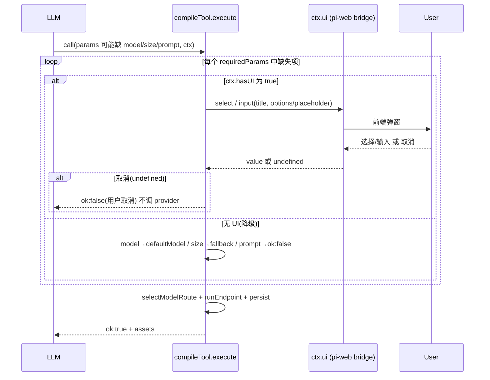

# Design Document

## Overview

**Purpose**: 为 `image_generation` 与 `image_edit` 引入「业务必选项 + 交互补全」:`model`/`size`/`prompt` 在 schema 不标 `required`(避免参数校验拦截),由执行层在缺失时经 pi SDK 的 `ctx.ui` 弹窗补全;非交互环境降级,用户取消则 `ok:false`。

**Users**: LLM agent(传参,可漏传)与终端用户(在 pi-web 前端响应补全弹窗)。

**Impact**: `compile-tool` 的 `execute` 接入既有但未使用的第 5 参 `ctx`(`ExtensionContext`);`ToolSpec` 增 `requiredParams` 声明;两工具的 `model`/`size`/`prompt` 改为业务必选 + 描述强化。既有 model 路由/落库/降级/externals 边界不变。

### Goals
- 缺失 `model`/`size`→`ctx.ui.select`、缺失 `prompt`→`ctx.ui.input` 补全(仅缺失才触发)。
- `hasUI=false` 降级:`model`→`defaultModel`、`size`→`fallback`、`prompt`→`ok:false`。
- 用户取消→`ok:false` 且不调 provider/不落库。
- `prompt` 维持用户原语言(description 强指示 + input 兜底)。

### Non-Goals
- 其余参数(`background`/`quality`/`moderation`/`mask`/`reference_images`/`response_format`)的交互。
- 执行前总览 `confirm`、每次强制交互。
- 新工具/新 model。

## Boundary Commitments

### This Spec Owns
- `InteractionSpec` 类型与 `ToolSpec.requiredParams` 契约。
- `compile-tool` 的必选项交互补全流程(触发/降级/取消语义)。
- 两工具 `model`/`size`/`prompt` 的必选声明与 `prompt` 语言指示。

### Out of Boundary
- pi SDK `ctx.ui` 的实现与 pi-web 交互渲染链(复用,不改)。
- 既有 model 路由、attachment 落库、`runEndpoint`、双入口边界(复用)。

### Allowed Dependencies
- `@earendil-works/pi-coding-agent` 的 `ExtensionContext`(仅 runtime 层 `compile-tool`)。
- pi-web 已实现的 ExtensionUIRequest 桥接与前端弹窗渲染。

### Revalidation Triggers
- `InteractionSpec`/`ToolSpec` 形状变化 → 工具声明与编译器需重查。
- `execute` ctx 参数契约变化(pi SDK 升级)→ 交互补全需重查。

## Architecture

### Existing Architecture Analysis
- `compile-tool.runExecute` 现序:取 `model` 选择器 → 合并 args → requiredVars/ctx.available 降级门 → `resolveMediaFields`(att_→dataURI)→ `runEndpoint` → `persistPicked`。`execute` 当前签名仅声明前 3 参。
- **接入点**:在「合并 args」之后、`selectModelRoute`/`runEndpoint` 之前,插入**必选项交互补全**;补全后 `model` 已确保有值,再走既有 model 路由。

### 交互补全时序



**依赖方向**(承袭):`types`(声明)→ `tools`(声明)→ `compile-tool`(runtime,引 pi SDK `ExtensionContext`)。主入口仅声明层;`compile-tool` 仅 `runtime` 子入口。

### Technology Stack

| Layer | Choice | Role |
|-------|--------|------|
| 声明层 | TS 纯类型 | `InteractionSpec` / `requiredParams`(前端安全) |
| 执行层 | `@earendil-works/pi-coding-agent` `ExtensionContext` | `ctx.ui.select/input` + `ctx.hasUI`(runtime only) |
| 交互渲染 | pi-web ExtensionUIRequest 桥接 + 前端 dialog | 弹窗 + 回传(复用) |

## File Structure Plan

### Modified Files
- `packages/tool-kit/src/engine/types.ts` — 新增 `InteractionSpec`;`ToolSpec` 增可选 `requiredParams`。
- `packages/tool-kit/src/engine/compile-tool.ts` — `execute` 声明并接入第 5 参 `ctx: ExtensionContext`;新增 `resolveRequiredParams(tool, merged, ctx)`,在合并 args 后、路由前调用;取消/无 UI 缺 prompt → `ok:false`。
- `packages/tool-kit/src/aigc/tools/image-generation.ts` — 加 `requiredParams`(model/size/prompt);description 与 `prompt` 字段强化语言指示。
- `packages/tool-kit/src/aigc/tools/image-edit.ts` — 同上(model/size/prompt)。
- 测试:`test/engine/compile-tool.test.ts`(交互补全 / 取消 / 无 UI 降级,mock `ctx.ui`);`test/aigc/tools/image-edit.test.ts`、`test/aigc/image-generation.integration.test.ts`(确认 `{}` ctx 下 size→fallback、model→default 不破坏)。
- e2e:`e2e/browser/aigc-generation.e2e.ts`(漏传必选项触发弹窗 → 应答 → 生成)。

## Components and Interfaces

| Component | Layer | Intent | Req | Contracts |
|-----------|-------|--------|-----|-----------|
| `InteractionSpec`/`requiredParams` | 声明 | 必选项交互声明 | 1,2,3,4 | State |
| `resolveRequiredParams` | runtime | 缺失补全/降级/取消 | 1,2,3,4,5,6,7 | Service |
| 两工具 `requiredParams` + 描述 | 声明 | 必选项 + 语言指示 | 2,3,4 | State |

### 类型契约(types.ts)

```typescript
export interface InteractionSpec {
  /** 目标参数名(image_generation/image_edit 的 model/size/prompt)。 */
  param: string;
  /** 交互方式:枚举选择 / 文本输入。 */
  via: "select" | "input";
  /** 弹窗标题(用户可见)。 */
  title: string;
  /** input 占位文本。 */
  placeholder?: string;
  /** select 选项;含哨兵 "$models" 时运行时展开为 tool.models 的 model 集合。 */
  options?: ReadonlyArray<string>;
  /** hasUI=false 时的兜底值;省略则该项无兜底(缺失→ok:false)。 */
  fallback?: string;
}
// ToolSpec 增:
//   requiredParams?: ReadonlyArray<InteractionSpec>;
```

### 补全函数契约(compile-tool.ts)

```typescript
type ResolveOutcome = { ok: true } | { ok: false; error: string };
async function resolveRequiredParams(
  tool: ToolSpec,
  merged: Record<string, unknown>,
  ctx: ExtensionContext | undefined,
): Promise<ResolveOutcome>;
```
- **Precondition**: `merged` 为合并后的 LLM 参数(去 model 选择器前的全集,含 model)。
- **Postcondition(ok:true)**: `tool.requiredParams` 每项在 `merged` 中均有非空值。
- **语义**:
  - 已有非空值 → 跳过(R7.2)。
  - `ctx?.hasUI === true && ctx.ui` → `via="select"`:options 含 `"$models"` 则用 `tool.models.map(m=>m.model)`,调 `ctx.ui.select(title, options)`;`via="input"`:调 `ctx.ui.input(title, placeholder)`;返回 `undefined`/空 → `{ok:false,"用户取消…"}`(R5)。
  - 否则(无 UI):`fallback` 优先;无 `fallback` 且 `param==="model"` → `tool.defaultModel`;否则 → `{ok:false,"缺少必选项 X 且无可交互 UI"}`(R6)。
- **Invariant**: 函数在 `runEndpoint`/`persistPicked` **之前**返回;`ok:false` 时调用方直接返回结构化结果,不触发 provider/落库(R5.2)。

### 两工具 requiredParams(声明数据)

| 工具 | param | via | options / placeholder | fallback |
|------|-------|-----|----------------------|----------|
| 共同 | `model` | select | `["$models"]` | —(降级用 defaultModel) |
| 共同 | `size` | select | `1024x1024`/`1536x1024`/`1024x1536`/`auto` | `auto` |
| 共同 | `prompt` | input | 占位"用你的语言描述想要的图像" | —(降级→ok:false) |

> `image_edit` 的 `image` 仍属必填输入,但其缺失语义沿用既有(att_/url),本规格不纳入交互补全。

## Error Handling

复用既有判别联合;新增两类前置结果(均在 provider 调用前):
- **用户取消**→ `{ok:false, error:"用户取消了必选项补全"}`(R5)。
- **无 UI 且缺无兜底项(prompt)**→ `{ok:false, error:"缺少必选项 prompt 且无可交互 UI"}`(R6.3)。
顶层 try/catch 与既有降级门不变。

## Testing Strategy

### Unit Tests(`compile-tool.test.ts`,mock `ctx.ui`)
- 缺 `model` + `hasUI=true` → 调 `select(options=models)`,以所选 model 路由(R2)。
- 缺 `size` + `hasUI=true` → 调 `select(预设)`,以所选 size 执行(R3)。
- 缺 `prompt` + `hasUI=true` → 调 `input`,以输入文本执行(R4)。
- `select`/`input` 返回 `undefined` → `ok:false` 且 provider/`putOutput` 未被调用(R5)。
- `hasUI=false`:缺 `model`→defaultModel、缺 `size`→fallback、缺 `prompt`→`ok:false`(R6)。
- 已传 `model`/`size`/`prompt` → `ctx.ui` 完全不被调用(R7)。

### Regression(集成/既有)
- `image-generation.integration` / `image-edit.test` / node e2e 以 `{}` 作 ctx:`size` 缺失走 `fallback`、`model` 走默认、`prompt` 均显式传 → 既有断言仍通过(R8.1/8.2)。

### E2E(浏览器)
- 发「只说生成一张图、不指定模型/尺寸」的 prompt → 工具触发 `select`(model)与/或 `input`/`select` → 自动应答弹窗 → 完成真实生成并渲染图片(R8.3)。

## Requirements Traceability

| Requirement | Components |
|-------------|------------|
| 1.1–1.3 必选不拦截 | types(不标 required)、resolveRequiredParams |
| 2.1–2.2 model 交互 | resolveRequiredParams(select+$models) |
| 3.1–3.2 size 交互 | resolveRequiredParams(select 预设) |
| 4.1–4.3 prompt 交互+语言 | resolveRequiredParams(input)、工具 description |
| 5.1–5.2 取消容错 | resolveRequiredParams(undefined→ok:false,前置于 provider) |
| 6.1–6.3 无 UI 降级 | resolveRequiredParams(fallback/defaultModel/ok:false) |
| 7.1–7.2 仅缺失触发 | resolveRequiredParams(非空跳过) |
| 8.1–8.3 回归+e2e | 既有流程不变、单测分支、浏览器 e2e |
