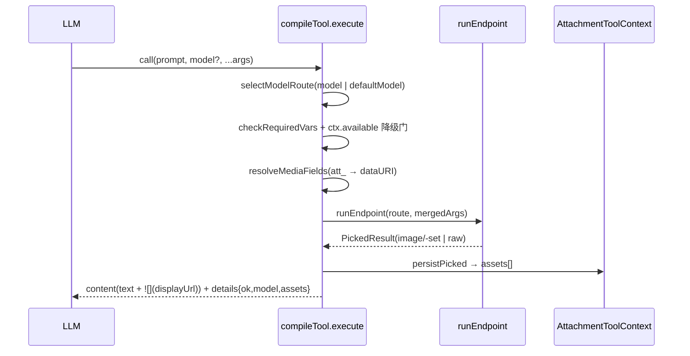

# Design Document

## Overview

**Purpose**: 将 `@blksails/tool-kit` 的 AIGC 工具从 `Category`+`variants[]` 双层抽象**拍平**为 `ToolSpec`+`models[]` 单层 model 路由,使 `model` 成为 LLM 可见的枚举入参并对齐 OpenAI Images API。

**Users**: LLM agent(选 model、传 OpenAI 风格参数)与集成开发者(装配工具、消费导出 API)。

**Impact**: 工具从 `text_to_image`/`image_edit` 改为 `image_generation`/`image_edit`(snake_case,对齐 OpenAI 端点);`size`/`n` 等参数从隐藏的 `userParams` 提升进可见 `inputSchema`;多 provider 能力(DashScope/NewAPI/OpenRouter)保留,改由以 `model` 为中心的路由表承载;执行引擎与 attachment 落库链不变。

### Goals
- `model` 作为枚举入参,运行时路由(命中/缺省/非法回退)。
- 两个工具的参数 schema 对齐 OpenAI Images API 并对集成者可观察。
- 拍平抽象、删除死字段、按新模型重命名符号与目录,且导出契约同步。
- 既有 externals 边界、降级语义、宿主集成链路、质量门(typecheck/单测/e2e)保持绿。

### Non-Goals
- `image_variation` 工具(仅 dall-e-2 支持 variations,而 dall-e-* 被排除)。
- 在工具中暴露 OpenRouter 的具体 model(工厂保留备用)。
- 新增计费、面板渲染、`runLocal` 本地执行等既有未启用能力。

## Boundary Commitments

### This Spec Owns
- `ToolSpec` / `ModelRoute` 公开类型契约;`compileTool` 编译语义与 `model` 路由规则。
- `image_generation` / `image_edit` 工具的名称、参数 schema、model 枚举、默认 model。
- DashScope/NewAPI/OpenRouter provider 工厂的返回类型迁移;编辑路径字段的 OpenAI 化。
- 工具集导出符号(`AIGC_TOOLS`、`buildAigcTools`、`compileTool`)与目录布局(`aigc/tools`)。
- 示例 agent 与 Web 扩展渲染器在新工具名下的同步。

### Out of Boundary
- attachment store 内部实现、分层存储策略、签名 URL 机制(复用,不改)。
- 执行引擎 `runEndpoint`/`AsyncSpec`/`var-resolver`/`proxy-fetch` 的行为(复用,不改)。
- pi tool result 消息流是否携带 `details` 的协议事实(不变)。

### Allowed Dependencies
- `@blksails/agent-kit`(`AttachmentToolContext` 类型);`@earendil-works/pi-coding-agent`(`defineTool`)、`@earendil-works/pi-ai`(`Type`)—— 仅 runtime 层。
- attachment seam(globalThis `AttachmentToolContext`)。

### Revalidation Triggers
- `ToolSpec`/`ModelRoute` 类型形状变化 → 依赖 tool-kit 类型的消费方需重查。
- 工具名或 renderer key 变化 → `webext-registry`、`web.config.tsx`、示例 agent 系统提示需重查。
- 主入口导出列表变化 → 前端 bundle externals 边界需重查。

## Architecture

### Existing Architecture Analysis
- **现状**:`Category`(LLM 工具) → `variants[]`(provider 变体,= `EndpointBehavior`+元数据);`buildParameters` 已注入可选 `model` 自由字符串,`selectVariant` 按其路由;`size`/`n` 藏 `userParams` 兜底。
- **保留**:执行引擎 `runEndpoint`(吃 `EndpointBehavior`)、attachment 落库链(`persistPicked`/`resolveInputToDataUri`)、降级语义、双入口 externals 边界。
- **拍平**:`Category→ToolSpec`、`variants→models`、`Variant→ModelRoute`、`defaultVariant→defaultModel`;`model` 收紧为 enum;参数提升进 `inputSchema`;删 `userParams`/`paramOverrides`/`ProviderOption`/`CategoryUi`。

### Dependency Direction(强制)

```
Types  →  Providers  →  Tools  →  Assembly
                                     │
                       (runtime)  Compiler → Engine/Attachment
```

- `engine/types.ts`(纯类型,无值导入)← 所有层引用。
- `aigc/providers/*`(纯函数工厂,返回 `ModelRoute`,无运行时库值导入)。
- `aigc/tools/*`(纯数据 `ToolSpec`,引用 providers 工厂)。
- `aigc/index.ts`:`AIGC_TOOLS`(纯数据,主入口安全)+ `buildAigcTools`(执行,runtime 入口)。
- `engine/compile-tool.ts`(runtime):引用 `types` + `endpoint-adapter` + `attachment/*` + pi SDK 值。
- **约束**:主入口 `src/index.ts` 仅导出声明层(types/providers/tools/`AIGC_TOOLS`);`compileTool`/`buildAigcTools` 仅从 `src/runtime.ts` 导出。各层只能向左依赖。

### Technology Stack

| Layer | Choice / Version | Role in Feature | Notes |
|-------|------------------|-----------------|-------|
| 声明层 | TypeScript(源直引) | 纯类型 + 数据声明 | 前端安全,主入口导出 |
| 执行层 | `@earendil-works/pi-coding-agent` `defineTool` / `pi-ai` `Type` | 编译为 pi ToolDefinition | 仅 runtime 子入口 |
| 存储接缝 | `@blksails/agent-kit` `AttachmentToolContext` | 产物落库 / 输入解析 | globalThis seam(复用) |

## File Structure Plan

### Directory Structure
```
packages/tool-kit/src/
├── engine/
│   ├── types.ts            # ToolSpec / ModelRoute / EndpointBehavior(声明层)
│   ├── compile-tool.ts     # compileTool:ToolSpec→ToolDefinition + model 路由(runtime)
│   ├── endpoint-adapter.ts # runEndpoint(复用,不改)
│   ├── var-resolver.ts     # checkRequiredVars(复用,不改)
│   └── proxy-fetch.ts      # 复用,不改
├── aigc/
│   ├── tools/
│   │   ├── image-generation.ts  # image_generation ToolSpec
│   │   └── image-edit.ts        # image_edit ToolSpec(OpenAI 化字段)
│   ├── providers/
│   │   ├── dashscope.ts    # 工厂返回 ModelRoute;编辑字段改名
│   │   ├── newapi.ts       # 工厂返回 ModelRoute;新 OpenAI 参数透传
│   │   └── openrouter.ts   # 工厂返回 ModelRoute;编辑字段改名(保留,不进 enum)
│   └── index.ts            # AIGC_TOOLS + buildAigcTools
├── index.ts                # 主入口:声明层导出(types + AIGC_TOOLS + 两 ToolSpec)
└── runtime.ts              # runtime 入口:compileTool + buildAigcTools + 引擎/attachment
```

### Modified Files
- `packages/tool-kit/src/engine/types.ts` — 删 `Category/Variant/CategoryUi/UserParamSpec/ParamOverride/ProviderOption`;增 `ToolSpec/ModelRoute`。(✅ 已完成)
- `packages/tool-kit/src/engine/compile-tool.ts` — `compileTool`;`model` enum 注入;`selectModelRoute`;`details.model`;删 userParams 链。(由 `compile-category.ts` git mv 而来)
- `packages/tool-kit/src/aigc/providers/{dashscope,newapi,openrouter}.ts` — 返回类型 `Variant→ModelRoute`;编辑字段 `instruction/image_url/mask_url/reference_image_urls → prompt/image/mask/reference_images`;newapi 透传 `n/size/background/quality/moderation/response_format`。
- `packages/tool-kit/src/aigc/tools/image-generation.ts` — 由 `text-to-image.ts` git mv;重写为 `image_generation` ToolSpec。
- `packages/tool-kit/src/aigc/tools/image-edit.ts` — 重写为 `image_edit` ToolSpec(OpenAI 化)。
- `packages/tool-kit/src/aigc/index.ts` — `AIGC_TOOLS`;`buildAigcTools` 用 `compileTool`;`include` 名。
- `packages/tool-kit/src/{index,runtime}.ts` — 导出随重命名同步。
- `examples/aigc-agent/index.ts` — 系统提示与装配用新工具名/字段。
- `examples/aigc-agent/.pi/web/web.config.tsx` — renderer keys → `image_generation`/`image_edit`;`details.variant→model`(当前 renderer 不读 variant,影响小)。
- `lib/app/webext-registry.ts` — 注释更新为新工具名。
- 测试:`test/engine/compile-tool*.test.ts`、`test/aigc/tools/image-edit.test.ts`、`test/aigc/image-generation.integration.test.ts`、`test/aigc/providers/{newapi,openrouter}.test.ts`、`test/aigc/image-edit-ownership.test.ts`、`test/aigc/agent-assembly.integration.test.ts` 对齐新符号/字段。
- e2e:`e2e/node/aigc-generation-tools.e2e.test.ts`、`e2e/browser/aigc-generation.e2e.ts` 对齐新工具名。

## System Flows

工具执行(同步/异步统一,model 路由后委托既有引擎):



非法 `model` → 回退 `defaultModel`(不中止);`requiredVars` 缺失 / `ctx.available===false` / provider 业务错误 / 空产物 → `{ok:false,error}`(不崩子进程)。

## Requirements Traceability

| Requirement | Summary | Components | Interfaces |
|-------------|---------|------------|------------|
| 1.1–1.5 | model 枚举入参 + 运行时路由 + 明细 | compile-tool | `buildParameters`/`selectModelRoute`/`ToolExecuteDetails.model` |
| 2.1–2.5 | image_generation 契约 | tools/image-generation, providers | `ToolSpec` |
| 3.1–3.5 | image_edit 契约 | tools/image-edit, providers | `ToolSpec`、`resolveMediaFields` |
| 4.1–4.4 | 多 provider 保留与迁移 | providers/* | `ModelRoute` 工厂 |
| 5.1–5.4 | 拍平/删字段/重命名/导出 | types, compile-tool, index, runtime | `ToolSpec`/`ModelRoute`/`compileTool`/`AIGC_TOOLS` |
| 6.1–6.4 | externals 边界 + 降级保持 | index, runtime, compile-tool | 双入口导出契约 |
| 7.1–7.3 | 宿主集成同步 | examples/aigc-agent, web.config, webext-registry | renderer keys |
| 8.1–8.3 | 质量门 + e2e | 测试 + e2e | — |

## Components and Interfaces

| Component | Layer | Intent | Req | Contracts |
|-----------|-------|--------|-----|-----------|
| types.ts | 声明 | ToolSpec/ModelRoute 类型契约 | 5.1 | State |
| compile-tool.ts | runtime | ToolSpec→ToolDefinition + 路由 | 1, 6 | Service |
| tools/* | 声明 | 两工具 ToolSpec 数据 | 2, 3 | State |
| providers/* | 声明 | ModelRoute 工厂 | 4 | Service |
| aigc/index.ts | 声明+runtime | AIGC_TOOLS + buildAigcTools | 5 | Service |

### 类型契约(types.ts)

```typescript
export type ModelRoute = EndpointBehavior & {
  model: string;        // LLM 可见 enum 取值 + 运行时路由键
  label: string;
  description?: string;
};
export interface ToolSpec {
  name: string;                          // snake_case tool name
  description: string;
  label?: string;                        // defineTool label(原 ui.label)
  inputSchema: EndpointInputSchema;      // 不含 model;编译器据 models 注入 enum
  models: ReadonlyArray<ModelRoute>;     // 非空
  defaultModel: string;                  // 必在 models 中
}
```

### 编译器契约(compile-tool.ts)

```typescript
export function compileTool(tool: ToolSpec, deps?: CompileDeps):
  ToolDefinition<TSchema, ToolExecuteDetails>;
export type ToolExecuteDetails =
  | { ok: true; model: string; assets: { attachmentId: string; displayUrl: string; mimeType: string; name: string }[] }
  | { ok: false; error: string };
```
- **Preconditions**: `tool.models` 非空;`defaultModel ∈ models`。
- **Postconditions**: 返回的 ToolDefinition 参数含 `model` 可选枚举;execute 永不抛(失败 → `{ok:false}`)。
- **Invariants**: `model` enum = `models.map(m=>m.model)`;路由 `args.model > defaultModel > 首项`。

### 工具 schema(声明数据)

| 工具 | 必填 | 可选 | models(默认) |
|------|------|------|---------------|
| `image_generation` | `prompt` | `model`,`n`,`size`,`negative_prompt`,`background`(enum),`moderation`(enum),`quality` | `wan2.6-t2i`,`qwen-image-pro`,**`gpt-image-2`** |
| `image_edit` | `image`(mediaKind:image),`prompt` | `mask`(image),`model`,`n`,`size`,`reference_images`(array image),`response_format`(enum) | **`qwen-image-edit-max`**,`gpt-image-2` |

### Provider 工厂契约

```typescript
// 统一返回 ModelRoute(原 Variant);model 既是路由键也是 LLM enum 取值
createDashscopeSyncT2I(a: { model; label; description; providerModel?: string }, extras?): ModelRoute;
createDashscopeAsyncT2I(...): ModelRoute;     // 保留异步轮询
createDashscopeImageEdit(...): ModelRoute;    // 读 prompt/image/mask/reference_images
createNewApiImage(...): ModelRoute;           // 透传 n/size/background/quality/moderation
createNewApiImageEdit(...): ModelRoute;       // 读 prompt/image/mask;透传 n/size/response_format
createOpenRouterImage(...): ModelRoute;       // 保留,本轮不进 enum
createOpenRouterImageEdit(...): ModelRoute;   // 保留,本轮不进 enum
```
- `providerModel` 区分「LLM 可见 model 值」与「实际发往网关的 model 名」(如 enum `gpt-image-2` 可与 provider model 同名,亦可不同)。
- **Implementation Note**:OpenAI 专属参数对非 OpenAI provider 的 buildBody 静默忽略;DashScope 编辑路径维持「主图+mask+参考 ≤ 3」校验。

## Error Handling

复用既有判别联合降级(Req 6.2–6.4),不新增策略:
- **配置缺失**(requiredVars/ctx)→ `{ok:false,error:"能力不可用:…"}`,工具仍加载。
- **provider 业务错误 / 空产物**→ `{ok:false,error}`;`runEndpoint` 的 `detectError`/submit-error 提前暴露。
- **非法 model**→ 回退默认(警告日志),不计入错误。
- 顶层 try/catch 保证 execute 不崩子进程。

## Testing Strategy

### Unit Tests
- `compile-tool`:`model` enum 注入 = models 集合;`selectModelRoute` 命中/缺省/非法回退(1.1–1.4);`details.model` 记录实际 model(1.5)。
- `compile-tool` 降级:requiredVars 缺失 / ctx 不可用 → `{ok:false}` 不抛(6.2–6.4)。
- `providers/newapi`:`image_generation` body 透传 `n/size/background/quality/moderation`;`image_edit` body 读 `prompt/image/mask` 并装配 multipart(2.2,3.2,3.4)。
- `providers/openrouter`:工厂返回 `ModelRoute`、编辑读新字段名(4.1)。
- `image-edit-ownership`:`att_` 递归扫描守卫在字段改名后仍覆盖 `image/mask/reference_images`(3.4)。

### Integration Tests
- `image-generation.integration`:`compileTool(imageGeneration)` 经 mock provider+ctx 走通落库,产物 content 含 ``(2.5)。
- `agent-assembly.integration`:`buildAigcTools()` 产出名为 `image_generation`/`image_edit` 的 ToolDefinition(2.1,3.1,7.1)。

### E2E Tests
- `e2e/node`:两工具在 runner 装配下加载,缺密钥时降级不崩(4.3,6.4)。
- `e2e/browser`:浏览器触发一次真实 `image_generation`(默认 `gpt-image-2`)→ 落库 → 工具卡片渲染图片;刷新后历史回放与即时展示一致(7.3,8.3)。

### 质量门
- `tsc` 类型检查无错误(8.1);受影响单测全绿(8.2);浏览器 e2e 通过(8.3)。
