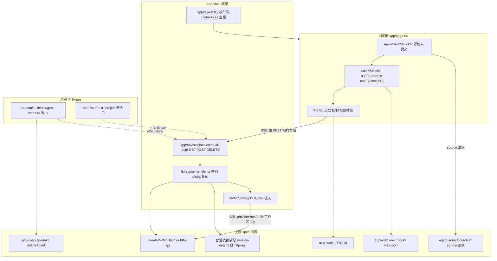
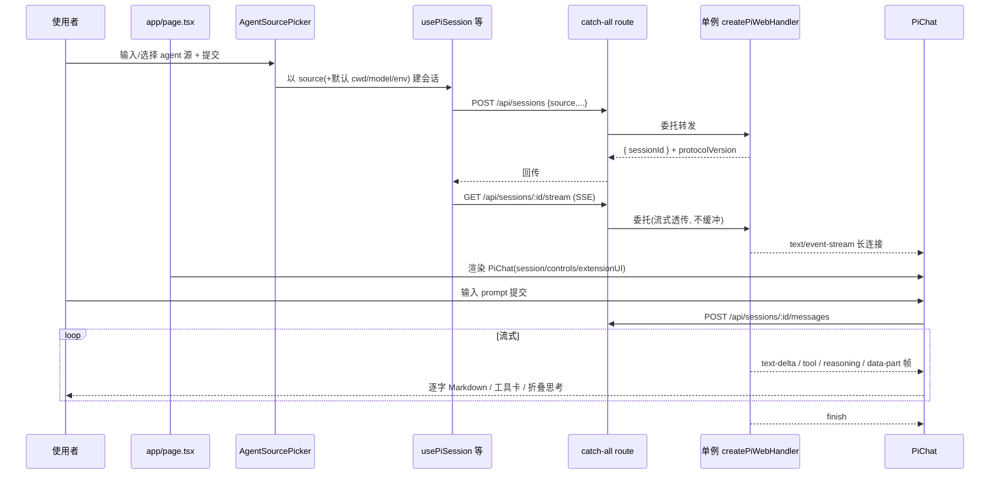
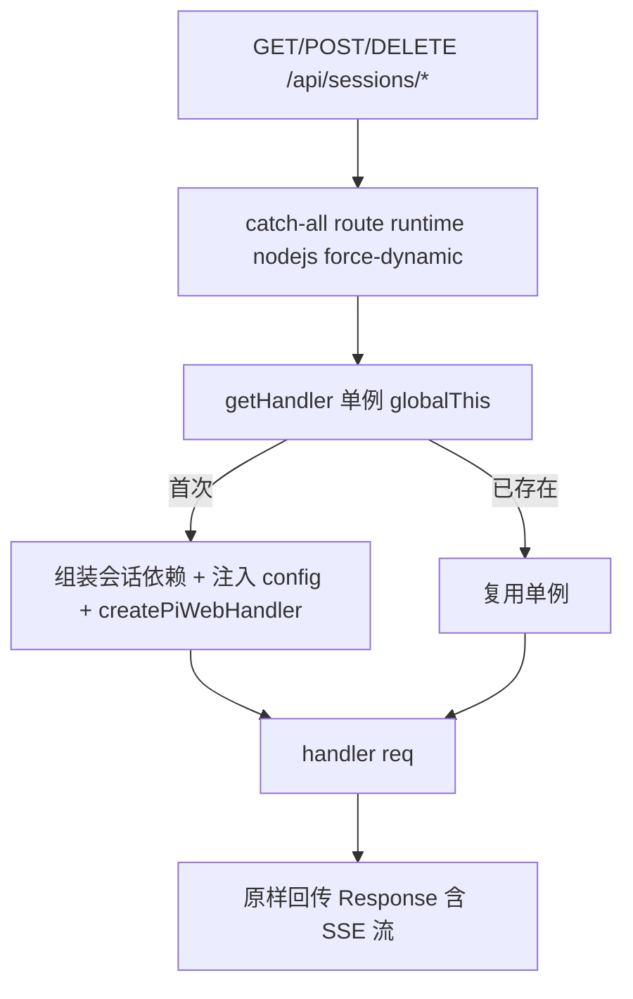
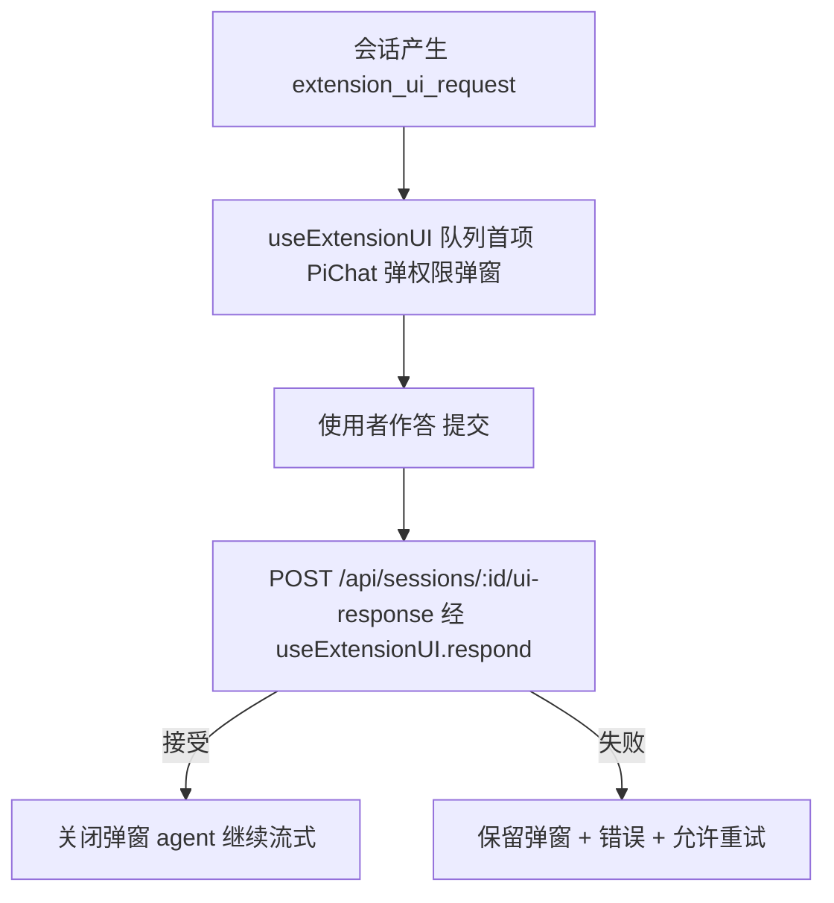

# Design Document — app-shell

## Overview

**Purpose**:本特性交付 pi-web 的**整站闭环装配**——一个可直接运行、可部署、可作分层参考实现的 Next.js 应用。它把已就绪的各层装配起来:把 `http-api` 的 `createPiWebHandler` 挂到 `app/api/sessions/**` 的 REST + SSE 路由;在 `app/page.tsx` 用 `@blksails/react` 的 hooks 建立指向本站 API 的连接并渲染 `@blksails/ui` 的 `<PiChat>`;提供 agent 源选择器(按 `agent-source-resolver` 的输入形状传源);从 `.env.local` 注入默认 provider/model/agent 源/工作区/密钥;附一个用 `defineAgent` 写的示例 agent 与 `.pi/` 资源样例供端到端验证。

**Users**:想直接部署 pi-web 整站、或想要一份装配参考实现的使用者;以及本项目自身——本 spec **承载全链路 e2e**(项目最高价值验收点)。

**Impact**:把 `PLAN.md` §2(架构)、§5(目录结构)、§6(M0/M2 里程碑)、§8(MVP 验收)收敛为「正确接线 + 配置注入 + 端到端验证」的一层。本 spec **消费而非重定义**上游(`createPiWebHandler`、`<PiChat>`、hooks/transport、源解析、协议),不实现引擎 / 组件 / 协议本体。

### Goals

- Next.js 应用骨架:`app/layout.tsx`、`app/page.tsx`(agent 源选择 + 聊天)、`app/globals.css`(shadcn tokens),可 `dev`/`build`/`start`。
- API 装配:`app/api/sessions/**` 经单例 `createPiWebHandler` 薄转发 REST + SSE,Node runtime,跨请求驻留。
- 后端依赖装配 + 配置注入:从 `.env.local` 读取并注入 provider/model/源/工作区/key;`.env.local.example` 为样例;密钥不外泄。
- 前端装配:`usePiSession`/`usePiControls`/`useExtensionUI` + `<PiChat>` 驱动流式聊天、控制面、权限弹窗。
- 示例 agent + `.pi/` fixture:`examples/hello-agent/index.ts`(`defineAgent`),确定 / 低成本,供两类 e2e 与权限弹窗闭环复用。
- 满足「测试 + e2e(硬性)」:API 路由集成测试(转发 + 页面渲染)、Playwright e2e(自定义 agent 全链路 + 通用 CLI 回退两条路径)。

### Non-Goals

- 不实现 `createPiWebHandler` / SSE 编码 / 会话驻留 / 事件→UIMessage 翻译 / 子进程 spawn / JSONL framing(归 `http-api`/`session-engine`/`rpc-channel`)。
- 不实现 `<PiChat>` / 细粒度组件 / 渲染器注册表 / 主题层源码(归 `ui-components`,仅消费 + 经宿主主题继承)。
- 不实现 `PiTransport` / hooks / `createPiClient` / SSE 解码(归 `react-client`,仅消费)。
- 不实现 agent 源解析 / git 缓存 / 入口探测 / 信任策略本体(归 `agent-source-resolver`,仅按其输入形状传源)。
- 不定义协议类型 / zod schema / `protocolVersion`(归 `protocol-contract`,经上游间接消费)。
- 不实现鉴权 / 多租户 / 密钥管理落地(默认放行装配)、不实现扩展安装 UI / 后端(归 `extension-management`)。
- 多 agent 管理 / 切换、embed(Web Component/iframe)、远程 host(docker/e2b/ssh/device)均为未来,明确排除。

## Boundary Commitments

### This Spec Owns

- Next.js 应用骨架文件:`app/layout.tsx`(根布局 + 全局样式引入 + 主题容器)、`app/page.tsx`(agent 源选择器 + 会话建立 + 渲染 `<PiChat>`)、`app/globals.css`(Tailwind 指令 + shadcn CSS 变量 tokens)。
- API 装配:`app/api/sessions/[[...path]]/route.ts`(catch-all,导出 `GET/POST/DELETE`,委托单例 handler;声明 Node runtime + `force-dynamic`)。
- handler 单例工厂:`lib/app/pi-handler.ts`——组装会话依赖(经 http-api/session-engine 暴露的工厂)+ 注入配置 + `createPiWebHandler`,挂 `globalThis` 跨请求 / 热重载驻留。
- 配置层:`lib/app/config.ts`(从 `process.env` 读取并校验 typed 配置 + 默认值 + 密钥不外泄约定)、`.env.local.example`(样例)。
- 前端装配局部:`app/page.tsx` 内 agent 源选择 → 建会话 → hooks 装配 → `<PiChat>`;`components/agent-source-picker.tsx`(源输入 + 提交 + 进行 / 错误态视图)。
- 示例 agent + fixture:`examples/hello-agent/index.ts`(`defineAgent`)、`examples/hello-agent/.pi/**`(资源样例)、`e2e/fixtures/cli-project/`(无入口目录,通用 CLI 回退用)。
- 测试:`app/api/sessions/__tests__/route.integration.test.ts`(路由转发 + 页面渲染)、`e2e/custom-agent.e2e.ts`(全链路)、`e2e/cli-fallback.e2e.ts`(回退路径)、`playwright.config.ts`、e2e 环境开关 / stub 接线。

### Out of Boundary

- 引擎 / handler / SSE 编码 / 翻译 / spawn / framing(`http-api`/`session-engine`/`rpc-channel`,仅消费)。
- `<PiChat>` 及组件 / hooks / transport / 协议源码(`ui-components`/`react-client`/`protocol-contract`,仅消费)。
- agent 源解析逻辑 / 信任策略本体(`agent-source-resolver`,仅传源、注入默认 `cwd`/`env`)。
- 鉴权 / 多租户 / 密钥管理落地、扩展安装管理(默认放行 / 归 `extension-management`)。
- 多 agent 管理 / 切换、embed、远程 host、生产沙箱 / 优雅停机硬化落地(未来;本 spec 仅以单例 + Node runtime 满足 MVP 运行)。

### Allowed Dependencies

- **上游 spec(运行时)**:`http-api` 的 `createPiWebHandler` 与会话依赖装配工厂;`@blksails/react` 的 `usePiSession`/`usePiControls`/`useExtensionUI`/`PiProvider`/`PiTransport`/`createPiClient`;`@blksails/ui` 的 `<PiChat>` 及导出;`@blksails/agent-kit` 的 `defineAgent`(示例 agent 用);经上游间接的 `@blksails/protocol` 类型。
- **外部运行时**:Next.js 15(App Router,Node runtime)、React 18+、AI SDK v5 + AI Elements + shadcn/Tailwind v4(经 `@blksails/ui` 装配)。
- **运行时前提**:Node `>=22.19.0`、长驻服务(非 Edge/Serverless);可用 provider API key(e2e 可低成本 / stub)。
- **依赖方向**:`http-api`/`react-client`/`ui-components`/`agent-source-resolver`/`protocol-contract`/`agent-kit` ← `app-shell`(最外围,无下游)。禁止反向。
- **开发 / 测试**:`vitest`(API 路由集成 + 页面渲染)、`@playwright/test`(e2e);e2e 经环境开关用 stub / 低成本模型。

### Revalidation Triggers

- `createPiWebHandler(opts)` 的注入面(会话依赖、鉴权接缝、SSE 调参)或返回签名变更。
- `<PiChat>` props 契约或 `usePiSession`/`usePiControls`/`useExtensionUI` 签名 / re-export 类型变更。
- `agent-source-resolver` 接受的 `source` 输入形状或双模式判定约定变更。
- REST/SSE 端点路径集合或 `protocolVersion` 承载约定变更(影响 catch-all 委托与前端连接 URL)。
- `.env` 配置项命名(provider key / 默认 provider/model/源/工作区)或注入语义变更。
- 运行时前提从「Node-only + 长驻」放宽 / 收紧(影响单例驻留与部署假设)。

## Architecture

### Architecture Pattern & Boundary Map

模式:**薄装配 Shell + catch-all 委托 + 单例驻留 + 配置注入**。后端侧 `app/api/sessions/[[...path]]/route.ts` 把所有会话子路径的 `GET/POST/DELETE` 委托给挂在 `globalThis` 上的单例 `createPiWebHandler`(组装一次会话依赖 + 注入配置);handler 内部已做方法 + 路径路由与 SSE 编码,本 shell 只做无损转发。前端侧 `app/page.tsx` 先经 `<AgentSourcePicker>` 取源 → 用 hooks 建会话(指向本站 `/api/sessions`)→ 渲染 `<PiChat>`,流式 / 控制 / 权限弹窗全部由组件 + hooks 完成。配置经 `lib/app/config.ts` 单点读取注入。示例 agent + `.pi/` fixture 供 e2e 驱动确定闭环。



**Architecture Integration**:

- **Selected pattern**:薄装配 + catch-all 委托。理由:Req 2.1/2.3/2.5 要求薄转发、不改写契约、跨请求驻留;handler 内部已自带路由与 SSE 编码,逐端点 route 文件会重复其职责并引入漂移风险。catch-all 段最薄、最不易漂移(详见 `research.md` 决策)。
- **Domain/feature boundaries**:`app/`(UI 骨架 + 路由装配)、`lib/app/`(handler 单例 + 配置)、`components/`(源选择器视图)、`examples/` + `e2e/fixtures/`(示例与 fixture)、`e2e/`(端到端)五块职责分离;均不实现上游能力本体。
- **Dependency direction**:`http-api + react + ui + agent-source-resolver + protocol + agent-kit ← app-shell`(最外围)。前端经 hooks 消费、后端经 handler 工厂消费,不反向、不内联上游实现。
- **New components rationale**:`pi-handler.ts`(单例驻留 + 注入单点)、`config.ts`(配置单点 + 密钥不外泄)、catch-all `route.ts`(单点路由委托)、`AgentSourcePicker`(唯一新增视图)、示例 agent + fixture(e2e 驱动)——各单一职责且非上游已有能力。
- **Steering compliance**:TypeScript strict、禁 `any`;Next.js 15 App Router + Route Handler `runtime = "nodejs"`(tech.md);长驻 Node、非 Edge(tech.md / PLAN §11.1);单例挂 `globalThis` 防热重载丢失(PLAN §3.2);消费上游不重定义(structure.md「spec 边界 = 层边界」);主题走 shadcn CSS 变量(structure.md)。

### Technology Stack

| Layer | Choice / Version | Role in Feature | Notes |
|-------|------------------|-----------------|-------|
| Frontend / CLI | TypeScript strict;Next.js 15(App Router/RSC);React 18+ | 应用骨架、页面、源选择器视图;经 `@blksails/ui` 渲染 `<PiChat>` | 浏览器 + RSC;主题经 shadcn CSS 变量 |
| Backend / Services | Next.js Route Handler(Node runtime);`createPiWebHandler`(http-api,消费) | catch-all 委托 + 单例驻留 + 配置注入 | 薄转发,不实现 handler 本体 |
| Data / Storage | 无(会话状态在 handler 背后的 session-engine / 通道);仅 `globalThis` 单例引用 + 进程内配置 | — | §14.1③:状态不在 shell |
| Messaging / Events | SSE(经 handler 的 `text/event-stream`);前端经 `@blksails/react` transport 消费 | 流式聊天主链路 | shell 不编码 / 不解码 SSE |
| Infrastructure / Runtime | Node `>=22.19.0`;长驻 `next start`(非 Edge);`.env.local`(配置注入);`vitest`(集成 + 页面渲染)、`@playwright/test`(e2e);e2e stub / 低成本模型 | 运行、配置、测试 | 反代关闭缓冲(部署提示,handler 设 `X-Accel-Buffering: no`) |

## File Structure Plan

### Directory Structure

```
pi-web/
├── app/
│   ├── layout.tsx                       # 根布局:html/body、引入 globals.css、主题容器(shadcn);渲染 children
│   ├── page.tsx                         # 主页面:AgentSourcePicker → usePiSession/usePiControls/useExtensionUI 建会话 → <PiChat>;进行/错误态切换
│   ├── globals.css                      # Tailwind 指令 + shadcn CSS 变量 tokens(主题层,无硬编码颜色)
│   └── api/
│       └── sessions/
│           └── [[...path]]/
│               └── route.ts             # catch-all:export const runtime="nodejs"; dynamic="force-dynamic"; GET/POST/DELETE = (req)=>getHandler()(req) 无损转发(含 /stream SSE)
├── lib/
│   └── app/
│       ├── pi-handler.ts                # getHandler():组装会话依赖 + 注入 config + createPiWebHandler;挂 globalThis 单例(跨请求/热重载驻留)
│       └── config.ts                    # loadConfig():从 process.env 读取并校验 typed 配置(provider key/默认 provider/model/源/工作区);缺 key 可辨识错误;密钥不外泄
├── components/
│   └── agent-source-picker.tsx          # 源输入(目录/git 文本 + 默认源选项)+ 提交回调 + 进行/错误态视图
├── examples/
│   └── hello-agent/
│       ├── index.ts                     # defineAgent 示例:model(低成本/可 stub)+ 一个工具 + 思考/Markdown 文本输出路径
│       └── .pi/
│           └── extensions/
│               └── confirm-demo.ts      # .pi 资源样例:触发扩展 UI(confirm/select)以驱动权限弹窗闭环
├── e2e/
│   ├── fixtures/
│   │   └── cli-project/                 # 无入口目录 fixture(通用 CLI 回退用;放一个普通文件即可)
│   │       └── README.md
│   ├── custom-agent.e2e.ts              # ★ 全链路:选 hello-agent 源→prompt→逐字流式 Markdown;工具卡;思考折叠;abort/切模型/stats;权限弹窗→选择→继续
│   └── cli-fallback.e2e.ts              # ★ 通用 CLI:选 cli-project 源→prompt→逐字流式回复(回退路径)
├── app/api/sessions/__tests__/
│   └── route.integration.test.ts        # 集成:catch-all route 把请求转发到 handler 并回传(含 SSE 流端点);page 渲染冒烟
├── playwright.config.ts                 # Playwright 配置:webServer 启动应用(e2e stub/低成本环境开关)、baseURL、单一命令运行
├── .env.local.example                   # ANTHROPIC_API_KEY 等 provider key、默认 provider/model、默认 agent 源/工作区、e2e stub 开关
├── next.config.ts                       # Next 配置(transpilePackages 上游 @pi-web 包、Node runtime 相关)
├── package.json                         # 依赖上游 @pi-web/* + ai/@ai-sdk/react + jiti;scripts: dev/build/start/test/test:e2e
├── tsconfig.json                        # strict;paths(@/ → 根);jsx;Node + DOM lib
└── vitest.config.ts                     # 集成/渲染测试环境(node + jsdom 分项)
```

### Modified Files

- 无(greenfield 整站)。若 monorepo workspace 已存在,需把本 app 纳入 workspace 并接入上游 `@pi-web/*` 包——接线随仓库初始化处理,本 spec 创建上述 app 自身文件、配置、示例与测试。

> 每文件单一职责。所有「功能能力」(handler、组件、hooks、源解析)均经 import 上游消费;本 spec 文件仅做装配(`pi-handler`/`route`)、配置(`config`/`.env.local.example`)、视图装配(`page`/`agent-source-picker`)、示例与测试。File Structure 与 Boundary 一致:无任何上游能力本体的源码文件。

## System Flows

### 选源 → 建会话 → prompt → 逐字流式(MVP 主链路)



进行 / 错误态:建会话进行中 `<AgentSourcePicker>` 显示 loading;失败显示可辨识错误并允许重选(Req 4.4/4.5)。控制(abort/切模型/stats)与权限弹窗经 `usePiControls`/`useExtensionUI` 旁路,不入消息流(Req 6.4)。

### API 装配薄转发



### 权限弹窗闭环



## Requirements Traceability

| Requirement | Summary | Components | Interfaces | Flows |
|-------------|---------|------------|------------|-------|
| 1.1 | 根布局引入样式 + 渲染主页面 | app/layout.tsx | `RootLayout` | — |
| 1.2 | 全局样式 shadcn tokens | app/globals.css | CSS 变量 | — |
| 1.3 | 访问根路径渲染源选择 + 聊天区 | app/page.tsx, agent-source-picker.tsx | `HomePage` | 主链路 |
| 1.4 | 长驻 Node、非 Edge | route.ts, pi-handler.ts | `runtime="nodejs"` | 薄转发 |
| 1.5 | 未建会话展示选源入口 | app/page.tsx, agent-source-picker.tsx | 视图态 | 主链路 |
| 2.1 | catch-all 装配单例 handler 并转发 | route.ts, pi-handler.ts | `getHandler` | 薄转发 |
| 2.2 | 会话 API 声明 Node runtime | route.ts | `runtime` 导出 | 薄转发 |
| 2.3 | 无损转发不改写契约 | route.ts | `(req)=>handler(req)` | 薄转发 |
| 2.4 | stream 端点流式不缓冲 | route.ts, pi-handler.ts | `dynamic="force-dynamic"` | 主链路 |
| 2.5 | handler 单例跨请求驻留 | pi-handler.ts | `globalThis` 单例 | 薄转发 |
| 3.1 | 进程内装配会话依赖单例 | pi-handler.ts | `getHandler` | 薄转发 |
| 3.2 | 配置样例文件 | .env.local.example | env keys | — |
| 3.3 | 启动读取并注入配置 | config.ts, pi-handler.ts | `loadConfig` | 薄转发 |
| 3.4 | 缺 key 可辨识错误 | config.ts | 校验错误 | — |
| 3.5 | 密钥不外泄 | config.ts, pi-handler.ts | 不回显约定 | — |
| 4.1 | 源输入接受 resolver 形状 | agent-source-picker.tsx | `source` 输入 | 主链路 |
| 4.2 | 提交源建会话取标识 | app/page.tsx, agent-source-picker.tsx | `usePiSession` | 主链路 |
| 4.3 | 默认源建会话 | app/page.tsx, config.ts | 默认值注入 | 主链路 |
| 4.4 | 建会话进行中指示 | agent-source-picker.tsx | 视图态 | 主链路 |
| 4.5 | 建会话失败可辨识 + 重选 | agent-source-picker.tsx, app/page.tsx | 错误态 | 主链路 |
| 5.1 | 建会话后渲染 PiChat | app/page.tsx | `<PiChat>` | 主链路 |
| 5.2 | 提交 prompt 追加用户消息 | app/page.tsx(PiChat) | `usePiSession` | 主链路 |
| 5.3 | 逐字流式 Markdown | PiChat(消费) | useChat 流 | 主链路 |
| 5.4 | 工具卡三态 | PiChat(消费) | PartRenderer | 主链路 |
| 5.5 | 思考折叠块 | PiChat(消费) | PiReasoning | 主链路 |
| 5.6 | 一轮结束保留对话 | PiChat(消费) | finish | 主链路 |
| 6.1 | 中止入口 + 收束 | app/page.tsx, PiChat | `usePiControls.abort` | 主链路 |
| 6.2 | 切模型 + 反映态 | app/page.tsx, PiChat | `usePiControls.setModel` | 主链路 |
| 6.3 | 展示 + 刷新 stats | app/page.tsx, PiChat | `usePiControls.stats` | 主链路 |
| 6.4 | 控制旁路不入消息流 | app/page.tsx | hooks 旁路 | 主链路 |
| 7.1 | 弹权限弹窗 | app/page.tsx, PiChat | `useExtensionUI` | 权限闭环 |
| 7.2 | 回传匹配响应 | PiChat(消费) | `respond` | 权限闭环 |
| 7.3 | 接受后关闭 + 继续 | PiChat(消费) | 出队 | 权限闭环 |
| 7.4 | 回传失败保留重试 | PiChat(消费) | error 态 | 权限闭环 |
| 8.1 | 示例 agent defineAgent | examples/hello-agent/index.ts | `defineAgent` | — |
| 8.2 | 示例含工具 + 思考 / MD | examples/hello-agent/index.ts | 工具 / 输出 | 主链路 |
| 8.3 | .pi 资源样例触发扩展 UI | examples/hello-agent/.pi/** | 扩展 UI | 权限闭环 |
| 8.4 | 示例 e2e 低成本 / stub | examples/hello-agent/index.ts, config.ts | e2e 开关 | — |
| 9.1 | 无入口目录走 CLI 模式 | e2e/fixtures/cli-project, route.ts | resolver 回退 | 薄转发 |
| 9.2 | CLI 模式同样逐字流式 | PiChat, route.ts | 流式 | 主链路 |
| 9.3 | 两模式复用同前端 / API | app/page.tsx, route.ts | 复用装配 | — |
| 10.1 | 路由转发集成 + 页面渲染测试 | route.integration.test.ts | vitest | 薄转发 |
| 10.2 | e2e 自定义 agent 全链路流式 | custom-agent.e2e.ts | Playwright | 主链路 |
| 10.3 | e2e 工具卡 + 思考折叠 | custom-agent.e2e.ts | Playwright | 主链路 |
| 10.4 | e2e abort / 切模型 / stats | custom-agent.e2e.ts | Playwright | 主链路 |
| 10.5 | e2e 权限弹窗闭环 | custom-agent.e2e.ts | Playwright | 权限闭环 |
| 10.6 | e2e 通用 CLI 回退流式 | cli-fallback.e2e.ts | Playwright | 主链路 |
| 10.7 | e2e 低成本 / stub | playwright.config.ts, config.ts, examples | webServer 开关 | — |
| 10.8 | 单一命令运行集成 / e2e | package.json, playwright.config.ts, vitest.config.ts | scripts | — |

## Components and Interfaces

| Component | Layer | Intent | Req Coverage | Key Dependencies (P0/P1) | Contracts |
|-----------|-------|--------|--------------|--------------------------|-----------|
| app/layout.tsx | app | 根布局 + 全局样式 + 主题容器 | 1.1, 1.2 | globals.css (P0) | State |
| app/page.tsx | app | 选源 → 建会话 → 渲染 PiChat + 控制 + 弹窗 | 1.3,1.5,4.2,4.3,4.5,5.1,5.2,6.x,7.1 | @blksails/react (P0), @blksails/ui (P0), agent-source-picker (P0) | Service, State |
| app/globals.css | app | shadcn CSS 变量主题 tokens | 1.2 | shadcn token (P0) | — |
| app/api/sessions/[[...path]]/route.ts | api | catch-all 委托单例 handler 转发 | 1.4,2.1-2.4,9.1,9.3 | pi-handler (P0) | API |
| lib/app/pi-handler.ts | lib | 组装会话依赖 + 注入 config + handler 单例 | 2.1,2.5,3.1,3.3,3.5 | createPiWebHandler (P0), config (P0), session-engine 装配 (P0) | Service |
| lib/app/config.ts | lib | env → typed 配置 + 默认值 + 密钥不外泄 | 3.2-3.5,4.3,8.4,10.7 | process.env (P0) | Service |
| components/agent-source-picker.tsx | components | 源输入 + 提交 + 进行 / 错误态 | 1.5,4.1,4.4,4.5 | @blksails/react (P1) | Service, State |
| examples/hello-agent/index.ts | examples | defineAgent 示例(工具 + 思考 / MD,e2e fixture) | 8.1,8.2,8.4 | @blksails/agent-kit (P0) | Service |
| examples/hello-agent/.pi/** | examples | .pi 资源样例触发扩展 UI | 8.3 | pi 资源约定 (P0) | — |
| e2e/fixtures/cli-project/ | fixtures | 无入口目录(CLI 回退 fixture) | 9.1 | — | — |
| route.integration.test.ts | test | 路由转发 + 页面渲染集成 | 10.1 | vitest (P0), pi-handler mock (P0) | — |
| custom-agent.e2e.ts | test | 全链路 e2e | 10.2-10.5 | @playwright/test (P0), examples (P0) | — |
| cli-fallback.e2e.ts | test | CLI 回退 e2e | 10.6 | @playwright/test (P0), cli-project (P0) | — |
| playwright.config.ts | test | webServer 启动 + stub 开关 + 单命令 | 10.7,10.8 | @playwright/test (P0) | — |

### api 层

#### catch-all Route Handler(app/api/sessions/[[...path]]/route.ts)

| Field | Detail |
|-------|--------|
| Intent | 把所有 `/api/sessions/**` 的 `GET/POST/DELETE` 无损委托给单例 `createPiWebHandler` |
| Requirements | 1.4, 2.1, 2.2, 2.3, 2.4, 9.1, 9.3 |

**Responsibilities & Constraints**
- 导出 `export const runtime = "nodejs"` 与 `export const dynamic = "force-dynamic"`(Node 驻留 + 不静态化 / 不缓存,Req 2.2/2.4)。
- 导出 `GET`/`POST`/`DELETE`,各为 `(req: Request) => getHandler()(req)`,原样回传 handler 的 `Response`(含 SSE `ReadableStream` body),不读取 / 不缓冲整段、不改写状态码 / 头 / 体(Req 2.3/2.4)。
- 不实现路由匹配 / 校验 / SSE 编码——handler 内部已做;本文件仅委托(Req 2.1)。

**Dependencies**
- Inbound: 浏览器 / 第三方客户端 — HTTP (P0)
- Outbound: `getHandler()`(`pi-handler.ts`)(P0)

**Contracts**: API [x]

##### API Contract（端点经单例 handler 提供，本文件只委托）
| Method | Endpoint | 处理 | 说明 |
|--------|----------|------|------|
| POST | /api/sessions(及 :id 子命令) | 委托 handler | 建会话 / 命令转发 |
| GET | /api/sessions/:id/{state,stats,messages,commands,stream} | 委托 handler | 查询 / SSE 流 |
| DELETE | /api/sessions/:id | 委托 handler | 删除会话 |

**Implementation Notes**
- Integration:Next App Router 把段 `[[...path]]` 的请求交给本文件;`req` 为标准 Web `Request`,直接喂 handler。
- Validation:`route.integration.test.ts` 经 `fetch` 打入 route,断言转发与回传(含 stream 端点返回 `text/event-stream`)。
- Risks:Next 对流式 `Response` 的透传差异 → 仅用标准 `Response`/`ReadableStream`,`force-dynamic` 防缓存。

#### getHandler 单例(lib/app/pi-handler.ts)

| Field | Detail |
|-------|--------|
| Intent | 组装会话依赖 + 注入配置,构造一次 `createPiWebHandler`,挂 `globalThis` 跨请求 / 热重载复用 |
| Requirements | 2.1, 2.5, 3.1, 3.3, 3.5 |

**Responsibilities & Constraints**
- 首次调用组装上游会话依赖(经 http-api / session-engine 暴露的装配工厂)+ 经 `loadConfig()` 注入默认 provider/model/agent 源 / 工作区 / env(provider key 透传给会话装配,Req 3.1/3.3),构造 `createPiWebHandler(opts)`;后续调用复用(Req 2.5)。
- 单例挂 `globalThis`(具名键)避免 Next dev 热重载丢失(PLAN §3.2)。
- 鉴权接缝不注入(默认放行);敏感配置不写日志 / 不回显(Req 3.5)。

**Dependencies**
- Inbound: catch-all route (P0)
- Outbound: `createPiWebHandler`(http-api)(P0)、`loadConfig`(P0)、session-engine 会话依赖装配 (P0)

**Contracts**: Service [x]

##### Service Interface
```typescript
import type { PiWebHandler } from "<http-api>";

export function getHandler(): PiWebHandler; // (req: Request) => Promise<Response>
```
- Preconditions:配置可加载(缺必需 key 时由 `loadConfig` 给可辨识错误)。
- Postconditions:返回同一单例 handler;会话依赖跨请求驻留。
- Invariants:无状态转发层;会话状态在 handler 背后,shell 不持有(§14.1③)。

**Implementation Notes**
- Integration:`route.ts` 每请求调用 `getHandler()`。
- Validation:集成测试经 mock 会话依赖断言路由→handler 调用;手动启动验证驻留。
- Risks:上游装配工厂签名变化 → Revalidation Trigger。

#### loadConfig（lib/app/config.ts）

| Field | Detail |
|-------|--------|
| Intent | 从 `process.env` 读取并校验 typed 配置 + 默认值;密钥不外泄;暴露 e2e stub 开关 |
| Requirements | 3.2, 3.3, 3.4, 3.5, 4.3, 8.4, 10.7 |

**Responsibilities & Constraints**
- 读取 provider key(`ANTHROPIC_API_KEY` 等)、默认 `provider`/`model`、默认 agent 源、默认工作区、e2e stub 开关(如 `PI_WEB_E2E_STUB`)(Req 3.2/3.3/4.3/8.4/10.7)。
- 缺必需 provider key 时返回 / 抛可辨识配置错误(启动告警 + 会话创建错误),不静默(Req 3.4)。
- 永不把 key 明文写入日志 / 错误消息 / 前端可达数据(Req 3.5)。

**Contracts**: Service [x]
```typescript
export interface AppConfig {
  readonly providerKeys: Readonly<Record<string, string>>; // 透传给会话 env;不外泄
  readonly defaultProvider: string;
  readonly defaultModel: string;
  readonly defaultSource?: string;     // 默认 agent 源
  readonly defaultCwd: string;         // 默认工作区
  readonly e2eStub: boolean;           // e2e 低成本/stub 开关
}
export function loadConfig(): AppConfig; // 缺必需项→抛可辨识配置错误(不含 key 值)
```
- Invariants:配置只读;敏感值不出现在 `toString`/日志/序列化输出。

**Implementation Notes**
- Validation:`config` 在集成测试中以注入 env 断言默认值与缺 key 错误;断言错误消息不含 key 明文。

### app / components 层

#### app/page.tsx · agent-source-picker.tsx · app/layout.tsx · globals.css

**Summary-only(装配视图,消费上游)**:
- `app/layout.tsx`:根 `html/body`,引入 `globals.css` 与主题容器,渲染 `children`(Req 1.1)。
- `app/globals.css`:Tailwind 指令 + shadcn CSS 变量 tokens,使 `<PiChat>` 继承主题(Req 1.2)。
- `components/agent-source-picker.tsx`:文本输入接受 `agent-source-resolver` 支持的 `source`(目录 / git)+ 「用默认源」选项 + 提交回调;建会话进行中显示 loading、失败显示可辨识错误并允许重选(Req 1.5/4.1/4.4/4.5)。
- `app/page.tsx`:未建会话时渲染 `<AgentSourcePicker>`(Req 1.5);提交后以 `source`(+ `loadConfig` 默认 `cwd`/`model`/`env`)经 `usePiSession`(指向本站 `/api/sessions`)建会话、取 `sessionId`(Req 4.2/4.3);进行中指示、成功后渲染 `<PiChat session controls extensionUI showControls />`,装配 `usePiControls`(abort/切模型/stats,Req 6.x)与 `useExtensionUI`(权限弹窗,Req 7.1);控制 / 弹窗经 hooks 旁路不入消息流(Req 6.4);流式 / 工具卡 / 思考折叠 / 权限回传 / 继续由 `<PiChat>` 完成(Req 5.x/7.2/7.3/7.4,消费 ui-components)。通用 CLI 模式与自定义 agent 模式复用同一页面与连接,无操作差异(Req 9.2/9.3)。

**Contracts**: Service / State。**Implementation Notes**:`page.tsx` 不直接发起 fetch/SSE(经 `@blksails/react`);`AgentSourcePicker` 仅产出 `source` 字符串与提交意图。Validation:页面渲染冒烟(`route.integration.test.ts` 或单独渲染测试)+ e2e 全覆盖交互。

### examples / e2e 层

#### examples/hello-agent · e2e fixtures · e2e specs · playwright.config

**Summary-only**:
- `examples/hello-agent/index.ts`:`defineAgent({...})` 定义 model(e2e 下经 `e2eStub`/低成本切换)、一个内置 / 自定义工具、可产出思考 + Markdown 文本的路径,作为「含入口」自定义 agent 源 fixture(Req 8.1/8.2/8.4)。
- `examples/hello-agent/.pi/extensions/confirm-demo.ts`:`.pi` 资源样例,在 agent 执行时发起扩展 UI(confirm/select)请求以驱动权限弹窗闭环(Req 8.3);需配合信任策略使 `.pi` 在该会话生效(经会话装配的默认信任 / `--approve` 语义,由上游处理,本 spec 仅提供资源与确保 e2e 场景触发)。
- `e2e/fixtures/cli-project/`:无入口普通目录(放一个 README),作为通用 CLI 回退 fixture(Req 9.1)。
- `e2e/custom-agent.e2e.ts`:Playwright 全链路——启动应用 → 选 `hello-agent` 源 → prompt → 断言逐字流式 Markdown(Req 10.2)、工具卡 + 思考折叠(Req 10.3)、abort / 切模型 / stats 可观察(Req 10.4)、权限弹窗触发 → 选择 → 关闭 + agent 继续(Req 10.5)。
- `e2e/cli-fallback.e2e.ts`:Playwright——选 `cli-project` 源 → prompt → 断言逐字流式回复(Req 10.6)。
- `playwright.config.ts`:`webServer` 以 e2e 配置(stub / 低成本、指向 fixture)启动应用、设 `baseURL`,单一命令运行全部 e2e(Req 10.7/10.8)。

**Contracts**: Service。**Implementation Notes**:e2e 经环境开关用 stub / 低成本模型规避费用与不确定(Req 10.7);集成测试与 e2e 各自单一命令(`vitest run` / `playwright test`)经 `package.json` scripts 暴露(Req 10.8)。

## Data Models

### Data Contracts & Integration

- **核心消费契约**:REST/SSE 端点与帧形状一律来自上游(`createPiWebHandler` + `@blksails/protocol`),本 spec 不定义、只委托与连接。
- **本 spec 自有数据**:仅 `AppConfig`(进程内只读配置,敏感值不外泄)与 `globalThis` 上的 handler 单例引用;无持久化(会话状态在 handler 背后,§14.1③)。
- **agent 源输入**:`source: string`(本地目录 abs/rel 或 git 形态),形状由 `agent-source-resolver` 定义,本 spec 透传不解析。
- **配置注入**:provider key 经 `env` 透传给会话装配;默认 provider/model/源/工作区作为会话创建默认值;e2e stub 开关切换示例 agent 运行成本。
- **密钥处理**:`providerKeys` 只透传,不日志 / 不回显 / 不入错误体(Req 3.5)。

## Error Handling

### Error Strategy

- **配置缺失**(Req 3.4):`loadConfig` 对缺必需 provider key 给可辨识错误(启动告警 + 会话创建失败路径),错误消息不含 key 明文(Req 3.5)。
- **建会话失败**(Req 4.5):源不可解析 / 上游错误经会话创建响应返回;`<AgentSourcePicker>`/`page` 呈现可辨识错误并允许重选,不停留 loading、不崩溃。
- **流式 / 命令 / 权限错误**:由 `<PiChat>` + hooks 的错误态呈现(消费上游);权限回传失败保留弹窗 + 重试(Req 7.4,ui-components 行为)。
- **路由层**:catch-all 仅委托,不自造错误;handler 的错误响应(404/405/4xx/5xx)原样回传(Req 2.3)。
- **fail soft(前端)**:装配视图渲染异常降级到选源 / 错误态而非整页崩溃;**fail fast(配置)**:缺关键配置尽早暴露。

### Monitoring

- 本 shell 不做集中监控;会话生命周期 / 错误经 handler 的响应 / SSE control 帧对前端可见。审计 / 计费 / 结构化日志归生产硬化(PLAN §11.7),本 spec 不落地。

## Testing Strategy

测试项直接源自验收标准(硬性:集成 + e2e)。集成经 `vitest run`、e2e 经 `playwright test`,各单一命令(Req 10.8)。

### Integration Tests
- **路由转发**(`route.integration.test.ts`):以 mock / 轻量会话依赖装配 handler,经 `fetch` 打 `POST /api/sessions`、`GET /api/sessions/:id/stream`、`DELETE /api/sessions/:id`,断言请求被转发到 handler 且响应原样回传(stream 端点返回 `text/event-stream`、不缓冲)。(10.1, 2.1, 2.3, 2.4)
- **页面渲染冒烟**:渲染 `app/page.tsx`(未建会话态),断言 `<AgentSourcePicker>` 在场、无崩溃。(10.1, 1.3, 1.5)
- **配置注入**:注入 env 断言 `loadConfig` 默认值生效、缺必需 key 抛可辨识错误且错误不含 key 明文。(3.3, 3.4, 3.5)

### E2E Tests
- **全链路自定义 agent**(`custom-agent.e2e.ts`):`webServer` 以 stub / 低成本启动 → 选 `examples/hello-agent` 源 → 输入 prompt → 断言浏览器内逐字流式 Markdown 出现;断言工具调用卡片(start→end)与思考可折叠块;触发 abort 使流收束、切模型反映当前模型、stats 显示并刷新;触发权限弹窗 → 选择 → 弹窗关闭且 agent 继续输出。(10.2, 10.3, 10.4, 10.5)
- **通用 CLI 回退**(`cli-fallback.e2e.ts`):选 `e2e/fixtures/cli-project`(无入口)源 → 输入 prompt → 断言浏览器内逐字流式回复,验证回退路径与自定义模式表现一致。(10.6, 9.1, 9.2, 9.3)

### 运行约定
- 集成测试 `vitest run`、e2e `playwright test` 各为单一命令并产出可验证结果;e2e 经环境开关用 stub / 低成本模型规避真实 API 费用与不稳定。(10.7, 10.8)

## Security Considerations

- 鉴权 / 多租户为接缝默认放行(http-api 提供),本 spec 不落地策略;部署方暴露公网前应自行接入 `authResolver`/`authorizeSession`(PLAN §11.4)。
- provider key 等敏感配置只经 `env` 透传给会话装配,绝不写日志 / 不入错误响应 / 不回显前端(Req 3.5);`AppConfig` 序列化 / 日志路径剥离敏感值。
- agent 源 = 任意代码执行(jiti 载入 index / 工具全权限,PLAN §11.2):本 spec 为单机 MVP 装配,沙箱 / 容器隔离归生产硬化;`.pi` 信任经上游策略,e2e fixture 在受控环境运行。
- 仅 Node runtime + 长驻服务:Edge/Serverless 不支持(子进程驻留 + SSE 长连接),避免误部署导致功能失效。

## 实现修正(post-implementation errata)

### ER-1:凭据/默认模型来自 `~/.pi/agent`(改为消费 pi 配置)
- **变更**:`lib/app/config.ts` 不再因缺少 env provider key 而抛 `ConfigError`。凭据由 agent 子进程从 `~/.pi/agent/auth.json`(`pi` 登录的 API key / OAuth token)解析;`settings.json` 提供默认 provider/model 与已装 packages。env provider key 仅作**可选附加透传**。
- **新增**:`AppConfig.agentDir`(默认 `~/.pi/agent`,可经 `PI_WEB_AGENT_DIR` / `PI_CODING_AGENT_DIR` 覆盖),经 `makeRealResolver` 注入 resolver → spawnSpec 写入 `PI_CODING_AGENT_DIR`,子进程定向读该配置目录。
- **不再强制 model**:`PI_WEB_DEFAULT_PROVIDER/MODEL` 改为可选;未设置时**省略 model**,由 `settings.json` 的 `defaultModel`/`defaultProvider` 决定(`app/page.tsx` / `components/chat-app.tsx` 仅在显式配置时才传 `model`)。
- **测试**:`test/route.integration.test.ts` 更新——无 key 不抛错、`agentDir` 解析到 `~/.pi/agent`、env key 仅附加透传、`PI_WEB_AGENT_DIR` 覆盖。

### ER-2:示例 agent `examples/hello-agent` 省略硬编码模型
- **现象**:用默认源(custom 模式)对话挂在 "Generating…" 不出文本(`/stream`、`/messages` 均 200,基础设施正常)。
- **根因**:`examples/hello-agent/index.ts` 硬编码 `model: { provider:"anthropic", modelId:"claude-opus-4-5" }`,而用户 `auth.json` 仅有其他 provider(如 openrouter)凭据 → anthropic 无认证 → LLM 调用挂起。
- **修复**:示例移除 `model`,继承 `settings.json` 默认 → 对任何 pi 登录开箱即用;注释说明如何按需 pin 模型(pin 后该 provider 须有有效 auth)。
- **验证**:浏览器 e2e 中默认源(custom 模式)成功——调用 `echo` 自定义工具(渲染为 `<Tool>` 卡片)并流式返回中文文本。
