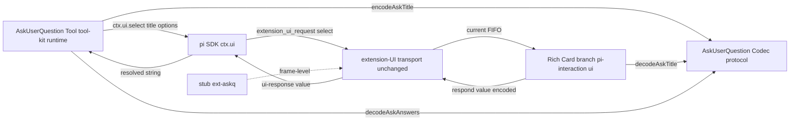
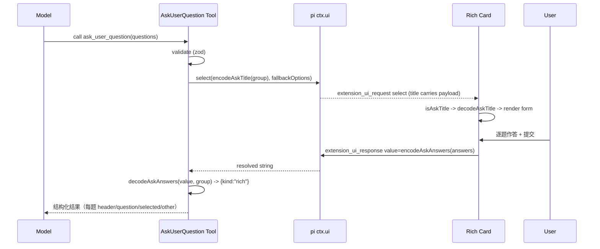

# Technical Design — ask-user-question-card

## Overview

**Purpose**: 为 pi-web 的 agent 作者提供一套「结构化提问」能力，对齐 Claude Code 的 AskUserQuestion 体验——一次抛出 1–4 道带选项描述的问题（单选/多选/可选 Other 自由输入），用户在对话流内的一张富卡片上作答，答案以结构化形式回到模型。

**Users**: agent 作者调用工具发起提问；最终用户在富卡片上作答；旧前端集成方获得优雅降级保障。

**Impact**: 不改动任何协议帧或 pi SDK。能力经「约定式富载荷」搭载在既有 `extension_ui_request(select)` / `extension_ui_response(value)` 帧上：工具端把问题组编码进 `select` 请求的 `title`，前端识别哨兵后渲染富卡片，作答经 `value` 字段回传。核心是一份 protocol 层的**单一权威 codec**，被工具端与前端共同引用。

### Goals
- 工具端可发起符合约束（1–4 题、每题 2–4 个带 label+description 选项、单选/多选、可选 Other）的富问题组，并拿回结构化答案。
- 前端在对话流末尾内联渲染多题富卡片（radio/checkbox、选项描述、Other 输入），一次提交。
- 旧前端遇富请求仍以原生 select 完成一次应答，不卡死会话。
- 零协议帧改动、零 pi SDK 改动、`protocolVersion` 不变。
- 附带共享 codec、UI 单测、stub 驱动 node e2e、示例 agent。

### Non-Goals
- 修改 pi SDK `ctx.ui`（新增 method / 改签名）。
- 新增/修改 `extension_ui_request` / `extension_ui_response` 帧字段或提升 `protocolVersion`。
- 复活 `ctx.ui.custom` 富交互桥。
- 改动 ambient 交互（notify/setStatus/setWidget/setTitle）。
- 多轮 per-question 往返（本设计单次 select 往返完成全部作答）。

## Boundary Commitments

### This Spec Owns
- protocol 层 AskUserQuestion **codec**：类型、zod 校验 schema、哨兵常量、编码/解码/兜底函数（单一权威）。
- tool-kit 层 **AskUserQuestion 工具**（`defineTool`）：入参校验、编码发起、解码收敛为结构化结果、取消/降级语义。
- ui 层 **富卡片渲染分支**：`select` 请求命中哨兵时的富表单渲染、作答编码回传、人类可读留痕。
- 示例 agent、stub `ext-askq` 驱动、三层测试。

### Out of Boundary
- 既有 select/confirm/input/editor 交互的渲染与行为（不得回归）。
- extension-UI 队列/SSE/`/ui-response` 传输链路本身（复用现状）。
- pi SDK 的 `ctx.ui` 实现与协议帧 schema。

### Allowed Dependencies
- `@blksails/pi-web-protocol`（新增 codec 的宿主；tool-kit 与 ui 均可 import——依赖方向 protocol ← {tool-kit, ui}，无环）。
- 既有 `PiInteraction` / `useExtensionUI` / `respond` 链路。
- pi SDK `ctx.ui.select`（仅复用，不修改）。

### Revalidation Triggers
- codec 哨兵常量或问题组/答案结构变化 → 工具端与前端须同步、e2e 须重跑。
- `select` 帧或 `value` 应答分支若被上游 pi SDK 改动 → 本特性需重校。
- `protocolVersion` 若因他因升级 → 复核本特性无搭载假设破坏。

## Architecture

### Existing Architecture Analysis
- extension-UI 子协议链路已完备：`ctx.ui.select` →（agent 子进程 stdout）`extension_ui_request` →（server 旁路）SSE `extension-ui` control 帧 → react `control-store` enqueue → `useExtensionUI.current`（FIFO 队首）→ `PiInteraction` 渲染 → 用户作答 `respond` → `/ui-response` → `extension_ui_response` 回子进程 → `ctx.ui.select` Promise resolve。
- 本特性**不新增链路节点**，仅在两端各加一个「哨兵识别 + 富载荷编解码」旁路分支，中间传输完全复用。

### Architecture Pattern & Boundary Map



- **Selected pattern**: 约定式富载荷（sentinel-tagged payload over an existing channel）+ 单一权威 codec。
- **Boundaries**: 编解码契约集中于 protocol；工具端只管「发起+收敛」；前端只管「识别+渲染+回传」；传输层零改动。
- **Dependency direction**: `protocol ← tool-kit`、`protocol ← ui`（单向，无环）。

### Technology Stack

| Layer | Choice / Version | Role in Feature | Notes |
|-------|------------------|-----------------|-------|
| Frontend / CLI | React 19 + @blksails/pi-web-ui (existing) | 富卡片渲染分支 + i18n 键 | 复用 PiInteraction；新增子组件 |
| Backend / Services | @blksails/pi-web-tool-kit `/runtime` (existing) | AskUserQuestion `defineTool` | node-only 入口，pi SDK 允许 |
| Contract / Shared | @blksails/pi-web-protocol + zod (existing) | codec：类型/schema/常量/函数 | tool-kit 新增 protocol 依赖（acyclic） |
| Test | vitest + @testing-library/react (existing) | 单测 + node e2e | 复用 `vitest.node-e2e.config.ts` |

无新增第三方依赖；tool-kit 新增对内部 protocol 包的依赖。

## File Structure Plan

### New Files
```
packages/protocol/src/rpc/
└── ask-user-question.ts          # codec：类型 + zod schema + 哨兵常量 + encode/decode/fallback 函数（单一权威）

packages/tool-kit/src/ask-user-question/
└── tool.ts                       # askUserQuestionTool（defineTool）：校验→encodeAskTitle→ctx.ui.select→decodeAskAnswers→结构化结果

packages/ui/src/elements/
└── ask-user-question-card.tsx    # <AskUserQuestionCard>：多题富表单（radio/checkbox/描述/Other）+ 提交(编码回传)/取消

examples/ask-user-question-agent/
├── index.ts                      # defineAgent + customTools:[askUserQuestionTool] + systemPrompt
└── README.md                     # 示例说明（既有风格）

packages/protocol/test/rpc/
└── ask-user-question.test.ts     # codec 往返 / 降级 / 非法入参 单测

packages/ui/test/elements/
└── ask-user-question-card.test.tsx  # 富卡片渲染 + 提交/取消 单测（镜像 notifications.test.tsx）

e2e/node/
└── ask-user-question.e2e.test.ts # stub ext-askq 帧级闭环
```

### Modified Files
- `packages/protocol/src/index.ts` — `export *` 新增 `./rpc/ask-user-question.js`。
- `packages/tool-kit/src/runtime.ts` — 再导出 `askUserQuestionTool`。
- `packages/tool-kit/package.json` — deps 增 `@blksails/pi-web-protocol`（workspace）。
- `packages/ui/src/elements/pi-interaction.tsx` — select 分支内检测 `isAskTitle(title)` → 渲染 `<AskUserQuestionCard>`；富提交走 `submit(request, {value:encoded}, {人类可读 outcome})`。
- `packages/ui/src/elements/index.ts` — 导出 `AskUserQuestionCard`（如需）。
- `packages/ui/src/i18n/messages.ts` — zh/en 各新增 `piInteraction.askq.*` 键。
- `lib/app/stub-agent-process.mjs` — 新增 `ext-askq` sentinel 分支 + 应答解码 echo。
- `examples/README.md` — 在「server-driven UI 与交互」段新增示例行。

## System Flows

### 富卡片单次往返（正常路径）


关键分支：
- 用户取消 → `respond({cancelled:true})` → `ctx.ui.select` 返回 `undefined` → 工具返回「已取消」结果（R3.3）。
- 旧前端（不识别哨兵）→ 原生 select 渲染 verbatim title + fallbackOptions，用户选一项 → `value=<纯选项标签>`（无答案哨兵）→ 工具 `decodeAskAnswers` 判定 `{kind:"degraded"}` → 返回降级结果（R4.2）。
- 非法入参（题数/选项数越界）→ 工具校验失败，返回错误结果，**不发起任何交互**（R1.5）。

## Requirements Traceability

| Requirement | Summary | Components | Interfaces | Flows |
|-------------|---------|------------|------------|-------|
| 1.1–1.4 | 富问题组发起（1-4题/2-4选项/多选/Other） | Tool, Codec | `askUserQuestionTool.execute`, `AskQuestionGroupSchema` | 正常路径 |
| 1.5 | 非法入参拒绝且不发起交互 | Tool, Codec | zod 校验 → 错误结果 | 非法分支 |
| 2.1–2.6 | 富卡片渲染（多题/单选/多选/描述/Other/同卡） | Rich Card | `decodeAskTitle`, `<AskUserQuestionCard>` | 正常路径 |
| 3.1–3.2 | 作答编码回传 + 工具解码结构化 | Rich Card, Codec, Tool | `encodeAskAnswers`/`decodeAskAnswers` | 正常路径 |
| 3.3 | 取消语义 | Rich Card, Tool | `respond({cancelled})` | 取消分支 |
| 3.4 | 未提交阻塞续跑 | Rich Card | `ctx.ui.select` await | 正常路径 |
| 4.1–4.3 | 旧前端降级 + 不破坏既有交互 | Rich Card, Tool, Codec | `isAskTitle` 门控, `decodeAskAnswers(degraded)` | 降级分支 |
| 5.1–5.4 | 零协议/零 SDK/无 custom/不碰 ambient | 全组件 | 复用既有帧 | — |
| 6.1 | 共享单一权威 codec | Codec | protocol 导出 | — |
| 6.2 | UI 单测 | ask-user-question-card.test | vitest | — |
| 6.3 | stub node e2e 闭环 | stub ext-askq, e2e test | 帧级 | 全路径 |
| 6.4 | 示例 agent | examples/ask-user-question-agent | defineAgent | — |

## Components and Interfaces

| Component | Domain/Layer | Intent | Req Coverage | Key Dependencies (P0/P1) | Contracts |
|-----------|--------------|--------|--------------|--------------------------|-----------|
| AskUserQuestion Codec | Contract (protocol) | 哨兵富载荷单一权威编解码 | 1.5, 3.1, 3.2, 4.2, 6.1 | zod (P0) | Service, State |
| askUserQuestionTool | Tool (tool-kit runtime) | 发起提问并收敛结构化结果 | 1.1–1.5, 3.2, 3.3, 4.2 | Codec (P0), pi ctx.ui (P0) | Service |
| AskUserQuestionCard | UI (ui) | 富表单渲染 + 编码回传 | 2.1–2.6, 3.1, 3.3, 3.4 | Codec (P0), useExtensionUI (P0) | State |
| stub ext-askq | Test seam | 帧级驱动闭环 | 6.3 | Codec (P1) | Event |

### Contract (protocol)

#### AskUserQuestion Codec
| Field | Detail |
|-------|--------|
| Intent | 哨兵前缀 + JSON 富载荷的单一权威编解码与校验 |
| Requirements | 1.5, 3.1, 3.2, 4.2, 6.1 |

**Responsibilities & Constraints**
- 定义问题组/答案的类型与 zod schema，校验 1–4 题、每题 2–4 选项。
- 定义哨兵常量（title 侧与 answer 侧各一），提供编码/解码/兜底选项函数。
- 纯函数、isomorphic、zero runtime-dep（除 zod，protocol 既有）。**唯一权威**：工具端与前端均 import，禁止各自硬编码哨兵/结构。

**Contracts**: Service [x] / State [x]

##### Service Interface
```typescript
export interface AskOption {
  readonly label: string;        // 1–5 词
  readonly description: string;  // 该选项含义/代价
}
export interface AskQuestion {
  readonly header: string;       // ≤ ~12 字短标签
  readonly question: string;     // 完整问题
  readonly multiSelect: boolean;
  readonly options: readonly AskOption[];  // 2–4
  readonly allowOther?: boolean; // 允许自由输入
}
export interface AskQuestionGroup {
  readonly questions: readonly AskQuestion[]; // 1–4
}
export interface AskAnswer {
  readonly header: string;
  readonly question: string;
  readonly selected: readonly string[]; // 选中的 option.label 集合（多选可 0..n，单选恰 1）
  readonly other?: string;              // Other 自由输入文本（如有）
}
export interface AskAnswers {
  readonly answers: readonly AskAnswer[];
}

/** 解码应答的判别式结果：富答案 / 降级（旧前端裸选项） */
export type AskDecodeResult =
  | { readonly kind: "rich"; readonly answers: AskAnswers }
  | { readonly kind: "degraded"; readonly rawValue: string };

export const ASK_TITLE_SENTINEL: string;   // e.g. "PIAQ1"
export const ASK_ANSWER_SENTINEL: string;  // e.g. "PIAQA1"

export const AskQuestionGroupSchema: import("zod").ZodType<AskQuestionGroup>;
export const AskAnswersSchema: import("zod").ZodType<AskAnswers>;

/** 校验并编码问题组为 select 请求载荷（title 含人类前导+哨兵+JSON；options 为降级兜底） */
export function encodeAskRequest(group: AskQuestionGroup): { title: string; options: string[] };
/** 前端：title 是否携带富问题组哨兵 */
export function isAskTitle(title: string): boolean;
/** 前端：从 title 解出问题组；非富载荷或解析失败返回 undefined */
export function decodeAskTitle(title: string): AskQuestionGroup | undefined;
/** 前端：编码富答案为应答 value 字符串（含答案哨兵） */
export function encodeAskAnswers(answers: AskAnswers): string;
/** 工具端：解码应答 value；含答案哨兵→rich，否则→degraded（旧前端裸选项） */
export function decodeAskAnswers(value: string, group: AskQuestionGroup): AskDecodeResult;
```
- Preconditions: `encodeAskRequest` 的入参须过 `AskQuestionGroupSchema`（否则抛，供工具捕获转错误结果）。
- Postconditions: `encodeAskAnswers` 输出经 `decodeAskAnswers` 必往返一致（rich）。`isAskTitle(encodeAskRequest(g).title) === true`。
- Invariants: 哨兵常量为二者唯一来源；`decodeAskTitle` 对任意非富 title 返回 `undefined`（不抛）。

**Implementation Notes**
- Integration: 经 `packages/protocol/src/index.ts` 再导出。
- Validation: 单测覆盖往返、降级 value、非法入参（题=0/>4、选项<2/>4）、`decodeAskTitle` 对普通 title 返回 undefined。
- Risks: 哨兵碰撞——用控制字符 + 版本标记降概率；`isAskTitle` 仅在 select 场景由前端调用进一步收窄。

### Tool (tool-kit runtime)

#### askUserQuestionTool
| Field | Detail |
|-------|--------|
| Intent | agent 可调用的富提问工具，收敛用户作答为结构化结果 |
| Requirements | 1.1–1.5, 3.2, 3.3, 4.2 |

**Responsibilities & Constraints**
- `defineTool`，`parameters = Type.Object({ questions: Type.Array(..., {minItems:1,maxItems:4}) })`，每题 options `{minItems:2,maxItems:4}`。
- execute 内先以 `AskQuestionGroupSchema` 复校（R1.5 双保险）→ 失败返回 `textResult(错误说明)`，不调用 `ctx.ui`。
- `encodeAskRequest` → `ctx.ui.select(title, options)`：
  - 返回 `undefined` → 取消结果（R3.3）。
  - 返回字符串 → `decodeAskAnswers`：`rich` → 返回结构化 JSON 结果给模型（R3.2）；`degraded` → 返回标注「降级/未获富作答」的结果（R4.2）。
- 归属 `packages/tool-kit/src/ask-user-question/tool.ts`，经 `runtime.ts` 再导出。

**Dependencies**
- Outbound: AskUserQuestion Codec — 编解码 (P0)
- External: pi SDK `ctx.ui.select` — 发起交互 (P0)；`@earendil-works/pi-coding-agent` `defineTool` / `pi-ai` `Type`（peer，既有）

**Contracts**: Service [x]

##### Service Interface
```typescript
// defineTool 结果；execute 契约由 pi SDK 决定：
// execute(toolCallId, params: { questions: AskQuestion[] }, signal, onUpdate, ctx: ExtensionContext)
//   : Promise<AgentToolResult>
export const askUserQuestionTool: ReturnType<typeof defineTool>;
```
- Preconditions: `params.questions` 经 SDK schema 初校 + execute 内 zod 复校。
- Postconditions: 恒返回 `AgentToolResult`（成功结构化 / 取消 / 降级 / 错误四态其一）；对 rich，结果文本为可被模型解析的答案 JSON。
- Invariants: 校验失败绝不发起 `ctx.ui.*`。

**Implementation Notes**
- Integration: 示例 agent 经 `customTools:[askUserQuestionTool]` 消费。
- Validation: 由 node e2e 帧级证明；工具内解码分支可加轻量单测（可选）。
- Risks: pi SDK 若不深校嵌套 `minItems` → zod 复校兜底。

### UI

#### AskUserQuestionCard
| Field | Detail |
|-------|--------|
| Intent | select 命中哨兵时的富表单渲染与编码回传 |
| Requirements | 2.1–2.6, 3.1, 3.3, 3.4 |

**Responsibilities & Constraints**（Summary-only presentational + 一处新边界：编码回传）
- 入参：`{ group: AskQuestionGroup; request: InteractiveRequest; pending: boolean; error?: string; onSubmitEncoded(value: string, summary: string): void; onCancel(): void }`。
- 渲染：每题 header + question；`multiSelect=false` → radiogroup（默认选首项，同题互斥，R2.3）；`multiSelect=true` → checkbox 组（可 0..n，R2.4）；每选项显示 label + description 副文本（R2.2）；`allowOther` → Other 文本框（R2.5）；多题在同一卡片内以 header Tabs 切换，一次展示当前题且切换保留各题状态（R2.6）。Tabs 使用 `tablist` / `tab` / `tabpanel` 语义，所有 panel 常驻 DOM 并以 `hidden` 切换，确保 `aria-controls` / `aria-labelledby` 引用始终有效；单题不渲染 Tabs 语义。
- 提交：收集答案 → `AskAnswers` → `value=encodeAskAnswers(answers)`、`summary=人类可读摘要` → `onSubmitEncoded(value, summary)`（R3.1）；取消 → `onCancel()`（R3.3）。
- 提交进行中（pending）禁用控件（R3.4 由上游 `ctx.ui.select` await 保证阻塞）。
- 主题走 shadcn CSS 变量；`data-pi-askq-*` 测试锚点；i18n 用 `piInteraction.askq.*`。

**Contracts**: State [x]

**Implementation Notes**
- Integration: `pi-interaction.tsx` 在 select 分支检测 `isAskTitle(request.title)`：真 → `decodeAskTitle` → `<AskUserQuestionCard onSubmitEncoded={(value,summary)=>submit(request,{type:"extension_ui_response",id,value},{kind:"value",method:"select",value:summary})} onCancel={()=>onCancel(request)} />`；假 → 原有 select 渲染不变（R4.3）。留痕经既有 ResolvedCard 显示 summary。
- Validation: `ask-user-question-card.test.tsx` 覆盖单选/多选/描述可见/Other/提交编码回传/取消。
- Risks: `decodeAskTitle` 返回 undefined（损坏载荷）→ 回落原有 select 渲染，不崩溃。

### Test Seam

#### stub ext-askq
| Field | Detail |
|-------|--------|
| Intent | 无 LLM 帧级驱动富卡片闭环 |
| Requirements | 6.3 |

**Implementation Notes**
- `handlePrompt` 加 `ext-askq` 分支：`pendingUi="askq"`，`write({type:"extension_ui_request", id:"askq-1", method:"select", title:encodeAskRequest(fixtureGroup).title, options:encodeAskRequest(fixtureGroup).options})`。
- 应答 case 加 `pendingUi==="askq"`：读 `cmd.value` → `emitText` echo（含哨兵或解码摘要，供断言）→ `finishTurn`。
- e2e 直接 import protocol codec 构造 fixtureGroup 并断言 `title` 含 `ASK_TITLE_SENTINEL`、往返答案正确。

## Error Handling

### Error Strategy
- **入参非法**（题/选项越界）：工具 execute 内 zod fail-fast → `textResult` 明确约束说明，不发起交互（R1.5）。
- **载荷损坏**（前端 `decodeAskTitle` 抛/返回 undefined）：前端回落原生 select 渲染，绝不崩溃（graceful degradation）。
- **旧前端降级**：应答无答案哨兵 → 工具 `decodeAskAnswers` 判 `degraded` → 返回可被模型理解的降级结果，不抛未捕获错误（R4.2）。
- **用户取消**：`ctx.ui.select` 返回 undefined → 取消结果，不含臆造答案（R3.3）。
- **respond 失败**：复用 `PiInteraction` 既有重试（保留 active + 显错），无新增处理。

## Testing Strategy

### Unit Tests（protocol codec — `ask-user-question.test.ts`）
1. `encodeAskRequest`→`decodeAskTitle` 往返一致（单题/多题、含/不含 Other）。
2. `encodeAskAnswers`→`decodeAskAnswers` 富往返一致（单选/多选/Other）。
3. `decodeAskAnswers` 对无哨兵 value 返回 `{kind:"degraded"}`。
4. `AskQuestionGroupSchema` 拒绝题数=0/>4、选项<2/>4。
5. `isAskTitle`/`decodeAskTitle` 对普通 title 分别返回 false/undefined（不抛）。

### Unit Tests（ui — `ask-user-question-card.test.tsx`）
1. 多题渲染：header Tabs 切换时一次展示当前题的 question 与选项 label/description，并保留各题状态（R2.1/2.2/2.6）。
2. 单选题以互斥 radio 呈现、默认首项；多选题以 checkbox 呈现、可多选/零选（R2.3/2.4）。
3. Other 输入框在 `allowOther` 时出现并可提交自定义文本（R2.5）。
4. 提交调用 `onSubmitEncoded`，value 可经 `decodeAskAnswers` 还原为所选（R3.1）；取消调用 `onCancel`（R3.3）。
5. `pi-interaction.tsx`：非哨兵 select 请求仍走原生 select 渲染（R4.3 回归保护）。

### E2E（node — `ask-user-question.e2e.test.ts`，stub 驱动无 LLM）
1. prompt 含 `ext-askq` → SSE `extension_ui_request(select)` 帧 `title` 携带 `ASK_TITLE_SENTINEL`（R6.3 发起）。
2. POST `/ui-response` value=`encodeAskAnswers(fixtureAnswers)` → stub echo 解码答案 → `agent_end`/`finish`（R6.3 回传+续跑）。
3. 断言 stub 回显文本反映解码后的答案（证明 codec 帧级往返）。

## Open Questions / Risks
- 哨兵常量最终取值（控制字符 vs 可见标记）在实现期定稿，须二者共用 protocol 常量、禁硬编码。
- 降级模式下 fallbackOptions 取自哪一题：默认取首题的 option labels（实现期定），保证旧前端可读可选。
