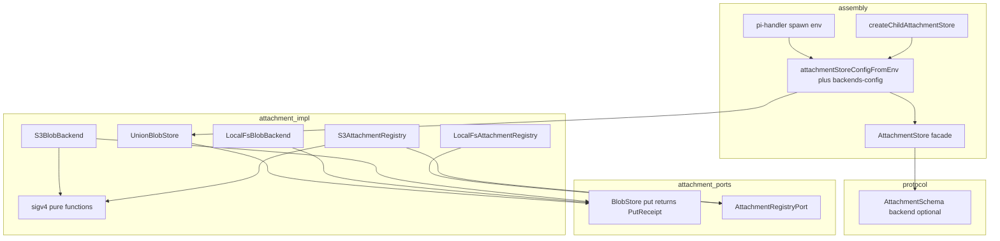

# Technical Design Document — attachment-backend-pluggable

## Overview

**Purpose**:本特性使附件系统的字节存储与描述符注册表经配置可插拔,支持多个具名后端并存(含 S3 兼容对象存储),交付给云端/多副本部署的宿主运维者。
**Users**:宿主运维者经单一环境变量声明后端拓扑;agent 工具作者与终端用户无感获得跨进程/跨副本一致的附件视图。
**Impact**:`packages/server/src/attachment/` 的端口层扩展(registry 提端口、`put` 回执化)+ 新增 union 组合后端与 S3 双实现;协议描述符新增可选字段 `backend`;`lib/app/pi-handler.ts` spawn env 透传扩展。未配置拓扑时全部新路径不激活,存量部署零行为变化。

### Goals
- 后端经配置选择且可多具名后端并存;新附件的后端绑定随描述符持久化,读路由不依赖运行期状态(1.x/3.x/4.x)。
- S3 兼容对象存储承载字节与描述符,多副本共享同一视图(5.x)。
- 主/子进程按同一 env 重建同构存储视图(6.x)。

### Non-Goals
- agent 定义声明附件 profile(后续 spec `agent-attachment-profile`)。
- 存量附件绑定批量回填工具;`listBySession` 吞吐优化;附件配额/生命周期管理。

## Boundary Commitments

### This Spec Owns
- `BlobStore` 端口的 `put` 回执化签名与 `PutReceipt` 类型;`AttachmentRegistryPort` 端口的定义。
- `UnionBlobStore` 组合语义(写路由策略、描述符权威读路由、迁移期探测链、删除双路径)。
- `PI_WEB_ATTACHMENT_BACKENDS` 拓扑 env 的 schema、解析、构建工厂与 `passthroughEnv` 下发清单。
- S3 型 blob 后端与 S3 型 registry 实现(含 SigV4 签名模块)。
- 协议 `AttachmentSchema` 新增可选字段 `backend`(minor bump)。

### Out of Boundary
- 门面 `AttachmentStore` 的对外方法面与业务不变式语义(归 `attachment-store` spec;本 spec 仅在 put 内固化回执、回滚路径感知选中后端)。
- 属主校验、base64 剥离、临时文件回收(归 `attachment-tool-bridge` spec,行为不变)。
- 签名分发 URL 的 HMAC 方案与 `/raw` 端点行为(不变;S3 presign 是后端内部的 `presignUrl` 实现细节)。

### Allowed Dependencies
- `node:crypto`/`node:fs`/`fetch`(内建);`zod`(既有);`@blksails/pi-web-protocol`(既有)。
- **禁止**新增第三方运行时依赖(含 AWS SDK)——见 research.md 决策。
- 依赖方向:`protocol` ← `attachment(端口/实现/union/config)` ← `attachment-bridge` / `lib/app`。实现不得反向 import bridge 或 handler。

### Revalidation Triggers
- `BlobStore`/`AttachmentRegistryPort` 端口签名再变更 → `attachment-tool-bridge` 与全部后端实现须复核。
- 描述符字段再扩展 → protocol 消费方(前端渲染/补全预览)须复核。
- `passthroughEnv` 清单变化 → pi-handler spawn env 与 desktop 壳的 env 继承须复核。

## Architecture

### Existing Architecture Analysis
- 门面 `AttachmentStore` 组合 `{ blob, registry, signer, backend? }`,写路径不变式「先落 blob 再写描述符,失败回滚」;`localPath` 经可选 `DiskPathCapable` 委托。
- 子进程 `createChildAttachmentStore(env)` 复用同一 config 工厂;既有能力门控 = `PI_WEB_ATTACHMENT_DIR` 是否下发。
- 可插拔先例 = `session-store`(`{kind}` 判别联合 + 工厂 switch + 未知 kind throw),本设计全面对齐。

### Architecture Pattern & Boundary Map



**Architecture Integration**:
- Selected pattern:端口 + composite(union)注入既有门面;配置判别联合 + 工厂(session-store 同族)。
- 新组件 rationale:union 承担多后端组合;S3 双实现补齐云端形态;backends-config 单点拥有拓扑解析与凭据解引用。
- Steering compliance:strict TS 无 `any`;错误类型化可 `instanceof`;fail fast 装配期校验。

### Technology Stack

| Layer | Choice / Version | Role in Feature | Notes |
|-------|------------------|-----------------|-------|
| Backend / Services | TypeScript strict(既有) | 端口/实现/工厂 | 无新依赖 |
| Data / Storage | 本地 FS(既有)、S3 兼容 API(fetch + 手写 SigV4) | 字节与描述符双层 | AWS SDK 否决,见 research.md |
| Infrastructure / Runtime | env 配置(`PI_WEB_ATTACHMENT_BACKENDS` 等) | 拓扑声明与 spawn 透传 | zod 校验 |

## File Structure Plan

### Directory Structure(新增)
```
packages/server/src/attachment/
├── union-blob-store.ts        # UnionBlobStore:组合后端(写策略/读路由/探测链/删除双路径)
├── backends-config.ts         # 拓扑 env schema(zod)+ 解析 + buildBackend/buildRegistry 工厂 + passthroughEnv 计算
└── s3/
    ├── sigv4.ts               # SigV4 纯函数(canonical request → 签名/presign),零 IO
    ├── s3-client.ts           # 最小 fetch 客户端(PUT/GET/HEAD/DELETE/ListObjectsV2),错误 → 类型化
    ├── s3-blob-backend.ts     # BlobStore 实现(含 presignUrl = SigV4 query presign)
    └── s3-registry.ts         # AttachmentRegistryPort 实现(att/<id>.json + by-session/ 前缀索引)
```

### Modified Files
- `packages/protocol/src/attachment/attachment-dto.ts` — `AttachmentSchema` 加 `backend: z.string().optional()`(1.3/3.1)。
- `packages/server/src/attachment/blob-store.ts` — 新增 `PutReceipt`;`BlobStore.put` 返回 `Promise<PutReceipt>`(3.1)。
- `packages/server/src/attachment/local-fs-backend.ts` — `put` 返回 `{}`(签名适配,行为不变)。
- `packages/server/src/attachment/attachment-registry.ts` — 提 `AttachmentRegistryPort` 接口;类更名 `LocalFsAttachmentRegistry`(barrel 留 `AttachmentRegistry` 兼容别名)(1.1)。
- `packages/server/src/attachment/attachment-store.ts` — deps 的 registry 类型改端口;`put` 固化 `receipt.backendName` 进描述符;回滚删除作用于选中后端(3.1/3.2)。
- `packages/server/src/attachment/config.ts` — 工厂分支:无拓扑走原路径;有拓扑构建 union + registry;返回值扩 `passthroughEnv`(1.1/1.2/2.x)。
- `packages/server/src/attachment/index.ts` — barrel 导出新端口/类型/实现。
- `packages/server/src/attachment-bridge/child-store.ts` — 能力门控改「`PI_WEB_ATTACHMENT_DIR` 或 `PI_WEB_ATTACHMENT_BACKENDS` 任一下发」(6.2/6.3)。
- `lib/app/pi-handler.ts` — spawn env 合入 `passthroughEnv`(6.1)。

## Components and Interfaces

### 组件总表

| Component | Domain | Intent | Requirements | Dependencies | Contracts |
|---|---|---|---|---|---|
| PutReceipt/BlobStore 签名 | attachment 端口 | 写路径报告实际后端 | 3.1 | — | Service |
| AttachmentRegistryPort | attachment 端口 | 描述符存取可插拔 | 1.1, 5.2 | — | Service |
| UnionBlobStore | attachment 组合 | 多后端组合与路由 | 3.1, 4.1–4.3, 7.1–7.2 | BlobStore(Inbound P0) | Service |
| backends-config | attachment 装配 | 拓扑解析/工厂/透传清单 | 2.1–2.4, 6.1 | zod(External P2) | Service/Config |
| S3BlobBackend + s3-client + sigv4 | attachment S3 | S3 字节后端 | 5.1, 5.3, 5.4 | fetch/node:crypto(External P1) | Service |
| S3AttachmentRegistry | attachment S3 | S3 描述符注册表 | 5.2, 5.3 | s3-client(Inbound P0) | Service |
| 门面 put 固化 | attachment 门面 | 绑定持久化+不变式 | 3.1–3.3, 1.2 | 端口(Inbound P0) | Service |
| spawn env 透传 | assembly | 主/子同构重建 | 6.1–6.3 | config(Inbound P0) | State |

### UnionBlobStore(核心契约)

```ts
export interface NamedBackend { readonly name: string; readonly store: BlobStore; }
export type WritePolicy = (meta: BlobMeta) => string;

export interface UnionBlobStoreDeps {
  readonly backends: readonly NamedBackend[];          // 非空;顺序 = 探测链顺序
  readonly writePolicy?: WritePolicy;                  // 缺省恒选 backends[0]
  readonly resolveBackendName: (key: string) => Promise<string | undefined>;
}
export class UnionBlobStore implements BlobStore { /* 见行为规约 */ }
```

行为规约(参考实现见 `docs/attachment-union-store-design.md` §3.4,契约以此处为准):
- **构造**:后端空集或重名 → throw(2.2);`writePolicy` 返回未注册名 → `put` throw。
- **put**:策略选定单一后端落字节,回执 `{ backendName }`(3.1)。
- **读路径**(`getReadStream`/`head`/`presignUrl`):`resolveBackendName` 命中 → 仅该后端,未找到抛既有 `BlobNotFoundError`(4.1);返回 `undefined` → 按声明顺序探测,吞 `BlobNotFoundError` 续试,其余错误直抛,全部未命中抛 `BlobNotFoundError(key)`(4.2);命中名未注册 → throw 配置错误指出名字(4.3)。
- **delete**:有绑定删绑定后端;无绑定对全部后端幂等删(7.1/7.2)。

### backends-config(拓扑契约)

```ts
// zod 判别联合(session-store 同族)
export type BackendDecl =
  | { kind: "local-fs"; name: string; dir?: string }
  | { kind: "s3"; name: string; bucket: string; region?: string; endpoint?: string;
      prefix?: string; forcePathStyle?: boolean;
      accessKeyEnv: string; secretKeyEnv: string; sessionTokenEnv?: string };

export interface BackendsTopology {
  backends: BackendDecl[];                          // 非空、name 唯一(^[a-z0-9][a-z0-9-]*$)
  write: string;                                    // 必须 ∈ backends[].name
  registry?: { kind: "local-fs" } | { kind: "s3"; backend: string }; // 缺省 local-fs;s3.backend 必须 ∈ names
}

export function parseBackendsEnv(raw: string | undefined): BackendsTopology | undefined; // undefined = 未配置
export function buildBackends(t: BackendsTopology, deps: { signer: UrlSigner; urlBasePath: string; dir: string; env: NodeJS.ProcessEnv }): NamedBackend[];
export function buildRegistry(t: BackendsTopology, named: NamedBackend[], deps: {...}): AttachmentRegistryPort;
export function computePassthroughEnv(t: BackendsTopology, env: NodeJS.ProcessEnv): Record<string, string>; // BACKENDS 原文 + 全部被引用凭据变量
```

错误语义(2.2/2.4):JSON 不可解析、schema 不符、重名、空集、`write`/`registry.backend` 失配、未知 `kind`、凭据变量缺失 → 装配期 `AttachmentBackendsConfigError`(类型化,message 指出错误项/变量名),绝不部分启动。

### S3 后端(blob + registry)

- `s3-client.ts`:五操作(PUT/GET/HEAD/DELETE/ListObjectsV2),SigV4 header 签名;HTTP 404/`NoSuchKey` → `BlobNotFoundError`(blob 侧)/`undefined`(registry get 侧);其余非 2xx → 类型化 `S3RequestError{status, code}`。
- `s3-blob-backend.ts`:key 布局 `<prefix>blob/<id>`(meta 存对象头 Content-Type/Content-Length,`head` 由 HEAD 回读);`presignUrl` = SigV4 query presign,时效取既有 `expiresInMs` 语义(5.4);无 `diskPath` 能力(`localPath` 对 S3 承载对象返回 `undefined`,契约既有允许)。
- `s3-registry.ts`:`att/<id>.json` 描述符 + `by-session/<sessionId>/<id>` 空对象索引;`save` 先描述符后索引(均幂等覆盖);`listBySession` = 前缀枚举 + 并发 GET;`get` 未找到 → `undefined`(5.2)。
- `sigv4.ts`:纯函数(无 IO):`canonicalRequest` / `stringToSign` / `signingKey` / `signHeaders` / `presignQuery`;单测钉 AWS 官方向量。

### 门面与装配改动(集成契约)

- 门面 `put`:`const receipt = await blob.put(...)` → 描述符条件展开 `...(receipt.backendName !== undefined ? { backend } : {})`(1.2/3.1);描述符写失败回滚 `blob.delete(id)`(union 内按回执路由到选中后端——union 的 `resolveBackendName` 此刻查不到描述符,故 union `delete` 的无绑定分支「全后端幂等删」天然覆盖回滚,语义正确且不需门面感知后端,3.2)。
- config 工厂:未设 `PI_WEB_ATTACHMENT_BACKENDS` → 原路径原样(1.1/1.2);设了 → `buildBackends` + `buildRegistry` + `UnionBlobStore{ resolveBackendName: (k) => registry.get(k).then(d => d?.backend) }` + 首个 local-fs 后端作 `localPath` 委托;返回 `{ store, dir, secret, passthroughEnv }`。
- pi-handler:spawn env 展开 `...passthroughEnv`(6.1)。
- child-store:门控 `DIR || BACKENDS`(6.2/6.3);其余不变(同工厂重建)。

## Data Models

- `Attachment.backend?: string`:后端绑定,`put` 时由回执固化,此后不可变;缺省 = 存量对象/单后端部署(1.3)。protocol minor bump,SSE/REST 消费方零改动(可选字段)。
- S3 对象布局(registry):见上;描述符 JSON 即 `Attachment` 原样序列化,与本地 `.att.json` 内容同构。

## Error Handling

- 装配期:`AttachmentBackendsConfigError`(新,类型化,fail fast,2.2/2.4)。
- 运行期:复用 `BlobNotFoundError`(4.1/4.2);绑定失配 → `AttachmentBackendsConfigError` 变体或专用 `UnknownBackendBindingError`(实现取其一并 barrel 导出,message 含后端名,4.3);S3 传输错误 → `S3RequestError`。
- 子进程:能力缺失维持 `AttachmentCapabilityUnavailableError` 语义(6.3)。

## Testing Strategy

### Unit
1. `UnionBlobStore`:写路由/回执;绑定命中;探测链(`BlobNotFoundError` 穿透、非 NotFound 直抛、全空抛);绑定失配报名字;删除双路径;构造校验(空集/重名/未知写目标)——4.1/4.2/4.3/7.1/7.2/3.1。
2. `backends-config`:合法拓扑解析;七类非法输入逐一断言错误信息含错误项;`computePassthroughEnv` 含 BACKENDS 与全部凭据变量;凭据缺失报变量名——2.1–2.4/6.1。
3. `sigv4`:AWS 官方签名向量(header 签名 + query presign)——5.1/5.4 的正确性锚点。
4. 门面 `put` 固化与回滚:回执有/无 backendName 两态;描述符写失败 → union 全后端幂等删后抛——3.1/3.2/1.2。
5. protocol schema:带/不带 `backend` 均通过校验——1.3。

### Integration
6. 双 local-fs 后端 union 全链(不依赖 S3):A 落库 → 描述符含 backend → 读/签发/删除仅走 A;预置无绑定对象 → 探测命中 B——3.3/4.1/4.2。
7. config 工厂:无 env 时与现状产物逐项一致(目录/签名/描述符形状)——1.1/1.2。
8. 主/子进程(真实子进程,attachment-tool-bridge 既有测试形态):拓扑下子进程 `putOutput` → 主进程按 id 分发与描述符读取;env 不下发 → 既有降级——6.1–6.3。
9. S3 后端(env 门控,未配置 skip):五操作 + registry save/get/listBySession + 双实例互读——5.1–5.3。

### E2E
10. `e2e:node`(stub agent + 双 local-fs 拓扑):上传 → 引用 → **重启 server 进程** → 历史附件签名分发仍 200——4.4(需求的关键旅程)。

## Security & Performance
- 凭据仅存宿主 env,拓扑 JSON 只含变量名(2.3);`passthroughEnv` 只下发被引用变量,不整包透传 env。
- SigV4 实现风险经官方向量 + 门控集成测试收敛(research.md)。
- 探测链仅无绑定路径触发;有绑定读路径单次 registry `get` 开销(本地=一次文件读,S3=一次 GET),可接受;吞吐优化 out of scope。

## Requirements Traceability

| Requirement | 摘要 | Components |
|---|---|---|
| 1.1–1.3 | 零行为变化/可选字段 | config 工厂原路径分支、protocol schema |
| 2.1–2.4 | 拓扑声明/fail fast/凭据间接 | backends-config |
| 3.1–3.3 | 写绑定/不变式/绑定权威 | 门面 put、UnionBlobStore、PutReceipt |
| 4.1–4.4 | 读路由/回退/失配/重启分发 | UnionBlobStore、e2e 10 |
| 5.1–5.4 | S3 双层/多副本/presign | s3-blob-backend、s3-registry、sigv4 |
| 6.1–6.3 | 主/子一致/降级 | passthroughEnv、pi-handler、child-store |
| 7.1–7.2 | 删除幂等 | UnionBlobStore delete |
