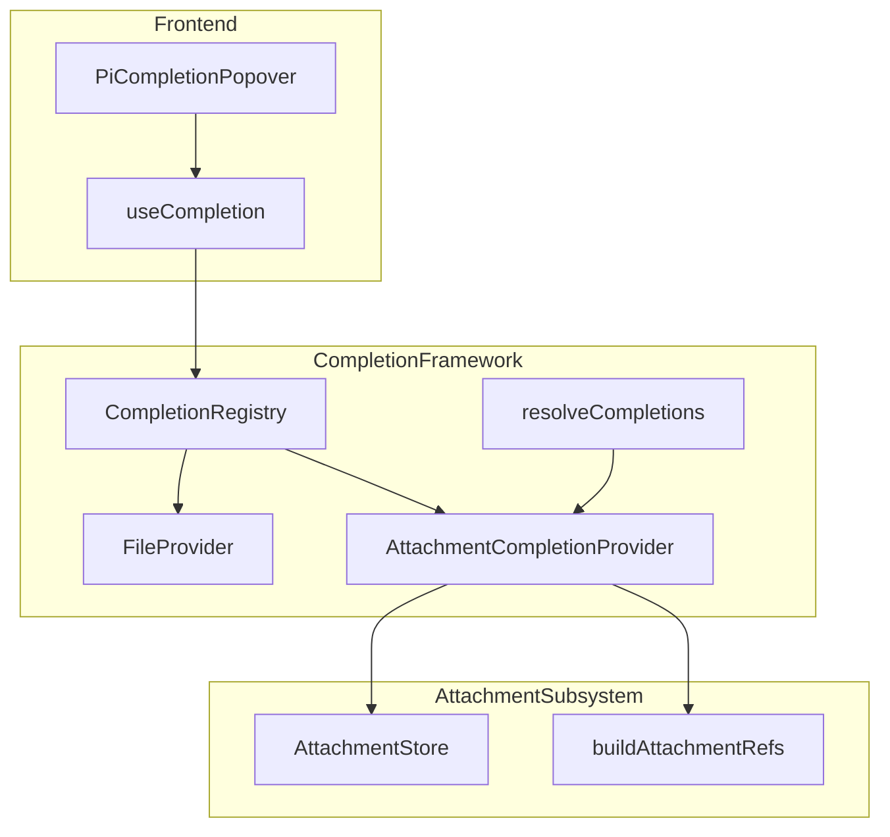
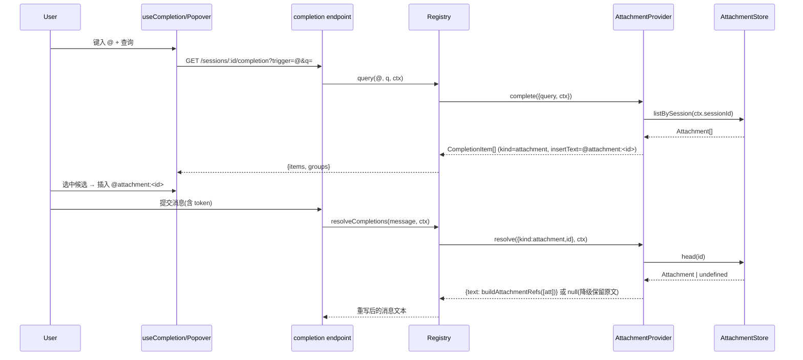

# Design Document — attachment-mention-completion

## Overview

本功能为「本会话已有附件」提供基于触发符的 mention 补全：用户在输入框键入 `@` 即可在补全浮层中看到本会话已上传/已产出的附件，选中后插入引用 token `@attachment:<id>`，提交时该 token 被解析为与现有 `reference-injection` 完全一致的规范附件引用标记 `[attachment id=… type=… name=…]`，从而让 agent 像识别新上传附件一样识别被引用的附件。

**Purpose**: 让用户复用已有附件而无需重新上传。
**Users**: 在 pi-web 会话中输入消息的最终用户。
**Impact**: 在现有 completion-provider-framework 中新增一个与 file-provider 对称、并存的 `attachment` provider；前端补全浮层因按 kind 通用渲染而无需改动即可承载新候选类型。

### Goals
- 新增 attachment CompletionProvider（`complete()` + `resolve()`），复用框架既有注册表、端点与提交期解析流程。
- 与 file-provider 在同一触发符 `@` 下并存、按 kind 分组、互不干扰。
- resolve 产出与 `buildAttachmentRefs` 一致的规范引用标记，复用下游 agent/tool 识别逻辑。
- 端到端验证「触发→候选→token→解析→file-provider 不退化」。

### Non-Goals
- 不在用户消息气泡中重渲染被 mention 附件的缩略图/图片（沿用既有上传附件展示路径）。
- 补全浮层不渲染真实图像缩略图（候选以 label + detail 文本呈现）。
- 不新增上传/删除/跨会话检索附件能力。
- 不将被 mention 的附件加入 `attachmentIds` 数组（解析为内联文本标记即可被 agent/tool 按 id 取用）。

## Boundary Commitments

### This Spec Owns
- `AttachmentCompletionProvider`：`complete()`（按 `ctx.sessionId` 列举并按名过滤本会话附件→`CompletionItem`）与 `resolve()`（`@attachment:<id>`→规范引用标记）。
- attachment 候选的 token 语义：触发符 `@`、kind `attachment`、token 形态 `@attachment:<id>`、`insertText` 取值。
- provider 在 `create-handler.ts` 的注册接线（依赖 `opts.attachmentStore` 存在与否的条件注册）。

### Out of Boundary
- completion 框架本体（注册表、端点、token 文法、`resolveCompletions` 流程）——只复用不修改其契约。
- attachment 存储/上传/分发（`AttachmentStore`、attachment-routes）——只读消费 `listBySession`/`head`。
- `reference-injection` 的标记格式定义——本 spec 复用 `buildAttachmentRefs`，不重定义格式。
- 前端补全浮层渲染逻辑（`PiCompletionPopover`/`useCompletion`）——依赖其既有按 kind 通用渲染，不改其契约。
- 既有 `attachmentIds` 上传提交链路与 file-provider 行为。

### Allowed Dependencies
- `AttachmentStore.listBySession(sessionId)` / `head(id)`（只读）。
- `buildAttachmentRefs(attachments)` from `attachment-bridge/reference-injection.ts`（格式一致性单一来源）。
- completion 框架：`CompletionProvider`/`CompletionCtx`/`CompletionItem` 契约、`registry.register`、`resolveCompletions` 按 kind 分发。
- 依赖方向：`completion/providers/attachment-provider` → `attachment-bridge`(格式) + `attachment`(store 类型)；不得反向。

### Revalidation Triggers
- handler 选项 `attachmentStore` 声明类型变更（本 spec 将其由 `AttachmentMetaSource` 加宽为含 `listBySession`；若再变更影响 provider 与 messages handler 两消费者）。
- `CompletionProvider`/`CompletionCtx` 契约变更（尤其 `ctx.sessionId` 移除/语义变更）。
- `buildAttachmentRefs` 输出标记格式变更（影响 R6.2 一致性）。
- token 文法（`<trigger><kind>:<id>`）或 `resolveCompletions` 分发语义变更。
- `AttachmentStore.listBySession`/`head` 签名或会话隔离语义变更。

## Architecture

### Existing Architecture Analysis
- **扩展点已就绪**：`create-handler.ts:75-77` 构造注册表→注册 file-provider→循环注册 `opts.completionProviders`；`opts.attachmentStore` 已在同处可达（`:95` 传入 `makeMessagesHandler`）。
- **ctx 已含会话**：`CompletionCtx = { sessionId, cwd, userId }`（`completion/types.ts`），provider 由服务端注入会话上下文，无需自前端取。
- **提交期分发就绪**：`resolveCompletions`（`resolve.ts`）按 `m.kind` 经 `registry.findByKind` 分发到 provider.resolve，并对 无 provider/无 resolve/抛错/返回 null 一律保留原始 token 文本（天然满足 R6.3/R6.4 降级）。
- **格式单一来源**：`buildAttachmentRefs([att])` 对单附件产出恰好一行 `[attachment id=… type=… name=…]`，可被 resolve 直接复用（满足 R6.2，杜绝格式漂移）。
- **前端零改动承载**：`PiCompletionPopover` 按 kind 通用分组、支持 `detail` 副标题、插入 `insertText`；新 kind `attachment` 自动渲染。

### Architecture Pattern & Boundary Map



**Architecture Integration**:
- Selected pattern: 可插拔 Provider（与 file-provider 对称的新增 provider），复用注册表/端点/解析流程。
- Domain boundaries: 补全语义归 provider；附件数据归 `AttachmentStore`；引用标记格式归 `reference-injection`。
- Existing patterns preserved: 一 provider 一触发符语义；ctx 服务端注入；提交期降级保留原文。
- New components rationale: 仅 1 个新 provider + 1 处条件注册接线。
- Dependency direction: `attachment-provider` 依赖 `attachment`(store)、`attachment-bridge`(格式)、`protocol`(CompletionItem)；不反向，不被框架本体依赖。

### Technology Stack

| Layer | Choice / Version | Role in Feature | Notes |
|-------|------------------|-----------------|-------|
| Backend / Services | TypeScript (现有 `@blksails/pi-web-server`) | 新增 `AttachmentCompletionProvider` + 注册接线 | 复用现有框架，无新依赖 |
| Data / Storage | 现有 `AttachmentStore` | 只读 `listBySession`/`head` | 不改存储 |
| Frontend | 现有 `PiCompletionPopover`/`useCompletion` | 按 kind 通用渲染 attachment 候选 | 零改动承载 |

> 无新增第三方依赖；全部复用现有模块。

## File Structure Plan

### Directory Structure
```
packages/server/src/completion/
├── providers/
│   ├── file-provider.ts              # 既有，参照模板（不改）
│   └── attachment-provider.ts        # 【新增】createAttachmentProvider(store) → CompletionProvider
└── index.ts                          # 【改】导出 createAttachmentProvider / ATTACHMENT_KIND / ID
```

### Modified Files
- `packages/server/src/completion/index.ts` — 追加导出 `createAttachmentProvider`、`ATTACHMENT_PROVIDER_ID`、`ATTACHMENT_KIND`。
- `packages/server/src/http/create-handler.ts` — 在注册 file-provider 之后、循环注册 `opts.completionProviders` 之前，当 `opts.attachmentStore` 存在时 `completion.register(createAttachmentProvider(opts.attachmentStore))`。
- `packages/server/src/http/handler.types.ts` — 加宽 handler 选项 `attachmentStore` 的声明类型。**契约修正（实现期发现）**：仓库现状把该选项窄化声明为 `AttachmentMetaSource`（= `Pick<AttachmentStore,"head">`，仅 messages handler 所需的 `head`），而附件 provider 需要 `listBySession`。修正为 `AttachmentMetaSource & Partial<Pick<AttachmentStore, "listBySession">>`：`listBySession` 作为**可选第二能力**叠加，既不改 `AttachmentMetaSource` 自身语义、也不破坏既有仅注入 `head` 的消费者（如 messages-handler 单测的 head-only 注入仍合法）。注册接线以运行时 `listBySession` 在场与否为守卫——store 不支持列举时不注册附件补全 provider，符合 Req 2.x「未注入/不支持列举则不提供附件补全」语义。不放宽为 `any`。此为契约形状变更，列入 Revalidation Triggers。

### New Files
- `packages/server/src/completion/providers/attachment-provider.ts` — 本功能核心（`complete()` + `resolve()`）。
- `packages/server/test/completion/attachment-provider.test.ts` — provider 单元测试。
- `e2e/node/attachment-completion.e2e.test.ts` — 节点端 e2e（端点 + 提交期解析）。

## System Flows

### 补全查询 → 选中 → 提交解析



关键决策：resolve 内先 `head(id)` 并校验 `att.sessionId === ctx.sessionId`；不存在或跨会话 → 返回 `null`，框架保留原始 token 文本（满足 R6.3/R7.2，不阻断发送）。

## Requirements Traceability

| Requirement | Summary | Components | Interfaces | Flows |
|-------------|---------|------------|------------|-------|
| 1.1–1.4 | 列举本会话附件、空集不报错、归入 attachment 分组 | AttachmentCompletionProvider.complete | `complete({query,ctx})` → `CompletionItem[]` | 补全查询 |
| 2.1–2.4 | `@`+kind 注册、多 provider 并存合并、triggers 不退化、不改 file-provider | AttachmentCompletionProvider + create-handler 接线 | `register(provider)` | — |
| 3.1–3.3 | label=name、detail=type·size、按 kind 分组可区分 | complete → CompletionItem | `CompletionItem{label,detail,kind}` | 补全查询 |
| 4.1–4.3 | 按名过滤、空查询返全量、统一上限 | complete 过滤逻辑 | `complete` | 补全查询 |
| 5.1–5.2 | 插入 `@attachment:<id>`、符合 token 文法 | complete.insertText | `insertText` | 选中插入 |
| 6.1–6.4 | 按 kind 分发解析、改写为规范标记、失效/出错降级 | AttachmentCompletionProvider.resolve | `resolve(ref,ctx)` → `ResolvedContext｜null` | 提交解析 |
| 7.1–7.3 | 仅按 sessionId 列举/解析、拒绝跨会话、不泄露 | complete + resolve 会话校验 | `ctx.sessionId` | 全流程 |
| 8.1–8.4 | e2e 验证候选/token/解析/file 不退化 | e2e 用例 | — | 全流程 |

## Components and Interfaces

| Component | Domain/Layer | Intent | Req Coverage | Key Dependencies (P0/P1) | Contracts |
|-----------|--------------|--------|--------------|--------------------------|-----------|
| AttachmentCompletionProvider | Server / completion | 列举并解析本会话附件引用 | 1–7 | AttachmentStore(P0), buildAttachmentRefs(P0) | Service |
| create-handler 注册接线 | Server / http | 条件注册 attachment provider | 2 | AttachmentCompletionProvider(P0) | — |

### Server / completion

#### AttachmentCompletionProvider

| Field | Detail |
|-------|--------|
| Intent | 为本会话已有附件提供补全候选与提交期引用解析 |
| Requirements | 1.1, 1.2, 1.3, 1.4, 2.1, 2.4, 3.1, 3.2, 3.3, 4.1, 4.2, 4.3, 5.1, 5.2, 6.1, 6.2, 6.3, 6.4, 7.1, 7.2, 7.3 |

**Responsibilities & Constraints**
- 实现 `CompletionProvider`：`id="attachment"`、`trigger="@"`、`kind="attachment"`。
- `complete()`：`store.listBySession(ctx.sessionId)` → 按 `query` 子串/子序列匹配 `name` → 映射为 `CompletionItem`。
- `resolve()`：仅当 `head(id)` 命中且 `att.sessionId === ctx.sessionId` 时返回 `{ text: buildAttachmentRefs([att]) }`；否则返回 `null`（降级）。
- 不持久化、不改存储；不进入 `attachmentIds` 链路。

**Dependencies**
- Outbound: `AttachmentStore.listBySession`/`head` — 读取本会话附件（P0）
- Outbound: `buildAttachmentRefs` — 规范引用标记格式单一来源（P0）
- External: `@blksails/pi-web-protocol` `CompletionItem` — 候选 DTO（P1）

**Contracts**: Service [x]

##### Service Interface
```typescript
import type { Attachment } from "@blksails/pi-web-protocol";

/** 仅依赖 store 的只读子集，便于单测注入与窄化依赖。 */
export interface AttachmentLister {
  listBySession(sessionId: string): Promise<readonly Attachment[]>;
  head(id: string): Promise<Attachment | undefined>;
}

export const ATTACHMENT_PROVIDER_ID = "attachment";
export const ATTACHMENT_KIND = "attachment";

export function createAttachmentProvider(
  store: AttachmentLister,
): CompletionProvider;
```
- Preconditions: `ctx.sessionId` 非空；`store` 提供会话隔离的只读视图。
- Postconditions:
  - `complete` 返回的每个 `CompletionItem` 满足 `kind="attachment"`、`label=att.name`、`detail` 含类型与大小、`insertText="@attachment:" + att.id`。
  - `resolve` 命中且同会话 → 文本为 `buildAttachmentRefs([att])`（单行规范标记）；否则 `null`。
- Invariants: 绝不返回非当前会话附件；绝不内联附件字节；不抛错穿透到发送链路（解析异常由框架捕获保留原文）。

**Implementation Notes**
- Integration: 在 `create-handler.ts` 注册（见下）；前端无需改动（按 kind 通用渲染）。
- Validation: `detail` 由 `mimeType` 与人类可读 `size` 组成（如 `image/png · 128 KB`）。
- Risks: token value 为 `att_<nanoid>`，全字符落在 `[^\s]+`，符合 token 正则；kind `attachment` 符合 `[a-z][a-z0-9_-]*`。

### Server / http

#### create-handler 注册接线

| Field | Detail |
|-------|--------|
| Intent | 当存在 attachmentStore 时把 provider 注册进补全注册表 |
| Requirements | 2.1, 2.2, 2.3 |

**Responsibilities & Constraints**
- 在 `completion.register(createFileProvider())` 之后、`opts.completionProviders` 循环之前，以运行时 `listBySession` 在场为守卫注册：当 `opts.attachmentStore?.listBySession` 存在时，构造一个 `AttachmentLister`（`head` + `listBySession`，无 `as` 断言）并 `completion.register(createAttachmentProvider(lister))`。
- 不改注册表/端点契约；不改 file-provider；无 attachmentStore 或其不支持 `listBySession` 时行为与现状完全一致（不注册附件补全）。

**Contracts**: 无新增对外契约。

## Error Handling

### Error Strategy
- **补全查询**：`listBySession` 失败时 `complete` 返回空候选（不抛错阻断补全 UI）；空会话同样返回空集（R1.3）。
- **提交期解析**：`resolve` 内部对 `head` 失败/未命中/跨会话一律返回 `null`，由 `resolveCompletions` 保留原始 token 文本继续发送（R6.3/R6.4/R7.2）。

### Error Categories and Responses
- **User Errors**：引用不存在/跨会话 id → 不报错，token 原文保留，消息照常发送。
- **System Errors**：store 读异常 → 补全降级为空、解析降级为原文；不向用户抛错。
- **Business Logic Errors**：会话归属校验失败 → 视同未命中（拒绝解析）。

### Monitoring
- 复用框架既有日志路径；本功能不新增监控面，异常走既有 server 日志。

## Testing Strategy

### Unit Tests (`packages/server/test/completion/attachment-provider.test.ts`)
1. `complete` 用 stub `AttachmentLister` 返回多附件 → 断言每项 `kind="attachment"`、`insertText="@attachment:"+id`、`detail` 含类型与大小（3.1/3.2/5.1）。
2. `complete` 空会话 → 返回空数组不抛错（1.3）。
3. `complete` 带 query → 仅返回名称匹配项；空 query → 全量（4.1/4.2）。
4. `resolve` 命中且同会话 → 文本等于 `buildAttachmentRefs([att])`（6.2）。
5. `resolve` id 不存在 / `att.sessionId !== ctx.sessionId` → 返回 `null`（6.3/7.2）。

### Integration / Node E2E (`e2e/node/attachment-completion.e2e.test.ts`, `PI_WEB_STUB_AGENT=1`)
1. 预置会话附件后 `GET /sessions/:id/completion?trigger=@` → `items` 含 `kind="attachment"` 候选且 `groups` 含 `attachment`（1.1/1.4/8.1）。
2. 候选 `insertText` 形如 `@attachment:<id>`（5.1/8.2）。
3. 提交含 `@attachment:<id>` 的消息后，stub 侧观测到 token 被改写为 `[attachment id=… type=… name=…]`（6.1/6.2/8.3）。
4. 同一请求中 file-provider 候选与 `@file:` 解析行为不退化（2.4/8.4）。

### E2E 回归
- 复用 `e2e/node/completion.e2e.test.ts` 既有断言确保 `@` triggers/`@file:` 不退化（2.3/2.4）。

> 运行：`PI_WEB_STUB_AGENT=1 npx vitest run e2e/node/attachment-completion.e2e.test.ts`；单测 `npx vitest run packages/server/test/completion/attachment-provider.test.ts`。

## Security Considerations
- **会话隔离**：`complete` 与 `resolve` 均以 `ctx.sessionId` 为唯一会话来源（服务端注入，前端不可篡改），`resolve` 额外校验 `att.sessionId` 归属，杜绝跨会话引用与枚举（7.1/7.2/7.3）。
- **不扩大字节出口**：resolve 仅产出文本标记，复用 `buildAttachmentRefs`，守「base64 仅具名出口」不变式，不内联附件字节。
