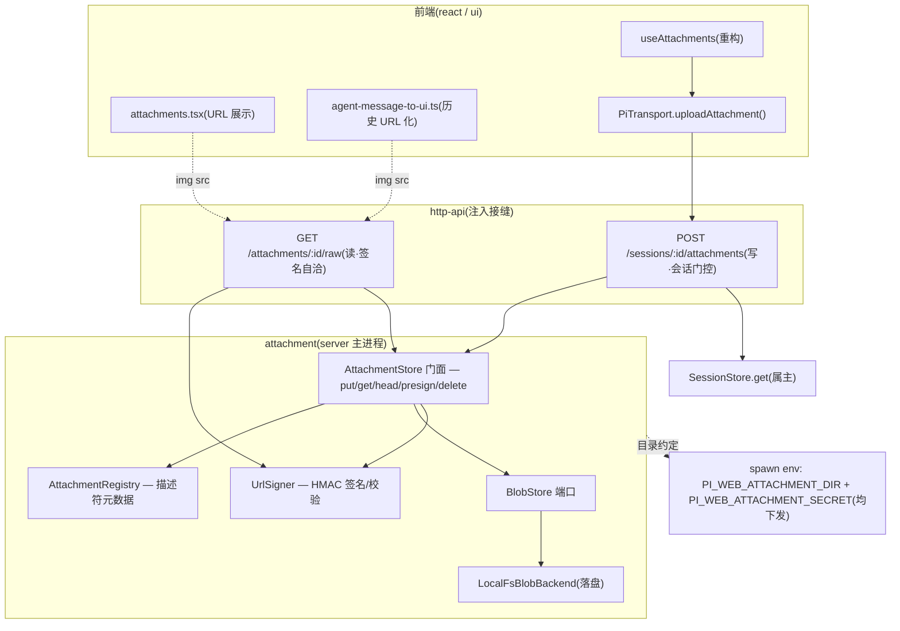
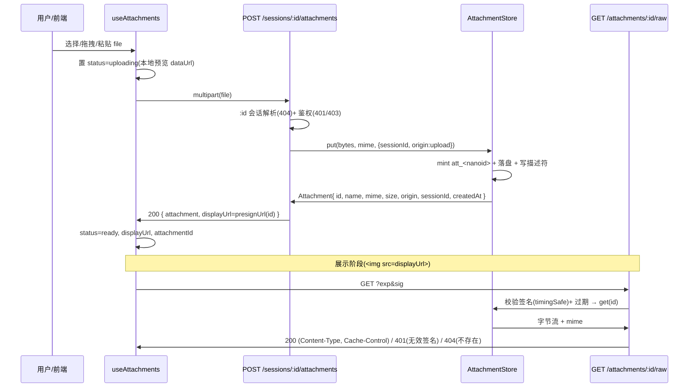

# 技术设计文档 — attachment-store

## Overview

**Purpose**:本特性为 pi-web 引入**可持久化、可插拔后端的附件对象存储**(L0)与**统一附件描述符/公开 id**(L1),并打通**上传落库**与**网络 URL 分发**两条 HTTP 路径,使前端从「内存 base64」迁移到「上传拿正式 id、用 URL 展示」。它是「附件系统」波次的基础切片,为下游 `attachment-tool-bridge`(L2/L3)铸造同一 id 空间与同一后端实例化约定。

**Users**:聊天用户(添加/查看附件不再受内存 base64 之累、刷新后引用仍可用)、后端/平台工程师(获得 S3 风格可替换的对象存储与目录约定)。

**Impact**:把当前「`FileReader→dataUrl` 内存态、仅图片、提交抽裸 base64」改为「`POST /sessions/:id/attachments` 落库得 `att_<nanoid>` 描述符 + `GET /attachments/:id/raw` 签名 URL 展示」。**对 LLM 维持现状**:vision 仍发 base64(`toImageContents()` 保留),不动 `prompt({images})`。

### Goals
- 提供 S3 风格 `BlobStore` 端口 + `LocalFsBlobBackend` 实现,内容落盘持久化。
- 铸造不含字节、到处流通的 `Attachment` 描述符 + 不可枚举公开 id `att_<nanoid>`(仅 server `put()` 铸造)。
- 上传(写,会话域强鉴权)与分发(读,签名自洽 + 可缓存防枚举)两端点,并解耦上传与发消息。
- 前端 `useAttachments` 重构为上传拿 id、URL 展示;历史回显由 base64 改 URL 引用(保留遗留 base64 渲染防回归)。
- 单元/集成测试 + 浏览器 e2e(隔离 build),以新鲜运行证据证明。

### Non-Goals
- L2 `resolve` 句柄、`AgentTool` 接入、tool `execute`、tool-output 落库回流(→ `attachment-tool-bridge`)。
- L3 context 闸门、智能意图路由(→ future)。
- 改造 base64→LLM 的 `prompt({images})`(维持现状)。
- S3/对象服务后端实现(接口预留,future)。
- runner 子进程侧 store 实例化与跨进程 `resolve`(本切片仅下发目录 env 约定)。
- 让 LLM「看」非图片(pi 协议不支持)。
- 孤儿对象 GC / 内容哈希去重(接口预留,本切片 `key=id`,不做去重与回收)。

## Boundary Commitments

### This Spec Owns
- 对象存储抽象 `BlobStore`(`put/get/head/presignUrl/delete`)+ 单一 `LocalFsBlobBackend` 实现。
- 公开 id 铸造(`att_<nanoid>`,仅写路径铸造,单一身份)。
- `Attachment` 描述符类型(不含字节)+ `AttachmentRegistry`(描述符元数据持久化,记 session 属主、origin=upload)。
- `POST /sessions/:id/attachments`(multipart 落库)与 `GET /attachments/:id/raw`(签名/缓存/防枚举)两路由,经 http-api 注入接缝挂载。
- 签名 URL 签发(`presignUrl`,本地后端可达,与 S3 presign 同形)。
- 前端 `useAttachments` 摄入/展示重构 + 历史回显 URL 化(保留遗留 base64 分支)。
- 附件存储目录约定 + 签名 secret 来源,并经 spawn env **同时下发** `PI_WEB_ATTACHMENT_DIR` + `PI_WEB_ATTACHMENT_SECRET`(仅下发,不在子进程实例化)。spawn env 透传(目录 + secret)整体归本 spec 拥有;`attachment-tool-bridge` 不编辑该 spawn env,只校验子进程已收到。
- 内部复用面(冻结为跨 spec 契约):`AttachmentStore` 门面新增只读访问器 `localPath(id)`/`listBySession(sessionId)`;`getReadStream` 的 meta 统一为导出的 `BlobMeta`;并导出 `AttachmentStore`(门面类型)/`PutInput`/`BlobStore`/`AttachmentRegistry`/`LocalFsBlobBackend`/`BlobMeta`/`attachmentStoreConfigFromEnv`/`UrlSigner` 作为受认可的复用面,供 `attachment-tool-bridge` 在子进程内组合实例化。

### Out of Boundary
- L2 `resolve`(path/url/bytes/localPath)、`AgentTool.content` 接入、tool 执行与产出物回流 —— `attachment-tool-bridge`。
- L3 context 闸门、智能意图路由 —— future。
- `prompt({images})` / base64→LLM 链路改造 —— 维持现状。
- runner 子进程内 store 实例化、跨进程凭证/共享 —— `attachment-tool-bridge`(本切片仅留 env 接缝)。
- pi transcript 内的 base64(pi 子进程持有,属 pi/tool-bridge 域)。
- S3 后端实现、孤儿 GC、内容哈希去重 —— future(接口预留)。

### Allowed Dependencies
- **http-api**:`createPiWebHandler({ routes })` 注入接缝、`Router` 的 `:id` 会话解析 + `authResolver`/`authorizeSession` 门控、`RequestContext`/`InjectedRoute`/`RouteHandler` 契约。
- **session-engine**:`SessionStore.get(id)`(属主校验)、`PiSession.cwd`(会话工作目录,作目录归属参考)。
- **protocol**:zod DTO 风格(`@pi-web/protocol`,新增 `Attachment`/上传响应 DTO)。
- **react-client / ui-components**:`useAttachments`、`attachments.tsx`、`pi-chat.tsx`、`agent-message-to-ui.ts`(在其上重构)。
- **session-store-adapters**:仅**接口风格对齐**(异步 `verb+noun`、`instanceof` 错误、后端经配置选择),不复用其存储实例。
- **node:crypto**:`randomBytes`(id)、`createHmac`/`timingSafeEqual`(签名)。零新第三方依赖(不引入 nanoid)。

### Revalidation Triggers
- `Attachment` 描述符形态或公开 id 格式变更 → 下游 `attachment-tool-bridge` 需重校(同一 id 空间)。
- `BlobStore` 接口签名或 `BlobMeta` 形态变更(尤其 `presignUrl`/`localPath`/`bytes` accessor、`getReadStream` 的 meta 类型) → tool-bridge 需重校。
- `AttachmentStore` 门面只读访问器契约变更(`localPath(id)`/`listBySession(sessionId)`) → tool-bridge 需重校(已冻结为复用面)。
- **盘上布局契约**:LocalFs 后端落盘布局为 `<root>/<key>`、`key=id`(平铺) → 下游 `attachment-tool-bridge` 的 `localPath` 依赖此布局;变更该布局或 `key=id` 约定需重校。
- 存储目录或签名 secret env 约定名/语义变更(`PI_WEB_ATTACHMENT_DIR` / `PI_WEB_ATTACHMENT_SECRET`) → 子进程共享(同一目录 + 同一 secret)需重校。
- spawn env 透传范围变更(谁下发目录/secret) → tool-bridge 需重校(透传归本 spec 拥有,子进程只校验收到)。
- 上传/分发路由路径或签名方案变更 → 前端 + 下游需重校。
- 写路径鉴权门控来源变更(若不再走 `:id` 会话门控) → 安全边界需重校。

## Architecture

### Existing Architecture Analysis
- **http-api**:`createPiWebHandler(opts)` 接收 `routes?: InjectedRoute[]`;`Router.route(req)` 统一做版本校验 → basePath 剥离 → `:id` 模板匹配 → `authResolver`(401)→ `:id` 会话存在性(404)→ `authorizeSession`(403)→ `handler(ctx)`。`RouteHandler=(ctx:RequestContext)=>Promise<Response>`,返回标准 Web `Response`。注入工厂既有范式:`createConfigRoutes()→InjectedRoute[]`,在 `lib/app/pi-handler.ts` 的 `routes:[...]` 装配。
- **前端**:`useAttachments` 内存态 `PendingAttachment{id:"att-N",name,mimeType,dataUrl}`;`pi-chat.tsx` 提交 `sendMessage({text},{body:{images}})`;`agent-message-to-ui.ts` 把 `image` part 重建 `data:` URL。
- **spawn**:`assemble-spawn.ts` 经 `buildEnv` 下发目录约定(`PI_CODING_AGENT_DIR` 最后写防覆盖),即既有「目录经 env 下发」范式。
- **保留的集成点**:`:id` 会话门控、`InjectedRoute`/`RouteHandler` 契约、`useAttachments` 对外 API 形状(尽量向后兼容)、`toImageContents()`(vision 维持现状)。

### Architecture Pattern & Boundary Map



**Architecture Integration**:
- **Selected pattern**:Ports & Adapters。`BlobStore` 端口 + `LocalFsBlobBackend` 适配器;`AttachmentRegistry` 管描述符;`AttachmentStore` 门面组合并在 `put()` 内铸造公开 id。与 `session-store-adapters` 同构。
- **Domain/feature boundaries**:字节(BlobStore)与元数据(Registry)分离 → 守「描述符不含字节」;写路径(会话域强鉴权)与读路径(签名自洽可缓存)分离。
- **Existing patterns preserved**:`InjectedRoute` 注入、`:id` 会话门控、标准 `Response`、spawn env 目录下发、`toImageContents()` 现状。
- **New components rationale**:`AttachmentStore`/`BlobStore`/`LocalFsBlobBackend`/`AttachmentRegistry`/`UrlSigner` 为持久化与签名所必需;`createAttachmentRoutes` 为接入接缝;前端改造为 URL 展示所必需。
- **Steering compliance**:接口外置/可插拔(roadmap「本地先行、S3 留缝」)、三不变式之单一身份 + 先落库后引用、e2e 新鲜证据 + 隔离 build。

### Technology Stack

| Layer | Choice / Version | Role in Feature | Notes |
|-------|------------------|-----------------|-------|
| Frontend / CLI | `@pi-web/react`(useAttachments)+ `@pi-web/ui`(attachments.tsx/pi-chat) | 上传摄入 + URL 展示 + 历史回显 | 保留 `toImageContents()` 发 base64 |
| Backend / Services | `@pi-web/server`(新增 `attachment/` 模块 + `http/routes/attachment-routes.ts`)| 对象存储 + 上传/分发路由 | 经 `createPiWebHandler({routes})` 注入 |
| Data / Storage | `LocalFsBlobBackend`(node:fs/promises)+ Registry(JSON 旁路)| 字节落盘 + 描述符持久化 | S3 端口预留,`key=id`(本切片不去重) |
| Messaging / Events | — | — | 无 |
| Infrastructure / Runtime | `node:crypto`(randomBytes/HMAC)、Web `Request.formData()` | id 生成 + 签名 + multipart 解析 | 零新第三方依赖 |

## File Structure Plan

### Directory Structure
```
packages/protocol/src/
└── attachment/
    └── attachment-dto.ts          # Attachment 描述符 + 上传响应 DTO(zod schema + 类型)；barrel 导出

packages/server/src/attachment/    # L0+L1 对象存储(server 主进程)
├── blob-store.ts                  # BlobStore 端口接口 + 错误类型(BlobNotFoundError)
├── local-fs-backend.ts            # LocalFsBlobBackend：字节落盘/读流/删除
├── url-signer.ts                  # UrlSigner：HMAC 签名 + timingSafeEqual 校验 + 过期
├── attachment-registry.ts         # 描述符元数据持久化(JSON 旁路)+ 查询
├── attachment-store.ts            # AttachmentStore 门面：put 内铸造 att_<nanoid> + 组合 blob/registry/signer
├── id.ts                          # mintAttachmentId() → "att_"+randomBytes(16).base64url
├── config.ts                      # attachmentStoreConfigFromEnv()：解析 PI_WEB_ATTACHMENT_DIR/SECRET，构造后端
└── index.ts                       # barrel：类型 + 工厂导出（含复用面 AttachmentStore/PutInput/BlobStore/AttachmentRegistry/LocalFsBlobBackend/BlobMeta/UrlSigner/attachmentStoreConfigFromEnv）

packages/server/src/http/routes/
└── attachment-routes.ts           # createAttachmentRoutes(store)→InjectedRoute[]：上传(写) + 分发(读)两 handler

packages/react/src/
├── transport/
│   └── attachment-upload.ts       # uploadAttachment(sessionId,file)→Attachment(POST multipart)
└── hooks/use-attachments.ts       # (改)上传拿 id + status 态 + displayUrl
```

### Modified Files
- `packages/server/src/http/index.ts` / `packages/server/src/index.ts` — 导出 `createAttachmentRoutes`、`attachmentStoreConfigFromEnv`、attachment 类型(barrel),并导出受认可的复用面 `AttachmentStore`(门面类型) / `PutInput` / `BlobStore` / `AttachmentRegistry` / `LocalFsBlobBackend` / `BlobMeta` / `UrlSigner` 供 `attachment-tool-bridge` 在子进程内组合实例化。
- `lib/app/pi-handler.ts` — 实例化 `AttachmentStore`(`attachmentStoreConfigFromEnv()`),`routes:[...]` 追加 `...createAttachmentRoutes(store)`;在 `createChannel` 的 spawn `env` 透传 `PI_WEB_ATTACHMENT_DIR + PI_WEB_ATTACHMENT_SECRET`(均下发:目录约定 + 签名 secret,使子进程与主进程共享同一后端目录且签名 secret 一致)。此 spawn env 透传(目录 + secret)整体归 attachment-store 拥有;下游 `attachment-tool-bridge` 不编辑该 spawn env,只校验子进程已收到。
- `packages/protocol/src/index.ts` — 导出 attachment DTO。
- `packages/react/src/hooks/use-attachments.ts` — 重构:注入 `upload`、异步 `add()`、`PendingAttachment` 扩展 `attachmentId?`/`status`/`displayUrl`;`toImageContents()` 保留。
- `packages/react/src/index.ts` — 导出 `uploadAttachment` / 类型。
- `packages/ui/src/elements/attachments.tsx` — 缩略图/预览改用 `displayUrl`(回退 `dataUrl`);呈现 `uploading`/`error` 态。
- `packages/ui/src/chat/pi-chat.tsx` — `onAddAttachments` 接异步上传;提交沿用 `toImageContents()`(现状),并以正式 id 作引用(为下游预留)。
- `packages/react/src/transport/agent-message-to-ui.ts` — `image` part 有公开 id→分发 URL;无 id 遗留 base64→保留 `data:` 重建(Req 6.3)。
- `e2e/browser/attachment-store.e2e.ts`(新增)— 浏览器 e2e:添加→上传落库→URL 展示。
- `packages/server/test/attachment/*.test.ts`、`packages/react/test|src/**`(新增)— 单元/集成测试。

## System Flows

### 上传(写路径)与分发(读路径)

- 写路径门控落在 `:id`(会话不存在 404 / 越权 403);无有效文件部分 → 400(Req 3.4)。
- 读路径**不**绑会话:签名自洽校验;签名缺失/无效/过期 → 401(Req 4.3);id 不存在 → 404 且响应不区分「无此 id」与「签名不符」以防枚举(Req 4.4)。

## Requirements Traceability

| Requirement | Summary | Components | Interfaces | Flows |
|-------------|---------|------------|------------|-------|
| 1.1 | S3 风格五能力接口 | BlobStore | `put/get/head/presignUrl/delete` | — |
| 1.2 | 本地后端默认实现 | LocalFsBlobBackend | BlobStore impl | 写/读 |
| 1.3 | 落盘 + 稳定标识 + 重启可读 | LocalFsBlobBackend, AttachmentStore | `put` | 写 |
| 1.4 | 按 id 读内容流 + mime | LocalFsBlobBackend | `get` | 读 |
| 1.5 | 未找到可类型识别 | BlobNotFoundError | `get`/`head` | 读 |
| 1.6 | 多 accessor 雏形(stream+url)+ meta 统一为导出 BlobMeta | BlobStore, AttachmentStore | `getReadStream`/`presignUrl` + `BlobMeta` | 读 |
| 1.7 | 门面一等只读访问器 localPath(盘上路径,复用契约) | AttachmentStore, LocalFsBlobBackend | `localPath` | — |
| 1.8 | 接口风格对齐 session-store | BlobStore, AttachmentRegistry | 异步 verb+noun + instanceof 错误 | — |
| 2.1 | 描述符字段 | Attachment DTO, AttachmentRegistry | `Attachment` | — |
| 2.2 | 描述符不含字节 | Attachment DTO | `Attachment` | — |
| 2.3 | 写路径铸造 att_<nanoid> 不可枚举 | id.ts, AttachmentStore | `mintAttachmentId`/`put` | 写 |
| 2.4 | 仅 server 铸造正式 id | AttachmentStore, useAttachments | `put` | 写 |
| 2.5 | 单一身份唯一 | AttachmentRegistry | `put`/`head` | — |
| 2.6 | key 可后置哈希,本切片 key=id | LocalFsBlobBackend | `put` | — |
| 2.7 | 门面一等只读访问器 listBySession(复用契约) | AttachmentStore, AttachmentRegistry | `listBySession` | — |
| 3.1 | multipart 落库记属主 origin=upload | attachment-routes(上传), AttachmentStore | `POST` handler | 写 |
| 3.2 | 响应返回描述符字段 | Attachment DTO, 上传 handler | 上传响应 DTO | 写 |
| 3.3 | 复用会话解析 + 鉴权门控 | Router(:id), 上传 handler | RequestContext | 写 |
| 3.4 | 无有效文件→4xx | 上传 handler | formData 校验 | 写 |
| 3.5 | 发消息只带引用 | useAttachments, pi-chat | — | — |
| 4.1 | 有效签名→正确 mime 字节 | 分发 handler, LocalFsBlobBackend | `GET` handler/`get` | 读 |
| 4.2 | 缓存头 | 分发 handler | Cache-Control | 读 |
| 4.3 | 无/失效签名→401 | UrlSigner, 分发 handler | `verify` | 读 |
| 4.4 | 不存在→404 防枚举 | UrlSigner, 分发 handler | `verify`/`head` | 读 |
| 4.5 | 本地可达 URL,与 S3 presign 同形 | UrlSigner, AttachmentStore | `presignUrl` | 读 |
| 4.6 | 稳定 secret 来源(env),主/子进程一致 | UrlSigner, config.ts, pi-handler | `PI_WEB_ATTACHMENT_SECRET` | — |
| 5.1 | 添加即上传拿正式 id | useAttachments, attachment-upload | `uploadAttachment` | 写 |
| 5.2 | 列表/缩略图用 URL 非 base64 | attachments.tsx, useAttachments | `displayUrl` | 展示 |
| 5.3 | 提交以正式 id 引用 | pi-chat, useAttachments | — | — |
| 5.4 | 上传中可感知状态 | useAttachments, attachments.tsx | `status` | 写 |
| 5.5 | 上传失败告知且不当作已落库 | useAttachments, attachments.tsx | `status=error` | 写 |
| 5.6 | 仅接受 server 返回的正式 id | useAttachments | — | — |
| 6.1 | 历史按引用走 URL 非重建 base64 | agent-message-to-ui | — | 展示 |
| 6.2 | 已落库以分发 URL 呈现 | agent-message-to-ui | `presignUrl` | 展示 |
| 6.3 | 遗留内联 base64 仍渲染 | agent-message-to-ui | data: 回退 | 展示 |
| 7.1 | store 在主进程实例化 | pi-handler, config.ts | `attachmentStoreConfigFromEnv` | — |
| 7.2 | 明确目录约定 | config.ts | `PI_WEB_ATTACHMENT_DIR` | — |
| 7.3 | 经 spawn env 同时下发目录 + secret(仅下发) | pi-handler(createChannel env) | env 透传(DIR+SECRET) | — |
| 7.4 | 不在子进程实例化/跨进程 resolve | (边界,不实现) | — | — |
| 8.1 | 单元/集成测试 | test/attachment/* | — | — |
| 8.2 | 浏览器 e2e 全链路 | e2e/browser/attachment-store.e2e.ts | — | 写+展示 |
| 8.3 | 隔离 build 不污染 dev | playwright/NEXT_DIST_DIR | — | — |
| 8.4 | 新鲜运行证据 | (执行约定) | — | — |

## Components and Interfaces

| Component | Domain/Layer | Intent | Req Coverage | Key Dependencies (P0/P1) | Contracts |
|-----------|--------------|--------|--------------|--------------------------|-----------|
| BlobStore | Storage 端口 | S3 风格五能力接口 + 导出 BlobMeta | 1.1,1.5,1.6,1.8 | node:fs(P0) | Service |
| LocalFsBlobBackend | Storage 适配器 | 字节落盘/读流/删除 + 盘上路径 | 1.2,1.3,1.4,1.6,1.7,2.6 | BlobStore(P0) | Service |
| AttachmentRegistry | L1 元数据 | 描述符持久化 + 查询 | 2.1,2.2,2.5,2.7 | fs(P0) | Service, State |
| UrlSigner | 安全 | HMAC 签名/校验/过期 + 稳定 secret 来源 | 4.3,4.4,4.5,4.6 | node:crypto(P0) | Service |
| AttachmentStore | 门面 | put 铸造 id + 组合 + 只读访问器(localPath/listBySession) | 1.3,1.6,1.7,2.3,2.4,2.5,2.7,4.5 | BlobStore/Registry/Signer/id(P0) | Service |
| Attachment DTO | protocol | 描述符 + 上传响应 zod | 2.1,2.2,3.2 | zod(P0) | API/State |
| attachment-routes | http-api | 上传(写)+ 分发(读)handler | 3.1-3.4,4.1-4.4 | AttachmentStore(P0), Router(P0) | API |
| uploadAttachment | react transport | 客户端 multipart 上传 | 5.1,3.5 | fetch(P0) | API |
| useAttachments(改) | react hook | 上传拿 id + status + URL | 5.1-5.6,2.4 | uploadAttachment(P0) | State |
| attachments.tsx(改) | ui | URL 展示 + status 呈现 | 5.2,5.4,5.5 | useAttachments(P1) | — |
| agent-message-to-ui(改) | react transport | 历史 URL 化 + 遗留回退 | 6.1,6.2,6.3 | presignUrl(P1) | — |

### Storage 层

#### BlobStore / LocalFsBlobBackend
| Field | Detail |
|-------|--------|
| Intent | S3 风格对象存储端口 + 本地适配器 |
| Requirements | 1.1, 1.2, 1.3, 1.4, 1.5, 1.6, 1.7, 1.8, 2.6 |

**Responsibilities & Constraints**
- 仅负责**字节**:写入/读流/元信息/删除;不知 `Attachment` 描述符语义。
- `put` 返回存储 key(本切片 `key=id`,由门面传入);未来可后置内容哈希。
- 数据所有权:落盘文件;不变式 — 内容持久化,进程重启后可读。

**Contracts**: Service [x]

##### Service Interface
```typescript
// packages/server/src/attachment/blob-store.ts
export interface BlobMeta {
  readonly mimeType: string;
  readonly size: number;
}
export interface BlobStore {
  /** 写入字节，返回存储 key（本切片由调用方传入 key=公开 id）。 */
  put(key: string, body: Uint8Array | NodeJS.ReadableStream, meta: BlobMeta): Promise<void>;
  /** 读取为可读流 + 元信息；不存在抛 BlobNotFoundError。 */
  getReadStream(key: string): Promise<{ stream: NodeJS.ReadableStream; meta: BlobMeta }>;
  /** 元信息；不存在抛 BlobNotFoundError。 */
  head(key: string): Promise<BlobMeta>;
  /** 客户端可达 URL（本地后端 = 签名 /raw URL；S3 = presign，同形）。 */
  presignUrl(key: string, opts?: { expiresInMs?: number }): Promise<string>;
  delete(key: string): Promise<void>;
}
export class BlobNotFoundError extends Error { constructor(public readonly key: string) { super(`blob not found: ${key}`); } }
```
- Preconditions:`put` 的 key 唯一(门面保证)。
- Postconditions:`getReadStream`/`head` 对已 `put` 的 key 返回一致 mime/size。
- Invariants:落盘内容不可变;`key=id` 时一一对应(单一身份)。

**Implementation Notes**
- LocalFs:落 `<root>/<key>` 字节 + `<root>/<key>.meta.json`(mime/size);root = `PI_WEB_ATTACHMENT_DIR`。盘上布局 `<root>/<key>`、`key=id` 冻结为跨 spec 契约(下游 `localPath` 依赖),后端暴露 `<root>/<id>` 绝对路径解析供门面 `localPath(id)` 复用。
- `presignUrl` 委托 `UrlSigner` 产 `/attachments/:key/raw?exp&sig`。
- Risks:大文件流式写;`put` 用流避免全量入内存。

#### AttachmentRegistry
| Field | Detail |
|-------|--------|
| Intent | `Attachment` 描述符(不含字节)持久化与查询 |
| Requirements | 2.1, 2.2, 2.5, 2.7 |

**Contracts**: Service [x] / State [x]
```typescript
// packages/server/src/attachment/attachment-registry.ts
export interface AttachmentRegistry {
  save(att: Attachment): Promise<void>;
  get(id: string): Promise<Attachment | undefined>;
  listBySession(sessionId: string): Promise<Attachment[]>;
}
```
- Invariants:同一 id 仅一条描述符(单一身份);描述符不含字节(`Attachment` 类型本身排除)。
- 实现:本地以 `<root>/<id>.att.json` 或集中索引持久化;读路径 `get` 供分发 handler 取 mime/属主。

#### UrlSigner
| Field | Detail |
|-------|--------|
| Intent | 防枚举签名 URL 的签发与校验 |
| Requirements | 4.3, 4.4, 4.5, 4.6 |

**Contracts**: Service [x]
```typescript
// packages/server/src/attachment/url-signer.ts
export interface UrlSigner {
  sign(id: string, expiresInMs: number): { exp: number; sig: string };
  /** 校验 id|exp 的 HMAC（timingSafeEqual）并检查未过期；失败返回 false。 */
  verify(id: string, exp: number, sig: string): boolean;
}
```
- 实现:`createHmac("sha256", secret).update(`${id}.${exp}`)`;`verify` 用 `timingSafeEqual` + `exp >= now`。
- secret 来源(稳定来源):优先读取 `PI_WEB_ATTACHMENT_SECRET` 环境变量。当存在 runner 子进程共享同一后端的场景时,secret 必须稳定且主/子进程一致 —— 否则子进程产出的 tool-output `/raw` 签名 URL 会在主进程校验时 401。仅在「无子进程共享的纯单进程」场景下可回退到进程启动随机 `randomBytes(32)`;该随机回退在附件-tool(子进程共享)场景下不可用,故 store 经 spawn env 同时下发目录与 secret 以保证一致。

#### AttachmentStore(门面)
| Field | Detail |
|-------|--------|
| Intent | 组合 Blob/Registry/Signer;`put` 内铸造公开 id;暴露只读访问器 localPath/listBySession |
| Requirements | 1.3, 1.6, 1.7, 2.3, 2.4, 2.5, 2.7, 4.5 |

**Contracts**: Service [x]
```typescript
// packages/server/src/attachment/attachment-store.ts
export interface PutInput {
  readonly bytes: Uint8Array | NodeJS.ReadableStream;
  readonly name: string;
  readonly mimeType: string;
  readonly size: number;
  readonly sessionId: string;
  readonly origin: AttachmentOrigin; // 前端上传路径仅产 "upload"；origin 由调用方传入（tool-output 由 attachment-tool-bridge 经同一 put 写入）
}
export interface AttachmentStore {
  put(input: PutInput): Promise<Attachment>;          // 铸造 att_<nanoid> + 落盘 + 写描述符
  head(id: string): Promise<Attachment | undefined>;
  getReadStream(id: string): Promise<{ stream: NodeJS.ReadableStream; meta: BlobMeta }>; // meta 统一为导出的 BlobMeta
  /** 一等只读访问器：返回该附件在本地后端的盘上绝对路径（LocalFs 后端 = <root>/<id>）；非本地后端返回 undefined 或留待后端实现。复用面，冻结为跨 spec 契约。 */
  localPath(id: string): Promise<string | undefined>;
  /** 一等只读访问器：按会话属主列出附件（由 AttachmentRegistry.listBySession 提升到门面）。复用面。 */
  listBySession(sessionId: string): Promise<Attachment[]>;
  presignUrl(id: string, opts?: { expiresInMs?: number }): Promise<string>;
  verifyUrl(id: string, exp: number, sig: string): boolean;
  delete(id: string): Promise<void>;
}
```
- Preconditions:`put` 的 `origin` 由调用方传入,store 不对取值设限;前端上传路径仅产生 `"upload"`,`tool-output` 由 `attachment-tool-bridge` 经**同一** `put` 写入(枚举已含 `tool-output`,见 `PutInput.origin: AttachmentOrigin`)。
- Postconditions:返回的 `Attachment.id` 形如 `att_<base64url>`,已落库可经 `presignUrl` 取;`localPath` 对 LocalFs 后端返回 `<root>/<id>` 绝对路径。
- Invariants:公开 id 仅在 `put` 内铸造(Req 2.4 单一身份/server 铸造)。
- **受认可的复用面**:store 导出 `AttachmentStore`(门面类型) / `PutInput` / `BlobStore` / `AttachmentRegistry` / `LocalFsBlobBackend` / `BlobMeta` / `attachmentStoreConfigFromEnv` / `UrlSigner`,供 `attachment-tool-bridge` 在 runner 子进程内组合实例化(避免下游另起内联类型);bridge 的 `ChildAttachmentStore` 即 `AttachmentStore` 门面别名,`putOutput` 经此处导出的 `PutInput` 形状调用 `put`;`getReadStream` 的 meta 即此处导出的 `BlobMeta`。

### protocol 层

#### Attachment DTO
**Contracts**: API [x] / State [x]
```typescript
// packages/protocol/src/attachment/attachment-dto.ts
export const AttachmentOriginSchema = z.enum(["upload", "tool-output"]); // tool-output 预留给下游
export const AttachmentSchema = z.object({
  id: z.string(),                 // att_<nanoid>
  name: z.string(),
  mimeType: z.string(),
  size: z.number().int().nonnegative(),
  origin: AttachmentOriginSchema,
  sessionId: z.string(),
  createdAt: z.string(),          // ISO 8601
});
export type Attachment = z.infer<typeof AttachmentSchema>;
export type AttachmentOrigin = z.infer<typeof AttachmentOriginSchema>;

export const UploadAttachmentResponseSchema = z.object({
  attachment: AttachmentSchema,
  displayUrl: z.string(),         // 即时签名分发 URL
});
export type UploadAttachmentResponse = z.infer<typeof UploadAttachmentResponseSchema>;
```
- 与既有 `rest-dto.ts` 同风格(zod schema + `z.infer` 类型 + barrel 导出)。

### http-api 层

#### attachment-routes
**Contracts**: API [x]

##### API Contract
| Method | Endpoint | Request | Response | Errors |
|--------|----------|---------|----------|--------|
| POST | `/sessions/:id/attachments` | multipart/form-data(`file`) | `UploadAttachmentResponse` | 400(无文件), 401, 403, 404(会话) |
| GET | `/attachments/:id/raw?exp&sig` | — | 字节流(`Content-Type`+`Cache-Control`) | 401(签名), 404(不存在) |

```typescript
// packages/server/src/http/routes/attachment-routes.ts
export function createAttachmentRoutes(store: AttachmentStore): InjectedRoute[];
```
- 上传 handler:`ctx.req.formData()` 取 `file`(无→400);从会话 `ctx.sessionId` 记属主、`origin:"upload"`;`store.put(...)` → 200 `{ attachment, displayUrl: await store.presignUrl(id) }`。会话门控由 `:id` 路由天然提供(Req 3.3)。
- 分发 handler:解析 `exp`/`sig`,`store.verifyUrl(id,exp,sig)` 失败→401;`store.head(id)` 不存在→404(与签名失败响应不可区分语义以防枚举);成功→流式 `Response`(`Content-Type=mime`,`Cache-Control: private, max-age=...`)。

### 前端层

#### uploadAttachment / useAttachments(改)
**Contracts**: API [x] / State [x]
```typescript
// packages/react/src/transport/attachment-upload.ts
export async function uploadAttachment(
  baseUrl: string, sessionId: string, file: File,
): Promise<UploadAttachmentResponse>;  // POST multipart → 解析 zod

// use-attachments.ts（扩展，向后兼容现有调用）
interface PendingAttachment {
  readonly id: string;                // 本地行 key（保留）
  readonly name: string;
  readonly mimeType: string;
  readonly dataUrl: string;           // 上传前本地预览 + toImageContents() 现状
  readonly status: "uploading" | "ready" | "error";  // 新增
  readonly attachmentId?: string;     // 新增：server 铸造的 att_<nanoid>（status=ready 才有）
  readonly displayUrl?: string;       // 新增：分发 URL（展示用）
}
```
- `add()` 改异步:读 dataUrl(本地预览)→ 置 `uploading` → `uploadAttachment` → 成功置 `ready`+`attachmentId`+`displayUrl`;失败置 `error`(Req 5.4/5.5)。`toImageContents()` 保留(vision 现状,Req 3.5 发消息不内联字节由展示侧解耦体现)。
- 仅 `attachmentId`(server 返回)视为正式落库引用(Req 2.4/5.6)。

**Implementation Notes**
- attachments.tsx:缩略图 `src = item.displayUrl ?? item.dataUrl`;`uploading` 显进度/`error` 显失败标记。
- agent-message-to-ui.ts:image part 携带公开 id → 用分发 URL;否则遗留 base64 → 保留 `data:` 重建(Req 6.3)。
- pi-handler.ts:实例化 store + 注入路由 + spawn env 同时透传 `PI_WEB_ATTACHMENT_DIR` + `PI_WEB_ATTACHMENT_SECRET`(Req 7.1/7.3,均下发以保证子进程与主进程共享同一目录且签名 secret 一致,不在子进程实例化 — Req 7.4)。该 spawn env 透传归本 spec 拥有。

## Data Models

### Logical Data Model
- **Attachment**(描述符,不含字节):`id`(PK,`att_<nanoid>`)、`name`、`mimeType`、`size`、`origin`、`sessionId`(→ session 属主)、`createdAt`。
- **Blob**(字节对象):`key`(= id,本切片)→ 内容 + `BlobMeta{mimeType,size}`。
- 引用完整性:每个 `Attachment.id` 对应唯一 Blob key;`sessionId` 指向 session(属主),session 删除不级联删附件(本切片不做 GC)。

### Physical Data Model(LocalFs)
```
$PI_WEB_ATTACHMENT_DIR/
├── <att_id>            # 字节内容
├── <att_id>.meta.json  # { mimeType, size }
└── <att_id>.att.json   # Attachment 描述符(或集中索引)
```
- key 设计:本切片 `key=id`(平铺);可后置内容哈希/分桶(future,不改对外 id)。

### API Data Transfer
- 上传请求:`multipart/form-data`,字段 `file`。
- 上传响应:`UploadAttachmentResponse`(zod 校验)。
- 分发响应:`application/octet-stream`/具体 mime 的字节流 + `Cache-Control`。

## Error Handling

### Error Strategy
- 复用 http-api 既有 `errorResponse(status, code, msg)` 风格;前端上传失败映射为附件行 `status=error`。

### Error Categories and Responses
- **User Errors (4xx)**:上传无 `file` 部分 → 400 `NO_FILE`;分发签名缺失/无效/过期 → 401 `INVALID_SIGNATURE`;附件不存在 → 404 `ATTACHMENT_NOT_FOUND`(与签名失败语义对齐防枚举);会话不存在/越权 → 404/403(Router 门控)。
- **System Errors (5xx)**:落盘/读流 IO 失败 → 500(handler try/catch → `INTERNAL`);`BlobNotFoundError`/registry 未命中映射为 404 而非 500。
- **业务不变式**:`put` 内 id 铸造与落库原子性 — 描述符写入失败时不暴露半落库引用(先落 blob 再写描述符,失败回滚或不返回 id)。

### Monitoring
- 不新增可观测面(沿用既有日志);secret 与签名内容不入日志(安全)。

## Testing Strategy

### Unit Tests
1. `mintAttachmentId()` — 产 `att_` 前缀、URL-safe、唯一(多次不重复)、不可顺序枚举(Req 2.3)。
2. `UrlSigner.sign/verify` — 有效签名通过;篡改 id/exp/sig 失败;过期失败;`timingSafeEqual`(Req 4.3/4.5)。
3. `LocalFsBlobBackend` — `put`→`getReadStream`/`head` 往返一致 mime/size;`get` 不存在抛 `BlobNotFoundError`;重启(新实例同 root)后可读(Req 1.2/1.3/1.4/1.5)。
4. `AttachmentStore.put` — 铸造 id + 落盘 + 写描述符;返回不含字节的 `Attachment`;`head`/`presignUrl` 自洽;`localPath(id)` 返回 `<root>/<id>`、`listBySession` 经门面列出属主附件;`getReadStream` 的 meta 为导出的 `BlobMeta`(Req 1.3/1.6/1.7/2.7/2.x)。
5. `AttachmentRegistry` — 同 id 单条;`listBySession` 过滤属主(Req 2.5/2.1/2.7)。
6. `UrlSigner` 稳定 secret — 同一 `PI_WEB_ATTACHMENT_SECRET` 构造的两个 signer 互验通过(模拟主/子进程一致),secret 不一致则校验失败(Req 4.6)。

### Integration Tests
1. 上传 handler — multipart `file` → 200 `{attachment,displayUrl}`,描述符记 `origin:upload`+`sessionId`;无 `file` → 400(Req 3.1/3.2/3.4)。
2. 上传 handler 门控 — 会话不存在 → 404、越权 → 403(经 `createPiWebHandler` + Router 装配)(Req 3.3)。
3. 分发 handler — 有效签名 → 正确 mime 字节 + `Cache-Control`;无/过期签名 → 401;不存在 id → 404 防枚举(Req 4.1/4.2/4.3/4.4)。
4. `attachmentStoreConfigFromEnv` — 解析 `PI_WEB_ATTACHMENT_DIR`/`PI_WEB_ATTACHMENT_SECRET` 构造后端(secret 取自稳定来源);`pi-handler` spawn env 同时透传目录约定与 secret,断言子进程 env 含两者且值与主进程一致(Req 7.1/7.2/7.3)。

### E2E/UI Tests(Playwright,隔离 build)
1. 添加附件(选择/拖拽)→ 上传中态可见 → 落库后缩略图以分发 URL(非 `data:`)展示;断言 `` 指向 `/attachments/.../raw` 且网络请求 200(Req 5.1/5.2/5.4/8.2)。
2. 提交携附件消息后历史回显以分发 URL 渲染(已落库),且遗留内联 base64 历史仍能渲染(Req 6.1/6.2/6.3)。
3. 上传失败路径(stub/拦截)→ 该附件标 error 且不可作为已落库引用提交(Req 5.5/5.6)。
- 运行约定:`NEXT_DIST_DIR=.next-e2e` 隔离 build + external server,不污染 dev `.next`(Req 8.3);以新鲜运行证据为准(Req 8.4)。

## Security Considerations
- **读路径防枚举**:`/raw` 用 HMAC 签名 URL(`id|exp`),`timingSafeEqual` 校验;不存在 id 与签名失败响应不泄露差异(Req 4.4)。
- **写路径强鉴权**:上传走 `:id` 会话门控(401/403/404),不绕开既有访问控制(Req 3.3)。
- **id 不可枚举**:`att_<base64url(16 bytes)>`,无序、不可推测(Req 2.3)。
- **secret 管理**:HMAC 签名 secret 来自稳定来源 `PI_WEB_ATTACHMENT_SECRET`,经 spawn env 与目录一并下发给 runner 子进程,保证主/子进程一致(否则子进程签名 URL 在主进程 401);仅纯单进程无共享场景可回退随机,该回退在附件-tool 场景不可用。secret/签名不入日志。
- **上传大小上限**:设上限并以 4xx 拒绝超限(防滥用),不在内存全量缓冲。

## Performance & Scalability
- 字节用流式 `put`/`getReadStream`,避免大文件全量入内存。
- `/raw` 带 `Cache-Control` 使重复展示可客户端缓存(Req 4.2),减少回源。
- 本切片单进程本地后端;S3/多实例为 future(接口已留 `presignUrl` 同形缝)。
