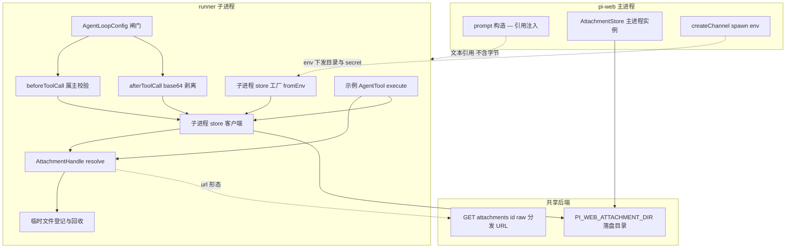
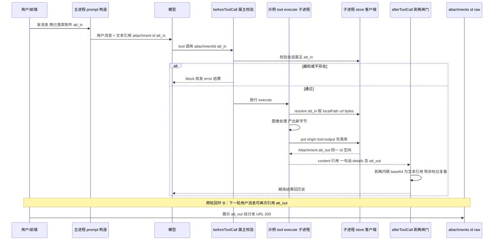

# 技术设计文档 — attachment-tool-bridge

## Overview

**Purpose**:本特性补全「附件系统」波次的 **L2 投影**与 **L3 context 闸门**,把 `attachment-store` 落库的附件接到 **runner 子进程**里的 server 端 tool:让 tool 以公开 id `resolve` 出它需要的形态(字节/流/本地路径/网络 URL),让 tool 产出物**先落库再以引用回流**(同一 id 空间,闭合跨轮回环),并以两个 pi 原生 hook 集中守住「属主校验」与「base64 仅具名出口」两条边界。

**Users**:server 端图像类 tool 的作者(图像编辑/放大/生成,从同一引用取数据、把产出物落库回流)、聊天用户(产出物回流到对话且可在下一轮再次引用、context 不被 base64 撑爆)、平台工程师(子进程与主进程指向同一后端、临时文件可回收)。

**Impact**:在 `attachment-store`(L0/L1,本切片复用其 `BlobStore`/`Attachment`/`att_<nanoid>`/`PI_WEB_ATTACHMENT_DIR`/`/raw`)之上,新增子进程侧 store 实例化、`AttachmentHandle.resolve`、`AgentTool` 接入范式与示例 tool、`beforeToolCall`/`afterToolCall` 两闸门、prompt 文本引用注入、tool-output 落库回流。**对 vision 维持现状**:上传图给 LLM 仍走 base64(`toImageContents()`),不改 `prompt({images})`;给 tool 的文件走显式 `attachmentId` 参数。**不做智能意图路由**(future)。

### Goals
- 提供 L2 `AttachmentHandle`:`resolve(id)` → `{ meta, bytes(), stream(), localPath(), url() }`;LocalFs `localPath()` 直返落盘路径,S3 懒下载临时文件(接口可切换,S3 实现 future)。
- 在 runner 子进程内按 spawn env 实例化 store 客户端,指向与主进程同一后端,**不回调主进程**。
- `AgentTool` 协议兼容接入(`description`/`details` 必填、回图 `data` 先 await 成 string)+ 至少一个端到端示例 tool(path/url/bytes 三种用法 + 产出回流)。
- `beforeToolCall` 属主校验(越权 `block`)+ `afterToolCall` base64 剥离闸门(默认剥成文本引用,标记需复看才保留)。
- prompt 文本引用注入(`[attachment id=… type=… name=…]`,只拼文本不内联字节)。
- tool-output 落库回流(`origin:"tool-output"`,同一 id 空间,先落库后引用)。
- 单元/集成测试 + 浏览器 e2e(隔离 build),以新鲜运行证据证明。

### Non-Goals
- L0 对象存储后端、L1 描述符/id 铸造、上传/分发端点、前端上传/摄入/展示重构 —— 属 `attachment-store`(复用,不重定义)。
- 智能意图路由(模型自决 / UI 显式标注)—— future。
- 改造 vision base64→LLM(`prompt({images})` 维持现状)。
- S3 后端真实实现(`resolve`/`localPath` 接口按可切换设计,S3 落地 future)。
- pi transcript 内已落 base64 的事后清理(pi 子进程持有不可逆;闸门只前移防御)。

## Boundary Commitments

### This Spec Owns
- **L2 投影**:`AttachmentHandle` 类型 + `resolve(id)`(`bytes/stream/localPath/url` 四形态;不含 base64 形态)。
- **临时文件生命周期**:懒下载临时文件登记 + 调用结束/会话结束两级回收(本切片 LocalFs 无临时文件,接口为 S3 预留)。
- **runner 子进程 store 客户端**:从 spawn env(`PI_WEB_ATTACHMENT_DIR` + secret)在子进程实例化、指向同一后端、不回调主进程的工厂;env 缺失降级。
- **`agent-kit` 暴露 store 给 tool**:tool 取得子进程 store 客户端的接入范式 + 至少一个端到端示例 tool。
- **两个 pi hook 闸门**:`beforeToolCall` 属主校验、`afterToolCall` base64 剥离;在 runner 装配 `AgentLoopConfig` 处接线。
- **tool-output 落库回流**:产出物 `store.put({origin:"tool-output"})` 先落库 + 以引用回流(同一 id 空间)。
- **prompt 文本引用注入**:主进程消息构造侧把附件以结构化文本标记注入用户消息(不内联字节)。

### Out of Boundary
- `BlobStore`/`LocalFsBlobBackend`/`AttachmentRegistry`/`UrlSigner`/`AttachmentStore` 门面/`attachmentStoreConfigFromEnv`/上传分发路由/前端上传展示 —— `attachment-store`(复用)。
- 智能意图路由、vision base64→LLM 改造、S3 后端真实实现 —— future。
- pi transcript 内已落 base64 的清理 —— 不可逆,不在范围。
- 公开 id 铸造算法、签名 secret 方案 —— `attachment-store` 拥有(本切片调用,不重定义)。

### Allowed Dependencies
- **attachment-store**:`BlobStore`/`LocalFsBlobBackend`/`AttachmentRegistry`/`UrlSigner`/`AttachmentStore` 门面(现含只读访问器 `localPath(id)`/`listBySession(sessionId)`)、`BlobMeta`(`getReadStream` 的 meta 类型)、`attachmentStoreConfigFromEnv()`、`Attachment`/`AttachmentOrigin`(含 `tool-output`)DTO、`PI_WEB_ATTACHMENT_DIR` + `PI_WEB_ATTACHMENT_SECRET`(均由 store 下发)、`/raw` 分发 URL 与 HMAC 签名。**严格复用上游受认可复用面,不重定义类型/不抠门面内部/不重新内联 meta**。
- **agent-runner**:`runner.ts`(`startRunner`→`createAgentSessionRuntime`→`runRpcMode`)、`option-mapper`(`customTools` 注入链路)、`agent-loader`(jiti + `@pi-web/agent-kit` 别名)、`assemble-spawn`(`buildEnv` spawn env 下发)、`AgentContext`。
- **agent-kit**:`defineAgent`/`defineTool`(re-export 自 `@earendil-works/pi-coding-agent`)。
- **session-engine**:会话属主校验、prompt/消息构造接缝 —— 具体落在 `packages/server/src/http/routes/command-routes.ts` 的 `makeMessagesHandler`(服务端发往 pi 的用户消息文本组装点,文本引用注入处;与既有 `resolveCompletions` 同链路)。
- **pi 协议**(`@earendil-works/pi-ai` / `pi-agent-core`):`AgentTool`/`Tool`/`TextContent`/`ImageContent`/`AgentToolResult`/`AgentLoopConfig`(`beforeToolCall`/`afterToolCall`)。在协议约束内接入,不扩展协议。
- **node:fs/promises、node:os**:子进程读写共享目录、临时文件。零新第三方依赖。

### Revalidation Triggers
- `attachment-store` 的 `Attachment` 描述符形态、`att_<nanoid>` 格式、`AttachmentOrigin` 枚举、`PI_WEB_ATTACHMENT_DIR` 语义、`/raw` 签名方案变更 → 本切片 L2/子进程 store/回流需重校。
- pi 协议 `AgentTool`/`AgentLoopConfig` hook 签名(尤其 `beforeToolCall` 阻断语义、`afterToolCall` 替换语义、`ImageContent.data` 类型)变更 → hook 闸门与 tool 接入需重校。
- runner `customTools` 注入链路或 spawn env 下发范式变更 → 子进程 store 注入需重校。
- prompt 文本引用标记结构变更 → 依赖该标记抄 id 的模型行为与 e2e 需重校。
- 新增非本地后端(S3) → `localPath()` 懒下载与临时文件回收需落地真实实现并重校。

## Architecture

### Existing Architecture Analysis
- **runner 子进程**:`runner.ts` 的 `startRunner` 读 `process.env`、构造 `AgentContext{cwd,agentDir,env}`、`loadAgentDefinition`(jiti)→ `createAgentSessionRuntime` → `runRpcMode`。已有"读 `process.env` 取配置"先例(`PI_WEB_SANDBOX_ENTRY`/`PI_WEB_TRUST_PROJECT`)。
- **customTools 注入**:`option-mapper` 的 `mapSessionFields` 透传 `def.customTools`,`buildRuntimeFactory` 设 `fromServices.customTools`;tool 拿 store 经**工厂构造时闭包注入**即可,无需改注入契约。
- **spawn env 下发**:`assemble-spawn.buildEnv` = `baseEnv + env + fragment.extraEnv`;`pi-handler.createChannel` 在 `spawnSpec.env` 追加 `providerKeys`/`PI_WEB_SANDBOX_ENTRY`。`attachment-store` 已全权下发 `PI_WEB_ATTACHMENT_DIR` + `PI_WEB_ATTACHMENT_SECRET`(透传归其拥有);本切片**不编辑** spawn env,仅校验子进程已收到该二者。
- **pi hook**:`AgentLoopConfig.beforeToolCall`(返回 `{block:true}` 阻止)/`afterToolCall`(返回字段整段替换 `content`/`details`)。
- **prompt 构造**:用户消息经主进程构造后 RPC 发往子进程 session runtime;`toImageContents()`(vision)维持现状。
- **保留集成点**:`customTools` 注入链路、spawn env 下发、`AgentLoopConfig` hook 接线、`attachment-store` 的 store 工厂与目录约定、`toImageContents()` 现状。

### Architecture Pattern & Boundary Map



**Architecture Integration**:
- **Selected pattern**:Ports & Adapters + 拦截器闸门。L2 `AttachmentHandle` 是 store 之上的派生投影端口;两个 pi hook 是横切拦截器;子进程 store 工厂是进程边界适配器。与 `attachment-store` 同构。
- **Domain/feature boundaries**:解析(派生只读)/ 回流(写)/ 闸门(横切校验与剥离)/ 注入(prompt 侧文本)四类职责分离;主进程拥有引用注入,子进程拥有 resolve/回流/闸门/tool。
- **Existing patterns preserved**:`customTools` 注入、spawn env 下发、`AgentLoopConfig` hook、attachment-store store 工厂与目录约定、`toImageContents()` 现状。
- **New components rationale**:`AttachmentHandle`/`resolve`(L2 投影)、子进程 store 工厂(进程边界)、两 hook 闸门(不变式守护)、示例 tool(接入范式)、引用注入(prompt 侧)—— 均为打通"文件给 tool 用 + 回流 + context 可控"所必需。
- **Steering compliance**:守三不变式(单一身份复用 attachment-store id;先落库后引用;base64 仅具名出口);接口可切换(S3 留缝);e2e 新鲜证据 + 隔离 build。

### Technology Stack

| Layer | Choice / Version | Role in Feature | Notes |
|-------|------------------|-----------------|-------|
| Frontend / CLI | `@pi-web/ui`(展示既有 `/raw` URL) | 产出物经分发 URL 展示 | 复用 attachment-store 展示链路,不新增前端逻辑 |
| Backend / Services | `@pi-web/server`(新增 `attachment-bridge/` 模块 + runner hook 接线 + prompt 注入接缝) | L2 resolve + 子进程 store + 闸门 + 回流 + 注入 | 复用 `attachment-store` 的 store 工厂 |
| Agent SDK | `@pi-web/agent-kit`(暴露 store 给 `defineTool.execute`)+ 示例 tool | tool 接入范式 | `defineTool` re-export pi |
| Data / Storage | `LocalFsBlobBackend`(复用)+ `node:os.tmpdir`(S3 临时文件接口) | 子进程读写共享目录;S3 懒下载临时文件 | 本切片 LocalFs 无临时文件 |
| Protocol / Runtime | `@earendil-works/pi-ai` / `pi-agent-core`(0.79.6) | `AgentTool`/`AgentLoopConfig` 接入 | 不扩展协议;`ImageContent.data` await string |

## File Structure Plan

### Directory Structure
```
packages/server/src/attachment-bridge/        # L2 投影 + 子进程 store + 闸门 + 回流 + 注入
├── attachment-handle.ts        # AttachmentHandle 类型 + createHandle(meta + bytes/stream/localPath/url)
├── resolve.ts                  # resolveAttachment(store, id) → AttachmentHandle；不存在抛可识别错误
├── temp-files.ts               # TempFileTracker：登记/按调用回收/按会话回收(S3 localPath 用;LocalFs no-op)
├── child-store.ts              # createChildAttachmentStore()：从 process.env 构造子进程 store 客户端 + 可用性判定
├── ownership-guard.ts          # makeBeforeToolCall(store)：读 args.attachmentId → 属主校验失败 block
├── base64-gate.ts              # makeAfterToolCall(store)：剥离 content 中 image 为文本引用(标记需复看则保留)
├── tool-output.ts              # putToolOutput(store, bytes, meta) → Attachment(origin: tool-output) + 回流引用构造
├── reference-injection.ts      # buildAttachmentRefs(atts) → 文本标记 [attachment id=… type=… name=…]
├── tool-context.ts             # AttachmentToolContext + 暴露给 defineTool.execute 的句柄(store/resolve/putOutput)
└── index.ts                    # barrel：类型 + 工厂导出

packages/agent-kit/src/
└── attachment.ts               # 重导出 AttachmentToolContext / resolve 句柄类型，供 tool 作者按 @pi-web/agent-kit 引用

examples/                       # 端到端示例(供 e2e 真实跑)
└── attachment-tool-agent/
    ├── index.ts                # defineAgent + customTools: 示例图像 tool
    └── tools/edit-image-tool.ts # 示例 AgentTool：resolve(path/url/bytes) + 产出落库回流 + 回图 await string
```

### Modified Files
- `packages/server/src/runner/runner.ts` — 在装配 `createAgentSessionRuntime` / `AgentLoopConfig` 处:用 `createChildAttachmentStore()` 实例化子进程 store;把 `makeBeforeToolCall`/`makeAfterToolCall` 接到 `AgentLoopConfig.beforeToolCall`/`afterToolCall`;把 store 句柄经 tool context 透给 `customTools`。
- `packages/server/src/runner/option-mapper.ts` —(若需)在 `buildRuntimeFactory` 把 attachment tool context 与 `customTools` 一并装配,使 tool `execute` 能取得 store 句柄(闭包注入,不改对外 `customTools` 契约)。
- `lib/app/pi-handler.ts` — **不编辑** spawn env。`PI_WEB_ATTACHMENT_DIR` + `PI_WEB_ATTACHMENT_SECRET` 由 `attachment-store` 全权下发(透传归其拥有);本切片仅**校验/断言** runner 子进程已收到 store 下发的 DIR + SECRET env(assertion-only,无 spawn-env 编辑)。
- `packages/server/src/http/routes/command-routes.ts`(`makeMessagesHandler` —— 服务端 prompt 构造处)— 在 `session.prompt(message, options)` 之前、与既有 completion token 解析(`resolveCompletions`)同一消息文本组装链路上,调用 `buildAttachmentRefs` 把已落库附件以文本引用注入用户消息文本(只拼文本,不内联字节;`images`/vision 维持现状)。该处是发往 pi 的用户消息最终文本组装点(message 在此被解析/改写后才 `prompt`)。
- `packages/server/src/index.ts` / `packages/agent-kit/src/index.ts` — barrel 导出 attachment-bridge 公共类型与 tool context、`@pi-web/agent-kit` 暴露 tool 作者用句柄类型。
- `e2e/browser/attachment-tool-bridge.e2e.ts`(新增)— 浏览器 e2e:上传→tool resolve→执行→产出落库→引用回流→`/raw` 展示。
- `packages/server/test/attachment-bridge/*.test.ts`(新增)— 单元/集成测试。

## System Flows

### 轮内工具回环(A)+ 跨轮产出物回环(B)

- **回环 A(轮内)**:属主校验门控 → resolve 取数据 → 处理 → 落库 → 剥离回历史。
- **回环 B(跨轮)**:`att_out` 与上传 id 同一空间,下一轮用户消息以同样 `[attachment id=att_out …]` 注入,可再次被 tool 引用。
- **base64 出口**:仅 build prompt(vision 现状)与 `afterToolCall` 标记需复看两处;resolve 句柄与剥离后结果均不物化 base64。

## Requirements Traceability

| Requirement | Summary | Components | Interfaces | Flows |
|-------------|---------|------------|------------|-------|
| 1.1 | resolve 返回四形态句柄 + meta | AttachmentHandle, resolve | `resolveAttachment` | A |
| 1.2 | bytes/stream 读取 | AttachmentHandle | `bytes`/`stream` | A |
| 1.3 | LocalFs localPath 直返不复制 | AttachmentHandle, child-store | `localPath` | A |
| 1.4 | S3 localPath 懒下载临时文件(接口) | AttachmentHandle, TempFileTracker | `localPath` | A |
| 1.5 | url 形态复用分发签名同形 | AttachmentHandle | `url` | A |
| 1.6 | 不存在可类型识别失败 | resolve | `resolveAttachment` 抛错 | A |
| 2.1 | 临时文件登记 | TempFileTracker | `track` | A |
| 2.2 | 调用结束回收 | TempFileTracker, afterToolCall | `cleanupForCall` | A |
| 2.3 | 会话结束回收 | TempFileTracker, runner | `cleanupForSession` | — |
| 2.4 | LocalFs 不建临时文件 | child-store, TempFileTracker | `localPath` no-op | A |
| 3.1 | 子进程实例化 store | child-store | `createChildAttachmentStore` | — |
| 3.2 | 经 env 取后端配置指向同一后端(store 下发 DIR+SECRET，本切片仅校验子进程已收到) | child-store, pi-handler(校验) | env 读取/断言 | — |
| 3.3 | 不回调主进程 | child-store, tool-context | 子进程内访问 | A |
| 3.4 | env 缺失降级不崩溃 | child-store | 可用性判定 | — |
| 4.1 | tool 取得 store 句柄 | tool-context, agent-kit | `AttachmentToolContext` | A |
| 4.2 | attachmentId 作显式参数 | 示例 tool | tool parameters | A |
| 4.3 | 回图 data 先 await 成 string | 示例 tool | `ImageContent.data` | A |
| 4.4 | description/details 必填 | 示例 tool | tool 契约 | A |
| 4.5 | 端到端示例 tool 三用法 | 示例 tool | execute | A,B |
| 5.1 | tool 前属主校验 | ownership-guard | `beforeToolCall` | A |
| 5.2 | 越权 block | ownership-guard | block | A |
| 5.3 | 不存在 block | ownership-guard | block | A |
| 5.4 | 无 attachmentId 放行 | ownership-guard | passthrough | A |
| 6.1 | 默认剥 base64 为文本引用 | base64-gate | `afterToolCall` | A |
| 6.2 | 标记复看保留 base64 | base64-gate | details 标记 | A |
| 6.3 | 集中实现剥离 | base64-gate | `afterToolCall` | A |
| 6.4 | 无 base64 原样透传 | base64-gate | passthrough | A |
| 7.1 | 产出先落库铸 id origin tool-output | tool-output | `putToolOutput` | A,B |
| 7.2 | 同一 id 空间可再引用 | tool-output, reference-injection | `Attachment` | B |
| 7.3 | 引用而非内联回流可经 URL 展示 | tool-output | 回流引用 | A,B |
| 7.4 | 落库失败不回半引用 | tool-output | 失败处理 | A |
| 8.1 | 注入文本引用含 id type name | reference-injection | `buildAttachmentRefs` | A |
| 8.2 | 稳定结构化标记 | reference-injection | 标记格式 | A |
| 8.3 | 无附件不注入 | reference-injection | 空入口 | A |
| 8.4 | 注入不内联 base64 | reference-injection | 仅文本 | A |
| 9.1 | base64 仅两具名出口 | base64-gate, prompt 构造 | 出口约束 | A |
| 9.2 | 句柄不以 base64 为表示 | AttachmentHandle | 四形态无 base64 | A |
| 9.3 | 未标记复看不物化 base64 | base64-gate | 剥离 | A |
| 10.1 | 单元/集成测试 | test/attachment-bridge/* | — | — |
| 10.2 | 浏览器 e2e 全链路 | e2e/browser/attachment-tool-bridge.e2e.ts | — | A,B |
| 10.3 | 隔离 build | playwright/NEXT_DIST_DIR | — | — |
| 10.4 | 新鲜运行证据 | (执行约定) | — | — |

## Components and Interfaces

| Component | Domain/Layer | Intent | Req Coverage | Key Dependencies (P0/P1) | Contracts |
|-----------|--------------|--------|--------------|--------------------------|-----------|
| AttachmentHandle / resolve | L2 投影 | resolve(id) 派生四形态句柄 | 1.1-1.6,9.2 | AttachmentStore(P0), TempFileTracker(P1) | Service |
| TempFileTracker | 资源管理 | 临时文件登记与两级回收 | 2.1-2.4 | node:fs(P0) | Service, State |
| createChildAttachmentStore | 进程边界 | 子进程按 env 实例化 store | 3.1-3.4 | attachmentStoreConfigFromEnv(P0) | Service |
| AttachmentToolContext | tool 接入 | 暴露 store/resolve/putOutput 给 tool | 4.1 | child-store(P0) | Service |
| 示例 AgentTool | tool 接入 | path/url/bytes + 回流示例 | 4.2-4.5,7.x | AttachmentToolContext(P0) | Service |
| ownership-guard | 闸门 | beforeToolCall 属主校验 | 5.1-5.4 | child-store(P0), AgentLoopConfig(P0) | Service |
| base64-gate | 闸门 | afterToolCall base64 剥离 | 6.1-6.4,9.1,9.3 | AgentLoopConfig(P0) | Service |
| tool-output | 回流 | 产出落库 + 引用回流 | 7.1-7.4,9.x | AttachmentStore(P0) | Service |
| reference-injection | prompt 注入 | 文本引用注入 | 8.1-8.4,9.1 | Attachment(P1) | Service |

### L2 投影层

#### AttachmentHandle / resolve
| Field | Detail |
|-------|--------|
| Intent | 按公开 id 把附件投影为 tool 可消费的四形态句柄 |
| Requirements | 1.1, 1.2, 1.3, 1.4, 1.5, 1.6, 9.2 |

**Responsibilities & Constraints**
- 纯派生只读投影:从子进程 store 客户端(即上游 `AttachmentStore` 门面)读后端,产出 `bytes/stream/localPath/url`;**不提供 base64 形态**(守 9.2)。`meta` 复用上游 `Attachment`、`stream()` 的 meta 复用上游 `BlobMeta`,不内联重定义类型。
- `localPath()` 跨后端语义:LocalFs **直接委托上游门面 `localPath(id)`**(返回 `<PI_WEB_ATTACHMENT_DIR>/<id>`,依赖已冻结的盘上布局 `<root>/<id>`、`key=id` 契约,不复制、不绕过门面抠 `LocalFsBlobBackend` 内部);S3 经 `TempFileTracker` 懒下载临时文件(接口预留可切换,本切片不落地 S3 实现)。
- 不存在/不可读 → 抛可 `instanceof` 识别的错误(与 attachment-store `BlobNotFoundError` 风格一致),不返回空当成功。

**Contracts**: Service [x]
```typescript
// packages/server/src/attachment-bridge/attachment-handle.ts
import type { Attachment } from "@pi-web/protocol";          // 上游描述符 DTO（不含字节）
import type { BlobMeta } from "@pi-web/server";              // 上游导出的 meta 类型（{ mimeType, size }）

export interface AttachmentHandle {
  readonly meta: Attachment;                       // 复用 attachment-store DTO（不含字节，不内联重定义）
  bytes(): Promise<Uint8Array>;
  /** 读流形态：stream + 上游导出的 BlobMeta（不内联 {mimeType,size}）。 */
  stream(): Promise<{ stream: NodeJS.ReadableStream; meta: BlobMeta }>;
  /** LocalFs 直返落盘路径（委托上游门面 localPath(id)；LocalFs = <root>/<id>，依赖已冻结的盘上布局契约）；远程后端懒下载临时文件并登记回收（接口预留，可切换）。 */
  localPath(): Promise<string>;
  /** 客户端可达展示 URL，与 attachment-store presign 同形。 */
  url(opts?: { expiresInMs?: number }): Promise<string>;
}

// packages/server/src/attachment-bridge/resolve.ts
export async function resolveAttachment(
  store: ChildAttachmentStore,
  id: string,
): Promise<AttachmentHandle>;                       // 不存在抛 AttachmentResolveError
export class AttachmentResolveError extends Error { constructor(public readonly id: string) { super(`attachment not resolvable: ${id}`); } }
```
- Preconditions:`id` 形如 `att_<nanoid>`;`store` 可用。
- Postconditions:同一 id 多次 resolve 返回一致 meta(类型为上游 `Attachment`);`localPath` 对 LocalFs 委托上游门面 `localPath(id)` 指向真实落盘文件 `<root>/<id>`。
- Invariants:句柄不物化 base64;`url` 形态与 attachment-store 分发签名同形。

#### TempFileTracker
| Field | Detail |
|-------|--------|
| Intent | 远程后端懒下载临时文件的登记与两级回收 |
| Requirements | 2.1, 2.2, 2.3, 2.4 |

**Contracts**: Service [x] / State [x]
```typescript
// packages/server/src/attachment-bridge/temp-files.ts
export interface TempFileTracker {
  track(toolCallId: string, sessionId: string, path: string): void;
  cleanupForCall(toolCallId: string): Promise<void>;     // 调用结束回收
  cleanupForSession(sessionId: string): Promise<void>;   // 会话结束回收
}
```
- Invariants:LocalFs 路径不经 `track`(无临时文件,2.4);S3 懒下载文件必登记。回收按 `toolCallId`/`sessionId` 维度。
- 接线:`cleanupForCall` 在 `afterToolCall` 末尾触发;`cleanupForSession` 在 runner 会话生命周期结束触发。

### 进程边界层

#### createChildAttachmentStore
| Field | Detail |
|-------|--------|
| Intent | runner 子进程内按 spawn env 实例化指向同一后端的 store 客户端 |
| Requirements | 3.1, 3.2, 3.3, 3.4 |

**Contracts**: Service [x]
```typescript
// packages/server/src/attachment-bridge/child-store.ts
import type {
  AttachmentStore,        // 上游门面（现含 localPath/listBySession）
  BlobMeta,               // 上游导出的 meta 类型（{ mimeType, size }）
  PutInput,
} from "@pi-web/server"; // attachment-store 受认可复用面（barrel 导出）
import type { Attachment } from "@pi-web/protocol";

/**
 * 子进程侧 store 客户端 === 上游 `AttachmentStore` 门面本身（不自定义重名访问器）。
 * 严格复用上游门面契约：localPath(id) / listBySession(sessionId) / getReadStream(meta=BlobMeta) /
 * head / put / presignUrl，全部经门面调用，不绕过门面抠 LocalFsBlobBackend 内部。
 */
export type ChildAttachmentStore = AttachmentStore;
// AttachmentStore 门面契约（复用，节选，详见 attachment-store/design.md）：
//   head(id): Promise<Attachment | undefined>;
//   getReadStream(id): Promise<{ stream: NodeJS.ReadableStream; meta: BlobMeta }>;
//   localPath(id): Promise<string | undefined>;   // LocalFs 后端 = <root>/<id>；非本地后端 undefined
//   listBySession(sessionId): Promise<Attachment[]>;
//   put(input: PutInput): Promise<Attachment>;     // origin: "tool-output"
//   presignUrl(id, opts?): Promise<string>;

/**
 * 从 process.env 构造子进程侧门面：读取 `PI_WEB_ATTACHMENT_DIR` + `PI_WEB_ATTACHMENT_SECRET`
 * （二者均由 attachment-store 经 spawn env 全权下发），组合上游受认可复用面
 * （attachmentStoreConfigFromEnv + LocalFsBlobBackend/AttachmentRegistry/UrlSigner）实例化上游
 * AttachmentStore 门面。secret 与主进程一致，保证 tool-output 的 url()/presignUrl() 产出的
 * /raw 签名 URL 能在主进程通过验证。env 缺失返回 undefined（能力不可用）。
 */
export function createChildAttachmentStore(env: NodeJS.ProcessEnv): ChildAttachmentStore | undefined;
```
- Preconditions:env 含 `PI_WEB_ATTACHMENT_DIR` + `PI_WEB_ATTACHMENT_SECRET`(二者均由 attachment-store 经 spawn env 下发,本切片不编辑该 spawn env)。
- Postconditions:实例与主进程指向同一目录且 secret 一致;`put` 落盘后主进程按 id 可读同一文件;子进程产出的 `/raw` 签名 URL 在主进程校验通过。
- Invariants:子进程内直接访问后端,**不回调主进程**(3.3);env 缺失返回 `undefined`,tool 据此报"附件能力不可用"(3.4)。
- 复用:`ChildAttachmentStore` **即**上游 `AttachmentStore` 门面别名(不自定义 `localFsPath`/重名访问器,不内联 `{mimeType,size}` meta);子进程内组合上游受认可复用面 `attachmentStoreConfigFromEnv` + `LocalFsBlobBackend`/`AttachmentRegistry`/`UrlSigner` 实例化门面,所有访问经门面 `localPath(id)`/`listBySession(sessionId)`/`getReadStream(meta=BlobMeta)` 调用,不绕过门面抠后端内部。

### tool 接入层

#### AttachmentToolContext + 示例 AgentTool
| Field | Detail |
|-------|--------|
| Intent | 让 tool `execute` 取得 store 句柄 + 可参照的端到端示例 |
| Requirements | 4.1, 4.2, 4.3, 4.4, 4.5, 7.1, 7.2, 7.3, 7.4 |

**Contracts**: Service [x]
```typescript
// packages/server/src/attachment-bridge/tool-context.ts
export interface AttachmentToolContext {
  readonly available: boolean;                           // env 缺失为 false（4.1/3.4）
  resolve(id: string): Promise<AttachmentHandle>;        // L2 投影（属主已由 beforeToolCall 前置保证）
  putOutput(input: { bytes: Uint8Array; name: string; mimeType: string; sessionId: string }): Promise<Attachment>; // 薄封装：内部委托上游门面 store.put({ ...input, size, origin: "tool-output" })，origin 在此固定，不重定义上游 PutInput
}
```
- 接入方式:runner 装配 `customTools` 时,把 `AttachmentToolContext`(闭包绑定子进程 store + 当前 sessionId)经 tool 工厂注入;tool 作者经 `@pi-web/agent-kit` 引用类型(4.1)。
- 示例 tool(`examples/attachment-tool-agent/tools/edit-image-tool.ts`):
  - `parameters`:`{ attachmentId: string, ... }`(显式参数承载输入引用,4.2)。
  - `execute`:`resolve(attachmentId)` 取 `localPath()`/`url()`/`bytes()`(演示三用法,4.5)→ 处理 → `putOutput(...)` 先落库(7.1)→ 回 `{ content:[text 引用 + 一句话], details:{ outputAttachmentId, displayUrl } }`;若回图,`data = (await bytes-to-base64)`(已 await string,4.3)。
  - `description`/`details` 必填(4.4);`putOutput` 失败时 `details` 标失败、不回半引用(7.4)。

### 闸门层

#### ownership-guard(beforeToolCall)
| Field | Detail |
|-------|--------|
| Intent | tool 执行前校验会话属主,越权阻断 |
| Requirements | 5.1, 5.2, 5.3, 5.4 |

**Contracts**: Service [x]
```typescript
// packages/server/src/attachment-bridge/ownership-guard.ts
export function makeBeforeToolCall(
  store: ChildAttachmentStore | undefined,
  sessionId: string,
): NonNullable<AgentLoopConfig["beforeToolCall"]>;
```
- 逻辑:从 `ctx.args` 提取 `attachmentId`(及已知附件参数键);无 → 放行(5.4);有 → `store.head(id)` 且 `meta.sessionId === 当前 sessionId`;不满足(越权/不存在)→ `{ block: true, reason }`(5.2/5.3)。
- Invariants:与附件无关的 tool 调用不被阻断;校验在 `execute` 之前。

#### base64-gate(afterToolCall)
| Field | Detail |
|-------|--------|
| Intent | 集中把 tool result 内联 base64 剥成文本引用 |
| Requirements | 6.1, 6.2, 6.3, 6.4, 9.1, 9.3 |

**Contracts**: Service [x]
```typescript
// packages/server/src/attachment-bridge/base64-gate.ts
export const KEEP_INLINE_FLAG = "keepInlineImages";       // details 上的"需复看"标记键约定
export function makeAfterToolCall(
  tracker: TempFileTracker,
): NonNullable<AgentLoopConfig["afterToolCall"]>;
```
- 逻辑:遍历 `ctx.result.content`;若含 `ImageContent` 且 `details[KEEP_INLINE_FLAG] !== true` → 用文本引用(`[attachment id=… type=… name=…]` 或 `[image stripped → att_…]`)替换 image 项,保留原 text 项,返回 `{ content: 改写后 }`(6.1)。标记需复看 → 原样保留(6.2)。无 image → 返回 `undefined` 原样透传(6.4)。末尾触发 `tracker.cleanupForCall(toolCallId)`(2.2)。
- Invariants:整段替换 `content` 时保留非 image 的 text 部分;未标记复看不物化 base64(9.3);集中实现(6.3)。

### prompt 注入层

#### reference-injection
| Field | Detail |
|-------|--------|
| Intent | 把已落库附件以文本引用注入用户消息 |
| Requirements | 8.1, 8.2, 8.3, 8.4, 9.1 |

**Contracts**: Service [x]
```typescript
// packages/server/src/attachment-bridge/reference-injection.ts
export function buildAttachmentRefs(attachments: readonly Attachment[]): string;
// → "" 当无附件（8.3）；否则每行 "[attachment id=att_… type=<mime> name=<name>]"（8.1/8.2），仅文本（8.4）
```
- 接线:在 `command-routes.ts` 的 `makeMessagesHandler` 内、`session.prompt(message, options)` 之前(与既有 `resolveCompletions` token 解析同一 message 文本组装链路)把 `buildAttachmentRefs(atts)` 拼到消息文本;`images`/vision base64 维持现状,引用注入不替代也不内联字节(8.4/9.1)。
- Invariants:无附件不注入(8.3);仅文本,断言不含 `data:`/base64(8.4)。

## Data Models

### Logical Data Model
- **复用 attachment-store**:`Attachment`(描述符,不含字节,`id=att_<nanoid>`、`origin∈{upload,tool-output}`、`sessionId` 属主、`mimeType`/`name`/`size`/`createdAt`)。本切片**不新增持久化模型**,只新增运行期派生/临时结构:
  - `AttachmentHandle`(派生投影,瞬态,不持久化)。
  - `TempFileTracker` 内部映射 `toolCallId/sessionId → temp paths`(瞬态,仅 S3 场景非空)。
- 引用完整性:tool-output 产出的 `Attachment` 与上传 `Attachment` 同表同一 id 空间(7.2);`sessionId` 为属主校验依据(5.x)。

### Physical Data Model
- 复用 `attachment-store` 的 LocalFs 落盘布局(`$PI_WEB_ATTACHMENT_DIR/<id>` + `.meta.json` + 描述符)。子进程 `put(origin:tool-output)` 写入同一布局,主进程按 id 读同一文件。
- S3 懒下载临时文件:`<os.tmpdir>/pi-web-att-<toolCallId>-<id>`(接口预留,本切片不落地)。

### API Data Transfer
- 本切片不新增 HTTP 端点(展示复用 `attachment-store` 的 `GET /attachments/:id/raw`)。
- tool ↔ 模型:经 pi `AgentToolResult{content,details}`;`content` 仅 text|image,产出引用走 text + `details.outputAttachmentId`/`displayUrl`。

## Error Handling

### Error Strategy
- 解析/落库失败以可 `instanceof` 识别的错误暴露(`AttachmentResolveError`),tool 在 `execute` 内捕获并以 `details` 标失败 + 简短 text 说明,不回半引用(7.4);越权由 `beforeToolCall` 前置 `block`,模型收到 error tool result。

### Error Categories and Responses
- **属主/不存在(校验期)**:`beforeToolCall` → `{block:true, reason}`,tool 不进 `execute`(5.2/5.3)。
- **解析失败(execute 期)**:`resolve` 抛 `AttachmentResolveError`,tool 捕获 → `details.error` + text;不崩溃子进程。
- **能力不可用(env 缺失)**:`AttachmentToolContext.available=false`,tool 早返回"附件能力不可用"(3.4)。
- **落库失败**:`putOutput` 抛错 → tool 不回产出引用,`details` 标失败(7.4)。
- **临时文件回收失败**:`cleanup` 内部吞错 + 记日志,不阻断主流程(尽力回收)。

### Monitoring
- 不新增可观测面(沿用既有日志);base64 内容、签名 secret 不入日志(安全)。

## Testing Strategy

### Unit Tests
1. `resolveAttachment` — LocalFs `localPath()` 直返落盘路径不复制;`bytes()`/`stream()` 往返一致;不存在 id 抛 `AttachmentResolveError`(1.2/1.3/1.6)。
2. `makeBeforeToolCall` — 越权 `attachmentId`(他会话)→ `{block:true}`;不存在 id → `block`;无 `attachmentId` → 放行;本会话拥有 → 放行(5.1-5.4)。
3. `makeAfterToolCall` — 含 image 默认剥为文本引用并保留 text;`details.keepInlineImages=true` 保留 base64;无 image 原样透传 `undefined`;触发 `cleanupForCall`(6.1-6.4/2.2/9.3)。
4. `buildAttachmentRefs` — 多附件产稳定标记含 id/type/name;无附件返回空串;断言输出不含 `data:`/base64(8.1-8.4/9.1)。
5. `putToolOutput` — 落库铸 `origin:tool-output` 的 `att_` id;落库失败不返回引用(7.1/7.4)。
6. `TempFileTracker` — LocalFs 路径不登记(no-op);S3 模拟登记后 `cleanupForCall`/`cleanupForSession` 删除(2.1-2.4)。

### Integration Tests
1. `createChildAttachmentStore` — 给定 `PI_WEB_ATTACHMENT_DIR` 构造可用 store;env 缺失返回 `undefined`(3.1/3.2/3.4)。
2. 双进程同后端一致性 — 子进程 `put(origin:tool-output)` 后,以主进程 store(同目录)按 id `head`/读流得到一致内容(3.2/3.3/7.2)。
3. runner hook 接线 — 装配后 `AgentLoopConfig.beforeToolCall`/`afterToolCall` 被调用:越权 tool 调用被 `block`;含 base64 的 tool result 被剥离(5.x/6.x)。
4. 示例 tool 端到端(子进程内)— `resolve(attachmentId)` 取 path/url/bytes → 处理 → `putOutput` → 返回引用 + details;回图 `data` 为 string(4.2-4.5/7.1-7.3)。

### E2E/UI Tests(Playwright,隔离 build)
1. 全链路 — 上传附件得 `att_in` → 发消息(注入 `[attachment id=att_in …]`)→ 模型调用示例 tool → 子进程 resolve + 处理 + 落库 `att_out` → 结果以引用回流(无内联 base64)→ 前端以 `/attachments/att_out/raw` 展示且网络 200(8.1/4.5/7.x/6.1/10.2)。
2. 跨轮回环 B — 下一轮用户消息引用 `att_out`,断言可再次被注入并被 tool 解析(7.2)。
3. context 闸门 — 断言 tool result 回到历史后不含 `data:` base64(除非示例 tool 显式标记复看)(6.1/9.3)。
- 运行约定:`NEXT_DIST_DIR=.next-e2e` 隔离 build + external server + 真实示例 agent/tool,不污染 dev `.next`(10.3);以新鲜运行证据为准(10.4)。

## Security Considerations
- **属主校验前置**:`beforeToolCall` 在 `execute` 前按 `sessionId` 属主校验,越权/不存在一律 `block`,防跨会话越权 resolve(5.x)。
- **base64 仅具名出口**:句柄不暴露 base64;tool result 默认剥离;仅 vision(现状)与显式复看两出口物化(9.x),降低敏感图像在 transcript 的留存面。
- **签名复用**:`url()` 复用 attachment-store HMAC 签名分发,不自造签名;secret 经 env 下发,不入日志。
- **子进程不回调主进程**:子进程只读写共享目录,不开放主进程 RPC 给 tool,缩小越权面(3.3)。

## Performance & Scalability
- `localPath()`(LocalFs)零拷贝直返落盘路径,大文件不入内存;`stream()` 流式读;`bytes()` 仅小文件或确需整块时用。
- base64 剥离显著降低 transcript 体积,省下游轮次的 context 与 token。
- S3 懒下载 + 两级临时文件回收避免远程后端临时文件堆积(2.x,接口预留)。
- 本切片单进程对(主+一 runner 子进程)本地后端;多实例/S3 为 future(`localPath` 懒下载与 `url` presign 同形缝已留)。
