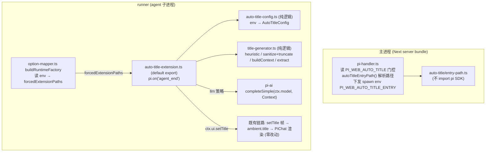
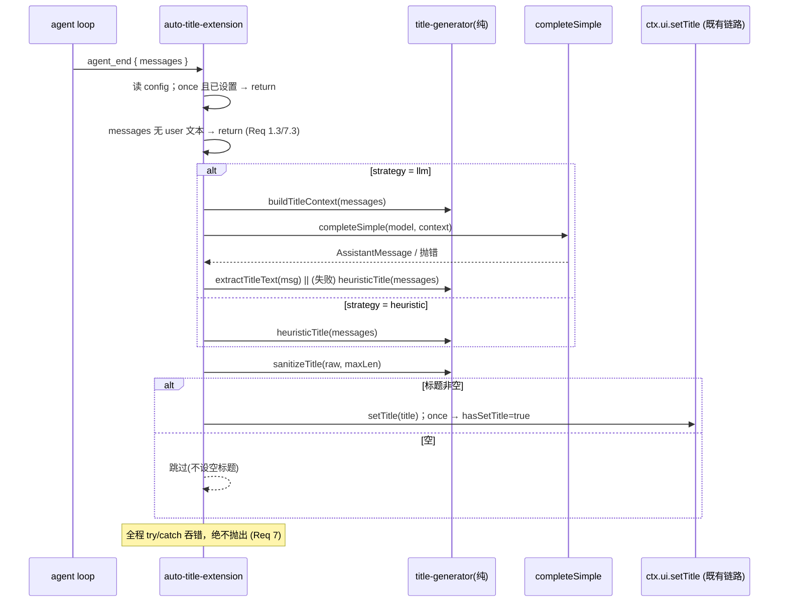

# Design Document：auto-session-title

## Overview

**Purpose**：为 pi-web 的 Web 聊天用户提供**自动会话标题**——在 agent 完成应答时据会话内容生成一个简短标题，免去手动命名。

**Users**：所有 pi-web Web 聊天用户（标题自动出现）；运营方（经环境变量控制开关与行为）。

**Impact**：在 `@blksails/pi-web-tool-kit` 新增一个强制注入的 pi 扩展，并在主进程（pi-handler）与 runner（option-mapper）补一处 env 接线。标题展示链路（协议 `setTitle` → react `ambient.title` → PiChat 渲染）**已存在、零改动**。

### Goals
- agent_end 时生成并经 `ctx.ui.setTitle` 设置会话标题。
- 两种触发模式 `once`（默认）/ `refresh`；两种策略 `llm`（默认，兜底 heuristic）/ `heuristic`。
- 一组 `PI_WEB_AUTO_TITLE_*` env 调参；总开关 `PI_WEB_AUTO_TITLE` 默认开。
- 任何失败都不阻塞会话。

### Non-Goals
- 不改动标题展示链路（协议 / control-store / PiChat）。
- 不提供手动改名 UI、标题历史。
- 不新增 RPC 方法或前端组件。
- 不改动 session-store 写接口与镜像机制（仅复用 `appendSessionInfo` → mirror → store 链路）。

### 增量目标（持久化）
- 经 `ctx.ui.setTitle` 的标题在 runner 一侧同时持久化为会话名（`appendSessionInfo`），出现在会话历史并冷恢复后保留。

## Boundary Commitments

### This Spec Owns
- `packages/tool-kit/src/auto-title/` 下的扩展本体、配置解析、标题生成纯逻辑。
- `PI_WEB_AUTO_TITLE_*` 环境变量的语义与默认值。
- pi-handler 中「是否下发自动标题入口」的门控；option-mapper 中「读 env → forcedExtensionPaths」的一项追加。
- `@blksails/pi-web-tool-kit` 新增 `./auto-title-entry` 子入口导出。
- **runner 中「setTitle → 持久化为会话名」的接线**（`session-title-wiring`）：prototype-patch `session.bindExtensions` 包装 `uiContext.setTitle`，在原展示行为之外调可写 `sessionManager.appendSessionInfo(title)`。

### Out of Boundary
- 协议 `setTitle` 帧定义、react `ambient.title` 分流、PiChat 标题渲染（既有，按现状复用）。
- session-store 的写接口、镜像机制、会话历史路由/UI（既有，仅经 `appendSessionInfo` → mirror 链路被动落库）。
- runner 的 `forcedExtensionPaths` / `mapResourceLoaderOptions` 注入语义本身（既有，仅消费）。

### Allowed Dependencies
- pi SDK：`pi.on("agent_end")`、`ctx.ui.setTitle`、`ctx.model`、pi-ai `completeSimple` / `Context`、pi-agent-core `convertToLlm`；**`SessionManager.appendSessionInfo`**（peerDependency `^0.79.6`）。
- 既有注入模板：`extension-tools/{entry-path,index}` 与 `pi-handler.ts` / `option-mapper.ts` 的下发约定；**prototype-patch `session.bindExtensions` 接缝范式**。
- 既有 `mirrorSessionManagerToStore`（已含 `appendSessionInfo` 镜像，被动复用，不改）。
- `@blksails/pi-web-logger`。

### Revalidation Triggers
- pi SDK `agent_end` 事件形状 / `ctx.ui.setTitle` / `completeSimple` / `appendSessionInfo` 签名变更。
- `forcedExtensionPaths` 注入约定或 spawn env 透传方式变更；`session.bindExtensions` 绑定形状变更。
- 标题展示链路（`setTitle` 协议帧 / `ambient.title`）或 session-store 镜像链路契约变更。

## Architecture

### Existing Architecture Analysis

复用 `extension-install-agent-tools` 已验证的「强制注入」三段式：**入口解析器（不 import pi，可进 Next bundle）→ 主进程 spawn env 下发 → runner option-mapper 读 env 加入 forcedExtensionPaths**。本设计照搬该模板，仅多一层「总开关门控下发」（与 logging 默认门控同构：服务端权威，关时连扩展都不注入）。

标题展示链路已端到端存在，本设计在其上游补「标题来源」一环。

### Architecture Pattern & Boundary Map



**Architecture Integration**：
- Selected pattern：强制注入扩展（forced extension）+ 服务端门控下发，复用既有模板。
- Domain/feature boundaries：纯逻辑（config / generator，无 pi import，可单测）与扩展壳（事件接线 + try/catch）分离；模型调用以依赖注入传入便于测试。
- Existing patterns preserved：entry-path 不 import pi SDK（可进 Next bundle）；spawn env 透传；forcedExtensionPaths 豁免白名单。
- New components rationale：见下表。
- Steering compliance：TypeScript strict、no `any`；失败静默不阻塞；服务端权威门控。

### Technology Stack

| Layer | Choice / Version | Role in Feature | Notes |
|-------|------------------|-----------------|-------|
| Backend / Services | `@blksails/pi-web-tool-kit`（本包） | 扩展本体 + 纯逻辑 | 新增 `auto-title/` 模块 |
| Backend / Services | `lib/app/pi-handler.ts`、`packages/server` option-mapper | env 门控与注入接线 | 各改一处 |
| Messaging / Events | pi SDK `agent_end` + `ctx.ui.setTitle` | 触发与输出 | peerDep `^0.79.6` |
| Infrastructure / Runtime | pi-ai `completeSimple` / pi-agent-core `convertToLlm` | LLM 一次性总结 | 仅 `llm` 策略路径 |

## File Structure Plan

### Directory Structure
```
packages/tool-kit/src/auto-title/
├── entry-path.ts            # 已存在：autoTitleEntryPath() 解析扩展绝对路径(不 import pi)
├── auto-title-config.ts     # 新增(纯)：env → AutoTitleConfig，含默认值与非法值兜底
├── title-generator.ts       # 新增(纯)：heuristicTitle / sanitizeTitle / buildTitleContext / extractTitleText
└── auto-title-extension.ts  # 新增：default export pi 扩展，on('agent_end') + once/refresh 状态 + try/catch
```

### 新增（持久化）
```
packages/server/src/runner/
└── session-title-wiring.ts  # 新增:wireSessionTitlePersistence(runtime, persistTitle)
                             #   prototype-patch session.bindExtensions → 包装 uiContext.setTitle
                             #   (原 setTitle 仍跑 → ambient 帧;再 best-effort persistTitle(title))
```

### Modified Files
- `packages/tool-kit/package.json` — exports 增加 `"./auto-title-entry": "./src/auto-title/entry-path.ts"`。
- `tsconfig.json`（root）— `paths` 增加同名映射（否则 app typecheck TS2307）。
- `lib/app/pi-handler.ts` — import `autoTitleEntryPath`（经新子入口）；`PI_WEB_AUTO_TITLE !== "0"` 时解析并在 createChannel 的 spawn env 加 `PI_WEB_AUTO_TITLE_ENTRY`。
- `packages/server/src/runner/option-mapper.ts` — 抽出纯函数 `collectForcedExtensionPaths(env)`，并入 `PI_WEB_AUTO_TITLE_ENTRY`。
- `packages/server/src/runner/runner.ts` — 在 `createAgentSessionRuntime` 之后注入 `wireSessionTitlePersistence(runtime, (t) => sessionManager.appendSessionInfo(t))`（best-effort try/catch）。

### 测试文件
```
packages/tool-kit/test/auto-title/
├── auto-title-config.test.ts    # env 解析/默认/非法兜底
├── title-generator.test.ts      # heuristic/截断(字符边界+trim)/extract/buildContext/空消息
└── auto-title-extension.test.ts # once vs refresh 状态机 + llm 失败兜底 heuristic（注入假 complete）
packages/server/test/runner/
└── option-mapper-auto-title.test.ts  # PI_WEB_AUTO_TITLE_ENTRY → forcedExtensionPaths
e2e/node/
└── auto-title.e2e.test.ts       # 真实 runner + mock provider + heuristic → 断言 setTitle 帧
```

## System Flows



门控要点：`once` 仅在**成功 setTitle 后**置 `hasSetTitle=true`（失败可重试，Req 2.2）；`llm` 失败回退 heuristic（Req 3.2）；任何异常被吞且不阻塞（Req 7.1）。

## Requirements Traceability

| Requirement | Summary | Components | Flows |
|-------------|---------|------------|-------|
| 1.1–1.4 | agent_end 生成并经 setTitle 设置；空内容跳过；纯文本 | auto-title-extension + title-generator | agent_end 序列 |
| 2.1–2.4 | once/refresh 状态机，默认 once | auto-title-extension(hasSetTitle) + config | 门控分支 |
| 3.1–3.5 | llm 优先 + heuristic 兜底；专用/当前模型 | auto-title-extension + title-generator + config | llm/heuristic 分支 |
| 4.1–4.3 | 长度上限/截断/字符边界+trim，默认 24 | title-generator.sanitizeTitle + config | sanitize |
| 5.1–5.5 | 总开关门控下发；入口解析失败跳过；runner 注入 | pi-handler + entry-path + option-mapper | 注入路径 |
| 6.1–6.6 | env 参数与默认/非法兜底 | auto-title-config + pi-handler | — |
| 7.1–7.3 | 失败容错不阻塞 | auto-title-extension(try/catch) | 全序列 |
| 8.1–8.6 | setTitle 持久化为会话名；展示并存；refresh 每次更新；历史显示与冷恢复保留；失败不阻塞 | session-title-wiring + runner + (既有 mirror/session-store/session-list) | setTitle 持久化序列 |

## Components and Interfaces

| Component | Layer | Intent | Req | Contracts |
|-----------|-------|--------|-----|-----------|
| auto-title-config | 纯逻辑 | env → 配置 | 6,2.4,3.4,4.2 | State |
| title-generator | 纯逻辑 | 标题文本生成/清洗 | 1,3,4 | Service |
| auto-title-extension | 扩展壳 | 事件接线 + 状态 + 兜底 | 1,2,3,7 | Event |
| pi-handler（改） | 主进程 | 总开关门控 + 下发 entry | 5,6.5 | — |
| option-mapper（改） | runner | env → forcedExtensionPaths | 5.5 | — |
| session-title-wiring | runner | setTitle → 持久化会话名 | 8 | State |

### runner · session-title-wiring（持久化）

**Responsibilities & Constraints**：以 prototype-patch 范式 patch `session.bindExtensions`：每次绑定时把 `bindings.uiContext.setTitle` 包装为「先调原 setTitle（保留 ambient 帧展示）→ 再 best-effort `persistTitle(title, boundSession)`」。`boundSession` 是 patched `bindExtensions` 里的 `this`（**当前被绑定的 session**）；runner 注入的 `persistTitle` 据此取 `boundSession.sessionManager.appendSessionInfo` —— **进程内 `new_session`/`switchSession`/`fork` 会换新 SessionManager（新会话 id/文件），必须按 bind 时的 session 取当前 SM，否则标题写回旧会话、新会话无名**。自带幂等哨兵，多次 wire 安全。

**Contracts**: State —— 不持有自有状态，只增强 uiContext.setTitle。

**Implementation Notes**
- 持久化即 `sessionManager.appendSessionInfo(title)`：写 pi 原生 fs 会话文件，并触发既有 `mirrorSessionManagerToStore`（已含该方法镜像）把 `session_info` 条目落 sqlite/postgres。
- **读侧补全（关键）**：会话历史读 session-store 的 `SessionMeta.name`，而该字段**只来自创建时 header.name**，追加 `session_info` 不自动更新它。故须补读侧：
  - **sqlite/postgres**：在 `appendBatch` 遇 `session_info` 时 `UPDATE sessions SET name`（最新生效），其 `list().name` 即正确。
  - **fs-store**（默认，读 pi 原生文件，不走镜像）：新增 `displayName(id)` 扫文件取最新 `session_info` 名；session-list 路由**仅对分页返回页的未命名项**调用以限成本。
  - 两者合一即 Req 8.4 / 8.5（冷恢复后 store/fs 仍含 `session_info`，名仍显示）。
- `appendSessionInfo` 触发的 `session_info_changed` 事件，translate 已 `none()` 丢弃，不污染 UIMessage 流（Req 8.2）。
- 包装与持久化全程 try/catch，失败不影响原 setTitle 展示、不抛出（Req 8.6）。
- 不去重：每次 setTitle 都 append（与 refresh 一致，最新生效，Req 8.3）。

**读侧文件改动**
- `session-store/types.ts` — `SessionEntryStore` 增可选 `displayName?(id)`。
- `session-store/fs-store.ts` — 实现 `displayName`（扫 `session_info`）。
- `session-store/{sqlite,postgres}-store.ts` — `appendBatch` 维护 `name` 列。
- `session-list/session-list-routes.ts` — 分页后 `enrichDisplayNames` 富集未命名页项。

### 纯逻辑

#### auto-title-config

**Responsibilities & Constraints**：从 `env: NodeJS.ProcessEnv`（注入，非全局读）解析配置；非法值回退默认；纯函数无副作用。

```typescript
type AutoTitleMode = "once" | "refresh";
type AutoTitleStrategy = "llm" | "heuristic";

interface AutoTitleConfig {
  mode: AutoTitleMode;        // PI_WEB_AUTO_TITLE_MODE，默认 "once"
  strategy: AutoTitleStrategy;// PI_WEB_AUTO_TITLE_STRATEGY，默认 "llm"
  model: string | undefined;  // PI_WEB_AUTO_TITLE_MODEL，默认 undefined(用 ctx.model)
  maxLen: number;             // PI_WEB_AUTO_TITLE_MAX_LEN，默认 24，非法/≤0 回退 24
}

function parseAutoTitleConfig(env: NodeJS.ProcessEnv): AutoTitleConfig;
```
- Postconditions：`mode`/`strategy` 必为枚举内值；`maxLen` 为正整数；不抛错（Req 6.6）。

#### title-generator

**Responsibilities & Constraints**：纯文本处理，不 import pi SDK 的运行时；模型调用不在此（由扩展壳注入）。

```typescript
import type { AgentMessage } from "@earendil-works/pi-coding-agent"; // type-only
import type { Context, AssistantMessage } from "@earendil-works/pi-ai"; // type-only

/** 取首条 user 文本，sanitize+截断；无 user 文本返回 ""。 */
function heuristicTitle(messages: AgentMessage[], maxLen: number): string;

/** 去换行/控制字符、trim、按字符边界(Array.from)截断到 maxLen。空→""。 */
function sanitizeTitle(raw: string, maxLen: number): string;

/** 用 convertToLlm + 总结 systemPrompt 构造一次性 Context。 */
function buildTitleContext(messages: AgentMessage[]): Context;

/** 从 AssistantMessage.content 取 type==="text" 文本拼接；无→""。 */
function extractTitleText(msg: AssistantMessage): string;
```
- Invariants：所有返回经 `sanitizeTitle` 不含换行/控制字符；空输入安全返回 `""`。

### 扩展壳

#### auto-title-extension（default export）

**Responsibilities & Constraints**：注册 `pi.on("agent_end")`；持有 `hasSetTitle` 闭包状态；按 config 选策略；注入 `completeSimple` 作为模型调用；全程 try/catch。

```typescript
import type { ExtensionAPI } from "@earendil-works/pi-coding-agent";
export default function autoTitleExtension(pi: ExtensionAPI): void;
```

**Dependencies**
- Inbound：runner forcedExtensionPaths 加载（P0）。
- Outbound：`ctx.ui.setTitle`（P0）；`completeSimple(ctx.model, ctx)`（P1，仅 llm）；title-generator / auto-title-config（P0）。

**Event Contract**
- Subscribed：`agent_end`（`AgentEndEvent.messages: AgentMessage[]`）。
- 行为：见 System Flows。`once` 成功后不再处理；`refresh` 每次处理。

**Implementation Notes**
- 模型调用以参数注入（`complete = completeSimple`）便于单测替身。
- `ctx.model === undefined` 且 strategy=llm → 直接走 heuristic（Req 3.2/7.3）。
- 失败不 `notify`、不抛出（Req 7.1）。

### 主进程 / runner（改动）

#### pi-handler.ts
- `const autoTitleEnabled = process.env.PI_WEB_AUTO_TITLE !== "0";`（默认开，Req 5.3）。
- `const autoTitleEntry = autoTitleEnabled ? autoTitleEntryPath() : undefined;`（关→不解析不下发，Req 5.2）。
- createChannel 的 spawn `env` 增：`...(autoTitleEntry !== undefined ? { PI_WEB_AUTO_TITLE_ENTRY: autoTitleEntry } : {})`。
- 解析不到（undefined）→ 跳过，不阻塞（Req 5.4）。

#### option-mapper.ts buildRuntimeFactory
- 读 `const autoTitleEntry = process.env["PI_WEB_AUTO_TITLE_ENTRY"];`
- `forcedExtensionPaths` 数组增：`...(autoTitleEntry && autoTitleEntry.length > 0 ? [autoTitleEntry] : [])`（Req 5.5）。

## Error Handling

### Error Strategy
单一原则：**自动标题任何环节失败都静默降级，绝不阻塞会话**。

| 场景 | 处理 |
|---|---|
| 入口路径解析不到 | pi-handler 跳过下发（Req 5.4） |
| env 非法 | config 回退默认（Req 6.6） |
| 无 user 消息 | 扩展跳过，不设空标题（Req 1.3/7.3） |
| `ctx.model` 缺失（llm） | 退 heuristic（Req 3.2） |
| `completeSimple` 抛错/超时/空 | catch 后退 heuristic；heuristic 再空则跳过（Req 3.2/7.1） |
| 生成结果为空 | 不调用 setTitle（Req 1.3） |

### Monitoring
经 `@blksails/pi-web-logger` 在 debug 级记录策略选择与失败回退（默认关，不污染 stderr）；不向用户暴露。

## Testing Strategy

### Unit Tests
1. `auto-title-config`：缺省→默认（once/llm/undefined/24）；非法 `MODE=foo`/`MAX_LEN=-1`→回退；合法枚举/数值解析。
2. `title-generator.sanitizeTitle`：超长按字符边界（含多字节 emoji，用 `Array.from`）截断；去换行/控制字符；trim；空→""。
3. `title-generator.heuristicTitle`：取首条 user 文本；无 user→""；含多角色消息只取 user。
4. `title-generator.extractTitleText` / `buildTitleContext`：从 `AssistantMessage.content` 取 text；多 text 拼接；Context 含 systemPrompt + convertToLlm 后的 messages。

### Integration Tests
1. `auto-title-extension` once 模式：首次 agent_end 调 setTitle 且置标志；第二次 agent_end 不再调（注入 fake pi/ctx/complete）。
2. `auto-title-extension` once 失败重试：首次 complete 抛错且 heuristic 也空（无 user）→ 不设置、标志不置；补 user 后第二次成功设置（Req 2.2）。
3. `auto-title-extension` refresh：连续两次 agent_end 各调一次 setTitle。
4. `auto-title-extension` llm 兜底：complete 抛错 → 用 heuristic 文本调 setTitle（Req 3.2）。
5. `option-mapper-auto-title`：设 `PI_WEB_AUTO_TITLE_ENTRY` → `additionalExtensionPaths` 含该路径；未设 → 不含。
6. `session-title-wiring`：以假 runtime（prototype 带 `bindExtensions`）+ 假 `bindings.uiContext.setTitle` + spy `persistTitle`，断言 wire 后绑定时 setTitle 被包装、调用它既触发原 setTitle 又触发 `persistTitle(title)`；原 setTitle 抛错 / persistTitle 抛错均被吞、互不影响；幂等重复 wire 不重复包装；prototype 无 bindExtensions → 优雅降级 installed:false。

### E2E Tests
1. `e2e/node/auto-title.e2e.test.ts`：spawn 真实 custom-mode runner（参照 `runner.e2e.test.ts`），models.json 指向本地 mock OpenAI Chat Completions provider（参照 `e2e/cli/cli-real.mjs`），env 设 `PI_WEB_AUTO_TITLE_ENTRY=<auto-title-extension.ts>` + `PI_WEB_AUTO_TITLE_STRATEGY=heuristic`；发一条 prompt → agent_end 触发 → 断言 stdout 出现 `extension_ui_request{method:"setTitle"}` 且 `title` 来自首条用户消息（确定性，不依赖 LLM 输出）。
   - **Boundary**：验证「注入→agent_end→setTitle 帧」端到端打通；标题展示渲染不在本 e2e 范围（既有链路）。
2. `e2e/node/auto-title.e2e.test.ts`（持久化断言，扩展同一用例）：收到 setTitle 帧后，在测试进程内经 `SessionManager.list(cwd)` → `open` → `getSessionName()` 轮询断言会话名等于首条用户消息，证明 `appendSessionInfo` 已把标题持久化为会话名（Req 8.1/8.4/8.5）。
   - **Boundary**：验证「setTitle → appendSessionInfo → 会话名持久化」；会话历史 UI 渲染不在本 e2e 范围（既有链路）。
