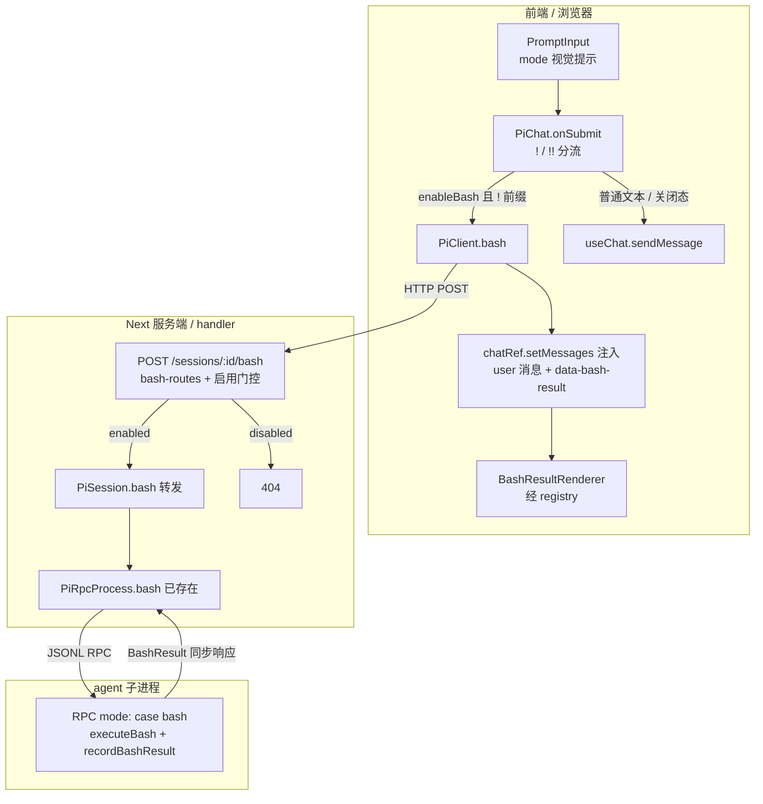

# Design Document

## Overview

**Purpose**: 在 pi-web 聊天界面提供与 pi CLI(TUI)等价的 Bang(`!`)Shell 命令体验——用户输入 `!cmd` 即在当前会话 agent 工作目录执行 shell 命令并在聊天流中看到结果,`!!cmd` 执行但输出不进入 LLM 上下文。

**Users**: pi-web 的开发/运维使用者,在可信单人或受控环境中希望无需切出聊天界面即可执行快速 shell 操作。

**Impact**: 在既有「输入 → 提交 → useChat/SSE」链路旁,新增一条「同步 HTTP bash 执行」旁路;新增一个默认关闭、由部署级 env 控制的能力门控。协议契约与 RPC 通道无改动——本特性纯粹是把已存在但未接入 Web 的 `bash` RPC 能力补齐到 HTTP 层、前端分流与渲染层。

### Goals

- 前端识别 `!` / `!!` 前缀并将其作为 bash 命令分流,不发给 LLM。
- 后端以同步 HTTP 响应体返回结构化 `BashResult`,执行经由 agent 既有 `bash` RPC 能力。
- 执行结果以专用 bash 卡片在当前会话聊天流中展示。
- `!` 进上下文 / `!!` 不进上下文(复用 agent `recordBashResult`,不自管)。
- 能力默认关闭,服务端为安全权威门控(关则 404),前端为体验联动。
- 输入框给出 bash 模式视觉提示。

### Non-Goals

- 刷新/重连后 bash 卡片的历史回放(翻译层不认 `bashExecution` role;`!` 输出仍在上下文,卡片不重绘)。
- bash 输出逐行流式展示(结果一次性返回)。
- 运行中命令的 abort UI(后端可预留端点,不接 UI)。
- Settings UI 中用户可写的启用开关。
- 命令白名单/沙箱化等更细粒度安全策略。

## Boundary Commitments

### This Spec Owns

- 前端输入提交链路中 `!` / `!!` 前缀的识别、解析与分流(`pi-chat.tsx` onSubmit 新分支)。
- HTTP 端点 `POST /sessions/:id/bash` 的请求/响应契约与其启用门控。
- `pi-session` 对 channel `bash()`/`abortBash()` 的转发包装。
- `PiClient.bash()` 客户端方法。
- `data-bash-result` data part 的结构与其渲染器。
- 输入框 `mode` 视觉提示 prop。
- `resolveBashEnabled` 默认推导与两个 env 的语义。

### Out of Boundary

- pi agent 内部的命令执行、工作目录决策、上下文写入(`recordBashResult`)——由 agent 提供。
- 协议包 `@blksails/pi-web-protocol` 的 `bash` 请求/响应 schema 与 `BashResultSchema`——已存在,不改。
- RPC 通道 `pi-rpc-process.ts` 的 `bash()` 方法——已存在,不改。
- 历史消息(`get_messages`)的翻译与回放。

### Allowed Dependencies

- agent RPC mode 的 `bash` / `abort_bash` 请求(经 `PiRpcProcess.bash()`)。
- 既有 HTTP 路由注入接缝(`createPiWebHandler` 的 `routes:`)。
- 既有渲染器注册表(`registerDataPartRenderer`)。
- 既有 server 组件 env → prop 注入惯例(`chat-app.tsx`)。
- 既有 `chat.setMessages` 注入机制(`/clear` 同款,经 `chatRef` 在回调内访问)。

### Revalidation Triggers

- 协议包 `BashResultSchema` 或 `bash` 请求形状变更 → 本特性的端点契约与渲染器需复核。
- `createPiWebHandler` 路由注入接口变更 → bash 路由注册需复核。
- `PiChat` onSubmit 分流顺序/输入受控机制变更 → bash 分支需复核。
- 若未来引入 `bashExecution` 历史翻译 → 卡片回放(当前 Non-Goal)可启用。

## Architecture

### Existing Architecture Analysis

- **双链路并存**:常规 prompt 走 `useChat` → SSE 流;host/内置命令走同步 HTTP(`uiRpcCommand`)。bash 命令本质是「请求-响应」一次性交互,**契合同步 HTTP 旁路**,不应进 SSE。
- **关键约束(记忆 `unified-command-result-layer`)**:host 命令往空闲 SSE 流推帧会重蹈 prompt 流冲突。因此 bash 结果**只走同步响应体 + 前端 `setMessages` 注入**。
- **单例 handler**:handler pin 在 globalThis;新增注入路由后必须重启 dev。
- **浏览器 env 约束**:浏览器侧不能整体读 `process.env`,前端开关只能用构建期内联的 `NEXT_PUBLIC_*`。
- **既有门控范式(`logging-default.ts`)**:能力默认值由纯函数从 env 推导,服务端权威。

### Architecture Pattern & Boundary Map



**Architecture Integration**:
- **Selected pattern**:同步请求-响应旁路(避开 SSE),复用既有 HTTP 路由注入 + 渲染器注册 + setMessages 注入。
- **Domain/feature boundaries**:执行权威在 agent;pi-web 负责接缝(HTTP/分流/渲染/门控)。
- **Existing patterns preserved**:env→默认纯函数门控、server 组件 env→prop、data part 渲染器、forward 转发。
- **New components rationale**:仅新增「把已有 bash 能力接到 Web」所必需的接缝。
- **Steering compliance**:strict TS 无 `any`;服务端权威门控;不污染 SSE 流。

### Technology Stack

| Layer | Choice / Version | Role in Feature | Notes |
|-------|------------------|-----------------|-------|
| Frontend | React + `@ai-sdk/react`^2 / `ai`^5 | 前缀分流、`setMessages` 注入、卡片渲染、输入提示 | 复用既有 PiChat/registry |
| Backend | Next route handler (nodejs) | `POST /sessions/:id/bash` + 门控 | 经 `routes:` 注入 |
| RPC | `PiRpcProcess.bash()`(已存在) | 转发 bash 请求到 agent | 不改 |
| Protocol | `@blksails/pi-web-protocol`(已存在) | `bash` 请求/`BashResultSchema` | 不改 |
| Config | env 纯函数推导 | `resolveBashEnabled` | 照 `logging-default.ts` |

## File Structure Plan

### 新建文件
```
packages/server/src/http/routes/
└── bash-routes.ts            # createBashRoutes(store,{enabled}) + makeBashHandler;关闭返回 404
lib/app/
└── bash-default.ts           # resolveBashEnabled(env):未设置→关,非 "false"/"0"→开
packages/ui/src/chat/
└── bash-result-renderer.tsx  # data-bash-result 渲染器(同步 <pre>,exit≠0 标红,truncated/cancelled/no-context 标记)
```

### 修改文件
- `packages/server/src/session/pi-session.ts` — + `bash()` / `abortBash()` 转发(照 `getMessages():711` 的 `this.forward`)。
- `packages/server/src/session/session.types.ts` — + `bash()` / `abortBash()` 签名。
- `lib/app/pi-handler.ts` — `routes:` 注入 `...createBashRoutes(store,{enabled: resolveBashEnabled()})`。
- `packages/react/src/client/pi-client.ts` — + `bash(id, req): Promise<BashResult>` 打 `POST /sessions/:id/bash`。
- `packages/ui/src/chat/pi-chat.tsx` — onSubmit `!` 分支(`/` 分支之前);`runBash` 经 `chatRef.setMessages` 注入;注册 `data-bash-result` 渲染器;据 `input` 实时前缀算 `mode` 下传 PromptInput;+ `enableBash` prop。
- `packages/ui/src/elements/prompt-input.tsx` — + `mode?: "bash" | "bash-no-context"` prop 及其视觉态。
- `components/chat-app.tsx` — 读 `NEXT_PUBLIC_PI_WEB_BASH_ENABLED` → `<PiChat enableBash>`。
- `docs/product/05-configuration.md`(+ en 镜像)、`15-deployment.md`(硬化清单)、必要时 `14-cli.md` — 登记 env 与风险。

## System Flows

### Bang 命令执行(主流程)
```mermaid
sequenceDiagram
  participant U as 用户
  participant PI as PromptInput
  participant PC as PiChat.onSubmit
  participant CL as PiClient.bash
  participant RT as POST /sessions/:id/bash
  participant PS as PiSession
  participant AG as agent RPC

  U->>PI: 输入 "!ls" / "!!ls"
  PI-->>PI: trimStart→! 前缀→mode 视觉提示
  U->>PC: 回车提交
  alt enableBash 且 ! 前缀且去前缀非空
    PC->>PC: 解析 !!→excludeFromContext;清空输入框
    PC->>CL: bash(id,{command,excludeFromContext})
    CL->>RT: HTTP POST
    alt 服务端启用
      RT->>PS: bash(command,{excludeFromContext})
      PS->>AG: RPC {type:"bash",...}
      AG-->>PS: BashResult(同步)
      PS-->>RT: result
      RT-->>CL: 200 {result}
      CL-->>PC: BashResult
      PC->>PC: setMessages 注入 user 命令 + data-bash-result
    else 服务端禁用
      RT-->>CL: 404
      CL-->>PC: 抛错
      PC->>PC: 注入可见错误反馈
    end
  else 关闭态 / 非 ! 前缀
    PC->>PC: 走 doSend → useChat.sendMessage
  end
```

门控要点:前端 `enableBash` 决定是否进入 bash 分支(关→`!` 当普通文本);服务端 `enabled` 是安全权威(关→404,即便前端开)。

## Requirements Traceability

| Requirement | Summary | Components | Interfaces | Flows |
|-------------|---------|------------|------------|-------|
| 1.1–1.5 | `!`/`!!` 识别与分流、空命令、trimStart、优先级 | `pi-chat.tsx` onSubmit | `runBash` 分支 | 主流程 alt |
| 2.1–2.4 | 同步执行返回结构化结果、工作目录、不走 SSE、透传 exclude | `bash-routes`, `pi-session.bash`, `PiClient.bash` | API 契约 | 主流程 |
| 3.1–3.3 | `!` 进/`!!` 不进上下文,复用 agent | `pi-session.bash`(透传) | `excludeFromContext` | 主流程 |
| 4.1–4.6 | 卡片展示命令/输出/exit/truncated/no-context、同步渲染 | `BashResultRenderer`, `pi-chat` 注入 | `data-bash-result` part | 注入步 |
| 5.1–5.7 | 默认关、404 权威、前后开关分离、不入 Settings | `bash-default`, `bash-routes`, `chat-app`, `pi-chat` | `resolveBashEnabled`, `enableBash` | 门控 alt |
| 6.1–6.4 | 输入框 bash 模式提示、`!!` 标记、退出、关闭态不提示 | `prompt-input`, `pi-chat` | `mode` prop | trimStart 步 |
| 7.1–7.4 | 404/网络错误反馈、cancelled 标记、清空输入框 | `pi-chat` runBash, `BashResultRenderer` | 错误处理 | 主流程 else |

## Components and Interfaces

| Component | Layer | Intent | Req | Key Deps | Contracts |
|-----------|-------|--------|-----|----------|-----------|
| `resolveBashEnabled` | config | env→默认启用值 | 5.1,5.6 | — | Service |
| `createBashRoutes`/`makeBashHandler` | backend HTTP | 端点 + 404 门控 | 2.1,5.2–5.4 | PiSession | API |
| `PiSession.bash/abortBash` | backend session | 转发到通道 | 2.1,2.4,3.x | PiRpcProcess(P0) | Service |
| `PiClient.bash` | frontend client | 同步打端点 | 2.1,2.3 | fetch | Service |
| `pi-chat` onSubmit `!` 分支 | frontend | 分流 + 注入 | 1.x,4.1,7.x | PiClient, chatRef(P0) | State |
| `BashResultRenderer` | frontend UI | 卡片渲染 | 4.2–4.6,7.3 | registry(P0) | State |
| `PromptInput.mode` | frontend UI | 视觉提示 | 6.x | — | State |

### Backend

#### `resolveBashEnabled`(`lib/app/bash-default.ts`)
```typescript
export function resolveBashEnabled(
  env: Record<string, string | undefined> = process.env,
): boolean {
  const raw = env.PI_WEB_BASH_ENABLED;
  return raw !== undefined && raw.toLowerCase() !== "false" && raw !== "0";
}
```
- Precondition:无。Postcondition:返回布尔。Invariant:未设置 → `false`(secure by default,Req 5.1)。口径与 `@blksails/logger` env 解析一致。

#### `makeBashHandler` / `createBashRoutes`(`packages/server/src/http/routes/bash-routes.ts`)

##### API Contract
| Method | Endpoint | Request | Response | Errors |
|--------|----------|---------|----------|--------|
| POST | `/sessions/:id/bash` | `{ command: string; excludeFromContext?: boolean }` | `200 { result: BashResult }` | `404`(禁用或会话不存在), `400`(无效 body), `500`(执行失败) |

```typescript
export function createBashRoutes(
  store: SessionStore,
  opts: { enabled: boolean },
): InjectedRoute[];

// handler 行为:
// if (!opts.enabled) return jsonResponse(404, { error: "not found" });  // 权威门控,不泄露存在性(Req 5.2,5.4)
// const { command, excludeFromContext } = await readJson(ctx);
// if (typeof command !== "string" || command.trim() === "") return jsonResponse(400, ...);
// const res = await requireSession(store, ctx).bash(command, { excludeFromContext });
// → dataOrError<BashResult> → jsonResponse(200, { result })
```
- Risk:禁用态须在**读取/解析 body 之前**返回 404,避免副作用。

#### `PiSession.bash` / `abortBash`(`pi-session.ts` + `session.types.ts`)
```typescript
// session.types.ts
bash(command: string, opts?: { excludeFromContext?: boolean }): Promise<RpcResponse>;
abortBash(): Promise<RpcResponse>;

// pi-session.ts —— 照 getMessages():711
bash(command, opts) { return this.forward(() => this.channel.bash(command, opts)); }
abortBash() { return this.forward(() => this.channel.abortBash()); }
```
- `this.channel.bash()` 已存在(`pi-rpc-process.ts:679`)。`abortBash` 预留(当前不接 UI)。

### Frontend

#### `PiClient.bash`(`packages/react/src/client/pi-client.ts`)
```typescript
async bash(
  id: string,
  req: { command: string; excludeFromContext?: boolean },
): Promise<BashResult> {
  const r = await this.fetchImpl(`${this.baseUrl}/sessions/${id}/bash`, {
    method: "POST",
    headers: { "content-type": "application/json" },
    body: JSON.stringify(req),
  });
  if (!r.ok) throw new Error(`bash failed: ${r.status}`); // 404/5xx → 抛错(Req 7.1,7.2)
  return (await r.json()).result as BashResult;
}
```

#### `pi-chat` onSubmit `!` 分支 + `runBash`
- 分支置于 `/` 命令分支**之前**(Req 1.5):
```typescript
const trimmed = input.trimStart();
if (enableBash && trimmed.startsWith("!") && client && sessionId) {
  const excludeFromContext = trimmed.startsWith("!!");
  const command = trimmed.slice(excludeFromContext ? 2 : 1).trim();
  setInput("");                       // Req 7.4(无条件清空)
  if (command.length === 0) return;   // Req 1.3(空命令:不请求不写消息)
  void runBash(command, excludeFromContext);
  return;
}
```
- `runBash`:`await client.bash(...)` → 经 `chatRef.current.setMessages`(回调内访问,避免 render 期解构无限循环坑)追加:
  1. `{ id: crypto.randomUUID(), role: "user", parts: [{ type: "text", text: `${excludeFromContext ? "!!" : "!"}${command}` }] }`(Req 4.1)
  2. `{ id: crypto.randomUUID(), role: "assistant", parts: [{ type: "data-bash-result", data: { command, excludeFromContext, ...result } }] }`
- 失败时改注入一条携带错误的卡片/文本(Req 7.1,7.2)。
- State:不经 `useChat.sendMessage`,故不触发 LLM(Req 2.3)。

#### `BashResultRenderer`(`packages/ui/src/chat/bash-result-renderer.tsx`)
- 注册:`registry.registerDataPartRenderer("data-bash-result", BashResultRenderer)`(在 pi-chat 行 334 附近,与既有注册并列)。
- 渲染:`$ {command}` + 输出 `<pre>`(**同步**,不用 streamdown/`Response`,Req 4.6);`exitCode` 非零标红并显示退出码(4.3);`truncated` 提示(4.4);`cancelled` 标记未正常完成(7.3);`excludeFromContext` 显示「no context」徽标(4.5)。`data-pi-bash-result` 属性供 e2e 选择。

#### `PromptInput.mode`(`packages/ui/src/elements/prompt-input.tsx`)
```typescript
mode?: "bash" | "bash-no-context";
```
- 命中时:换边框/强调色 + 显示 `BASH`(或 `BASH · no context`)徽标 + 占位符切换(Req 6.1,6.2)。`undefined` → 常规外观(6.3)。
- pi-chat 计算:`const bashMode = enableBash && input.trimStart().startsWith("!")`;`!!` → `"bash-no-context"`。关闭态 `enableBash=false` → 始终 `undefined`(6.4)。

## Data Models

### `data-bash-result` part data
```typescript
interface BashResultPartData {
  command: string;            // 不含 ! 前缀
  output: string;
  exitCode?: number;
  cancelled: boolean;
  truncated: boolean;
  fullOutputPath?: string;
  excludeFromContext: boolean;
}
```
- 来源:`BashResult`(协议 `session-state.ts:85`)+ 前端补充 `command` / `excludeFromContext`。

### 请求/响应
- Request:`{ command: string; excludeFromContext?: boolean }`。
- Response:`{ result: BashResult }`(复用协议 `BashResultSchema`,不新增协议类型)。

## Error Handling

### Error Strategy
| 场景 | 处理 | Req |
|------|------|-----|
| 服务端禁用 | 解析 body 前返回 404(不泄露存在性) | 5.2,5.4 |
| 无效 body(command 缺失/空) | 400 | 2.1 |
| 会话不存在 | `requireSession` → 404 | — |
| 执行失败 / 5xx | `PiClient.bash` 抛错 → 前端注入可见错误反馈 | 7.2 |
| 前开后关(404) | 同上,前端可见反馈 | 7.1 |
| 命令 exit≠0 / cancelled / truncated | 正常返回 `BashResult`,卡片可视化标记(非异常) | 4.3,4.4,7.3 |

### Monitoring
- 经既有服务端日志(`@blksails/pi-web-logger`)记录 bash 端点的禁用拒绝与执行失败;遵循服务端权威门控,不新增日志域。

## Testing Strategy

### Unit Tests
- `resolveBashEnabled`:未设置→false;`"1"`/`"true"`/`"TRUE"`→true;`"false"`/`"0"`→false(Req 5.1,5.6)。
- `makeBashHandler` 禁用态→404 且未触达 session(Req 5.2,5.4)。
- `pi-chat` onSubmit:`enableBash=false` 时 `!echo` 调 `sendMessage` 不调 `client.bash`;`=true` 时调 `client.bash` 不调 `sendMessage`;`!`/`!!` 解析;空命令(`!` / `!!  `)不请求不写消息;` !cmd` 前导空白等价(Req 1.1–1.5,5.5,7.4)。
- `BashResultRenderer`:渲染 command/output;exit≠0 标红+退出码;truncated 提示;cancelled 标记;`!!` no-context 徽标(Req 4.2–4.6,7.3)。
- `PromptInput`:`mode="bash"`/`"bash-no-context"`/`undefined` 的样式态与徽标(Req 6.1–6.3)。

### Integration Tests
- 对真实 `pi --mode rpc` 子进程 `POST /sessions/:id/bash`(enabled)断言 `BashResult`(`echo hi` → output 含 `hi`,exitCode 0)(Req 2.1,2.2)。
- `excludeFromContext:true` 透传:执行后 `get_messages` 中该 bash 记录带排除标记 / 不进上下文(Req 2.4,3.2)。
- enabled=false → 404(Req 5.2)。

### E2E Tests(隔离 build `NEXT_DIST_DIR=.next-e2e` + external server)
- **A 档(开)**:`enableBash` 开 → 输入 `!echo hi` 出现 `data-pi-bash-result` 卡片含 `hi`;输入 `!` 时输入框出现 `BASH` 徽标(Req 1.1,4.2,6.1)。
- **A 档(`!!`)**:`!!echo x` 卡片带 no-context 标记(Req 4.5)。
- **B 档(关)**:`enableBash` 关 → `!echo hi` 作为普通消息发给 stub agent,无卡片、无徽标(Req 5.5,6.4)。

## Security Considerations

- **威胁**:`/bash` 端点等价于在服务器宿主上的任意命令执行(RCE-by-design)。任何能到达该端点者即可在 agent 工作目录执行任意 shell。
- **控制**:
  - **默认关闭**(Req 5.1):未设 `PI_WEB_BASH_ENABLED` 即禁用。
  - **服务端权威**(Req 5.2,5.4):门控在路由 handler,关则 404;前端开关不构成安全边界;前端被改/绕过仍被服务端拒。
  - **不泄露存在性**:禁用返回 404 而非 403,避免暴露「功能存在但被禁」。
  - **双 env 故意分离**:`PI_WEB_BASH_ENABLED`(server-only,权威)与 `NEXT_PUBLIC_PI_WEB_BASH_ENABLED`(构建期内联,体验)分开,使后端可彻底关死。
  - **不入 Settings**(Req 5.7):避免「会话内用户可自行打开」的误解。
- **文档义务**:`15-deployment` 硬化清单须明确「启用即开放任意命令执行,仅在可信单人/受控环境启用」。
- **超出本特性**:命令白名单、沙箱、按用户授权——列为未来工作。
