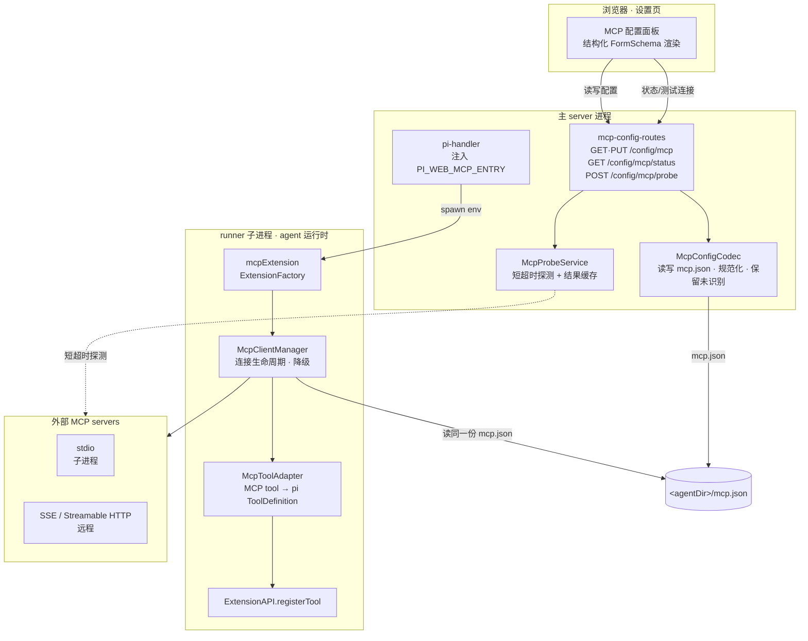
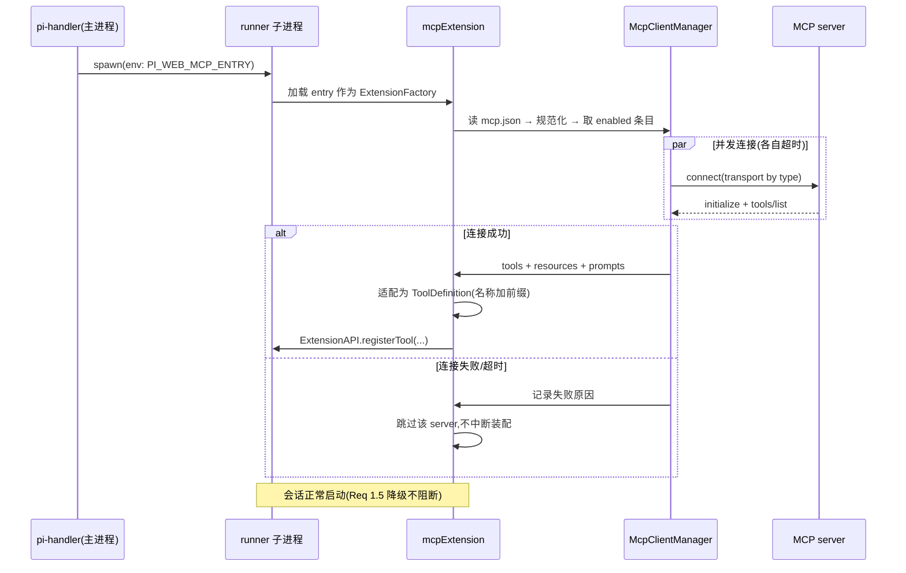
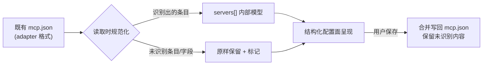

# Design Document — builtin-mcp-client

## Overview

**Purpose**:把 MCP 客户端能力从外部扩展 `pi-mcp-adapter` 收进 pi-web 核心,让用户**零扩展依赖**即可连接外部 MCP server,并把其 tools / resources / prompts 注入 agent 会话。

**Users**:pi-web 使用者在设置页以**结构化表单**(而非裸 JSON)管理 MCP server 条目,按 server 实际形态选择 **stdio / SSE / Streamable HTTP** 三种传输之一;凭据字段按既有 secret 三态掩码保护。

**Impact**:`/config/mcp` 从「装了 adapter 才出现的裸 JSON 编辑器」变为「常驻的结构化配置面 + 连接状态可观测」;runner 子进程在会话装配期建立 MCP 连接并注册工具。**真正的新增面很薄**——MCP 协议栈 adopt 官方 SDK,表单 IR、secret 三态、extension 注入链路全部复用既有机制(见 `research.md` §5.1)。

### Goals
- 无需安装任何扩展即可使用完整 MCP 客户端能力(Req 5.1/5.2)。
- 三种标准传输均可接入,字段集随所选协议切换(Req 2)。
- 已连接 server 的工具在会话中可被 agent 调用,同名工具可区分(Req 3)。
- 配置面结构化、凭据掩码、连接状态与失败原因可见(Req 4/6/7)。
- 既有 MCP 配置继续有效,未识别内容不丢失(Req 5.3/5.4)。

### Non-Goals
- pi-web **不**作为 MCP server 对外暴露自身能力。
- 不支持标准三种之外的传输(WebSocket 等)。
- 不实现、托管或分发 MCP server 本身。
- 不采用官方「StreamableHTTP 失败自动回退 SSE」的探测模式——Req 2 要求用户显式选协议,自动回退会让行为不可预期。
- 不改变 agent 调用工具的既有交互与渲染形态。

## Boundary Commitments

### This Spec Owns
- MCP 客户端连接的建立、关闭、超时与降级(runner 子进程内)。
- MCP tool → pi `ToolDefinition` 的适配(schema 透传、结果映射、命名前缀)。
- `mcp.json` 的数据形态、读写、规范化与未识别内容保留。
- `/config/mcp` 端点族(读写 + 状态 + 探测)与其结构化 `FormSchema`。
- MCP 配置面的前端登记形态。

### Out of Boundary
- **通用 config 域机制**(`/config/:domain`、`DOMAIN_SCHEMAS` 的既有域)——本 spec 只**新增** mcp 相关部分,不改通用行为。
- **secret 三态语义**、`maskSecrets`/`mergeSecrets` 实现——复用,不修改。
- **extension 注入链路本身**(`option-mapper` 的既有 env 读取范式)——照既有范式新增一项,不重构该机制。
- **`FormSchema` 表单 IR**——已核验现有能力足够(`research.md` §4),本 spec **不扩展表单 IR**。
- 集成设计 §7.1 记录的「spawn env 单向下发、无法轮换」通用缺陷——本 spec 只保证自己的 env 三处齐改,不承担 `control:credential-refresh` 帧的通用解法。
- `pi-mcp-adapter` 扩展包本身的下架/废弃公告。

### Allowed Dependencies
- pi SDK `@earendil-works/pi-coding-agent@0.80.3` 的 `ExtensionAPI` / `ToolDefinition`(仅在 runtime 层)。
- **新增** `@modelcontextprotocol/sdk@^1.29.0`(仅在 runtime 层;Node >=18,与项目一致)。
- 既有 `FormSchema` / secret 三态 / config 路由基础设施 / `option-mapper` env 范式。
- **约束**:含 pi SDK 或 MCP SDK **值导入**的代码只能经 `@blksails/pi-web-tool-kit/runtime`(或专用 entry)加载,**不得进入前端 bundle**;`packages/protocol` 侧只放纯类型与 schema。

### Revalidation Triggers
- `mcp.json` 数据形态变更(条目结构、传输判别键)。
- `/config/mcp` 端点族的请求/响应形态变更。
- **宿主契约 v1 的 `config.mcp` capability id 或其路由集合变更**——两端(pi-clouds / desktop)须重新表态。
- `PI_WEB_MCP_ENTRY` 这一 spawn env 契约的增删改(跨进程,且涉 e2b 白名单)。
- 工具命名前缀规则变更(影响 agent 提示词与用户心智)。

## Architecture

### Existing Architecture Analysis

三条既有约束直接决定本设计形态:

1. **工具注册只在 extension factory 内可用**,而 extension 在 **runner 子进程**加载 → MCP 客户端**必须**跑在 runner 子进程,主 server 进程拿不到会话工具集。
2. **设置页无会话态**(与 `aigc-models-routes.ts` 撞的是同一堵墙)→ 配置面无法直接读 runner 内的连接状态,须由主进程侧独立探测。
3. **宿主契约 v1 §5.3 已冻结 capability id `config.mcp`**,且规定 id 不得改名 → **不能**把 MCP 并入 `/config/:domain`(那会使该 id 失去内容,属破坏性变更,两端须重新表态)。故保留独立路由,只升级其内部实现。
   - 同时须保持 **M3 已修的 Router 顺序**:`config.mcp` 排在 `config.domains` **之前**,否则 `/config/:domain` 会抢 `GET /config/mcp`。

### Architecture Pattern & Boundary Map



**Architecture Integration**:
- **选定模式**:内置 `ExtensionFactory` + 官方 SDK 适配层。与 `aigcExtension`/`memoryExtension`/auto-title 同构,不引入新范式。
- **责任分离**:主进程只管**配置与探测**(无状态、可在无会话时工作);runner 子进程只管**连接与工具注册**(有会话态)。两侧经**同一份 `mcp.json`** 交换意图,不建跨进程 RPC。
- **保留的既有模式**:config 路由 + secret 三态 + FormSchema 渲染 + `xxxEntryPath()` 注入链路 + tool-kit runtime 分层。
- **新组件理由**:`McpClientManager`(连接生命周期与降级)、`McpToolAdapter`(协议→SDK 适配)、`McpProbeService`(设置页状态的唯一可行来源,见约束 2)、`McpConfigCodec`(规范化与未识别保留,两侧共享纯逻辑)。

### Technology Stack

| Layer | Choice / Version | Role in Feature | Notes |
|-------|------------------|-----------------|-------|
| Frontend | 既有 `FormSchema` 渲染器 | MCP 配置面结构化表单 | **零新增表单能力**:`objectList` + `variants` + `itemKind:"secret"` 已足够 |
| Backend / Services | 既有 config 路由基础设施 | `/config/mcp` 端点族 | 保留独立路由(契约约束) |
| Agent Runtime | `@earendil-works/pi-coding-agent@0.80.3` | `ExtensionAPI.registerTool` 注入工具 | pi SDK **不自带 MCP** |
| Protocol | **`@modelcontextprotocol/sdk@^1.29.0`**(新增) | `Client` + 三传输类 | Node >=18;仅 runtime 层导入 |
| Data / Storage | `<agentDir>/mcp.json` | 配置落盘 | 沿用既有路径,兼容既有内容 |
| 跨进程 | spawn env `PI_WEB_MCP_ENTRY` | 内置 extension 注入 | ⚠️ 须改三处(real / e2b / e2b 白名单) |

## File Structure Plan

### Directory Structure
```
packages/tool-kit/src/mcp/               # 新增 · runtime 层(含 MCP SDK 值导入)
├── extension.ts                         # mcpExtension: ExtensionFactory —— 装配期连接并注册工具
├── client-manager.ts                    # 连接生命周期:并发建立/超时/关闭/失败降级
├── transport-factory.ts                 # 按 transport.type 构造三种 Transport(唯一识别协议处)
├── tool-adapter.ts                      # MCP tool → pi ToolDefinition:schema 透传、结果映射、名称前缀
└── types.ts                             # runtime 内部模型(连接结果、注册产物)

packages/tool-kit/src/mcp-entry.ts       # 新增 · PI_WEB_MCP_ENTRY 指向的入口(导出 default factory)
packages/protocol/src/config/domains/mcp.ts   # 新增 · 前端安全:McpConfig zod schema + FormSchema + 规范化纯函数
packages/server/src/config/mcp-probe.ts       # 新增 · 主进程探测服务(短超时 + 结果缓存)
```

> `mcp/` 下各文件按「一个文件一个职责」划分:识别协议只在 `transport-factory.ts`,适配 schema/结果只在 `tool-adapter.ts`,生命周期只在 `client-manager.ts`。`extension.ts` 只做编排。

### Modified Files
- `packages/server/src/config/mcp-config-routes.ts` — 从「裸 JSON + installed 门控」改为「结构化 GET/PUT(zod 校验 + secret 三态)+ 新增 status/probe 两端点」;**移除** `isMcpInstalled` 门控。
- `packages/protocol/src/config/index.ts` — 导出新增的 mcp 域 schema/FormSchema(**不**加入 `ConfigDomainId` 联合——mcp 保持独立路由,见契约约束)。
- `lib/settings/register-panels.ts:203-239` — 面板从单 `configFiles` 字段改为 mcp `FormSchema` 渲染;**删除**异步探测 `installed` 的登记门控,改为常驻登记。
- `lib/app/pi-handler.ts` — 注入 `PI_WEB_MCP_ENTRY`(照 `autoTitleEntry` 范式);⚠️ **real 与 e2b 两分支都要下发**。
- `packages/server/src/runner/option-mapper.ts` — 读 `PI_WEB_MCP_ENTRY` 并追加进 extensions;⚠️ e2b **`envPassthrough` 白名单**同步补该键。
- `packages/tool-kit/src/runtime.ts` — 导出 `mcpExtension` 等 runtime 符号。
- `packages/tool-kit/package.json` — 新增 `./mcp-entry` 子入口导出 + `@modelcontextprotocol/sdk` 依赖。

## Data Models

### `mcp.json` 权威形态

```jsonc
{
  "servers": [
    {
      "name": "filesystem",           // 条目内唯一;作为工具名前缀
      "enabled": true,
      "transport": {                   // 判别键 = type
        "type": "stdio",
        "command": "npx",
        "args": ["-y", "@modelcontextprotocol/server-filesystem", "/tmp"],
        "env": { "TOKEN": "…" }        // 值一律按 secret 掩码
      }
    },
    {
      "name": "remote",
      "enabled": true,
      "transport": {
        "type": "streamable-http",     // 或 "sse"
        "url": "https://example.com/mcp",
        "headers": { "Authorization": "…" }   // 值一律按 secret 掩码
      }
    }
  ]
}
```

**Structure & Invariants**
- `servers[].name`:非空、在配置内唯一(Req 1.1);作为工具名前缀,须限定为可安全嵌入工具名的字符集。
- `transport` 为**判别联合**,判别键 `type ∈ {stdio, sse, streamable-http}`;`stdio` 要求 `command`,`sse`/`streamable-http` 要求 `url`(Req 2.2/2.3/2.5)。
- `enabled` 缺省视为 `true`。

**兼容与规范化(Req 5.3/5.4)**
- 读入时同时接受 MCP 生态通用的 **`mcpServers` 对象映射**形态(键=name),规范化为内部 `servers[]`。
- **顶层未识别键原样保留**,写回时合并而非整体覆盖。
- 传输类型无法识别的条目**保留原始内容**、标记为未识别、不参与连接,并在配置面提示(Req 5.4)。

### FormSchema 形态(零新增表单能力)
`servers` → `kind:"objectList"`,`itemFields` 含 `name`/`enabled`,`transport` 字段用 **`variants`**(`discriminator:"type"`,三个 `cases` 各带自己的字段集,满足 Req 2.4);`env`/`headers` → `kind:"record"` + **`itemKind:"secret"`**(值一律掩码,满足 Req 7.2)。

## System Flows

### 会话启动:连接与工具注册



**流程级决策**:各 server **并发**连接且**各自独立超时**,任一失败只影响自身(Req 1.5);禁用条目在取集合阶段即被排除,不产生任何连接(Req 1.4)。工具注册在装配期一次完成——与 `aigcExtension` 一致,配置改动在**下次新建会话**生效(Req 4.4)。

### 配置面状态:主进程探测

设置页无会话态,故状态不来自 runner:`GET /config/mcp/status` 返回**缓存**的探测结果(Req 6.1);`POST /config/mcp/probe` 按需发起**短超时**探测并刷新缓存(Req 6.4)。探测复用同一 `transport-factory` 与连接逻辑,仅做 `initialize` 后即断开,不注册工具。

## Requirements Traceability

| Requirement | Summary | Components | Interfaces | Flows |
|---|---|---|---|---|
| 1.1–1.2 | 多条目、唯一名、持久化 | McpConfigCodec, mcp FormSchema | GET·PUT /config/mcp | — |
| 1.3–1.4 | 启动即连、禁用跳过 | McpClientManager, mcpExtension | — | 会话启动 |
| 1.5 | 连接失败不阻断会话 | McpClientManager | — | 会话启动(alt 分支) |
| 1.6 | 删除即断开且能力消失 | McpConfigCodec, McpClientManager | PUT /config/mcp | 会话启动 |
| 2.1–2.3 | 三传输及其字段 | TransportFactory, mcp FormSchema | — | — |
| 2.4 | 切协议换字段集 | mcp FormSchema(`variants`) | — | — |
| 2.5 | 缺必填拒绝保存 | McpConfig zod schema | PUT /config/mcp(400) | — |
| 3.1–3.2 | tools/resources/prompts 可用 | McpToolAdapter, mcpExtension | ExtensionAPI.registerTool | 会话启动 |
| 3.3 | 结果按既有工具形态回流 | McpToolAdapter(结果映射) | ToolDefinition.execute | — |
| 3.4 | 同名工具可区分 | McpToolAdapter(`<server>__<tool>` 前缀) | — | — |
| 3.5 | 工具调用失败不断会话 | McpToolAdapter(错误结果) | — | — |
| 4.1–4.2 | 结构化表单、列出条目 | register-panels, mcp FormSchema | — | — |
| 4.3 | 凭据掩码不回读明文 | secret 三态复用(`itemKind:"secret"`) | GET /config/mcp | — |
| 4.4 | 修改下次会话生效 | mcpExtension(装配期读取) | — | 会话启动 |
| 4.5 | 启停开关 | mcp FormSchema(`enabled`) | PUT /config/mcp | — |
| 5.1–5.2 | 零扩展依赖、面板常驻 | pi-handler 注入, register-panels | — | 会话启动 |
| 5.3–5.4 | 既有配置有效、未识别保留 | McpConfigCodec(规范化+passthrough) | GET /config/mcp | — |
| 6.1–6.4 | 状态、失败原因、连接中、重试 | McpProbeService | GET status / POST probe | 配置面状态 |
| 7.1 | 凭据不进日志 | McpClientManager, McpProbeService | — | — |
| 7.2–7.4 | 掩码、keep 保持、clear 移除 | secret 三态复用 | GET·PUT /config/mcp | — |

## Components and Interfaces

| Component | Layer | Intent | Req | Key Dependencies | Contracts |
|---|---|---|---|---|---|
| McpConfigCodec | protocol(纯) | mcp.json 读取/规范化/未识别保留 | 1.1,1.2,5.3,5.4 | — | Service |
| mcp FormSchema + zod | protocol(纯) | 结构化表单 IR 与校验 | 2.*,4.*,7.* | FormSchema(P0) | State |
| mcp-config-routes | server | 端点族:读写 + 状态 + 探测 | 1.*,4.*,6.*,7.* | secret-merge(P0), McpProbeService(P0) | API |
| McpProbeService | server | 主进程短超时探测 + 缓存 | 6.1–6.4,7.1 | TransportFactory(P0) | Service |
| TransportFactory | tool-kit/runtime | 按 type 构造三传输(**唯一识别协议处**) | 2.1–2.3 | MCP SDK(P0) | Service |
| McpClientManager | tool-kit/runtime | 连接生命周期、并发、超时、降级 | 1.3–1.6,7.1 | TransportFactory(P0) | Service |
| McpToolAdapter | tool-kit/runtime | MCP tool ↔ pi ToolDefinition | 3.1–3.5 | pi SDK(P0), MCP SDK(P0) | Service |
| mcpExtension | tool-kit/runtime | ExtensionFactory 编排 | 1.3,3.1,4.4,5.1 | 上述三者(P0) | Service |

### tool-kit / runtime

#### McpToolAdapter

| Field | Detail |
|---|---|
| Intent | 把 MCP server 声明的 tool 适配为 pi `ToolDefinition` 并执行调用 |
| Requirements | 3.1, 3.3, 3.4, 3.5 |

**Responsibilities & Constraints**
- **schema 透传**:MCP `inputSchema` 是 JSON Schema,而 pi `parameters` 是 TypeBox `TSchema`(本质同为 JSON Schema)→ 直接透传;**缺失或结构非法时兜底为宽松 object schema**,使单个坏工具不毒化同 server 其余工具。
- **命名**:注册名 `<serverName>__<toolName>`,保证同名工具可区分(Req 3.4)且对 LLM 稳定。
- **结果映射**:MCP `content[]`(text/image 等)映射为 `AgentToolResult`;调用异常转为**错误结果而非抛出**,使会话可继续(Req 3.5)。
- **不**持有连接:client 由 `McpClientManager` 提供。

**Contracts**: Service ☑

```typescript
export interface McpToolAdapterDeps {
  readonly serverName: string;
  readonly callTool: (name: string, args: unknown, signal?: AbortSignal) => Promise<McpToolCallResult>;
}
/** 把一个 MCP tool 描述适配为可注册的 pi ToolDefinition。 */
export function adaptMcpTool(tool: McpToolDescriptor, deps: McpToolAdapterDeps): ToolDefinition;
```
- Preconditions:`tool.name` 非空。
- Postconditions:返回的 `ToolDefinition.name` 已加 server 前缀;`execute` 永不抛出(失败转错误结果)。
- Invariants:适配过程不发起网络/进程调用。

#### McpClientManager

| Field | Detail |
|---|---|
| Intent | 建立/维护/关闭 MCP 连接,失败降级 |
| Requirements | 1.3, 1.4, 1.5, 1.6, 7.1 |

**Responsibilities & Constraints**
- 只对 `enabled` 条目发起连接(Req 1.4);各条目**并发**且**独立超时**。
- 任一失败**不抛出到装配流程**,记录原因后跳过(Req 1.5)。
- 会话结束时关闭全部连接(stdio 须确保子进程回收)。
- **凭据不得进日志**:记录失败原因时对 `env`/`headers` 值脱敏(Req 7.1)。

**Contracts**: Service ☑

```typescript
export interface McpConnectOutcome {
  readonly serverName: string;
  readonly status: "connected" | "failed" | "skipped";
  readonly tools: readonly McpToolDescriptor[];
  readonly error?: string;      // 已脱敏
}
export interface McpClientManager {
  connectAll(servers: readonly McpServerConfig[], signal?: AbortSignal): Promise<readonly McpConnectOutcome[]>;
  closeAll(): Promise<void>;
}
```

### server

#### mcp-config-routes(改造)

**API Contract**

| Method | Endpoint | Request | Response | Errors |
|---|---|---|---|---|
| GET | `/config/mcp` | — | `{ values, formSchema? }`(凭据已掩码) | 401, 403 |
| PUT | `/config/mcp` | `{ values }`(secret 三态) | `{ ok, written }` | 400(校验失败/缺必填), 401, 403 |
| GET | `/config/mcp/status` | — | `{ statuses: [{name, status, error?, checkedAt?}] }` | 401, 403 |
| POST | `/config/mcp/probe` | `{ name? }` | 同 status(刷新后) | 401, 403, 504(探测超时) |

**Implementation Notes**
- **移除** `isMcpInstalled` 门控(Req 5.2);响应不再含 `installed`。
- PUT 经 zod 校验(Req 2.5)后,用既有 `mergeSecrets` 解析 secret 三态,再由 `McpConfigCodec` **合并写回**(保留未识别顶层键,Req 5.4)。
- GET 经既有 `maskSecrets` 掩码(Req 4.3/7.2)。
- ⚠️ 四条路由仍由 `createMcpConfigRoutes` 一个工厂返回,**capability id `config.mcp` 不变**;且须保持其在 `defaultCapabilities` 中**排在 `config.domains` 之前**。

## Error Handling

### Error Strategy
遵循 pi-web 既有方向性约定:**本地侧降级可用**——MCP 相关失败一律不得升级为「会话不可用」。

### Error Categories and Responses
- **User Errors (4xx)**:缺必填字段 / 传输类型非法 → PUT 400,响应指明缺失字段(Req 2.5);未鉴权 → 401/403(沿用既有 `adminPolicy` 门)。
- **System Errors**:连接超时、进程无法启动、远端不可达 → 该 server 标 `failed` + 脱敏原因,**会话照常启动**(Req 1.5/6.2);探测超时 → 504。
- **Business Logic Errors**:server 名重复 / 未识别传输类型 → 保存前校验拒绝(重复名)或保留并标未识别(未知类型,Req 5.4)。
- **工具调用失败**:转为工具**错误结果**回流会话,不抛出(Req 3.5)。

### Monitoring
连接结果(成功/失败/耗时/server 名)经既有 logger 记录;**`env`/`headers` 值与 URL 中的凭据段一律脱敏后再记录**(Req 7.1)。

## Testing Strategy

### Unit Tests
- `adaptMcpTool`:JSON Schema 透传、**非法/缺失 inputSchema 兜底**、`<server>__<tool>` 前缀、调用异常转错误结果(3.1,3.3,3.4,3.5)。
- `McpConfigCodec`:`mcpServers` 对象 → `servers[]` 规范化、**未识别顶层键保留**、未知传输类型条目保留并标记(5.3,5.4)。
- mcp zod schema:三传输各自必填校验、缺 `command`/`url` 拒绝、重复 name 拒绝(2.2,2.3,2.5,1.1)。
- `TransportFactory`:三种 `type` 各构造对应 Transport,未知 type 报错(2.1)。
- secret 处理:`record` + `itemKind:"secret"` 的掩码/keep/clear 往返(7.2,7.3,7.4)。

### Integration Tests
- `mcp-config-routes`:GET 掩码不含明文、PUT 缺必填 400、PUT 合并写回保留未识别键、**响应不含 `installed` 且无扩展也可用**(4.3,2.5,5.2,5.4)。
- `mcpExtension` 装配:禁用条目零连接、一个 server 失败不影响其余与会话启动(1.4,1.5)。
- `McpProbeService`:探测缓存命中与刷新、超时路径、失败原因已脱敏(6.1,6.2,6.4,7.1)。
- ⚠️ **spawn env 三处守卫**:断言 `PI_WEB_MCP_ENTRY` 在 **real 与 e2b 两分支均下发**,且在 e2b `envPassthrough` **白名单内**(research §3.3 的既有陷阱)。

### E2E Tests(关键用户路径)
- **零扩展可用**:未安装任何扩展时打开设置页,MCP 面板常驻可见并可保存条目(5.1,5.2)。
- **结构化配置往返**:新增一个 stdio 条目 → 保存 → 重新打开配置面,字段原样呈现且凭据显示为掩码(1.2,4.1,4.3)。
- **切换传输协议**:把条目从 stdio 切到 streamable-http,字段集随之切换且旧协议字段不再要求填写(2.4)。
- **工具可用**:配置一个本地 stdio MCP server 后新建会话,其工具以 `<server>__<tool>` 出现并可被调用、结果回流(3.1,3.3,3.4)。
- **失败降级**:配置一个不可达的远程条目,会话仍正常启动,配置面显示该条目失败原因(1.5,6.1,6.2)。

## Security Considerations
- **凭据保护**:`env`/`headers` 值经 `itemKind:"secret"` 一律掩码,GET 永不回读明文;PUT 的 `keep` 保持原值、`clear` 移除(Req 7.2–7.4)。
- **不落日志**:连接/探测的失败原因在记录前脱敏(值、URL 凭据段)。
- **stdio 即本地命令执行**:该传输会 spawn 用户配置的命令,属高权面。写入受既有 `adminPolicy` 门控;设计上**不**引入任何绕过该门的路径,且配置面须让「这会在本机执行命令」这一事实对用户可见。
- **探测端点**:`POST /config/mcp/probe` 会真实发起连接(含 spawn),须同样受 `adminPolicy` 门控并带超时,避免被用作探测/放大手段。

## Migration Strategy



- **无破坏性迁移**:落盘路径 `<agentDir>/mcp.json` 不变;既有内容读入即用(Req 5.3)。
- **回滚**:未识别内容始终保留,用户可退回安装 `pi-mcp-adapter` 而配置不丢。
- **验证检查点**:迁移用例须覆盖「adapter 对象映射格式 → 规范化 → 保存 → 未识别键仍在」的完整往返。
