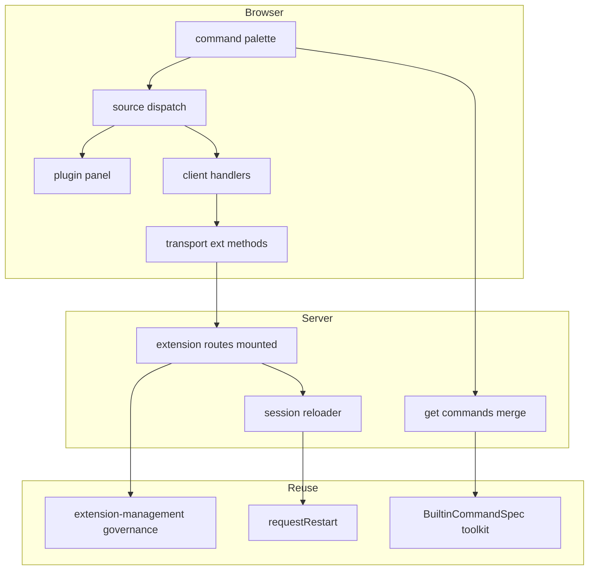
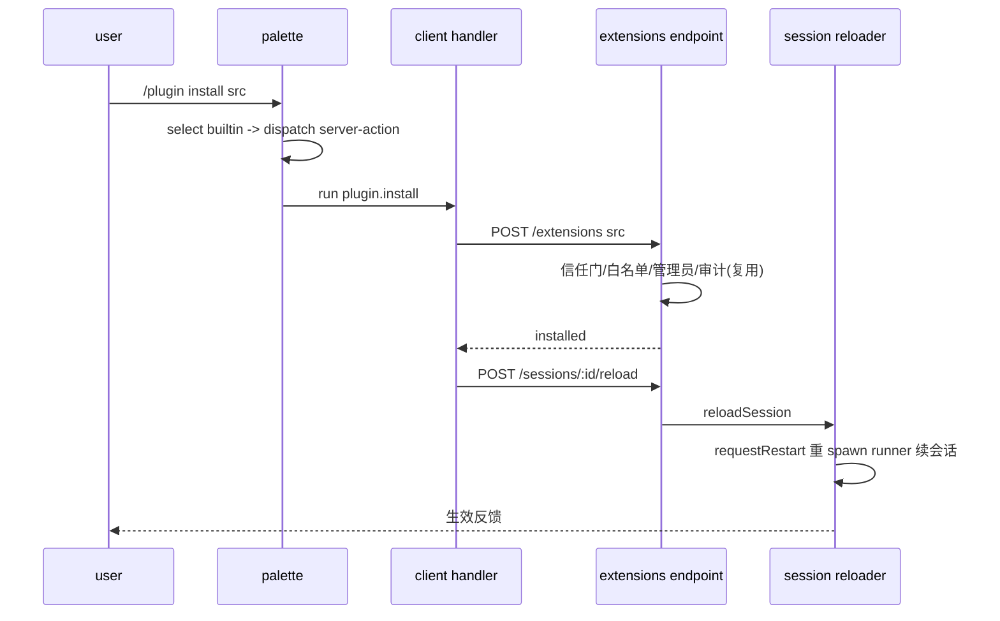
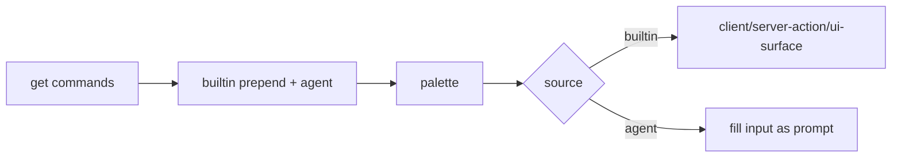

# Design Document — builtin-plugin-command

## Overview

**Purpose**: 为 pi-web 引入 harness 级「内置斜杠命令层」，首个成员 `/plugin` 用于安装/管理 plugin；内置命令执行 harness 逻辑而非注入 LLM。
**Users**: pi-web 用户（用 `/plugin` 获取/管理扩展）与运营者（控制安装信任）。
**Impact**: 命令面板从「全部 agent 命令、选中即发提示」扩展为「内置命令 + agent 命令合流、按落点分派」；接通既有但未挂载的 `extension-management` 安装机制并补全 runner 重载。

### Goals
- 内置命令与 agent 命令合流到面板，内置命令确定性执行（不进 LLM）。
- `/plugin` 安装/卸载/列出/启停/更新闭环，复用 `extension-management`。
- 安装信任门 + 安装后 runner 生效 + 绝不可模型触发。

### Non-Goals
- marketplace / Discover（Phase 2）。
- webext 浏览器侧加载实现（`webext-package-install`；本 spec 仅触发其生效路径）。
- 重写安装治理（复用 `extension-management`）。

## Boundary Commitments

### This Spec Owns
- 内置命令声明（`BuiltinCommandSpec`）+ 默认集（`/plugin`）+ client/server handler 绑定。
- `GET /sessions/:id/commands` 的内置/agent 合流与冲突优先级。
- 命令面板的 source 分派（builtin → 客户端/服务端动作/UI 表面）。
- 挂载 `extension-management` 路由 + 实现并注入 `SessionReloader`（经 `requestRestart`）。
- `/plugin` 管理面板。

### Out of Boundary
- `extension-management` 的安装治理与端点实现（复用）。
- webext 加载（`webext-package-install`）。
- `RpcSlashCommand` 之外的协议结构变更；marketplace。

### Allowed Dependencies
- `extension-management`：`createExtensionRoutes` 及 `/extensions`、`/sessions/:id/reload` 端点。
- `slash-command-palette`：`PiCommandPalette`。
- `packages/tool-kit`：声明层范式（`ToolSpec`/`AIGC_TOOLS`）。
- `PiRpcProcess.requestRestart`（经 `PiSession` 薄方法）。

### Revalidation Triggers
- `RpcSlashCommand.source` 枚举变化；`BuiltinCommandSpec` 契约变化。
- `/plugin install` 完成挂点契约变化（`webext-package-install` 的 4.2 依赖它）。
- `SessionReloader` 注入契约变化；`/extensions` 端点形状变化。

## Architecture

### Existing Architecture Analysis
- 命令链已全：仅需在 `GET /commands` 合流 + 在 palette `select()` 加分派分支。
- `extension-management` 已实现安装治理与 4 端点，但 `pi-handler` 未挂载、`SessionReloader` 未注入 → 本 spec 补这两缺口（非重写）。
- `requestRestart()` 提供 runner 重启续会话能力，正合 SessionReloader 之需。

### Architecture Pattern & Boundary Map


**Integration**: 选定「合流 + 分派」最小侵入模式。依赖方向 `protocol(类型) → tool-kit(声明) → server(合流/挂载/reloader) → react(transport/handlers) → ui(palette/panel)`，不反向。

### Technology Stack
| Layer | Choice | Role |
|---|---|---|
| Frontend | React/Next（既有 palette + app-shell） | 分派、面板、transport |
| Backend | 既有 http 路由注入接缝 | 合流、挂载 ext 路由、reloader |
| 复用 | extension-management / requestRestart / tool-kit 声明范式 | 安装治理 / runner 重启 / 声明层 |

## File Structure Plan

### Directory Structure
```
packages/tool-kit/src/commands/
├── types.ts            # 新增: BuiltinCommandSpec 类型
└── builtin.ts          # 新增: BUILTIN_COMMANDS(含 /plugin)纯数据

packages/protocol/src/rpc/
└── session-state.ts    # 修改: RpcSlashCommand.source 枚举 +"builtin"

packages/server/src/
├── http/routes/query-routes.ts   # 修改: makeCommandsHandler 合流内置命令
└── session/pi-session.ts         # 修改: 新增 restartRunner() 转发 channel.requestRestart()

lib/app/
├── pi-handler.ts                 # 修改: routes 加 createExtensionRoutes(...) + 注入 SessionReloader
└── plugin-command/
    ├── client-handlers.ts        # 新增: /plugin 客户端 handler 注册表(install/uninstall/list...)
    └── to-rpc-command.ts         # 新增: BuiltinCommandSpec → RpcSlashCommand(source:builtin) 映射

packages/react/src/
└── client/pi-client.ts           # 修改: 增 installExtension/removeExtension/listExtensions/reloadSession

packages/ui/src/
├── controls/pi-command-palette.tsx  # 修改: select() 按 source 分派 + builtin 徽标
└── web-ext/plugin-panel.tsx         # 新增: /plugin 管理面板(已装/错误/启停卸)
```

### Modified Files
- `session-state.ts` — source 枚举 +builtin（向后兼容）。
- `query-routes.ts` — 合流前置内置命令、同名内置优先。
- `pi-session.ts` — `restartRunner()` 薄方法。
- `pi-handler.ts` — 挂 ext 路由 + 注入 `reloadSession = (s)=>s.restartRunner()`。
- `pi-command-palette.tsx` — 分派分支 + 徽标。
- `pi-client.ts` — 扩展安装相关 REST 方法。

## System Flows

### /plugin install 全链


### 命令合流与分派


## Requirements Traceability
| Requirement | Components | Flows |
|---|---|---|
| 1.1-1.5 合流/来源/优先级/徽标/兼容 | query-routes(merge), to-rpc-command, session-state(enum), palette(徽标) | 合流 |
| 2.1-2.4 分派不进 LLM | palette.select(分派), client-handlers | 分派 |
| 3.1-3.6 /plugin 形态 | builtin.ts(/plugin+subcommands), client-handlers, plugin-panel | install/分派 |
| 4.1-4.3 复用安装 | pi-handler(挂载), pi-client(REST), extension-management(复用) | install |
| 5.1-5.4 信任门 | extension-management(白名单/admin/审计/ignore-scripts 复用) | install |
| 6.1-6.3 装后生效 | pi-handler(注入 reloader), pi-session.restartRunner, webext-package-install(webext 路) | install |
| 7.1-7.2 非模型触发 | builtin.ts(user-only 语义), 分派不进消息流 | 分派 |
| 8.1-8.3 面板 | plugin-panel, pi-client(list) | 分派 |
| 9.1-9.3 失败可观测 | extension-management(audit/脱敏 复用), palette(失败反馈) | install/分派 |

## Components and Interfaces

| Component | Layer | Intent | Req | Contracts |
|---|---|---|---|---|
| BuiltinCommandSpec | tool-kit | 内置命令纯声明 | 1,2,3,7 | State |
| toRpcSlashCommand | server/lib | 声明→RpcSlashCommand(builtin) | 1 | Service |
| commands merge | server | 合流前置+冲突优先 | 1 | API |
| restartRunner | server | 转发 requestRestart | 6 | Service |
| extension routes mount | lib | 挂载 + 注入 reloader | 4,5,6 | API |
| client handlers | react/lib | /plugin 落点执行 | 2,3 | Service |
| palette dispatch | ui | 按 source 分派 + 徽标 | 1,2 | State |
| plugin panel | ui | 已装/错误/启停卸 | 8 | State |

### BuiltinCommandSpec（tool-kit，纯声明）
```typescript
export type BuiltinCommandTarget =
  | { readonly kind: "client" }
  | { readonly kind: "server-action" }
  | { readonly kind: "ui-surface"; readonly slot: string };

export interface BuiltinSubcommand {
  readonly name: string;
  readonly description?: string;
  readonly argumentHint?: string;
}

export interface BuiltinCommandSpec {
  readonly name: string;            // 无前导 /
  readonly description: string;
  readonly argumentHint?: string;
  readonly aliases?: readonly string[];
  readonly target: BuiltinCommandTarget;
  readonly subcommands?: readonly BuiltinSubcommand[];
  /** 仅用户可触发；模型不可调用（绝不进消息流/工具表）。 */
  readonly userOnly: true;
}
```

### SessionReloader 注入 + restartRunner
```typescript
// PiSession 新增（转发底层 channel）：
interface PiSession {
  restartRunner(): Promise<void>; // 经 channel.requestRestart() 重 spawn 续会话
}
// pi-handler 注入：
const reloadSession: SessionReloader = async (session) => {
  await session.restartRunner();
};
```
- Preconditions: 会话存在且 channel 在线。
- Postconditions: runner 子进程以同一会话 id/env 重 spawn → 重解析资源（含新装扩展）。
- Invariants: 续上对话历史；重启中旧进程 error 不计崩溃（既有 restarting 语义）。

### 命令合流（query-routes.makeCommandsHandler 改）
```typescript
// 返回 { commands: [...BUILTIN_COMMANDS.map(toRpcSlashCommand), ...agentCommands] }
// 同名以内置优先（去重时 builtin 胜）。
```

### 客户端分派（palette.select 改）
```typescript
function select(cmd: RpcSlashCommand): void {
  if (cmd.source !== "builtin") { onChange(`/${cmd.name} `); return; } // 现状不变
  const handler = BUILTIN_CLIENT_HANDLERS[cmd.name];
  void handler?.(ctx, parseArgs(value)); // /plugin→开面板; install→调 /extensions; ...
}
```

### 客户端 handler / transport
```typescript
interface PiClient {
  listExtensions(id: string): Promise<{ extensions: InstalledExtension[] }>;
  installExtension(id: string, source: string, scope?: "global"|"project"): Promise<void>;
  removeExtension(id: string, extId: string): Promise<void>;
  reloadSession(id: string): Promise<void>;
}
```

## Error Handling
- 安装失败：复用 extension-management 的错误响应 + 审计脱敏；palette 呈现原因（9.1-9.3）。
- reload 未配置/失败：明确反馈（6.2）。
- 单个内置命令失败不影响会话与其余命令（9.2）。

## Testing Strategy
### Unit
- toRpcSlashCommand：BuiltinCommandSpec→source:builtin 映射。
- 合流：内置前置 + 同名内置优先。
- restartRunner：转发 requestRestart（mock channel）。
### Integration
- 挂载后 `/extensions` 4 端点可达；install→reload 触发 restartRunner。
### E2E（NEXT_DIST_DIR=.next-e2e external server, stub）
- `/plugin` 出现在面板且带 builtin 徽标；无参打开面板。
- 选中内置命令不向会话发出 prompt（消息流无 "/plugin"）。
- install 路径（stub/受控来源）→ 面板反馈（真实 pi install 归集成/手测）。

## Security Considerations
- 安装执行代码：复用白名单 + 管理员门控 + `--ignore-scripts` + 审计（5.x）。
- 内置安装/卸载 user-only，绝不暴露为模型工具（7.x）。
- 改注入路由后 dev 必须重启（端口 3010）。
