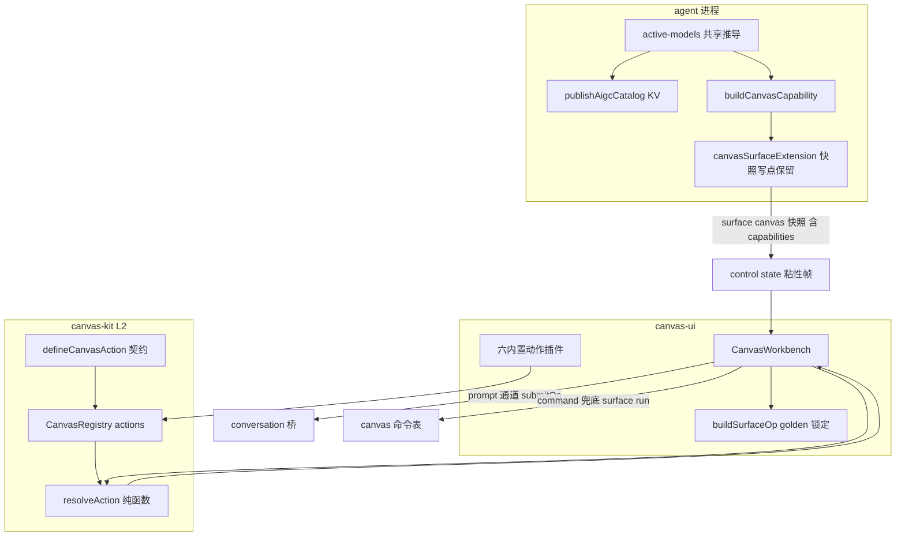
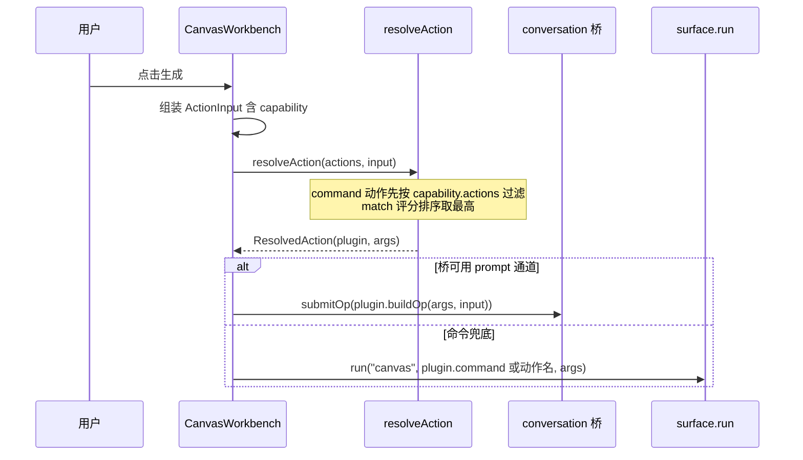

# Design Document — canvas-actions-m2

## Overview

**Purpose**:把 Canvas「生成什么、怎么生成」从封闭 if 链改为评分制动作插件链(`defineCanvasAction`),并把模型/尺寸/动作清单权威从前端硬编码移回 agent 侧(capability 切片经 surface:canvas 快照下发)。内置六动作自举迁移 = 行为回归线。
**Users**:canvas 插件作者(M3 起可声明第三方动作)、Canvas 使用者(清单与 agent 真实能力一致)、pi-web 维护者(决策全分支纯函数可测)。
**Impact**:canvas-kit L2 新增动作契约与注册面;canvas-ui workbench 决策改插件驱动、清单改快照消费(硬编码退 fallback);tool-kit canvas surface 快照新增可选 `capabilities` 切片。`decideGenerate`/`buildToolPrompt` 保签名退役。

### Goals
- 动作链插件化:`defineCanvasAction` 评分制契约 + per-instance 注册 + `resolveAction` 纯函数决策,六内置动作自举。
- 能力清单 agent 权威下发:capability(models/sizes/actions)并入 surface:canvas 快照(零新帧/零新键),前端硬编码清单退 fallback,与既有 `aigc.models` KV 同源生成。
- 成功判据:golden/既有单测/e2e 6 条零改动全绿 + 新增决策/能力/退化测试全绿。

### Non-Goals
- M3 canvasPlugins 车道①②(webext/插件包挂载)、注册表跨扩展命名空间、贴纸范例。
- `requires` 前置资产编排下沉内核(generate() 的扩图合成/掩码光栅化编排原样保持,留 M3+ 账)。
- canvas-kit 内核 L1 与 8 舞台工具行为变更;组件视觉/DOM 锚点变更;protocol 包改动(canvas-op fence 维持 tool-kit 现约定,拍板②);多 Canvas 实例分桶(拍板③);散 KV 清单键(`aigc.models` 等)的删除收敛(SES v0.2)。

## Boundary Commitments

### This Spec Owns
- canvas-kit L2 动作契约:`ActionInput`/`CanvasCapability`/`CanvasActionPlugin<TOp>`/`ResolvedAction`/`defineCanvasAction`/`resolveAction`;`CanvasRegistry` 的动作注册面扩展(registerAction/actions,复用 diagnostics 收集器)。
- canvas-ui:六内置动作插件(`generate-actions.ts`)、workbench 决策改插件驱动、capability 消费与退化(模型/尺寸选项)、禁用工具 tooltip 诊断、`decideGenerate` 保签名重实现。
- tool-kit:`CanvasCapabilitySchema` + `GalleryState.capabilities` 可选字段;`buildCanvasCapability`(与 `publishAigcCatalog` 同源的模型清单推导共享函数);canvasSurfaceExtension 全部快照写点的 capabilities 保留。
- 新增测试与出口快照更新;Req 5(粘性)验证型关账与 Req 6.1(natural)档案化关账的裁定书。

### Out of Boundary
- pi-web-protocol、packages/server(粘性登记已在 main,零改动)、packages/ui 源码(新 API 不经 ui 转发,ui 公开面守恒)、canvas-kit kernel/*、8 舞台工具、e2e 用例文件、aigc-quick-settings 组件与 prompt-toolbar 的 KV 消费契约、/api/aigc/models 端点与 AIGC_MODEL_CATALOG、模型路由表本身。

### Allowed Dependencies
- canvas-kit:零 @blksails(硬线,动作契约不得引 SurfaceOp——以 TOp 泛型表达)。
- canvas-ui → canvas-kit / web-kit(SurfaceOp/renderSurfaceOp)/ pi-web-react(useConversationBridge)/ tool-kit aigc-canvas-schema 子入口 / primitives(现状依赖面,零新增)。
- tool-kit canvas 模块 → 包内 aigc 兄弟模块(active-models/model-config/routes);**不得引 canvas-kit**(类型同步经 canvas-ui 侧双向可赋值断言,零新包依赖边)。
- 依赖方向:canvas-kit ← canvas-ui ← ui(转发);tool-kit schema 子入口 ← canvas-ui(仅类型/schema)。

### Revalidation Triggers
- `GalleryState`/`CanvasCapabilitySchema` 形状再变更 → canvas-ui 消费与类型断言测试须复核。
- `CanvasActionPlugin` 契约破坏性调整 → M3 canvasPlugins spec 须重校。
- generate() 通道选择结构(`bridge.opChannel` 优先/`surface.run` 兜底)改变 → 六动作执行声明须重审。
- 若迁移中发现 if 链有考古未列分支/消费者 → 停 task 回 design 补裁。

## Architecture

### Existing Architecture Analysis
- 决策:`decideGenerate`(canvas-ui workbench :185-204,6 分支 if 链)+ `ACTION_LABEL`(:206-213)+ `buildSurfaceOp`(golden 锁定)+ `buildToolPrompt`(已是 `renderSurfaceOp(buildSurfaceOp())` 薄包装)。
- 执行:generate()(:698-844)通道选择 host 级(`bridge.opChannel==="prompt"` 优先对话流,`surface.run` 命令兜底);outpaint/inpaint 有动作特有资产编排。
- 清单:workbench `DEFAULT_MODEL_OPTIONS`/`RATIO_OPTIONS` 硬编码;agent 侧 `publishAigcCatalog` 短退避下发 `aigc.models/modelLabels/modelProviders/sizes` KV(quick-settings 消费);模型尺寸知识无权威表达(仅 :144 注释)。
- 快照:`GalleryState={assets, livePreview?}`;extension 装配 createSurface + agent_end 全量重建;commands reducer 刻意只写 assets(丢 livePreview 是语义)。
- 粘性:`piweb_state` 分支已按 key 登记粘性帧(pi-session.ts:594,含 delete 帧语义)且有专测——Req 5 已被 main 满足。

### Architecture Pattern & Boundary Map



**Architecture Integration**:
- 选定模式:注册表驱动决策(defineCanvasTool/registerBuiltinTools 先例的动作版)+ capability 同源双轨下发(KV 保留、快照并入)。
- 既有模式保持:L1/L2 分层与出口纪律、显式清单出口、props 注入可测、golden 守恒线、AAS 路线 A(零新帧)。
- 新组件理由:契约进 canvas-kit(M3 第三方插件的 semver 承诺面);内置动作在 canvas-ui(SurfaceOp 依赖,守 canvas-kit 零 @blksails 硬线);active-models 共享函数(同源=同一推导,消灭第三口径)。

### Technology Stack
无新依赖、无版本变更。zod(tool-kit 既有)承载 CanvasCapabilitySchema;其余纯 TypeScript。

## File Structure Plan

### New Files
| 文件 | 职责 |
|---|---|
| packages/canvas-kit/src/actions.ts | 动作契约唯一家:`CanvasCapability`/`ActionInput`/`CanvasActionPlugin<TOp>`/`ResolvedAction<TOp>`/`defineCanvasAction`/`resolveAction(actions, input, opts?)`(纯函数;match 抛错经 opts.onError 隔离为不适用;同分并列取注册序先者) |
| packages/canvas-kit/test/actions.test.ts | resolveAction 全路径(最高分/false 排除/抛错隔离/同分稳定/空表 null/command 白名单过滤入参语义)+ defineCanvasAction 恒等 |
| packages/canvas-kit/test/action-registry.test.ts | registerAction:同 id 拒绝+diagnostics、退订、注册序、per-instance 隔离 |
| packages/canvas-ui/src/generate-actions.ts | `BUILTIN_GENERATE_ACTIONS`(六插件,评分 100/90/80/70/60/10,match/buildArgs 逐分支复刻 if 链,execution via:"prompt" 的 buildOp 走既有 buildSurfaceOp 路径)+ `registerBuiltinGenerateActions(reg)` + `toGenerateDecision` 映射 |
| packages/canvas-ui/test/generate-actions.test.ts | 六动作 match/buildArgs 奇偶校验表(输入矩阵穷举分支边界:hasExpand 删 size、reference 条件 n、reframe 空 prompt+size、优先级压制)+ 与 `decideGenerate` 输出逐项相等的守恒断言 |
| packages/canvas-ui/test/capability-type-sync.test.ts | tool-kit `CanvasCapabilitySchema` 推断类型 ↔ canvas-kit `CanvasCapability` 双向可赋值静态断言(防漂移,零新包依赖边) |
| packages/tool-kit/src/aigc/active-models.ts | 「activeRoutes→有序模型清单(model/label/provider)」共享纯函数(自 extension.ts 提取;publishAigcCatalog 与 buildCanvasCapability 同源消费) |
| packages/tool-kit/src/aigc/canvas/capability.ts | `buildCanvasCapability(deps?)`:models(active-models + provider→尺寸族规则 sizes)/sizes(全局三档=现 RATIO_OPTIONS 守恒)/actions(A 档 6 命令名字面量) |
| packages/tool-kit/test/aigc/canvas-capability.test.ts | capability 生成:禁用模型过滤、provider 尺寸族、actions 白名单恰 6 项、确定性 |
| packages/tool-kit/test/aigc/canvas-capability-persistence.test.ts | 快照写点保留:initialState/hydrate/agent_end 收敛/sync/各命令 reducer 后 capabilities 存活(逐写点断言) |
| packages/ui/test/canvas/workbench-capability.test.tsx | 组件级:快照含 capability→模型/尺寸选项来自下发;选中模型按 models[].sizes 收窄;capability 缺失→DEFAULT/RATIO 回退(既有 harness 复用,新文件) |
| packages/ui/test/canvas/workbench-tool-diagnostics-tooltip.test.tsx | 禁用工具 title 含 diagnostics 原因;无诊断时呈现零变 |

### Modified Files
| 文件 | 变更 |
|---|---|
| packages/canvas-kit/src/registry.ts | `CanvasRegistry` 增 `registerAction(action): () => void` 与 `readonly actions`(同 id 拒绝+记 diagnostics,复用共享收集器;`ToolDiagnostic` 增可选 `kind?: "tool" \| "action"`);头注补 natural 保证矩阵(留账①档案化关账,注释级) |
| packages/canvas-kit/src/index.ts | +actions.ts 显式出口(值:defineCanvasAction/resolveAction;类型:CanvasCapability/ActionInput/CanvasActionPlugin/ResolvedAction 等) |
| packages/canvas-kit/test/index-exports.test.ts | 出口快照 27→N 联动更新(唯一允许改动的既有测试) |
| packages/canvas-ui/src/canvas-workbench.tsx | ①decideGenerate 重实现为 resolveAction 包装(签名/语义/导出零变);②workbench 装配注册六动作(registerBuiltinTools 同位);③decisionPreview/generate 改经 resolveAction(含 via:"command" 动作的 capability.actions 门控过滤;通道选择与资产编排分支结构零变);④knownModels/ratio 选项接 capability(缺失回退 DEFAULT_MODEL_OPTIONS/RATIO_OPTIONS;选中模型按 models[].sizes 收窄);⑤工具轨禁用项 title 拼接 diagnostics 首条原因 |
| packages/canvas-ui/src/index.ts | +generate-actions 显式出口(BUILTIN_GENERATE_ACTIONS/registerBuiltinGenerateActions) |
| packages/canvas-ui/test/index-exports.test.ts | 出口快照联动更新(唯一允许改动的既有测试) |
| packages/tool-kit/src/aigc/extension.ts | publishAigcCatalog 的模型清单推导改调 active-models 共享函数(KV 键/值/顺序零变,纯提取重构) |
| packages/tool-kit/src/aigc/canvas/schema.ts | +`CanvasCapabilitySchema`(models[{id,label?,sizes?}]/sizes[{label,size}]/actions[string]);`GalleryStateSchema` +`capabilities` 可选字段;`emptyGalleryState` 不变 |
| packages/tool-kit/src/aigc/canvas/extension.ts | 装配期 `buildCanvasCapability()` 算一次;initialState/hydrate 结果/agent_end 重建以 `withCapabilities` 统一附着 |
| packages/tool-kit/src/aigc/canvas/commands.ts | 各命令 reducer 与 sync 全量重建显式保留 `capabilities`(livePreview 刻意丢弃语义保持);`CanvasCommandDeps` 增 capability 注入接缝 |

### 不改(显式承诺)
packages/ui/src/**(含转发层与 index.ts,ui 公开面守恒);packages/server/**(粘性已在 main);packages/protocol/**;packages/canvas-kit/src/kernel/** 与 builtin/**(8 工具);e2e/**;examples/**;packages/ui/test 既有文件(新增文件除外);golden 测试与 fixtures;aigc-quick-settings.tsx;model-catalog.ts;/api/aigc/models 端点。

## System Flows

### 决策与执行(插件驱动后)



- 门控条件:`via:"command"` 声明的动作,当 capability 缺失或其 command 不在 `capability.actions` 时,进入 resolveAction 前被过滤(拍板①:无插件声明的 actions 白名单项不自动长按钮——白名单只做避让判断输入)。内置六动作全 `via:"prompt"`,不受此门影响,行为守恒。
- capability 下发链:装配期 `buildCanvasCapability()` → 并入初始快照 → `piweb_state` → `control:"state"` 粘性帧(登记已在 main)→ 刷新/重连回放即得。

## Requirements Traceability

| Requirement | Summary | Components |
|-------------|---------|------------|
| 1.1–1.7 | 动作契约/评分/排除/冲突/隔离/实例隔离/纯函数 | canvas-kit actions.ts + registry.ts 扩展 |
| 2.1–2.6 | 六动作自举/决策守恒/兜底/标签/提示词守恒/单测 | canvas-ui generate-actions.ts + workbench 接线 + golden 零改动 |
| 3.1–3.3 | 兼容退役/消费者零改动/出口纪律 | decideGenerate 包装重实现 + 出口快照联动 |
| 4.1–4.7 | capability 下发/同源消费/尺寸收窄/退化/门控/偏好生效/测试 | tool-kit capability.ts + schema/extension/commands + workbench 消费 |
| 5.1–5.4 | 粘性回放 | **已在 main(136d2bd)**:验证型关账(server 专测+e2e② 新鲜证据) |
| 6.1–6.4 | natural 类型/档案化出口/tooltip/无诊断零变 | 6.1→6.2 档案化关账(裁定书+注释);tooltip=workbench 工具轨 |
| 7.1–7.5 | 回归线 | 全量验证任务 |

### 裁定书:Req 6.1 → 6.2 档案化关账
`ToolGestureEvent.natural` 的可空性由 hit 种类与 phase 的**运行时组合**决定(null 仅现于 stage 命中与 up/cancel;M1 2.6 五项裁定之一,路由已挡绘制工具 onDown/onMove 的 null)。onDown/onMove/onUp 共用同一事件类型,TS 无法按运行时值静态收窄同一回调签名;拆分每相位事件类型属 L2 semver 破坏面,收益(少数判空)不抵成本。**裁定:保持现类型,registry.ts 头注补「保证矩阵」文档化(何种 hit×phase 下恒非空),留账关闭。**(Req 6.2 出口)

## Components and Interfaces

| Component | Domain/Layer | Intent | Req | Key Deps | Contracts |
|-----------|--------------|--------|-----|----------|-----------|
| actions.ts 契约+resolveAction | canvas-kit L2 | 动作声明/决策纯函数 | 1.x | 无(零依赖) | Service |
| registry 动作面 | canvas-kit L2 | per-instance 注册+diagnostics | 1.4/1.6 | DiagnosticsCollector | Service |
| generate-actions.ts | canvas-ui | 六内置动作自举 | 2.x | actions.ts, buildSurfaceOp, web-kit SurfaceOp | Service |
| workbench 接线 | canvas-ui | 决策/门控/清单消费/tooltip | 2.4, 3.1, 4.2–4.6, 6.3–6.4 | registry/resolveAction/快照 | State |
| active-models.ts | tool-kit | 模型清单同源推导 | 4.1 | routes/model-config | Service |
| capability.ts + 快照写点 | tool-kit | capability 生成与下发保留 | 4.1/4.7 | active-models, schema | State |

#### canvas-kit · actions.ts(核心契约)

```typescript
/** agent 权威能力清单(结构类型;tool-kit zod 推断类型与之双向可赋值,经 canvas-ui 静态断言防漂移)。 */
export interface CanvasCapability {
  readonly models: ReadonlyArray<{
    readonly id: string;
    readonly label?: string;
    /** 该模型受支持尺寸集(缺省=不收窄,全局 sizes 全可用)。 */
    readonly sizes?: readonly string[];
  }>;
  readonly sizes: ReadonlyArray<{ readonly label: string; readonly size: string }>;
  /** agent 支持的 command 动作白名单(拍板①:仅供声明消费,不自动长 UI)。 */
  readonly actions: readonly string[];
}

/** 决策输入(≈ 既有 GenerateDecisionInput + capability;字段语义与现 decideGenerate 逐项一致)。 */
export interface ActionInput {
  readonly imageId: string;
  readonly prompt: string;
  readonly model: string;
  readonly size: string;
  readonly variants: number;
  readonly hasMask: boolean;
  readonly hasExpand: boolean;
  readonly referenceIds: readonly string[];
  /** capability 缺失时以 UNKNOWN_CAPABILITY(空清单)喂入,match 据此避让。 */
  readonly capability: CanvasCapability;
}

/** 动作插件。TOp = prompt 通道载荷类型(canvas-ui 实例化为 SurfaceOp;canvas-kit 零依赖故泛型)。 */
export interface CanvasActionPlugin<TOp = unknown> {
  readonly id: string;                       // "builtin:inpaint" / "acme:style-transfer"
  readonly label: string;                    // 生成按钮标签(替 ACTION_LABEL)
  /** 评分制:false=不适用;数值越大越优先。同分取注册序先者。纯函数。 */
  match(input: ActionInput): number | false;
  /** 命令/op 参数构造(纯函数;不含二进制,资产 att_ 由调用方编排后补充,如 inpaint mask)。 */
  buildArgs(input: ActionInput): Record<string, unknown>;
  readonly execution:
    | { readonly via: "prompt"; buildOp(args: Record<string, unknown>, input: ActionInput): TOp }
    | { readonly via: "command"; readonly command: string };
}

export function defineCanvasAction<TOp>(a: CanvasActionPlugin<TOp>): CanvasActionPlugin<TOp>;

export interface ResolvedAction<TOp = unknown> {
  readonly plugin: CanvasActionPlugin<TOp>;
  readonly args: Record<string, unknown>;
  readonly score: number;
}

export interface ResolveActionOptions {
  /** match/buildArgs 抛错回调(调用方记 diagnostics);抛错动作按不适用隔离(1.5)。 */
  onError?(actionId: string, error: unknown): void;
}

/** 纯注册表决策(1.2/1.3/1.5/1.7):via:"command" 且 command ∉ input.capability.actions 的动作先行排除(4.4/4.5)。空候选 → null。 */
export function resolveAction<TOp>(
  actions: readonly CanvasActionPlugin<TOp>[],
  input: ActionInput,
  opts?: ResolveActionOptions,
): ResolvedAction<TOp> | null;
```

- Preconditions:actions 为注册序数组;input.capability 恒非 undefined(缺失以空清单常量表达)。
- Postconditions:返回项的 plugin.match(input) 为全体数值分最大;buildArgs 已执行且未抛错(抛错则该动作被隔离后重选)。
- Invariants:不修改入参;同输入同输出。

#### canvas-kit · registry 动作面(扩展)

```typescript
export interface CanvasRegistry {
  // ……既有 registerTool/tools/diagnostics 不变……
  /** 注册动作;返回退订。同 id 拒绝(先注册者保持)+ 记 diagnostics(kind:"action")。 */
  registerAction(action: CanvasActionPlugin): () => void;
  /** 注册序稳定枚举(resolveAction 的候选源)。 */
  readonly actions: readonly CanvasActionPlugin[];
}
```

`ToolDiagnostic` 增可选 `kind?: "tool" | "action"`(additive,既有条目不写=工具语义,类型兼容)。

#### canvas-ui · generate-actions.ts(六内置动作)

- 评分:outpaint=100(hasExpand===true)/inpaint=90(hasMask)/reference=80(referenceIds.length>0)/variants=70(variants≥2)/reframe=60(prompt.trim()==="" && size!=="")/edit=10(恒适用兜底)。
- buildArgs 逐分支复刻 if 链:公共 base={image,prompt}+model?(非空)+size?(非空);outpaint 删 size;reference 附 reference_images 与条件 n(variants≥2);variants 附 n。**黄金基准=`git show HEAD:packages/canvas-ui/src/canvas-workbench.tsx` 的 decideGenerate 本体**。
- execution:全部 `{ via: "prompt", buildOp: (args, input) => buildSurfaceOp(toGenerateDecision(id, args), opts?) }` 形态——buildOp 内部走既有 buildSurfaceOp(golden 锁定,mask 注解等特殊参数照旧;maskId 类调用期资产由 workbench 编排后经 args 传入)。
- `toGenerateDecision(pluginId, args): GenerateDecision`:`"builtin:inpaint"` → `{action:"inpaint", args}` 映射表(union 字面量保持)。
- `registerBuiltinGenerateActions(reg: CanvasRegistry): void`(registerBuiltinTools 同构)。
- `decideGenerate` 重实现(workbench 内,签名/导出零变):组装 ActionInput(capability=PERMISSIVE 空清单常量)→ resolveAction(BUILTIN_GENERATE_ACTIONS, input) → toGenerateDecision;null 理论不可达(edit 恒 10),防御性回退 edit。

#### tool-kit · capability 下发

```typescript
// active-models.ts(同源推导,自 extension.ts 提取;KV 与 capability 双消费)
export interface ActiveModelEntry { readonly model: string; readonly label: string; readonly provider?: string; }
export function deriveActiveModels(disabledModels: ReadonlySet<string>): readonly ActiveModelEntry[];

// canvas/capability.ts(返回类型 = schema.ts 的 z.infer<typeof CanvasCapabilitySchema>,
// 与 canvas-kit 的 CanvasCapability 接口同名异包,双向可赋值经 canvas-ui 静态断言防漂移)
export function buildCanvasCapability(deps?: { disabledModels?: ReadonlySet<string> }): CanvasCapability;
```

- models[].sizes 尺寸族规则(provider→族):`dashscope` → `["1024x1024","1280x720","720x1280"]`;其余(newapi/sufy/openrouter,gpt/gemini 系)→ `["1024x1024","1536x1024","1024x1536"]`。全局 `sizes` = 现 RATIO_OPTIONS 三档(1:1/16:9/9:16)守恒(模型未选时 UI 零变)。
- `actions` = `["edit","inpaint","reference","variants","outpaint","reframe"]`(A 档命令名;register/sync/delete 为 B 档基础设施不进白名单)。
- **快照写点保留清单(全部显式附着 capabilities,livePreview 刻意丢弃语义不变)**:①extension initialState;②hydrate 结果;③agent_end 全量重建;④commands `sync` 全量重建;⑤各命令成功 reducer(`{capabilities: s.capabilities, assets: […]}`);⑥register/delete reducer。经 `CanvasCommandDeps` 注入 capability 或以 `withCapabilities(caps)(state)` 帮助函数统一表达;persistence 专测逐写点断言。

#### canvas-ui · workbench 消费与退化(4.2–4.6, 6.3–6.4)

- `capabilities = surface.getState<GalleryState>(STATE_KEY)?.capabilities`(订阅已有,随快照更新)。
- 模型选项:`capabilities?.models.map(m => m.id) ?? modelOptions ?? DEFAULT_MODEL_OPTIONS`(显示口径维持 id 文本,视觉零变;modelOptions prop 优先级保持在 capability 之后?——**裁定:capability > modelOptions prop > DEFAULT**,prop 是测试/宿主覆盖接缝,真实下发应胜出;测试新文件按此锚定)。
- 尺寸选项:`capabilities?.sizes ?? RATIO_OPTIONS`;当前选中模型在 `capabilities.models` 中且带 `sizes` → 交集收窄(4.3);自定义 W×H 输入保持。已选 size 因切换模型不再受支持 → 复位为 ""(跟随原图),不静默发不支持组合。
- 退化(4.4):`capabilities` 缺失或 `available===false` → 全部回退硬编码 + `via:"command"` 声明动作不参与决策(resolveAction 前过滤;内置全 prompt 不受影响)。
- 生成请求(4.6):所选 model/size 经 ActionInput 进 buildArgs,与现状同径。
- tooltip(6.3/6.4):工具轨按钮 `title` 在 `disabledTools.includes(t.id)` 且 diagnostics 有该 id 条目时拼 `${现 title}(已禁用:${首条 error})`;无诊断时零变。DOM 锚点(data-canvas-tool)不动。

## Error Handling

- match/buildArgs 抛错:resolveAction 捕获 → onError 回调(workbench 记 diagnostics,kind:"action")→ 该动作按不适用隔离,决策继续(1.5;L2 错误隔离条款)。
- buildOp 抛错(prompt 载荷构造):workbench 捕获记 diagnostics 并中止本次生成(busy 复位),画布不崩。
- capability 生成失败(agent 侧读设置异常):buildCanvasCapability 内部兜底为「catalog 全量+全局尺寸」确定性输出,不抛出、不阻塞装配(与 hydrate 退化同哲学)。
- 快照缺 capabilities(旧 agent/退化):前端可选字段,回退路径即正常路径之一(4.4),无错误态。

## Testing Strategy

1. **Unit(新增,全部带变异纪律)**:canvas-kit actions(resolveAction 全路径:最高分/false/抛错隔离/同分注册序/空表 null/command 白名单过滤)+ action-registry(冲突/退订/隔离);canvas-ui generate-actions 奇偶校验表(输入矩阵穷举六分支边界 + 与 decideGenerate 输出逐项相等);tool-kit capability(禁用过滤/尺寸族/actions 恰 6/确定性)。
2. **Integration(新增)**:tool-kit capability-persistence(六写点 capabilities 存活);packages/ui/test/canvas 新文件×2(capability 消费/收窄/回退;禁用 tooltip)。
3. **Regression(零改动硬线)**:golden(build-surface-op-golden)+ canvas-workbench.test 等 ui 全量 698;canvas-kit 222(出口快照联动除外);canvas-ui 既有;tool-kit 既有;server state-sticky 专测新鲜跑(Req 5 关账证据);workspace typecheck。
4. **E2E(零改动)**:aigc-canvas 5 条 + degrade 1 条(基线 0377b12 全绿;任何红不许赖 pre-existing)。外部 server + .next-e2e 隔离构建先例。
5. **静态线**:canvas-kit encapsulation(kernel 不出口)保持;canvas-ui encapsulation/SES-H1 四线保持(M2 不触 ui 源,词表不含 action);出口快照 canvas-kit/canvas-ui 显式更新并核清单。
