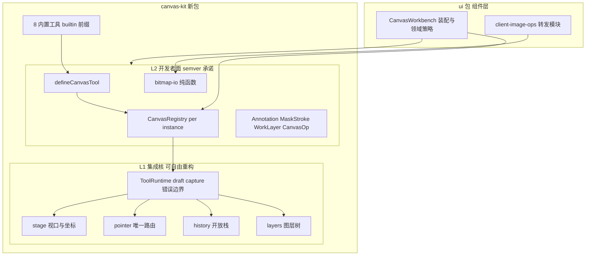
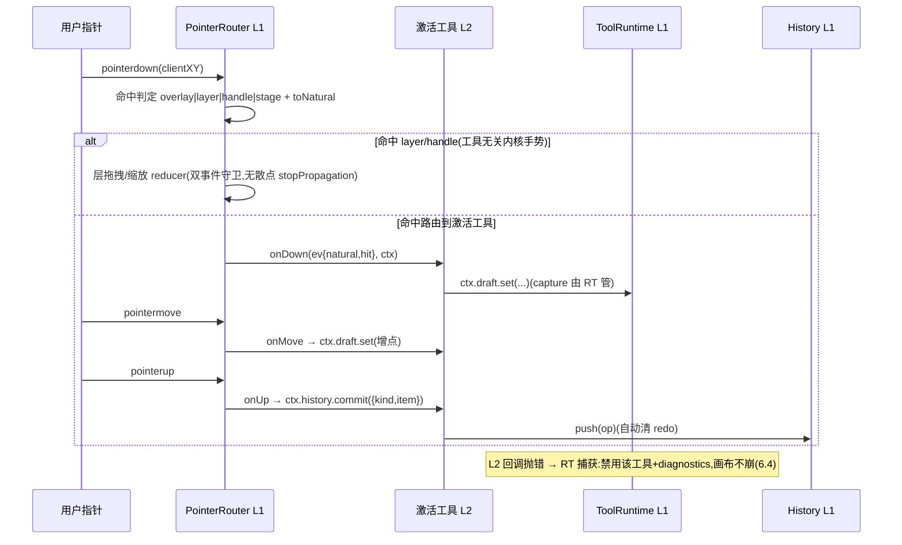

# Design Document — canvas-kit-m1

## Overview

**Purpose**: 把 CanvasWorkbench(2077 行)中领域无关的交互复杂性析出为独立包 `@blksails/pi-web-canvas-kit` 的 **L1 集成核**(stage 坐标/pointer 唯一路由/history 开放栈/layers/bitmap-io),并以 **L2 开发者面**(defineCanvasTool + per-instance CanvasRegistry)把 8 个内置舞台工具改造为注册表驱动的插件——内置自举即扩展点验收。

**Users**: 工具插件作者(L2:声明式定义工具,拿已换算坐标与语义化手势)、canvas 组件维护者(L1 消费方:workbench 从 2077 行单体卸下交互内核)。最终用户零可见变化(行为回归零改动硬线)。

**Impact**: 新增 packages/canvas-kit;canvas 组件**留在 ui 包**消费内核(范围修订裁决);ui 的 client-image-ops 变转发模块(深路径+包入口双兼容);tool-kit/agent 侧/surface 协议零改动。

### Goals
- canvas-kit 包:零 ui 依赖、L2 公开面 semver 承诺、kernel 内部件不出口。
- kernel 四模块 + bitmap-io 迁入;8 工具 defineCanvasTool 化(`builtin:` 前缀)。
- 工具轨/overlay/选项条/指针分派全部注册表驱动;插件抛错禁用不崩。
- 既有 canvas 单测与 e2e 零改动全绿。

### Non-Goals
- 组件迁出 ui 包与 SES-H1(M1.5);decideGenerate 动作链与能力清单(M2);webext canvasPlugins(M3)。
- surface 协议/agent 侧 canvas extension/对话桥门面的任何改动。
- gallery/launcher/lineage-view/aigc-*/use-canvas-view 的行为变更。

## Boundary Commitments

### This Spec Owns
- canvas-kit 包全部内容:kernel(stage/pointer/history/layers)、bitmap-io(client-image-ops 迁入)、L2 API(defineCanvasTool/CanvasRegistry/hooks)、内置 8 工具定义、其类型 canonical 家(Annotation/MaskStroke/ExpandEdges/WorkLayer/CanvasOp)。
- workbench 的**交互装配方式**(散点分支 → 注册表驱动);ui 包 client-image-ops 转发模块。

### Out of Boundary
- workbench 的领域策略(decideGenerate/buildSurfaceOp/bridge 提交/三态呈现/A 档命令/livePreview)——只搬运不改语义。
- 层拖拽/缩放/扩图手柄的 DOM 结构与视觉;画廊/启动器/血缘视图。
- tool-kit canvas/ 目录;pi 协议;SSE 帧。

### Allowed Dependencies
- 依赖方向(法):`canvas-kit ←(消费) ui`;canvas-kit 零 @blksails/* 依赖,peer react + dep lucide-react;**canvas-kit 不得 import ui**。
- workbench 可 import canvas-kit 全部 L2 面;kernel 内部模块路径不出现在任何 ui 侧 import(封装线)。

### Revalidation Triggers
- L2 公开面(defineCanvasTool/ToolGestureEvent/CanvasToolContext/registry)形状变更 → M2/M3(动作链、webext 车道)须复核。
- 类型 canonical 家迁移(Annotation 等)→ 深路径消费者与 M1.5 组件迁出复核。
- ui 转发模块移除(一个大版本后)→ 全仓 grep 深路径消费。

## Architecture

### Existing Architecture Analysis
- 8 工具 = `StageTool` union(workbench:105)+ 四处硬编码散点(工具轨 :1364-1404 / 指针分支 :1120-1209 / overlay 光栅化 :615-650 / 选项条 :1406-1453);新工具需改 4 处。
- 手势骨架同构:pointer capture → draft ref+state 双写 → up 提交 `{kind,item}` 进 ops 并清 redoOps;text 特例(up 时才挂编辑器防 blur);move=舞台平移(drag ref :1257-1290)、expand=手柄(:1661)。
- 双事件 bug 族:层/手柄 onMouseDown stopPropagation 散点补丁(:1604/:1662)。
- client-image-ops 纯函数(567 行 30 导出)零 ui 依赖;测试深路径 import(workbench.test:11)。
- **实施前提**:拖放/粘贴 WIP 合入 main 后开工(用户裁决);行号以合入后基线校准。

### Architecture Pattern & Boundary Map



**Architecture Integration**:
- Selected pattern: **注册表 + ToolRuntime**(L1 持 draft/capture/分派/错误边界,L2 纯声明)。「工具=组件自挂事件」被否决(事件散点回潮,双事件族无法根治);「只迁纯函数」被否决(③ 验收不达)。评估见 research.md。
- Domain boundaries: L2→L1 单向;kernel 内部模块不出口(封装线);workbench 只做装配与领域策略。
- Existing patterns preserved: 包脚手架照 web-kit;测试布局照 react 包;`builtin:` 前缀命名空间照 webext SlotKey 惯例。
- Steering compliance: 依赖单向;协议零改动;TS strict。

### Technology Stack

| Layer | Choice / Version | Role in Feature | Notes |
|-------|------------------|-----------------|-------|
| 新包 | `@blksails/pi-web-canvas-kit` | kernel + L2 API + 内置工具 + bitmap-io | peer react;dep lucide-react;零 workspace 依赖 |
| 组件层 | `@blksails/pi-web-ui` | workbench 消费内核;转发模块 | root tsconfig paths 需加包别名(memory 坑) |
| 测试 | vitest(+ jsdom 手势模拟) | kernel 单测 + 行为回归 | 既有 ui 测试零改动是硬线 |

## File Structure Plan

### New Files(packages/canvas-kit/)
```
packages/canvas-kit/
├── package.json               # 照 web-kit 形;exports "." → src/index.ts
├── tsconfig.json / vitest.config.ts
├── src/
│   ├── index.ts               # L2 公开面唯一出口(kernel 内部件不出现)
│   ├── types.ts               # Annotation/MaskStroke/ExpandEdges/WorkLayer/CanvasOp canonical 家
│   ├── bitmap-io.ts           # client-image-ops 原样迁入(函数语义零变)
│   ├── registry.ts            # createCanvasRegistry(per-instance)/defineCanvasTool/CanvasTool 类型
│   ├── kernel/                # L1(不出口)
│   │   ├── stage.ts           # 视口状态 + toNatural 换算(纯函数芯 + controller)
│   │   ├── pointer.ts         # PointerRouter:命中描述符 + 单点分派 + 双事件守卫
│   │   ├── history.ts         # 开放 op 栈(push 清 redo/undo/redo)+ OpKind 光栅化注册
│   │   ├── layers.ts          # 图层树 store(增删改/命中/拖拽缩放 reducer)
│   │   └── tool-runtime.ts    # draft 槽(ref+state 双写)/capture/L2 错误边界(抛错禁用+diagnostics)
│   └── builtin/               # 8 内置工具(经公开 defineCanvasTool 自举)
│       ├── index.ts           # registerBuiltinTools(registry)
│       ├── move.ts / expand.ts / draw.ts / line.ts / arrow.ts / text.ts / mask.ts / erase.ts
├── test/
│   ├── stage.test.ts          # 坐标换算纯函数(缩放/平移矩阵)
│   ├── pointer.test.ts        # 命中路由分派/层手势与舞台平移互斥(双事件守卫)
│   ├── history.test.ts        # 开放注册/push 清 redo/undo-redo 序
│   ├── layers.test.ts         # 增删改/命中/reducer
│   ├── registry.test.ts       # per-instance 隔离/注册驱动/插件抛错禁用不崩(diagnostics)
│   └── builtin-tools.test.ts  # 8 工具声明形状 + draft 生命周期(mask/anno/draw/text 特例)
```

### Modified Files
- `packages/ui/src/canvas/canvas-workbench.tsx` — 卸下:StageTool union/四散点分支/toNatural/ops 双栈/layers 状态/双事件补丁 → 改为装配 canvas-kit(createCanvasRegistry + registerBuiltinTools + kernel hooks);保留:领域策略(decideGenerate/buildSurfaceOp/bridge/三态/A 档/livePreview)与既有 DOM data-* 锚点(测试兼容)。
- `packages/ui/src/canvas/client-image-ops.ts` — 改写为转发模块(`export * from "@blksails/pi-web-canvas-kit"` 对应子集,@deprecated 一个大版本),深路径与包入口双兼容(5.3/7.1)。
- `packages/ui/package.json` — 增 dependency `@blksails/pi-web-canvas-kit: workspace:*`。
- 根 `tsconfig.json` — paths 增 canvas-kit 别名;`pnpm-workspace.yaml` 覆盖确认(packages/* 通配已含)。
- `packages/ui/vitest.config.ts`(若有 alias 表)— 同步 canvas-kit 解析。

## System Flows



流程级决策:命中优先级 layer/handle > 激活工具 overlay > stage(与现状行为一致);层手势为工具无关内核手势(现状:任何工具下都可拖层);move 工具消费 stage 命中执行 `ctx.stage.panBy`;text 的 up-时挂编辑器经工具 `overlayReact` 贡献 + `ctx.defer` 原语。

## Requirements Traceability

| Requirement | Summary | Components | Interfaces |
|-------------|---------|------------|------------|
| 1.1–1.4 | 独立包/零 ui 依赖/L2 出口/semver | package 脚手架 + index.ts | exports 面 |
| 2.1–2.3 | 视口与坐标唯一实现/回调坐标已换算 | kernel/stage + ToolRuntime | `toNatural`, `ToolGestureEvent.natural` |
| 3.1–3.4 | 指针唯一路由/双事件守卫/语义化回调 | kernel/pointer | `PointerRouter`, 命中描述符 |
| 4.1–4.4 | 开放 undo/redo/插件提交/一视同仁 | kernel/history | `CanvasOp`, `HistoryApi` |
| 5.1–5.4 | 图层内核/bitmap-io 迁入/转发兼容 | kernel/layers + bitmap-io + ui 转发模块 | `LayersApi`, re-export |
| 6.1–6.5 | defineCanvasTool/8 内置/注册表驱动/错误边界/per-instance | registry + builtin/ + tool-runtime | `CanvasTool`, `CanvasRegistry` |
| 7.1–7.5 | 行为回归/新增单测/typecheck/不可见化证明 | 全部 + workbench 装配 | 测试与 grep 线 |

## Components and Interfaces

| Component | Domain/Layer | Intent | Req Coverage | Key Dependencies | Contracts |
|-----------|--------------|--------|--------------|------------------|-----------|
| canvas-kit 包脚手架 | 基建 | 独立包与出口纪律 | 1.* | web-kit 先例(P2) | exports |
| stage | L1 | 视口/坐标换算唯一实现 | 2.* | — | Service |
| pointer | L1 | 命中+单点分派+双事件守卫 | 3.* | stage(P0) | Service |
| history | L1 | 开放 op 栈 | 4.* | — | Service, State |
| layers | L1 | 图层树 store 与内核手势 | 5.1 | — | Service, State |
| tool-runtime | L1 | draft 槽/capture/错误边界 | 2.2, 6.4 | history/stage(P0) | Service |
| bitmap-io | L2 | client-image-ops 迁入 | 5.2–5.4 | — | Service |
| registry + defineCanvasTool | L2 | 工具声明与 per-instance 注册 | 6.* | tool-runtime(P0) | Service |
| builtin 8 工具 | L2(自举) | 内置即扩展点验收 | 6.2–6.3 | registry(P0) | — |
| workbench 装配改造 | ui 组件层 | 散点→注册表驱动 | 2.3, 3.4, 6.3, 7.1–7.2 | canvas-kit(P0) | — |

### L2 公开面(semver 承诺)

#### defineCanvasTool / CanvasRegistry

| Field | Detail |
|-------|--------|
| Intent | 工具声明式定义与 per-instance 注册;工具轨/overlay/选项条/指针分派的驱动源 |
| Requirements | 6.1–6.5 |

```typescript
/** 手势事件:坐标恒为底图像素(L1 已换算,2.2);命中描述符语义化(3.3)。 */
export interface ToolGestureEvent {
  readonly natural: { readonly x: number; readonly y: number };
  readonly hit:
    | { readonly kind: "overlay" }
    | { readonly kind: "stage" }
    | { readonly kind: "layer"; readonly layerId: string }
    | { readonly kind: "expand-handle"; readonly edge: "n" | "s" | "e" | "w" | "ne" | "nw" | "se" | "sw" };
  /** 原始尺寸上下文(笔刷=短边×ratio 类计算所需;不暴露视口数学)。 */
  readonly naturalSize: { readonly w: number; readonly h: number };
}

/** 工具上下文:L1 能力面(工具不触 DOM 事件、不自管栈、不做坐标换算)。 */
export interface CanvasToolContext<TDraft = unknown> {
  readonly draft: {
    get(): TDraft | null;
    set(d: TDraft | null): void; // ref+state 双写由 L1 承担
  };
  readonly history: { commit(op: CanvasOp): void }; // push + 清 redo(4.2)
  readonly stage: { panBy(dx: number, dy: number): void };
  readonly layers: LayersReadApi;
  /** up 后延迟动作(text 编辑器挂载防 blur 特例)。 */
  defer(fn: () => void): void;
  /** 工具本地偏好(annoColor/brushRatio 类;M1 由装配方注入初值)。 */
  readonly prefs: { get<T>(key: string): T | undefined; set<T>(key: string, v: T): void };
}

export interface CanvasTool<TDraft = unknown> {
  readonly id: string; // 内置恒为 `builtin:<name>`(6.2)
  readonly label: string;
  readonly icon: React.ReactNode;
  readonly cursor?: string;
  onDown?(ev: ToolGestureEvent, ctx: CanvasToolContext<TDraft>): void;
  onMove?(ev: ToolGestureEvent, ctx: CanvasToolContext<TDraft>): void;
  onUp?(ev: ToolGestureEvent, ctx: CanvasToolContext<TDraft>): void;
  /** draft 光栅化(overlay 实时预览);已提交 op 的光栅化经 opKinds 注册。 */
  rasterizeDraft?(ctx2d: Ctx2DLike, draft: TDraft, size: { w: number; h: number }): void;
  /** 选项条贡献(既有 data-* 锚点由内置实现保持)。 */
  optionsBar?(ctx: CanvasToolContext<TDraft>): React.ReactNode;
  /** DOM 叠层贡献(text 编辑器等)。 */
  overlayReact?(ctx: CanvasToolContext<TDraft>): React.ReactNode;
  /** 本工具注册的 op 光栅化(开放 CanvasOpKind,4.1/4.4)。 */
  readonly opKinds?: Readonly<Record<string, (ctx2d: Ctx2DLike, item: unknown, size: { w: number; h: number }) => void>>;
}

export function defineCanvasTool<TDraft>(tool: CanvasTool<TDraft>): CanvasTool<TDraft>;

export interface CanvasRegistry {
  registerTool(tool: CanvasTool): () => void;
  readonly tools: readonly CanvasTool[]; // 工具轨驱动源(6.3)
  /** 插件错误诊断(6.4:抛错禁用 + 记录;画布不崩)。 */
  readonly diagnostics: readonly { toolId: string; error: string; at: number }[];
}
export function createCanvasRegistry(): CanvasRegistry; // per-instance(6.5)
export function registerBuiltinTools(registry: CanvasRegistry): void;
```
- Invariants: registry per-instance 互不串扰(6.5);L2 回调抛错 → ToolRuntime 捕获、`disabledTools` 标记、diagnostics 追加、当前手势中止,画布继续(6.4);工具代码零视口数学/零 DOM 监听/零栈管理(2.2/3.3/4.2 不可见化 grep 线)。

#### CanvasOp / History(开放栈)

```typescript
export interface CanvasOp {
  readonly kind: string; // 开放注册(内置:"stroke" | "anno")
  readonly item: unknown;
}
export interface HistoryApi {
  commit(op: CanvasOp): void; // push + 清 redo(4.3 时机不变)
  undo(): void;
  redo(): void;
  readonly ops: readonly CanvasOp[];
  readonly canUndo: boolean;
  readonly canRedo: boolean;
}
```

### L1 集成核(不出口;可自由重构)

#### stage / pointer / layers / tool-runtime(摘要)
- **stage**:`createStageController` 持视口(scale/offset)与 `toNatural(clientX, clientY): {x,y}|null`(纯函数芯独立导出给单测);workbench 现 :867 逻辑原样迁移。
- **pointer**:`createPointerRouter({ stage, layers, runtime })`,单入口接收舞台容器的 pointer 事件;命中判定(layer/handle DOM 经 data-* 标记上交,不再各自挂 mousedown 阻断);层拖拽/缩放为工具无关内核手势(现状一致);双事件守卫内建(根治 :1604/:1662 补丁族)。
- **layers**:`createLayersStore`(WorkLayer 树 + 命中 + move/resize reducer + useSyncExternalStore 适配);拍平仍经 bitmap-io `flattenLayers`。
- **tool-runtime**:draft 槽 ref+state 双写(复刻 :1120-1209 时序,含 pointer capture 设置点)、`defer` 队列(up 后执行)、L2 错误边界。

**Implementation Notes(全组件共用)**
- Integration: workbench 建 registry + kernel 实例(useMemo per mount),工具轨 map(registry.tools)渲染(既有 data-canvas-tool 锚点保持)、overlay 光栅化=已提交 ops 按 opKinds 注册回放 + 激活工具 rasterizeDraft、选项条=激活工具 optionsBar(既有 data-canvas-anno-colors/brush-sizes 锚点由内置工具实现保持)。
- Validation: 行为回归线(ui 测试零改动)+ kernel 新增单测(File Structure 的 test/ 六件)+ 不可见化 grep 线(builtin/ 目录零 `getBoundingClientRect|stopPropagation|addEventListener|setPointerCapture`)。
- Risks: draft 时序/StrictMode 幂等/文本编辑器 blur 特例——单测逐场景锚定;WIP 合入后行号漂移——开工首任务重新校准。

## Error Handling

### Error Strategy
L2 插件错误 = 数据(diagnostics)而非异常传播:ToolRuntime 边界捕获 → 禁用该工具 + 记录 → 画布继续(6.4)。kernel 自身错误遵循 fail-fast(开发期暴露)。

### Error Categories and Responses
- **插件回调抛错**:中止当前手势(清 draft/释放 capture)、工具禁用(工具轨置灰 + tooltip 诊断)、diagnostics 追加;不影响其他工具与画布。
- **注册冲突(同 id)**:后注册者被拒并记 diagnostics(不覆盖,防意外顶替内置)。
- **坐标换算失败(rect 不可得)**:返回 null,手势不启动(现状语义)。

## Testing Strategy

### Unit Tests(canvas-kit,新增)
1. stage:缩放/平移矩阵下 toNatural 的往返换算(2.1);视口边界钳制。
2. pointer:四类命中分派正确;layer 手势与 stage 平移互斥(3.2 双事件守卫);工具回调只收语义化事件(3.3)。
3. history:开放 kind 注册、push 清 redo(4.3 时机)、自定义 kind 与内置一视同仁(4.4)。
4. registry/tool-runtime:per-instance 隔离(6.5)、插件 onDown 抛错 → 禁用 + diagnostics + 画布不崩(6.4)、draft ref/state 双写时序、defer 在 up 后执行(text 特例)。
5. builtin 工具:8 工具声明形状(id 前缀/图标/回调);mask/erase 笔刷尺寸=短边×ratio 钳 ≥1(:1127 语义);draw 折线累积;line/arrow from/to 更新。
6. bitmap-io:既有 client-image-ops 测试语义等价迁移或直接复用(5.2)。

### Integration / 回归(ui 包)
1. packages/ui/test/canvas/* 全部既有单测**零改动**通过(7.1;深路径 import 经转发模块解析)。
2. workbench 装配后 grep 线:builtin/ 与工具代码零视口数学/零 DOM 监听/零 stopPropagation(7.5 不可见化证明);kernel 内部路径零泄漏进 ui import。

### E2E
1. 既有 canvas 相关 e2e(闭环/粘性回放/auto-sync/B 档/降级)零改动通过(7.2)。

### 静态验收
- canvas-kit typecheck strict 零 any(7.4);`grep -r "@blksails/pi-web-ui" packages/canvas-kit/src` 零命中(1.2)。
