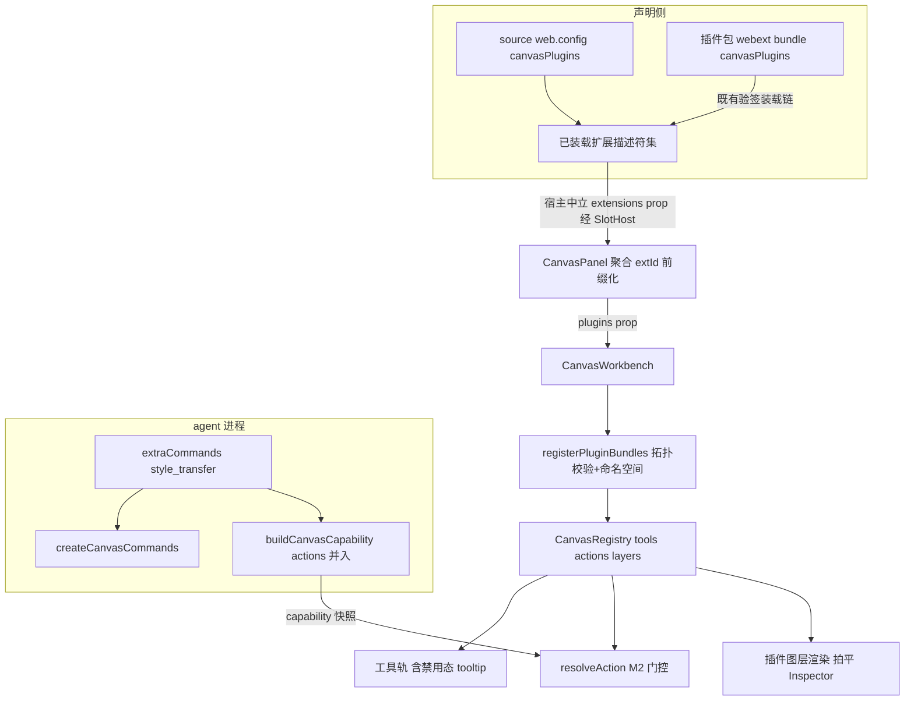

# Design Document — canvas-plugins-m3

## Overview

**Purpose**:打通 Canvas 插件的两条挂载车道(source 自带 / 第三方插件包),补齐图层插件契约,以命名空间与依赖拓扑校验保证多来源共存安全,交付贴纸+风格迁移完整双端范例。
**Users**:canvas 插件作者(canonical 范例)、agent source 作者(车道①)、第三方包作者(车道②)、Canvas 使用者。
**Impact**:canvas-kit L2 新增图层契约/插件捆注册/依赖校验/history 撤销钩子;web-kit WebExtension 新增 canvasPlugins 键;宿主(pi-chat)新增领域中立 extensions 注入;canvas-ui 聚合与消费;tool-kit 命令表/能力清单扩展接缝;新 example 与新 e2e。

### Goals
- defineCanvasLayer 图层契约(Render/bake/Inspector)+ WorkLayer 类型化(additive,图像图层零变)。
- CanvasPluginBundle 捆声明 + `<extId>:` 命名空间 + 同 id 拒绝 + requires 拓扑校验(缺依赖→禁用态+诊断 tooltip)。
- 车道①(defineWebExtension.canvasPlugins)与车道②(已装包 webext 同链)统一消费;agent 侧 extraCommands+capability.actions 并入。
- examples/canvas-plugin-stickers 双端范例;新 e2e(贴纸闭环+风格迁移 command 回流)。
- 成功判据:既有全部单测/6 条 canvas e2e 零改动全绿 + 新增测试与 e2e 全绿。

### Non-Goals
- 车道③动作自动长按钮;多 Canvas 实例分桶;protocol 包改动(pi-plugin.json 清单键 `web.canvasPlugins` 推迟,见裁定书 A);M1/M2 已落契约行为变更;插件市场/安装器 UI;插件热更新;同 id 覆盖语义(拍板:维持拒绝;设计文档 §5 相应句随本 spec 修正)。

## Boundary Commitments

### This Spec Owns
- canvas-kit L2:CanvasLayerPlugin/defineCanvasLayer/CanvasPluginBundle/registerPluginBundles(命名空间+拓扑校验)、registry 图层注册面、WorkLayer +kind/data、history revert/apply 可选钩子(L1 additive)。
- web-kit:WebExtension +`canvasPlugins?`(最小结构镜像类型)。
- 宿主注入:pi-chat 向 panelRight SlotHost 增**领域中立** `extensions` prop(全部已装载扩展描述符;零 canvas 词,SES-H1 不触)。
- canvas-ui:CanvasPanel 聚合提取+前缀化;CanvasWorkbench +plugins prop、插件图层渲染/Inspector/拍平接线、禁用态呈现;类型双向可赋值断言。
- tool-kit:CanvasCommandDeps +extraCommands、buildCanvasCapability +extraActions。
- examples/canvas-plugin-stickers 全部;新 e2e 文件;设计文档 §5 同 id 句修正。

### Out of Boundary
- packages/protocol 全部(清单键推迟);webext 验签/装载/安装链本体(webext-package-install 既有,只被消费);canvas-kit kernel 既有行为(仅 additive 钩子);M1 8 工具与 M2 六动作;aigc-quick-settings;既有 e2e 文件。

### Allowed Dependencies
- canvas-kit 零 @blksails 硬线不变(Render/Inspector 组件类型用 react type-only,与既有 icon: ReactNode 同级);web-kit 不引 canvas-kit(结构镜像+断言防漂移,M2 先例);canvas-ui → canvas-kit/web-kit 既有边;tool-kit canvas 模块不引 canvas-kit;examples 可引全家。
- 依赖方向:canvas-kit ← canvas-ui ← ui(转发);web-kit ← canvas-ui/ui。

### Revalidation Triggers
- CanvasPluginBundle 形状变更 → web-kit 镜像与断言、范例、e2e 复核;history 钩子语义变更 → 内置 undo 回归;SlotHost 注入面变更 → 全部 slot 消费者复核;若发现 stub/e2e 无法为新 source 声明 surface 命令 → 停 task 回 design 补裁。

## Architecture

### Existing Architecture Analysis
见 research.md Key Findings:WebExtension 键族/清单非 strict/WorkLayer 纯图像/history 无 revert/命令表装配期固定/SlotHost 注入形态/SES-H1 词表红线。

### Architecture Pattern & Boundary Map



**Architecture Integration**:选定=声明(捆)→中立搬运(宿主)→领域聚合(canvas-ui)→注册编排(canvas-kit)。保持:L1/L2 纪律、显式出口、SES-H1、M2 门控、装配期确定性。新组件理由:registerPluginBundles 是命名空间与拓扑校验的唯一编排点(单一权威);extensions 中立注入使宿主零 canvas 词。

### Technology Stack
无新依赖。react type-only(canvas-kit 既有);zod 不新增(protocol 不动)。

## File Structure Plan

### New Files
| 文件 | 职责 |
|---|---|
| packages/canvas-kit/src/layers-plugin.ts | CanvasLayerPlugin<D>/defineCanvasLayer/CanvasPluginBundle/registerPluginBundles(命名空间前缀化+requires 拓扑校验+禁用态登记) |
| packages/canvas-kit/test/layers-plugin.test.ts | 契约恒等/registerLayer 冲突/命名空间前缀/拓扑校验(缺依赖→禁用+diagnostics kind:"plugin")/退订 |
| packages/canvas-kit/test/history-hooks.test.ts | revert/apply 钩子:注册 kind undo 调 revert、redo 调 apply;未注册 kind 纯栈语义零变 |
| packages/canvas-ui/test/plugin-aggregation.test.ts | CanvasPanel/聚合函数:多扩展提取+extId 前缀+无声明零影响;web-kit↔canvas-kit CanvasPluginBundle 双向可赋值断言 |
| packages/ui/test/canvas/workbench-plugin-layers.test.tsx | 插件图层:渲染分支/选中出 Inspector/编辑更新/拍平调 bake/图像图层零变(新文件,既有禁改) |
| packages/ui/test/canvas/workbench-plugin-disabled.test.tsx | 缺依赖插件工具:置灰+tooltip 显缺失项;依赖齐备正常 |
| packages/tool-kit/test/aigc/canvas-extra-commands.test.ts | extraCommands 合并(重名内置优先)/capability.actions 并入 extra/命令经桥可调 |
| examples/canvas-plugin-stickers/index.ts | agent:canvas surface(extraCommands.style_transfer=runImageTool 风格包装)+aigcExtension |
| examples/canvas-plugin-stickers/.pi/web/web.config.tsx | defineWebExtension({slots(复用 CanvasLauncher/Panel), canvasPlugins:[stickersBundle]}) |
| examples/canvas-plugin-stickers/.pi/web/stickers.tsx | 贴纸捆:stickerLayer(defineCanvasLayer:emoji 渲染/bake 烤字/Inspector 尺寸滑杆)+stickerTool(点击置层+op)+styleTransferAction(via:"command",match 含 capability.actions 避让) |
| examples/canvas-plugin-stickers/README.md | 范例说明(插件作者 canonical 参照) |
| e2e/browser/canvas-plugin-stickers.e2e.ts | 新 e2e:装 source→工具轨现贴纸→画贴纸→选中 Inspector 调尺寸→拍平;风格迁移 command 回流画廊 |

### Modified Files
| 文件 | 变更 |
|---|---|
| packages/canvas-kit/src/types.ts | WorkLayer +`kind?: string`/`data?: unknown`(additive) |
| packages/canvas-kit/src/kernel/history.ts | +可选 revert/apply 钩子注册与 undo/redo 调用(未注册零变) |
| packages/canvas-kit/src/registry.ts | +registerLayer/layers(同 id 拒绝+diagnostics kind:"layer";复用收集器);禁用插件工具集登记面(供工具轨) |
| packages/canvas-kit/src/kernel-facade.ts | 接口传播直通(1.2 先例) |
| packages/canvas-kit/src/index.ts + test/index-exports.test.ts | +layers-plugin 显式出口;快照联动(唯一允许改动的既有测试) |
| packages/web-kit/src/define-web-extension.ts | WebExtension +`canvasPlugins?: readonly CanvasPluginBundle[]`(最小结构镜像类型,同文件定义) |
| packages/web-kit/(出口/快照如有) | 联动 |
| packages/ui/src/chat/pi-chat.tsx | panelRight SlotHost +领域中立 `extensions` prop(已装载描述符数组;零 canvas 词) |
| packages/ui/src/web-ext/slot-host.tsx(或所在文件) | SlotHost 透传新 prop(中立,全部 slot 可选) |
| packages/canvas-ui/src/canvas-launcher.tsx | CanvasPanelProps +`extensions?`;聚合提取+extId 前缀→workbench plugins |
| packages/canvas-ui/src/canvas-workbench.tsx | +plugins prop;kernel useMemo 内 registerPluginBundles(builtin 后);插件图层渲染分支/Inspector 浮层/拍平按 kind 调 bake;缺依赖禁用态并入工具轨(resolveToolRailTitle 复用) |
| packages/canvas-ui/src/index.ts + test/index-exports.test.ts | 新出口(如聚合纯函数)与快照联动 |
| packages/tool-kit/src/aigc/canvas/commands.ts | CanvasCommandDeps +extraCommands(合并,重名内置优先+诊断日志) |
| packages/tool-kit/src/aigc/canvas/extension.ts | deps 透传 extraCommands/extraActions |
| packages/tool-kit/src/aigc/canvas/capability.ts | buildCanvasCapability +extraActions 并入(去重) |
| docs/canvas-extension-mechanism-design.md | §5 同 id 句修正为拒绝语义(拍板②) |
| e2e stub/fixture 配套(lib/app 或 stub 声明处) | 新 source 的 surface 命令 stub 声明(照 aigc-canvas 先例,开工 grep 校准) |

### 不改(显式承诺)
packages/protocol/**;packages/server/**(验签装载链零改);canvas-kit kernel 既有行为路径(仅 additive);packages/ui 既有测试文件;golden;aigc-canvas 两个既有 e2e 文件;M1 工具/M2 动作实现。

## 裁定书

- **A(清单键推迟)**:pi-plugin.json `web.canvasPlugins` 属 protocol semver 变更,与非目标冲突;清单顶层非 strict(未知字段忽略)且功能面由 webext bundle 运行时键完整承载 → M3 不加,后续按需单独小 spec。R5.1 措辞已同步。
- **B(R3.3 呈现形态)**:缺依赖插件的工具**注册为恒禁用态**(registry 禁用集并入工具轨 disabled 判定),tooltip 经 resolveToolRailTitle 显缺失项——满足「置灰+悬停原因」字面;其动作不参与决策;图层类型不生效。
- **C(undo 语义)**:图层撤销经 history revert/apply 可选钩子(L1 additive);贴纸放置 op revert=移除图层、apply=重放;未注册 kind(内置 stroke/anno)纯栈语义零变=行为守恒证据。

## Requirements Traceability

| Requirement | Components |
|---|---|
| 1.1–1.6 | layers-plugin.ts 契约 + WorkLayer 类型化 + workbench 图层接线 + history 钩子(裁定 C) |
| 2.1–2.4 | registerPluginBundles 命名空间 + registry 拒绝语义复用 + 文档修正 |
| 3.1–3.4 | requires 拓扑校验 + 禁用态(裁定 B)+ tooltip 复用 |
| 4.1–4.4 | web-kit canvasPlugins 键 + 宿主中立注入 + CanvasPanel 聚合 + 零声明零影响 |
| 5.1–5.3 | 已装包 webext 同链聚合(裁定 A)+ 验签失败不崩(装载链既有容错)+ 集成测试 |
| 6.1–6.5 | examples/canvas-plugin-stickers 双端 + extraCommands/extraActions + M2 门控消费 |
| 7.1–7.5 | 全量回归任务 + 新 e2e |

## Components and Interfaces

### canvas-kit · layers-plugin.ts(核心契约)

```typescript
/** 图层插件(D=图层数据形状)。Render/Inspector 为 react 组件类型(type-only import)。 */
export interface CanvasLayerPlugin<D = unknown> {
  readonly type: string;                        // 命名空间化后唯一(如 "acme-stickers:sticker")
  readonly Render: ComponentType<{ readonly layer: WorkLayer; readonly scale: number }>;
  /** 拍平:把图层内容烤进 2D 上下文(画布坐标已就绪;可异步如字体加载)。 */
  bake(ctx2d: Ctx2DLike, layer: WorkLayer, size: { w: number; h: number }): void | Promise<void>;
  readonly Inspector?: ComponentType<{ readonly layer: WorkLayer; update(data: unknown): void }>;
}
export function defineCanvasLayer<D>(l: CanvasLayerPlugin<D>): CanvasLayerPlugin<D>;

/** 插件捆:一个扩展贡献的插件集合(id 未前缀化;registerPluginBundles 施加 <extId>:)。 */
export interface CanvasPluginBundle {
  readonly id: string;                          // 捆 id(诊断归属)
  readonly requires?: readonly string[];        // 依赖的图层类型/op kind(前缀化后名)
  readonly tools?: readonly CanvasTool[];
  readonly layers?: readonly CanvasLayerPlugin[];
  readonly actions?: readonly CanvasActionPlugin[];
}

export interface RegisterPluginBundlesOptions { readonly namespace?: string; }  // extId
/** 注册编排:前缀化→layers 先注册→requires 校验(内置 kind/type 计入可用集)→缺失=捆内 tools 注册为禁用态+diagnostics(kind:"plugin");返回聚合退订。 */
export function registerPluginBundles(
  registry: CanvasRegistry,
  bundles: readonly CanvasPluginBundle[],
  opts?: RegisterPluginBundlesOptions,
): () => void;
```

- registry 扩展:`registerLayer(layer): () => void` / `readonly layers` / `readonly disabledPluginTools: ReadonlySet<string>`(禁用态登记,工具轨消费);diagnostics 复用收集器(kind:"layer"|"plugin")。
- history 钩子:`registerOpBehavior(kind, { revert?, apply? })`(registry 或 facade 面;undo 弹栈后调 revert(op, layers),redo 调 apply;未注册零变)。

### web-kit · canvasPlugins 键(结构镜像)

```typescript
/** canvas 插件捆(最小结构镜像;canonical 在 canvas-kit,canvas-ui 有双向可赋值断言防漂移)。 */
export interface CanvasPluginBundle {
  readonly id: string;
  readonly requires?: readonly string[];
  readonly tools?: readonly unknown[];
  readonly layers?: readonly unknown[];
  readonly actions?: readonly unknown[];
}
export interface WebExtension { /* 既有 + */ readonly canvasPlugins?: readonly CanvasPluginBundle[]; }
```

### 宿主中立注入与聚合
- pi-chat:panelRight SlotHost 增 `extensions`(readonly WebExtension[],全部已装载;命名/注释零 canvas 词)。
- CanvasPanel:`extensions?` prop → `collectCanvasPluginBundles(extensions)`(canvas-ui 纯函数,产 [{namespace: extId, bundles}])→ workbench `plugins`。
- CanvasWorkbench:kernel useMemo 内 builtin 注册后 `registerPluginBundles(k.registry, bundles, {namespace})` 逐扩展;工具轨 disabled 判定并入 registry.disabledPluginTools;title 经 resolveToolRailTitle(diagnostics 已含缺失项条目)。
- 图层接线:渲染层循环中 `layer.kind` 命中 registry.layers → 定位容器内渲染插件 Render(scale 传入);选中且有 Inspector → FLOAT_LAYER 浮层渲染(data-canvas-inspector 锚点);拍平合成路径按 kind 调 bake,无 kind 走既有 drawImage。

### tool-kit · extraCommands/extraActions

```typescript
export interface CanvasCommandDeps { /* 既有 + */ readonly extraCommands?: Record<string, SurfaceCommandHandler<GalleryState>>; }
// createCanvasCommands: {...extra, ...builtin} 语义=重名内置优先(builtin 展开在后)。
export function buildCanvasCapability(deps?: { disabledModels?; extraActions?: readonly string[] }): CanvasCapability;
// actions = [...A档6, ...extraActions 去重]
```

### 范例(examples/canvas-plugin-stickers)
- agent:makeCanvasSurfaceExtension({ commandDeps: { extraCommands: { style_transfer } }, capability 经 extraActions:["style_transfer"] })+aigcExtension;style_transfer=runImageTool(reference_images=[style_ref], STYLE_PROMPT(strength)) 落库 prepend(照 §6.2)。
- web:stickersBundle = { id:"stickers", requires:["canvas-plugin-stickers:sticker"], tools:[stickerTool], layers:[stickerLayer], actions:[styleTransferAction] };styleTransferAction.match = referenceIds.length===1 && prompt.startsWith("style:") && capability.actions.includes("style_transfer") ? 85 : false(§6.2)。

## Error Handling
- 捆内插件注册抛错(如 Render 非法):该捆诊断+禁用,画布不崩(L2 错误隔离);bake 抛错:拍平跳过该图层+诊断,产物不阻塞(与 hydrate 退化同哲学);extensions prop 缺失/空:零插件路径=现状(4.3);验签失败包:根本不进 extensions(装载链既有容错),Canvas 照常(5.3)。

## Testing Strategy
1. **Unit(canvas-kit)**:layers-plugin(契约/冲突/前缀/拓扑校验/禁用集/退订)+ history-hooks(revert/apply/未注册零变),全带变异纪律。
2. **Unit/组件(canvas-ui + ui/test/canvas 新文件)**:聚合纯函数+类型断言;插件图层渲染/Inspector/拍平/图像图层零变;缺依赖禁用置灰+tooltip。
3. **Integration(tool-kit)**:extraCommands 合并与桥可调、capability.actions 并入;(server 侧零改无需)。车道②:webext 装载既有 fixture 手法上验证「已装包描述符进聚合」。
4. **Regression(零改动硬线)**:canvas-kit 247+/canvas-ui 44+/tool-kit 274+/ui 709+/web-kit 既有;golden;typecheck。
5. **E2E**:新 canvas-plugin-stickers.e2e.ts(R7.5 两流程);既有 aigc-canvas 6 条零改动(外部 server + .next-e2e 先例)。
6. **静态线**:SES-H1 四线保持(宿主中立注入=零词表命中);canvas-kit encapsulation;出口快照联动。
