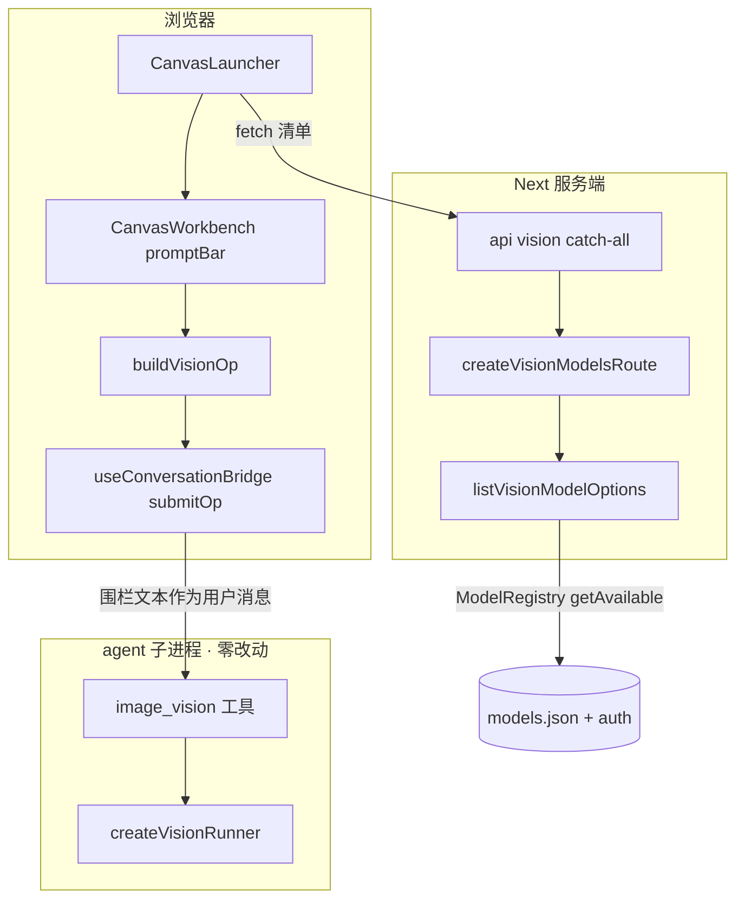
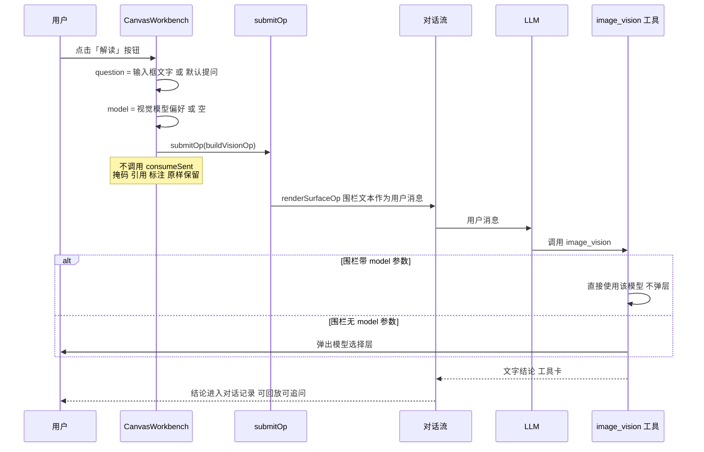

# Design Document — canvas-vision-readout

## Overview

**Purpose**：在 Canvas 工作台的提示词栏里加一个「解读」按钮，把输入框文字当作问题，对当前工作图
发起视觉识别，结论回流对话记录。

**Users**：Canvas 工作台用户（正在看 / 编辑一张图，想问它一个问题）。

**Impact**：识别能力已由 spec `image-vision-tool` 提供并装载进 `aigc-canvas-agent`。本特性只加
**入口**与**模型偏好**：一个按钮、一个下拉、一个 op 构造器、一个只读端点。
**agent 侧零改动**，`canvas-kit` 公开契约零改动。

### Goals

- 解读请求经**与生成动作相同的对话通道**（`bridge.submitOp` → `renderSurfaceOp`）发出，
  结论作为工具卡 + 助手回复回流对话记录，可回放、可追问。
- 提示词栏内提供视觉模型选择器；选中后后续解读不再被弹层打断。
- 解读**完全绕开**生成动作的评分制与输入消费（掩码 / 参考图 / 标注原样保留）。

### Non-Goals

- 画廊卡片上的悬浮解读入口；把结论持久化进 `GalleryAsset` meta；多图批量解读。
- 经 surface 命令通道实现的解读（见「关键裁定 1」，不可行）。
- 修改识别能力本身（模型调用、凭据解析、失败分类）。
- 在 Canvas 界面内另建结论展示区（R2.4 明令禁止）。

---

## Boundary Commitments

### This Spec Owns

- Canvas 工作台提示词栏中的**解读按钮**与**视觉模型选择器**及其本地偏好。
- `buildVisionOp()` —— `tool: image_vision` 的 `SurfaceOp` 构造器（params 顺序、tool 行文案）。
- 只读端点 `GET /api/vision/models` 及其 Next 转发器。
- `CanvasLauncher` 中把视觉模型清单注入 workbench 的路径。

### Out of Boundary

- **`image_vision` 工具本身**（选模型、弹层、凭据解析、失败枚举、fail-soft）—— 归 `image-vision-tool`。
- **`buildSurfaceOp` / `BUILTIN_GENERATE_ACTIONS` / `resolveAction` / `ActionInput`** ——
  一个字节都不改（由 `generate-actions.test.ts` 的决策守恒线守卫）。
- **`consumeSent`** 与掩码 / 参考图 / 标注的生命周期 —— 解读不得触碰。
- `AigcQuickSettings`（聊天 composer 的 `promptToolbar` 槽）—— 与本特性无关，不动。
- agent 侧任何代码。

### Allowed Dependencies

- `bridge.submitOp`（`use-conversation-bridge.ts`）—— 只读消费，不改其契约。
- `renderSurfaceOp` / `SurfaceOp`（`web-kit/src/surface-op.ts`）—— 只用，不改。
- `listModelOptions` 的同源实现（`server/src/config/model-options.ts` 的 `ModelRegistry` 用法）。
- 依赖方向：`server(vision-model-options) → 端点`；`canvas-ui(vision-op) → workbench`；
  `launcher → workbench`。左侧不得导入右侧。

### Revalidation Triggers

- `SurfaceOp` 字段或 `renderSurfaceOp` 输出格式变化。
- `image_vision` 工具的参数名（`image` / `question` / `model`）或 `model` 的 `provider/modelId` 格式变化。
- `bridge.submitOp` 的 `opChannel` 语义变化。
- `ModelRegistry.getAvailable()` / `Model.input` 契约变化。

---

## Architecture

### Existing Architecture Analysis

提示词栏的生成路径（`canvas-workbench.tsx:825-992`）：

```
generate() → 标注拍平上传 → resolveAction(评分制) → consumeSent(清引用/标注/笔迹)
          → bridge.submitOp(buildSurfaceOp(decision))
          → renderSurfaceOp → conversation.submitUserMessage(围栏文本)
          → LLM 读围栏 → 调 image_edit 工具
```

**解读路径刻意做成它的一条平行短路**，共享最后三步、绕开前三步：

```
readout() → bridge.submitOp(buildVisionOp({imageId, question, model?}))
         → renderSurfaceOp → conversation.submitUserMessage(围栏文本)
         → LLM 读围栏 → 调 image_vision 工具
```

沿用的既有模式：
- **围栏的隐性契约**：LLM 并未被 systemPrompt 教过 `canvas-op` 格式；理解完全依赖 tool 行内嵌的
  中文指令（`image_edit(请直接按下列参数调用,勿追问、勿复述参数)`，`:314`）。
  `buildVisionOp` 必须沿用同一形态，否则 LLM 可能复述参数而不调用工具。
- **模型选择器**：`useState("")` + 空值哨兵（`MODEL_DEFAULT_SENTINEL`）→ 空值即「交给工具默认」。
- **只读端点**：`createXxxRoute(): ReadonlyArray<InjectedRoute>` + `routes:` 注入 + Next catch-all 转发器。

### 关键裁定 1：走对话通道，不走 surface 命令通道

surface 命令 handler 只拿得到 `SurfaceCtx`（`get` / `setState` / `attachments`，
`create-surface.ts:35`），**没有 `modelRegistry`**；而识别内核选模型与解析凭据都需要它
（`ExtensionContext.modelRegistry` 只在 pi 直连回调里出现）。

走对话通道则直接复用工具 `execute` 的 `ExtensionContext` ⇒ **agent 侧零改动**，
工具还能弹模型选择层（它拿得到 `ctx.ui`）。且结论天然进对话记录（R2）。

### 关键裁定 2：模型清单与工具弹层同源

server 进程内可直接用 pi SDK 的 `ModelRegistry`（`model-options.ts:31` 已有先例）：

```ts
ModelRegistry.create(AuthStorage.create(auth.json), models.json)
  .getAvailable()                       // = models.filter(hasConfiguredAuth)
  .filter((m) => m.input.includes("image"))
```

与 `select-model.ts:35` 的候选计算**逐字同构** ⇒ 下拉里看到的，就是弹层里能选的。
（初始描述曾声称「内置模型不会出现」，已由 gap 分析证伪，见 `research.md` §1.1。）

### 关键裁定 3：`model` 参数格式是 `provider/modelId`

`image_vision` 的 `model` 参数与 `selectVisionModel` 的 `modelKey(m) = \`${m.provider}/${m.id}\`` 对齐。
而提示词栏既有的**生成**模型选择器 value 是裸 `m.id`。两者格式不同，**不可混用**。
视觉模型下拉的 value 必须是 `provider/id`。

### Architecture Pattern & Boundary Map



**Architecture Integration**：

- **Selected pattern**：平行短路 —— 解读与生成共享对话通道尾段，绕开评分制与输入消费。
- **Domain boundaries**：`buildVisionOp` 与 `buildSurfaceOp` 各自独立，互不 import。
- **Existing patterns preserved**：围栏内联指令、空值哨兵、只读端点 + catch-all 转发器。
- **Steering compliance**：TypeScript strict 无 `any`；依赖方向单向；单测 + e2e 双证据。

### Technology Stack

| Layer | Choice / Version | Role in Feature | Notes |
|-------|------------------|-----------------|-------|
| Frontend | `@blksails/pi-web-canvas-ui`（既有） | 解读按钮、视觉模型下拉、`buildVisionOp` | 复用 Radix `Select`（primitives） |
| Frontend | `@blksails/pi-web-web-kit`（既有） | `renderSurfaceOp` / `SurfaceOp` | 只用不改 |
| Backend | `@blksails/pi-web-server`（既有） | `GET /vision/models` 只读端点 | 沿用 `InjectedRoute` |
| Backend | `@earendil-works/pi-coding-agent` 0.80.3 | `ModelRegistry` / `AuthStorage` | 已在 `model-options.ts` 使用 |
| App | Next App Router | `/api/vision` catch-all 转发器 | ⚠ 缺失则静默 404 |
| Agent | — | **零改动** | `image_vision` 已装载 |

---

## File Structure Plan

### Directory Structure

```
packages/canvas-ui/src/
└── vision-op.ts               # 新增：buildVisionOp + 默认提问常量（纯函数，零 React）

packages/server/src/vision-settings/
├── vision-model-options.ts    # 新增：listVisionModelOptions(agentDir)（引 pi SDK）
└── vision-models-routes.ts    # 新增：createVisionModelsRoute(): InjectedRoute[]

app/api/vision/[[...path]]/
└── route.ts                   # 新增：Next catch-all 转发器（仅 GET）
```

> `vision-model-options.ts` 与 `vision-models-routes.ts` 刻意分离：前者引 pi SDK（node-only），
> 后者是薄路由。与 `config/model-options.ts` ↔ `aigc-settings/aigc-models-routes.ts` 的分层同构，
> 使路由单测不被迫加载 pi SDK。

### Modified Files

- `packages/canvas-ui/src/canvas-workbench.tsx`
  - 新增 `visionModel` 本地 state（+ localStorage 持久，键 `pi-web.vision.model`）。
  - 提示词栏新增视觉模型 `Select`（`data-canvas-vision-model`）与解读按钮（`data-canvas-readout`）。
  - 新增 `readout()` 回调：`bridge.submitOp(buildVisionOp(...))`。**不调用** `consumeSent`、
    **不进入** `resolveAction`。
  - 新增可选 prop `visionModelOptions?: readonly VisionModelOption[]`。
- `packages/canvas-ui/src/canvas-launcher.tsx`
  - 拉取视觉模型清单并注入 workbench；失败 → 空数组（不阻断解读）。
- `packages/canvas-ui/src/index.ts` — 导出 `buildVisionOp` 与类型。
- `lib/app/pi-handler.ts` — `routes:` 数组追加 `...createVisionModelsRoute()`。

---

## System Flows

### 解读主流程



**关键流程决策**：

- **不清空输入框**（R1.4）：与生成按钮既有行为一致（`generate()` 全程无 `setPrompt("")`）。
- **不消费生成输入**（R4.3/4.4）：掩码、参考图、标注只服务生成；解读只看当前工作图。
- **偏好为空即不带 `model` 参数**：把「是否弹层」的决策权完整交回工具（R3.3/3.4）。

---

## Requirements Traceability

| Requirement | Summary | Components | Interfaces | Flows |
|---|---|---|---|---|
| 1.1 | 提示词栏提供解读按钮 | `canvas-workbench` | `data-canvas-readout` | 主流程 |
| 1.2 | 输入框文字作问题 | `canvas-workbench` | `readout()` | 主流程 |
| 1.3 | 输入框为空用默认提问 | `vision-op` | `DEFAULT_READOUT_QUESTION` | 主流程 |
| 1.4 | 发出后保留输入框文字 | `canvas-workbench` | 不调用 `setPrompt("")` | 主流程 |
| 2.1 | 经与生成相同的对话通道 | `canvas-workbench` | `bridge.submitOp` | 主流程 |
| 2.2 | 结论进入对话记录可回放 | （既有）对话流 | `renderSurfaceOp` | 主流程 |
| 2.3 | 可就结论继续追问 | （既有）对话上下文 | — | 主流程 |
| 2.4 | 不另建结论展示区 | `canvas-workbench` | 不新增面板 | — |
| 3.1 | 列出支持图像输入且凭据可用的模型 | `vision-model-options` | `listVisionModelOptions` | — |
| 3.2 | 记住偏好 | `canvas-workbench` | `visionModel` state + localStorage | — |
| 3.3 | 有偏好不弹层 | `vision-op` | op 带 `model` 参数 | 主流程 |
| 3.4 | 无偏好沿用工具弹层 | `vision-op` | op 省略 `model` 参数 | 主流程 |
| 3.5 | 空清单给出说明 | `canvas-workbench` | 选择器空态文案 | — |
| 3.6 | 拉取失败仍可解读 | `canvas-launcher` | fetch 失败 → `[]` | — |
| 4.1 | 生成决策行为不变 | （不改）`buildSurfaceOp` | 决策守恒线测试 | — |
| 4.2 | 解读不参与生成决策 | `canvas-workbench` | `readout()` 不调 `resolveAction` | 主流程 |
| 4.3 | 不消费生成输入 | `canvas-workbench` | 不调 `consumeSent` | 主流程 |
| 4.4 | 有掩码/参考图时仍只提问 | `canvas-workbench` | 同上 | 主流程 |
| 5.1 | 失败按工具既有表现 | （既有）`image_vision` fail-soft | — | 主流程 |
| 5.2 | Canvas 既有行为不变 | 全部 | 决策守恒线 + 回归套件 | — |
| 5.3 | 示例 agent 装载识别能力 | `examples/aigc-canvas-agent` | 已装载 | — |
| 5.4 | 偏好未就绪仍可解读 | `canvas-workbench` | 空清单不禁用按钮 | — |

---

## Components and Interfaces

| Component | Domain/Layer | Intent | Req Coverage | Key Dependencies (P0/P1) | Contracts |
|---|---|---|---|---|---|
| `vision-op.ts` | 前端 · 纯函数 | 构造 `image_vision` 的 SurfaceOp | 1.3, 3.3, 3.4 | `SurfaceOp` 类型 (P0) | Service |
| `canvas-workbench.tsx` | 前端 · 组件 | 解读按钮、模型下拉、`readout()` | 1.1–1.4, 2.1, 2.4, 3.2, 3.5, 4.2–4.4, 5.4 | `buildVisionOp` (P0), `bridge.submitOp` (P0) | Service |
| `canvas-launcher.tsx` | 前端 · 组件 | 拉清单注入 workbench | 3.1, 3.6 | 端点 (P1) | Service |
| `vision-model-options.ts` | 后端 · 取数 | 枚举可用视觉模型 | 3.1 | `ModelRegistry` (P0) | Service |
| `vision-models-routes.ts` | 后端 · 路由 | 只读端点 | 3.1 | 上者 (P0) | API |
| `app/api/vision/[[...path]]/route.ts` | App · 转发 | Next catch-all | 3.1 | handler (P0) | API |

---

### 前端 · 纯函数层

#### `vision-op.ts`

| Field | Detail |
|---|---|
| Intent | 把「图 + 问题 + 可选模型」构造成 `tool: image_vision` 的 SurfaceOp |
| Requirements | 1.3, 3.3, 3.4 |

**Responsibilities & Constraints**
- **tool 行必须内嵌中文指令**（沿用 `buildSurfaceOp:314` 的形态），否则 LLM 可能复述参数而不调用工具。
- `model` 为空字符串 / `undefined` 时**省略该参数行**（`renderSurfaceOp` 已跳过空值，`surface-op.ts:62`），
  从而让工具弹层（3.4）；非空时原样透传 `provider/modelId`（3.3）。
- `question` 为空时用 `DEFAULT_READOUT_QUESTION`（1.3）。
- 纯函数，零 React，零 I/O。**不 import** `buildSurfaceOp`。

**Contracts**: Service [x]

##### Service Interface

```typescript
/** 视觉模型选项：value 为 `provider/modelId`（与工具 `model` 参数格式一致）。 */
export interface VisionModelOption {
  readonly value: string;   // "apiservices/gpt-5.4"
  readonly label: string;   // "GPT-5.4"
  readonly provider: string;
}

export interface BuildVisionOpInput {
  /** 当前工作图的附件 id。 */
  readonly imageId: string;
  /** 用户问题；空串 → 使用默认提问。 */
  readonly question: string;
  /** `provider/modelId`；省略或空串 → op 不带 model 参数，由工具弹层选择。 */
  readonly model?: string;
}

export const DEFAULT_READOUT_QUESTION: string;

export function buildVisionOp(input: BuildVisionOpInput): SurfaceOp;
```

- Preconditions：`imageId` 非空。
- Postconditions：`op.tool` 以 `image_vision` 开头并带内联指令；`op.params` 顺序为
  `image → question → model?`；`op.fence === "canvas-op"`。
- Invariants：`model` 为空时结果中**不出现** `model` 参数行。

---

### 前端 · 组件层

#### `canvas-workbench.tsx`（修改）

| Field | Detail |
|---|---|
| Intent | 提示词栏的解读入口与视觉模型偏好 |
| Requirements | 1.1–1.4, 2.1, 2.4, 3.2, 3.5, 4.2–4.4, 5.4 |

**Responsibilities & Constraints**
- `readout()` 与 `generate()` **完全平行**：不调用 `resolveAction`、不调用 `consumeSent`、
  不上传标注拍平图、不读掩码 / 参考图（4.2/4.3/4.4）。
- 视觉模型偏好：`useState("")` + 首次挂载从 `localStorage["pi-web.vision.model"]` 读取，
  变更时写回。空值哨兵沿用 `MODEL_DEFAULT_SENTINEL` 形态。
  > 生成模型选择器是纯本地 state（不持久）。此处**有意**持久化——R3.2 要求「记住偏好」。
- 清单为空（未拉到 / 拉取失败）→ 选择器展示「没有可用的视觉模型」，**但解读按钮仍可用**
  （3.5 / 3.6 / 5.4）：此时 op 不带 `model`，由工具弹层兜底。
- **不新增结论展示区**（2.4）。

**Dependencies**
- Outbound: `buildVisionOp` (P0)、`bridge.submitOp` (P0)
- Inbound: `visionModelOptions` prop（可选；缺省 `[]`）(P1)

**Contracts**: Service [x] / State [x]

##### Service Interface

```typescript
export interface CanvasWorkbenchProps {
  // …既有 props 不变
  /** 可选视觉模型清单；缺省 `[]`（选择器空态，解读仍可用）。 */
  readonly visionModelOptions?: readonly VisionModelOption[];
}
```

##### State Management

- `visionModel: string`（`""` = 未设定 → op 省略 model）。
- 持久化：`localStorage["pi-web.vision.model"]`；读写失败静默忽略（隐私模式 / SSR）。

**Implementation Notes**
- Integration：解读按钮与生成按钮并列，锚点 `data-canvas-readout`；下拉锚点 `data-canvas-vision-model`。
- Validation：`current.attachmentId` 恒有值（workbench 是「打开某张图之后」的界面），无需无图分支。
- Risks：若误将解读接入 `resolveAction`，`generate-actions.test.ts` 的决策守恒线会红——这是好护栏。

#### `canvas-launcher.tsx`（修改）

| Field | Detail |
|---|---|
| Intent | 拉取视觉模型清单并注入 workbench |
| Requirements | 3.1, 3.6 |

**Responsibilities & Constraints**
- 经 `baseUrl` 拉 `GET {baseUrl}/vision/models`；任何失败（网络 / 非 2xx / 解析）→ 记为空数组，
  **不抛、不阻断**解读（3.6）。
- 仅在面板打开时拉取一次；不做轮询。

**Contracts**: Service [x]

---

### 后端

#### `vision-model-options.ts`

| Field | Detail |
|---|---|
| Intent | 枚举「已配置凭据且支持图像输入」的模型 |
| Requirements | 3.1 |

**Responsibilities & Constraints**
- 与 `config/model-options.ts` 同构：`AuthStorage.create(auth.json)` +
  `ModelRegistry.create(authStorage, models.json)` + `getAvailable()`。
- 追加 `.filter((m) => m.input.includes("image"))` —— 与 `select-model.ts:35` 逐字同构。
- 构造与 `getAvailable()` 均不触发网络 / OAuth 刷新（同步）。抛错由路由兜底。
- 输出 `value` 为 `` `${provider}/${id}` ``（关键裁定 3）。

**Contracts**: Service [x]

##### Service Interface

```typescript
export interface VisionModelOptions {
  readonly models: readonly VisionModelOption[];
}
export function listVisionModelOptions(agentDir: string): VisionModelOptions;
```

#### `vision-models-routes.ts` + Next 转发器

| Field | Detail |
|---|---|
| Intent | 只读端点 |
| Requirements | 3.1 |

**Contracts**: API [x]

##### API Contract

| Method | Endpoint | Request | Response | Errors |
|--------|----------|---------|----------|--------|
| GET | `/api/vision/models` | — | `{ models: VisionModelOption[] }` | 500 → `{ models: [] }` 降级 |

**Implementation Notes**
- Integration：经 `routes:` 注入（`lib/app/pi-handler.ts`），与 `createAigcModelsRoute()` 并列。
- Integration：**必须**新建 `app/api/vision/[[...path]]/route.ts`（仅导出 `GET`）。
  新顶层 API 段缺转发器会**静默 404**（`app/api/aigc/[[...path]]/route.ts:9-11` 有明确警告）。
- Risks：`listVisionModelOptions` 抛错（models.json 损坏）→ 路由捕获并返回空清单，
  前端退化为工具弹层（3.6）。

---

## Error Handling

### Error Strategy

前端只负责**发出**解读请求；识别的成功 / 失败表现完全由 `image_vision` 工具承担（R5.1），
以工具卡 + 助手回复呈现在对话记录中。Canvas 侧不解释、不重试、不另建错误区。

### Error Categories and Responses

| 类别 | 触发 | 响应 |
|---|---|---|
| 清单拉取失败 | 网络 / 非 2xx / 解析失败 | 清单记为 `[]`；选择器空态；解读按钮**仍可用**（3.6/5.4） |
| 清单为空 | 无支持图像输入的可用模型 | 选择器展示「没有可用的视觉模型」（3.5） |
| 端点内部错误 | `models.json` 损坏 | 路由捕获，返回 `{ models: [] }` |
| 识别失败 | 工具侧 | 由 `image_vision` 的 fail-soft 呈现（5.1），Canvas 不介入 |
| localStorage 不可用 | 隐私模式 / SSR | 静默忽略，退化为「本次会话内有效」 |

---

## Testing Strategy

> 硬性要求：单元/集成测试 + e2e，且以新鲜运行输出为证。

### Unit Tests

1. `buildVisionOp` — `model` 省略 / 空串时，`renderSurfaceOp` 输出**不含** `model:` 行；
   非空时含 `model: apiservices/gpt-5.4`（3.3/3.4）。
2. `buildVisionOp` — `question` 为空 → 输出含 `DEFAULT_READOUT_QUESTION`；非空 → 原样透传（1.3）。
3. `buildVisionOp` — tool 行以 `image_vision` 开头且**包含内联中文指令**；params 顺序为
   `image → question → model?`；fence 为 `canvas-op`（围栏隐性契约的回归锁）。
4. `listVisionModelOptions` — 过滤掉 `input: ["text"]` 的模型；`value` 形如 `provider/id`（3.1）。
5. 决策守恒线 — `generate-actions.test.ts` 保持全绿，证明 `buildSurfaceOp` / `resolveAction` 未被触碰（4.1/5.2）。

### Integration Tests（组件级，`packages/ui/test/canvas/`）

沿用 `canvas-workbench-channel.test.tsx` 的 `onSubmitPrompt` 注入范式。

1. 点击 `data-canvas-readout` → `onSubmitPrompt` 被调用一次，文本含 `tool: image_vision` 与
   `image: <当前图 id>`；**不含** `image_edit`（1.1/1.2/2.1）。
2. 输入框为空时点击解读 → 文本含默认提问（1.3）。
3. 点击解读后输入框文字**未被清空**（1.4）。
4. **已绘制掩码 / 已添加参考图**时点击解读 → 发出的文本**不含** `mask` / `reference_images`，
   且掩码与参考图在点击后**仍然存在**（4.3/4.4 —— 这条同时锁住「不调 consumeSent」）。
5. 选中视觉模型后点击解读 → 文本含 `model: provider/id`；未选中 → 不含 `model:` 行（3.3/3.4）。
6. `visionModelOptions` 为空数组 → 选择器显示空态说明，且解读按钮**未被禁用**（3.5/5.4）。
7. 点击**生成**按钮的行为与既有测试逐项一致（4.1 回归）。

### 端点测试（`packages/server/test/vision-settings/`）

沿用 `aigc-models-routes.test.ts` 的范式：直测 `InjectedRoute.handler`，不经 `createPiWebHandler`
（避开 alias 陷阱）。

1. 正常 agentDir → 200，body 为 `{ models: [...] }`，仅含支持图像输入的模型。
2. `listVisionModelOptions` 抛错 → 200 + `{ models: [] }`（降级，不 500 到前端）。

### E2E

1. **node e2e**：`GET /api/vision/models` 经真实 handler 返回 200 与预期形状
   —— 顺带证明 **Next catch-all 转发器存在**（缺失则 404，这是本 spec 最易漏的一项）。
2. **浏览器 e2e**（若 canvas e2e 门控可用）：打开工作台 → 点击解读 → 断言对话流出现
   `image_vision` 工具调用。门控 `NEXT_PUBLIC_PI_WEB_CANVAS`。

---

## Security Considerations

- 端点**只读**，不接受任何用户输入（无查询参数），无注入面。
- 返回体只含 `provider` / `id` / `name`，**绝不含 apiKey**（`getAvailable()` 返回的 `Model`
  含 `baseUrl` 等字段，映射时必须显式挑字段，禁止整体透传）。
- 端点暴露「本机配置了哪些模型」，与既有 `/api/aigc/models` 及 settings 域的模型下拉同级，
  不引入新的信息暴露面。
