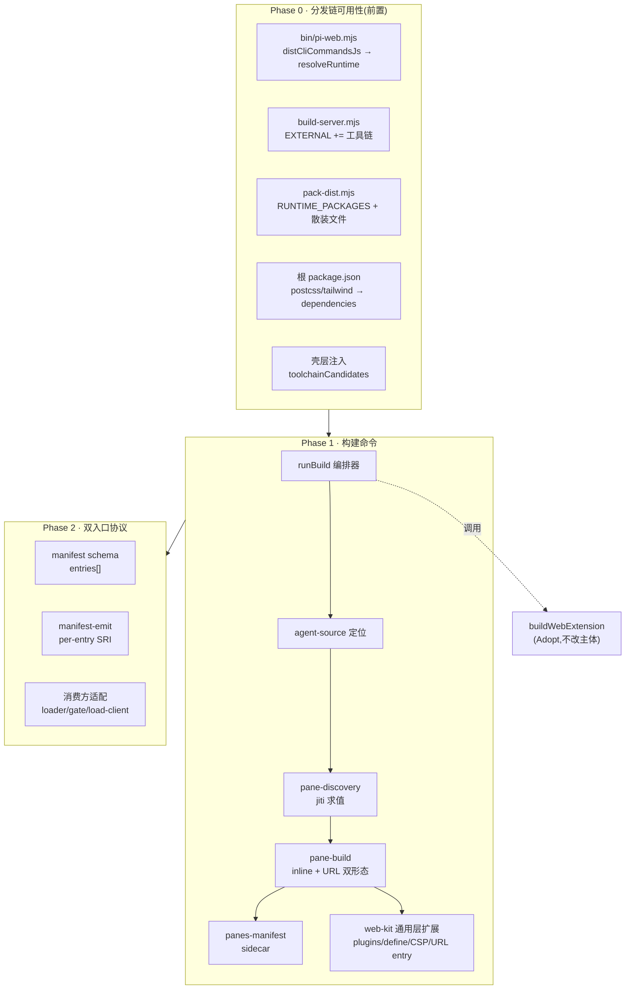
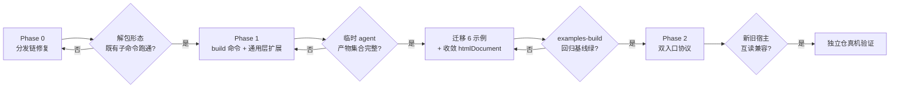

# Design Document — cli-agent-build

## Overview

**Purpose**: 本特性把 agent 的 webext / pane 构建从「每个 agent 自带 `build.ts`」收敛为宿主提供的单一命令 `pi-web build`，使 agent source 无论位于 pi-web 仓库内还是自成独立仓库，都能以相同方式重建产物。

**Users**: 独立仓 agent 作者（构建当前完全断裂）、pi-web 仓内示例维护者（6 份逐字同构的样板）、发布 agent 的人（`publish` 拒绝发布时需要一条可执行的构建指令）。

**Impact**: 现状是 `pi-web build` 作为具名工具已被 `agent-web-extension` R8/R9 承诺并被三个后续 spec 当作既存能力引用，但实际只落成 `packages/web-kit/build/cli.ts`（五参数薄 CLI）+ 一个与主 CLI 同名的旁路 bin。本设计将其收敛进主 CLI 子命令族，并扩展到覆盖 pane 构建全流程。过程中必须先修复一个更早的既存阻断：**分发形态下现有全部子命令即已失效**（research.md F1）。

### Goals

- `pi-web build` 成为主 CLI 的正式子命令，在任意 agent source 目录（含仓库外）可用。
- 一条命令产出 webext、pane 内联文档、pane URL 形态资产、pane 静态清单、隔离自包含入口与统一分派入口。
- agent 侧零构建编排代码；pane 声明保持单一 TS 来源，构建期与运行期各取子集。
- 产物统一不入库，可随时按当前宿主版本重建，使结构契约漂移无处积累。
- pi-web 仓内 6 个示例交出各自的 `build.ts`，三处 `htmlDocument` 副本收敛为一处。

### Non-Goals

- 不修复宿主消费侧读取 pane 声明的两处崩溃（`pi-chat.tsx:627`、`panes-kit/merge.ts:98`）—— 产物重建后应自然消解，若不消解另立 spec。
- 不为隔离车道补验签与 SRI 校验（research.md F7 的既存缺口）。
- 不让 `publish` 自动执行构建（`publish-agent-entry-and-bundle` R3.4）。
- 不新增 agent 侧配置文件格式。
- 不实现 watch / 增量构建。

## Boundary Commitments

### This Spec Owns

- `pi-web build` 子命令的命令面、参数契约、退出码与错误呈现。
- 构建编排：agent source 定位、pane 模块的约定发现与求值、pane 产物生成、webext 打包调用、隔离入口与分派入口生成、`panes.json` 清单生成。
- `packages/web-kit/build/pane-document.ts` 通用 pane 文档层的能力扩展（plugins/define 透传、URL entry、可配 CSP、样式复用分离、URL 形态出口）。
- `WebExtensionManifest` 的**双入口结构**及其 per-entry 完整性表达。
- 产物目录的版本控制约定（gitignore + 类型垫片）。
- pi-web 仓内示例 agent 从自带构建脚本迁出，以及三处 `htmlDocument` 副本的收敛。
- **Phase 0 前置修复**：子命令实现产物在分发形态下的可解析性、构建工具链随包分发、样式预设在分发树中的可达性。

### Out of Boundary

- webext 的签名信任链与验签策略（属 `webext-package-install`）。
- 产物的安装与分发（属 `webext-package-install` 的 `pi install` 复用）。
- 发布流程本身（属 `publish-agent-entry-and-bundle`）；本 spec 只改 `WEBEXT_SOURCE_WITHOUT_DIST` 的**文案**以兑现其 R3.3。
- 隔离宿主（pi-clouds）侧的加载器实现；本 spec 只保证产物形态可被其消费。
- `lib/app/builtin-panes/*.ts` 的手写声明与目录约定的两处声明合一（宿主自身问题，另立）。

### Allowed Dependencies

- `@blksails/pi-web-kit/build` 的 `buildWebExtension` / `pane-document` —— 主体能力来源，只扩展不替代。
- `@blksails/pi-web-panes-kit` 的 `PaneCapabilitiesSchema` / `definePanes` —— 结构校验唯一来源，**不自建校验**（沿用 `host-builtin-panes/research.md:98` 的 Adopt 决策）。
- `@blksails/pi-web-protocol` 的 `WebExtensionManifestSchema` —— 协议唯一权威。
- `server/cli/reporter.ts` 的 `ProgressReporter` / `redactSecrets` —— 输出与脱敏唯一通道。
- jiti —— 求值 agent 的 TS 声明模块（已是 `EXTERNAL` 与 `RUNTIME_PACKAGES` 成员）。
- **禁止**：`bin/pi-web.mjs` 不得新增任何非 `node:` 静态 import（`cli-package-commands/design.md:168`）。
- **禁止**：构建实现不得反向依赖 `lib/app/**` 或 `server/index.ts`（依赖方向铁律，`structure.md:34-36`）。

### Revalidation Triggers

- `WebExtensionManifest` 新增入口字段的形状变更 → pi-clouds 的 `resolve-cloud-webext.ts` / `pane-loader-route.ts` 须重新校验。
- `canonicalManifestBytes()` 的键集合变更 → **全部既有签名失效**，须全量重签重发（本 spec 刻意不触发，见 Security Considerations）。
- `DEFAULT_WEBEXT_DIST` 路径约定变更 → `publish-agent-entry-and-bundle` 已登记为其重校验触发器。
- pane 模块约定发现路径变更 → 全部 agent source 须调整目录布局。
- `RUNTIME_PACKAGES` / `EXTERNAL` 成员变更 → `test/cli/cli-commands-build.test.ts` 断言须同步。

## Architecture

### Existing Architecture Analysis

三条既有约束决定了本设计的形状：

1. **薄壳契约**（`bin/pi-web.mjs`）：只 import `node:` 内置，全部 TS 逻辑经动态 `import()` 从 `dist/cli-commands.mjs` 取得；壳层是唯一知道 `PKG_ROOT` 的地方，因此**任何依赖物理路径的能力都必须由壳层以候选数组注入**（既证模式：`examplesRootCandidates`）。
2. **两条互不相干的打包路径**：`buildWebExtension` 产 ESM 且强制 externals（React 不得内联）；pane 产 IIFE 且**必须内联** React（opaque-origin iframe 无 import map）。二者的 React 策略相反，守卫也必须相反。
3. **模块层是 pane 声明的唯一单源**：构建期独占 `entry` / `canvasStyles`，运行期独占 `document` / `lifecycle` / `allowMultiple` / `hostView`，互不重叠（research.md F10）。因此发现机制只能是「jiti 导入并求值」，不能是静态解析或 JSON。

### 三阶段架构



**Architecture Integration**
- **选定模式**：分层编排器 + 能力下沉。CLI 层只做参数解析与阶段编排；每个构建能力下沉到 `web-kit/build` 的通用层，使 `scripts/build-builtin-panes.ts` 与外部 agent 共用同一实现（R6.4）。
- **责任分离**：`server/cli/build/**` 拥有「编排与 agent source 语义」；`packages/web-kit/build/**` 拥有「打包原语」。前者可依赖后者，反向禁止。
- **保留的既有模式**：候选路径注入（F3）、`ProgressReporter` 判别联合错误（`cli-package-commands/design.md:617`）、`definePanes` 作为唯一结构校验（`host-builtin-panes`）。
- **新组件理由**：`pane-discovery` 是唯一新增的机制性组件，因为既有目录约定有四条硬阻断（research.md F8）。

### Technology Stack

| Layer | Choice | Role in Feature | Notes |
|-------|--------|-----------------|-------|
| CLI 壳 | `bin/pi-web.mjs`（纯 `.mjs`） | 子命令注册、候选路径注入 | 不得新增非 `node:` import |
| CLI 实现 | `server/cli/build/**` → `dist/cli-commands.mjs` | 编排、错误翻译 | 经 esbuild 打单文件 |
| 打包原语 | esbuild ^0.24（经 web-kit） | webext ESM + pane IIFE | 必须 EXTERNAL（原生二进制） |
| 样式管线 | postcss + tailwindcss v3 | canvas pane 样式 | **须提为根 dependencies** |
| TS 求值 | jiti | 导入 agent 的声明模块 | 已是 EXTERNAL 成员 |
| 协议 | zod v3（`packages/protocol`） | manifest schema | 默认 strip，非 strict |

## File Structure Plan

### 新增目录

```
server/cli/build/
├── index.ts              # runBuild:参数解析 + 阶段编排 + reporter 调用
├── agent-source.ts       # 定位 source 根、探测 webext 源目录、读 pi-web.json
├── toolchain.ts          # 消费注入的候选路径,解析 preset 与工具链;缺失即报错
├── pane-discovery.ts     # 约定发现 + jiti 求值 → PaneModule[]
├── pane-build.ts         # 逐 pane 产 inline srcDoc 与 URL 形态资产
├── panes-manifest.ts     # 组装并写出 panes.json sidecar
├── isolated-entry.ts     # 自包含入口 + 分派入口 + manifest 完整性重算
├── react-singleton.ts    # esbuild 插件:强制从 agent source 根解析 react/react-dom
└── errors.ts             # BuildError 判别联合 + describeBuildError
```

### 修改文件

**Phase 0**
- `bin/pi-web.mjs` — `SUBCOMMAND_NAMES`(:46) 加 `"build"`；`SUBCOMMAND_SPECS`(:64) 加规格；`distCliCommandsJs()`(:502-505) 改为在 `PKG_ROOT/dist` 缺失时回落 `resolveRuntime()` 的产物根；`runSubcommandFromDist()`(:673) 注入 `toolchainRootCandidates` / `stylePresetCandidates`。
- `scripts/build-server.mjs` — `EXTERNAL`(:47-53) 追加 `esbuild` / `postcss` / `tailwindcss` / `autoprefixer`。
- `scripts/pack-dist.mjs` — `RUNTIME_PACKAGES`(:52-57) 同步追加；`packWorkspacePackages()`(:333-352) 增加第 5 类拷贝：包根散装文件（首个成员 `packages/ui/tailwind-preset.ts`）。
- `package.json`（根）— `postcss` / `tailwindcss` / `autoprefixer` 从 devDependencies 提为 dependencies。

**Phase 1**
- `server/cli/index.ts` — `SubcommandName`(:102/107) 加 `"build"`；`runSubcommand` switch(:621-637) 加 `case "build"`；`RunSubcommandDeps`(:110-140) 扩候选路径字段；`describeCompileError` 的 `WEBEXT_SOURCE_WITHOUT_DIST`(:601) 文案改为引导 `pi-web build`。
- `server/cli/publish/manifest-compiler.ts`(:337-338) — **陈旧产物提示**文案改为引导 `pi-web build`（5.6）。
- `lib/app/publish-preview.ts`(:101-105) — **发布预览的缺产物 hint** 文案改为引导 `pi-web build`（5.5）。三处文案是同一义务的三个消费面，须一并改，否则 GUI 侧仍指向旧指引。
- `packages/web-kit/build/pane-document.ts` — `bundlePaneEntry` 增 `plugins` / `define` / `external` 参数、`entry` 接受 `string | URL`；`PANE_CSP` 由常量改为可配置构造；新增 URL 形态渲染出口；新增 `renderPaneDocument` 的 CSP 参数。
- `packages/web-kit/build/externals-guard.ts` — 新增 `assertSingletonOccursOnce()`（计数断言，方向与既有 `assertNoBundledSingletons` 相反）。
- `packages/canvas-ui/build/pane-document.ts` — 移除 `repoRoot` 物理路径拼接，改消费注入的 preset 候选；拆出 `resolveCanvasCss()` 使样式一次算多 pane 复用。
- `packages/ui/package.json` — `exports` 增 `"./tailwind-preset"` 出口。
- `scripts/build-builtin-panes.ts` — `htmlDocument`(:72) 与 `BASE_CSS`(:46-70) 删除，改消费 web-kit 通用层（R6.4）。

**Phase 2**
- `packages/protocol/src/web-ext/manifest.ts` — 新增可选 `entries` 结构与其 `superRefine`；`canonicalManifestBytes()`(:72-80) **不变**（见 Security Considerations）。
- `packages/web-kit/build/manifest-emit.ts` — 支持 per-entry integrity 写出。
- `packages/react/src/web-ext/extension-loader.ts`(:58) / `extension-gate.ts`(:122-129) / `lib/app/webext-load-client.ts`(:99) — 优先读 `entries`，缺失回落 `entry`。

**迁移（Phase 1 末）**
- 删除 `examples/{panes-agent,aigc-canvas-agent,aigc-canvas-nosurface-agent,canvas-plugin-stickers,state-bridge-agent,surface-demo-agent}/build.ts`。
- `scripts/build-webext-examples.ts` — 去掉对各示例 build 函数的静态 import(:12-17)，改统一经 `runBuild` 编排。
- `packages/web-kit/build/cli.ts` 删除；`packages/web-kit/package.json:13` 的 `bin` 字段移除（R1.6）。

## System Flows

```mermaid
sequenceDiagram
  participant U as 用户
  participant S as bin/pi-web.mjs(壳)
  participant R as runBuild
  participant D as pane-discovery
  participant K as web-kit/build

  U->>S: pi-web build [--panes <p>] [--sign <k>]
  S->>S: 解析选项(无副作用);构造候选路径
  S->>R: runSubcommand("build", argv, {candidates})
  R->>R: 定位 agent source 根 + 探测 webext 源
  R->>R: 解析工具链与 preset(缺失即 fail)
  R->>D: 发现 pane 声明模块
  D->>D: jiti 导入并求值 → PaneModule[]
  alt 无 pane 声明
    D-->>R: []  (不报错)
  else 结构不合法
    D-->>R: throw BuildError{stage:"discover"}
  end
  R->>K: 逐 pane bundlePaneEntry(plugins=[reactSingleton])
  K-->>R: IIFE 脚本
  R->>R: 写 inline 文档 + pane-<id>.{js,html}
  R->>R: 写 panes.json
  R->>K: buildWebExtension(entryDir, outDir)
  K-->>R: web-extension.mjs + ext.css + manifest
  R->>R: 产隔离入口 + 分派入口 + 重算完整性
  R-->>U: 产物清单 + 校验值(reporter.complete)
```

**流程级决策**
- **失败即止**：任一阶段抛出即终止，不产出部分产物（4.4、7.1）。已写出的文件由 `outDir` 整体覆盖策略保证一致（5.3/5.4）。
- **无 pane 不失败**：`pane-discovery` 返回空集是合法状态，只跑 webext 分支（3.3），沿用 `discoverPanes` 的既有纪律。
- **产物覆盖而非增量**：每次构建前清空 `outDir`，消除旧版本残留（5.4）。

## Requirements Traceability

| Req | Summary | Components | Interfaces | Flows |
|---|---|---|---|---|
| 1.1 | build 进子命令列表 | `bin/pi-web.mjs` SUBCOMMAND_NAMES/SPECS | — | — |
| 1.2 | `build --help` 退 0 | `bin/pi-web.mjs` SUBCOMMAND_SPECS | 数据驱动派生 | — |
| 1.3 | 无位置参数取 cwd | `agent-source.ts` | `resolveAgentSource` | 流程步 3 |
| 1.4 | 非法选项非零退出且无副作用 | `bin/pi-web.mjs` parseSubcommandArgs | `usageError` | 流程步 2 |
| 1.5 | 保留 `--sign` 语义 | `index.ts` runBuild → `buildWebExtension.signKey` | `BuildOptions.signKey` | 流程步 9 |
| 1.6 | 只暴露一个 pi-web 入口 | 删 `web-kit/package.json` bin + `build/cli.ts` | — | — |
| 1.7 | 任意安装形态可解析 | `bin/pi-web.mjs` distCliCommandsJs + toolchain.ts | `resolveRuntime` 回落 | Phase 0 |
| 2.1 | 产 webext 入口/样式/manifest | Adopt `buildWebExtension` | `BuildOptions/BuildResult` | 流程步 9 |
| 2.2 | pane 内联 + URL 双形态 | `pane-build.ts` | `buildPaneArtifacts` | 流程步 6-7 |
| 2.3 | pane 静态清单 | `panes-manifest.ts` | `PanesSidecar` | 流程步 8 |
| 2.4 | 隔离入口 + 分派入口 | `isolated-entry.ts` | `buildIsolatedEntry`/`buildDispatcher` | 流程步 10 |
| 2.5 | 改写后同步完整性 | `isolated-entry.ts` + `manifest-emit.ts` | `recomputeIntegrity` | 流程步 10 |
| 2.6 | manifest 表达双入口 | `protocol/manifest.ts` `entries` | `WebExtensionManifestSchema` | Phase 2 |
| 2.7 | 不放宽 externals/scoping | Adopt `buildWebExtension` 原有守卫 | `assertNoBundledSingletons` | 流程步 9 |
| 3.1 | 约定发现,不需构建脚本 | `pane-discovery.ts` | `discoverPaneModules` | 流程步 5 |
| 3.2 | TS 模块单源,无第二声明 | `pane-discovery.ts`(jiti 求值) | `PaneModule` | 流程步 5 |
| 3.3 | 无 pane 不失败 | `pane-discovery.ts` 空集分支 | — | 流程 alt 分支 |
| 3.4 | 声明不合法即止并指位置 | `pane-discovery.ts` + `errors.ts` | `BuildError{stage:"discover"}` | 流程 alt 分支 |
| 3.5 | 构建期校验形态 | `panes-manifest.ts` 调 `definePanes` | `PanesDefinitionSchema` | 流程步 8 |
| 3.6 | 显式选项补充 | `index.ts` `--panes <path>` | `BuildArgs.panesPath` | 流程步 2 |
| 4.1 | 仓外可用,无相对路径要求 | `agent-source.ts` + `toolchain.ts` | 候选路径注入 | Phase 0 |
| 4.2 | 宿主提供工具链与预设 | Phase 0 全部 + `toolchain.ts` | `ToolchainPaths` | Phase 0 |
| 4.3 | pane 产物单副本运行时库 | `react-singleton.ts` + `assertSingletonOccursOnce` | esbuild Plugin | 流程步 6 |
| 4.4 | 工具链缺失即止 | `toolchain.ts` | `BuildError{stage:"toolchain"}` | 流程步 4 |
| 4.5 | 不引用未导出内部文件 | `packages/ui/package.json` exports | `"./tailwind-preset"` | Phase 0 |
| 5.1 | 写入约定产物目录 | `agent-source.ts` | `DEFAULT_WEBEXT_DIST` | 流程步 3 |
| 5.2 | 产物与中间产物不入库 | 各 agent `.gitignore` + `.d.ts` 垫片 | — | 迁移 |
| 5.3 | 重建即覆盖 | `index.ts` 构建前清空 outDir | — | 流程步 3 |
| 5.4 | 不残留过时文件 | 同 5.3 | — | 流程步 3 |
| 5.5 | 消费方不自动构建 | 不改 publish 行为,仅改文案 | — | — |
| 5.6 | 陈旧提示指向本命令 | `server/cli/index.ts:601` 文案 | `describeCompileError` | — |
| 6.1 | 示例不再自带脚本 | 删 6 份 `build.ts` | — | 迁移 |
| 6.2 | 产物集合等价 | `examples-build.test.ts` 作回归基线 | — | 迁移 |
| 6.3 | 流水线改经本命令 | `scripts/build-webext-examples.ts` | `runBuild` | 迁移 |
| 6.4 | 重复实现收敛 | `scripts/build-builtin-panes.ts` 改用通用层 | `renderPaneDocument` | 迁移 |
| 7.1 | 无可识别源即明确报错 | `agent-source.ts` + `errors.ts` | `BuildError{stage:"resolve"}` | 流程步 3 |
| 7.2 | 统一通道 + 非零退出 | `index.ts` + `reporter.ts` | `ProgressReporter.fail` | 全流程 |
| 7.3 | 敏感值脱敏 | Adopt `redactSecrets` | — | 全流程 |
| 7.4 | 成功输出清单与校验值 | `index.ts` | `reporter.complete` | 流程末 |
| 7.5 | publish 文案给出本命令 | `server/cli/index.ts:601` | `describeCompileError` | — |

## Components and Interfaces

| Component | Layer | Intent | Req | Key Deps | Contracts |
|---|---|---|---|---|---|
| `runBuild` | CLI | 参数解析与阶段编排 | 1.3–1.5, 7.2, 7.4 | reporter (P0), toolchain (P0) | Service |
| `agent-source` | CLI | 定位 source 与产物目录 | 1.3, 5.1, 7.1 | protocol 常量 (P0) | Service |
| `toolchain` | CLI | 解析工具链与预设 | 4.2, 4.4, 1.7 | 注入候选 (P0) | Service |
| `pane-discovery` | CLI | 发现并求值 pane 声明 | 3.1–3.4 | jiti (P0) | Service |
| `pane-build` | CLI | 产 pane 双形态产物 | 2.2, 4.3 | web-kit (P0) | Service |
| `panes-manifest` | CLI | 组装 sidecar 并校验形态 | 2.3, 3.5 | panes-kit (P0) | Service |
| `isolated-entry` | CLI | 隔离入口与分派入口 | 2.4, 2.5 | web-kit (P1) | Service |
| `react-singleton` | CLI | esbuild 解析插件 | 4.3 | esbuild (P0) | — |
| pane-document 扩展 | web-kit | 打包原语能力补齐 | 2.2, 4.3 | esbuild (P0) | Service |
| manifest 双入口 | protocol | 静态表达分派关系 | 2.6, 2.5 | zod (P0) | State |

### CLI 编排层

#### runBuild

| Field | Detail |
|---|---|
| Intent | 单一入口：解析 → 编排 → 呈现 |
| Requirements | 1.3, 1.4, 1.5, 5.3, 7.2, 7.4 |

**Responsibilities & Constraints**
- 拥有阶段划分与失败即止语义；不拥有任何打包实现。
- 构建前清空 `outDir`，保证覆盖而非增量（5.3/5.4）。
- 全部依赖经 `RunSubcommandDeps` 注入，单测不落盘不联网。

##### Service Interface

```typescript
interface BuildArgs {
  readonly sourceDir: string;        // 缺省 process.cwd()
  readonly panesPath?: string;       // --panes,约定发现的逃生口(3.6)
  readonly signKey?: string;         // --sign,语义不变(1.5)
  readonly outDir?: string;          // --out,缺省 DEFAULT_WEBEXT_DIST
}

type BuildStage =
  | "resolve" | "toolchain" | "discover"
  | "pane" | "webext" | "isolated" | "manifest";

interface BuildError {
  readonly stage: BuildStage;
  readonly code: string;             // BUILD_<STAGE>_<REASON>
  readonly detail: string;
  readonly path?: string;            // 出问题的具体文件(3.4/7.1)
}

interface BuildArtifacts {
  readonly files: readonly string[];
  readonly integrity: Readonly<Record<string, string>>;  // entryPath → sha384
}

export async function runBuild(
  argv: readonly string[],
  deps: RunSubcommandDeps,
  reporter: ProgressReporter,
): Promise<number>;
```

- **Preconditions**：`deps.toolchainRootCandidates` 与 `deps.stylePresetCandidates` 已由壳层注入。
- **Postconditions**：成功时 `outDir` 内容与当前宿主版本一致；失败时以非零码返回且不遗留部分产物。
- **Invariants**：任何错误路径都经 `reporter.fail`，不直接 `console.log`（`reporter.ts:5-8` 契约）。

#### pane-discovery

| Field | Detail |
|---|---|
| Intent | 按约定找到 pane 声明模块并求值 |
| Requirements | 3.1, 3.2, 3.3, 3.4 |

**Responsibilities & Constraints**
- 发现对象是**模块文件**而非目录（research.md F8 四条硬阻断）。
- 约定顺序：`--panes <path>` > `<source>/panes/modules.ts` > `<source>/panes/*/module.ts`。全部不命中返回空集，**不报错**（3.3）。
- 必须以 jiti 导入并**求值**，因 `eventTargets` 是计算属性名、`entry` 依赖 `import.meta.url` 语义（research.md F9）。
- 只从模块额外读 `entry` 与 `canvasStyles` 两个构建期字段；其余原样透传（research.md F10）。

```typescript
interface PaneModule {
  readonly id: string;
  readonly title: string;
  readonly icon?: string;
  readonly entry: string | URL;      // 构建期独占
  readonly canvasStyles?: boolean;   // 构建期独占
  readonly capabilities: PaneCapabilitiesInput;
}

interface PaneDiscovery {
  readonly panesId: string;
  readonly modules: readonly PaneModule[];
  readonly panelConfig: Readonly<Record<string, unknown>>;
  readonly panesConfig: Readonly<Record<string, unknown>>;
  readonly origin: string;           // 命中的声明文件,用于报错定位(3.4)
}

export async function discoverPaneModules(
  sourceDir: string,
  explicitPath: string | undefined,
  load: (specifier: string) => Promise<unknown>,   // jiti 注入,便于单测替身
): Promise<PaneDiscovery | undefined>;
```

- **`entry` 归一规则**：`URL` → `fileURLToPath`；`string` → **相对声明模块自身**解析（与 `import.meta.url` 语义一致），不引入第三种基准（research.md 第 5 节难点 1）。
- **非 `file:` 协议**显式拒绝并给出可读错误（7.1）。

#### react-singleton

| Field | Detail |
|---|---|
| Intent | 强制 pane bundle 从 agent source 根解析运行时库 |
| Requirements | 4.3 |

**Implementation Notes**
- 解析基准**必须是 agent source 根**，不是 CLI 自身位置——否则会反向解析到 pi-web 的副本（research.md R-5，与 1.7 相互作用）。
- 三处需要它：pane IIFE、隔离自包含入口、URL 形态脚本。
- 配套断言方向与既有守卫相反：pane 产物要求「恰好一次」，而 `assertNoBundledSingletons` 要求「一次都没有」。

```typescript
export function createReactSingletonPlugin(sourceRoot: string): Plugin;

// externals-guard.ts 新增
export function assertSingletonOccursOnce(code: string, name: string): void;
```

### 打包原语层（web-kit 扩展）

#### pane-document 能力扩展

| Field | Detail |
|---|---|
| Intent | 补齐通用层缺失的六项能力，使三处副本可收敛 |
| Requirements | 2.2, 4.3, 6.4 |

```typescript
interface PaneBundleOptions {
  readonly entry: string | URL;               // 扩:接受 URL
  readonly plugins?: readonly Plugin[];       // 新增:注入 react-singleton
  readonly define?: Readonly<Record<string, string>>;  // 新增:样式自注入
  readonly external?: readonly string[];      // 新增
}

interface PaneCspOptions {
  readonly scriptSrc?: readonly string[];     // URL 形态需 'self'
  readonly connectSrc?: readonly string[];    // 需 http:/https:/ipc:
  readonly mediaSrc?: readonly string[];
}

export function buildPaneCsp(options?: PaneCspOptions): string;
export async function bundlePaneEntry(options: PaneBundleOptions): Promise<string>;
export function renderPaneDocument(
  title: string, script: string, css: string, csp?: string,
): string;
export function renderPaneUrlDocument(
  title: string, scriptSrc: string, css: string, csp?: string,
): string;                                     // 新增:URL 形态
```

- **CSS 复用分离**：`canvas-ui` 侧拆出 `resolveCanvasCss(options: CanvasCssOptions): Promise<string>`（`CanvasCssOptions` 含 `presetPath` / `packageRoot` / `extraContent`——扫描基准与预设路径是同一次解析的两个入参，不拆成两个函数），样式一次算、按 `canvasStyles` 分发给各 pane，取代现在每 pane 重跑完整样式管线。消费侧 `buildCanvasPaneDocument` 的入参**不得**含 `presetPath`/`packageRoot`，使「偷偷重算样式」在类型层面即不可表达。
- **扫描基准**：显式为「声明模块所在包根」，不用 `dirname(entry)`——entry 落在 `node_modules` 深处时后者会去扫 `node_modules`（research.md R-3）。

### 协议层（Phase 2）

#### manifest 双入口

**Contracts**: State

```typescript
const WebExtEntrySchema = z.object({
  path: z.string().min(1),
  integrity: z.string().min(1),
  realm: z.enum(["same-origin", "isolated"]),
});

// WebExtensionManifestSchema 新增可选字段
entries: z.array(WebExtEntrySchema).optional(),
```

- **superRefine 扩展**：`entries` 存在时，每个成员各自成对（path ↔ integrity）；`entry` 与 `entries` 可并存，`entry` 语义不变。
- **兼容策略（research.md F4 决定）**：旧宿主 zod strip 会丢掉 `entries`，因此 **`entry` 必须继续指向旧宿主可用的产物**——运行时分派器在协议双入口普及前**不删除**。这是本 Phase 的硬约束，不是可选优化。
- **消费方读取顺序**：优先 `entries` 按 realm 选择，缺失则回落 `entry`。
- `targetApiVersion` **不提升**：research.md F4 已证无任何代码据它判兼容，提升无功能效果。

## Data Models

### panes.json sidecar

```typescript
interface PanesSidecar {
  readonly id: string;
  readonly config: Readonly<Record<string, unknown>>;   // panel + panes 配置合并
  readonly panes: readonly PaneSidecarEntry[];
}

interface PaneSidecarEntry {
  readonly id: string;
  readonly title: string;
  readonly icon?: string;
  readonly capabilities: PaneCapabilities;   // 经 PaneCapabilitiesSchema 归一化
}
```

**不变量**：`panes` 数组顺序稳定（按 id 排序），使产物字节可复现（沿用 `discoverPanes` 的 `.sort()` 纪律）。

**形态校验（3.5）**：sidecar 组装后须经 `definePanes` 走一遍完整结构校验。这是把宿主消费所需形态提前到构建期暴露的唯一手段——不自建校验（`host-builtin-panes/research.md:98` 的 Adopt 决策）。

## Error Handling

### Error Strategy

单一判别联合 `BuildError` + 一个翻译函数，照抄 `describeCompileError`（`server/cli/index.ts:590-612`）的范式：**每条 case 说「怎么改对」而非「哪里错了」**。

### Error Categories and Responses

| 类别 | 触发 | 响应 | Req |
|---|---|---|---|
| 源不可识别 | 无 `web.config.*` 也无 `.pi/web` | 说明期望的源位置与两种既有目录约定 | 7.1 |
| 工具链缺失 | preset/构建器在当前形态不可解析 | 列出缺失项与其期望路径；不产出部分产物 | 4.4 |
| 声明不合法 | pane 模块求值失败或结构不符 | 指出**具体文件路径**与字段 | 3.4 |
| 形态不匹配 | `definePanes` 校验失败 | 指出违反的结构约束 | 3.5 |
| 打包失败 | esbuild / 样式管线抛出 | 透传原始位置信息，经 `redactSecrets` | 7.2, 7.3 |

所有失败经 `reporter.fail(stage, { code: \`BUILD_${stage}\`, message })` 并返回非零码；成功经 `reporter.complete` 输出文件清单与 integrity（7.4）。

### Monitoring

沿用 `ProgressReporter` 的三态行格式（`▶ / ✔ / ✖`）。不引入新的日志通道。

## Testing Strategy

### Unit Tests

1. `pane-discovery` 的约定顺序与空集分支——显式路径 > `panes/modules.ts` > `panes/*/module.ts`，全不命中返回 `undefined` 且不抛（3.1、3.3）。
2. `pane-discovery` 的 `entry` 归一——`URL` 与相对 `string` 两种形态解析到同一绝对路径；非 `file:` 协议被拒（3.2、7.1）。
3. `panes-manifest` 的形态校验——构造一个两层包装的畸形声明，断言 `definePanes` 在**构建期**报错（3.5，直接对应本 spec 的起因）。
4. `describeBuildError` 的穷尽性——每个 `BuildStage` 都有可操作文案（7.2）。
5. `assertSingletonOccursOnce` 的三态——零次 / 一次 / 多次，只有一次通过（4.3）。
6. `runSubcommand` 新增 `"build"` 分支的派发（`test/cli/subcommand-dispatch.test.ts`，1.1）。
7. 壳层 `SUBCOMMAND_SPECS` 对 build 选项的解析与非法选项拒绝（`test/cli/cli-args.test.ts`，1.4）。

### Integration Tests

1. `test/cli/cli-commands-build.test.ts` 的 `EXTERNAL` 断言随 Phase 0 同步——工具链四项在列（Phase 0，防回归）。
2. 在临时目录构造最小 agent source（含一个 pane 模块），经 `runBuild` 跑通，断言产物集合完整：`web-extension.mjs`、`ext.css`、`manifest.json`、`panes.json`、`pane-<id>.{js,html}`（2.1–2.3）。
3. 同上但**不含**任何 pane 声明，断言只产 webext 且退 0（3.3）。
4. 重建覆盖——先构建、手工塞入一个伪造的旧产物文件、再构建，断言旧文件不残留（5.3、5.4）。
5. `packages/web-kit/test/examples-build.test.ts` 作为迁移回归基线——6 个示例改经 `runBuild` 后，manifest 合法性 / integrity 一致 / React 未内联三条断言必须继续通过（6.2、2.7）。

### E2E

1. **`e2e:cli:reloc` 扩展（关键）**——在解包形态下**经壳层** `bin/pi-web.mjs build` 在临时 agent 目录跑通一次真实构建。这是唯一能暴露 Phase 0 全部风险的路径：工具链是否在分发树中存在、preset 能否解析、原生二进制能否加载。分支 ② 因仓库 `node_modules` 完整会 100% 假阳性（research.md 第 5 节）。
2. **Phase 0 回归 e2e**——同样经壳层，在解包形态下跑一个**既有**子命令（如 `list`），证明修复前红、修复后绿。这补上了 F1 暴露的、至今无守卫的缺口（1.7）。
3. **独立仓真机验证**——在 `agents/pi-agents/aigc-agent` 上执行 `pi-web build`，断言产出的 `web-extension.mjs` 导出的 panes 结构与宿主消费侧一致（本 spec 的原始动因；成功即验证 requirements Boundary Context 中「漂移自然消解」的判断）。

### Performance

样式管线由 per-pane 重跑改为一次算多 pane 复用（research.md F12④），迁移后 3 pane 的 agent 应显著少跑两次完整样式编译。以 `aigc-agent` 构建耗时作为前后对照，不设硬性阈值。

## Security Considerations

**新入口字段不在签名覆盖范围内——这是一个刻意接受的限制。**

`canonicalManifestBytes()`（`manifest.ts:72-80`）是硬编码 7 键有序对象。本设计**不把 `entries` 加入**，因此：

- 既有已发布包的 Ed25519 签名**继续验签通过**，无需全量重签重发；
- 代价是 `entries` 可被追加或篡改而不破坏签名。

接受该代价的依据：research.md F7 已实证隔离车道**当前全程不做 integrity 校验也不验签**（`resolve-cloud-webext.ts:12-21` 自述验签已退化为声明式判定），因此「隔离入口不受签名保护」**不是本特性新增的敞口，而是既存缺口的延续**。

**代偿与后续**：该限制已登记进 Revalidation Triggers。当隔离车道补上验签时，须一并把 `entries` 纳入规范化字节，并作为一次协议大版本迁移统一重签——这是明确留给后续 spec 的工作，不在本 spec 内。

## Migration Strategy



**回滚触发**：任一 Vn 检查点连续两轮不通过即停止推进，回到该 Phase 修复，不带着红继续下一 Phase。

**分阶段可交付性**：Phase 0 单独即修复既有缺陷，可独立合入；Phase 1 完成后 `pi-web build` 即可用，示例迁移与 Phase 2 可分批跟进。Phase 2 的分派器**不得**在双入口协议普及前删除（research.md F4 硬约束）。
