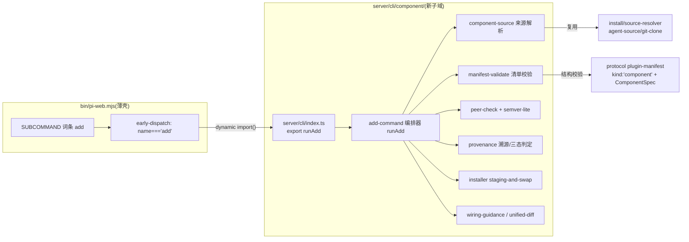

# Design Document — cli-component-add

## Overview

**Purpose**: 本特性给 pi-web CLI 交付 `add` 子命令——shadcn 式源码组件安装车道:把组件包清单声明的源文件拷进目标 agent source 的 `.pi/web/components/<id>/`,写溯源记录,打印接线指引;重复 `add` 具备幂等更新三态。随特性交付 canvas 水印组件范例包与端到端自举验收。

**Users**:组件作者(用 `kind:"component"` 清单发布源码组件)与 agent source 维护者(一条命令集成、可自由修改、可预演可溯源)。

**Impact**:`pi-web.json` 清单的 kind 判别式从两值扩为三值;`bin/pi-web.mjs` 子命令表增加 `add` 并为其接通最小分发路径;新增 `server/cli/component/` 子域与一个 examples 组件包。不触碰 web 运行时、不改其它子命令行为。

### Goals
- `pi-web add`:本地目录 / git 直连(含 `#子目录`)来源,`--dry-run`/`--target`/`--force`,稳定错误码。
- 落点安全(约定死 + 防逃逸)、零代码执行、原子写入、`.component.json` sha256 溯源。
- 幂等更新三态(未改覆盖 / 已改 diff 拒绝 / 同版 no-op)。
- 水印组件范例 + 「add → 接线 → build」端到端自举验收。

### Non-Goals
- registry 远端解析、接线 codemod、`registryDeps` 递归、`list --components`、marketplace、运行时签名(设计稿 §9 与 v2)。
- 通用子命令分发 `runSubcommand`(归 cli-package-commands 任务 6.1)。
- `pi-web build` 编译行为变更(web-kit 既有,`bundle:true` 天然涵盖新增相对 import)。

## Boundary Commitments

### This Spec Owns
- `pi-web.json` 的 `kind:"component"` 判别值与 `component` 字段组的**结构契约**(protocol)及其**业务校验规则**(CLI 侧)。
- `server/cli/component/` 子域全部逻辑:来源解析包装、清单校验、peer 校验(含极简 semver)、安装执行、溯源、三态判定、diff、接线指引、`runAdd` 编排。
- `bin/pi-web.mjs` 中 `add` 的词条(SUBCOMMAND_NAMES/SPECS)与 early-dispatch 特例。
- `examples/canvas-component-watermark/` 组件包范例与其测试挂载。
- `.component.json` 溯源文件格式(本 spec 是其唯一权威)。

### Out of Boundary
- 其它六个子命令的行为与分发接线(占位分支文本逐字节不变)。
- `checkAllowlist`/`ensureGitSource`/`classifySourceForm` 的解析面(只读复用,不扩)。
- `buildWebExtension` 与 canvas-kit 插件契约(只读消费)。
- pi-clouds registry 的任何形态。

### Allowed Dependencies
- `@blksails/pi-web-protocol`(清单 schema)← 单向。
- `server/cli/{context,reporter}.ts`、`server/cli/install/source-resolver.ts`、`packages/server/src/agent-source/git-clone.ts`(既有机构,原样复用)。
- `node:crypto`(sha256)、`node:fs`/`node:path`。**零新增 npm 依赖**(semver 与 diff 自带极简实现)。
- 依赖方向:`protocol ← component 子域纯函数 ← add-command 编排器 ← server/cli/index.ts ← bin/pi-web.mjs`;同层禁互import,禁向上 import。

### Revalidation Triggers
- cli-package-commands 任务 6.1 落地通用分发 → `add` 的 early-dispatch 应迁入其词条表(删 if、加映射)。
- `PluginKindSchema` 再扩值或清单转 discriminatedUnion → 组件校验器须复核。
- `SlotHost`/canvas-kit 插件点契约变化 → 接线指引模板与范例组件须复核。
- `checkAllowlist` 支持无前缀 host 简写后 → 组件来源用法文本须同步。

## Architecture

### Existing Architecture Analysis
沿 cli-package-commands 已建立的分层:`bin/pi-web.mjs`(纯 `.mjs` 薄壳,只 import `node:` 内置)→ 动态 `import()` esbuild 产物 `dist/cli-commands.mjs`(构建入口 `server/cli/index.ts`)→ 各子域纯函数。子命令分发现为占位(`bin/pi-web.mjs:544`);本 spec 在占位**之前**为 `add` 加专用 early-dispatch,不实现通用分发。

### Architecture Pattern & Boundary Map



- **选型**:子域纯函数 + 编排器(与 scaffold/install 子域同构);全部判定逻辑可注入依赖直测。
- **保持的既有模式**:CliContext/ProgressReporter 注入、CliError 稳定码、mkdtemp 测试隔离、esbuild 双产物。
- **新组件理由**:组件安装的清单规则、三态、溯源均为新领域概念,不与 source 级 install 共享语义(install 装「包」到扫描根,add 拷「源码」进 source 内部),故独立子域而非塞进 install/。

### Technology Stack

| Layer | Choice / Version | Role in Feature | Notes |
|-------|------------------|-----------------|-------|
| CLI | Node ≥20 内置(`node:fs/path/crypto`) | 文件操作、sha256、参数解析 | 零新增 npm 依赖 |
| 契约 | zod(protocol 既有) | `component` 字段组结构 | 非 strict,向前兼容 |
| 构建 | esbuild(既有 `scripts/build-server.mjs`) | `runAdd` 随 `dist/cli-commands.mjs` 分发 | 无构建脚本改动(index.ts 已是入口) |
| 范例/测试 | canvas-kit + vitest(jsdom) | 水印组件与其单测 | e2e 走 `e2e/node/` vitest 形态 |

## File Structure Plan

### Directory Structure(新增)
```
server/cli/component/
├── semver-lite.ts          # 极简 semver:parseVersion/satisfies(精确、>=、^、~);其余写法报 UNSUPPORTED
├── manifest-validate.ts    # Req 1 业务规则:字段组必备/files 路径安全与必含测试/wiring 白名单/registryDeps 空/target 约定
├── component-source.ts     # 实参 → 组件包根:剥 #子目录 → classifySourceForm/CLI_ALLOWLIST/ensureGitSource → 读清单
├── peer-check.ts           # 目标目录向上走 node_modules 读 package.json version;聚合全部不满足项
├── provenance.ts           # .component.json 读写、sha256、classifyInstallState 三态+边界态判定
├── unified-diff.ts         # 行级 LCS → unified 格式字符串(仅终端呈现)
├── wiring-guidance.ts      # 依 wiring 声明生成 import 行 + 插件点数组项 + build 提示
├── installer.ts            # staging-and-swap 原子写入(staging 目录 → rename 进位;失败清理/还原)
└── add-command.ts          # runAdd 编排器:参数解析(--dry-run/--target/--force)+ 阶段化 reporter + 退出码

examples/canvas-component-watermark/
├── pi-web.json             # kind:"component" 清单(files/wiring/peer;首个真实实例)
├── README.md               # 用法 + SES §8 自检清单勾选记录
└── components/watermark/
    ├── watermark.tsx       # 水印插件捆:defineCanvasLayer/Tool/Action 三件套 → CanvasPluginBundle
    └── watermark.test.tsx  # 组件单测(随源分发;接缝 prop 可注入)

test/cli/
├── component-manifest-validate.test.ts
├── component-semver-lite.test.ts
├── component-peer-check.test.ts
├── component-provenance.test.ts     # 含三态判定穷举
├── component-installer.test.ts      # 原子性(注入写失败)
├── component-diff-guidance.test.ts
└── component-add-command.test.ts    # 编排器集成(临时目录,真实 fs)

e2e/node/
└── component-add.e2e.test.ts        # 自举验收:复制干净 source → runAdd → 接线 → buildWebExtension → 断言标记;dry-run;拒绝路径

packages/canvas-ui/test/examples/
└── canvas-component-watermark.test.tsx  # wrapper:import 范例测试文件使其入套件(回退:内联同等断言)
```

### Modified Files
- `packages/protocol/src/plugin/plugin-manifest.ts` — `PluginKindSchema` 加 `"component"`;新增 `ComponentWiringSchema`/`ComponentSpecSchema` 与顶层可选 `component` 字段;导出类型。
- `packages/protocol/test/plugin-manifest.test.ts`(或既有清单测试文件)— 新 kind 与字段组的 parse 用例。
- `bin/pi-web.mjs` — `SUBCOMMAND_NAMES` 加 `"add"`;`SUBCOMMAND_SPECS.add`(usage + 选项 `dry-run`/`target`/`force`/`help`);`main()` 占位分支前插入 `add` early-dispatch(动态 import 产物,调 `runAdd(argv)`,返回其退出码)。占位分支文本不变。
- `server/cli/index.ts` — `export { runAdd } from "./component/add-command.js"`。
- `test/cli/subcommand-router.test.ts` — `add` 词条的判别/用法/未知选项用例(沿既有模式增量)。

## System Flows

### add 主流程(含三态)

```mermaid
flowchart TD
  A[解析 argv: source, --target/--dry-run/--force] --> B[component-source: 剥#子目录→白名单→本地/克隆→读清单]
  B --> C{manifest-validate 通过?}
  C -- 否 --> X[CliError 稳定码, exit≠0]
  C -- 是 --> D[定位目标 source: --target 或 cwd; 须含 .pi/web/]
  D --> E[peer-check]
  E -- 不满足且无 --force --> X
  E -- 通过/--force 警告 --> F[provenance: classifyInstallState]
  F -- fresh --> G[staging-and-swap 写入]
  F -- clean-new-version --> G
  F -- clean-same-version --> H[no-op 提示已是该版本, exit 0]
  F -- modified --> I[逐文件 unified diff, 拒绝, exit≠0]
  F -- unmanaged --> X
  G --> J{--dry-run?}
  J -- 是(在 G 前短路) --> K[列文件+指引, 零写入, exit 0]
  G --> L[写 .component.json 溯源]
  L --> M[打印接线指引 + build 提示, exit 0]
```

流程级裁定:dry-run 在全部校验与三态判定**之后**、任何写入**之前**短路(Req 6.1 「与真实安装完全相同的校验」);`--force` 只作用于 peer 边(Req 4.3),对 modified 态无效(Req 7.3);来源解析先于一切本地写动作,git 克隆走既有缓存目录(不属目标 source,不算写入)。

## Requirements Traceability

| Requirement | Summary | Components |
|-------------|---------|------------|
| 1.1–1.7 | 清单判别与校验 | protocol ComponentSpecSchema;manifest-validate |
| 2.1–2.5 | 来源解析 | component-source(复用 source-resolver/git-clone) |
| 3.1–3.4 | 目标定位与落点安全 | add-command(target 判定);installer(realpath 门控);全链零执行 |
| 4.1–4.4 | peer 校验 | peer-check;semver-lite;add-command(--force) |
| 5.1–5.5 | 安装执行与溯源 | installer;provenance;wiring-guidance;reporter 阶段化 |
| 6.1–6.3 | dry-run | add-command(短路点);wiring-guidance |
| 7.1–7.4 | 幂等三态 | provenance.classifyInstallState;unified-diff;add-command 分派 |
| 8.1–8.4 | 组件包范例 | examples/canvas-component-watermark;canvas-ui wrapper 测试 |
| 9.1–9.3 | demo 自举验收 | e2e/node/component-add.e2e.test.ts(runAdd + buildWebExtension) |
| 10.1–10.3 | 错误呈现与退出 | reporter/CliError;bin 词条与 early-dispatch(其它命令不变) |

## Components and Interfaces

| Component | Domain | Intent | Requirements | 依赖 |
|---|---|---|---|---|
| ComponentSpecSchema | protocol | `component` 字段组结构契约 | 1.1 | zod(P0) |
| manifest-validate | cli/component | 清单业务规则裁决 | 1.2–1.7, 2.5 | protocol(P0) |
| component-source | cli/component | 实参→组件包根+来源标识 | 2.1–2.5 | source-resolver、git-clone(P0) |
| semver-lite / peer-check | cli/component | 版本范围与 peer 基线校验 | 4.1–4.4 | node:fs(P1) |
| provenance | cli/component | 溯源读写+安装态判定 | 5.2, 7.1–7.4 | node:crypto(P0) |
| installer | cli/component | 原子写入+落点门控 | 3.2–3.4, 5.1, 5.3 | node:fs(P0) |
| unified-diff / wiring-guidance | cli/component | 终端呈现物生成 | 5.4, 6.2, 7.3 | 无(P2) |
| add-command | cli/component | 编排器与 CLI 面 | 3.1, 4.3, 5.5, 6.1–6.3, 10.1–10.2 | 上述全部+context/reporter(P0) |
| bin 词条+early-dispatch | bin | UX 契约与最小分发 | 10.3 | dist 产物(P0) |
| 水印范例+测试挂载 | examples | 首个合规组件包与自举 | 8.1–8.4, 9.1–9.3 | canvas-kit(P1) |

### protocol:ComponentSpecSchema(Modified: plugin-manifest.ts)

```ts
export const PluginKindSchema = z.enum(["agent", "plugin", "component"]);

/** 接线声明:v1 实现只认 canvasPlugins;枚举预留 renderers/slots(Req 1.5)。 */
export const ComponentWiringSchema = z.object({
  point: z.enum(["canvasPlugins", "renderers", "slots"]),
  export: z.string().min(1),
  from: z.string().min(1),
});

export const ComponentSpecSchema = z.object({
  files: z.array(z.string().min(1)).min(1),
  /** 缺省即约定值 `.pi/web/components/<id>`;声明则必须等于约定值(业务校验裁决)。 */
  target: z.string().optional(),
  wiring: ComponentWiringSchema,
  /** 包名 → 范围表达式(精确 | >= | ^ | ~)。 */
  peer: z.record(z.string(), z.string()).default({}),
  /** v1 必须为空数组(业务校验裁决);schema 预留。 */
  registryDeps: z.array(z.string()).default([]),
});
export type ComponentSpec = z.infer<typeof ComponentSpecSchema>;
// PiWebManifestSchema 增: component: ComponentSpecSchema.optional()
```

结构与业务分层:zod 只管形状;「kind=component 时 component 字段组必备」「files 含测试」「路径安全」等跨字段规则归 manifest-validate(protocol 保持 zero-runtime 纯契约)。

### manifest-validate

```ts
export type ComponentManifestIssue = {
  code: "component_spec_missing" | "component_files_invalid" | "component_tests_missing"
      | "wiring_point_unsupported" | "registry_deps_unsupported" | "target_mismatch";
  message: string;
  field?: string;
};
export type ValidatedComponent = { manifest: PiWebManifest; spec: ComponentSpec; targetRel: string };
export function validateComponentManifest(
  manifest: PiWebManifest,
): { ok: true; value: ValidatedComponent } | { ok: false; issues: ComponentManifestIssue[] };
```

前置:manifest 已过 zod parse 且 `kind === "component"`。裁决:files 路径安全 = 拒绝绝对路径与 `path.normalize` 后以 `..` 开头的相对路径(1.3);测试文件判据 = 任一 file 的 basename 含 `.test.`(1.4);`targetRel` 恒为 `.pi/web/components/${manifest.id}`,声明值不等即 `target_mismatch`(1.7)。

### component-source

```ts
export type ComponentSourceError = {
  code: "source_form_unsupported" | "allowlist_rejected" | "source_fetch_failed"
      | "source_subdir_not_found" | "source_not_component" | "manifest_unreadable";
  message: string;
};
export type ResolvedComponentSource = {
  /** 组件包根(本地目录或 git 缓存内子目录,绝对路径)。 */
  packRoot: string;
  /** 溯源 origin 标识(本地=绝对路径;git=规范化 `git:host/path@ref[#subdir]`)。 */
  origin: string;
  manifest: PiWebManifest;
};
export function splitSubdirFragment(arg: string): { base: string; subdir?: string };
export async function resolveComponentSource(
  arg: string, ctx: Pick<CliContext, "cwd">,
  deps?: { ensureGit?: typeof ensureGitSource }, // 测试注入
): Promise<Result<ResolvedComponentSource, ComponentSourceError>>;
```

裁决:`splitSubdirFragment` 只剥**最后一个** `#` 之后的片段且仅当基串命中直连形态(避免误伤本地目录名含 `#`——本地路径分支不剥片段,子目录语义仅对 git 有意义,2.3);registry 形态实参 → `source_form_unsupported` 附本地/git 用法示例(2.4);kind 非 component → `source_not_component` 附实际 kind(2.5)。

### semver-lite / peer-check

```ts
export type SemverRange =
  | { kind: "exact" | "gte" | "caret" | "tilde"; version: [number, number, number] };
export function parseRange(raw: string): SemverRange | { error: "range_unsupported" };
export function satisfies(version: string, range: SemverRange): boolean;

export type PeerIssue = { pkg: string; required: string; actual: string | null };
export function checkPeers(
  peer: Record<string, string>, targetDir: string,
): { ok: true } | { ok: false; code: "peer_unsatisfied" | "peer_range_unsupported"; issues: PeerIssue[] };
```

版本探测 = 自 `targetDir` 逐级向上找 `node_modules/<pkg>/package.json` 读 `version`(monorepo 命中根 workspace 链接,即目标 source 实际可解析版本);`actual: null` 表示未找到。一次遍历聚合**全部**不满足项(4.2)。

### provenance

```ts
export interface ComponentProvenance {
  id: string; version: string; origin: string; installedAt: string;
  files: Record<string, string>; // 相对路径 → "sha256:<hex>"
}
export const COMPONENT_PROVENANCE_FILENAME = ".component.json";
export function sha256Hex(bytes: Uint8Array): string;
export type InstallState =
  | { state: "fresh" }
  | { state: "clean-same-version"; installed: ComponentProvenance }
  | { state: "clean-new-version"; installed: ComponentProvenance }
  | { state: "modified"; installed: ComponentProvenance; changed: string[] }
  | { state: "unmanaged" };
export function classifyInstallState(
  destDir: string, incoming: { version: string }, readFile: (p: string) => Uint8Array | null,
): InstallState;
```

判定序(7.1–7.4):落点不存在→`fresh`;存在但无溯源→`unmanaged`;溯源在→逐文件比 sha256(记录中文件缺失视同修改);全一致→按版本相等与否分 `clean-same-version`/`clean-new-version`;任一不一致→`modified` 携带变更文件表。

### installer

```ts
export type InstallWriteError = { code: "dest_escapes_target" | "install_write_failed"; message: string };
export async function installComponentFiles(req: {
  packRoot: string; files: string[]; destDir: string; targetSourceDir: string;
  provenance: ComponentProvenance;
}): Promise<Result<{ written: string[] }, InstallWriteError>>;
```

不变量:①写前对 `destDir` 与每个目标路径做 realpath 存在段校验,解析后必须落在 `targetSourceDir` 内(3.3);②staging-and-swap:全部字节先读入内存 → 写 `.staging-<id>-<rand>/` → 覆盖态先把旧目录 rename `.bak` → staging rename 进位 → 删 `.bak`;任何失败清 staging、还原 `.bak`(5.3);③溯源文件随 staging 一并写入(与文件集原子同生);④全程不 require/import/spawn 组件包内任何内容(3.4)。

### add-command(编排器)

```ts
export interface AddCommandOptions {
  cwd?: string; env?: NodeJS.ProcessEnv; reporter?: ProgressReporter;
  deps?: { resolveSource?: typeof resolveComponentSource /* …各纯函数,测试注入 */ };
}
/** 返回进程退出码;所有失败路径经 reporter 渲染 CliError(稳定码+原因+建议)。 */
export async function runAdd(argv: string[], options?: AddCommandOptions): Promise<number>;
```

参数面(与 bin 的 `SUBCOMMAND_SPECS.add` 同步):位置参 `<source>` 必填;`--target <dir>`、`--dry-run`、`--force`、`-h/--help`。目标判定:`--target` 或 `cwd`,须含 `.pi/web/` 目录否则 `target_not_agent_source`(3.1–3.2)。reporter 阶段:`resolve → validate → peers → state → write → provenance → guidance`(5.5)。

### bin 词条与 early-dispatch(Modified: bin/pi-web.mjs)

`SUBCOMMAND_NAMES` 追加 `"add"`;`SUBCOMMAND_SPECS.add` 给 usage(含 v1 支持的来源形态示例与「--force 只降级 peer 校验」说明)。`main()`:

```js
if (opts.intent === "subcommand" && opts.name === "add") {
  const mod = await import(pathToFileURL(distCliCommandsJs()).href);
  return await mod.runAdd(opts.argv);
}
// 既有占位分支原文不动(其它子命令行为不变,Req 10.3)
```

产物缺失时报既有的「先构建」指引(沿 distServerJs 缺失同款错误路径)。

### 水印组件范例(examples/canvas-component-watermark)

清单:`id:"canvas-watermark"`,`kind:"component"`,`files` 含 `watermark.tsx` + `watermark.test.tsx`,`wiring:{point:"canvasPlugins",export:"watermarkBundle",from:"./components/watermark/watermark"}`,`peer:{"@blksails/pi-web-canvas-kit":">=0.0.0"}`(workspace 版本;范围值以实现期实际版本为准)。

源码契约(8.2–8.3):只 import canvas-kit(peer 已声明)与包内相对路径;三件套 = `defineCanvasLayer<WatermarkData>`(Render/bake/Inspector,bake 对缺失原语判空降级)+ `defineCanvasTool`(createLayer 声明式置层)+ `defineCanvasAction`(`via:"command"`,`match` 经 `capability.actions.includes("watermark_apply")` 避让)。DOM 锚点 `data-watermark-text`。测试:图层 Render 输出、bake 降级、action match 避让矩阵——全部接缝 prop 注入,jsdom 可跑。

## Error Handling

- 全部错误以 `CliError`(reporter 既有)渲染:稳定码(小写下划线)+ 人类可读原因 +(适用时)建议;退出码非零(10.1)。经 `redactSecrets` 脱敏(5.5)。
- 稳定码全表:`component_spec_missing` `component_files_invalid` `component_tests_missing` `wiring_point_unsupported` `registry_deps_unsupported` `target_mismatch` `source_form_unsupported` `allowlist_rejected` `source_fetch_failed` `source_subdir_not_found` `source_not_component` `manifest_unreadable` `target_not_agent_source` `dest_escapes_target` `peer_unsatisfied` `peer_range_unsupported` `component_modified` `dest_unmanaged` `install_write_failed`。
- `component_modified` 的呈现 = 逐文件 unified diff + 「手动合并后可删除落点重装」提示;明确说明 `--force` 不适用(7.3)。

## Testing Strategy

- **单元(test/cli/)**:manifest-validate 规则矩阵(1.2–1.7 逐条);semver-lite 四种范围 + 拒绝表(4.4);peer-check 命中/未找到/聚合(4.1–4.2);classifyInstallState 五态穷举(7.1–7.4);installer 原子性(注入写失败断言落点还原,5.3)与逃逸拒绝(3.3);diff/guidance 快照。
- **集成(test/cli/component-add-command.test.ts)**:临时目录真实 fs 走通 fresh/dry-run/no-op/modified/--force 各路径,断言退出码、reporter 输出与零写入(6.1–6.3);bin 词条判别沿 subcommand-router 既有模式;dist 产物可 import 出 `runAdd` 沿 cli-commands 构建测试既有模式。
- **范例测试(packages/canvas-ui/test/examples/)**:wrapper 挂载 watermark.test.tsx(8.4;回退内联断言,见 research §1.7)。
- **e2e(e2e/node/component-add.e2e.test.ts,9.1–9.3)**:mkdtemp 复制 `examples/webext-runtime-code-agent` → `runAdd` 装入水印组件 → 依 wiring 声明改写临时副本的 `web.config.tsx`(e2e 代行手工接线)→ `buildWebExtension` 成功且产物文本含 `data-watermark-text` 标记 → 另跑 dry-run(断言零写入)与拒绝路径(对 `kind:"agent"` 的 example 执行 add);全程不触仓库工作树。

## Security Considerations

- 信任模型 = 安装时人审(设计稿 §5):`--dry-run` 全量预演;安装过程零代码执行(3.4);git 来源沿既有白名单 + pinned ref(不放宽);落点 realpath 门控(3.3);输出脱敏。
- 溯源 sha256 仅用于本地分叉检测,不是完整性签名(与 publish 车道的 sha384+Ed25519 明确区分,不共享实现)。

## Rollout / Implementation Order

1. protocol schema 扩展(+测试)——下游全部依赖它。
2. component 子域纯函数(semver-lite → manifest-validate → provenance → peer-check → diff/guidance → installer),逐个带单测。
3. component-source(复用接缝)+ add-command 编排器 + index.ts 导出(+集成测试)。
4. bin 词条与 early-dispatch(+router 测试)。
5. 水印范例包 + canvas-ui wrapper 测试。
6. e2e 自举验收 + 全量回归(typecheck/test/既有 cli 测试)。

## Open Questions / Risks

- wrapper-import 测试载体待实证,回退方案已备(research §1.7),验收标准不受影响。
- 与并行推进的 cli-package-commands 6.1 的合并:early-dispatch 设计为最小侵入(独立 if,占位文本不动),冲突面已压到最小(research §4)。
- 范例 peer 范围值依赖 canvas-kit 实际版本号,实现期以 workspace 真实值定稿。
