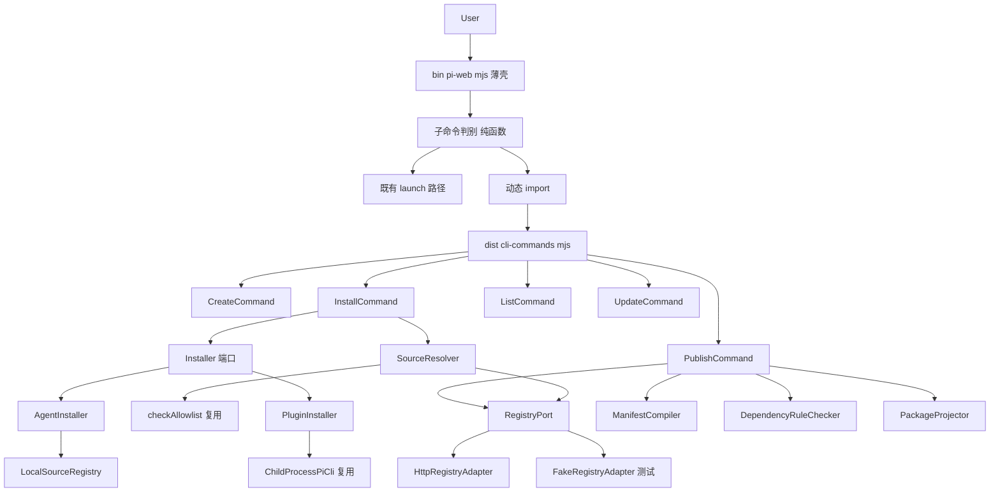
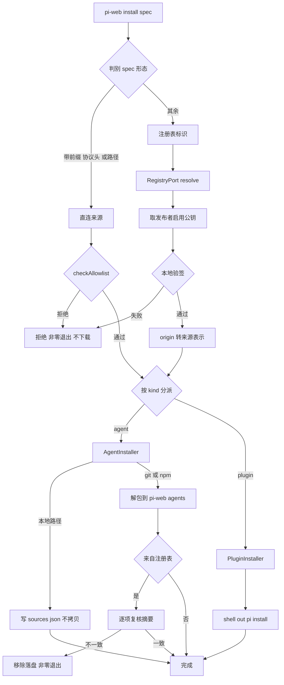
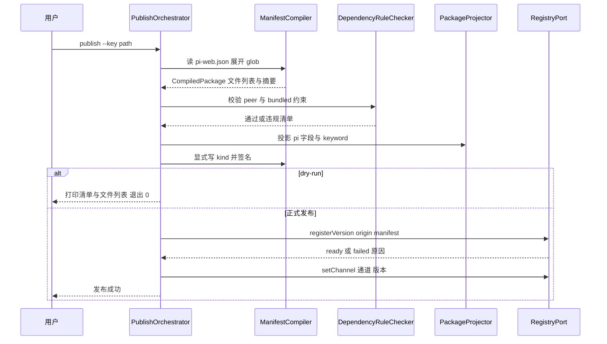

# Design Document — cli-package-commands

## Overview

**Purpose**: 本特性为 pi-web 全局 CLI 引入子命令分发层与六个包管理子命令（`create` / `install` / `uninstall` / `list` / `update` / `publish`），使 agent 与 plugin 的创建、安装、发布在命令行内闭环。

**Users**: agent 与 plugin 作者（创建、发布），pi-web 使用者（安装、卸载、列出、更新）。

**Impact**: `bin/pi-web.mjs` 从「无子命令的薄启动器」变为「子命令分发器 + 既有启动路径」。新增第二个构建产物 `dist/cli-commands.mjs` 承载全部子命令实现，使纯 `.mjs` 的 CLI 壳能复用 TypeScript 编写的校验与编译逻辑。既有的 `pi-web <source>` 启动行为逐字节不变。

### Goals

- 子命令分发层，向后兼容既有启动命令（1.1）。
- 一条由 `kind` 贯穿的闭环：`create` 写下 `kind` → `publish` 据其编译发布清单 → `install` 据其选择落盘通道。
- 复用既有来源校验与 `pi` 子进程装配，不重造安装逻辑。
- `create` / `install` / `uninstall` / `list` / `update` 可在无注册表、无网络的条件下端到端验证（10.4）。

### Non-Goals

- 注册表服务端的任何行为（归 pi-clouds 仓 `specs/registry-package-kind/`）。
- 发布者身份创建与密钥对生成。
- `pi-web.json` 清单格式与 `kind` 判别式本身（已落地，本特性只消费）。
- `~/.pi-web/agents` 默认扫描根的解析逻辑（已落地，本特性只作为落盘目标写入）。
- Web UI 侧 `/plugin` 斜杠命令的行为变更。

---

## Boundary Commitments

### This Spec Owns

- `bin/pi-web.mjs` 的子命令判别与分发（不改既有 `run` 路径的行为）。
- `server/cli/**` 全部新代码：骨架生成、来源判别、两条安装通道、本地来源登记、清单编译、发布校验与编排。
- 第二个构建产物 `dist/cli-commands.mjs` 的产出与随包分发。
- `sources.json`（本地来源登记文件）的**写入**语义。

### Out of Boundary

- `sources.json` 的**读取**与源列表呈现 —— 归 `RegistrySourceProvider`（既有）。
- pi 的包管理行为：安装目录约定、project 信任门控、包脚本执行与否。本设计只调用并呈现其结果。
- `scan-provider` 的 realpath 安全门控 —— 不放宽、不绕过。
- 注册表的登记、验证、版本状态机、channel 语义、回源核验。
- 签名与规范化的**算法定义** —— 由 pi-clouds 的 `registry-client` 权威提供，本设计只调用。

### Allowed Dependencies

- `@blksails/pi-web-protocol`：`PiWebManifestSchema`、`PI_WEB_MANIFEST_FILENAME`、`PluginKind`。
- `@blksails/pi-web-server` 的 `extensions` 公开面：`checkAllowlist`、`DEFAULT_ALLOWLIST`、`assembleInstallArgs`、`assembleRemoveArgs`、`ChildProcessPiCli`、`resolvePiCliEntry`、`parsePiList`。
- `@pi-clouds/registry-client`：签名/摘要纯函数与 HTTP 客户端（构建期 bundle）。
- Node 内置：`node:fs`（含 `globSync`）、`node:crypto`、`node:child_process`、`node:path`、`node:os`。
- **依赖方向**：`protocol → server(packages) → server/cli → bin`。`bin/pi-web.mjs` 不得静态 import 任何 TS 模块；`server/cli` 不得反向依赖 `bin`。

### Revalidation Triggers

- `pi-web.json` 清单 schema 或 `kind` 缺省值变更。
- pi-clouds 侧 `SourceManifest` 形状、`Origin` 联合、签名规范化字节的变更。
- `registry-client` 分发形态从「源码 alias」变为 npm 依赖。
- `pi` 的 `install` / `remove` 参数面变更（`assembleInstallArgs` 随之变更）。
- `sources.json` 形态变更（与 `RegistrySourceProvider` 的读取契约共享）。
- `dist/` 产物布局变更（`cli-commands.mjs` 必须与 `server.mjs` 同处产物根）。

---

## Architecture

### Existing Architecture Analysis

- `bin/pi-web.mjs` 是纯 `.mjs` 薄壳，只 import `node:` 内置，职责为「选项 → env → spawn `dist/server.mjs`」。纯函数 `parseCliArgs` / `buildEnv` 已被 `test/cli/cli-args.test.ts` 单测覆盖。
- 安装能力已存在但出口仅 Web UI：`POST /extensions` → `PiCli` 适配点 → shell out `pi install`。来源白名单 `checkAllowlist` 是**纯函数**（无 IO），可被 CLI 直接复用。
- `GET /agent-sources` 的来源是「目录扫描 ∪ 注册表文件」的并集，注册表文件是既有接缝。
- **关键约束**：pi 的 `getBaseDirForScope` 只返回 `cwd/.pi` 或 `agentDir`，无法落到 `~/.pi-web/agents`（见 `research.md`）。

### Architecture Pattern & Boundary Map

选定模式：**薄壳分发 + 端口适配**。CLI 壳只做参数判别与动态加载；子命令实现集中于一个可 bundle 的入口；对外部世界（pi 子进程、注册表、文件系统）的接触点收敛为端口。



**Architecture Integration**:

- **Selected pattern**: 端口与适配器。外部接触点（注册表、pi 子进程）收敛为端口，使 Wave 1 与 Wave 2 解耦、使离线验证可行。
- **Domain boundaries**: `scaffold` / `install` / `publish` 三个子域互不引用；共享物仅 `manifest`（清单读取与 `kind` 判别）与 `reporter`（进度与脱敏输出）。
- **Existing patterns preserved**: 纯函数参数解析（可单测、无副作用）；`checkAllowlist` / `assembleInstallArgs` / `ChildProcessPiCli` 原样复用；`sources.json` 形态与既有 provider 共享。
- **New components rationale**: `AgentInstaller` 因 pi 无法落盘到 `~/.pi-web/agents` 而必需；`RegistryPort` 因 Wave 2 阻塞与离线验证而必需；其余组件均为需求直接映射。
- **Steering compliance**: 依赖单向收敛（structure.md:5-6）；安全为可替换策略（structure.md:55）——来源校验与信任判据经既有纯函数注入，不硬编码。

### Technology Stack

| Layer | Choice / Version | Role in Feature | Notes |
|-------|------------------|-----------------|-------|
| CLI 壳 | Node `>=22.19.0`，`node:util.parseArgs` | 子命令判别、动态加载 | 只 import `node:` 内置 |
| 子命令实现 | TypeScript strict（经 esbuild → ESM） | 全部子命令逻辑 | 产物 `dist/cli-commands.mjs` |
| glob 展开 | `node:fs.globSync`（Node 22 内置） | 展开清单通配与排除 | 零第三方依赖，实测可用 |
| 完整性摘要 | `node:crypto` `sha384` | 逐文件摘要 | 与注册表 `sha384-<base64>` 对齐 |
| 签名 | `@pi-clouds/registry-client` 纯函数 | Ed25519 签名与规范化 | **不得自实现**，字节须与服务端一致 |
| 注册表客户端 | `@pi-clouds/registry-client` | 版本提交、解析、公钥获取 | 构建期 bundle，运行时零依赖 |
| pi 子进程 | 既有 `ChildProcessPiCli` | plugin 通道安装/卸载/列出 | 复用其 `childEnv` 脱敏透传 |
| 构建 | esbuild（第二个 outfile） | 产出 `dist/cli-commands.mjs` | 必须落产物根 |
| 测试 | vitest（单测）、独立 `.mjs`（CLI e2e） | 见 Testing Strategy | e2e 沿用 `e2e/cli/` 范式 |

---

## File Structure Plan

### Directory Structure

```
server/cli/                          # 子命令实现（esbuild 第二入口的根）
├── index.ts                         # 入口：导出 runSubcommand(name, argv, ctx)；SubcommandRouter 的对侧
├── context.ts                       # CliContext：cwd/agentDir/sourcesRoot/reporter 的装配
├── reporter.ts                      # ProgressReporter：阶段性进度 + 脱敏错误输出
├── manifest.ts                      # 读 pi-web.json、判别 kind（scaffold/install/publish 共享）
├── scaffold/
│   ├── template-catalog.ts          # TemplateCatalog：枚举 dist/examples 模板（--list）
│   └── scaffold-writer.ts           # ScaffoldWriter：拷贝 + 重写 name/private/id、补 pi-package keyword
├── install/
│   ├── source-resolver.ts           # SourceResolver：判别直连 vs 注册表标识；registry 路径含解析+验签
│   ├── installer.ts                 # Installer 端口 + 按 kind 分派
│   ├── agent-installer.ts           # AgentInstaller：git 浅克隆 / npm tarball 解包 → ~/.pi-web/agents
│   ├── plugin-installer.ts          # PluginInstaller：shell out pi install/remove（复用 assembleInstallArgs）
│   ├── local-source-registry.ts     # LocalSourceRegistry：sources.json 的读改写（登记/除名）
│   └── integrity-verifier.ts        # IntegrityVerifier：安装后逐项复核摘要
├── publish/
│   ├── manifest-compiler.ts         # ManifestCompiler：glob 展开 → 文件列表 → sha384 → 签名
│   ├── dependency-rule-checker.ts   # DependencyRuleChecker：peerDeps/bundledDeps 硬约束校验
│   ├── package-projector.ts         # PackageProjector：投影 pi 字段 + pi-package keyword
│   └── publish-orchestrator.ts      # PublishOrchestrator：编译→校验→提交→移动通道；--dry-run 短路
└── registry/
    ├── port.ts                      # RegistryPort 接口（本仓定义，不泄漏客户端类型）
    └── http-registry-adapter.ts     # HttpRegistryAdapter：经 registry-client 实现 RegistryPort
```

> `scaffold` / `install` / `publish` 三个子域互不引用；仅共享 `manifest.ts`、`context.ts`、`reporter.ts`。

### Modified Files

- `bin/pi-web.mjs` — `parseCliArgs` 扩展 `intent` 判别子命令；`main()` 对非 `run` 意图动态 `import()` `dist/cli-commands.mjs`；`--help` 列出子命令。**不新增任何非 `node:` 静态 import**。
- `scripts/build-server.mjs` — 复用现有 `aliasPlugin` / `banner` / `EXTERNAL`，新增第二次 `esbuild.build` 产出 `dist/cli-commands.mjs`（**产物根**）；alias 表新增 `@pi-clouds/registry-client` → 兄弟仓源码。
- `scripts/pack-dist.mjs` — 在 `packDist()` 的产物校验中断言 `dist/cli-commands.mjs` 存在（与既有 `server.mjs` 校验同处）。
- `tsconfig.json` / `vitest.config.ts` — 新增 `@pi-clouds/registry-client` path/alias，使 typecheck 与单测可解析跨仓源码。
- `package.json` — 新增 `e2e:cli:sub` script。

### New Test Files

- `test/cli/subcommand-router.test.ts` — 子命令判别纯函数（1.1–1.7）。
- `test/cli/scaffold.test.ts` — 模板枚举、重写规则、冲突拒绝（2.x）。
- `test/cli/source-resolver.test.ts` — 直连/注册表判别（8.1）、白名单拒绝（3.4）。
- `test/cli/manifest-compiler.test.ts` — glob 展开与排除、摘要、显式 `kind`、缺失路径（5.x）。
- `test/cli/dependency-rules.test.ts` — peer/bundled 正反约束（6.3–6.5）。
- `test/cli/local-source-registry.test.ts` — 登记/除名/无效目录（9.x）。
- `e2e/cli/cli-subcommands.mjs` — 离线端到端：`create` → 启动生成物 → `install <本地路径>` → 源列表可见 → `uninstall`（10.4）。
- `e2e/cli/cli-publish.mjs` — 借 in-proc fake registry 验 `publish --dry-run` 与完整发布链（10.5）。

---

## System Flows

### install 的来源解析与落盘分派



**Key Decisions**：验签在**下载之前**（8.5 要求签名失败时不下载任何第三方代码）；完整性复核在**落盘之后**（8.7），失败则回滚落盘内容。本地路径的 agent 只登记不拷贝，故不参与摘要复核。

### publish 的编译—校验—提交



**Key Decisions**：任一校验失败必须在**发起任何外部写操作之前**终止（6.8）。`--dry-run` 走完全部编译与校验，仅短路提交（6.7）。`CompiledPackage` 只遍历一次磁盘，编译器与校验器共用（见 `research.md` 的 Generalization）。

---

## Requirements Traceability

| Requirement | Summary | Components | Interfaces | Flows |
|-------------|---------|------------|------------|-------|
| 1.1–1.7 | 子命令分发与向后兼容 | `bin/pi-web.mjs`（Router）、`server/cli/index.ts` | `parseCliArgs`、`runSubcommand` | — |
| 2.1–2.11 | 骨架创建 | `TemplateCatalog`、`ScaffoldWriter` | `listTemplates`、`scaffold` | — |
| 3.1–3.12 | 安装与卸载 | `Installer`、`AgentInstaller`、`PluginInstaller`、`ProgressReporter` | `Installer` 端口 | install 分派 |
| 4.1–4.7 | 列出与更新 | `ListCommand`、`UpdateCommand`、`PluginInstaller` | `parsePiList` 复用 | — |
| 5.1–5.11 | 发布清单编译 | `ManifestCompiler` | `compile`、`sign` | publish 时序 |
| 6.1–6.8 | 发布前校验与投影 | `DependencyRuleChecker`、`PackageProjector`、`PublishOrchestrator` | `check`、`project` | publish 时序 |
| 7.1–7.8 | 发布提交与注册表集成 | `PublishOrchestrator`、`RegistryPort`、`HttpRegistryAdapter` | `registerVersion`、`setChannel` | publish 时序 |
| 8.1–8.9 | 经注册表安装与直连降级 | `SourceResolver`、`IntegrityVerifier`、`RegistryPort` | `resolveSource`、`verifyInstalled` | install 分派 |
| 9.1–9.5 | 本地开发的骨架接入 | `LocalSourceRegistry` | `register`、`unregister` | install 分派（本地路径分支） |
| 10.1–10.6 | 可观测性、安全与验证证据 | `ProgressReporter`、`CliContext`、构建脚本 | — | — |

---

## Components and Interfaces

| Component | Domain/Layer | Intent | Req Coverage | Key Dependencies (P0/P1) | Contracts |
|-----------|--------------|--------|--------------|--------------------------|-----------|
| SubcommandRouter | CLI 壳 | 判别子命令，分发 | 1.1–1.7 | 无（纯函数） | Service |
| TemplateCatalog | scaffold | 枚举随包分发的模板 | 2.4, 2.5, 2.6 | `dist/examples`（P0） | Service |
| ScaffoldWriter | scaffold | 拷贝并重写骨架 | 2.1–2.3, 2.7–2.11 | TemplateCatalog（P0） | Service |
| SourceResolver | install | 判别来源形态并解析 | 3.4, 8.1–8.5 | `checkAllowlist`（P0）、RegistryPort（P1） | Service |
| Installer | install | 按 kind 分派落盘 | 3.6, 3.7 | Agent/PluginInstaller（P0） | Service |
| AgentInstaller | install | 落盘到 agent 源根 | 3.6, 3.12, 9.x | LocalSourceRegistry（P0） | Service |
| PluginInstaller | install | shell out pi | 3.7, 3.8, 4.x | `ChildProcessPiCli`（P0） | Service |
| LocalSourceRegistry | install | sources.json 登记/除名 | 9.1–9.5 | 文件系统（P0） | State |
| IntegrityVerifier | install | 安装后复核摘要 | 8.7, 8.8 | `node:crypto`（P0） | Service |
| ManifestCompiler | publish | 编译并签名发布清单 | 5.1–5.11 | `registry-client` 纯函数（P0）、`fs.globSync`（P0） | Service |
| DependencyRuleChecker | publish | 校验 pi 打包硬约束 | 6.3–6.6 | 无 | Service |
| PackageProjector | publish | 投影 pi 字段与 keyword | 6.1, 6.2 | 无 | Service |
| PublishOrchestrator | publish | 编排编译→校验→提交 | 6.7, 6.8, 7.1–7.8 | RegistryPort（P0） | Service |
| RegistryPort | registry | 隔离注册表交互 | 7.x, 8.2–8.4 | — | Service |
| HttpRegistryAdapter | registry | 端口的 HTTP 实现 | 7.x, 8.x | `registry-client`（P0，External） | Service |
| ProgressReporter | shared | 进度与脱敏输出 | 3.10, 3.11, 10.3 | 无 | Service |

### CLI 壳

#### SubcommandRouter

| Field | Detail |
|-------|--------|
| Intent | 判别首个位置参数是否为已知子命令，分发到对应解析器 |
| Requirements | 1.1, 1.2, 1.3, 1.5, 1.6, 1.7 |

**Responsibilities & Constraints**
- 纯函数，无 IO、无副作用（10.1）。
- 首个位置参数不在子命令集内 → 产出既有 `run` 意图，行为逐字节不变（1.1）。
- 各子命令的选项表彼此独立解析，避免选项串味（1.6）。

**Dependencies**
- Inbound: `bin/pi-web.mjs` `main()` — 调用分发（P0）
- Outbound: 无

**Contracts**: Service [x]

##### Service Interface

```typescript
type SubcommandName = "create" | "install" | "uninstall" | "list" | "update" | "publish";

// 判别字段沿用既有的 `intent`（非 `kind`），run 分支的选项保持扁平（非嵌套 `options`）。
// 理由：`main()` 与既有 26 项单测均解引用 `.intent` 与扁平字段；改名/嵌套会迫使改动全部
// 既有断言，而「既有测试零改动且仍通过」正是需求 1.1「逐字节一致」的最强证据。
// 实现于任务 2.1，独立复核确认无消费方 type-import 本类型，故此处按实现修订。
type CliIntent =
  | ({ readonly intent: "run" } & RunOptions)   // 选项扁平展开，与引入本特性前完全一致
  | { readonly intent: "help"; readonly subcommand?: SubcommandName }
  | { readonly intent: "version" }
  | { readonly intent: "subcommand"; readonly name: SubcommandName; readonly argv: readonly string[] };

/** 非法选项/参数抛 CliUsageError（既有类型），main() 捕获后打印并非零退出。 */
export function parseCliArgs(argv: readonly string[]): CliIntent;
```

> `intent: "subcommand"` 分支携带**未解析的原始 argv 切片**，下游可按需重新解析。
> `main()` 中处理该分支的 `if` 块即任务 6.1 接线 `dist/cli-commands.mjs` 的接缝。
- Preconditions: `argv` 为 `process.argv.slice(2)`。
- Postconditions: 返回值为判别联合；不触碰文件系统或网络。
- Invariants: 对任意不以已知子命令名开头的 `argv`，返回 `kind: "run"` 且其 `options` 与本特性引入前一致。

### scaffold 子域

#### ScaffoldWriter

| Field | Detail |
|-------|--------|
| Intent | 从模板拷贝骨架并重写身份字段 |
| Requirements | 2.1, 2.2, 2.3, 2.7, 2.8, 2.9, 2.10, 2.11 |

**Responsibilities & Constraints**
- 目标目录存在且非空 → 拒绝写入，不修改任何既有文件（2.7）。
- 重写 `package.json` 的 `name`、移除 `private` 标记、补 `pi-package` keyword（2.8, 2.9）。
- 写出 `pi-web.json` 时**显式**写出 `kind`，不依赖 schema 缺省（2.3）。
- 模板自身零 `workspace:` 依赖，拷贝后无需重写依赖；生成物经 `pi-web <dir>` 启动即可运行（2.10）。

**Dependencies**
- Inbound: `CreateCommand`（P0）
- Outbound: `TemplateCatalog` — 定位模板目录（P0）

**Contracts**: Service [x]

##### Service Interface

```typescript
interface ScaffoldRequest {
  readonly name: string;
  readonly kind: PluginKind;          // 来自 protocol，"agent" | "plugin"
  readonly templateName: string;
  readonly targetDir: string;
}

type ScaffoldError =
  | { readonly code: "TARGET_NOT_EMPTY"; readonly path: string }
  | { readonly code: "TEMPLATE_NOT_FOUND"; readonly name: string; readonly available: readonly string[] };

interface ScaffoldWriter {
  scaffold(req: ScaffoldRequest): Promise<Result<{ readonly createdAt: string }, ScaffoldError>>;
}
```
- Preconditions: `templateName` 已由 `TemplateCatalog` 校验存在。
- Postconditions: 成功时目标目录含可运行骨架；失败时目标目录不被创建或不被修改。

### install 子域

#### SourceResolver

| Field | Detail |
|-------|--------|
| Intent | 判别实参形态，必要时经注册表解析并本地验签 |
| Requirements | 3.4, 8.1, 8.2, 8.3, 8.4, 8.5 |

**Responsibilities & Constraints**
- 判别规则：带来源类型前缀、协议头、或文件系统路径形态 → 直接来源；其余 → 注册表包标识（8.1）。
- 直接来源经 `checkAllowlist`（既有纯函数）校验；拒绝时不下载任何内容（3.4）。
- 注册表路径：`resolve` → `getPublisherKeys` → `verifyManifest`。**验签失败即终止，不下载第三方代码**（8.5）。

**Dependencies**
- Inbound: `InstallCommand`（P0）
- Outbound: `RegistryPort` — 解析与公钥（P1，仅注册表路径）
- External: `@blksails/pi-web-server` 的 `checkAllowlist`（P0）；`@pi-clouds/registry-client` 的 `verifyManifest`（P0）

**Contracts**: Service [x]

##### Service Interface

```typescript
type ResolvedSource =
  | { readonly via: "direct"; readonly source: ExtSource; readonly kind: PluginKind }
  | {
      readonly via: "registry";
      readonly origin: RegistryOrigin;
      readonly manifest: SignedManifest;   // 已本地验签
      readonly kind: PluginKind;
    };

type ResolveError =
  | { readonly code: "ALLOWLIST_REJECTED"; readonly reason: string }
  | { readonly code: "SIGNATURE_UNTRUSTED"; readonly sourceId: string }
  | { readonly code: "REGISTRY_UNREACHABLE"; readonly baseUrl: string }
  | { readonly code: "SOURCE_NOT_FOUND"; readonly spec: string };

interface SourceResolver {
  resolveSource(spec: string): Promise<Result<ResolvedSource, ResolveError>>;
}
```
- Invariants: 返回 `via: "registry"` 时，`manifest` 必定已通过至少一把启用公钥的验签。

#### AgentInstaller

| Field | Detail |
|-------|--------|
| Intent | 把 `kind: "agent"` 的包落盘到 agent 源根，或登记本地目录 |
| Requirements | 3.6, 3.12, 9.2, 9.3, 9.5 |

**Responsibilities & Constraints**
- **存在理由**：pi 的 `getBaseDirForScope` 只返回 `cwd/.pi` 或 `agentDir`，无法落到 `~/.pi-web/agents`。
- git 来源 → 浅克隆到不可变引用；npm 来源 → 获取 tarball 后本地解包。**两者均不执行包内安装脚本**（3.12）。
- 本地路径来源 → 委托 `LocalSourceRegistry` 登记，**不拷贝目录**（9.2, 9.3）。
- 落盘失败或复核失败时回滚已写入内容（8.8）。

**Dependencies**
- Inbound: `Installer`（P0）
- Outbound: `LocalSourceRegistry`（P0）、`IntegrityVerifier`（P1）
- External: `git` 可执行文件（P1，仅 git 来源）；npm 客户端（P1，仅 npm 来源）

**Contracts**: Service [x]

##### Service Interface

```typescript
interface Installer {
  install(resolved: ResolvedSource, scope: InstallScope): Promise<Result<InstalledRecord, InstallError>>;
  uninstall(id: string, scope: InstallScope): Promise<Result<void, InstallError>>;
}

type InstallScope = "user" | "project";   // 默认 user，见 requirements 3.1 裁定

interface InstalledRecord {
  readonly id: string;
  readonly kind: PluginKind;
  readonly version?: string;
  readonly location: string;   // 落盘绝对路径，或本地登记的目标目录
}
```
- Postconditions: `kind: "agent"` 成功后，其目录位于 agent 源根之下或已被登记于 `sources.json`。

**Implementation Notes**
- Integration: `AgentInstaller` 与 `PluginInstaller` 实现同一 `Installer` 端口，由 `Installer` 按 `kind` 分派；调用方不感知通道差异。
- Validation: `e2e/cli/cli-subcommands.mjs` 覆盖「`install <本地路径>` → 源列表出现该目录 → `uninstall` → 消失」。
- Risks: git/npm 可执行文件缺失 → 输出可操作错误并非零退出，不静默降级。

#### LocalSourceRegistry

| Field | Detail |
|-------|--------|
| Intent | 读改写 `sources.json`，登记扫描根之外的本地目录 |
| Requirements | 9.1, 9.2, 9.3, 9.4, 9.5 |

**Responsibilities & Constraints**
- **只拥有写入**；读取与呈现归既有 `RegistrySourceProvider`（边界）。
- 不放宽 `scan-provider` 的 realpath 门控（9.1 是既有行为，本设计不改变它）。
- 登记前校验目标存在且为有效包目录，否则报错（9.5）。
- 写入必须保留文件中的未知字段，避免破坏其他工具的登记项。

**Contracts**: State [x]

##### State Contract

- 文件：`PI_WEB_SOURCES_REGISTRY`，默认 `<agentDir>/sources.json`。
- 形态：`{ "sources": [ { source, name?, title?, description?, avatar? } ] }`（与既有 provider 共享，见 `registry-provider.ts`）。
- 幂等性：重复登记同一 `source` 不产生重复条目；除名不存在的条目为无操作并给出提示。

### publish 子域

#### ManifestCompiler

| Field | Detail |
|-------|--------|
| Intent | 把手写清单编译为逐文件摘要的已签名发布清单 |
| Requirements | 5.1–5.11 |

**Responsibilities & Constraints**
- 展开 glob 与 `!exclusion`，使发布清单只含确定文件列表，不含通配语法（5.4）。
- 逐文件计算 `sha384` 摘要（5.5）；声明路径缺失即失败，不生成清单（5.6）。
- **显式写出 `kind`**，不依赖本仓或注册表任一侧的缺省（5.7）。
- 签名覆盖除签名字段外的全部规范化内容；**签名与规范化必须调用 `registry-client` 的纯函数**，不得自实现（否则字节漂移导致服务端验签失败）。
- 编译产物不写入源码目录（5.11）。
- 私钥自用户显式指定处读取，绝不回显（5.9, 5.10）。

**Dependencies**
- Inbound: `PublishOrchestrator`（P0）
- External: `@pi-clouds/registry-client` 的 `signManifest` / `computeIntegrity` / `canonicalManifestBytes`（P0）；`node:fs.globSync`（P0）

**Contracts**: Service [x]

##### Service Interface

```typescript
/** 单次磁盘遍历的产物，编译器与校验器共用（避免二次遍历与不一致）。 */
interface CompiledPackage {
  readonly kind: PluginKind;
  readonly id: string;
  readonly version: string;
  readonly files: readonly { readonly path: string; readonly integrity: string }[];
  readonly webextDist?: string;
}

type CompileError =
  | { readonly code: "MANIFEST_MISSING"; readonly expectedPath: string }
  | { readonly code: "MANIFEST_INVALID"; readonly issues: readonly { path: string; message: string }[] }
  | { readonly code: "DECLARED_PATH_MISSING"; readonly paths: readonly string[] }
  | { readonly code: "KEY_UNUSABLE"; readonly reason: "missing" | "unreadable" | "malformed" };

interface ManifestCompiler {
  compile(packageDir: string): Promise<Result<CompiledPackage, CompileError>>;
  sign(pkg: CompiledPackage, privateKeyPath: string): Promise<Result<SignedManifest, CompileError>>;
}
```
- Preconditions: `packageDir` 含 `pi-web.json`。
- Postconditions: `sign` 产出的清单其 `kind` 字段恒为显式值。
- Invariants: `files` 中不含任何通配符或排除语法。

#### DependencyRuleChecker

| Field | Detail |
|-------|--------|
| Intent | 校验 pi 生态的打包硬约束 |
| Requirements | 6.3, 6.4, 6.5, 6.6 |

**Responsibilities & Constraints**
- pi 运行时自带的核心包：必须在 `peerDependencies` 且版本范围为任意版本；不得进 `dependencies`；不得随包分发（6.3, 6.4）。
- 其他 pi 生态包：必须同时进 `dependencies` 与随包分发的依赖清单（6.5）。
- 这两条正反相冲，扫 import 可静态检出——是 publish 校验中价值最高的一项。
- 声明了 web 扩展产物目录却不存在或为空 → 失败（6.6）。

**Contracts**: Service [x]

```typescript
type RuleViolation =
  | { readonly code: "CORE_PKG_NOT_PEER"; readonly pkg: string }
  | { readonly code: "CORE_PKG_BUNDLED"; readonly pkg: string }
  | { readonly code: "ECOSYSTEM_PKG_NOT_BUNDLED"; readonly pkg: string }
  | { readonly code: "WEBEXT_DIST_MISSING"; readonly path: string };

interface DependencyRuleChecker {
  check(packageDir: string, pkg: CompiledPackage): Promise<readonly RuleViolation[]>;
}
```

### registry 子域

#### RegistryPort

| Field | Detail |
|-------|--------|
| Intent | 隔离注册表交互，使 Wave 1 与离线验证不依赖真服务 |
| Requirements | 7.1–7.8, 8.2, 8.3, 8.4 |

**Responsibilities & Constraints**
- 接口在**本仓**定义，不向上层泄漏 `registry-client` 的具体类型（依赖倒置）。
- 两个真实实现：`HttpRegistryAdapter`（生产）与 pi-clouds 交付的 in-proc fake（测试）——非投机抽象。
- 不可达/超时映射为可操作错误，携带所用注册表地址（7.7）。

**Contracts**: Service [x]

```typescript
type RegistryError =
  | { readonly code: "SOURCE_ABSENT"; readonly sourceId: string }
  | { readonly code: "VERSION_EXISTS"; readonly sourceId: string; readonly version: string }
  | { readonly code: "VERSION_REJECTED"; readonly reason: string }
  | { readonly code: "UNREACHABLE"; readonly baseUrl: string }
  | { readonly code: "MUTABLE_REF"; readonly ref: string };

interface RegistryPort {
  resolve(sourceId: string, channel?: string): Promise<Result<ResolvedRegistryEntry, RegistryError>>;
  getPublisherKeys(publisherId: string): Promise<Result<readonly PublisherKey[], RegistryError>>;
  registerVersion(sourceId: string, origin: RegistryOrigin, manifest: SignedManifest): Promise<Result<void, RegistryError>>;
  setChannel(sourceId: string, channel: string, version: string): Promise<Result<void, RegistryError>>;
}
```
- Invariants: `registerVersion` 在来源引用可变时必须失败（7.8），不把判定推迟到服务端。

**Implementation Notes**
- Integration: `HttpRegistryAdapter` 在构建期被 bundle 进 `dist/cli-commands.mjs`，运行时零依赖（10.6）。
- Risks: pi-clouds 的 `registry-client` 分发形态未定（其 spec 决策 9）。若改为 npm 依赖，仅需替换 alias，`RegistryPort` 不变。

---

## Error Handling

- 全部子命令以**判别联合**表达错误（`{ code, ...context }`），由 `ProgressReporter` 统一渲染为可操作的中文错误信息 + 非零退出（1.7）。
- **Fail fast**：`publish` 的任一校验失败必须在发起任何外部写操作之前终止，不留部分完成状态（6.8）。
- **Graceful degradation**：注册表不可达时，直连来源的 `install`/`uninstall`/`list`/`update` 保持可用（8.9）。
- **脱敏**：错误信息不含凭据、令牌或完整环境变量（3.11, 10.3）；私钥内容绝不回显（5.9）。子进程环境沿用 `ChildProcessPiCli.childEnv()` 的最小透传（10.2）。
- `update` 的部分失败不中断其余包，结束时汇总失败项并非零退出（4.7）。

## Testing Strategy

测试项自验收标准导出，而非通用模板。

**Unit（vitest，`test/cli/`）**
- `parseCliArgs`：非子命令首参 → `kind: "run"` 且选项与引入前一致（1.1）；子命令专属选项不被其他子命令接受（1.6）；未知选项抛 `CliUsageError` 且无副作用（1.5）。
- `ScaffoldWriter`：目标非空 → `TARGET_NOT_EMPTY` 且既有文件未被修改（2.7）；生成的 `pi-web.json` 含**显式** `kind`（2.3）；`package.json` 的 `name` 被重写、`private` 被移除、含 `pi-package`（2.8, 2.9）。
- `SourceResolver`：`npm:foo@1.2.3` / `./dir` / `https://…` → `direct`；`org/name` → `registry`（8.1）；白名单拒绝时不发生任何下载（3.4）。
- `ManifestCompiler`：`["extensions", "!extensions/legacy.ts"]` 展开后**不含** `legacy.ts`（5.4）；声明路径缺失 → `DECLARED_PATH_MISSING` 且不产出清单（5.6）；私钥缺失 → `KEY_UNUSABLE` 且无外部写操作（5.10）。
- `DependencyRuleChecker`：核心包在 `dependencies` → `CORE_PKG_NOT_PEER`；核心包被随包分发 → `CORE_PKG_BUNDLED`；生态包未随包分发 → `ECOSYSTEM_PKG_NOT_BUNDLED`（6.3–6.5）。
- `LocalSourceRegistry`：重复登记幂等；写入保留未知字段；无效目录 → 非零错误（9.5）。

**Integration**
- `Installer` 按 `kind` 分派：`agent` 走 `AgentInstaller`、`plugin` 走 `PluginInstaller`（注入 `PiCli` 替身断言参数为 `["install", src, "--no-approve"]`）（3.6, 3.7）。
- `IntegrityVerifier`：篡改一个已落盘文件 → 复核失败、落盘被回滚、非零退出（8.7, 8.8）。

**E2E（离线，`e2e/cli/`）**
- `cli-subcommands.mjs`（10.4，**无网络、无注册表**）：`create` 生成 agent 骨架 → `pi-web <dir>` 启动并进入会话（2.10）→ `install <本地路径>` → `GET /api/agent-sources` 含该目录（9.3）→ `uninstall` → 不再含（9.4）。
- `cli-publish.mjs`（10.5）：借 pi-clouds 交付的 in-proc fake registry，验 `publish --dry-run` 打印清单且**无写操作**（6.7）；正式发布经 `registerVersion` + `setChannel`；重复版本 → `VERSION_EXISTS` 且无副作用（7.6）。
- `[真机]` 真实注册表的发布链路 —— 待 pi-clouds 部署后补，不阻塞单测绿灯。

**回归护栏**
- 既有 `e2e:cli`（`cli-smoke.mjs`）必须继续通过，证明 1.1 的向后兼容。
- 既有 `e2e:cli:reloc` 必须继续通过，证明 `dist/cli-commands.mjs` 随包重定位后仍可被动态 import（10.6）。

## Security Considerations

- **不放宽既有安全门控**：`scan-provider` 的 realpath 门控原样保留；本地目录经 `sources.json` 显式登记（9.1, 9.2）。
- **验签先于下载**：注册表路径下，签名不可信即终止，不获取任何第三方代码（8.5）。
- **落盘后复核**：即便注册表已在发布时核验过，安装侧仍按清单复核摘要，防包在分发渠道被替换（8.7）。
- **最小环境透传**：子进程沿用 `ChildProcessPiCli.childEnv()`，只传 `PATH`/`HOME` 并注入 `GIT_TERMINAL_PROMPT=0`（10.2）。
- **包脚本执行的边界**：`agent` 通道只解包，不执行任何包脚本（3.12）。`plugin` 通道经 `pi install --no-approve`，其脚本执行行为归 pi 所有——本设计不声称能阻止（见 requirements 3.5 的裁定）。
- **默认 user 作用域**：避免 project 作用域污染当前目录并触发 pi 的信任门控（3.1）。

## Rollout / Implementation Order

设计上分两个波次，波次内可并行，波次间有真实阻塞。

- **Wave 1（不依赖注册表）**：`SubcommandRouter` → `CliContext`/`ProgressReporter` → `TemplateCatalog`/`ScaffoldWriter`（create）→ `LocalSourceRegistry` → `AgentInstaller`/`PluginInstaller`/`Installer` → `SourceResolver` 的直连分支 → `list`/`update` → 构建脚本第二入口 → 离线 e2e。
- **Wave 2（阻塞于 pi-clouds `specs/registry-package-kind/`）**：`RegistryPort` → `HttpRegistryAdapter` → `ManifestCompiler` → `DependencyRuleChecker`/`PackageProjector` → `PublishOrchestrator` → `SourceResolver` 的注册表分支 → `IntegrityVerifier` → fake-registry e2e。

> Wave 2 的**接口**（`RegistryPort`）可在 Wave 1 期间定稿并以 fake 实现驱动测试；其 HTTP 适配器的落地需要 `registry-client` 的分发形态确定（pi-clouds spec 决策 9）。

## Open Questions / Risks

- `registry-client` 的分发形态未定（源码 alias vs 内部 npm）。缓解：`RegistryPort` 隔离，替换点单一。
- 注册表未部署，`publish` 无真机验证路径。缓解：in-proc fake registry 提供等价行为规格；真机项标 `[真机]`。
- `fs.globSync` 在 Node 22 标注为实验性。缓解：用法限于 `pattern + exclude` 最小面；`engines` 已锁 `>=22.19.0`。
- plugin 是否需要 channel 语义（pi-clouds spec 的待澄清项）。影响 `install org/name@channel` 的实参面；Wave 2 前需拍板。
