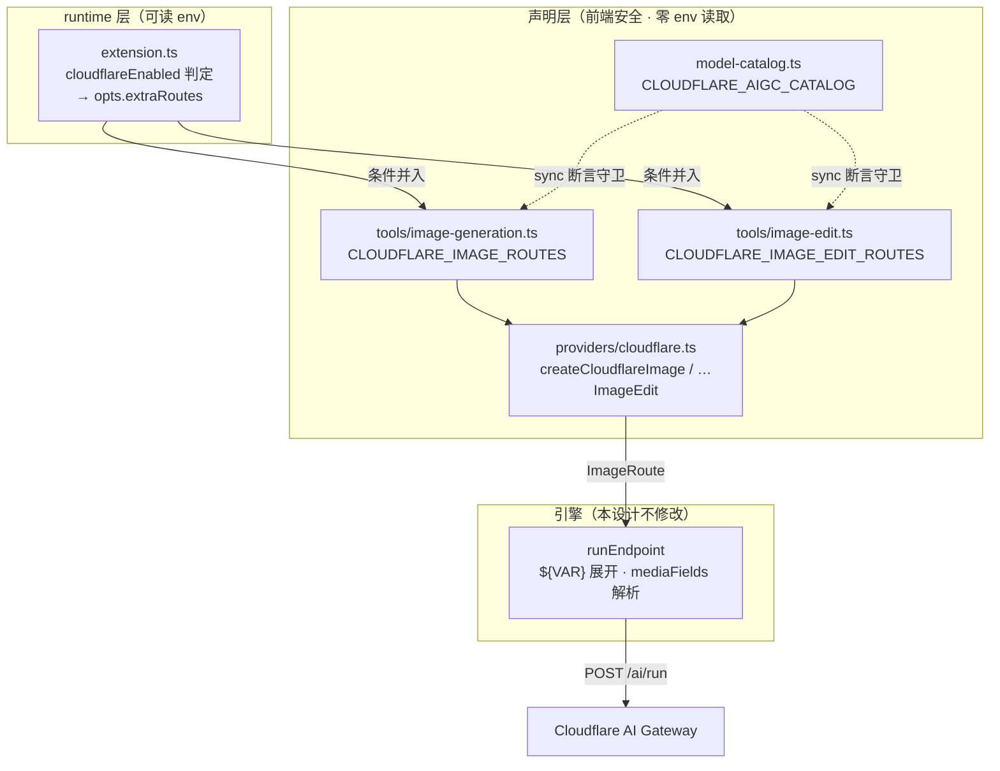
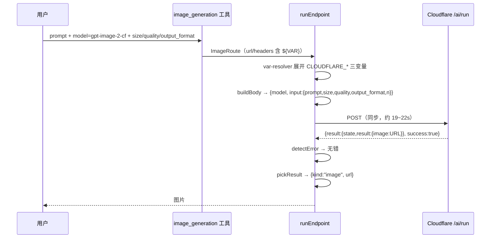
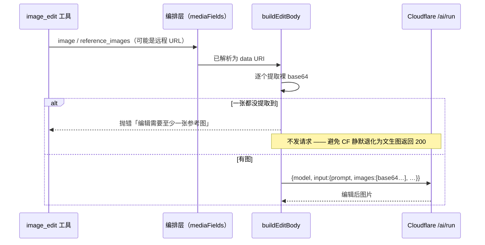

# Design Document — cloudflare-aigc-provider

## Overview

本特性在 pi-web 的 AIGC 图像体系中新增 **Cloudflare AI Gateway** 通路（provider id `cloudflare`），使用户可在图像模型选择器中选中 Cloudflare 模型完成**文生图**与**图像编辑**。

pi-web 现有 5 个图像 provider 中，`newapi` / `sufy` / `ai-gateway` 三者均为 OpenAI `/images` 协议兼容、实现上是 `openai-compat.ts` 的薄封装；`gemini-relay` 与 `dashscope` 则是自带协议的独立工厂。Cloudflare 的 `/ai/run` 属后者：请求参数嵌套在 `input` 下、响应取图路径不同、需额外 `cf-aig-gateway-id` header，且其上**两类模型（Unified 第三方 / Workers AI 原生）响应形态互不相同**。因此本设计新建一个独立 provider 工厂，结构照 `gemini-relay.ts` 这一最贴近的先例。

**Impact**：新增一条出图通路；对既有 5 个 provider 零行为变更；不改图像工具执行引擎。Cloudflare 通路的额外价值是**统一计费**——调用 `openai/gpt-image-2` 等第三方模型只需 Cloudflare 自身凭据，无需再持有并下发 OpenAI key。

### Goals

- 用户可选中 Cloudflare 模型并成功出图（文生图 + 图像编辑）
- Unified 第三方模型与 Workers AI 原生模型对用户呈现一致，不因内部响应形态差异而其一不可用
- 未配置 Cloudflare 环境变量时，既有行为逐字节不变
- 目录与实际可调用路由之间由自动化断言守卫，不产生漂移

### Non-Goals

- 修改 `EndpointBehavior` / `runEndpoint` 执行引擎契约
- 变更既有 `openrouter` / `newapi` / `sufy` / `dashscope` / `ai-gateway` 任何行为
- 出图结果的持久化与附件落盘（既有 attachment 链路承担）
- 视频 / 音频等非图像模态
- Cloudflare 账号开通、网关创建、计费额度管理等运维动作

## Boundary Commitments

### This Spec Owns

- `cloudflare` provider 工厂：CF `/ai/run` 的请求构造、结果提取、错误判定
- Cloudflare 文生图与图像编辑两组路由声明
- Cloudflare 模型的展示目录条目及其与路由的一致性
- Cloudflare 通路的环境变量契约与条件注册开关

### Out of Boundary

- 图像工具执行引擎（`engine/`）——本设计只**消费** `EndpointBehavior` 接缝，不扩展它
- 参考图从远程 URL 到 data URI 的解析——由编排层 `mediaFields` 承担（既有）
- 产出图的落盘与附件生命周期——既有 attachment 链路承担
- pi 子进程的环境变量注入机制——本设计只对 env **命名**提出约束

### Allowed Dependencies

- `engine/endpoint-types.ts` 的类型契约（只读消费）
- `aigc/types.ts` 的 `ImageRoute` / `ImageProviderId`（需扩展 union 成员）
- 编排层的 `mediaFields` 解析结果（data URI 形态）
- **不得**依赖 `openai-compat.ts`（协议不同，见 research.md D1）

### Revalidation Triggers

以下变化应触发下游重新校验：

- `ImageProviderId` union 增减成员 → UI 徽章渲染、`AigcCatalogEntry.provider` 类型
- CF 响应形态变化（如 Unified 改为单层、或 Workers AI 改返回 URL）→ `pickResult` 双路探测
- `mediaFields` 解析产物形态从 data URI 改变 → 编辑路径的 base64 提取
- 条件注册开关的 env 名变更 → 部署配置与 pi-clouds 侧下发

## Architecture

### Existing Architecture Analysis

图像 provider 体系当前的分层与约束：

- **声明层**（`providers/*.ts`、`tools/*.ts` 路由表、`model-catalog.ts`）：经 tool-kit **主入口**导出，前端安全，**模块顶层不得读 `process.env`**（否则浏览器 bundle eval 时 `process` 未定义，dev 路由崩溃）。配置一律走 `${VAR}` 占位符，执行期由 var-resolver 展开。
- **runtime 层**（`extension.ts`）：经 `@blksails/pi-web-tool-kit/runtime` 加载，含 pi SDK 值导入，**允许读 env**，负责按 env 条件把可选路由组经 `opts.extraRoutes` 并入。
- **防漂移**：`model-catalog.ts` 是手写纯数据（不 import 路由），与路由表的一致性由 `test/aigc/model-catalog.test.ts` 的 sync 断言守卫。

本设计严格遵循上述三条既有约束，不引入例外。

### Architecture Pattern & Boundary Map



### Technology Stack

无新增依赖。TypeScript + 既有 `EndpointBehavior` 接缝 + vitest。

## File Structure Plan

### 新建文件

| 路径 | 责任 |
|------|------|
| `packages/tool-kit/src/aigc/providers/cloudflare.ts` | Cloudflare `/ai/run` provider 工厂：`buildBody`（T2I / edit 两式）、`pickResult`（双形态兼容）、`detectError`、两个公开工厂 `createCloudflareImage` / `createCloudflareImageEdit` |
| `packages/tool-kit/test/aigc/providers/cloudflare.test.ts` | 工厂单测：请求体形态、双响应形态提取、错误判定、编辑无图拦截、占位符与 requiredVars |

### 修改文件

| 路径 | 改动 |
|------|------|
| `packages/tool-kit/src/aigc/types.ts` | `ImageProviderId` union 增加 `"cloudflare"` |
| `packages/tool-kit/src/aigc/model-catalog.ts` | `AigcCatalogEntry.provider` union 增加 `"cloudflare"`；新增导出 `CLOUDFLARE_AIGC_CATALOG` |
| `packages/tool-kit/src/aigc/tools/image-generation.ts` | 新增导出 `CLOUDFLARE_IMAGE_ROUTES` |
| `packages/tool-kit/src/aigc/tools/image-edit.ts` | 新增导出 `CLOUDFLARE_IMAGE_EDIT_ROUTES` |
| `packages/tool-kit/src/aigc/extension.ts` | 新增 `cloudflareEnabled` 判定与 `extraRoutes` 并入；`publishAigcCatalog` 的 extra 路由并入 |
| `packages/tool-kit/src/index.ts` | 导出 `CLOUDFLARE_AIGC_CATALOG`（供 server / Next 路由 import） |
| `packages/tool-kit/test/aigc/model-catalog.test.ts` | 新增第三组 sync 断言：`CLOUDFLARE_AIGC_CATALOG` ↔ CF 路由并集 |

## System Flows

### 文生图



### 图像编辑（含静默退化拦截）



## Requirements Traceability

| 需求 | 验收 | 设计承接 |
|------|------|---------|
| 1 文生图 | 1.1–1.5 | `createCloudflareImage` + `buildT2IBody`；`input` 平铺 prompt/size/quality/output_format/n；`keySource:Unified` 免第三方 key |
| 2 图像编辑 | 2.1–2.2 | `createCloudflareImageEdit` + `buildEditBody`；参考图经既有 `mediaFields` → data URI → 提取裸 base64 |
| 2 图像编辑 | 2.3 | `buildEditBody` 在提取不到任何图时**抛错**，不发请求（见流程图分支） |
| 2 图像编辑 | 2.4 | 仅将支持编辑的模型放入 `CLOUDFLARE_IMAGE_EDIT_ROUTES` |
| 3 两类模型一致 | 3.1–3.3 | 单一 `pickResult` 双路探测：`result.result.image` → 回落 `result.image`；base64 分支嗅探 MIME 拼 data URI |
| 4 目录可见性 | 4.1–4.3 | `CLOUDFLARE_AIGC_CATALOG` + `publishAigcCatalog` extra 并入；`disabledModels` 经既有 `filterRoutes` 统一生效 |
| 4 目录可见性 | 4.4 | 路由键 `gpt-image-2-cf` 等，与 `gpt-image-2` / `-sufy` / `-ai-gateway` 互不冲突 |
| 4 目录可见性 | 4.5 | 模型池由独立探针任务真机收敛后写入 |
| 5 凭据配置 | 5.1 | `CLOUDFLARE_ACCOUNT_ID` / `CLOUDFLARE_AIG_GATEWAY_ID` / `CLOUDFLARE_API_TOKEN` |
| 5 凭据配置 | 5.2 | `requiredVars` 三项 + `extension.ts` 条件注册（缺配则不注册） |
| 5 凭据配置 | 5.3 | 命名避开 `AI_GATEWAY_API_KEY`（见 research.md §2.3） |
| 5 凭据配置 | 5.4 | 模块顶层零 env 读取，全部 `${VAR}` 占位 |
| 5 凭据配置 | 5.5 | 未配置时 `extraRoutes` 为 `undefined`，行为逐字节不变 |
| 6 失败可诊断 | 6.1–6.3 | `detectError` 读 `errors[].message`；区分凭据类错误；`pickResult` 无图时返回 `raw` 由上层判失败 |
| 7 不回归 | 7.1 | 零改动 `openai-compat.ts` 与既有 provider 文件 |
| 7 不回归 | 7.2 | 第三组 sync 断言守卫 |
| 7 不回归 | 7.3 | 不修改 `engine/` |

## Components and Interfaces

### providers/cloudflare.ts

```typescript
/** Cloudflare AI Gateway 通路配置（值为 ${VAR} 占位符，执行期展开）。 */
export interface CloudflareConfig {
  /** 账号 id 占位符，拼进 /accounts/{id}/ai/run。 */
  accountIdVar: string;
  /** 网关 id 占位符，进 cf-aig-gateway-id header。 */
  gatewayIdVar: string;
  /** 访问凭据占位符，进 Authorization: Bearer。 */
  apiTokenVar: string;
  /** provider 徽章，恒为 "cloudflare"。 */
  provider: ImageProviderId;
}

/** 工厂入参：LLM 可见 model（路由键）+ 元数据；providerModel 缺省 = model。 */
export interface CloudflareModelArgs {
  model: string;
  label: string;
  description: string;
  /** 实际发往 CF 的模型名，如 "openai/gpt-image-2" 或 "@cf/black-forest-labs/flux-1-schnell"。 */
  providerModel?: string;
}

/** 创建 Cloudflare 文生图路由项。 */
export function createCloudflareImage(
  args: CloudflareModelArgs,
  extras?: Partial<ImageRoute>,
): ImageRoute;

/** 创建 Cloudflare 图像编辑路由项（参考图经 input.images 提交）。 */
export function createCloudflareImageEdit(
  args: CloudflareModelArgs,
  extras?: Partial<ImageRoute>,
): ImageRoute;
```

**路由基底**（两个工厂共用）：

| 字段 | 值 |
|------|-----|
| `url` | `https://api.cloudflare.com/client/v4/accounts/${CLOUDFLARE_ACCOUNT_ID}/ai/run` |
| `method` | `POST` |
| `headers` | `{ authorization: "Bearer ${CLOUDFLARE_API_TOKEN}", "cf-aig-gateway-id": "${CLOUDFLARE_AIG_GATEWAY_ID}" }` |
| `requiredVars` | `["CLOUDFLARE_ACCOUNT_ID", "CLOUDFLARE_AIG_GATEWAY_ID", "CLOUDFLARE_API_TOKEN"]` |
| `provider` | `"cloudflare"` |
| `pickResult` / `detectError` | 模块内共用实现 |

### 请求体构造

```typescript
// 文生图
{ model: providerModel, input: { prompt, size?, quality?, output_format?, n? } }

// 图像编辑（images 为**裸 base64 数组**，非 data URI）
{ model: providerModel, input: { prompt, images: [b64, …], size?, quality?, output_format? } }
```

`negative_prompt` 无原生字段，照既有 provider 惯例并入正文（`${prompt}\n\nAvoid: ${negative_prompt}`）。

### 结果提取（Req 3 核心）

```typescript
function pickResult(r: unknown): PickedResult {
  // 1. Unified 第三方：result.result.image = 远程 URL
  // 2. Workers AI 原生：result.image = 裸 base64（无 data: 前缀）
  //    → 嗅探 MIME（/9j/ → jpeg，iVBOR → png，默认 png）后拼 data URI
  // 3. 均未命中 → { kind: "raw", value: r }，由上层判失败（Req 6.3）
}
```

### 错误判定

```typescript
function detectError(r: unknown): string | undefined {
  // success === false 或 errors[] 非空 → 拼 message（含 code 便于区分凭据类 vs 模型类，Req 6.1/6.2）
  // result.state 存在且 !== "Completed" → 以 state 作为失败描述
}
```

### extension.ts 条件注册

```typescript
const cloudflareEnabled =
  nonEmpty(process.env.CLOUDFLARE_ACCOUNT_ID) &&
  nonEmpty(process.env.CLOUDFLARE_AIG_GATEWAY_ID) &&
  nonEmpty(process.env.CLOUDFLARE_API_TOKEN);
```

三者**全部**齐备才启用（Req 5.2：缺配则不提供，而非调用时才失败）。与既有 `aiGatewayEnabled` 并列，两组 `extraRoutes` 按需拼接后一并传入 `registerImageGeneration` / `registerImageEdit` 与 `publishAigcCatalog`。

## Error Handling

### Error Strategy

失败在两个位置拦截：**发请求前**（缺 env → 不注册；编辑缺图 → 抛错不发）与**收响应后**（`detectError` → 可读描述；`pickResult` 无图 → `raw` 判失败）。

### Error Categories and Responses

| 类别 | 触发 | 用户可见 | 需求 |
|------|------|---------|------|
| 配置缺失 | 三个 env 任一缺失/空 | 模型根本不出现在选择器中 | 5.2 |
| 模型不存在 | CF 404 + code 7003 | `Model not found: …` | 6.1 |
| 凭据无效 | CF 401/403 | 与「模型不存在」文案可区分（含 code） | 6.2 |
| 编辑缺图 | 参考图未解析出任何 base64 | 明确报错，**不**退化为文生图 | 2.3 |
| 无图结果 | 两条取图路径均未命中 | 判失败而非返回空 | 6.3 |

## Testing Strategy

### 单元测试（`test/aigc/providers/cloudflare.test.ts`）

1. `buildBody`（T2I）产出 `{model, input:{prompt,…}}` 嵌套形态，且 `size`/`quality`/`output_format`/`n` 落在 `input` 下 — Req 1.2
2. `buildBody`（edit）把 data URI 参考图转为**裸 base64 数组**放在 `input.images`（复数）— Req 2.1/2.2
3. `buildBody`（edit）在参考图一张都提取不到时**抛错且不产出请求体** — Req 2.3
4. `pickResult` 从 `{result:{state,result:{image:URL}}}` 提取 URL — Req 3.1
5. `pickResult` 从 `{result:{image:"<裸 base64>"}}` 提取并拼成 data URI，MIME 嗅探对 jpeg/png 各一例 — Req 3.2
6. `pickResult` 两路均未命中时返回 `kind:"raw"` — Req 6.3
7. `detectError` 对 `{errors:[{message,code:7003}],success:false}` 返回含 message 的描述 — Req 6.1
8. 路由基底：`url`/`headers` 含三个 `${VAR}` 占位符、`requiredVars` 三项齐全、`provider === "cloudflare"` — Req 5.1/5.2/5.4

### 一致性测试（`test/aigc/model-catalog.test.ts` 扩充）

9. `CLOUDFLARE_AIGC_CATALOG` 的 model 集合 = CF gen∪edit 路由并集（无缺无余）— Req 7.2
10. 每条目 label 与 route 一致、provider 恒为 `cloudflare` — Req 4.1
11. 路由键与既有全部 provider 的 model 集合无交集 — Req 4.4

### 集成测试（`test/aigc/` 扩充，照 `ai-gateway-extension-control.integration.test.ts`）

12. 三个 env 齐备 → CF 路由进入工具的 model 枚举 — Req 5.1
13. 任一 env 缺失 → CF 路由**不**进入枚举，且既有 provider 枚举逐字节不变 — Req 5.2/5.5/7.1
14. `disabledModels` 含某 CF 模型 → 该模型从枚举中移除 — Req 4.3

### 真机验收（E2E，需实际 Cloudflare 凭据）

15. 文生图：选中 CF 模型出图，`size`/`quality`/`output_format` 生效，中文 prompt 正常 — Req 1.1–1.3
16. 图像编辑：给定参考图与编辑指令，产出图保持原图构图且按指令修改 — Req 2.1
17. Workers AI 原生模型（`@cf/*`）同样正常出图并显示 — Req 3.2
18. 模型池收敛：逐个真机调用候选模型，仅将成功者写入目录 — Req 4.5

## Security Considerations

- Cloudflare token 仅经 `${VAR}` 占位符在执行期展开，不进入前端产物，不写入日志。
- 声明层模块顶层零 env 读取，杜绝凭据经 bundle 泄漏。
- env 命名避开 pi SDK 保留名，防止凭据被 SDK 误认作 Vercel 网关凭据而外发（research.md §2.3）。
