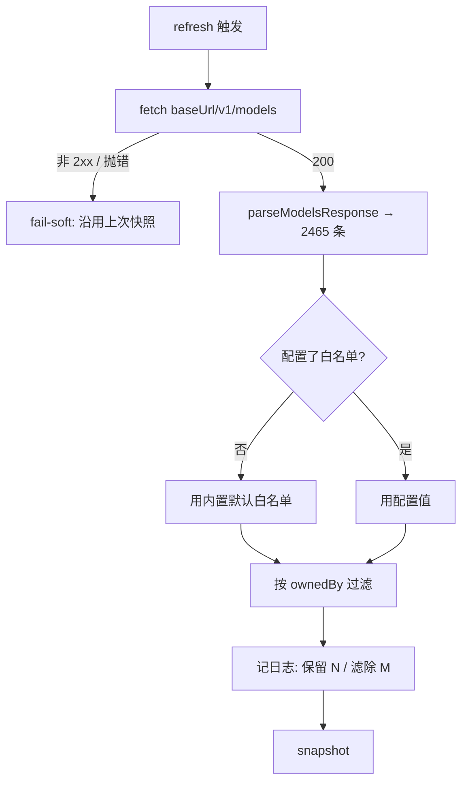

# Design Document

## Overview

把 Cloudflare AI Gateway 接为**对话**模型来源。实测表明现有 `ai-gateway` 套件在认证与路径两处均与 CF 的 OpenAI 兼容面天然吻合，故本设计**不新建 provider 适配层**，主体工作是：以真实装配跑通端到端、为庞大目录加 provider 白名单收敛、把配置约定写成文档与可诊断日志。

### Goals

- 仅凭环境变量即可接入，CF 上的模型自动出现在模型选择器。
- 2465 条目录经白名单收敛为可用规模，且新型号发布无需改代码。
- 「可用」这一结论建立在真实装配的运行证据上。

### Non-Goals

- **不**改 `llm-gateway`（沙箱换钥代理，与模型清单无关）。
- **不**新建 CF 专用适配层（除非端到端验证证明必需）。
- **不**采集/展示定价元数据（`cost_in`/`cost_out` 目录中现成，留待后续）。
- **不**迁移到 CF 新端点（实测其 `/models` 返回 405，尚不可替代）。

## Boundary Commitments

### This Spec Owns

- `GatewayModelCatalog` 的目录收敛能力（provider 白名单）及其配置解析。
- Cloudflare 接入的配置文档与端到端验证。

### Out of Boundary

- `mergeModelCatalog` 的合并语义（纯函数，不因来源不同而改变）。
- `ai-gateway` 的换钥转发、TTL、fail-soft 等既有行为。
- Cloudflare 网关侧的 stored keys 配置（决定模型能否真正调通，不由本仓保证）。

### Allowed Dependencies

- 仅既有依赖（`zod` 已在 `ai-gateway/config.ts` 使用）。**禁止**为本 spec 引入新的 npm 依赖。

### Revalidation Triggers

- CF 停止容忍 `/compat/v1/*` 的多层 `/v1`，或弃用 `/compat` → 路径约定与本设计的「零适配层」前提失效。
- `ai-gateway` 改变 `${baseUrl}/v1/models` 的拼接方式 → 配置层级约定需同步。
- CF 改为不接受标准 `Authorization` 头 → 需引入可配认证头。

## Architecture

### Existing Architecture Analysis

```
GatewayModelCatalog.refresh()
  → fetch ${baseUrl}/v1/models   ← CF: …/compat/v1/models ✅ 2465 条
  → parseModelsResponse → snapshot: GatewayModelEntry[]  ← ★收敛插在此处
                                    { model, ownedBy, source:"ai-gateway" }
  ↓
createModelCatalogService({ gatewayChat, listSelfChat, … })
  → mergeModelCatalog(self, gateway, precedence)  ← 不动
  ↓
GET /api/config/models → 模型选择器
```

`GatewayModelEntry.ownedBy` 即 CF 目录的 `owned_by`（`"openai"` / `"anthropic"` / `"openrouter"` …），恰好是白名单要过滤的维度 —— **无需新增字段**。

### 收敛插入点选型

| 候选 | 评价 |
|---|---|
| **A. `GatewayModelCatalog.refresh()` 内，parse 之后** | ✅ **采纳**。快照即已收敛（2465 → 数百），内存与传输均受益；日志天然可记录滤除数 |
| B. `mergeModelCatalog` 内 | ❌ 它是纯函数，不应承担来源策略；且此时已构造完整数组 |
| C. 装配层 `pi-handler` | ❌ 每请求重复过滤，且快照仍持有全量 |

## File Structure Plan

### Modified Files

| 路径 | 改动 |
|---|---|
| `packages/server/src/ai-gateway/model-catalog.ts` | `GatewayModelCatalogDeps` 加可选 `allowedOwners`；`refresh()` 在 parse 后按其过滤并记录滤除数 |
| `packages/server/src/ai-gateway/config.ts` | 解析白名单 env，落入 `AiGatewayConfig`；缺省用内置默认 |
| `lib/app/pi-handler.ts` | 装配时把配置里的白名单透传给 `GatewayModelCatalog` |
| `docs/`（具体文件依现有结构择一） | Cloudflare 接入说明 |

### New Files

| 路径 | 职责 |
|---|---|
| `packages/server/test/ai-gateway/model-catalog-allowlist.test.ts` | 白名单过滤、缺省、滤除计数、大小写与空白容错 |

## System Flows



## Requirements Traceability

| 需求 | 承载 |
|---|---|
| 1.1 / 1.2 / 1.3 | 既有 `ai-gateway` 能力 + 配置（端到端由任务 3 验证） |
| 1.4 | 既有单一 env 启用判别（`aiGwConfig === undefined` 时零注册） |
| 2.1 / 2.3 | `model-catalog.ts` 的 `allowedOwners` 过滤 |
| 2.2 | `config.ts` 的内置默认白名单 |
| 2.4 | 按 **provider** 而非模型 id 过滤 —— 新型号自动可见 |
| 2.5 | `refresh()` 内的滤除计数日志 |
| 3.1 / 3.2 / 3.3 | 端到端验证任务（真实装配，覆盖两家上游） |
| 4.1 | 目录拉取失败时记录实际 URL 与原因 |
| 4.2 | 既有 fail-soft 行为（不改） |
| 4.3 / 4.4 / 5.1 / 5.2 | 文档 |

## Components and Interfaces

```ts
/** 目录收敛:仅保留 ownedBy 命中白名单的条目。 */
export interface GatewayModelCatalogDeps {
  readonly baseUrl: string;
  readonly ttlMs: number;
  readonly keyResolver?: KeyResolver;
  /**
   * 允许的上游 provider（对应目录条目的 `owned_by`）。
   * `undefined` = 不过滤（保持既有行为，向后兼容）；空集 = 全部滤除。
   */
  readonly allowedOwners?: ReadonlySet<string>;
}
```

**配置**（`config.ts`）：

```ts
export const AI_GATEWAY_PROVIDER_ALLOWLIST_ENV = "PI_WEB_AI_GATEWAY_PROVIDER_ALLOWLIST";

/**
 * 内置默认白名单。依据 2026-07-29 实测的 CF 目录分布 —— 排除 openrouter
 * （1067 条，与其他 provider 大量重复覆盖），保留主流直连厂商。
 */
export const DEFAULT_PROVIDER_ALLOWLIST = ["anthropic", "openai", "google-ai-studio"];
```

**契约**：
- 值为逗号分隔；逐项 `trim()` 且忽略大小写；空项跳过。
- 显式设为空字符串 → 视为未配置（用默认），而非「全部滤除」—— 避免误配导致模型清单空白。
- `allowedOwners` 为 `undefined` 时**不过滤**，保证既有部署（非 CF 网关）行为逐字节不变。

## Error Handling

| 情形 | 处理 | 可见性 |
|---|---|---|
| 目录拉取非 2xx / 抛错 | 沿用上次快照（既有 fail-soft） | 服务端日志含**实际请求 URL** 与状态/错因（Req 4.1；★现有实现刻意不记细节，本 spec 需在不泄露凭据前提下补足可诊断信息） |
| 白名单滤空（全部条目被滤除） | 快照为空集 | 日志明确记录「保留 0 / 滤除 N」，使部署方可判断白名单过窄（Req 2.5） |
| env 值非法（全为空白） | 回落默认白名单 | 不抛错 —— 模型清单不应因此空白 |

## Testing Strategy

### 单元测试（`packages/server`）

`model-catalog-allowlist.test.ts`：

1. 未传 `allowedOwners` → 条目数与过滤前一致（既有行为不变）
2. 传白名单 → 仅命中 `ownedBy` 的条目留存
3. 大小写与首尾空白容错（`" OpenAI "` 命中 `openai`）
4. 空集 → 全部滤除且快照为空（不抛错）
5. 滤除计数出现在日志（以注入的 logger 断言）

`config.ts` 相关：

6. env 未设 → 得到默认白名单
7. env 为空白串 → 回落默认（**不**解释为「全部滤除」）
8. 逗号分隔多项 → 正确解析、忽略空项

### 端到端验证（Req 3，人工/脚本，非 CI）

以**真实 pi-web 装配**（非裸 curl）跑通：

1. 配置 `BLKSAILS_GATEWAY_BASE_URL` 至 `/compat` 层级 + CF 凭据；
2. `GET /api/config/models` 返回中含 CF 模型，且**已按白名单收敛**；
3. 选一个 **Anthropic** 模型发起对话并得到回复；
4. 选一个 **OpenAI** 模型发起对话并得到回复（Req 3.2 跨厂商）；
5. 记录实际耗时与返回，作为新鲜证据。

**★不得**以「裸 curl 通了」替代本项（Req 3.1）——`upload-image-compression` 已有据单次观测下普遍结论的教训。

### 验证命令

```
pnpm --filter @blksails/pi-web-server test
npx tsc --noEmit    # 于 packages/server
```
