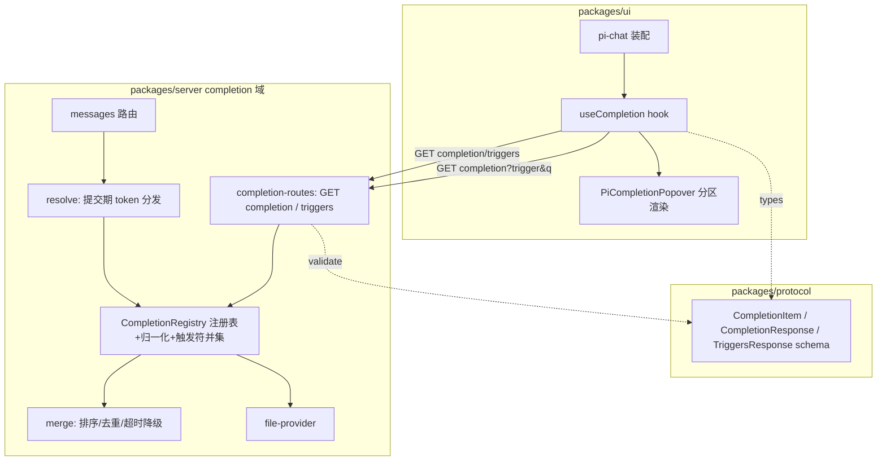
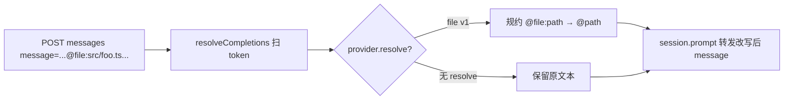

# Design Document — completion-provider-framework

## Overview
**Purpose**:为 pi-web 提供一个 LSP 式「触发符补全」框架。用户在会话输入框键入触发符(`@`/`/`/`$`…)时,系统经一个与资源类型无关的端点向服务端可插拔的 `CompletionProvider` 取候选,前端按 `kind` 分区渲染并支持选中插入带类型回环的 token;提交时按 token 的 `kind` 分发给对应 provider 的 `resolve` 使引用真正进入 agent 上下文。

**Users**:所有 pi-web 会话用户(获得跨 agent 通用的 `@` 引文件体验);平台开发者(以"加 provider"而非"加端点/改协议"扩展资源类型)。

**Impact**:在既有 REST+SSE handler 上新增 `completion` 域(注册表 + 通用端点 + `file` provider)、在 `pi-chat` 输入层新增 core 补全浮层、在 messages 路由新增提交期 token 解析。首个内置 provider 为 `file`(`@` 引用会话 cwd 文件),取代此前讨论中的专用 `/files` 端点。

### Goals
- 统一触发符补全:`/`、`@`、`$` 等以同一 `CompletionProvider` 契约接入。
- 新资源/触发符零端点、零协议改动(纯加 provider 注册)。
- 首个 `file` provider 达成 pi CLI 式 `@` 引文件,且安全限定在受信任 cwd。
- node + 浏览器双层 e2e 守门,不依赖付费 LLM。

### Non-Goals
- 跨 cwd/远程文件、目录递归预览。
- `user`/`env` provider 的真实生产后端(仅 mock 证明可扩展)。
- 3b-attach(扩 `PromptRequest` 加 `references` 字段的正式文件上下文通道)。
- 把现有 slash(`get_commands`)强拆为 provider。

## Boundary Commitments

### This Spec Owns
- `CompletionProvider` 契约、服务端注册表、触发符并集与归一化、合并/优先级/去重/降级算法。
- 通用端点:`GET /sessions/:id/completion`(候选)与 `GET /sessions/:id/completion/triggers`(活跃触发符 + 提取规则)。
- 内置 `file` provider(枚举/模糊/缓存/安全)。
- 前端 core 补全浮层(`PiCompletionPopover` + `useCompletion`)与 token 插入。
- 提交期 token 扫描与 `resolve` 分发(messages 路由接缝);v1 file.resolve 的文本规约。
- 共享 DTO(`packages/protocol`)。

### Out of Boundary
- 真实 `user`/`env` 数据源;3b-inline 文件内联与 3b-attach 协议扩展(留接缝,不实现)。
- 现有 slash `get_commands` 通道、webext `contributions.*` 的 ui-rpc 链(不改其实现,仅定义触发符让位规则)。
- 鉴权/trust 机制本体(复用)。

### Allowed Dependencies
- 既有会话 `header.cwd`、`requireSession`、鉴权上下文、project-trust 边界。
- 既有输入浮层交互思路(`pi-mention-popover`/`pi-autocomplete-popover`)。
- `packages/protocol` 共享类型;`packages/server` REST handler;`packages/ui` React。

### Revalidation Triggers
- `CompletionProvider`/`CompletionItem`/DTO 形状变化。
- 触发符让位规则(core vs webext)变化。
- `CompletionCtx` 字段(cwd/userId/sessionId)来源或语义变化。
- 提交期 resolve 由"文本直传"升级为"内联/附件"(影响 messages 路由与持久化语义)。

## Architecture

### Existing Architecture Analysis
- REST+SSE handler:`packages/server/src/http/create-handler.ts` 集中注册 `/sessions/:id/*` 路由;handler 持有 `SessionStore`,`requireSession(store, ctx)` 取活动会话。新增 completion 路由与注册表在 handler 构造期装配(单例)。
- 会话 cwd:`header.cwd` 持久化于 store;route 经会话记录解析,注入 `CompletionCtx`。
- 前端:`pi-chat.tsx` 组合输入区;现有 mention/autocomplete 浮层绑定 `extension.contributions.*` + `uiRpc`。新框架新增 core 浮层(绑 sessionId + 通用端点),与 webext 浮层按触发符让位共存。
- 依赖方向:`Types/DTO(protocol) → Registry/Providers(server) → Route(server) → useCompletion/Popover(ui) → pi-chat 装配`。

### Architecture Pattern & Boundary Map


**Architecture Integration**
- 选型:**Provider 注册表 + 与类型无关的查询端点**(LSP completion + triggerCharacters 心智)。
- 边界分离:provider 互不知晓,只经 `complete/resolve` 契约;合并/排序集中在 `merge`,前端只渲染。
- 保留模式:REST 路由风格、`requireSession`、protocol zod DTO、UI 受控输入浮层。
- 新组件理由:注册表(可插拔)、通用端点(零协议扩展)、file provider(首个实例)、core 浮层(平台级,不依赖 agent 声明)。

### Technology Stack
| Layer | Choice / Version | Role in Feature | Notes |
|-------|------------------|-----------------|-------|
| Frontend | React(packages/ui) | `useCompletion` + `PiCompletionPopover` + pi-chat 装配 | 复用受控 textarea 与现有浮层交互 |
| Backend | packages/server REST handler | 注册表 + completion 路由 + resolve 接缝 | 同 `/sessions/:id/*` 风格 |
| Contract | packages/protocol(zod) | 端点请求/响应 DTO 与共享类型 | UI/Server 共用 |
| Data | 会话 `header.cwd` + 文件系统 | file provider 枚举源 | TTL 内存缓存,realpath 边界 |
| Test | vitest(node-e2e)+ playwright | 端点离线 e2e + 浏览器 e2e | `NEXT_DIST_DIR=.next-e2e` 隔离 |

## File Structure Plan

### Directory Structure
```
packages/server/src/completion/
├── types.ts                  # CompletionProvider/Item/Ctx/Ref/ResolvedContext + TriggerSpec
├── registry.ts               # 注册、按规范 trigger 取 provider、触发符并集、归一化、超时调度
├── merge.ts                  # 合并:排序键(priority,score,label)+ kind 分组 + kind:id 去重
├── resolve.ts                # 提交期:扫描 token → 按 kind 分发 provider.resolve → 重写文本
├── normalize.ts              # 触发符等价字符归一(＠→@、￥→$ …)+ 别名表
├── token.ts                  # token 文法:序列化/解析 @kind:id(供 resolve 与前端约定一致)
└── providers/
    └── file-provider.ts      # file provider:glob cwd + gitignore + 缓存 + realpath 安全 + resolve

packages/server/src/http/routes/
└── completion-routes.ts      # makeCompletionHandler / makeCompletionTriggersHandler

packages/ui/src/completion/
├── use-completion.ts         # hook:取活跃触发符、按规则提取 token、查端点、缓存/防抖
├── extractors.ts             # 提取规则实现:wordTail(@/$)、lineStart(/)
└── pi-completion-popover.tsx # 分区候选浮层 + 键盘导航 + 选中插入 token

packages/protocol/src/transport/
└── completion-dto.ts         # CompletionItemSchema / CompletionResponseSchema / TriggersResponseSchema(或并入 rest-dto.ts)
```

### Modified Files
- `packages/server/src/http/create-handler.ts` — 构造 `CompletionRegistry`、注册内置 `file` provider、挂载 completion 两条路由。
- `packages/server/src/http/routes/<messages 路由>.ts` — prompt 转发前调用 `resolveCompletions(message, ctx)`(v1 文本规约)。
- `packages/server/src/session/pi-session.ts`(或 store 查询)— 暴露按 `:id` 取 `cwd` 的途径供 `CompletionCtx`。
- `packages/ui/src/chat/pi-chat.tsx` — 挂载 core `PiCompletionPopover`(绑 sessionId);对 core 已接管的触发符让位现有 webext mention 浮层。
- `packages/protocol/src/index.ts`、`packages/server/src/index.ts`、`packages/ui/src/index.ts` — 导出新公共类型/组件。
- `lib/app/pi-handler.ts`(可选)— 演示性追加注册 `user`/`env` mock provider(可放 examples 或 e2e fixture)。

## System Flows

### 补全查询(键入触发符)
```mermaid
sequenceDiagram
  participant U as 用户
  participant H as useCompletion(前端)
  participant R as completion-routes
  participant G as Registry
  participant P as providers(file/…)
  U->>H: 键入 "@fo"
  H->>H: 按 trigger 规则提取 token{query:"fo",range}
  H->>R: GET /sessions/:id/completion?trigger=@&q=fo
  R->>G: dispatch(normalize("@"), q, ctx{cwd,userId})
  G->>P: 并发 complete({query,ctx}) (per-provider 超时)
  P-->>G: CompletionItem[]
  G->>G: merge: 排序+分组+去重+降级
  G-->>R: {items, groups}
  R-->>H: 候选
  H->>U: 分区浮层渲染;选中→插入 "@file:src/foo.ts "
```

### 提交期解析(v1 文本直传)

说明:v1 不读文件内容(3a),仅规约 token 文本使真实 agent 凭路径自行 read;为 v2(服务端内联)预留同一接缝。

## Requirements Traceability
| Requirement | Summary | Components | Interfaces | Flows |
|-------------|---------|------------|------------|-------|
| 1.1–1.5 | provider 契约/注册/ctx/resolve 缺省 | types, registry | `CompletionProvider`, `register` | 查询/解析 |
| 2.1–2.4 | 触发符并集/归一/提取规则 | registry, normalize, extractors | `TriggersResponse`, `extract` | 查询 |
| 3.1–3.5 | 通用端点/鉴权/空集 | completion-routes | API 契约 | 查询 |
| 4.1–4.4 | 合并/优先级/去重/降级 | merge | `mergeCompletions` | 查询 |
| 5.1–5.5 | file 枚举/模糊/gitignore/缓存/截断 | file-provider | `CompletionProvider(file)` | 查询 |
| 6.1–6.4 | realpath 边界/symlink/大小/鉴权 | file-provider, completion-routes | 安全断言 | 查询/解析 |
| 7.1–7.6 | core 浮层/分区/插入/互斥/收敛 | use-completion, pi-completion-popover, pi-chat | hook + 组件 props | 查询 |
| 8.1–8.4 | 提交期 resolve/直传/容错/回归 | resolve, messages 路由 | `resolveCompletions` | 解析 |
| 9.1–9.3 | 加 provider 即生效/共存/单 trigger | registry | `register` | 查询 |
| 10.1–10.4 | node+浏览器 e2e/回归 | tests | — | 全链 |

## Components and Interfaces

| Component | Layer | Intent | Req | Key Deps | Contracts |
|-----------|-------|--------|-----|----------|-----------|
| types | protocol/server | provider/item/ctx 契约 | 1,2 | — | State/Service |
| CompletionRegistry | server | 注册/分发/归一/触发符并集/超时 | 1,2,3,4,9 | providers | Service |
| mergeCompletions | server | 排序/分组/去重/降级 | 4 | — | Service |
| file-provider | server | 枚举 cwd+安全+缓存+resolve | 5,6,8 | fs, cwd | Service |
| completion-routes | server | 两条 GET 端点 | 2,3,6 | registry, store | API |
| resolveCompletions | server | 提交期 token 分发 | 8 | registry | Service |
| useCompletion | ui | 触发检测/查端点/防抖 | 2,7 | endpoint | State |
| PiCompletionPopover | ui | 分区渲染/键盘/插入 | 7 | useCompletion | State |

### Server 域

#### CompletionProvider / 核心类型
```typescript
export interface CompletionCtx {
  readonly sessionId: string;
  readonly cwd: string;
  readonly userId: string;
}
export interface CompletionItem {
  readonly providerId: string;
  readonly kind: string;          // "file" | "user" | "command" | ...
  readonly id: string;            // provider 内唯一(用于去重/回环)
  readonly label: string;         // 展示
  readonly detail?: string;       // 次要说明
  readonly insertText?: string;   // 缺省=序列化 token(见 token.ts)
  readonly score?: number;        // provider 相关性(默认 0)
  readonly sortText?: string;     // 可选稳定排序键
}
export interface CompletionRef { readonly kind: string; readonly id: string; readonly raw: string; }
export interface ResolvedContext { readonly text: string; }  // v1:替换 token 的文本
export interface CompletionProvider {
  readonly id: string;
  readonly trigger: string;       // 单一规范触发符(注册时校验单字符)
  readonly kind?: string;         // 缺省=id
  readonly priority?: number;     // 默认 0;越大越靠前
  complete(args: { query: string; ctx: CompletionCtx }): Promise<readonly CompletionItem[]>;
  resolve?(ref: CompletionRef, ctx: CompletionCtx): Promise<ResolvedContext | null>;
}
export interface TriggerSpec { readonly trigger: string; readonly extract: "wordTail" | "lineStart"; }
```

#### CompletionRegistry
| Field | Detail |
|-------|--------|
| Intent | 注册 provider、归一化触发符、按 trigger 并发分发、超时降级、提供活跃触发符集 |
| Requirements | 1.2,1.3,2.1,2.2,2.3,3.1,3.4,4.3,9.1,9.3 |

```typescript
export interface CompletionRegistry {
  register(p: CompletionProvider): void;               // 同 id 覆盖+告警(1.3);校验 trigger 单字符(9.3)
  triggers(): readonly TriggerSpec[];                  // 已注册 trigger 并集(2.1,2.2)
  query(rawTrigger: string, q: string, ctx: CompletionCtx): Promise<CompletionResponse>; // 归一(2.3)+分发+merge
}
```
- Preconditions:`query` 传入的 `rawTrigger` 可为等价形态,内部 `normalize` 为规范符。
- Postconditions:返回已排序、分组、去重、截断的候选;无匹配 provider → 空集不抛(3.4)。
- Invariants:provider 仅见规范触发符与注入的 `ctx`。

#### mergeCompletions(4.x)
```typescript
export function mergeCompletions(
  groups: ReadonlyArray<{ provider: CompletionProvider; items: readonly CompletionItem[] }>,
  opts: { limit: number },
): CompletionResponse;
```
- 排序键:`(priority desc, score desc, label asc)`;按 `kind` 产出 `groups`(区序=最高 priority 成员);同 `kind:id` 去重保高 priority;`limit` 截断。

#### file-provider(5.x/6.x/8.x)
- `complete`:取 `ctx.cwd` → 懒建带 TTL 的相对路径清单(尊重 `.gitignore`,跳过 `node_modules/.git/.next*/dist`,walk 上限,超限截断标示)→ 对 `query` 模糊匹配排序 → top-K `CompletionItem{kind:"file"}`。
- `resolve`(v1):`@file:<rel>` → `{ text: "@" + rel }`。安全:realpath(join(cwd, rel)) 前缀必须 === realpath(cwd),否则返回 `null`(6.1/6.2);(v2 读文件时)单文件 ≤ 上限(6.3)。
- 缓存键:`cwd`;TTL ~5s;并发查询复用。

#### completion-routes
##### API Contract
| Method | Endpoint | Request | Response | Errors |
|--------|----------|---------|----------|--------|
| GET | `/sessions/:id/completion/triggers` | — | `{ triggers: TriggerSpec[] }` | 401/404 |
| GET | `/sessions/:id/completion?trigger=&q=` | query 参数 | `CompletionResponse {items, groups}` | 400/401/404 |
- 由 `requireSession` + 鉴权解析会话;`CompletionCtx.cwd` 来自会话 `header.cwd`,`userId` 来自鉴权上下文(3.3/3.5/6.4)。
- `trigger` 缺失/未知 → 空 items(3.4);`:id` 不存在/越权 → 404/401(3.3)。

#### resolveCompletions(8.x)
```typescript
export function resolveCompletions(message: string, ctx: CompletionCtx, reg: CompletionRegistry): Promise<string>;
```
- 扫描 `@kind:id`(及其他 trigger 的 token 文法,见 `token.ts`)→ 对每 token 取对应 kind 的 provider `resolve` → 用返回 `text` 替换;无 provider/`resolve` 失败 → 保留原文本(8.3);无 token → 原样返回(8.4)。messages 路由在 `session.prompt` 前调用。

### UI 域

#### useCompletion / PiCompletionPopover(7.x)
```typescript
export interface UseCompletionArgs { sessionId: string; value: string; cursor: number; }
export interface UseCompletionResult {
  open: boolean;
  groups: ReadonlyArray<{ kind: string; items: readonly CompletionItem[] }>;
  activeRange: { start: number; end: number } | null;   // token 替换区间
  accept(item: CompletionItem): { nextValue: string; nextCursor: number };
}
```
- 启动:挂载时 `GET …/completion/triggers` 获活跃触发符 + 提取规则(7.1,2.2);键入时按当前触发符的 `extractors[rule]` 算 token{query,range};防抖后 `GET …/completion?trigger=&q=`。
- `accept`:用 `item.insertText ?? serializeToken(item)` 替换 `activeRange` 并补尾随空格(7.4)。
- 互斥:`/`、`@`、`$` 浮层同一时刻只开其一(由提取规则与光标位置裁决)(7.5)。
- 收敛:请求失败/空集 → 不开浮层、不抛、不阻塞(7.6)。
- pi-chat 装配:core 浮层始终挂载(知道 sessionId);对 core 已接管触发符,抑制现有 webext mention 浮层(D-6,7.1)。

## Data Models

### Data Contracts(protocol,zod)
```typescript
export const CompletionItemSchema = z.object({
  providerId: z.string(), kind: z.string(), id: z.string(), label: z.string(),
  detail: z.string().optional(), insertText: z.string().optional(),
  score: z.number().optional(), sortText: z.string().optional(),
});
export const CompletionResponseSchema = z.object({
  items: z.array(CompletionItemSchema),
  groups: z.array(z.object({ kind: z.string(), count: z.number() })),
});
export const TriggersResponseSchema = z.object({
  triggers: z.array(z.object({ trigger: z.string(), extract: z.enum(["wordTail","lineStart"]) })),
});
```

### Token 文法(`token.ts`,前后端一致)
- 序列化:`serializeToken(item) = `${item.trigger?}${kind}:${id}``;v1 file 用 `@file:<relpath>`。
- 解析(resolve 端):正则按各 trigger 的提取规则匹配 `@<kind>:<id>` / `/<cmd>` / `$<kind>:<id>`;无法识别的 `@word` 视为普通文本不动。

## Error Handling
### Error Strategy
- **User(4xx)**:未知 trigger/空 q → 返回空集(非错误);`:id` 越权/不存在 → 401/404 且不泄露文件信息(3.3/6.4)。
- **System(5xx)**:provider 抛错/超时 → 在 merge 层吞掉该 provider、返回其余(4.3);端点整体异常 → `mapEngineError` 统一映射。
- **Resolve**:单 token resolve 失败 → 保留原文本、继续其余(8.3);整体 resolve 异常 → 回退原 message(不阻断发送,8.4)。

### Monitoring
- registry 记录:provider 超时/抛错计数;file walk 截断事件;path-escape 拒绝事件(安全审计)。

## Testing Strategy

### Unit Tests
- `mergeCompletions`:排序键(priority>score>label)、`kind:id` 去重保高 priority、limit 截断、空输入。
- `normalize`:＠→@、￥→$、未知符原样。
- `file-provider`:gitignore/跳过目录、模糊排序、缓存命中、walk 截断标示。
- `resolveCompletions`:`@file:path`→`@path`、无 token 原样、未知 token 保留、resolve 抛错容错。
- 安全:realpath 前缀断言拒绝 `../escape` 与 symlink 逃逸(6.1/6.2)。

### Integration / Node E2E(仿 `e2e/node/webext-uirpc.e2e.test.ts`)
- 经真实 `createPiWebHandler` 建会话(cwd=fixture 目录)→ `GET /sessions/:id/completion/triggers` 含 `@`。
- `GET /sessions/:id/completion?trigger=@&q=<>` 返回 fixture 内文件、按 q 收敛。
- **路径穿越被拒**:构造 `../` 与 symlink fixture,断言不出现在候选、resolve 返回拒绝。
- 鉴权:无权访问会话 → 401/404。

### Browser E2E(仿 `e2e/browser/webext-full.e2e.ts`,`NEXT_DIST_DIR=.next-e2e`)
- 进入会话输入框键入 `@` → 出现文件候选浮层(`data-pi-completion-popover`,按 kind 分区)。
- 选中一条 → 输入框被插入 `@file:<相对路径> `。
- 回归:不破坏现有 slash(`/` 仍弹命令)、webext mention(非 core 接管触发符)与无 token 普通发送。

## Security Considerations
- 文件枚举与(v2)读取严格限定 realpath 在 `ctx.cwd` 内;拒绝 `../`/symlink 逃逸(6.1/6.2)。
- 端点仅服务鉴权通过且拥有该会话者;复用 project-trust 边界,仅受信任 cwd(3.5/6.4)。
- (v2)单文件读取大小上限,超限不内联并标示(6.3)。

## Performance & Scalability
- file 清单 TTL 内存缓存(键=cwd)+ walk 上限 + 候选 top-K,避免每 keystroke 全树遍历(5.4/5.5/R-1)。
- 前端防抖;端点 per-provider 超时,慢 provider 不阻塞整体(4.3/R-3)。

---

## 增强:file provider 可配置 includes / excludes / glob(已实现)

> 讨论结论:**不引入 `root`**。cwd 内子目录用 `includes:["src/**"]` 即可表达且性能等价(walker 目录级剪枝);`root` 唯一独有能力是指向 cwd 之外——正是高危项。去掉 root 同时消除了"外部根 trust 门控"与"root 相对↔cwd 相对路径转换"两处复杂度,路径**始终 cwd 相对**,token/resolve 天然正确。指向外部资源应做成**独立 provider**(自带受信任来源),而非给 file provider 开绕过 cwd 的口子。

### 配置(`FileProviderOptions` 新增,全部可选,默认=原行为)
| 字段 | 含义 | 默认 |
|---|---|---|
| `includes?: string[]` | 正向 glob(cwd 相对),文件须命中 ≥1 条 | 全部允许 |
| `excludes?: string[]` | 反向 glob(cwd 相对),命中即剔除 | 无 |
| `respectGitignore?: boolean` | 是否尊重 cwd 的 .gitignore | true |
| `id?/trigger?/kind?` | 覆盖,供注册多个 file provider(不同目录/触发符) | file/@/file |

### glob 引擎
零依赖自研 `completion/glob.ts`(`compileGlobs`):glob→RegExp,支持 `**`(跨目录;作目录前缀为零或多层)、`*`(段内)、`?`、`{a,b}`。统一替代正/反向匹配(.gitignore 仍用既有近似 matcher)。选型理由:picomatch 无自带类型且需装包;需求子集小,自研可控且与既有自包含风格一致。

### 过滤管线(优先级 高→低)
内置重目录跳过(dir 级剪枝) > `excludes`(dir 级亦剪枝) > `.gitignore`(可关) > `includes`。安全门(realpath 前缀,基准始终 cwd)与 symlink 不跟随不变;候选/插入路径恒 cwd 相对。

### 多目录共存(框架原生)
注册多个 file provider 即可,合并/优先级/去重由 registry+merge 处理,零端点改动:
```ts
register(createFileProvider());                                   // @ → cwd 全量
register(createFileProvider({ id:"src", kind:"src", includes:["src/**/*.ts"], excludes:["**/*.test.ts"] }));
register(createFileProvider({ id:"docs", trigger:"#", kind:"docs", includes:["**/*.md"] })); // # → 文档
```

### 测试(已加)
`compileGlobs`(`**/*.ts`/`src/**`/顶层 `*.json`/`{a,b}`/空→null);file provider(includes 仅 ts + excludes 剔 test、excludes 胜 includes、respectGitignore=false 放行、id/trigger/kind 覆盖产出新 kind 与 `#docs:b.md` token)。server 全套 519 通过,默认行为零回归。
