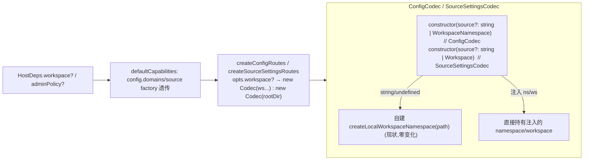

# Design — `config-workspace-injection`（config 工厂 Workspace 注入接缝）

## Overview
给 `config.domains`（`ConfigCodec`）与 `config.source`（`SourceSettingsCodec`）两个**已在
`WorkspaceNamespace` 语义上**的 codec 加向后兼容的 Workspace 注入口，并经路由工厂 `workspace?` opt +
`HostDeps.workspace?`/`adminPolicy?` 透传，使云端能注入 `TenantWorkspace` 承载 config 域读写。契约 §8.1 C3 前置。

**首刀只做两个 codec**（读写体已只依赖 `WorkspaceNamespace`，注入是构造重载的小增量）；三个裸 fs 工厂
（mcp/sandboxProject/extensions）不在本 spec。

### Goals / Non-Goals
- Goal：两 codec 接注入、两路由工厂加 `workspace?`、`HostDeps` 加 `workspace?`/`adminPolicy?`、内存 Workspace 等价测试、发 0.5.3。
- Non-Goal：三个 fs 工厂重构；adminPolicy 的**具体**实现（云端 role-based 在 pi-clouds C3 侧）；改冻结 id / 升 v2。

## Boundary Commitments
- **Owns**：`config/config-codec.ts`、`config/source-settings-codec.ts` 的构造注入分支；`config/config-routes.ts`、
  `config/source-settings-routes.ts` 的 `workspace?` opt；`host-assembly/default-capabilities.ts` 的 `HostDeps`
  字段 + config.domains/source 绑定。
- **Out**：三个 fs 工厂；ConfigDomainRegistry（§6 P4）；desktop 装配改动（可继续用 rootDir）。
- **Allowed deps**：`workspace/` 端口（`Workspace`/`WorkspaceNamespace`/`createLocalWorkspaceNamespace`）。
- **Revalidation**：加可选成员=向后兼容（§1），不升 v2、不碰 §5.3 冻结 id；desktop 不传注入即零改动。

## Architecture

### 注入机制（两 codec）

### 关键设计点
1. **`ConfigCodec`**：构造签名 `(source?: string | WorkspaceNamespace)`。判别：`source` 为对象且有 `readJson` 方法 → 注入的 namespace（直接赋 `this.ns`）；否则（string/undefined）→ 现状 `createLocalWorkspaceNamespace(source ?? resolveDefaultRoot())`。`load`/`save` 体**不动**（已只用 `this.ns`）。
2. **`SourceSettingsCodec`**：构造签名 `(source?: string | Workspace)`。注入 `Workspace` 时存 `this.workspace`；`nsAndKey`：`source`→`this.workspace.user`、`project`→`this.workspace.project`（**注入时 project scope 不再要求 cwd**——注入的 project 根即目标）。未注入时走现状 `createLocalWorkspaceNamespace(agentDir/join(cwd,".pi"))`。`assertSourceKeyShape` 两分支都强制。
3. **路由工厂**：`createConfigRoutes` opts 加 `workspace?: Workspace`；`const codec = opts.workspace ? new ConfigCodec(opts.workspace.user) : new ConfigCodec(opts.rootDir)`。`createSourceSettingsRoutes` 同理 `new SourceSettingsCodec(opts.workspace ?? opts.rootDir)`（union 直接透传）。
4. **HostDeps + defaultCapabilities**：`HostDeps` 加 `readonly workspace?: Workspace` 与 `readonly adminPolicy?: ConfigAdminPolicy`。`defaultCapabilities` 的 config.domains/source factory 增 `...(d.workspace ? { workspace: d.workspace } : {})` 与 `...(d.adminPolicy ? { adminPolicy: d.adminPolicy } : {})` 透传。**顺序/ id 集不动**。
   > 判别式（是否注入）用「有 `readJson`/双根」结构探测；因 `Workspace` 与路径字符串类型不相交，`typeof === "string"` 即足够区分（更简单、无歧义）。采用 `typeof source === "string" || source === undefined` → 路径分支。

## File Structure Plan
### Modified
- `packages/server/src/config/config-codec.ts` — 构造 `(source?: string | WorkspaceNamespace)`；注入分支。
- `packages/server/src/config/source-settings-codec.ts` — 构造 `(source?: string | Workspace)`；`nsAndKey` 注入分支。
- `packages/server/src/config/config-routes.ts` — opts `workspace?`；codec 构造二选一。
- `packages/server/src/config/source-settings-routes.ts` — opts `workspace?`；codec 构造二选一。
- `packages/server/src/host-assembly/default-capabilities.ts` — `HostDeps.workspace?/adminPolicy?` + config.domains/source 绑定透传。
- `packages/server/package.json` — version 0.5.2 → 0.5.3。
### New tests
- `packages/server/test/config/config-codec.workspace-injection.test.ts`
- `packages/server/test/config/source-settings-codec.workspace-injection.test.ts`
- （路由注入分支可并入既有 `config-routes.test.ts` / `source-settings-routes.test.ts` 或新增）

## Requirements Traceability
| Req | 覆盖 |
|-----|------|
| 1.1-1.4 ConfigCodec 注入 | config-codec.ts 构造分支 + 等价测试 |
| 2.1-2.5 SourceSettingsCodec 注入 | source-settings-codec.ts nsAndKey 分支 + 等价测试 |
| 3.1-3.3 路由 workspace? opt | config-routes.ts / source-settings-routes.ts |
| 4.1-4.3 HostDeps/defaultCapabilities | default-capabilities.ts |
| 5.1-5.3 测试 + 发版 | 两个注入测试 + 无回归 + 0.5.3 |

## Testing Strategy
1. **codec 等价（Req 1.4/2.x/5.1）**：内存 `Workspace`（`createMemoryWorkspace` 样板，见 `test/workspace/conformance-memory.test.ts`）注入 `ConfigCodec`/`SourceSettingsCodec`，跑与 rootDir 分支相同的用例集（缺键→`{}`、deepMerge、`merge:false` 覆盖删除、损坏→降级 `{}`、双根隔离/键正确），断言两分支结果一致。
2. **路由注入（Req 3/5.2）**：`createConfigRoutes({ workspace })` 的 GET/PUT `/config/:domain` 往返；`createSourceSettingsRoutes({ workspace })` 的 source/project scope 往返（内存 workspace，不碰真实 fs）。
3. **无回归 + 装配守卫（Req 4.3/5.3）**：`default-capabilities.test.ts`（id 集不变）+ 既有 config 测试全绿；`pnpm --filter @blksails/pi-web-server test` + `typecheck`。
4. **发版（Req 5.3）**：bump 0.5.3，`pnpm publish`。
