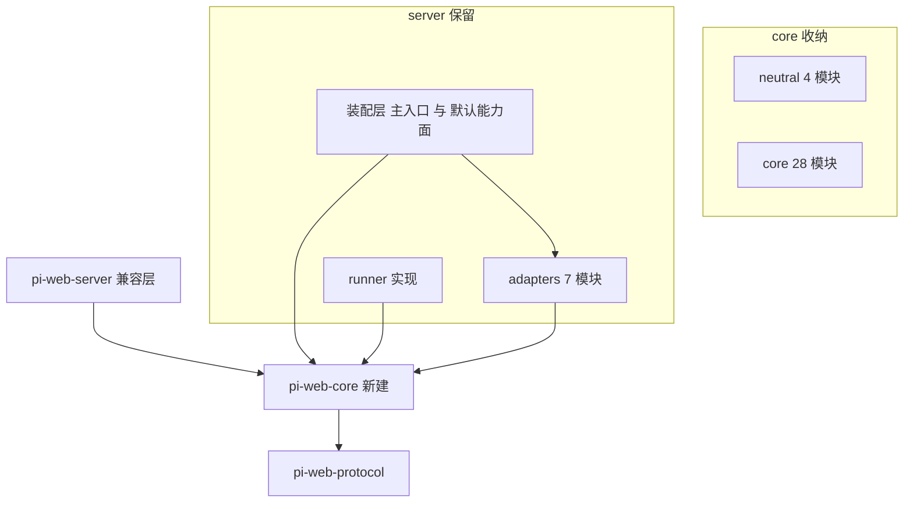
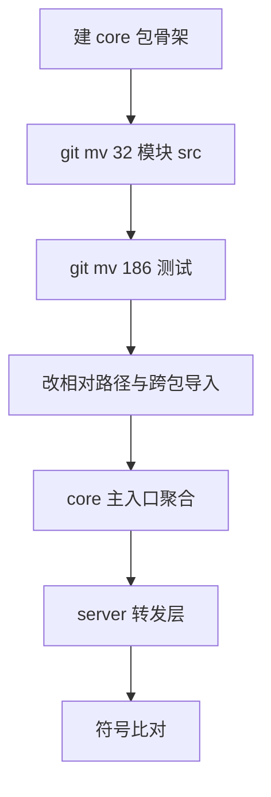
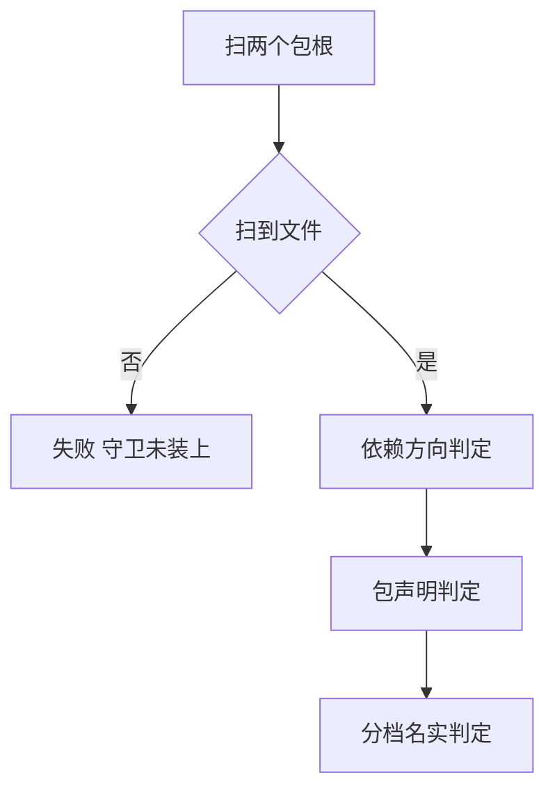
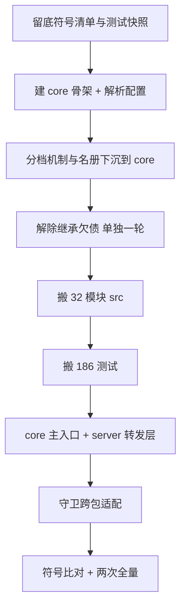

# Design Document — core-package-extraction

## Overview

**Purpose**：新建 `@blksails/pi-web-core`，把权威名册中 neutral + core 的 **32 个模块
（182 个 src 文件 + 186 个测试文件）** 搬进去；`@blksails/pi-web-server` 降为**兼容 re-export 层**，
保留装配层（主入口聚合模块 + 默认能力面清单）、runner 实现与 adapters。

**Users**：pi-clouds 云端、desktop 与未来的 edge 宿主 —— 切开后它们不再被迫安装云沙箱 SDK
与数据库驱动。

**Impact**：`packages/server` 从 283 个测试文件降到 97 个；新包承接 186 个。
对外导出符号集合**逐字不变**（313 个），既有消费方零改动。

### Goals

- core 包成立，依赖声明不含 HTTP 框架 / 云沙箱 SDK / 数据库驱动 / MCP SDK / 包注册表客户端
- 兼容层 6 个子路径导出一个不减，主入口符号集合 313 → 313
- 继承的 `model-catalog → ai-gateway` 欠债解除
- 两个既有守卫跨包后仍然有效，且扫不到文件时**失败而非静默通过**
- 通过面不低于快照（283 / 2547）且连续两次一致；快档仍 < 10 s

### Non-Goals

- runner 实现与 adapters 的搬迁（后续两个 spec）
- 宿主装配层、CLI、desktop、UI 包的结构性改动（解除欠债所需的装配点改动除外）
- 任何模块的功能性改写
- core 包"干净到可独立发布"—— runner/adapters 仍在旧包，完整三包形态要等后两个 spec

---

## Boundary Commitments

### This Spec Owns

- `@blksails/pi-web-core` 包的骨架、导出面与依赖声明
- 32 个模块及其测试的物理位置
- `@blksails/pi-web-server` 的兼容转发层
- 继承欠债的注入改造
- 两个守卫的跨包适配与其归属位置
- 全仓解析配置（workspace 成员、根测试 alias）

### Out of Boundary

- runner 实现、adapters 的位置（仍在 `packages/server`）
- 装配层模块（主入口聚合模块 + 默认能力面清单）—— **刻意留在兼容层包**
- 被搬模块的内部实现（只改位置与导入路径）
- 宿主契约 v1

### Allowed Dependencies

- 仓内既有包；`node:` 内建；`zod`；`@blksails/pi-web-{protocol,logger,tool-kit,agent-kit}`
- core 对 agent 运行时 SDK 仅 **peer + 类型引用**
- **不引入任何新的第三方依赖**

### Revalidation Triggers

- 权威名册（`module-roster.ts`）的层归属变更
- core 或兼容层的导出面变更
- 守卫的扫描根路径变更
- 后续两个提取 spec 移动 runner / adapters 时

---

## Architecture

### Existing Architecture Analysis

- 全仓**源码直连**：`packages/*/package.json` 的 `exports` 指向 `./src/*.ts`，无构建步骤。
  新包照此办理即可被本仓消费（R1.5）。
- `tsconfig.base.json` **没有 `paths`** —— TS 走 pnpm workspace 链接解析。
  故新包只需进 `pnpm-workspace.yaml`（已覆盖 `packages/*`）+ `pnpm install`。
- 根 `vitest.config.ts` 用**显式 alias** 把 `@blksails/pi-web-*` 解析到源码，
  **不读 tsconfig paths** —— 新包必须同步加 alias，否则根 `test/` 静默解析失败。
- `packages/server` 现有 6 个子路径导出：`.` / `./trust` / `./model-options` /
  `./vision-model-options` / `./testing` / `./host-assembly`。
  前 5 个的实现都会搬进 core，第 6 个（装配层）留下。

### Architecture Pattern & Boundary Map



**Architecture Integration**：

- **Selected pattern**：源码直连的 workspace 包 + 兼容层纯转发。
- **Dependency direction**：`protocol ← core ← {runner, adapters} ← assembly`。
  装配层同时引用 core 与 adapters —— 那是它的职责，由守卫的 `assembly` 层序表达。
- **Existing patterns preserved**：包骨架照 `protocol` 包的形态（`exports` 指源码、
  `files: ["src"]`、`publishConfig.access: public`）。

### Technology Stack

| Layer | Choice / Version | Role | Notes |
|---|---|---|---|
| 包管理 | pnpm 9.12 workspace（既有） | 新包成员与解析 | `packages/*` 通配已覆盖 |
| 语言 | TypeScript strict（既有） | 源码直连导出 | 无构建步骤 |
| 测试 | vitest 2.1.9（既有） | 两包各自四档 | 分档机制沿用上游 spec |

**不新增任何第三方依赖。**

---

## File Structure Plan

### Directory Structure

```
packages/
├── core/                                  # 新建
│   ├── package.json                       # exports 5 子路径;禁依赖不得出现
│   ├── tsconfig.json
│   ├── vitest.workspace.ts                # 四档,与 server 同形
│   ├── scripts/run-tests.mjs              # 三相编排,与 server 同形
│   ├── src/                               # 迁入 32 模块(182 文件)
│   │   ├── index.ts                       # core 主入口(新写:只聚合 core 模块)
│   │   ├── {source-key,host-contract-version,template-name,model-provider-names}.ts
│   │   ├── {parent-watchdog,runner-bootstrap-path}.ts
│   │   └── <28 个 core 模块目录>/
│   └── test/                              # 迁入 186 个测试
│       ├── setup/{fast-sentinel,child-process-guard}.ts   # 迁入:分档机制下沉到 core
│       └── tiering/{tier-rules,module-roster,tier-guard,dependency-guard,...}
└── server/                                # 降为兼容层
    ├── package.json                       # exports 6 子路径不变;新增 core 依赖
    ├── vitest.workspace.ts                # 引用 ../core/test/setup/*(方向正确)
    └── src/
        ├── index.ts                       # 改:re-export core + 本地装配/adapters 符号
        ├── host-assembly/                 # 留(装配层)
        ├── runner/                        # 留(后续 spec 搬)
        └── <7 个 adapters 模块>/           # 留(后续 spec 搬)
```

### Modified Files

- `packages/server/src/index.ts` —— 改为 `export * from "@blksails/pi-web-core"` + 本地符号。
- `packages/server/package.json` —— 新增 `@blksails/pi-web-core` 依赖；
  `exports` 的 5 个子路径改为转发文件（薄 re-export），`./host-assembly` 不变。
- `packages/server/vitest.workspace.ts` / `scripts/run-tests.mjs` —— 分档配置引用 core 的共享 setup。
- `packages/server/src/model-catalog/…` → 随模块搬入 core；其对网关的值依赖改注入（见组件章）。
- `lib/app/pi-handler.ts` —— 装配点补传网关合并能力（解除欠债的唯一外部改动）。
- 根 `vitest.config.ts` —— 新增 `@blksails/pi-web-core` alias（**子路径必须排在裸包名之前**）。
- `packages/server/test/**` —— 186 个测试文件迁入 core 并改相对路径深度。

---

## Requirements Traceability

| Requirement | Summary | Components | Interfaces | Flows |
|---|---|---|---|---|
| 1.1 | core 含名册全部 neutral+core 模块 | core 包骨架 + 迁移 | 名册 | 搬迁流 |
| 1.2 | 依赖声明不含被禁依赖 | core package.json | 依赖名册 | 守卫流 |
| 1.3 | agent SDK 仅 peer + 类型 | core package.json | peer 声明 | 守卫流 |
| 1.4 | 违禁依赖 → 守卫失败并指名 | 包依赖守卫 | 错误消息契约 | 守卫流 |
| 1.5 | 无需预构建即可消费 | core exports 指源码 | `exports` | — |
| 2.1 | 兼容层子路径一个不减 | server package.json | 6 子路径 | — |
| 2.2 | 主入口符号逐字相同 | 符号比对测试 | 符号清单 | 符号比对流 |
| 2.3 | 装配层留在兼容层包 | 名册 assembly 层 | — | — |
| 2.4 | 刻意缺口不得补全 | server/src/index.ts | 逐条核对 | 符号比对流 |
| 2.5 | 消费方导入路径不变 | 兼容层 | — | — |
| 3.1 | 模型目录不值导入网关 | ModelCatalogServiceDeps | 注入契约 | 注入流 |
| 3.2 | 经既有注入结构获得 | ModelCatalogServiceDeps | 注入契约 | 注入流 |
| 3.3 | 未注入时行为一致 | 模型目录服务 | — | 注入流 |
| 3.4 | 欠债表不再列出它 | KNOWN_DEBT | — | 守卫流 |
| 4.1 | 依赖守卫覆盖两包每个模块 | dependency-guard | 扫描根 | 守卫流 |
| 4.2 | 分档守卫覆盖两包每个测试 | tier-guard | 扫描根 | 守卫流 |
| 4.3 | 扫不到文件即失败 | 两个守卫 | 非空断言 | 守卫流 |
| 4.4 | 跨包反向依赖 → 失败并指名 | dependency-guard | 错误消息契约 | 守卫流 |
| 5.1 | 通过面不低于快照且两次一致 | 全部 | — | 回归比对 |
| 5.2 | 类型检查通过 | 全部 | — | — |
| 5.3 | 全仓解析配置同步 | 根 vitest alias | alias 顺序 | — |
| 5.4 | 交付含实测输出 | 验收流程 | — | — |
| 5.5 | 快档仍 < 10 s | 两包分档配置 | — | — |

---

## Components and Interfaces

| Component | Layer | Intent | Req | Key Deps | Contracts |
|---|---|---|---|---|---|
| core 包骨架 | 构建 | 源码直连的新 workspace 包 | 1.1, 1.5, 5.3 | pnpm workspace (P0) | State |
| core 主入口 | core | 只聚合 core 模块的导出面 | 1.1, 2.2 | 32 模块 (P0) | Service |
| 兼容转发层 | assembly | 保住既有导出面 | 2.1–2.5 | core (P0) | Service |
| 包依赖守卫 | 守卫 | 断言 core 依赖声明干净 | 1.2, 1.4 | node:fs (P0) | Service |
| 符号比对测试 | 守卫 | 断言主入口符号集合不变 | 2.2, 2.4 | jiti (P0) | Service |
| 模型目录注入 | core | 解除继承欠债 | 3.1–3.4 | 装配点 (P0) | Service |
| 跨包守卫适配 | 守卫 | 两个既有守卫扫两包 | 4.1–4.4 | 名册 (P0) | Service |

### 守卫层

#### 包依赖守卫

| Field | Detail |
|-------|--------|
| Intent | 断言 core 的依赖声明不含被禁项，且 agent SDK 仅为 peer |
| Requirements | 1.2, 1.4 |

**Contracts**: Service [x]

##### Service Interface

```typescript
/** core 包**声明层**禁止出现的依赖(dependencies / devDependencies 均查)。 */
export const FORBIDDEN_PACKAGE_DEPS: readonly string[];

/** 读取包声明并返回违规项(含出现在哪个字段)。纯函数,入参是已解析的 package.json 对象。 */
export function auditPackageDeps(pkg: {
  readonly dependencies?: Readonly<Record<string, string>>;
  readonly devDependencies?: Readonly<Record<string, string>>;
  readonly peerDependencies?: Readonly<Record<string, string>>;
}): readonly { readonly name: string; readonly field: string }[];
```

- Postconditions：返回空数组 ⟺ 声明层干净。
- ★ 与依赖方向守卫**分工不同**：那个查**源码 import**，这个查**包声明**。
  两者缺一不可 —— 源码干净但 package.json 里挂着 `e2b`，消费方照样得装。

**Implementation Notes**

- Risks：`devDependencies` 也要查 —— 一个只在测试里用的重依赖同样会进消费方的安装图
  （若被误列为 dependency）。故两个字段都扫，`peerDependencies` 单独判（agent SDK 允许）。

#### 符号比对测试

| Field | Detail |
|-------|--------|
| Intent | 把上一 spec 用过的一次性符号 diff 固化为**常驻测试** |
| Requirements | 2.2, 2.4 |

**Contracts**: Service [x]

**Implementation Notes**

- Integration：加载兼容层主入口，取导出键排序，与**留底的基线清单**比对。
- ★ 基线清单以文件形式入库（`packages/server/test/compat/main-entry-symbols.txt`），
  改动它必须是**有意的**动作，会出现在 diff 里。这正是 R2.4「刻意缺口不得补全」的执行方式：
  补全会让符号数增加，测试立刻红。
- Risks：该测试需加载真实模块（会拉起 pi SDK 传递依赖），故归 **it 档**而非快档。

#### 跨包守卫适配

| Field | Detail |
|-------|--------|
| Intent | 依赖方向守卫与分档守卫在拆包后覆盖两个包 |
| Requirements | 4.1–4.4 |

**Implementation Notes**

- **归属**：分档机制（`tier-rules` / `fast-sentinel` / `child-process-guard`）与
  名册（`module-roster`）**下沉到 core** —— core 是更低的包，server 引用它方向正确。
- **扫描根**：两个守卫改为接收「包根列表」，默认 `[core, server]`。
- ★ **R4.3 是本组件最关键的一条**：守卫扫不到文件时必须**失败**。
  上游 spec 已经在哨兵上吃过两次亏 —— **没装上的守卫报出的绿，和真的没有违规长得一模一样**。
  故两个守卫都要断言「扫描到的文件数 > 0」且「每个包根都至少贡献一个文件」。

### core 层

#### 模型目录注入（解除继承欠债）

| Field | Detail |
|-------|--------|
| Intent | 模型目录服务不再值导入网关适配器 |
| Requirements | 3.1–3.4 |

**Contracts**: Service [x]

##### Service Interface

```typescript
/** 网关目录与 self 目录的合并能力。由装配层注入;未注入 = 网关套件未启用。 */
export type MergeModelCatalog = (
  selfEntries: readonly ModelOption[],
  gatewayEntries: readonly GatewayModelEntry[],
  precedence?: ModelPrecedence,
) => ModelOptions;

export interface ModelCatalogServiceDeps {
  // …既有字段…
  /** 未注入时,服务表现为「网关套件未启用」——与改动前逐字节一致。 */
  readonly mergeCatalog?: MergeModelCatalog;
}
```

- Preconditions：注入了 `gatewayChat` 时**必须**同时注入 `mergeCatalog`。
- Postconditions：两者皆未注入 ⟹ 输出与改动前逐字节相同（R3.3）。
- ★ 两个纯类型（`GatewayModelEntry` / `ModelPrecedence`）随契约进 core；
  网关适配器从 core 引入并原样 re-export，其导出面不变。

**Implementation Notes**

- Integration：装配点只有一处（宿主装配层），15 处测试调用中只有注入了 `gatewayChat` 的
  需要同步补 `mergeCatalog`。
- Validation：★ 必须验证「注入 `gatewayChat` 但漏了 `mergeCatalog`」会**快速失败**而非静默降级
  —— 静默降级的表现是「网关模型从列表里消失」，那种缺失极难归因。

---

## System Flows

### 搬迁流



### 守卫流



---

## Error Handling

### Error Strategy

守卫类快速失败、不降级。搬迁类**保持既有行为** —— 本 spec 不新增任何错误路径。

### Error Categories and Responses

- **跨包反向依赖**：依赖方向守卫报源模块、目标模块、导入位置。
- **包声明违禁**：包依赖守卫报依赖名与所在字段。
- **符号集合漂移**：符号比对测试报增删的具体符号名（不是"数量不符"）。
- **守卫空扫**：报「哪个包根贡献了 0 个文件」——★ 这是最危险的失败形态，
  因为它伪装成绿。
- **注入不全**：注入了网关目录却漏了合并能力 → 装配期抛错，不静默降级。

---

## Testing Strategy

### Unit Tests

1. `auditPackageDeps` 对含 `e2b` 的 `dependencies` 返回该项及字段名
2. `auditPackageDeps` 对仅在 `peerDependencies` 中的 agent SDK 返回空
3. 模型目录服务在未注入 `mergeCatalog` 且未注入 `gatewayChat` 时输出与基线一致
4. 模型目录服务在注入 `gatewayChat` 却漏 `mergeCatalog` 时抛出可诊断错误
5. 名册在两包根下仍覆盖每个模块，未知模块抛错

### Integration Tests

1. 兼容层主入口符号集合与留底清单逐字相同（增删任一符号即红）
2. 依赖方向守卫扫两个包根，任一包根贡献 0 文件即红
3. 分档守卫扫两个包根，覆盖 283 个测试文件
4. core 包可被本仓其它包以源码方式解析（无需构建）

### Performance

1. 两个包的快档合计仍 < 10 s
2. 全量通过面 ≥ 快照（283 文件 / 2547 用例），连续两次一致

---

## Migration Strategy



- **顺序理由**：先下沉测试机制（P2）使搬迁过程中守卫一直可用；
  **欠债解除单独一轮（P3）且在搬迁之前** —— 它是本 spec 唯一的逻辑改动，
  混进搬迁 diff 就再也看不出来了。
- **回滚触发**：符号集合出现差异且无法归因；或通过面低于快照。
- **校验点**：P3 后单独跑一次全量（证明逻辑改动无害）；P6 后跑符号比对；P8 跑两次全量。
