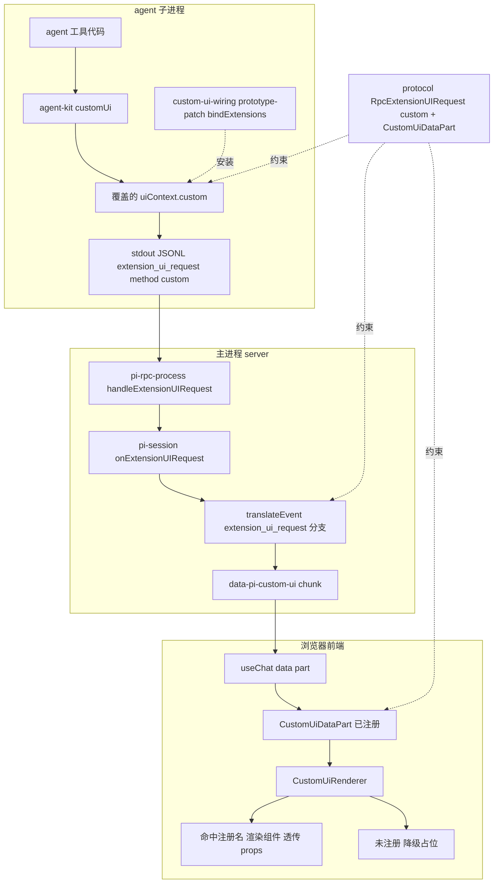
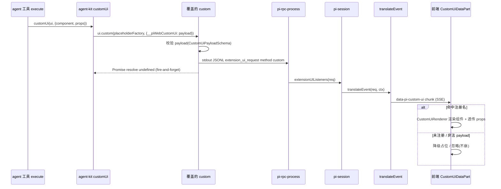

# Design Document — ctx-ui-custom-bridge

## Overview

**Purpose**: 在不修改 pi SDK 原码的前提下，补全 `ctx.ui.custom` 从 agent 子进程到浏览器前端的端到端链路，使 agent 作者可向聊天界面推送可序列化的自定义组件（注册名 + props）。

**Users**: agent 作者（调用 `ctx.ui.custom`）、最终用户（看到渲染结果）、pi-web 维护者（保证零 pi 改动、向后兼容、可回归）。

**Impact**: 当前 `ctx.ui.custom` 在 RPC 模式下是 pi SDK 的空操作，且前端渲染器是无人喂数据的孤儿、协议层根本不允许 `data-pi-custom-ui` chunk。本特性在 pi-web 三个自有边界（runner 委托、翻译纯函数、协议 schema）补齐三段断链，并复用已就绪的前端渲染器，最后以 demo 组件 + 示例 agent + e2e 收口。

### Goals
- 让字面 `ctx.ui.custom(...)`（经 agent-kit 助手）端到端可用：推送 → 翻译 → 渲染。
- 完全不改 pi SDK 源码；不破坏 `ctx.ui` 既有方法与既有事件/渲染通路。
- 跨 `newSession`/`fork`/`switchSession`（rebind）持续生效。
- 提供 ≥2 个 demo 组件 + 示例 agent + 单测/集成/e2e。

### Non-Goals
- 不修改 pi SDK；不实现 TUI 模式下的 custom（仅 RPC/web）。
- 不接管 `unified-command-result-layer` 的 host 命令通道（仅修正其 Req 6.3 错误假设的说明）。
- 不传输组件实现本体（只传可序列化 `{component, props}`，组件由前端预注册）。
- 不改 `ctx.ui` 的其它方法。

## Boundary Commitments

### This Spec Owns
- **子进程 custom 委托**：在 runner 内 prototype-patch `session.bindExtensions`，把 RPC 模式下空操作的 `uiContext.custom` 覆盖为发帧实现。
- **协议帧形状**：`RpcExtensionUIRequestSchema` 新增 `method:"custom"` 分支；`DataPartSchema` 新增 `data-pi-custom-ui`（`CustomUiDataPartSchema`）。
- **翻译分支**：`translateEvent` 的 `extension_ui_request` 分支按 `method==="custom"` 改产 `data-pi-custom-ui` data part。
- **agent 侧约定**：agent-kit `customUi(ui, payload)` 助手 + 类型（payload 经 `options.__piWebCustomUi` 传递）。
- **demo 资产**：demo 自定义组件（≥2）+ 示例 agent + `examples/README.md` 登记。
- **测试**：单测（发帧/翻译/渲染/降级）、集成（真 runner 帧）、e2e（端到端 + 跨 rebind）。

### Out of Boundary
- pi SDK 任何源文件。
- 前端渲染器实现本身（`CustomUiRenderer`/`CustomUiDataPart`/`registerCustomUi` 已就绪，仅复用与接线）。
- `ctx.ui` 其它方法行为、host 命令通道、Tier1–4 既有扩展。

### Allowed Dependencies
- pi SDK `@earendil-works/pi-coding-agent@0.79.6`（**只读消费**：依赖其 `runRpcMode` 仍经 `runtime.session.bindExtensions` 绑定 uiContext；不修改）。
- 既有委托范本 `wireAttachmentBridge`（同构造后委托模式）。
- 既有协议 `CustomUiPayloadSchema`（形状对齐，不引入跨层上行依赖：transport 层 data part 的 data 形状内联定义 component+props，避免 transport → web-ext 反向依赖）。
- 既有翻译纯函数 `translateEvent` 与其单测基础设施。

### Revalidation Triggers
- pi SDK 升级且改变 uiContext 绑定流程（不再经 `session.bindExtensions`）或 `extension_ui_request` 帧形状 → custom 委托/翻译需回归。
- `CustomUiPayload`（component+props）契约变更 → 协议 + 前端渲染器 + agent-kit 助手需同步。
- `DataPartSchema` / `UiMessageChunkSchema` 结构变更 → 翻译产帧需回归。

## Architecture

### Existing Architecture Analysis
- **三段断链**：①发（pi `custom` 空操作）②桥（翻译层无 custom 分支 + 协议无 `data-pi-custom-ui`）③收（前端渲染器就绪但成孤儿）。
- **保留的既有模式**：构造后委托（`wireAttachmentBridge` 包 `agent.beforeToolCall`）；`extension_ui_request` → `extensionUIListeners` → `pi-session` 喂 `translateEvent` 的转发链；data part 产帧（`makeUiMessageChunkFrame({type:"data-pi-*", data})`）；前端 `registerDataPartRenderer`。
- **集成点**：`runner.ts startRunner`（`runRpcMode` 之前）、`translate-event.ts` 的 `extension_ui_request` 分支、protocol 两个 schema、agent-kit 导出、app 层 demo 组件注册。

### Architecture Pattern & Boundary Map



**Architecture Integration**:
- **Selected pattern**：构造后委托（runner 侧）+ 纯函数分支（翻译侧）+ schema 扩展（协议侧），复用既有 extension_ui_request 转发与前端渲染器。
- **Boundaries**：子进程只负责"发可序列化帧"；主进程纯函数只负责"帧形状转换"；前端只负责"按注册名渲染/降级"。三者无共享可变状态。
- **Dependency direction**：`protocol ← {server runner, server translate, agent-kit, ui}`（协议为契约根，单向被依赖）。

### Technology Stack

| Layer | Choice / Version | Role in Feature | Notes |
|-------|------------------|-----------------|-------|
| Frontend | `@blksails/pi-web-ui`（既有 `CustomUiRenderer` 等）+ React | 复用注册式渲染器；新增 demo 组件 + `registerDemoCustomUi()` | 不改渲染器，仅接线/新增 demo |
| Backend / Runner | `@blksails/pi-web-server` runner + `@earendil-works/pi-coding-agent@0.79.6` | prototype-patch `bindExtensions` 覆盖 `custom`；翻译分支 | pi 只读消费，version pin |
| Protocol | `@blksails/pi-web-protocol`（zod） | `method:"custom"` + `data-pi-custom-ui` schema | 仅新增分支，向后兼容 |
| Agent SDK | `@blksails/pi-web-agent-kit` | `customUi(ui, payload)` 助手 + 类型 | 非运行时依赖 |
| Test | vitest + Playwright | 单测/集成/e2e（隔离 dist 目录） | `NEXT_DIST_DIR=.next-e2e` |

## File Structure Plan

### Created Files
```
packages/server/src/runner/
└── custom-ui-wiring.ts        # prototype-patch session.bindExtensions，覆盖 uiContext.custom 为发帧实现；
                               #   读 options.__piWebCustomUi（CustomUiPayload），写 extension_ui_request{method:custom}；
                               #   幂等 patch；无 payload → 保持 pi 空操作语义
packages/agent-kit/src/
└── custom-ui.ts               # customUi(ui, payload) 助手 + 类型；经 pi custom(factory, options) 的 options 透传 payload
packages/ui/src/web-ext/
└── custom-ui-demos.tsx        # ≥2 个 demo 组件（display-only + props 驱动）+ registerDemoCustomUi()
examples/ui-custom-ui-demo-agent/
├── index.ts                   # 示例 agent：某工具 execute 内调用 customUi 推送 demo 组件
└── README.md                  # 运行与验证说明（既有 examples 风格）
```

### Modified Files
- `packages/protocol/src/rpc/extension-ui.ts` — `RpcExtensionUIRequestSchema` 新增 `method:"custom"` 分支（`type:"extension_ui_request"`, `method:"custom"`, `id`, `payload: {component, props}`）。
- `packages/protocol/src/transport/data-part.ts` — 新增 `CustomUiDataPartSchema = { type:"data-pi-custom-ui", data:{component:string, props?:unknown} }` 并并入 `DataPartSchema` 联合。
- `packages/server/src/session/translate/translate-event.ts` — `case "extension_ui_request"`：`method==="custom"` → `makeUiMessageChunkFrame({type:"data-pi-custom-ui", data: payload})`；否则维持 `control:extension-ui`。
- `packages/server/src/runner/runner.ts` — `startRunner` 内 `runRpcMode(runtime)` 之前调用 `wireCustomUiBridge(runtime)`（紧邻 `wireAttachmentBridge`）。
- `packages/agent-kit/src/index.ts` — 导出 `customUi` 与类型。
- `app/`（或 `lib/app/` 聊天宿主初始化处） — 调用 `registerDemoCustomUi()`（仅 demo/e2e 接线；不默认进生产）。
- `examples/README.md` — 登记 `ui-custom-ui-demo-agent` 行。
- `.kiro/specs/unified-command-result-layer/`（说明性修正） — 标注 Req 6.3 假设已由本 spec 纠正（仅注记，不改其实现）。

## System Flows

### Custom UI 推送时序（含降级）


关键裁决：custom 复用 `extension_ui_request` 通道（notify 已证明 fire-and-forget 转发可行）；翻译层把它从"control 旁路帧"改投为"UIMessage data part"，从而落进前端已注册的 `data-pi-custom-ui` 渲染器。

## Requirements Traceability

| Requirement | Summary | Components | Interfaces | Flows |
|-------------|---------|------------|------------|-------|
| 1.1–1.4 | agent 推送可序列化自定义 UI | custom-ui-wiring, agent-kit customUi, extension-ui schema | `customUi`, 覆盖 `custom`, `RpcExtensionUIRequest(custom)` | 推送时序 |
| 2.1–2.3 | 端到端送达并渲染、推送即渲染 | translateEvent 分支, CustomUiDataPart(复用) | `data-pi-custom-ui` chunk | 推送时序 |
| 3.1–3.3 | 未注册/非法安全降级 | CustomUiRenderer(复用), translateEvent 校验 | `CustomUiPayloadSchema` | 时序 alt 分支 |
| 4.1–4.3 | 跨 rebind 持续有效 | custom-ui-wiring（prototype-patch） | `bindExtensions` patch | — |
| 5.1–5.4 | 不改 pi + 向后兼容 | custom-ui-wiring（仅增强 custom）, translateEvent（仅加分支） | 既有 extension_ui_request 路径不变 | — |
| 6.1–6.4 | demo 组件 + 示例 agent | custom-ui-demos, ui-custom-ui-demo-agent, README | `registerDemoCustomUi` | 推送时序 |
| 7.1–7.5 | 单测 + e2e + 隔离构建 | 各组件测试 | vitest/Playwright | — |

## Components and Interfaces

| Component | Domain/Layer | Intent | Req Coverage | Key Dependencies | Contracts |
|-----------|--------------|--------|--------------|------------------|-----------|
| custom-ui-wiring | Server/Runner | patch bindExtensions 覆盖 custom 发帧 | 1, 4, 5 | pi runtime.session (P0), protocol (P0) | Service, Event |
| translateEvent(custom 分支) | Server/Translate | extension_ui_request{custom} → data part | 2, 3, 5 | protocol (P0) | Event, State |
| protocol schema 扩展 | Protocol | method:custom + data-pi-custom-ui | 1, 2 | zod | State |
| agent-kit customUi | Agent SDK | agent 侧类型安全调用约定 | 1 | pi ExtensionUIContext 类型 (P1) | Service |
| custom-ui-demos | UI/Demo | demo 组件 + 注册 | 6 | registerCustomUi(复用, P0) | — |
| ui-custom-ui-demo-agent | Examples | 示例 agent 触发推送 | 6 | agent-kit customUi (P0) | — |

### Server / Runner

#### custom-ui-wiring
| Field | Detail |
|-------|--------|
| Intent | 在 RPC 模式下让 `uiContext.custom` 真正发帧，跨 rebind 稳健，不改 pi 原码 |
| Requirements | 1.1, 1.2, 1.4, 4.1, 4.2, 4.3, 5.1, 5.2 |

**Responsibilities & Constraints**
- prototype-patch `Object.getPrototypeOf(runtime.session).constructor.prototype.bindExtensions`：包装为先把传入 `bindings.uiContext.custom` 替换为发帧实现，再委托原始 `bindExtensions`。patch 幂等（以 sentinel 标记，避免重复包装）。
- 覆盖的 `custom(factory, options)`：从 `options.__piWebCustomUi` 取 payload，经 `CustomUiPayloadSchema` 校验；合法 → 单次 `process.stdout.write(JSON.stringify({type:"extension_ui_request", id, method:"custom", payload}) + "\n")`，返回 `Promise.resolve(undefined)`；非法/缺失 → 直接返回 `undefined`（保持 pi 空操作语义，Req 1.4/5.2）。
- 不触碰 uiContext 其它方法（Req 5.2）。

**Dependencies**
- Inbound: `runner.ts startRunner` — 在 `runRpcMode` 前调用（P0）
- Outbound: `process.stdout` — 写 JSONL 帧（P0）
- External: pi `runtime.session`（只读，依赖其 prototype 上的 `bindExtensions`）（P0）

**Contracts**: Service [x] / Event [x]

##### Service Interface
```typescript
import type { AgentSessionRuntime } from "../runner-types.js"; // 既有运行时类型

export interface CustomUiBridgeWiring {
  /** 还原 prototype patch（best-effort，用于测试/清理）。 */
  readonly restore: () => void;
}

/**
 * 在 runRpcMode 之前安装：prototype-patch session.bindExtensions，
 * 使其每次绑定的 uiContext.custom 被替换为发帧实现（跨 rebind 生效）。
 * 幂等；缺少可 patch 的 prototype 时优雅降级（不抛、不发帧）。
 */
export function wireCustomUiBridge(
  runtime: AgentSessionRuntime,
  options?: { readonly stdout?: { write(s: string): void }; readonly randomId?: () => string },
): CustomUiBridgeWiring;
```
- Preconditions：`runtime.session` 存在；其 prototype 暴露 `bindExtensions`。
- Postconditions：此后任意会话 bind 出的 `uiContext.custom` 调用都按约定发帧或保持空操作。
- Invariants：仅增强 `custom`；其它 uiContext 方法与 pi 行为不变。

##### Event Contract
- Published（子进程 stdout）：`{ type:"extension_ui_request", id:string, method:"custom", payload: CustomUiPayload }`
- Ordering/delivery：单行 JSONL，Node stdout 写队列串行化；fire-and-forget（无响应配对）。

**Implementation Notes**
- Integration：紧邻 `wireAttachmentBridge` 调用；二者均"构造后委托"，互不干扰。
- Validation：payload 必经 `CustomUiPayloadSchema.safeParse`，失败静默丢弃（Req 1.4）。
- Risks：pi 内部不再走 `session.bindExtensions` 时 patch 失效 → e2e 回归 + Revalidation Trigger；prototype 不可达时降级为不发帧（custom 退回空操作，链路无害）。

### Server / Translate

#### translateEvent（extension_ui_request 分支扩展）
| Field | Detail |
|-------|--------|
| Intent | 把 `method==="custom"` 的 extension_ui_request 转成 `data-pi-custom-ui` data part；其余 method 行为不变 |
| Requirements | 2.1, 2.2, 3.2, 5.3 |

**Responsibilities & Constraints**
- 纯函数、确定、不抛（沿用既有约束）。
- `method==="custom"`：`payload` 经校验后 → `makeUiMessageChunkFrame({ type:"data-pi-custom-ui", data: payload })`；payload 非法 → `none(ctx)`（忽略，Req 3.2）。
- 其它 method → 维持 `makeControlFrame({control:"extension-ui", request})`（Req 5.3）。

**Contracts**: Event [x] / State [x]（推进既有 `TranslationContext`，custom 分支不改 part 计数）

**Implementation Notes**
- Validation：复用协议 `CustomUiPayloadSchema`（或与 data part 内联形状一致的校验）。
- Risks：data part 挂到活动 assistant message；custom 于无活动 turn 调用时由 useChat 决定归属（文档注明，demo 在回合内调用）。

### Protocol

#### schema 扩展（method:custom + data-pi-custom-ui）
| Field | Detail |
|-------|--------|
| Intent | 让 custom 请求帧与 custom data part 成为合法、可校验的协议形状 |
| Requirements | 1.1, 1.2, 2.1 |

**Contracts**: State [x]

##### State Management
```typescript
// rpc/extension-ui.ts —— 并入 RpcExtensionUIRequestSchema 判别联合
const CustomRequest = z.object({
  type: z.literal("extension_ui_request"),
  id: z.string(),
  method: z.literal("custom"),
  payload: z.object({ component: z.string().min(1), props: z.unknown().optional() }),
});

// transport/data-part.ts —— 并入 DataPartSchema 判别联合
export const CustomUiDataPartSchema = z.object({
  type: z.literal("data-pi-custom-ui"),
  data: z.object({ component: z.string().min(1), props: z.unknown().optional() }),
});
```
- 向后兼容：仅新增判别分支，既有帧不受影响（Req 5）。
- 形状与 `web-ext/command.ts` 的 `CustomUiPayloadSchema` 对齐；transport 层内联定义以避免 transport → web-ext 反向依赖。

### Agent SDK

#### customUi 助手
| Field | Detail |
|-------|--------|
| Intent | 给 agent 作者类型安全的 `ctx.ui.custom` 调用约定，隐藏 placeholder factory 与 options sentinel |
| Requirements | 1.1, 1.3 |

**Contracts**: Service [x]

##### Service Interface
```typescript
export interface CustomUiPayload { readonly component: string; readonly props?: unknown; }

/**
 * 经被覆盖的 ctx.ui.custom 推送一个自定义组件描述。
 * 内部以 pi 要求的 (factory, options) 形态调用，payload 走 options.__piWebCustomUi。
 * 在未启用桥接的环境下（custom 仍为 pi 空操作）安全无副作用。
 */
export function customUi(ui: ExtensionUIContextLike, payload: CustomUiPayload): void;
```
- `ExtensionUIContextLike`：窄接口，仅约束 `custom(factory, options)` 形态（不引入 `any`，以精确包装类型满足 pi 签名）。
- Postcondition：fire-and-forget，不等待返回。

### UI / Demo & Examples

#### custom-ui-demos / ui-custom-ui-demo-agent（Summary-only）
- `custom-ui-demos.tsx`：导出 ≥2 个组件——`demo-callout`（display-only）、`demo-metric-card`（props 驱动，渲染 `{label, value}`）——与 `registerDemoCustomUi()`（内部 `registerCustomUi(name, comp)`）。
- `ui-custom-ui-demo-agent/index.ts`：示例 agent，提供一个工具，在 `execute` 内 `customUi(ctx.ui, {component:"demo-metric-card", props:{...}})`，并演示一个未注册名走降级。
- **Implementation Note**：demo 组件注册仅由 `registerDemoCustomUi()` 显式触发（demo/e2e 接线），不默认进生产聊天；示例在 `examples/README.md` 登记，README 说明运行/验证（含未注册降级断言）。

## Error Handling

### Error Strategy
- **非法 payload（子进程）**：`CustomUiPayloadSchema` 校验失败 → 不发帧、`custom` 返回 `undefined`（等同 pi 空操作）。
- **非法 payload（翻译层）**：`none(ctx)` 忽略，不产帧。
- **未注册组件名（前端）**：`CustomUiRenderer` 降级占位（`data-pi-custom-ui-fallback`，既有）。
- **prototype 不可 patch（runner）**：降级为不安装（custom 退回空操作），记 stderr 诊断，不崩溃。
- **pi 内部绑定流程变更**：e2e 回归捕获，非静默失败。

### Monitoring
- runner 侧 patch 安装/降级写 stderr（沿用既有诊断风格）；不引入新日志域。

## Testing Strategy

### Unit Tests
- `translate-event`：`extension_ui_request{method:custom, payload}` → `data-pi-custom-ui` chunk；非法 payload → 空 frames；其它 method 仍 `control:extension-ui`（回归）。
- `custom-ui-wiring`：注入 stub session（带 prototype `bindExtensions`），断言 bind 后 `uiContext.custom({...,{__piWebCustomUi}})` 写出正确 JSONL 单行帧；非法/缺失 payload 不发帧；patch 幂等；prototype 缺失优雅降级。
- `protocol`：`RpcExtensionUIRequestSchema` 接受 custom 分支、拒绝缺 payload；`DataPartSchema`/`UiMessageChunkSchema` 接受 `data-pi-custom-ui`。
- `agent-kit customUi`：以 mock ui 断言调用形态（factory + options.__piWebCustomUi）。
- `ui custom-ui-demos`：`registerDemoCustomUi` 后命中渲染 + 未注册降级（复用既有渲染器测试基建）。

### Integration Tests
- 真 runner 子进程：示例 agent 工具内 `customUi` → 主进程经 `pi-rpc-process`/`pi-session`/`translateEvent` 收到 `data-pi-custom-ui` SSE 帧（断言帧到达且形状正确）。
- 既有 `ctx.ui.notify`/`select` 回归：仍走 `control:extension-ui`，行为不变。

### E2E (Playwright, 隔离 `NEXT_DIST_DIR=.next-e2e`)
- 端到端：选 `ui-custom-ui-demo-agent` → prompt 触发 → 前端渲染出 `demo-metric-card`（断言 `data-pi-custom-ui-name` + props 内容）。
- 降级：推送未注册名 → 断言 `data-pi-custom-ui-fallback` 出现、聊天流不崩。
- 跨 rebind：新建/切换会话后再次推送仍渲染（验证 prototype-patch 跨 rebind，Req 4）。
- 回归：既有 e2e 套件全绿（Req 5.3/7.4）。

## Open Questions / Risks
- **demo 组件注册落点**：拟在聊天宿主初始化处调用 `registerDemoCustomUi()`（仅 demo/e2e）；若不希望任何 demo 进入 app bundle，可改为 e2e 测试页内注册——实现期二选一，默认前者并以 flag/路径隔离。
- **custom 无活动 turn 时的归属**：依赖 useChat 行为；demo 约束在回合内调用，文档注明。
- **pi 版本耦合**：version pin + e2e 回归 + Revalidation Trigger 已覆盖。
