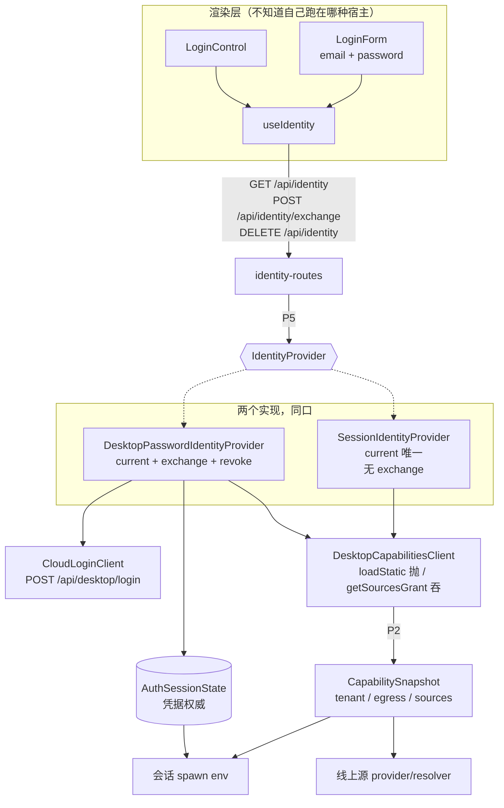
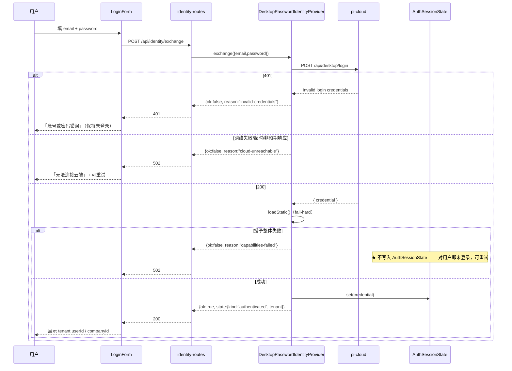
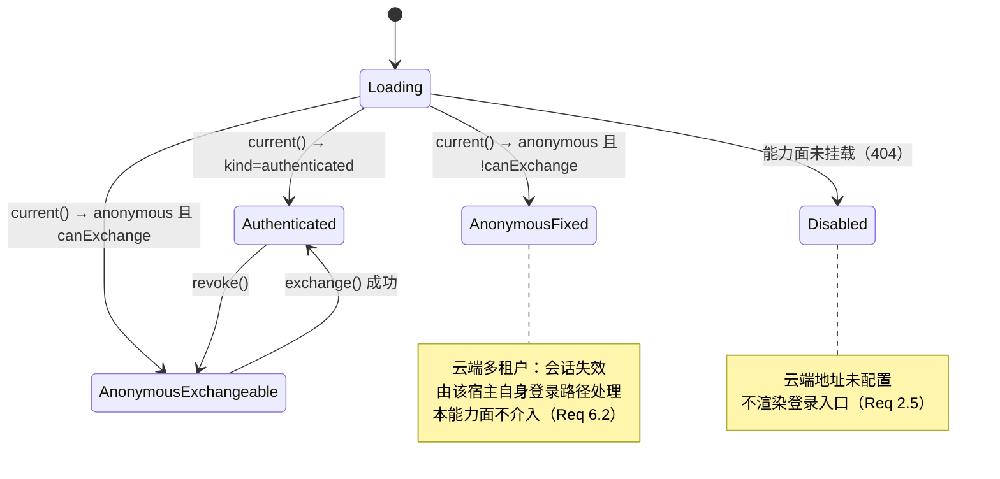
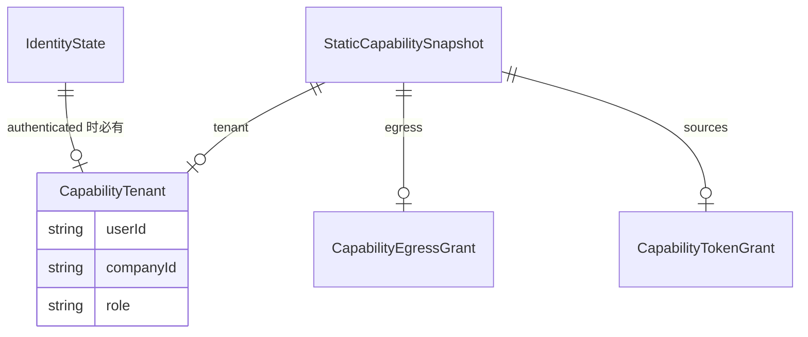

# Design Document — desktop-account-login

## Overview

**Purpose**:本特性让 pi-web 桌面用户用**账号密码**登录,并在登录成功的同一步取齐 `tenant` / `egress` / `sources` 三类能力授予 —— 全程不接触任何凭据串。

**Users**:pi-web 桌面用户(主要)、云端多租户 web 用户(经同一能力面暴露既有会话身份)、宿主集成者(照契约实现新宿主)。

**Impact**:宿主契约 v1 新增 **P5 `IdentityProvider`** 端口,补上"`CapabilityProvider` 定义了用身份换授予,却没定义身份怎么来"这个缺口。既有 `/api/auth/*` 与凭据串路径保留为兜底,不删不改语义。

### Goals

- 身份获取成为**契约级能力面**:桌面与云端各自实现,调用方与 UI 不据宿主类型分支
- 桌面账号密码登录端到端可用,登录后授予一次到位,无需重启
- `CapabilitySnapshot.tenant` 从"契约里有、代码里无"变成前端展示的唯一身份来源

### Non-Goals

- 不改云端 `POST /api/desktop/login` 端点本身
- 不做注册 / 找回密码 / 多因素
- 不做 `attachments` 会话作用域授予(属既有附件线)
- 不实现 pi-clouds 侧的真实云端宿主接线(本仓交付可测的等价实现)
- 不做凭据签名校验(在云端 egress 侧)

## Boundary Commitments

### This Spec Owns

- **P5 `IdentityProvider` 端口类型**及其语义保证(`packages/server/src/identity/`)
- 身份 HTTP 面 `/api/identity`(GET / POST exchange / DELETE)
- 桌面密码身份实现:云端登录客户端 + 凭据落 `AuthSessionState` + 授予加载
- `DesktopCapabilitiesClient.loadStatic()`(fail-hard,解析 `tenant`/`egress`/`sources` 三字段)
- 账号密码登录 UI 与其前端状态投影
- 契约文档 P5 章节 + 更正 device 表述

### Out of Boundary

- `AuthSessionState` 的语义(仍是凭据的进程内唯一权威,本 spec 只增加写入它的第二条路径)
- `/api/auth/*` 三个既有端点(保留,不改语义)
- 线上源解析与安装链路(`desktop-online-source-runnable` 拥有;本 spec 只保证其依赖的 `sources` 授予到位)
- 云端地址配置(`desktop-cloud-login` Req 8 已交付,不新增配置项)
- `getSourcesGrant()` 的 fail-soft 语义 —— **不得**改为抛错

### Allowed Dependencies

- `packages/server/src/capability/types.ts`(P2 类型,只读引用)
- `packages/server/src/host-contract-version.ts`
- `packages/server/src/auth/*`(`AuthSessionState` / `credential` / `desktop-capabilities-client`)
- `lib/app/auth-egress-assembly.ts`(云端地址解析)
- **禁止**:identity 模块引入 pi SDK(须保持主 barrel 的 pi-SDK-free 纪律,见 `capability/types.ts` 顶部告诫)

### Revalidation Triggers

- 云端 `/api/desktop/login` 请求或响应形状变化
- `CapabilitySnapshot` 字段增删
- `HOST_CONTRACT_VERSION` 升版
- `defaultCapabilities` 能力面 id 集合变化(两端须重新表态)
- `IdentityState` 判别联合新增分支

## Architecture

### Existing Architecture Analysis

现状链路(`desktop-cloud-login` + `desktop-hybrid-agent-sources` 交付):

- `AuthSessionState` 是进程内凭据权威;`POST /auth/session` 写它,会话 spawn 读它
- `DesktopCapabilitiesClient` 用凭据换授予,但**只解析 `sources`**,且全链 fail-soft
- 前端 `DesktopAuthProvider` 持单一登录态,`LoginControl` 收凭据串
- 能力面经 `defaultCapabilities` 显式表态,条件挂载用 `HostDeps` 可选字段表达

必须保持的接缝:`AuthSessionState` 单实例、能力面 id 显式表态、`getSourcesGrant()` fail-soft。

### Architecture Pattern & Boundary Map



**Architecture Integration**

- **选用模式**:端口—适配器(与 P1/P2 同款)。P5 与 P2 **正交**:P5 回答"身份怎么来",P2 回答"身份能换到什么"。
- **责任隔离**:渲染层只看 `IdentityState`;路由层只做判别联合 → JSON 投影;实现层各自决定身份来源。三层都不出现宿主类型判断。
- **保留的既有模式**:`contractVersion` 类型层钉死;能力面显式表态;`HostDeps` 可选字段表达条件挂载;凭据禁落盘。
- **新组件理由**:`CloudLoginClient` 独立于身份实现,因为它是"打一个外部端点"这一件事,可单测且不含状态。

### Technology Stack

| Layer | Choice | Role in Feature | Notes |
|---|---|---|---|
| Frontend | React 19 + 既有 Context 模式 | 身份状态单实例 + 登录表单 | 无新依赖 |
| Backend | Hono `InjectedRoute` seam | `/api/identity` 三端点 | 与 `createAuthRoutes` 并列挂载 |
| 契约类型 | TypeScript(纯类型,零运行期依赖) | P5 端口 | 须 pi-SDK-free |
| 外部服务 | pi-cloud `POST /api/desktop/login` | 凭据签发 | 形状固定,不可改 |
| 存储 | OS 钥匙串(经桌面壳桥)+ 进程内存 | 凭据 at-rest / 运行期 | 不新增存储 |

## File Structure Plan

### Directory Structure

```
packages/server/src/
├── identity/                              # P5 端口（新增域）
│   ├── types.ts                           # IdentityState/IdentityProvider/凭据与结果类型（纯类型）
│   ├── identity-routes.ts                 # GET/POST exchange/DELETE，判别联合 → JSON 投影
│   ├── desktop-password-identity-provider.ts  # 桌面实现：登录 → 凭据 → 授予
│   ├── session-identity-provider.ts        # 「身份已具备」实现（云端形态的本仓可测版）
│   └── index.ts                            # barrel
└── auth/
    └── cloud-login-client.ts               # 新增：POST {cloudBase}/api/desktop/login

components/auth/
├── use-identity.tsx                        # 新增：身份状态投影 + Provider（替代 use-desktop-auth）
└── login-form.tsx                          # 新增：邮箱 + 掩码密码表单
```

### Modified Files

- `packages/server/src/auth/desktop-capabilities-client.ts` — 新增 `loadStatic()`(fail-hard,解析三字段);`getSourcesGrant()` 改为复用它并吞异常(语义不变);新增 `deriveLoginUrlFromEgressBase()`
- `packages/server/src/host-assembly/default-capabilities.ts` — 新增能力面 `identity.session`,条件挂载于 `HostDeps.identityProvider`
- `packages/server/src/index.ts` — 导出 identity 面(纯类型 + 路由工厂)
- `lib/app/auth-egress-assembly.ts` — 新增 `computeEgressSpawnEnvFromGrant()`:有 `egress` 授予时优先于 env 配置(D4)
- `lib/app/pi-handler.ts` — 装配 `CloudLoginClient` + `DesktopPasswordIdentityProvider`,注入 `hostDeps.identityProvider`;spawn env 改走 D4
- `components/auth/login-control.tsx` — 改用 `useIdentity` + `LoginForm`,粘贴框降级为兜底入口
- `components/auth/use-desktop-auth.tsx` — 收敛为对 `use-identity` 的兼容 re-export(D5)
- `components/chat-app.tsx` — 改用 `useIdentity` / `identityListKey`
- `docs/pi-web-host-contract-v1.md` — 新增 §6 P5 章节;§2 端口总览加一行;更正 device 表述

## System Flows

### 桌面账号密码登录(Req 2 / 4 / 8)



**流程级决策**

- 凭据换取与授予加载在**同一次 `exchange()`** 内完成。分成两步会产生"凭据已签发但 UI 显示未登录"的中间态,重试时用户不知道自己处在哪一步。
- 授予失败时**不写入** `AuthSessionState`(Req 4.2 + 契约 §4.2.3 "失败即拒绝")。密码在返回前丢弃,不重试、不缓存。

### 身份状态判定(Req 1)



UI **只**据这四态渲染,不查询宿主类型(Req 1.5)。

## Requirements Traceability

| Req | 摘要 | 组件 | 接口 | 流程 |
|---|---|---|---|---|
| 1.1, 1.5, 1.6 | 统一能力面、UI 不分支、无身份仍可启动 | `identity/types.ts`, `use-identity` | `IdentityProvider.current()` | 身份状态判定 |
| 1.2 | 身份已具备直接返回 | `SessionIdentityProvider` | `current()` | 身份状态判定 |
| 1.3, 1.4 | 表明是否支持交换 / 不支持不报错 | `identity-routes` | `canExchange` 派生(D2) | 身份状态判定 |
| 2.1, 2.6 | 提交账号密码 → 取得凭据 → 免重启生效 | `CloudLoginClient`, `DesktopPasswordIdentityProvider` | `exchange()` | 登录时序 |
| 2.2 | 空值阻止提交 | `LoginForm` | — | — |
| 2.3 | 401 → 账号或密码错误 | `identity-routes` | `reason:"invalid-credentials"` | 登录时序 |
| 2.4 | 不可达/超时 → 可读提示 + 重试 | `CloudLoginClient` | `reason:"cloud-unreachable"` | 登录时序 |
| 2.5 | 未配置云端 → 不展示入口 | `default-capabilities` 条件挂载 | 404 → `Disabled` | 身份状态判定 |
| 3.1–3.5 | 表单形态、进行中、取消、粘贴非主路径、重登同表单 | `LoginForm`, `LoginControl` | — | — |
| 4.1 | 三类授予一次到位 | `DesktopCapabilitiesClient.loadStatic()` | `StaticCapabilitySnapshot` | 登录时序 |
| 4.2 | 整体失败不进已登录态 | `loadStatic()` fail-hard(D3) | throw | 登录时序 |
| 4.3 | 单项缺失降级 | 消费方逐项判空 | 字段可选 | — |
| 4.4 | `sources` 到位 → 线上源可见可安装 | 既有 composite provider / resolver | `getSourcesGrant()` | — |
| 4.5 | `egress` 到位 → 模型清单来自云端 | `computeEgressSpawnEnvFromGrant()`(D4) | spawn env | — |
| 5.1–5.3 | 展示 `tenant`,缺失时最小信息 | `use-identity`, `LoginControl` | `IdentityState.tenant` | — |
| 6.1–6.3 | 云端经同口暴露既有身份 | `SessionIdentityProvider` | `current()`,无 `exchange` | 身份状态判定 |
| 7.1–7.3 | 登出、切号整体替换、未登录本地可用 | `revoke()`, `exchange()` | `AuthSessionState.clear/set` + `clearCache()` | — |
| 8.1–8.5 | 密码/凭据/token 不外泄 | 全体 | 见 Security | — |
| 9.1–9.3 | 契约文档同步 | `docs/pi-web-host-contract-v1.md` | — | — |

## Components and Interfaces

| Component | Layer | Intent | Req | Key Deps | Contracts |
|---|---|---|---|---|---|
| `identity/types.ts` | 契约 | P5 端口类型 | 1 | `capability/types`, `host-contract-version` | Service |
| `CloudLoginClient` | 服务端 | 打云端登录端点 | 2.1/2.3/2.4 | fetch | Service |
| `DesktopPasswordIdentityProvider` | 服务端 | 桌面身份实现 | 2, 4, 7 | CloudLoginClient, AuthSessionState, CapabilitiesClient | Service |
| `SessionIdentityProvider` | 服务端 | 身份已具备实现 | 1.2, 6 | CapabilitiesClient | Service |
| `identity-routes` | 服务端 | HTTP 面 + 判别联合投影 | 1.3, 2, 5, 7 | IdentityProvider | API |
| `DesktopCapabilitiesClient.loadStatic` | 服务端 | fail-hard 取三类授予 | 4.1/4.2 | fetch | Service |
| `useIdentity` | 前端 | 身份状态单实例 | 1.5, 5, 7 | `/api/identity` | State |
| `LoginForm` | 前端 | 邮箱密码表单 | 3.1–3.3 | useIdentity | — |

### 契约层

#### `identity/types.ts` — P5 `IdentityProvider`

| Field | Detail |
|---|---|
| Intent | 定义"身份怎么来",与 P2"身份能换到什么"正交 |
| Requirements | 1.1, 1.2, 1.3, 1.4 |

**Responsibilities & Constraints**

- 纯类型,零运行期依赖(可安全经主 barrel 重导出)
- **禁止**引入 pi SDK(破坏 pi-SDK-free 纪律)
- 身份状态是判别联合(D1):不允许 `{authenticated 但无 tenant}` 这种组合存在

##### Service Interface

```typescript
/** 身份状态。判别联合 —— 「已认证但没有身份」在类型上不可表达（D1）。 */
export type IdentityState =
  | { readonly kind: "authenticated"; readonly tenant: CapabilityTenant }
  | { readonly kind: "anonymous" };

/** 凭据交换的入参。v1 只有账号密码一种形态。 */
export interface IdentityPasswordCredentials {
  readonly method: "password";
  readonly email: string;
  readonly password: string;
}

export type IdentityCredentials = IdentityPasswordCredentials;

/** 交换失败的类别。分类决定 HTTP 状态与用户可读文案，故是契约的一部分。 */
export type IdentityExchangeFailure =
  /** 云端明确拒绝（401）。用户可改账号密码重试。 */
  | "invalid-credentials"
  /** 入参不合法（空邮箱/空密码）。 */
  | "invalid-request"
  /** 云端不可达、超时或响应形状非预期。用户可原样重试。 */
  | "cloud-unreachable"
  /** 凭据已取得，但能力授予加载失败 —— 不得进入已登录态（契约 §4.2.3）。 */
  | "capabilities-failed";

export type IdentityExchangeResult =
  | { readonly ok: true; readonly state: IdentityState }
  | { readonly ok: false; readonly reason: IdentityExchangeFailure };

export interface IdentityProvider {
  readonly contractVersion: typeof HOST_CONTRACT_VERSION;

  /**
   * 当前身份。
   * @returns 已具备 → authenticated；不具备 → anonymous。
   * @throws 不抛。身份不可得是**正常态**，不是错误（对齐 P2 不变式 1）。
   */
  current(): Promise<IdentityState>;

  /**
   * 以凭据换取身份。**可选** —— 方法存在即代表该宿主支持交换（D2）。
   * @throws 不抛。全部失败经 `IdentityExchangeResult.ok=false` 表达。
   */
  exchange?(credentials: IdentityCredentials): Promise<IdentityExchangeResult>;

  /** 放弃当前身份（登出）。**可选** —— 身份来自外部会话的宿主无从放弃。 */
  revoke?(): Promise<void>;
}
```

- **Preconditions**:无
- **Postconditions**:`exchange()` 返回 `ok:true` 后,`current()` 必须返回同一 `tenant`;返回 `ok:false` 后,`current()` 必须仍返回**调用前的状态**(不得半途改变身份)
- **Invariants**:`current()` 与 `exchange()` 均**不抛**;`exchange` 缺席 ⇔ 该宿主不支持交换

> **为什么 `current()` 不抛**:P2 用抛错表达"加载失败",因为它已假定身份存在。P5 处在更前一步 —— "拿不到身份"正是它要表达的正常结果之一。若也用抛错,`anonymous` 与"探测失败"就不可分,而 Req 1.6 要求两者都以未登录形态正常启动。

#### `SessionIdentityProvider`

| Field | Detail |
|---|---|
| Intent | "身份已具备"形态的实现 —— 云端多租户宿主的本仓可测等价物 |
| Requirements | 1.2, 1.4, 6.1, 6.2, 6.3 |

**Responsibilities & Constraints**

- 只实现 `current()`;**不实现** `exchange` —— 它是 P5 支持"不支持交换"这条路径的活证明(Req 1.4/6.3)
- 身份由注入的 `resolveTenant()` 回调产出(桌面下来自现有凭据,云端下来自会话)
- `resolveTenant()` 抛错或返回 `undefined` → `current()` 返回 `anonymous`,不上抛

### 服务端

#### `CloudLoginClient`

| Field | Detail |
|---|---|
| Intent | 打 `POST {cloudBase}/api/desktop/login`,把 HTTP 结果翻译成失败类别 |
| Requirements | 2.1, 2.3, 2.4, 8.1 |

**Dependencies** — External: pi-cloud 登录端点(Critical,形状固定不可改)

##### Service Interface

```typescript
export interface CloudLoginClient {
  login(input: { readonly email: string; readonly password: string }):
    Promise<
      | { readonly ok: true; readonly credential: string }
      | { readonly ok: false; readonly reason: "invalid-credentials" | "invalid-request" | "cloud-unreachable" }
    >;
}
```

##### API Contract(外部,实测)

| Method | Endpoint | Request | Response | Errors |
|---|---|---|---|---|
| POST | `{cloudBase}/api/desktop/login` | `{email,password}` | `{credential}` | 400 缺参 / 401 凭据错 |

**Implementation Notes**

- 状态映射:401/403 → `invalid-credentials`;400 → `invalid-request`;网络异常/超时/非 2xx/响应缺 `credential` → `cloud-unreachable`
- 超时沿用 `CLOUD_LOGIN_MIN_TIMEOUT_MS`? **不** —— 登录是交互式请求,90s 让用户干等太久。用独立的 **15s**,与"长响应不得被中断"的 egress 场景无关
- **禁止**把 `password` 或响应体写入 logger 的任何参数(Req 8.1)

#### `DesktopPasswordIdentityProvider`

| Field | Detail |
|---|---|
| Intent | 组合登录客户端 + 凭据权威 + 授予加载,实现 P5 三方法 |
| Requirements | 2.1, 2.6, 4.1, 4.2, 5.1, 7.1, 7.2 |

**Responsibilities & Constraints**

- `current()`:`AuthSessionState.isValid()` 为假 → `anonymous`;为真 → 用缓存的 `tenant` 产出 `authenticated`
- `exchange()`:登录 → **成功后**才 `loadStatic()` → **成功后**才 `AuthSessionState.set()`。顺序不可换(风险缓解见 research.md)
- `revoke()`:`AuthSessionState.clear()` + `capabilitiesClient.clearCache()` + 丢弃缓存的 `tenant`。**两者都要清** —— 只清凭据会让下一个用户读到上一个用户的授予缓存(Req 7.2 "不得残留旧授予")

##### State Management

- 进程内保留最近一次成功 `loadStatic()` 的 `tenant`,与 `AuthSessionState` 的凭据**同生共死**
- 切号 = `exchange()` 成功 → 覆盖凭据 + 覆盖 `tenant` + 清授予缓存(整体替换,Req 7.2)

#### `identity-routes`

| Field | Detail |
|---|---|
| Intent | P5 → HTTP 投影;`canExchange` 由方法存在性**派生**(D2) |
| Requirements | 1.3, 1.4, 2.2–2.5, 5.1–5.3, 7.1 |

##### API Contract

| Method | Endpoint | Request | Response | Errors |
|---|---|---|---|---|
| GET | `/api/identity` | — | `IdentityView` | — |
| POST | `/api/identity/exchange` | `{method:"password",email,password}` | `IdentityView` | 400 / 401 / 502 |
| DELETE | `/api/identity` | — | `{ok:true}` | 405(不支持 revoke) |

```typescript
/** HTTP 投影。canExchange 由路由派生，实现不得自行声明（D2）。 */
export type IdentityView =
  | { readonly state: "authenticated"; readonly tenant: CapabilityTenant; readonly canExchange: boolean }
  | { readonly state: "anonymous"; readonly canExchange: boolean };
```

**失败类别 → HTTP**:`invalid-request` → 400 · `invalid-credentials` → 401 · `cloud-unreachable` → 502 · `capabilities-failed` → 502

`capabilities-failed` 用 502 而非 500:失败源在上游云端,不是本地缺陷,且用户可重试。响应体带 `reason` 供 UI 出不同文案。

### 前端

#### `useIdentity` / `IdentityStateProvider`

| Field | Detail |
|---|---|
| Intent | 身份状态单实例(组件树内唯一),供登录控件与列表刷新共用 |
| Requirements | 1.5, 1.6, 5.1–5.3, 7.1 |

##### State Management

```typescript
export type IdentityUiState =
  /** 能力面未挂载（GET 404）→ 不渲染任何登录入口 */
  | { readonly kind: "disabled" }
  | { readonly kind: "loading" }
  | { readonly kind: "authenticated"; readonly tenant: CapabilityTenant; readonly canExchange: boolean }
  | { readonly kind: "anonymous"; readonly canExchange: boolean };
```

- 渲染分支**只**读 `kind` 与 `canExchange`,不读任何宿主标识(Req 1.5)
- `identityListKey(state)`:登录/登出/切号改变返回值 → 驱动 agent-sources 刷新(替代 `desktopAuthListIdentity`)

#### `LoginForm`

- 邮箱 `type="email"` + 密码 `type="password"`(掩码,Req 3.1)
- 任一为空 → 禁用提交并提示必填(Req 3.2)
- 提交中 → 禁用按钮 + 进行中态(Req 3.2)
- 取消 → 清空两个字段,不发任何请求(Req 3.3)
- **密码只存在于组件 state 与请求体中**,提交后立即清空;不进 URL、不进 localStorage

## Data Models

### Domain Model



**业务规则与不变式**

- `tenant` 三字段皆必填(沿用 P2:"身份是完整的或根本没有")
- `IdentityState.kind==="authenticated"` ⟺ `tenant` 存在(类型强制)
- 授予各字段独立可选,字段之间无蕴含关系(沿用 P2 不变式 1)

### Data Contracts & Integration

- 云端登录响应:`{ credential: string }`。缺该字段视为 `cloud-unreachable`(响应形状非预期)
- 能力端点响应:`{ tenant?, egress?, sources? }`,逐项解析,任一解析失败**不**导致整体失败(Req 4.3);仅 HTTP 层失败才抛(Req 4.2)

## Error Handling

### Error Strategy

| 类别 | 表达方式 | 消费方动作 |
|---|---|---|
| 身份不可得 | `current()` → `anonymous` | 渲染登录入口;本地能力照常(Req 1.6) |
| 交换失败 | `exchange()` → `{ok:false,reason}` | 按 reason 出文案,保持未登录 |
| 授予整体失败 | `loadStatic()` **抛** | 不进已登录态(Req 4.2) |
| 单项授予缺失 | 快照字段缺失 | 该项降级本地形态(Req 4.3) |
| 能力面未挂载 | HTTP 404 | UI `disabled`,不渲染入口(Req 2.5) |

★ **这五行不可合并**。前四行分别对应四种截然不同的用户处置,合并任意两行都会产生"云端故障被当成未登录"或"未登录被当成故障"的误判 —— 这正是 P2 不变式 1 反复强调的那条线。

### Error Categories and Responses

- **User (4xx)**:400 空字段(字段级提示)· 401 账号或密码错误(可改后重试)
- **System (5xx)**:502 云端不可达 / 授予失败(原样重试,带可读提示,不崩溃不卡死 — Req 2.4)
- **降级**:任一授予缺失 → 该能力退回本地形态,应用继续可用

### Monitoring

- 登录事件只记 `{ result, reason }`,**不记** email、password、credential、token(Req 8.4)
- 沿用 `@blksails/pi-web-logger`,命名空间 `server:identity`

## Testing Strategy

### Unit Tests

1. `IdentityState` 判别联合类型测(`test-d`):`{kind:"authenticated"}` 缺 `tenant` 必须**编译不过**(D1 的机械保证)
2. `CloudLoginClient` 状态映射:401→`invalid-credentials`、400→`invalid-request`、网络抛/超时/500/响应缺 `credential`→`cloud-unreachable`
3. `DesktopCapabilitiesClient.loadStatic()`:解析三字段;HTTP 失败**抛**;`getSourcesGrant()` 在同一失败下仍返回 `undefined`(D3 两语义并存)
4. `DesktopPasswordIdentityProvider.exchange()` 顺序不变式:`loadStatic` 抛时 `AuthSessionState.set` **未被调用**,`current()` 仍为 `anonymous`
5. `revoke()` 同时清凭据与授予缓存(Req 7.2 防残留)
6. `computeEgressSpawnEnvFromGrant()`:有授予 → 用授予的 baseUrl/models;无授予 → 退回 env 配置(D4 且不回归)

### Integration Tests

1. `/api/identity` 三端点:`canExchange` 在提供 `exchange` 的实现下为 `true`、在 `SessionIdentityProvider` 下为 `false`(D2 派生正确)
2. `POST /api/identity/exchange` 失败类别 → HTTP 映射(400/401/502)且响应体**不含**密码或凭据(Req 8.1/8.2)
3. 能力面条件挂载:未配置云端时 `GET /api/identity` 返回 404,配置后返回 200(Req 2.5)
4. 登录成功后 `sources` 授予即刻可用于线上源枚举(不重启,Req 2.6/4.4)
5. 切号:A 登录 → B 登录 → 授予缓存不含 A 的 token(Req 7.2)

### E2E/UI Tests

1. **未配置云端** → 页面无登录入口(Req 2.5)
2. **账号密码登录成功** → 展示 `tenant.userId`,线上源在侧栏可见(Req 2.1/4.4/5.1)
3. **密码错误** → 展示「账号或密码错误」,仍处未登录态,可再次提交(Req 2.3)
4. **取消登录** → 两字段清空,无任何请求发出(Req 3.3)
5. **登出** → 回到登录入口,线上源消失,本地源仍在(Req 7.1/7.3)

### Performance

- 登录请求超时 15s(交互式);`current()` 不打网络(读进程内态)
- `loadStatic()` 结果按 `expiresAt` 缓存,登录路径每次真调(登录是低频操作,新鲜度优先)

## Security Considerations

| 不变式 | 落实点 | Req |
|---|---|---|
| 密码不落日志/响应体/持久介质 | `CloudLoginClient` 不把入参传给 logger;路由响应体只回 `IdentityView` | 8.1 |
| 凭据明文不回传渲染层 | `IdentityView` 无 credential 字段;`AuthSessionState.snapshot()` 既有纪律 | 8.2 |
| 凭据只存 OS 钥匙串 | 沿用桌面壳桥 `storeCredential`;不写 Workspace / 配置文件 / `.env` | 8.3 |
| 日志只记结果与类别 | 命名空间 `server:identity`,字段白名单 `{result,reason}` | 8.4 |
| 短期 token 不落盘 | 授予为只读投影 + 进程内缓存;沿用 P2 不变式 3 | 8.5 |

**威胁点**:密码经本地服务端中转,会短暂存在于 Node 进程内存。缓解:交换后立即丢弃(不缓存、不重试),且这已是比现状更好的位置 —— 现状的凭据串同样过渲染层,而凭据的有效期远长于一次密码提交。

## 增量设计(真机反馈后追加)

> 下列三节是 requirements 里 Req 10/11 与待定 Req 12 的设计面。它们**晚于**本文主体成文
> ——原设计把登录做成头部内联控件,真机测过之后才补上。上面各节未回改,故读到
> 「登录是个头部小控件」时以本节为准。

### Req 10 · 独立登录页与登录门禁

`IdentityGate`(`components/auth/login-page.tsx`)包住 `ChatAppBody`,据身份态决定渲染
登录页还是放行。

| 身份态 | 拦? | 理由 |
|---|---|---|
| `loading` | 拦(渲染空白) | 尚不知该不该拦;先闪一下登录页再跳走比空白更糟 |
| `disabled` | **不拦** | 云端未配置——这里根本没有「登录」这回事 |
| `anonymous` + `canExchange` | **拦** | 能登录且没登录 → 登录页 |
| `anonymous` + `!canExchange` | **不拦** | 云端多租户宿主的身份由它自身路径处理 |
| `authenticated` | 不拦 | — |

★ 中间两行是最容易写错的地方。把 `disabled` 也拦上,应用在没配置云端时会变成一块
永远登不进去的登录页 —— 而那是绝大多数本地开发者的使用形态。

**副作用(已知且接受)**:门禁使首帧变为异步(要先探测 `/api/identity`),打开时有一瞬空白。
三个既有测试因此改为等待探测完成而非同步查询 DOM —— 那是真实行为变化,不是测试瑕疵。

`LoginForm` 增 `layout: "inline" | "page"`,**只改排布不改行为**,故其既有测试对两种布局同样有效。

### Req 11 · 随包固化云端默认地址

装配次序:`env 显式值 > 用户 <agentDir>/cloud.json > 随包固化默认值`。固化值排最后,
故设置面板改过的地址永远压得住它。

★ **只对桌面壳生效**,判据是壳自述的 `PI_WEB_DESKTOP=1`。`dist/` 载荷同时随 npm 包与
`.app` 分发,无条件生效会让每个 `pnpm dev` / npm CLI 用户撞上登录门禁 —— 他没有这个
云端的账号,过不去。这条已有真机三向验证(见 tasks.md 任务 11.2)。

构建期可经 `PI_WEB_BAKED_CLOUD_EGRESS_BASE` 覆盖,私有化部署不必改源码。

### Req 12(待定)· 登录跨重启

**现状**:凭据不落钥匙串,退出应用即回到未登录。读的那半边已经通了
(`current()` 里有「凭据由 env 播种但本进程未加载授予 → 补一次 loadStatic」分支)。

**冲突点**:唯一的钥匙串写入口 `store_credential(credential)` 是 Tauri command,
只能由渲染层 invoke,要求渲染层持有凭据串 —— 与 Req 8.2 直接冲突。

**Req 8.2 的依据(已核实,非假想)**:webext 经原生 `import()` 加载,与登录 UI **同一个
JS realm**(`packages/react/src/web-ext/extension-loader.ts:83`)。agent 声明的第三方扩展
代码就跑在渲染层,能读到 `window` 上的一切。

**三个选项**:

| | Rust 改动 | 代价 |
|---|---|---|
| A 壳经受 token 保护的本地端点拉取凭据 | ~15 行 + 1 command | 新增本地端点;同用户进程可读 env 拿 token(不声称能挡) |
| B 凭据回渲染层,复用既有 `store_credential` | 0 | 第三方 webext 可读到云端凭据 |
| C 不持久化,每次开应用重登 | 0 | 每次重开要重登 |

**已否决**:Node 侧 spawn `security`(凭据进 argv,`ps` 可见)、Node 侧重写跨平台钥匙串
(与 Rust `keyring` 两份实现必然漂移)、写 0600 文件(违反 Req 8.3)。

**倾向 C**:凭据本就带 `exp`,持久化省下的只是「过期之前那几次开关应用」,
而不是「永远不用再登」。为此新增一个本地端点 + token 机制 + 一条 Rust 通路,收益不抵成本。
**待用户裁定**。

## Migration Strategy

无数据迁移。行为迁移三步,均向后兼容:

1. 新增 `/api/identity/*`,`/api/auth/*` 原样保留
2. UI 主路径切到账号密码表单,粘贴凭据串降为兜底入口(不删)
3. `use-desktop-auth` 收敛为 `use-identity` 的兼容 re-export

回滚:能力面 `identity.session` 不挂载即回到现状(条件挂载天然是开关)。
