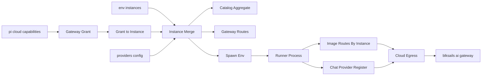
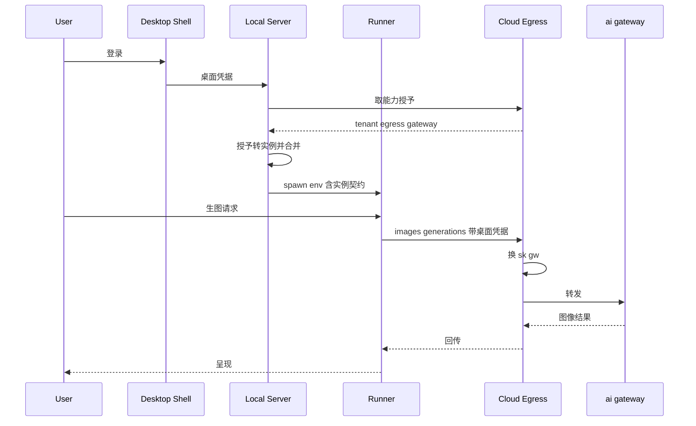
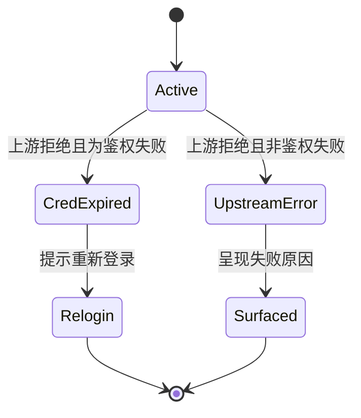

# Technical Design — desktop-aigc-egress

## Overview

桌面登录态下，云端签发的网关接入授予被转换为**一个网关实例**，与本地 env 配置的实例合并后交给既有的三个消费点（模型目录聚合 / 网关转发路由 / 本地 runner spawn env）。chat 面由此直接获得完整目录与可用模型；图像面则把 AIGC 的网关路由从「单实例常量 + 全局 env 占位符」改造为**按实例生成**，使其与 chat 面共用同一套 provider 身份与凭据来源。

设计的支点是一条既有事实：`multi-gateway-providers` 已把网关配置做成多实例，`GatewayInstanceConfig` 是纯数据，`resolveGatewayInstances(env)` 只是它的**一个来源**。本设计做的是**加一个来源**，而不是新建一条平行链路。

### Goals

- 桌面登录用户零本地配置即可使用网关图像模型与完整 chat 目录（1.1, 2.1, 2.2, 3.1）。
- 网关数据面凭据（`sk-gw-*`）永不到达本地（8.1, 8.2）。
- 图像与对话共用同一套 provider 身份，展示归属反映实际承接方（5.1, 5.3）。
- 未登录 / 未启用 / 非桌面宿主行为逐字节不变（1.2, 1.3, 1.4）。

### Non-Goals

- 视频 / 音频模态的出口与工具。
- pi-clouds 内部实现（代理、换钥、配额判定）——本设计只定义对它的期望（Requirement 9）。
- 把网关凭据下发本地的任何形态（架构 A 已否决）。
- 沙箱 / e2b 分支的多网关路由（`computeAiGatewaySessionEnv` 沿用既有行为，不在本 spec 改动）。

## Boundary Commitments

### This Spec Owns

- 云端授予 → 网关实例的**转换与合并**，含裸基址归一（D3）。
- AIGC 网关图像路由的**按实例参数化**与 provider 归属收口。
- 跨进程实例契约在**图像侧**的消费（复用 chat 侧既有键，见 Data Contracts）。
- 登录态变化（登入 / 登出）时网关来源能力的生效与失效。

### Out of Boundary

- **授予实例不挂前端换钥转发路由**（`/api/ai-gateway/<id>/*`）。实施期核实：该路由表在装配期一次性构建，且每个实例的凭据经 `InstanceEnvKeyResolver` **从 env 读取** —— 授予实例的凭据不在 env 里，天然不适用。前端也不需要直连网关：目录聚合在服务端内部完成，图像调用在 runner 进程内完成。若将来需要，属独立特性。
- `resolveGatewayInstances(env)` 自身的解析与校验逻辑（已实现且有测试，本设计只在其**产物之上**合并）。
- 云端出口的转发、换钥、重试与配额行为（Requirement 9 的外部契约）。
- `providers` 配置域的表单与校验（`multi-gateway-providers` 已交付，本设计只定义其与授予的优先级）。
- e2b / 沙箱分支的网关注入路径。

### Allowed Dependencies

依赖方向（左→右，只许向左 import）：

```
protocol → tool-kit → core → adapters → server / lib（装配层）
```

⚠ 本仓 `core` **依赖** `tool-kit`（已核实 `package.json`），故 tool-kit **不得** import core 或 adapters。这条约束直接决定了图像侧解析器的落点（见 Components §4）。

### Revalidation Triggers

以下任一变化都要求重新验证本设计：

- 跨进程实例契约键（`PI_WEB_AI_GATEWAY_SESSIONS` 及其 per-instance 前缀）的形态变更。
- `GatewayInstanceConfig` 字段增减。
- 云端出口地址是否含 `/v1` 的约定变化（D3 的输入前提）。
- pi-clouds 代理对 `GET` / `multipart` 请求的支持状况（Risk R2）。

## Architecture

### Existing Architecture Analysis

三个消费点已经存在并共用同一份实例列表（`lib/app/pi-handler.ts`）：

| 消费点 | 位置 | 作用 |
|---|---|---|
| 目录聚合 | `:695` `gatewayChatAggregate` | 逐实例取 `GatewayModelCatalog.get()` 快照拼接，供统一目录服务 |
| 转发路由 | `:1489-1509` | 逐实例挂 `/api/ai-gateway/*` 换钥转发 |
| 本地 spawn env | `:1199-1206` `computeAiGatewaySessionsSpawnEnv` | 逐实例下发 `基址 + 凭据 + 目录` 给 runner，runner 侧 `registerProvider` |

本设计**不改**这三处的逻辑，只改 `:689` 那一处的**取值来源**。

### Architecture Pattern & Boundary Map



关键决策（图中不自明的部分）：

- **合并顺序即优先级**：使用者配置 > env > 云端授予（6.1, 6.2）。合并在装配层一次完成，下游三个消费点看到的是同一份已定序列表。
- **凭据形态**：授予实例的 `apiKey` 是**桌面凭据**，不是 `sk-gw`。云端出口正是以 `Authorization: Bearer <桌面凭据>` 认证。字段名沿用 `apiKey` 但语义必须在代码注释中钉死，避免被误读为网关数据面密钥（8.1）。
- **图像与对话同源**：runner 进程内，chat provider 注册与图像路由生成读**同一份**实例契约，故不可能出现「对话能用图像不能用」的错位。

### Technology Stack

仅列受影响层，无新增外部依赖：

| 层 | 组件 | 角色变化 |
|---|---|---|
| core | `capability/types.ts` | 加一项**可选**授予字段；不升 `HOST_CONTRACT_VERSION`（契约 §1 允许同版本加可选成员） |
| adapters | `ai-gateway/` | 新增「授予 → 实例」转换模块 |
| tool-kit | `aigc/` | 网关图像路由参数化 + 轻量实例契约解析器 |
| lib（装配） | `pi-handler.ts` / 新增装配模块 | 实例来源合并 |

## File Structure Plan

### New Files

| 路径 | 责任 |
|---|---|
| `packages/adapters/src/ai-gateway/granted-instances.ts` | 授予 → `GatewayInstanceConfig` 的纯转换：裸基址归一（D3）、实例 id 校验、图像模型清单透传。无 IO |
| `packages/tool-kit/src/aigc/gateway-instances.ts` | 图像侧的跨进程实例契约**只读解析器**（runtime 层，允许读 env）+ 按实例生成图像路由的工厂 |
| `lib/app/gateway-grant-assembly.ts` | 装配层：合并「使用者配置 / env / 授予」三源实例，定序、去重、产出冲突可见性信息（6.3） |

### Modified Files

| 路径 | 改动 |
|---|---|
| `packages/core/src/capability/types.ts` | 新增可选 `gateway?: CapabilityGatewayGrant`（含 `baseUrl` / `imageModels?` / `expiresAt`）；保持 pi-SDK-free |
| `packages/adapters/src/auth/desktop-capabilities-client.ts` | 解析新授予字段；单项解析失败**只使该字段缺失**，不抛（既有不变式） |
| `packages/adapters/src/ai-gateway/session-model-source.ts` | per-instance 契约增加可选图像模型清单键；chat 侧行为不变 |
| `packages/tool-kit/src/aigc/providers/ai-gateway.ts` | `AI_GATEWAY_CONFIG` 常量参数化为按实例构造；`provider` 由常量 `"cloudflare"` 改为实例 id（5.1, 5.2） |
| `packages/tool-kit/src/aigc/tools/image-generation.ts`<br>`packages/tool-kit/src/aigc/tools/image-edit.ts` | 静态 `AI_GATEWAY_IMAGE(_EDIT)_ROUTES` 改为按实例生成的工厂；保留静态白名单作为模型集合来源 |
| `packages/tool-kit/src/aigc/extension.ts` | 网关路由并入判据由「单实例 env 非空」改为「解析到的实例列表非空」，逐实例并入 |
| `packages/tool-kit/src/aigc/model-catalog.ts` | 网关来源条目的 `provider` 随实例；移除写死的 `"cloudflare"` 归属 |
| `lib/app/pi-handler.ts` | `:689` 实例来源改为经 `gateway-grant-assembly` 合并；其余三个消费点零改动 |
| `lib/app/auth-egress-assembly.ts` | 登录态变化时使授予实例与其目录快照失效（4.3, 8.4） |

## System Flows

### 桌面登录后图像生成



### 出口失效判定



关键决策：两类失败必须可区分（7.1, 7.2），且**都不触发自动换 provider**（7.3）。

## Requirements Traceability

| Requirement | 摘要 | 组件 | 关键接口 |
|---|---|---|---|
| 1.1, 1.2, 1.3 | 登录即用 / 未启用不变 / 未登录不请求 | `gateway-grant-assembly` | 合并函数在无授予时返回与 env 解析逐字节相同的列表 |
| 1.4 | 非桌面宿主不受影响 | `gateway-grant-assembly` | 沿用 `DESKTOP_MARKER_ENV` 判据 |
| 1.5 | 授予整体加载失败即拒绝登录 | `desktop-capabilities-client` | `loadStatic` 既有「失败即抛」语义，不改 |
| 2.1, 2.2, 2.3 | 文生图 / 图像编辑 / Canvas | `aigc/gateway-instances`、两个工具 | 按实例生成的 `ImageRoute[]` |
| 2.4 | 只出示桌面凭据 | `granted-instances`、装配层 | `apiKey` 语义钉死为桌面凭据 |
| 2.5 | 禁用模型对网关来源同样生效 | `extension.ts` | 并入后统一走 `filterRoutes`（既有行为） |
| 3.1, 3.2, 3.4, 3.5 | 目录可见 / 去重 / 拉取失败降级 / 可分辨来源 | 既有目录聚合 | 零改动，由合并后的实例列表驱动 |
| 3.3 | 目录拉不到时不清空 | 既有 `GatewayModelCatalog` | 既有 stale-while-revalidate + fail-soft |
| 4.1, 4.2 | 能选中的就是真能跑的 | `granted-instances` | 图像清单 = 静态白名单 ∩ 授予下发清单（D5） |
| 4.3, 8.4 | 登录态变化即更新 / 登出即失效 | `auth-egress-assembly` | 授予实例与目录快照失效 |
| 4.4 | 设置页与会话选择器一致 | 既有统一目录服务 | 零改动（同一目录服务的两个消费面） |
| 5.1, 5.2, 5.3, 5.4 | provider 归属正确 / 同名同义 | `providers/ai-gateway.ts`、`model-catalog.ts` | `provider` = 实例 id；上游厂商名降级为元数据 |
| 6.1, 6.2, 6.3, 6.4 | 使用者配置优先且冲突可见 | `gateway-grant-assembly` | 合并定序 + 冲突信息产出 |
| 7.1, 7.2 | 鉴权失败与其他失败可区分 | `createGatewayImageRoutes` 的错误分类 + 装配层 | 上游状态 → 两类判别 |
| 7.3 | 失败不自动换 provider | 两个图像工具 | 路由失败即终止，不做 provider 回退（既有行为，须以测试钉住） |
| 7.4 | 会话内可见而非仅入日志 | 既有会话错误流（`stream-error-surfacing`） | 图像工具错误经既有工具错误通道进入会话 |
| 7.5, 8.3 | 文案不含凭据 | 全部错误路径 | 既有脱敏纪律 |
| 8.1, 8.2 | 凭据不落盘 / 本地只持桌面凭据 | `granted-instances`、装配层 | `apiKey` 语义钉死 |
| 8.4 | 登出即失效 | `auth-egress-assembly` | 授予实例与目录快照失效 |
| 9.1 | 出口接受三类请求 | — | 外部契约，以真实出口实测 |
| 9.2 | 凭据无效返回可区分鉴权失败且不打上游 | — | 外部契约，pi-clouds 既有 `requireCurrentUser` 分支 |
| 9.3 | 不泄露网关密钥 | — | 外部契约，pi-clouds 既有代理头净化 |
| 9.4 | 云端不具备时降级不绕开 | `gateway-grant-assembly` | 授予缺失即无网关来源模型 |

## Components and Interfaces

| 组件 | 域 | 意图 | Requirements | 契约类型 |
|---|---|---|---|---|
| `CapabilityGatewayGrant` | core / capability | 云端下发的网关接入授予 | 1.1, 4.1 | State |
| `grantedGatewayInstance` | adapters / ai-gateway | 授予 → 实例的纯转换 | 1.1, 4.1, 5.1, 8.2 | Service |
| `mergeGatewayInstanceSources` | lib / 装配 | 三源合并与定序 | 6.1, 6.2, 6.3 | Service |
| `resolveGatewayImageInstances` | tool-kit / aigc | 图像侧实例契约解析 | 2.1, 2.2 | Service |
| `createGatewayImageRoutes` | tool-kit / aigc | 按实例生成图像路由 | 2.1, 2.2, 5.1 | Service |

### core / capability

#### `CapabilityGatewayGrant`

**意图**：把「该账号可用的网关出口」表达为一项独立能力，与既有 `egress`（chat 出口）并列而非混用——两者的 URL 语义与消费方都不同。

```ts
/** 网关接入授予（契约 §4.1 的可选增量成员，不升 HOST_CONTRACT_VERSION）。 */
export interface CapabilityGatewayGrant extends CapabilityGrantBase {
  /**
   * 网关出口根。⚠ 与 `egress.baseUrl` 不同：此处约定为**裸基址**语义的来源，
   * 消费方必须经归一化后再拼接路径（见 design D3）。
   */
  readonly baseUrl: string;
  /**
   * 可选：该账号可用的图像模型 id 清单。
   * 缺失 = 云端未声明 → 消费方回退内置白名单（4.2 的降级路径）。
   */
  readonly imageModels?: ReadonlyArray<string>;
}
```

`CapabilitySnapshot` 增加 `readonly gateway?: CapabilityGatewayGrant;`。字段独立可选，缺失即该能力不可用（既有不变式 1）。

**Implementation Notes**

- 保持 core 主 barrel 的 pi-SDK-free 纪律：本类型只依赖同模块纯类型。
- 单项解析失败不抛（只使字段缺失）；整体加载失败仍抛（1.5）。

### adapters / ai-gateway

#### `grantedGatewayInstance`

**意图**：把授予转换为与 env 来源**同构**的 `GatewayInstanceConfig`，使下游无法分辨实例来自哪一源。

```ts
export interface GrantedInstanceInput {
  readonly grant: CapabilityGatewayGrant;
  /** 桌面凭据（作为该实例的请求凭据）。 */
  readonly credential: string;
  /** 实例标识；须通过既有 provider id 形态校验且不撞保留名。 */
  readonly instanceId: string;
}

/**
 * @returns 授予有效 → 实例配置；凭据为空 / 地址非法 → `undefined`（该能力视为不可用，
 *          调用方降级而非抛错——与 CapabilityProvider 的既有语义一致）。
 */
export function grantedGatewayInstance(
  input: GrantedInstanceInput,
): GatewayInstanceConfig | undefined;
```

**Implementation Notes**

- **D3 裸基址归一是本函数的首要职责**：输入形如 `…/api/desktop/egress/v1`（`cloud-defaults.ts` 固化值即含 `/v1`），必须剥为 `…/api/desktop/egress`。下游 `model-catalog.ts:251` 拼 `${baseUrl}/v1/models`、AIGC provider 拼 `${…}/v1`，不剥即产生 `/v1/v1`。此项须有以固化默认值为输入的单测。
- `apiKey` 字段承载**桌面凭据**，注释必须写明它不是 `sk-gw`（8.1 的可读性防线）。
- `allowedOwners` 取宽松默认——云端出口的上游归属由网关侧决定，本地不应二次收窄。

### lib / 装配

#### `mergeGatewayInstanceSources`

**意图**：三源合并的唯一定序点。

```ts
export interface InstanceMergeResult {
  readonly instances: readonly GatewayInstanceConfig[];
  /** 因使用者配置优先而被让位的实例 id（供 6.3 的可见性呈现）。 */
  readonly overriddenByUser: readonly string[];
}

export function mergeGatewayInstanceSources(input: {
  readonly fromEnv: readonly GatewayInstanceConfig[];
  readonly fromGrant?: GatewayInstanceConfig;
  readonly userConfiguredIds: ReadonlySet<string>;
}): InstanceMergeResult;
```

**Implementation Notes**

- 无授予且无使用者覆盖时，`instances` 必须与 `fromEnv` **逐元素相等**（1.2 的零变化保证，须有单测）。
- 冲突让位不是静默丢弃：`overriddenByUser` 必须被呈现（6.3）。
- 让位分两类且**不可合用一个字段**：`overriddenByUser`（使用者的选择，要呈现）与 `grantShadowedByEnv`（部署方配置更具体，属正常，记诊断即可）。混同会让「我改的设置生效了」和「部署方压过了云端」在界面上长得一样。

#### `GrantedGatewayRuntime`（实施期新增）

**意图**：把授予实例的求值从**装配期一次**改为**按需惰性**。

**为什么必须有它**：初版设计把三源合并画在装配期。实施期核实 `AuthSessionState` 是运行期可变的进程级单例（鉴权端点写、会话 spawn 读），于是装配期求值的实例列表在用户登录后**永远不会更新** —— 直接违反 4.3「登录态变化无需重启即生效」与 8.4「登出即失效」。这不是实现细节，是设计错误，故回改于此。

```ts
export interface GrantedGatewayRuntime {
  /** 按当前登录态求值；凭据未变时复用上次结果与其目录快照。 */
  current(): InstanceMergeResult & {
    readonly catalogs: ReadonlyMap<string, GatewayModelCatalog>;
  };
}
```

**Implementation Notes**

- 缓存键必须包含**凭据指纹**：切号或登出后复用旧目录，等于「已登出仍能看到并调用」（8.4）。
- 授予不可用（未登录 / 无 `gateway` 授予 / 转换失败）时，`current()` 必须退化为纯 env 结果，且与本特性引入前逐元素相等（1.2）。
- 三个消费点中，目录聚合与会话下发改经本组件；前端转发路由不经过（见 Out of Boundary）。

### tool-kit / aigc

⚠ 本层受依赖方向硬约束：**不得** import core 或 adapters。故图像侧需要自己的契约解析器，而非复用 `session-model-source.ts`。

#### `resolveGatewayImageInstances`

**意图**：在 runner 进程内，从跨进程实例契约还原出图像路由所需的最小实例信息。

```ts
export interface GatewayImageInstance {
  readonly instanceId: string;
  /** 裸基址（装配层已归一，本层不再处理 `/v1`）。 */
  readonly baseUrl: string;
  readonly apiKey: string;
  /** 云端声明的可用图像模型；缺失 = 回退内置白名单。 */
  readonly imageModels?: readonly string[];
}

/** runtime 层，允许读 env；声明层不得调用（双入口硬约束）。 */
export function resolveGatewayImageInstances(
  env: NodeJS.ProcessEnv,
): readonly GatewayImageInstance[];
```

**Implementation Notes**

- **防漂移是本组件的主要风险**：它与 adapters 的 `resolveAiGatewaySessionSpecsFromEnv` 读**同一批 env 键**。必须有**契约互锁测试**：同一份 env 输入喂给两个解析器，实例 id / baseUrl / apiKey 三项结果一致。缺这条测试，两份解析会在未来悄悄分家。
- 不做合法性 fail-fast：解析不出的实例跳过（fail-soft），与既有网关侧纪律一致。

#### `createGatewayImageRoutes`

**意图**：取代写死 provider 的静态路由表。

```ts
export function createGatewayImageRoutes(
  instance: GatewayImageInstance,
): { readonly generation: readonly ImageRoute[]; readonly edit: readonly ImageRoute[] };
```

**Implementation Notes**

- `provider` 取 `instance.instanceId`（5.1, 5.2）；上游厂商名若有，作为可展示元数据而非身份（5.4）。
- 模型集合 = 内置静态白名单 ∩ `instance.imageModels`（后者缺失则取白名单全集）（D5, 4.1）。
- 路由键须在多实例并存时保持唯一——同一模型经不同实例暴露时不得互相覆盖。
- **声明层不读 env**：基址与凭据一律来自入参 `instance`。这是本改造最容易违反 steering 双入口约束的地方。

## Error Handling

### Error Strategy

沿用既有分层：能力**不可用**以字段缺失表达并降级；能力**加载失败**抛错并拒绝进入登录态。本设计只新增「运行期出口失效」的分流。

### Error Categories and Responses

| 类别 | 触发 | 响应 | Requirement |
|---|---|---|---|
| 授予缺失 | 云端未下发 `gateway` | 静默降级，无网关来源模型，无错误提示 | 1.2 |
| 授予整体加载失败 | 网络 / 401 / 响应损坏 | 抛错，拒绝进入已登录态 | 1.5 |
| 出口鉴权失败 | 桌面凭据过期或无效 | 明确提示重新登录 | 7.1 |
| 出口其他失败 | 配额、上游异常 | 呈现失败原因，与鉴权失败可区分 | 7.2 |
| 目录拉取失败 | 网关目录不可达 | 保留既有清单，标记目录不完整，不清空 | 3.3 |
| 实例解析失败 | 契约键损坏 | 跳过该实例（fail-soft），其余实例不受影响 | 3.3 |

**共同约束**：任何错误路径的文案都不得包含桌面凭据或网关密钥（7.5, 8.3）。

**会话内可见性（7.4）**：图像工具的失败经既有工具错误通道进入会话流（`stream-error-surfacing` 已交付），本设计不新建错误呈现面。⚠ 已知边界：`desktop-cloud-login` 留下的 `markSessionAuthFailure` 钩子**尚未接入传输错误流**，故「会话中鉴权失败 → 自动重登提示」目前由通用会话错误呈现承担。本设计沿用该现状（7.1 的提示文案由错误分类给出），不把跨组件的钩子接线纳入本 spec 范围。

### Monitoring

沿用既有 logger 命名空间；新增日志不得以凭据作为参数（既有脱敏纪律）。

## Testing Strategy

### 单元测试

- `grantedGatewayInstance`：以 `cloud-defaults.ts` 固化默认值（**含 `/v1`**）为输入，断言产出 `baseUrl` 为裸基址——这是 D3 的直接守卫，也是 Risk R1 的唯一机械防线。
- `grantedGatewayInstance`：凭据为空 / 地址非法 → `undefined`，不抛。
- `mergeGatewayInstanceSources`：无授予无覆盖时结果与 `fromEnv` 逐元素相等（1.2）。
- `mergeGatewayInstanceSources`：使用者配置与授予同 id → 使用者胜且进入 `overriddenByUser`（6.1, 6.3）。
- `createGatewayImageRoutes`：`provider` 等于实例 id，且在两个不同实例下产出不同归属（5.1, 5.2）。
- `createGatewayImageRoutes`：`imageModels` 缺失 → 白名单全集；给出子集 → 取交集（D5, 4.1）。
- `CapabilitySnapshot` 解析：`gateway` 字段损坏只使该字段缺失，不影响 `egress` / `sources`（既有不变式）。

### 契约互锁测试

- 同一份 env 输入分别喂 `resolveGatewayImageInstances` 与 `resolveAiGatewaySessionSpecsFromEnv`，断言实例 id / baseUrl / apiKey 一致。**这条测试是两份解析器不分家的唯一保证。**

### 集成测试

- 真实 runner 子进程 + stub 出口：断言图像请求的目标 URL **不含 `/v1/v1`**、`Authorization` 为桌面凭据、且请求确实发往出口而非网关直连。
- 对照组：未登录态下 runner 的图像路由集合与本特性引入前逐字节一致（1.2）。
- 对照组：e2b / 沙箱分支的注入未受影响（Risk R4）。

### E2E

- 桌面登录 → 模型选择器出现网关来源图像模型 → 生图成功（2.1）。
- 登出 → 网关来源模型从选择器消失（8.4）。
- 桌面凭据失效 → 生图失败并提示重新登录，且未自动换 provider（7.1, 7.3）。

### 外部契约验证（Requirement 9）

- 以真实（或本地起的）pi-clouds 出口实测三类请求：`POST /v1/images/generations`、`POST /v1/images/edits`（multipart）、`GET /v1/models`。
- ⚠ `multipart` 与 `GET` 路径的代理行为**尚未核验**（Risk R2）。若实测不通，按 9.4 呈现为不可用并记为 pi-clouds 兄弟 spec 依赖，**不在 pi-web 侧绕开**。

## Security Considerations

- 网关数据面密钥不进入本地任何介质——本设计中本地进程持有的最高凭据是桌面凭据本身（8.1, 8.2）。
- `GatewayInstanceConfig.apiKey` 在授予来源下承载桌面凭据。它会经 spawn env 下发 runner，与既有 `providerKeys` **同一信任边界、同一形态**（`desktop-cloud-login` 已确立的取舍），不新增暴露面。
- 登出必须使授予实例与其目录快照失效，否则会出现「已登出仍可调用」的窗口（8.4）。

## Migration Strategy

无数据迁移。行为迁移分三步，每步可独立验证：

1. 契约与转换（core + adapters）——此时无任何行为变化，纯加法。
2. 装配合并（lib）——chat 面开始生效，图像面仍走旧路径。
3. 图像路由参数化（tool-kit）——图像面生效，`provider` 归属同时收口。

回滚点：第 2 步之前，系统行为与今天完全一致；第 2、3 步各自可独立回退。
