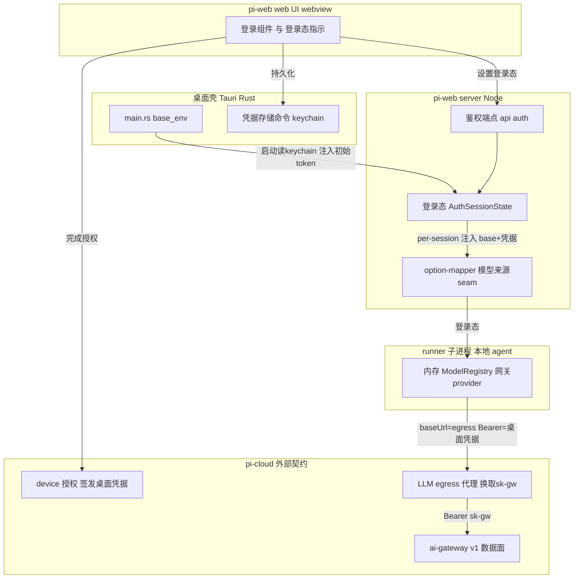
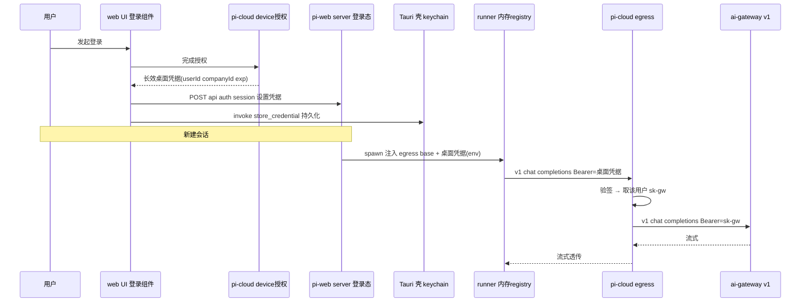
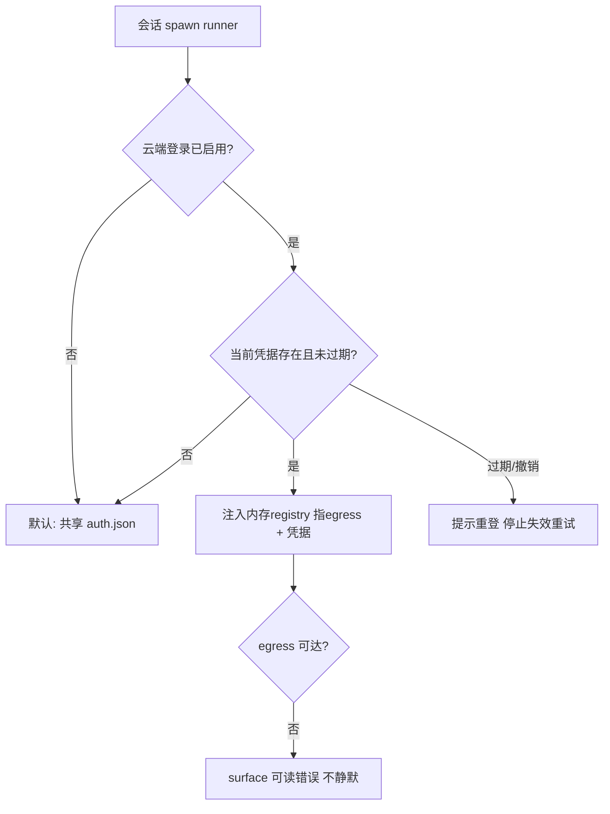

# 技术设计 — desktop-cloud-login

## Overview

**目的**：给 pi-web 桌面版（Tauri 桌面壳 + 随包 Node sidecar + 本地 agent）增加**登录能力**——桌面用户用 pi-cloud 账号登录后，会话的主对话模型请求以其**用户身份**经 pi-cloud 云端 egress 出口发出、按其额度计费，网关数据面 key（sk-gw）**永不落本地**。

**用户**：桌面版终端用户（登录后用云端额度）；现有本地单机用户（未登录时零行为变化）；运维/安全方（凭据边界不变式）。

**影响**：把本地 runner 的「模型来源」从今日的「仅共享 `~/.pi/agent` 本地凭据」扩展为「可注入的会话模型来源」——登录态注入一个指向云端 egress 的**内存 ModelRegistry**（pi SDK 原生 seam，复用共享 `auth.json`、不落盘、不注入独立 agentDir），未登录态保持今日默认。新增桌面壳的 OS keychain 凭据存储与 pi-web server 的登录态管理；模型换钥收口在 pi-cloud 云端（外部契约）。

### Goals
- 桌面用户经登录 UI 获取长效桌面凭据，登录态下主对话经云端 egress 以其身份出口计费。
- sk-gw 全程不落本地磁盘、不进 runner 子进程、不下发前端。
- 登录为**叠加能力**：未登录/未启用时行为与当前桌面版完全一致，共享 `~/.pi/agent` 不变。
- 守 desktop Req 5.5「不注入 agentDir」不变式。

### Non-Goals
- **按用户隔离会话数据**（登录仅隔离模型计费身份；`~/.pi/agent` 仍共享）——明确不做。
- pi-clouds 侧的 device 授权服务端、桌面 token 签发/验签、LLM egress 代理端点、sk-gw 换取/映射、计费——**外部契约，另仓另立 spec**。
- AIGC 图像等非主对话流量的网关出口（本 spec 只收口主对话 LLM）。
- 沙箱（e2b/ACS）会话的身份注入（已有 e2b 网关 env 装配，与桌面本地路径不同，不在本 spec）。

## Boundary Commitments

### This Spec Owns（pi-web 仓）
1. **桌面壳凭据存储与注入**：Tauri command 读/写/清 OS keychain 中的桌面凭据；启动时经 `base_env` 把凭据注入 sidecar 初始态；登录相关 command 的 ACL 声明。
2. **pi-web server 登录态**：进程内「当前桌面凭据 + 用户身份」状态；登录/登出/查询身份的 HTTP 端点；per-session 把 egress 配置（base + 凭据）注入 runner。
3. **runner 模型来源 seam**：`option-mapper.ts` 处按登录态注入内存 ModelRegistry（登录=指向 egress 的网关 provider；未登录=默认共享 auth.json）。
4. **登录 UI 与登录态 UX**：web UI 登录组件、登录态指示、过期/切号/续期提示、契约缺失降级。
5. **启用门控**：判定「云端登录是否启用」，未启用零注册、无登录入口。

### Out of Boundary（pi-clouds 仓，外部契约）
- device 授权 / 桌面凭据签发端点、`requireCurrentUser` 桌面 token 验签分支。
- LLM egress 代理端点（认桌面凭据 → 解 AuthContext → 取该用户 sk-gw → 转发 ai-gateway `/v1/*` → 流式回传）。
- `pi_clouds.gateway_keys` 映射（公司×用户→sk-gw）的运行时接线、sk-gw 签发、网关计费/配额。
- Supabase 账号体系。

### Allowed Dependencies
- pi SDK `@earendil-works/pi-coding-agent@0.80.3` 的 `createAgentSessionServices({authStorage, modelRegistry})` / `ModelRegistry.inMemory + registerProvider` / `AuthStorage.create` seam。
- main 已有：`packages/server/src/tokens/`（可选窄 token 强化）、附件 env 下发链、`assemble-spawn` env 装配、desktop `base_env`/`build_child_env`。
- OS keychain（keyring crate 或 tauri-plugin，实现期定）。
- pi-cloud 外部契约端点（经 HTTP，契约形状见本文 §Components）。

### Revalidation Triggers
- 桌面凭据 token 格式 / payload 字段变化（userId/companyId/scope/exp）。
- egress 端点路径 / 认证头 / 请求响应形态（OpenAI 兼容）变化。
- pi SDK 模型注入 seam（`createAgentSessionServices` 签名）跨版本变化。
- 「不落本地」定义变更（B-pure ↔ B2）→ runner 注入的 baseUrl 目标与换钥位置变化。
- desktop `base_env` 注入键名 / keychain 条目 schema 变化。

## Architecture

### Existing Architecture Analysis
- **桌面壳**：`main.rs:55-72 base_env()`（仅 `PI_WEB_DEFAULT_SOURCE`/`_CWD`）→ `server_supervisor.rs:76-98 build_child_env`（叠运行期键，`.envs()` 继承父 env）；command 注册 `main.rs:261-265`；ACL `capabilities/default.json:14` + `permissions/*.toml`；Req 5.5 硬锁 `server_supervisor.rs:93-96 debug_assert` + 回归测试。**零持久化先例**（无 keyring/store）。
- **pi-web server**：本地 runner spawn `pi-handler.ts:642-675`（真实 providerKeys 直透）；runner 起 runRpcMode 经 `option-mapper.ts:281-287`（未注入 modelRegistry/authStorage → SDK 从 agentDir 默认派生共享 `~/.pi/agent/{models,auth}.json`）。
- **已有网关资产**（main）：`ai-gateway/`（X）+`llm-gateway/`+`tokens/`（Y）反代仅 e2b 分支用；本地路径当前**零网关**。userId 接缝 `key-resolver.ts:14-17` 留而两端空。
- **pi SDK seam**：`createAgentSessionServices` 接受注入 `authStorage`/`modelRegistry`；`ModelRegistry.inMemory(authStorage)+registerProvider({baseUrl,apiKey,authHeader})` 纯内存零落盘；`authHeader:true`→`Bearer`。

### Architecture Pattern & Boundary Map



**关键决策**：
- **模式=可注入的会话模型来源（策略）**：`option-mapper` 依登录态选策略——登录→内存 ModelRegistry 指 egress；未登录→SDK 默认（共享 auth.json）。单一 seam、两实现。
- **换钥位置=B-pure（云端）**：runner 只持桌面凭据打 egress，sk-gw 在云端换取，永不到本地。（B2 备选见 §Open Questions，评审待确认。）
- **凭据存储归原生壳（keychain）、登录态归 server（内存）、登录编排归 web UI**：三者职责不重叠；启动经 `base_env` 播种、运行时经端点更新。
- **依赖方向**：protocol ← server ← (web UI / runner 注入)；desktop 壳经 env/HTTP 与 server 解耦；pi-cloud 经 HTTP 契约。

### Technology Stack

| Layer | Choice / Version | Role in Feature | Notes |
|-------|------------------|-----------------|-------|
| Desktop shell | Tauri v2 (Rust) + keyring crate（或 tauri-plugin-store 降级） | keychain 凭据存储、command、启动注入 | 新增依赖；跨平台 keychain 实现期验证 |
| Backend | `@blksails/pi-web-server` (Node/TS strict) | 登录态、鉴权端点、runner egress 注入 | 复用 `tokens/`（可选窄 token） |
| Agent runtime | `@earendil-works/pi-coding-agent@0.80.3` | `createAgentSessionServices({authStorage,modelRegistry})` 注入 seam | 唯一改动 `option-mapper.ts:281-287` |
| Web UI | `@blksails/pi-web-ui` / app (React + AI Elements) | 登录组件、登录态 UX | 新登录组件 + 鉴权 hook |
| External | pi-cloud（另仓契约） | device 授权、桌面 token 签发/验签、egress 代理、sk-gw | Out of boundary |

## File Structure Plan

### 新增 / 修改（pi-web 仓）

**桌面壳（Rust）**
```
desktop/src-tauri/src/
├── credential_store.rs   # 新增: keychain 读/写/清 桌面凭据 (store/load/clear command)
├── main.rs               # 改: base_env() 启动读 keychain 注入 PI_WEB_DESKTOP_CREDENTIAL; generate_handler! 加 3 command
└── ...
desktop/src-tauri/permissions/
└── credential.toml       # 新增: allow-store/load/clear-credential ACL
desktop/src-tauri/capabilities/default.json  # 改: permissions 数组加 3 项
desktop/src-tauri/Cargo.toml                 # 改: 加 keyring 依赖
```

**pi-web server（Node/TS）**
```
packages/server/src/auth/
├── auth-session-state.ts      # 新增: 进程内当前桌面凭据+用户身份 (set/clear/get)
├── credential.ts              # 新增: 桌面凭据解析(读 payload userId/companyId/exp,不验签—验签在云端) + 过期判定
├── egress-model-source.ts     # 新增: 登录态→构造内存 ModelRegistry(registerProvider 指 egress) 的纯工厂
└── auth-routes.ts             # 新增: createAuthRoutes 注入 (POST/DELETE /api/auth/session, GET /api/auth/me)
packages/server/src/runner/option-mapper.ts   # 改:281-287 按会话身份注入 {authStorage, modelRegistry}
lib/app/pi-handler.ts                          # 改: 挂载 auth 路由; local 分支把当前凭据经 spawn env 传 runner
lib/app/auth-egress-assembly.ts                # 新增: 纯函数—计算 runner egress env(base+凭据) + 启用门控 resolve
```

**web UI（React）**
```
components/auth/
├── login-dialog.tsx           # 新增: 登录组件(承载授权流,拿桌面凭据→POST server + invoke Tauri 持久化)
└── login-status.tsx           # 新增: 登录态指示(有效/失效/续期中) + 登出/切号
hooks/use-desktop-auth.ts      # 新增: 鉴权 hook(读 /api/auth/me, 登录/登出, 过期surface)
lib/transport/*                # 改(若需): egress 失效错误 surface 到会话
```

**协议（按需）**
```
packages/protocol/src/config/domains/  # 可能新增 auth 相关轻量类型(登录态/身份 DTO); 若仅 server↔UI 私有可不入 protocol
```

### Modified Files 摘要
- `main.rs` / `server_supervisor.rs` — 启动注入凭据（经 base_env，守 5.5 debug_assert）。
- `option-mapper.ts:281-287` — 注入模型来源（唯一 runner 改动）。
- `pi-handler.ts` — 挂鉴权路由 + local 分支传凭据 env。

## System Flows

### 登录 → 出口（B-pure）时序


### 登录态判定（会话模型来源 seam）

- 门控条件：启用开关（类比 `AI_GATEWAY_BASE_URL`，键名实现期定）+ 凭据在期。任一不满足回落本地路径（R4）。

## Requirements Traceability

| Req | Summary | Components | Interfaces | Flows |
|-----|---------|------------|------------|-------|
| 1.1 | 启用时呈现登录入口 | login-dialog, use-desktop-auth, 启用门控 | GET /api/auth/me | 登录态判定 |
| 1.2 | 授权流→长效桌面凭据 | login-dialog | (外)device 授权契约 | 登录时序 |
| 1.3 | 展示登录用户标识 | login-status, use-desktop-auth | GET /api/auth/me | — |
| 1.4 | 取消/超时→不写凭据 | login-dialog | — | — |
| 1.5 | 拒绝→可读失败 | login-dialog | (外)device 契约错误 | — |
| 2.1 | 安全存储不明文落盘 | credential_store.rs (keychain) | store_credential | — |
| 2.2 | 只存身份凭据不存 sk-gw | credential_store.rs, auth-session-state | — | — |
| 2.3 | 重启免密恢复 | main.rs base_env, credential_store.rs | load_credential | — |
| 2.4 | 近/到期→续期或重登路径 | credential.ts, login-status | GET /api/auth/me | 登录态判定 |
| 2.5 | 登出清凭据回退未登录 | credential_store.rs, auth-routes | DELETE /api/auth/session, clear_credential | — |
| 3.1 | 登录态请求经 egress 带凭据 | egress-model-source, auth-egress-assembly, option-mapper | createAgentSessionServices | 登录/出口时序 |
| 3.2 | 用云端额度不用本地key | egress-model-source | registerProvider(baseUrl,apiKey,authHeader) | 出口时序 |
| 3.3 | sk-gw 不留本地 | (设计不变式: B-pure 换钥在云端) | — | 出口时序 |
| 3.4 | 流式逐帧透传 | egress 契约(消费) | OpenAI SSE | 出口时序 |
| 3.5 | 超时≥网关上限 | auth-egress-assembly | — | — |
| 3.6 | egress 不可达→可读错误 | use-desktop-auth, transport | — | 登录态判定 |
| 3.7 | 身份失效→提示重登停重试 | credential.ts, use-desktop-auth | — | 登录态判定 |
| 4.1 | 未登录用本地凭据 | option-mapper 默认策略 | — | 登录态判定 |
| 4.2 | 未启用无登录入口行为一致 | 启用门控, login-dialog | — | 登录态判定 |
| 4.3 | 两态共享 ~/.pi/agent 不切目录 | option-mapper (复用 authStorage) | — | — |
| 4.4 | 登出后回退本地或提示未配置 | option-mapper, auth-session-state | — | — |
| 5.1 | sk-gw 不下发前端 | (B-pure 不变式) | — | — |
| 5.2 | 凭据/sk-gw 不入历史/附件/日志 | auth-session-state, egress-model-source | — | — |
| 5.3 | 不注入 agentDir 守5.5 | option-mapper(内存registry不改agentDir), base_env | — | — |
| 5.4 | 原生命令 ACL 门控 | credential.toml, capabilities/default.json | store/load/clear command | — |
| 6.1 | 会话中过期停用提示 | credential.ts, use-desktop-auth | — | 登录态判定 |
| 6.2 | 切号替换凭据 | auth-session-state, credential_store.rs | POST /api/auth/session | — |
| 6.3 | 续期/重登态明确指示 | login-status | GET /api/auth/me | — |
| 7.1 | 依赖 pi-cloud device 签发不自签 | login-dialog | (外)契约 | — |
| 7.2 | 依赖 pi-cloud egress 换钥不本仓映射 | egress-model-source | (外)契约 | 出口时序 |
| 7.3 | 契约缺失→提示降级本地 | 启用门控, auth-egress-assembly | — | 登录态判定 |

## Components and Interfaces

| Component | Domain/Layer | Intent | Req | Key Deps (P0/P1) | Contracts |
|-----------|--------------|--------|-----|------------------|-----------|
| credential_store.rs | Desktop shell | keychain 存/取/清桌面凭据 | 2.1,2.3,2.5,5.4,6.2 | keyring(P0) | Service, State |
| main.rs base_env 改 | Desktop shell | 启动读 keychain 注入 server 初始态 | 2.3,5.3 | credential_store(P0) | State |
| auth-session-state.ts | Server | 进程内当前凭据+身份 | 2.2,4.4,5.2,6.2 | credential.ts(P0) | State |
| credential.ts | Server | 解析凭据 payload + 过期判定(不验签) | 2.4,3.7,6.1 | — | Service |
| egress-model-source.ts | Server | 登录态→内存 ModelRegistry 工厂 | 3.1,3.2,3.3,5.2,7.2 | pi SDK(P0) | Service |
| auth-egress-assembly.ts | Server (app) | 计算 egress env + 启用门控 | 3.1,3.5,4.2,7.3 | auth-session-state(P0) | Service |
| auth-routes.ts | Server | 登录态 HTTP 端点 | 1.3,2.5,6.2,6.3 | auth-session-state(P0) | API |
| option-mapper 改 | Server (runner) | 注入 {authStorage, modelRegistry} | 3.1,4.1,4.3,5.3 | pi SDK(P0), egress-model-source(P0) | Service |
| login-dialog.tsx | Web UI | 承载授权流拿凭据→双汇 | 1.1,1.2,1.4,1.5,7.1 | use-desktop-auth(P0), Tauri(P1) | — |
| login-status.tsx | Web UI | 登录态指示+登出/切号 | 1.3,6.3 | use-desktop-auth(P0) | — |
| use-desktop-auth.ts | Web UI | 鉴权 hook | 1.1,3.6,3.7,6.1 | auth-routes(P0) | State |

### Server

#### egress-model-source.ts
| Field | Detail |
|-------|--------|
| Intent | 依会话身份产出注入 pi SDK 的 `{authStorage, modelRegistry}`（登录=网关 provider；未登录=默认） |
| Requirements | 3.1, 3.2, 3.3, 4.1, 4.3, 5.2, 7.2 |

**Responsibilities & Constraints**
- 登录态：`AuthStorage.create(getAuthPath())`（复用共享 auth.json）+ `ModelRegistry.inMemory(authStorage)` + `registerProvider("pi-cloud", { baseUrl: <egressBase>, apiKey: "$PI_WEB_DESKTOP_CREDENTIAL", authHeader: true, models })`。**纯内存零落盘**；provider 名用 `pi-cloud` 命名空间避免与 auth.json 撞名（否则 auth.json key 覆盖，见 research §7 陷阱）。
- 未登录态：返回 `undefined` → option-mapper 走 SDK 默认（共享 auth.json + models.json），不注入。
- 不落 sk-gw（B-pure 云端换钥）；不写日志/历史；不改 agentDir（守 5.3/5.5）。

**Dependencies**：Inbound: option-mapper(P0)。Outbound: pi SDK ModelRegistry/AuthStorage(P0)。External: egress 契约(P0，仅提供 baseUrl，运行时由 runner 发起)。

**Contracts**: Service ✔ / State ✔

##### Service Interface
```typescript
interface SessionModelSource {
  /** 登录且启用→注入项；否则 undefined(SDK 默认)。 */
  resolve(input: { credentialEnvVar?: string; egressBaseUrl?: string; models: readonly string[] }):
    { authStorage: AuthStorage; modelRegistry: ModelRegistry } | undefined;
}
```
- Preconditions：credentialEnvVar 指向的 env 值在 runner 进程可读（由 spawn env 下发）。
- Postconditions：注入的 registry 仅含网关 provider；auth 复用共享路径。
- Invariants：不写盘、不改 agentDir、不含 sk-gw。

#### auth-routes.ts
**Contracts**: API ✔

##### API Contract
| Method | Endpoint | Request | Response | Errors |
|--------|----------|---------|----------|--------|
| POST | /api/auth/session | `{ credential: string }` | `{ userId, companyId, exp }` | 400 非法凭据, 401 过期 |
| DELETE | /api/auth/session | — | `{ ok: true }` | — |
| GET | /api/auth/me | — | `{ loggedIn, userId?, companyId?, exp?, status }` status∈valid·expired·refreshing | — |

- `POST` 解析凭据 payload（不验签，验签在云端 egress）写入进程内 `auth-session-state`；过期直接 401。
- 凭据不落日志（脱敏，复用现有 scoped-token 脱敏惯例）。

**Implementation Notes**
- Integration: 经 `createPiWebHandler` 的 routes 注入 seam 挂载（同 `createConfigRoutes`）。
- Validation: payload 结构校验；exp 判定。
- Risks: 端点仅回环可达（桌面壳内），非公网暴露。

#### option-mapper.ts（改）
**Contracts**: Service ✔
- 改动点 `:281-287`：`createAgentSessionServices` 增传 `authStorage`/`modelRegistry`（来自 `SessionModelSource.resolve(...)`）；`resolve` 返回 undefined 时**保持今日行为**（不传 → SDK 默认）。
- Boundary：仅此一处触碰模型来源；未登录/未启用路径字节级等价今日。

### Desktop shell

#### credential_store.rs
**Contracts**: Service ✔ / State ✔
```rust
#[tauri::command] async fn store_credential(app, credential: String) -> Result<(), String>;
#[tauri::command] async fn load_credential(app) -> Result<Option<String>, String>;
#[tauri::command] async fn clear_credential(app) -> Result<(), String>;
```
- keychain 条目单一（当前登录用户凭据）；`main.rs:base_env()` 启动调用 load 逻辑（非 command 路径，Rust 内直用）注入 `PI_WEB_DESKTOP_CREDENTIAL`（经 base_env → 守 5.5 debug_assert：新键与 agentDir 无关）。
- ACL：`permissions/credential.toml` 声明 `allow-store/load/clear-credential`，加入 `capabilities/default.json` permissions（R5.4）。

### Web UI

#### login-dialog.tsx / use-desktop-auth.ts（summary + note）
- login-dialog 承载授权流（承载 pi-cloud 授权页/表单，属外部契约的前端接入），成功得桌面凭据后**双汇**：`POST /api/auth/session`（server 内存态）+ `invoke("store_credential")`（keychain 持久化）。取消/超时/拒绝→不写任一汇（R1.4/1.5）。
- use-desktop-auth 轮询/读取 `GET /api/auth/me` 得登录态；egress 失效错误（会话流中 401/不可达）触发过期 surface + 重登提示（R3.6/3.7/6.1）。

## Data Models

### 桌面凭据（外部契约形态，本仓仅消费 payload）
- 形态参照 pi-clouds `attachment-token.ts`：`base64url(JSON({ userId, companyId, scope, exp })) + "." + HMAC_SHA256(secret, payload)`。
- **本仓只读 payload**（userId/companyId/exp 用于登录态展示与过期判定）；**验签在云端 egress**（本仓不持 secret）。长效 TTL（较附件 8h 更长，实现期与 pi-clouds 对齐）。

### 登录态（server 进程内，非持久）
```typescript
type AuthSessionState =
  | { loggedIn: false }
  | { loggedIn: true; credential: string; userId: string; companyId: string; exp: number };
```
- 权威在 server 进程内存；keychain 是 at-rest 副本；`~/.pi/agent` 不受影响。

## Error Handling

### Strategy
- **Fail-fast 启用门控**：启用开关设了但 egress 契约配置非法 → 装配期可读报错（同 `ai-gateway/config.ts` 惯例）；未设 → 零注册、无登录入口（R4.2/7.3）。
- **Graceful degradation**：登录失效/契约缺失 → 回落本地凭据路径（R4.4/7.3），会话不崩。
- **凭据失效**：会话流中 egress 返 401/凭据过期 → 停止以失效身份重试 + surface 重登（R3.7/6.1），不静默。

### Categories
- User（4xx）：登录取消/拒绝→可读原因不泄敏（R1.4/1.5）；凭据过期→重登引导。
- System（5xx）：egress 不可达/超时→可读错误 + 保留本地降级（R3.6）。
- 安全：凭据/sk-gw 脱敏，绝不入日志/历史/附件（R5.2）。

### Monitoring
- 复用 `@blksails/pi-web-logger`；登录/登出/失效/降级打点（脱敏）；不记 token 明文。

## Testing Strategy

### Unit Tests
- `credential.ts`：payload 解析 + 过期判定边界（未过期/临界/已过期）(2.4,3.7,6.1)。
- `egress-model-source.ts`：登录态返回内存 registry（provider=pi-cloud, authHeader=true, apiKey=$ENV）；未登录返回 undefined（3.1,3.2,4.1,4.3）。
- `auth-egress-assembly.ts`：启用门控（设/未设/非法）+ 超时≥上限计算（3.5,4.2,7.3）。
- `auth-session-state.ts`：set/clear/切号替换（2.5,6.2）。

### Integration Tests（对真实 runner 子进程）
- 登录态 spawn：runner 内 pi SDK 用注入 registry，向 stub egress 发 `Bearer=桌面凭据`、baseUrl=egress，主对话往返（3.1,3.2,3.4）；断言 **`~/.pi/agent/models.json` 未被写、agentDir 未变**（5.3,4.3）。
- 未登录/未启用 spawn：字节级等价今日本地路径（4.1,4.2）。
- 凭据过期：会话中 egress 返 401 → 停重试 + surface（3.7,6.1）。
- 桌面壳（Rust）：`store/load/clear_credential` 往返 + `base_env` 注入；回归断言 `PI_WEB_AGENT_DIR` 仍 unset（5.3,5.4,2.3）。

### E2E Tests（关键用户路径）
- 登录 → 新会话 → 主对话经 stub egress 流式回复 → 登出 → 回落本地路径（1.x,3.x,4.4）。
- 切号：登录 A → 登出 → 登录 B，后续请求带 B 凭据（6.2）。
- 契约缺失：未配 egress → 无登录入口、本地路径可用（4.2,7.3）。

## Security Considerations
- **sk-gw 全程不到本地**（B-pure）：runner 只持桌面凭据；换钥在云端 egress（5.1,3.3）。
- **桌面凭据信任边界**：进 runner env 同今日 providerKeys；但可撤销/短效/仅经 egress 生效，优于裸 key。**可选强化**：server 用桌面凭据换 per-session `scope=llm-egress` 窄 token（复用 `packages/server/src/tokens/`）再下发 runner，缩小泄露面。
- **at-rest**：桌面凭据仅 OS keychain；不落明文配置/日志（2.1,5.2）。
- **ACL**：登录 command 显式声明，回环页面仅可调声明命令（5.4）。
- **不变式守护**：内存 registry 方案不改 agentDir，Req 5.5 debug_assert + 回归测试继续锁定（5.3）。

## Open Questions / 评审待确认
1. **[评审关键] 「sk-gw 不落本地」是否含本地进程内存？** 本设计取 **B-pure（云端换钥，最强）**，代价=pi-clouds 需新建完整流式 egress 代理。若允许 sk-gw 短暂驻本地 server 内存，可降 **B2**（pi-clouds 仅取钥端点，复用 main 已有 X/Y 反代在本地转发），大幅缩 pi-clouds 工作量。**需你拍板**。
2. **device 授权具体形态**：桌面壳自带 webview，可用「login 表单→pi-clouds password-grant→mint 桌面 token」单端点替代完整 device flow（RFC 8628）；属外部契约，pi-web 只依赖「授权→得长效凭据」抽象。是否接受简化？
3. **可选窄 token 强化**（Security §）是否纳入本 spec 还是留后续。
4. **启用开关键名**（类比 `AI_GATEWAY_BASE_URL`）与 keychain 条目 schema——实现期与 pi-clouds 契约对齐。
5. **跨平台 keychain**（Windows/Linux）可用性——实现期验证，macOS 优先（同 electron-to-tauri 跨平台未验现状）。
