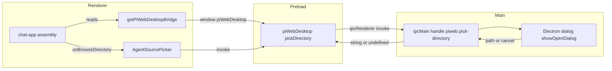
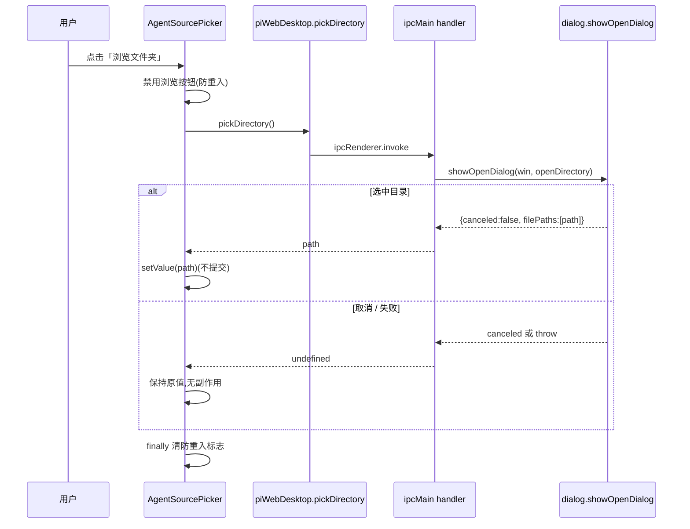

# Design Document — desktop-directory-picker

## Overview

**Purpose**:为 pi-web 桌面版(Electron 薄壳)补齐「原生目录选择桥」——桌面用户可经系统原生「选择文件夹」对话框浏览挑选本地目录作为 agent source,选中路径**填入**来源输入框(不自动提交),再由用户确认建会话。

**Users**:桌面版(`@blksails/pi-web-desktop`)用户在初始选源界面(`AgentSourcePicker`)使用。

**Impact**:在既有桌面壳的最小 preload 桥(`piWebDesktop`)上追加一个受控方法 `pickDirectory`,并在 `AgentSourcePicker` 上追加一个门控的「浏览文件夹」入口。浏览器部署与服务端 source 解析/信任裁定不变;不新增任何服务端路由。

### Goals
- 桌面壳内经原生对话框选目录 → 绝对路径回填来源框(不自动提交)。
- 能力严格限定桌面壳:浏览器态无入口、无本地文件系统触达面、无新增服务端目录枚举路由。
- 维持 Electron 严格隔离(`contextIsolation`/`sandbox`/`nodeIntegration:false`),桥暴露最小化。

### Non-Goals
- 选文件(仅目录)、系统托盘、原生菜单、多窗口。
- 把选中目录持久化为最近项/收藏项。
- `.pi/` 项目信任提示与授权(维持既有 headless 默认)。
- 修改服务端 source 解析、校验、信任策略;任何面向浏览器的目录浏览端点。

## Boundary Commitments

### This Spec Owns
- 桌面壳主进程的目录选择 IPC handler(`piweb:pick-directory`)及其失败即取消语义。
- preload 桥 `piWebDesktop.pickDirectory` 的受控暴露。
- `AgentSourcePicker` 的 `onBrowseDirectory` 入口(渲染门控、点击→回填、取消/失败无副作用)。
- app 侧桌面桥类型契约与访问器(`PiWebDesktopBridge` / `getPiWebDesktopBridge`)及其在 chat-app 的装配注入。
- 一个新增 i18n 文案键(zh/en)。

### Out of Boundary
- 服务端 source 解析/校验/信任(`agent-source` resolver、`project-trust`)——保持原状。
- `create-session` 建会话流程——沿用既有 `onSubmit` 通道,不改语义。
- 桌面壳启动链、supervisor、外链治理、窗口安全默认——不改(仅在 `main.ts` whenReady 追加一次桥注册)。
- 浏览器/CLI/standalone 运行路径——零改动、零影响。

### Allowed Dependencies
- Electron 原生 `dialog`、`ipcMain`、`contextBridge`、`ipcRenderer`(桌面壳内)。
- 既有 `piWebDesktop` 桥与 `main.ts` 的 `mainWindow` 引用。
- `AgentSourcePicker` 既有注入式 props 模式与 `@blksails/pi-web-ui` 的 `useI18n`。
- **约束**:桥只回传路径字符串;不得暴露任何通用 fs / Node 集成;不得新增服务端路由。

### Revalidation Triggers
- IPC 通道名或 `pickDirectory` 返回形状变化 → 需同步 preload 与 app 访问器两侧。
- `AgentSourcePicker` props 契约变化 → chat-app 装配需复检。
- 若未来放开为「选文件」或引入服务端目录浏览 → 触发本 spec 边界重定义与安全复审。

## Architecture

### Existing Architecture Analysis
- 桌面壳为严格隔离薄壳:`window.ts` 显式声明 `contextIsolation:true/sandbox:true/nodeIntegration:false` + 最小 `preload.ts`;`main.ts` 编排启动链并持 `mainWindow`。
- `AgentSourcePicker` 纯注入式(props 提供数据/回调),`chat-app.tsx` 单一渲染点装配。
- `build.mjs` 以 `main.ts`/`preload.ts` 为 esbuild 入口——新桥模块经 import 自动内联,**无需改构建**。
- 前端桌面态检测靠 `window.piWebDesktop` 的存在性(浏览器态 `undefined`)。

### Architecture Pattern & Boundary Map



**Architecture Integration**:
- Selected pattern:Electron 隔离态 IPC 桥(`contextBridge` + `ipcRenderer.invoke` ↔ `ipcMain.handle`),渲染层零 Node 能力。
- Domain boundaries:主进程拥有原生对话框;preload 是最小受控转发;渲染层只发起+回填。
- Existing patterns preserved:纯注入式组件门控(同 `enableSourceList`);桌面壳安全默认;单一装配点。
- New components rationale:主进程 handler(隔离态唯一能弹原生对话框处)、preload 一方法(隔离态唯一跨界通道)、app 访问器(集中 window 类型、避 `any`)、picker 一入口(用户可见触发)。
- Steering compliance:TypeScript strict/no-any;依赖单向(渲染→preload→主进程);最小暴露面。

### Technology Stack

| Layer | Choice / Version | Role in Feature | Notes |
|-------|------------------|-----------------|-------|
| Frontend | React(既有)+ `@blksails/pi-web-ui` useI18n | picker 入口 + 回填 + 文案 | 纯注入式,新增 1 prop |
| Desktop Main | Electron ^43 `dialog`/`ipcMain` | 原生目录对话框 + IPC handler | 以 mainWindow 为父窗体 |
| Desktop Preload | Electron `contextBridge`/`ipcRenderer` | 受控暴露 pickDirectory | 维持 sandbox |
| Build | esbuild(既有 build.mjs) | 自动内联新模块 | 不改构建脚本 |

## File Structure Plan

### Created Files
```
desktop/src/
└── dialog-bridge.ts          # ipcMain.handle("piweb:pick-directory") → dialog.showOpenDialog(openDirectory);
                               # try/catch → undefined + stderr 日志(失败即取消语义)

lib/app/
└── desktop-bridge.ts         # app 侧:PiWebDesktopBridge 接口 + getPiWebDesktopBridge() 访问器(读 globalThis,no any)

test/desktop/
└── dialog-bridge.test.ts     # 单测:选中返回路径 / 取消返回 undefined / 异常返回 undefined
e2e/desktop/
└── desktop-directory-picker.mjs  # 真实 Electron e2e:evaluate 猴补 dialog → 点浏览 → 断言输入框回填
```

### Modified Files
- `desktop/build.mjs` — **修订(实现期发现)**:import.meta.url shim 的 `__filename` banner 原套到所有入口;sandbox 下 preload 无 `__filename`,加载即抛错致 contextBridge 暴露失效(M1 潜伏 bug)。拆 banner 为 `mainOnly`,仅套 main.js,preload 用纯 common。详见 research.md「实现期发现」。
- `desktop/src/preload.ts` — `piWebDesktop` 追加 `pickDirectory: () => ipcRenderer.invoke("piweb:pick-directory")`;保留 `readonly`/`platform`。
- `desktop/src/main.ts` — `app.whenReady()` 内调 `registerDirectoryPickerBridge(ensureWindow)` 注册一次。
- `components/agent-source-picker.tsx` — 新增 `onBrowseDirectory?` prop;`onBrowseDirectory` 注入时在来源框旁渲染「浏览文件夹」按钮 + 点击处理(回填/防重入/失败无副作用)。
- `components/chat-app.tsx` — 经 `getPiWebDesktopBridge()?.pickDirectory` 注入 `onBrowseDirectory`。
- `packages/ui/src/i18n/messages.ts` — 新增 `agentSourcePicker.browseDirectory`(zh/en)。
- `test/agent-source-picker.test.tsx` — 追加:入口按 prop 门控 / 回填 / 取消·失败保持原值。

## System Flows



关键裁定:对话框以主窗口为父,期间渲染层自然被 modal 阻塞;handler 失败即取消(返回 undefined + stderr),渲染层不 reject;回填后由既有 submit 通道建会话。

## Requirements Traceability

| Requirement | Summary | Components | Interfaces | Flows |
|-------------|---------|------------|------------|-------|
| 1.1 | 桌面态显示入口 | AgentSourcePicker, chat-app | onBrowseDirectory prop 门控 | — |
| 1.2 | 浏览器态无入口/行为不变 | AgentSourcePicker, getPiWebDesktopBridge | prop 缺省 ⇒ 不渲染 | — |
| 1.3 | 未注入能力等价关闭 | getPiWebDesktopBridge | bridge undefined ⇒ prop undefined | — |
| 1.4 | 触发请求宿主对话框 | AgentSourcePicker | onBrowseDirectory() | 序列图 |
| 2.1 | 原生对话框仅选目录/父窗体 | dialog-bridge | ipcMain handler | 序列图 |
| 2.2 | 返回绝对路径 | dialog-bridge, preload | pickDirectory:Promise<string\|undefined> | 序列图 |
| 2.3 | 回填不自动提交 | AgentSourcePicker | setValue | 序列图 |
| 2.4 | 提交走既有流程 | AgentSourcePicker, chat-app | onSubmit | — |
| 2.5 | 取消保持原值无副作用 | dialog-bridge, AgentSourcePicker | undefined 分支 | 序列图 |
| 3.1 | 仅暴露一受控方法 | preload | contextBridge | — |
| 3.2 | 维持隔离标志 | window.ts(现状) | webPreferences | — |
| 3.3 | 只回路径字符串 | dialog-bridge, preload | 返回 string\|undefined | 序列图 |
| 3.4 | 向后兼容追加 | preload | 保留 readonly/platform | — |
| 4.1 | 不新增服务端目录枚举路由 | (无服务端改动) | — | — |
| 4.2 | 浏览器态无本地 fs 触达 | getPiWebDesktopBridge | bridge undefined | — |
| 4.3 | 浏览经桌面本地对话框 | dialog-bridge | 主进程本地 | 序列图 |
| 4.4 | 服务端解析/信任不放宽 | (无服务端改动) | — | — |
| 5.1 | 失败不建会话/保持原值 | dialog-bridge, AgentSourcePicker | try/catch → undefined | 序列图 |
| 5.2 | 进行中不永久阻塞 | AgentSourcePicker | 仅禁浏览按钮 + finally 清标志 | — |

## Components and Interfaces

| Component | Domain/Layer | Intent | Req Coverage | Key Dependencies (P0/P1) | Contracts |
|-----------|--------------|--------|--------------|--------------------------|-----------|
| dialog-bridge | Desktop Main | 原生目录对话框 IPC handler | 2.1,2.2,2.5,3.3,4.3,5.1 | Electron dialog/ipcMain (P0), mainWindow (P0) | Service, Event |
| preload pickDirectory | Desktop Preload | 受控暴露一方法 | 2.2,3.1,3.3,3.4 | ipcRenderer (P0) | Service |
| getPiWebDesktopBridge | App lib | 集中 window 类型 + 访问器 | 1.2,1.3,4.2 | globalThis (P0) | State |
| AgentSourcePicker(扩展) | Frontend UI | 入口 + 回填 + 失败无副作用 | 1.1,1.4,2.3,2.4,2.5,5.1,5.2 | onBrowseDirectory (P0), useI18n (P1) | State |
| chat-app(装配) | Frontend | 注入 onBrowseDirectory | 1.1,1.2,1.3,2.4 | getPiWebDesktopBridge (P0) | — |

### Desktop Main

#### dialog-bridge

| Field | Detail |
|-------|--------|
| Intent | 隔离态下唯一弹原生对话框处;注册 IPC handler |
| Requirements | 2.1, 2.2, 2.5, 3.3, 4.3, 5.1 |

**Responsibilities & Constraints**
- 注册 `ipcMain.handle("piweb:pick-directory")`;调 `dialog.showOpenDialog(win, { properties: ["openDirectory","createDirectory"] })`。
- 仅返回 `filePaths[0]`(string)或 `undefined`(取消/无选择/异常);绝不返回目录内容或 fs 元数据。
- 失败即取消:`try/catch` 捕获异常 → 返回 `undefined` + `console.error`/stderr 记录。

**Dependencies**
- Inbound:preload `pickDirectory` — 经 IPC 触发(P0)
- Outbound:Electron `dialog.showOpenDialog` — 原生对话框(P0);`getWindow()` — 父窗体(P0)

**Contracts**: Service [x] / Event [x]

##### Service Interface
```typescript
/** 注册目录选择 IPC handler(幂等:仅注册一次)。 */
export function registerDirectoryPickerBridge(
  getWindow: () => Electron.BrowserWindow | undefined,
): void;
```
- Preconditions:在 `app.whenReady()` 后、主窗口可得时调用一次。
- Postconditions:`ipcMain` 上存在 `piweb:pick-directory` handler,返回 `Promise<string | undefined>`。
- Invariants:任一路径(选中/取消/异常)都不抛给渲染层;异常降级为 `undefined`。

##### Event Contract
- IPC 通道:`piweb:pick-directory`(request 无 payload;response `string | undefined`)。
- 交付:`ipcRenderer.invoke` ↔ `ipcMain.handle` 一问一答;无广播、无粘性。

### Desktop Preload

#### preload pickDirectory

**Contracts**: Service [x]

##### Service Interface
```typescript
// desktop/src/preload.ts — piWebDesktop 追加(保留 readonly/platform)
interface PiWebDesktopPreload {
  readonly readonly: true;
  readonly platform: NodeJS.Platform;
  /** 打开系统原生「选择文件夹」对话框;返回绝对路径,取消/失败返回 undefined。 */
  pickDirectory: () => Promise<string | undefined>;
}
// pickDirectory: () => ipcRenderer.invoke("piweb:pick-directory")
```
- 仅经 `contextBridge.exposeInMainWorld` 暴露;不引入任何通用 fs / Node 能力(Req 3.1)。

### App Layer

#### getPiWebDesktopBridge

**Contracts**: State [x]

##### Service Interface
```typescript
// lib/app/desktop-bridge.ts
export interface PiWebDesktopBridge {
  readonly readonly: true;
  readonly platform: string;
  readonly pickDirectory?: () => Promise<string | undefined>;
}
/** 读取桌面壳注入的桥;浏览器态返回 undefined(no any)。 */
export function getPiWebDesktopBridge(): PiWebDesktopBridge | undefined;
```
- State:读 `globalThis.piWebDesktop`;SSR/浏览器态安全返回 `undefined`(Req 1.3/4.2)。

### Frontend UI

#### AgentSourcePicker(扩展)

| Field | Detail |
|-------|--------|
| Intent | 门控渲染「浏览文件夹」入口;点击→回填;取消/失败无副作用 |
| Requirements | 1.1, 1.4, 2.3, 2.4, 2.5, 5.1, 5.2 |

**Responsibilities & Constraints**
- 新增可选 prop `onBrowseDirectory?: () => Promise<string | undefined>`。
- 仅当 prop 注入时,在来源输入框旁渲染 `data-agent-source-browse` 按钮(文案 `t("agentSourcePicker.browseDirectory")`)。
- 点击:置局部 `browsing` 标志(仅禁用该按钮 + `loading` 中亦禁用)→ `await onBrowseDirectory()` → 结果为非空 string 则 `setValue(path)`;`undefined` 保持原值;`try/catch` 吞异常保持原值;`finally` 清 `browsing`。
- 不禁用手输框/源列表(Req 5.2);不自动提交(Req 2.3)。

**Contracts**: State [x]

```typescript
// AgentSourcePickerProps 追加
readonly onBrowseDirectory?: () => Promise<string | undefined>;
```

**Implementation Notes**
- Integration:chat-app 传入 `getPiWebDesktopBridge()?.pickDirectory`;浏览器态为 `undefined` ⇒ 按钮不渲染。
- Validation:回填仅接受非空字符串;空串/undefined 视作取消。
- Risks:防重入靠局部标志 + `finally`,避免异常态卡死禁用(Req 5.2)。

#### chat-app(装配)
- Summary-only:在唯一 `<AgentSourcePicker>` 渲染点追加 `onBrowseDirectory={getPiWebDesktopBridge()?.pickDirectory}`(缺省 ⇒ 不传/为 undefined)。

## Error Handling

### Error Strategy
- **主进程**:`dialog.showOpenDialog` 抛错 → catch → 返回 `undefined` + stderr 记录(观测),不使 IPC reject。
- **渲染层**:`await onBrowseDirectory()` 外层 `try/catch` 兜底,任何 reject/异常都保持来源框原值、不建会话、不改其它入口可用性。

### Error Categories and Responses
- **User cancel**:`canceled=true` 或空 `filePaths` → `undefined` → 无声无副作用(非错误)。
- **System error**(对话框 API 失败):降级为取消语义 + stderr 日志。
- 无 4xx/5xx/422 —— 本特性不经 HTTP。

### Monitoring
- 主进程失败经 stderr(与桌面壳既有主进程日志一致,非浏览器面板)。

## Testing Strategy

### Unit Tests
- `dialog-bridge`:handler 在 `showOpenDialog` 返回 `{canceled:false, filePaths:["/x"]}` 时解析为 `"/x"`;返回 `{canceled:true}` 时解析为 `undefined`;`showOpenDialog` 抛错时解析为 `undefined`(不 reject)。(2.1,2.2,2.5,5.1)
- `AgentSourcePicker`:未注入 `onBrowseDirectory` 时无 `data-agent-source-browse`;注入时渲染。(1.1,1.2)
- `AgentSourcePicker`:点击后 resolve 路径 → 输入框值为该路径且未触发 `onSubmit`。(2.3)
- `AgentSourcePicker`:resolve `undefined`(取消)/reject(失败)→ 输入框保持原值、无 `onSubmit`、手输框仍可用。(2.5,5.1,5.2)

### Integration Tests
- `preload` 形状:`piWebDesktop` 暴露 `pickDirectory` 且保留 `readonly`/`platform`(向后兼容)。(3.1,3.4)
- app `getPiWebDesktopBridge`:`globalThis.piWebDesktop` 缺省 → `undefined`;存在 → 透出 `pickDirectory`。(1.3,4.2)

### E2E Tests
- `e2e/desktop/desktop-directory-picker.mjs`:真实 Electron 壳(未打包,mock provider)→ `electronApp.evaluate` 猴补 `dialog.showOpenDialog` 返回固定临时目录 → 前端点「浏览文件夹」→ 断言来源输入框被回填为该目录且未建会话;可重复、产出新鲜证据。(1.1,1.4,2.1,2.2,2.3)

### 安全回归(断言即证)
- 浏览器 e2e/单测断言浏览器态**不存在** `data-agent-source-browse`(能力零外溢,4.2);全局 grep 确认无新增服务端目录枚举路由(4.1)。
