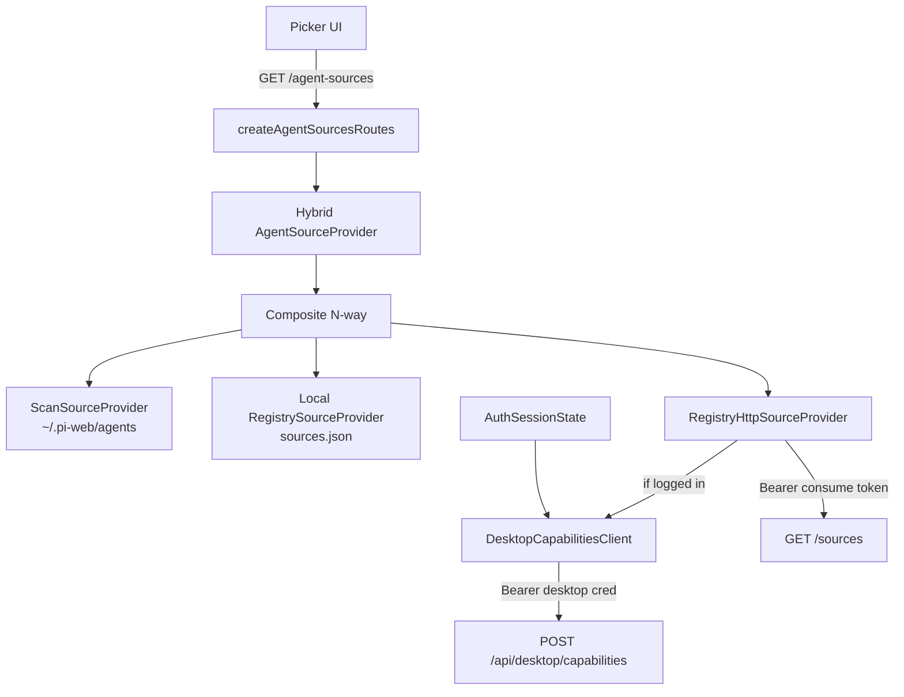

# Design Document

## Overview

**Purpose**: 让桌面/本机 pi-web 的 agent source 选择器在用户使用**线上登录凭证**后，展示 **线上 registry 可见 agent ∪ 本地 `~/.pi-web/agents`（及本地 sources 登记）**。

**Users**: 桌面版用户（Tauri 壳 + 本机 server）；未登录用户保持纯本地体验。

**Impact**: 扩展 `agent-source-list` 与登录态装配；**不改**协议 DTO 主字段；**不改**云端 capabilities/registry 实现（消费既有契约）。

### Goals
- 已登录：列表 = 云 registry ∪ 本地扫描 ∪ 本地 `sources.json`
- 未登录 / 云失败：仅本地，不 500 拖垮
- 用桌面凭据换 capabilities.sources，用户零配 registry token
- 默认扫描根保持 `~/.pi-web/agents`
- 分页排序与 `compareAgentSourceRecords` 兼容

### Non-Goals
- 线上 `sourceId@channel` 自动 install/resolve 后可建会话（P2）
- 协议正式增加 `runnable`/`reason`
- 新 Workspace 实现 / 多 profile
- 将 `@pi-clouds/registry-client` 引入 server 主 barrel

## Boundary Commitments

### This Spec Owns
- `RegistryHttpSourceProvider`（HTTP listSources 投影）
- `createCompositeSourceProvider` 多路合并
- 桌面 capabilities 客户端 + 内存 grant 缓存
- `pi-handler`（或 host 装配）将 hybrid provider 注入 `createAgentSourcesRoutes`
- 登录/未登录/失败降级行为与单测/e2e

### Out of Boundary
- pi-clouds：`/api/desktop/login`、`/api/desktop/capabilities`、registry 服务端、consume 签发
- 线上源运行时解析/安装（P2）
- 附件、模型目录、Workspace 改造
- Tauri Rust 壳拉列表（列表仍走本机 Node server）

### Allowed Dependencies
- `@blksails/pi-web-server` 既有 `AgentSourceProvider` / routes / `AuthSessionState`
- 云端：`POST /api/desktop/capabilities`、`GET {registryBase}/sources`
- 配置：`PI_WEB_SOURCES_ROOT`、`PI_WEB_SOURCES_REGISTRY`、云登录/capabilities base URL

### Revalidation Triggers
- `AgentSourceItem` / origin 枚举变更
- capabilities snapshot 中 `sources` 字段语义变更
- `compareAgentSourceRecords` 排序键变更
- 默认扫描根路径变更

## Architecture

### Existing Architecture Analysis

```
今日:
  createAgentSourcesRoutes
    └─ Composite(file RegistrySourceProvider, ScanSourceProvider)
         scan roots ← PI_WEB_SOURCES_ROOT | ~/.pi-web/agents
         file registry ← PI_WEB_SOURCES_REGISTRY | <agentDir>/sources.json

云端宿主(参考,不复用):
  createAgentSourcesRoutes({ provider: RegistryAgentSourceProvider })  // 仅进程内 registry
```

桌面登录：`AuthSessionState` 持桌面凭据；**未**接到 agent-sources。

### Architecture Pattern & Boundary Map



**Pattern**: Provider 组合 + 能力授予（Capability）驱动网络源；本地 fs 与线上 HTTP 对称实现同一 `AgentSourceProvider` 接口。

### Key Decisions

| ID | 决策 | 理由 |
|---|---|---|
| D1 | 注入整包 hybrid provider，不改路由分页核心 | 接缝已有；风险最小 |
| D2 | 合并顺序：HTTP 云 → 本地 file registry → scan；id 去重先见者胜 | 登录后云元数据优先；本地仍可补充 |
| D3 | 云失败 fail-soft → 该路 `[]` | Req 5 本地优先 |
| D4 | capabilities 用桌面凭据；registry 用短期 sources.token | 对齐云 C4；token 不落盘 |
| D5 | 手写 fetch，不引 registry-client | 避免 server 跨仓依赖 |
| D6 | 线上 `source = id@stable`；滤 `kind==="plugin"` | 与云 RegistryAgentSourceProvider 对齐 |
| D7 | P1 不保证线上源可建会话 | 范围控制 |

### Composite N-way

```ts
// 语义: providers 从高到低优先; 同 id 保留先出现者; 最终 sort(compareAgentSourceRecords)
createCompositeSourceProvider(...providers: AgentSourceProvider[]): AgentSourceProvider
// 兼容: createCompositeSourceProvider(fileReg, scan) 行为与今日二元一致
```

每路 `list()` 独立 `try/catch` → 失败当 `[]`（与现 `safeList` 一致）。

### RegistryHttpSourceProvider

```ts
interface RegistryHttpSourceProviderOptions {
  /** 未登录或不可用 → undefined → list 返回 [] */
  getGrant: () => Promise<
    | { readonly baseUrl: string; readonly token: string }
    | undefined
  >;
  fetchImpl?: typeof fetch;
  defaultChannel?: string; // 默认 "stable"
}

// GET `${baseUrl}/sources`  (注意 baseUrl 是否已含 /v1 前缀——以 capabilities 返回为准,不做二次拼路径臆测)
// Authorization: Bearer ${token}
// 响应: { sources: SourceSummary[] } 或数组——实现时以云端实际 JSON 为准,单测钉死
// 投影:
//   id: s.id
//   source: `${s.id}@${channel}`
//   name/title: s.displayName
//   kind: "dir"  // 协议占位
//   origin: "registry"
//   mode: "cli"
//   description/avatar: 可选透传
// 过滤: s.kind === "plugin" 剔除; kind 未定则仍列入(可能后续升 agent)
```

错误：网络/非 2xx/JSON 非法 → log（无 token）+ `[]`。不 rethrow 到 routes 层（避免 500），与「本地优先」一致。  
*注：云内 provider 对 listSources 失败 rethrow 是因为云列表**只有** registry 一路；桌面 hybrid 有本地兜底，策略不同是刻意的。*

### DesktopCapabilitiesClient + Grant Cache

```ts
interface DesktopCapabilitiesClientOptions {
  /** 完整 URL, 如 https://cloud.example/api/desktop/capabilities */
  capabilitiesUrl: string;
  getDesktopCredential: () => string | undefined;
  fetchImpl?: typeof fetch;
  now?: () => number;
}

// POST capabilitiesUrl
// Authorization: Bearer <desktop credential>
// Body: {} 或 { }（与云端契约对齐）
// 成功: 解析 StaticCapabilitySnapshot.sources
// 缓存: { grant, expiresAt } 内存; 距到期保留小时钟偏斜(如 30s)则刷新
// 401/403: 清缓存, 返回 undefined
// 503/网络: 返回 undefined(fail-soft); 可选短时负缓存防打爆
```

配置解析（装配层）：

| 来源 | 规则 |
|---|---|
| `PI_WEB_CLOUD_CAPABILITIES_URL` | 若设，直接用 |
| 否则 | 由既有云登录/egress base 推导 `…/api/desktop/capabilities`（与 `desktop-cloud-login` 同源配置；若无法推导则线上源恒不可用） |

### Assembly（pi-handler）

```ts
const scan = createScanSourceProvider({ roots: resolveSourcesScanRoots(cwd) });
const fileReg = createRegistrySourceProvider({ registryPath: sourcesRegistryPath(config) });
const capClient = createDesktopCapabilitiesClient({ ... authState.currentCredential ... });
const httpReg = createRegistryHttpSourceProvider({
  getGrant: () => capClient.getSourcesGrant(),
});
const hybrid = createCompositeSourceProvider(httpReg, fileReg, scan);

// createAgentSourcesRoutes({ scanRoots, registryPath, provider: hybrid })
// 或仅传 provider 忽略 roots/path
```

`makeSourceSettingsResolver` 今日用 file+scan composite：P1 **可保持**（线上源无本地包根，settings 解析不到 → 404 与「未声明」同语义）。P2 再扩展。

### Data / Wire Notes

- **桌面凭据**：仅 server 内存 + keychain；capabilities 请求头携带。
- **consume token**：仅 server 内存至 `expiresAt`。
- **列表 DTO**：不变；前端无需改字段即可显示并集。
- **登录后刷新**：依赖现有 picker 重拉 `/agent-sources`（登录成功/登出后触发）。

### Error Handling

| 场景 | 行为 |
|---|---|
| 未登录 | httpReg → `[]`；列表=本地 |
| capabilities 失败 | grant undefined；列表=本地 |
| registry 失败 | httpReg → `[]`；列表=本地 |
| 全部本地也失败 | 与今日一致（routes 层 500 仅当 provider.list 整体抛——hybrid 不应整体抛） |

### File Structure Plan

| 路径 | 动作 | 职责 |
|---|---|---|
| `packages/server/src/agent-source-list/registry-http-provider.ts` | **新建** | HTTP registry list + 投影 |
| `packages/server/src/agent-source-list/composite-provider.ts` | **修改** | N 路 providers |
| `packages/server/src/agent-source-list/index.ts` | **修改** | 导出 |
| `packages/server/src/auth/desktop-capabilities-client.ts` | **新建** | capabilities 拉取 + 内存缓存 |
| `packages/server/src/auth/index.ts` | **修改** | 导出（若主 barrel 策略允许；否则子路径） |
| `lib/app/pi-handler.ts` | **修改** | 装配 hybrid + URL/凭据 |
| `packages/server/test/agent-source-list/*.test.ts` | **新建/改** | composite N 路、http provider、fail-soft |
| `packages/server/test/auth/desktop-capabilities-client.test.ts` | **新建** | 缓存/401/缺 sources |
| `e2e/...` 或 `test/...` | **按需** | 登录两态列表（mock fetch） |

### Requirements Traceability

| Req | 设计要素 |
|---|---|
| 1.1–1.4 | Scan + file registry + 默认根 |
| 2.1–2.5 | capabilities + httpReg + 合并/登出 |
| 3.1–3.4 | 投影 `id@channel`、origin、滤 plugin、token 不回前端 |
| 4.1–4.4 | 凭据来源、不落盘、expires 缓存、失效不请求 |
| 5.1–5.4 | fail-soft |
| 6.1–6.4 | 既有 routes + compare |
| 7.1–7.3 | P1 边界 |
| 8.1–8.3 | 外部契约依赖 |

### Testing Strategy

1. **Unit**：composite 三路去重顺序；http provider 投影/滤 plugin/失败→[]；capabilities 缓存与过期刷新；无 credential → 不 fetch。
2. **Integration**：装配 hybrid 后 `GET /agent-sources` mock 两后端，断言并集与分页。
3. **E2E（可选/夹具）**：临时 `PI_WEB_SOURCES_ROOT` + mock capabilities/registry；登录前后列表 diff。
4. **安全烟雾**：日志/落盘路径不得出现 token 子串（单测 spy logger）。

### Risks

| 风险 | 缓解 |
|---|---|
| capabilities URL 配置不一 | 与 cloud-login 同源推导 + 显式 env 覆盖 |
| 云 JSON 形状微调 | 宽松解析 + 单测钉死字段 |
| 与本地 file registry 同 id 冲突 | 文档说明云优先；id 空间 registry 用 `org/name`，本地用 path |
