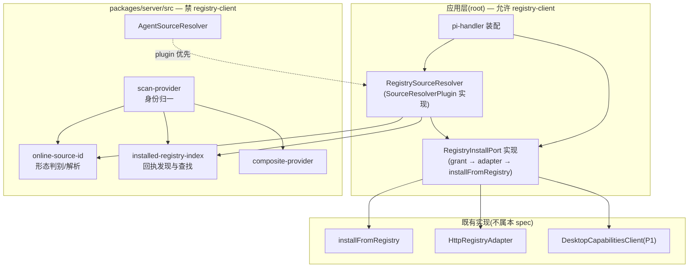
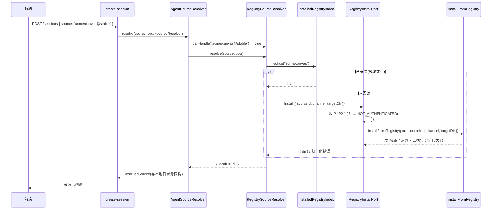
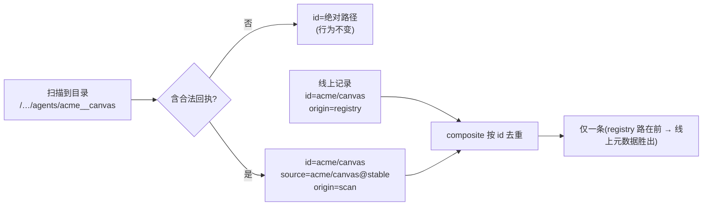

# Technical Design: desktop-online-source-runnable

## Overview

本特性把「列表里看得见的线上 agent」接成「选中就能用的 agent」。

策略是**不为云端源新造运行时概念**：选中线上源时，先把它安装到本机 agent 源根，之后它在解析链路下游与一个普通本地目录源**完全同构**。实现上不新增编排层 —— 命中既有一等扩展点 `SourceResolverPlugin`（`agent-source/types.ts:81`），该扩展点在 `identify()` 中优先级最高且生产侧至今无实现，正是为此类分发形态预留。

### Goals

- 已登录用户以 `sourceId@channel` 形态发起建会话时，同一次请求内完成安装并进入会话
- 已安装的源离线、登出后仍可用，且在列表中只出现一条、可提交标识稳定
- 失败可按阶段区分、不留残迹、不破坏既有安装
- `packages/server/src` 不引入 `@pi-clouds/registry-client`

### Non-Goals

- 更新、卸载、版本切换、已装版本展示
- 安装进度、重试交互、「可运行/需安装」徽标等前端形态
- plugin 类源、`git`/`npm` 直连形态的安装
- 修改 `create-session` 路由、`AgentSourceResolver` 核心、`compareAgentSourceRecords`

## Boundary Commitments

### This Spec Owns

- `sourceId@channel` 形态判别（`canHandle` 语义）
- 已安装线上源的**本机索引**（回执发现与查找）
- 扫描记录的**身份归一**（`id`/`source` 认领线上身份）
- `SourceResolverPlugin` 实现：先查索引复用、查不到则安装
- 安装编排（取授予 → 构造消费面端口 → 调既有安装实现 → 定目标目录）与其失败分类
- 装配层把上述二者接入既有 resolver wrapper

### Out of Boundary

- **安装的内部实现**（下载/解包/完整性校验/原子落盘/回执写入）—— 属 `cli-package-commands`，本特性只调用，**不得自行实现落盘**
- **授予的取得与缓存** —— 属 P1 `desktop-hybrid-agent-sources`，本特性只消费
- 注册表服务端、云端能力端点、consume token 签发 —— 属 pi-clouds
- 本地目录/git/builtin 源的解析语义 —— 属 `agent-source-resolver`
- 列表的排序、分页、协议字段 —— 属 P1 与 `agent-sources-list`

### Allowed Dependencies

- `packages/server/src` 侧：仅 Node 内置（`fs`/`path`）+ 既有 `agent-source` / `agent-source-list` 类型
- 应用层侧：`server/cli/install/registry-install.ts`、`server/cli/registry/http-registry-adapter.ts`、P1 的 `DesktopCapabilitiesClient`
- **禁止**：`@pi-clouds/registry-client` 出现在 `packages/server/src` 的任何真实 import 中

### Revalidation Triggers

- 回执文件名或其 `sourceId`/`channel` 字段语义变更（`cli-package-commands`）
- `SourceResolverPlugin` 接口或 `identify()` 优先级变更（`agent-source-resolver`）
- `AgentSourceRecord` 的 `id`/`source`/`origin` 语义变更（P1）
- 默认扫描根路径变更（P1）
- `installFromRegistry` 签名或其失败分类变更

## Architecture

### Existing Architecture Analysis

三处既有结构直接决定本设计形态：

1. **`identify()` 的 plugin 优先分支**（`source-type.ts:105-107`）——若 `opts.sourceResolver.canHandle(source)` 为真，则先于 `builtin:`/`git:`/本地目录判定命中，取得 `{ localDir }` 后下游与本地目录源同构。
2. **注入式 resolver**（`create-session.ts:28-34, 90, 122`）——建会话与恢复会话共用同一注入 resolver；装配层 `pi-handler.ts:937` 已注入 `makeRealResolver(config)` wrapper。
3. **按 `id` 去重的 composite**（`composite-provider.ts:56`）——线上记录 `id = sourceId`，扫描记录 `id = 绝对路径`，故装后必然重复。

### Architecture Pattern & Boundary Map

依赖倒置：判别与索引下沉到包内（纯 fs），安装留在应用层（需 registry-client），经端口对接。



### Technology Stack

无新增依赖。复用既有：Node `fs`/`path`（索引与回执读取）、既有安装实现与消费面适配器、P1 的授予客户端。

## File Structure Plan

### 新建文件

| 路径 | 职责 |
|---|---|
| `packages/server/src/agent-source/online-source-id.ts` | `sourceId@channel` 形态的**判别与解析**（纯字符串）。导出 `isOnlineSourceRef(s)`、`parseOnlineSourceRef(s) → { sourceId, channel } \| undefined`、`formatOnlineSourceRef({sourceId, channel})`。判别严格化以免劫持本地源。 |
| `packages/server/src/agent-source-list/installed-registry-index.ts` | 已安装线上源的**本机索引**。读扫描根下各目录的回执，导出 `readInstalledReceipt(dir)` 与 `createInstalledRegistryIndex({ roots })`（含 `lookup(sourceId)`）。纯 fs，容忍缺失/损坏回执。 |
| `lib/app/online-source/registry-install-port.ts` | `RegistryInstallPort` 实现：取 P1 授予 → 构造消费面 `HttpRegistryAdapter` → 调 `installFromRegistry` → 归一化失败分类。**registry-client 依赖止于此文件所在层**。 |
| `lib/app/online-source/registry-source-resolver.ts` | `SourceResolverPlugin` 实现：`canHandle` 用形态判别；`resolve` 先查索引复用、未命中则经端口安装，返回 `{ localDir }`。 |

### 修改文件

| 路径 | 改动 |
|---|---|
| `packages/server/src/agent-source-list/scan-provider.ts` | 目录含合法回执时，`id` 归一为 `sourceId`、`source` 归一为 `sourceId@channel`；`origin` 保持 `scan`。无回执时行为完全不变。 |
| `packages/server/src/agent-source-list/index.ts` | 导出索引与回执读取 API。 |
| `packages/server/src/agent-source/index.ts` | 导出形态判别 API。 |
| `lib/app/pi-handler.ts` | `makeRealResolver` 转发的解析选项中带上 `sourceResolver`；装配处构造端口与插件（仅在云登录已配置时；未配置则不注入，行为等同今日）。 |

## System Flows

### 主流程：选中线上源 → 建会话



### 归一流程：装后列表只出现一条



## Requirements Traceability

| 需求 | 由谁满足 |
|---|---|
| 1.1, 1.2 | `RegistrySourceResolver.resolve` 经 `identify()` plugin 分支接入，返回 `localDir` 后下游同构 |
| 1.3 | `resolve` 先查 `InstalledRegistryIndex`，命中即复用不下载 |
| 1.4 | 安装落点在扫描根 → 下次列表由 `scan-provider` 自然枚举 |
| 2.1 | 落点为持久目录（既有原子落盘语义） |
| 2.2 | 索引查找不依赖网络与授予 |
| 2.3 | 扫描路不依赖登录态 |
| 3.1 | `scan-provider` 归一 `id` → composite 去重命中 |
| 3.2 | 归一同时覆盖 `source` → 两种登录态下标识一致 |
| 3.3 | `origin` 保持 `scan`，不触碰比较器与游标 |
| 4.1 | `RegistryInstallPort` 归一化既有安装实现的分阶段错误 |
| 4.2, 4.3 | 复用既有 staging + 原子替换 + 回滚；目标位置已有非本通道安装时明确失败 |
| 4.4 | 解析失败即抛出，`create-session` 不进入建会话 |
| 4.5, 5.4 | 端口不把授予写入任何产物；错误与日志不含令牌 |
| 5.1 | `resolve` 在无凭据时以 `NOT_AUTHENTICATED` 失败，且不发起下载 |
| 5.2 | 授予不可得 → 安装失败；本机既有源不受影响（列表路独立） |
| 5.3 | 仅消费 P1 短期授予 |
| 6.1 | 端口透传既有实现的「不支持的分发形态」失败 |
| 6.2 | 端口把解析失败归一为可区分的「未找到」 |
| 6.3 | 线上列表侧已滤 plugin（P1）；本特性不引入新的安装入口 |
| 7.1 | 既有完整性校验（不重实现） |
| 7.2 | 既有回执（不重实现） |
| 7.3 | 既有代理下载（安装侧不接触对象存储凭据） |
| 8.1 | 无回执目录的扫描记录构造不变；`canHandle` 严格判别不劫持本地源 |
| 8.2 | 未配置云登录时不注入插件，链路等同今日 |
| 8.3 | 不改协议字段与游标语义 |

## Components and Interfaces

### packages/server — 判别与索引（禁 registry-client）

```ts
/** `sourceId@channel` 形态的解析结果。 */
export interface OnlineSourceRef {
  readonly sourceId: string;
  readonly channel: string;
}

/**
 * 严格判别:必须排除本地路径、URL、git:/builtin: 前缀,且恰有一个 `@`、其后非空。
 * 该判别优先于 identify() 的所有其他分支,误判会劫持本地源解析。
 */
export function isOnlineSourceRef(source: string): boolean;
export function parseOnlineSourceRef(source: string): OnlineSourceRef | undefined;
export function formatOnlineSourceRef(ref: OnlineSourceRef): string;

/** 已安装线上源的回执(仅取本层所需字段,容忍未知字段)。 */
export interface InstalledReceipt {
  readonly sourceId: string;
  readonly channel: string;
  readonly version?: string;
}

/** 读取某目录的回执;不存在/损坏/缺必需字段 → undefined(降级为普通目录)。 */
export function readInstalledReceipt(dir: string): InstalledReceipt | undefined;

export interface InstalledRegistryIndex {
  /** 按 sourceId 查已安装目录;不依赖网络与登录态。 */
  lookup(sourceId: string): { readonly dir: string; readonly receipt: InstalledReceipt } | undefined;
}

export function createInstalledRegistryIndex(opts: {
  readonly roots: readonly string[];
}): InstalledRegistryIndex;
```

### 应用层 — 安装端口与解析插件（允许 registry-client）

```ts
export type InstallFailure =
  | { readonly code: "NOT_AUTHENTICATED" }
  | { readonly code: "GRANT_UNAVAILABLE" }
  | { readonly code: "NOT_FOUND"; readonly sourceId: string; readonly channel: string }
  | { readonly code: "UNSUPPORTED_DISTRIBUTION"; readonly detail: string }
  | { readonly code: "DOWNLOAD_FAILED"; readonly detail: string }
  | { readonly code: "EXTRACT_FAILED"; readonly detail: string }
  | { readonly code: "INTEGRITY_MISMATCH"; readonly path: string }
  | { readonly code: "TARGET_OCCUPIED"; readonly dir: string };

export interface RegistryInstallPort {
  /** 安装并返回落盘目录;失败以 InstallFailure 表达,绝不泄露授予令牌。 */
  install(ref: OnlineSourceRef): Promise<
    | { readonly ok: true; readonly dir: string }
    | { readonly ok: false; readonly failure: InstallFailure }
  >;
}

export function createRegistryInstallPort(opts: {
  readonly getSourcesGrant: () => Promise<{ baseUrl: string; token: string } | undefined>;
  readonly targetRoot: string;
}): RegistryInstallPort;

export function createRegistrySourceResolver(opts: {
  readonly index: InstalledRegistryIndex;
  readonly port: RegistryInstallPort;
}): SourceResolverPlugin;
```

## Data Models

### 目录命名

由 `sourceId` 派生且须文件系统安全（`sourceId` 含 `/`）。约束：确定性（同 `sourceId` 恒同目录）、无路径穿越、与用户手放目录可区分。

**不复用** `source-key.ts` 的哈希方案 —— 其输出为 16 位十六进制、不可读，会使扫描记录在**无回执降级**时呈现为哈希串，损害可诊断性。采用可逆的分隔符替换（`/` → `__`）并对其余不安全字符做保守处理；权威身份始终以**回执内的 `sourceId`** 为准，目录名仅为承载。

### 回执契约（跨层，只读）

`packages/server` 侧只读 `sourceId`、`channel`（`version` 可选，仅用于诊断）。缺任一必需字段即视为非本通道目录并降级 —— 保证 `cli-package-commands` 侧新增字段不会破坏本特性。

## Error Handling

### Error Strategy

安装失败以 `InstallFailure` 判别联合表达，由 `SourceResolverPlugin.resolve` 转为解析错误抛出，`create-session` 据既有错误映射返回；**失败即不建会话**（Req 4.4）。

### Error Categories and Responses

| 分类 | 触发 | 响应 |
|---|---|---|
| 未认证 | 无桌面凭据 | `NOT_AUTHENTICATED`，提示需登录，**不发起下载** |
| 授予不可得 | 能力端点不可达/拒绝/缺授予 | `GRANT_UNAVAILABLE` |
| 未找到 | 标识不存在或通道无版本 | `NOT_FOUND`（与其他失败可区分） |
| 形态不支持 | 非注册表分发形态 | `UNSUPPORTED_DISTRIBUTION`，不部分安装 |
| 传输/解包/完整性 | 对应阶段失败 | 分别为 `DOWNLOAD_FAILED`/`EXTRACT_FAILED`/`INTEGRITY_MISMATCH`；既有实现保证回滚 |
| 目标被占 | 目标位置已有**非本通道**安装 | `TARGET_OCCUPIED`，明确失败而非静默覆盖 |

### Monitoring

沿用既有日志命名空间约定。**任何日志与错误载荷不得包含桌面凭据或授予令牌**（Req 4.5/5.4），仅记 `sourceId`/`channel`/阶段/状态码。

## Testing Strategy

### 单元

- **形态判别**：`acme/canvas@stable` 命中；`/abs/path`、`./rel`、`https://host/x@v`、`git:h/u/r@ref`、`builtin:x`、无 `@`、`@` 后为空 —— 一律不命中（护栏对应 Req 8.1）
- **索引**：有回执 → 命中；无回执/损坏 JSON/缺 `sourceId` → 不命中且不抛
- **扫描归一**：含回执目录 → `id`/`source` 归一且 `origin` 仍为 `scan`；无回执目录 → 记录与今日逐字段等价
- **端口失败归一**：各阶段失败 → 对应 `InstallFailure`；断言错误载荷**不含** token
- **插件**：索引命中 → 不调端口；未命中 → 调端口一次；无凭据 → `NOT_AUTHENTICATED` 且端口未被调用

### 集成

- 去重：mock 线上一条 + 本机已装同源一条 → 列表**恰一条**，`source` 为 `sourceId@channel`（Req 3.1/3.2）
- 登出：清凭据后列表仍含已装源，且 `source` 标识不变（Req 2.3/3.2）
- 建会话：注入插件后以 `sourceId@channel` 建会话 → 走到本地目录源同构路径（Req 1.1）
- 未配置云登录：不注入插件时列表与建会话与今日等价（Req 8.2）

### E2E

- **主路径**：真实 server + mock 能力端点 + mock 注册表（含真实 tarball 字节）→ `POST /sessions { source: "<id>@stable" }` → 断言会话创建成功、目标目录存在且含回执、列表中该源**恰一条**
- **复用与离线**：第二次建会话不再打注册表（断言 mock 未被再次调用）；随后清凭据仍可建会话（Req 1.3/2.2）
- **失败不留残迹**：注册表返回损坏字节 → 建会话失败且返回完整性类错误、目标位置**不存在**半成品目录、既有安装未被破坏（Req 4.1/4.2/4.3）
- **未登录拒绝**：无凭据时以 `sourceId@channel` 建会话 → 明确拒绝且注册表**零请求**（Req 5.1）
