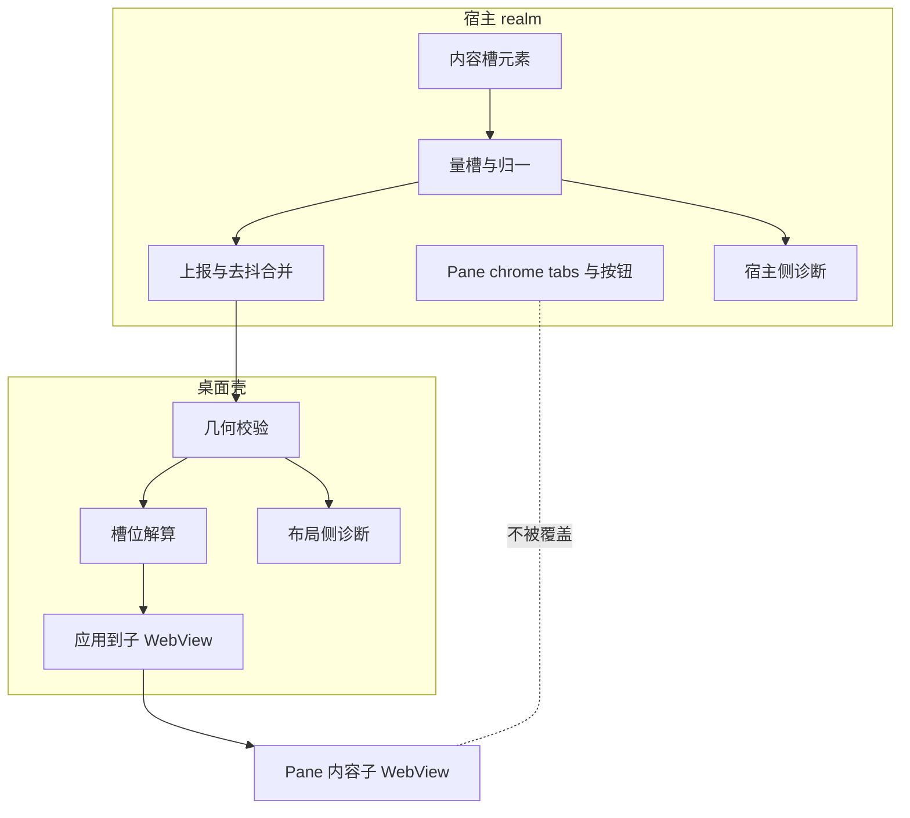
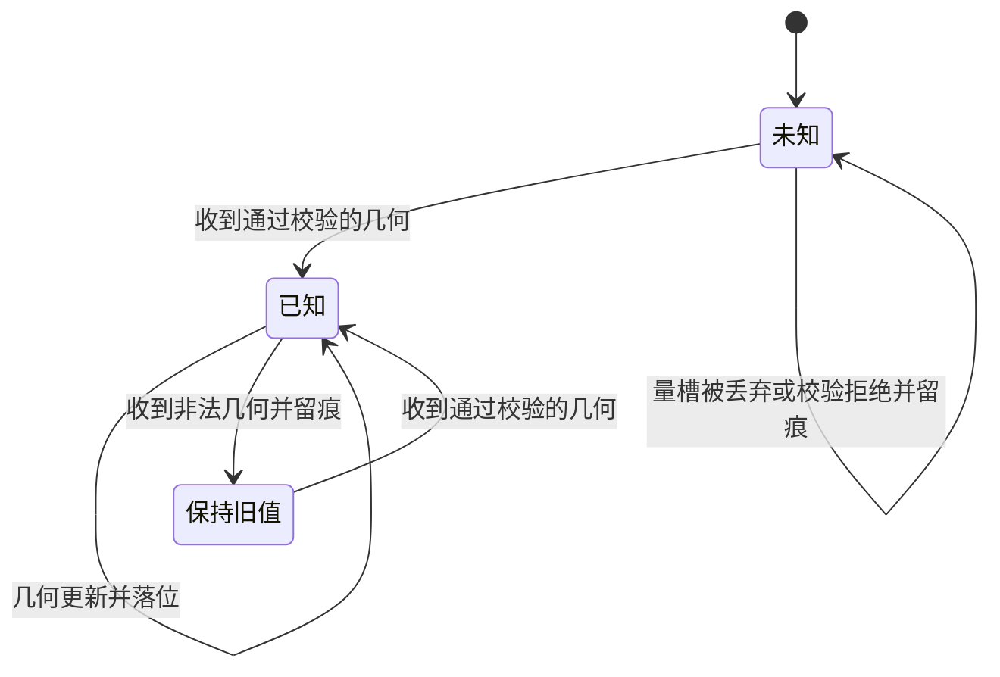
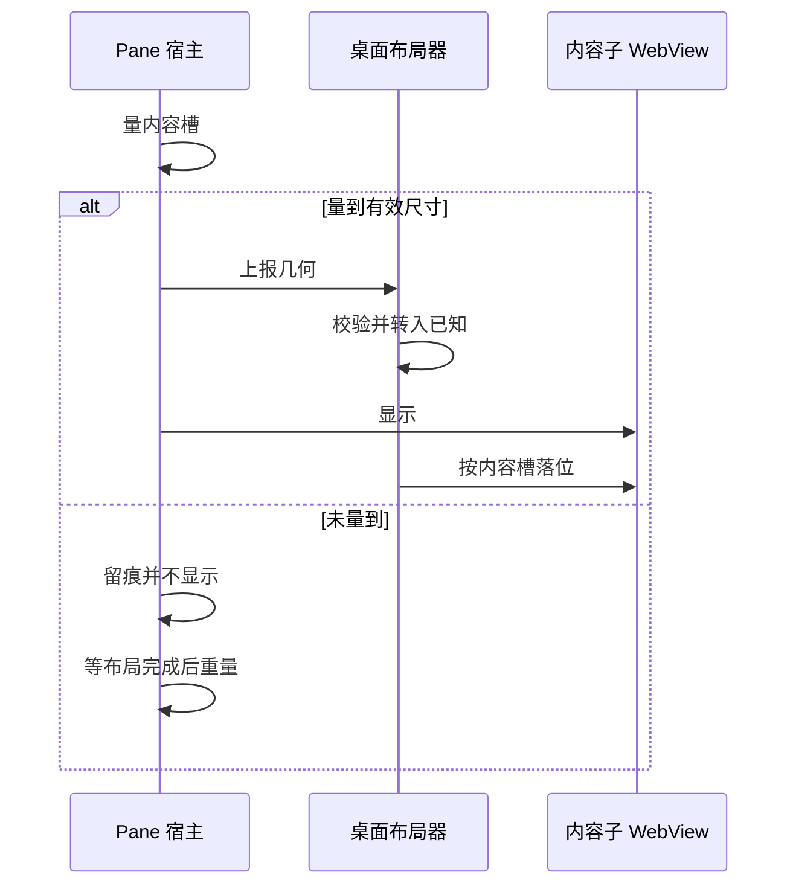

# Design Document

## Overview

**Purpose**：消除桌面版「pane chrome 被内容盖住」这一缺陷，并从结构上让它不再可能复发。

**Users**：pi-web 桌面版用户直接受益——tab 栏是切换与新开 pane 的唯一入口，盖住它等于用户被锁在首个 pane 里；维护者受益于几何链路从"六处静默 fail-soft"变为可取证。

**Impact**：把「pane 内容槽顶边未知」从一个**值**（`0.0`，恰好是最坏的值）升格为一个**状态**（`None`，显式不显示）。改动集中在桌面布局侧与 pane 宿主的几何上报侧，不触碰 chrome 的渲染、pane 的生命周期，也不触碰网页宿主路径。

### Goals

- 任何几何态下 pane 内容矩形都不与 chrome 区域相交（1.1–1.5、2.5）。
- 「几何未知」成为可表达、可判别、可自愈的显式状态（2.1–2.4）。
- 几何链路的六处静默失败点各自留下含数值与原因的记录（3.1–3.5）。
- 用真机诊断判别出实际触发条件，或如实记为不可复现（4.1–4.4）。
- 该路径从零自动化覆盖变为有会红的机械断言，并配真机视觉证据（6.1–6.5）。

### Non-Goals

- 不重新设计 chrome 的布局、外观或按钮组成。
- 不改动 pane 的生命周期、保活与销毁策略。
- 不改动网页宿主的布局路径（5.3 要求其逐字段不变）。
- 不为 chrome 高度引入任何后端侧的常量或推算（会把下游假设塞进上游）。
- 不顺手统一 `left_width` / `pane_width` / `bottom_height` 的语义——本 spec 只处理顶边这一处二义性。

## Boundary Commitments

### This Spec Owns

- 桌面侧 pane 内容槽几何的**数据形状**（含"未知"的表达方式）与其校验规则。
- 「几何未知 / 非法」时的显示决策：是否显示 pane、给出什么矩形。
- pane 宿主侧「量槽 → 上报 → 落位」链路的可靠性与诊断记录。
- 上述行为的机械化断言与真机视觉证据。

### Out of Boundary

- chrome 自身的 DOM 结构与渲染（本设计**依赖**其"chrome 与内容槽为兄弟、不重叠"的既有结构，但不修改它）。
- pane 内容文档的加载、渲染与错误态。
- 任何具体 agent 的 pane 声明内容（含 `aigc-agent`）。
- pane 浮层菜单的叠放与焦点策略（5.4 只要求不回归，不要求改进）。
- 日志系统本身的开关与落盘机制（复用既有能力）。

### Allowed Dependencies

- 桌面壳的窗口与子 WebView 管理能力（既有）。
- pane 宿主既有的 content-well 元素引用与 ResizeObserver 跟手路径。
- 仓库既有日志设施（默认关闭、不重编译即可开启）。

**约束**：依赖方向为 `宿主布局(量槽) → 上报契约 → 桌面布局器(落位)`。桌面布局器**不得**反向假设宿主的 chrome 高度、DOM 结构或组件层级。

### Revalidation Triggers

- 几何上报载荷的字段形状变化（尤其顶边字段的可选性）。
- 「未知几何」时是否显示 pane 这一决策的变更。
- chrome 与内容槽从兄弟结构变为嵌套结构——本设计的核心前提将失效。
- 子 WebView 首建位置的来源变更。

## Architecture

### Existing Architecture Analysis

当前几何链路为：pane 宿主量 content-well 的 `rect` → 归一为上报载荷 → 跨进程送至桌面布局器 → 布局器算出宿主矩形与内容槽矩形 → 应用到子 WebView。

三项既有约束必须保留：

- **宿主铺满窗口**，chrome 留在宿主内可点；子 WebView 只盖内容槽。这是整套方案成立的前提。
- **单路 rAF 合并 + 近似去抖**：拖拽时每帧都有几何到达，靠合并与 `bounds_near` 抑制过度下发。改动不得进入这两处。
- **全屏模式下隐藏全部内容 pane**，且不得抹掉可见性记忆。

已识别的技术债（本设计处理其中第一项，其余仅记录）：

1. **顶边字段无法表达"未知"**——`top_height` 为必填浮点且默认 `0.0`，而同结构体的 `left_width` / `pane_width` 均为可选。本设计消除这一处不对称。
2. 载体门与几何门分叉（`pane_layout_is_native` 只影响上报侧，不影响载体选择）——本设计通过诊断使其可判别，**不在本 spec 内改动门的语义**（那会牵动 pane 载体选择，超出边界）。
3. 兜底分支位于需要真实窗口句柄的调用链内，结构上不可测——本设计把该判断下沉到纯计算层以获得可测性。

### Architecture Pattern & Boundary Map



**Architecture Integration**：

- **选定模式**：在既有单向链路上做**状态显式化**——不引入新组件、不新增层，只把一个二义性的值拆成可判别的状态，并在解算层加一个"未知即不产出可显示矩形"的分支。
- **边界分离**：量槽归宿主（它才知道 chrome 在哪），落位归桌面壳（它才持有窗口句柄）。诊断在两侧各自就地留痕，不跨边界汇聚。
- **保留的既有模式**：宿主铺满、单路 rAF 合并、近似去抖、全屏隐藏与可见性记忆。
- **新增组件的理由**：仅一个——把原先埋在"应用到子 WebView"内部、需要真实窗口句柄才能触发的兜底判断，提取为纯函数，使 6.2 的断言可写。

### Technology Stack

| Layer | Choice / Version | Role in Feature | Notes |
|-------|------------------|-----------------|-------|
| Frontend / CLI | 既有 pane 宿主（TypeScript / React） | 量槽、上报、诊断 | 无新依赖 |
| Backend / Services | 既有桌面壳布局器（Rust / Tauri v2） | 校验、解算、落位、诊断 | 无新依赖 |
| Data / Storage | 无 | — | 几何为进程内瞬时状态，不持久化 |
| Messaging / Events | 既有跨进程命令 | 几何上报 | 载荷形状变更见下 |
| Infrastructure / Runtime | 既有日志设施 | 诊断可读 | 默认关闭，不重编译可开启 |

## File Structure Plan

### Modified Files

- `desktop/src-tauri/src/native_layout.rs` — 顶边字段改可选；解算层新增"未知即不产出可显示内容槽"；把"槽不可用"的兜底判断从落位流程下沉为纯函数；校验拒绝时留痕。**本 spec 的主要改动面。**
- `packages/panes-kit/src/adapters/tauri-runtime.ts` — 量槽被丢弃时留痕；上报失败不再无声；`isTauriNativePaneLayout` 区分"命令报错"与"非 native"；上报载荷与新的可选顶边对齐。
- `packages/panes-kit/src/react/panes-host.tsx` — show 前的几何保障改为"没量到就不 show"，并在几何迟到后自动补上落位；几何门未启用时留痕。

### New Files

- `desktop/src-tauri/src/native_layout.rs` 内的 `#[cfg(test)]` 模块 — 新增"几何未知"用例（与既有三例同文件，不另建文件）。
- `packages/panes-kit/test/pane-slot-geometry.test.ts` — 宿主侧量槽/上报/诊断的机械断言。
- `.kiro/specs/desktop-pane-chrome-occlusion/visual-acceptance.md` — 真机视觉验收记录与截图索引（6.3、6.5）。

> 每个文件一个清晰职责：布局器只管解算与落位，适配层只管量与报，宿主只管时机与门控，验收文档只管证据。

## System Flows

### 几何状态机（本设计的核心）



**关键决策**（不复述图内步骤）：

- **`未知` 态不产出可显示的内容槽**，因此不存在"从窗口顶端铺满"这一矩形来源。这是 2.1、2.5 的机械保证，也是与现状最本质的区别。
- **`已知 → 保持旧值`**：非法几何不回落到默认值。回落到默认等于回落到遮挡（2.2）。
- **`未知` 是可离开的**：几何迟到时自动落位，不需要用户操作（2.3）。这条与"未知即不显示"配对存在——缺了它，一次量槽失败就会变成永久黑屏。

### 首次显示的时序



**关键决策**：现状是"量不到也照样显示"，本设计把"量到有效几何"变为显示的**前置条件**（4.2）。子 WebView 的首建位置同样受"未知"约束，不再使用默认矩形（4.1）。

## Requirements Traceability

| Requirement | Summary | Components | Interfaces | Flows |
|-------------|---------|------------|------------|-------|
| 1.1 | 已开 pane 时 chrome 完整可见 | 槽位解算器 | `resolve_content_slot` | 几何状态机 |
| 1.2 | 拖拽全程 chrome 可见 | 槽位解算器、上报器 | 既有合并与去抖 | — |
| 1.3 | 尺寸/缩放变化时 chrome 可见 | 槽位解算器 | `resolve_content_slot` | — |
| 1.4 | 「新开 Pane」可用 | 宿主几何门控 | — | 首次显示时序 |
| 1.5 | 切换 pane 恒有界面路径 | 槽位解算器 | `resolve_content_slot` | 几何状态机 |
| 2.1 | 几何未知则不显示 pane | 槽位解算器、宿主几何门控 | `resolve_content_slot` | 两图 |
| 2.2 | 非法几何沿用旧值 | 几何校验器 | `set_metrics` | 几何状态机 |
| 2.3 | 几何转为可用后自动落位 | 宿主几何门控、上报器 | `ensureContentWellMetrics` | 首次显示时序 |
| 2.4 | 降级态 chrome 可交互 | 槽位解算器 | `resolve_content_slot` | 几何状态机 |
| 2.5 | 任何降级路径不产出相交矩形 | 槽位解算器 | `resolve_content_slot` | 几何状态机 |
| 3.1 | 量槽丢弃留痕 | 量槽器、宿主侧诊断 | `measureContentWell` | — |
| 3.2 | 上报未送达留痕 | 上报器、宿主侧诊断 | `setPaneLayoutMetrics` | — |
| 3.3 | 校验拒绝留痕 | 几何校验器、布局侧诊断 | `set_metrics` | — |
| 3.4 | 可取得当前生效几何 | 布局侧诊断 | 几何查询途径 | — |
| 3.5 | 诊断不重编译即可开启 | 两侧诊断 | 既有日志设施 | — |
| 4.1 | 槽位来自实测而非默认 | 槽位解算器、宿主几何门控 | `slot_for_window` | 首次显示时序 |
| 4.2 | 首次显示前已有有效几何 | 宿主几何门控 | `ensureContentWellMetrics` | 首次显示时序 |
| 4.3 | 首帧失败后补上报 | 上报器、宿主几何门控 | `ensureContentWellMetrics` | 首次显示时序 |
| 4.4 | 记录真实触发条件或如实记不可复现 | 视觉验收记录 | — | — |
| 5.1 | 拖拽跟手不回归 | 上报器 | 既有合并与去抖 | — |
| 5.2 | 全屏隐藏与恢复不变 | 槽位解算器 | 既有模式分支 | — |
| 5.3 | 网页宿主逐字段不变 | 宿主几何门控 | — | — |
| 5.4 | 浮层叠放与焦点不变 | 槽位解算器 | 既有叠放分支 | — |
| 6.1 | 覆盖「几何未知」路径 | 槽位解算器 | `resolve_content_slot` | — |
| 6.2 | 断言未知输入不产出相交矩形 | 槽位解算器 | `resolve_content_slot` | 几何状态机 |
| 6.3 | 真机截图证据 | 视觉验收记录 | — | — |
| 6.4 | 断言须能在修复前报红 | 全部测试 | — | — |
| 6.5 | 机械 + 视觉双证据 | 视觉验收记录 | — | — |

## Components and Interfaces

| Component | Domain/Layer | Intent | Req Coverage | Key Dependencies | Contracts |
|-----------|--------------|--------|--------------|------------------|-----------|
| 几何校验器 | 桌面壳 | 判定收到的几何是否可采纳，拒绝时保留旧值并留痕 | 2.2, 3.3 | 布局状态 (P0) | Service, State |
| 槽位解算器 | 桌面壳 | 由几何状态解出宿主与内容槽矩形；未知则不产出可显示内容槽 | 1.1, 1.3, 1.5, 2.1, 2.4, 2.5, 4.1, 5.2, 5.4, 6.1, 6.2 | 几何校验器 (P0) | Service |
| 量槽器 | 宿主 | 由内容槽元素测出几何；不可用时留痕而非静默丢弃 | 3.1 | 内容槽元素 (P0) | Service |
| 上报器 | 宿主 | 合并去抖后送出几何；未送达时留痕 | 1.2, 2.3, 3.2, 4.3, 5.1 | 量槽器 (P0)、跨进程命令 (P0) | Service |
| 宿主几何门控 | 宿主 | 决定 pane 何时可显示；几何未就绪不 show | 1.4, 2.1, 2.3, 4.1, 4.2, 4.3, 5.3 | 上报器 (P0) | Service |
| 视觉验收记录 | 验证 | 真机证据与触发条件结论 | 4.4, 6.3, 6.5 | 打包桌面版 (P1) | — |

### 桌面壳

#### 槽位解算器

| Field | Detail |
|-------|--------|
| Intent | 把几何状态解算为宿主矩形与内容槽矩形，并保证降级态不与 chrome 相交 |
| Requirements | 1.1, 1.3, 1.5, 2.1, 2.4, 2.5, 4.1, 5.2, 5.4, 6.1, 6.2 |

**Responsibilities & Constraints**

- 唯一权威地决定内容槽矩形；**其他任何位置不得再自行构造"从顶端铺满"的矩形**（这是现状三处降级路径收敛的关键）。
- 必须是**纯函数**：入参为模式、几何状态、窗口逻辑尺寸，无窗口句柄依赖。现状的兜底判断埋在落位流程内因而不可测，本约束直接对应 6.1。
- 不得知晓 chrome 的高度、结构或组件层级——顶边只能来自宿主上报。

**Dependencies**：Inbound 几何校验器（P0）；Outbound 落位流程（P0）。

**Contracts**: Service [x] / API [ ] / Event [ ] / Batch [ ] / State [ ]

##### Service Interface

```rust
/// 内容槽的解算结果。`Hidden` 表达"没有可显示的内容槽"，
/// 与"一个宽高为零的矩形"不是一回事——后者仍会被落位流程当作矩形使用。
pub enum ContentSlot {
    /// 几何已知且可显示；矩形保证不与 chrome 区域相交。
    Visible(PaneBounds),
    /// 几何未知或模式要求隐藏；调用方不得回落到任何默认矩形。
    Hidden,
}

pub fn resolve_content_slot(
    mode: LayoutMode,
    metrics: LayoutMetrics,
    window_width: f64,
    window_height: f64,
) -> (PaneBounds, ContentSlot);
```

- **Preconditions**：`window_width`、`window_height` 为有限正数（调用方已 `max(1.0)`）。
- **Postconditions**：返回 `Visible(b)` 时 `b.y >= metrics.top_height` 的已知值且 `b.height > 0`；`metrics.top_height` 为 `None` 时**必然**返回 `Hidden`；`mode` 为全屏时必然返回 `Hidden`（保持 5.2）。
- **Invariants**：宿主矩形恒等于整个窗口 client 区，不随几何状态变化。

##### State

```rust
pub struct LayoutMetrics {
    /// 内容槽顶边。`None` = 尚未由宿主量得，**不是** 0。
    /// 与同结构体的 left_width / pane_width 语义对齐。
    pub top_height: Option<f64>,
    pub left_width: Option<f64>,
    pub pane_width: Option<f64>,
    pub pane_ratio: Option<f64>,
    pub bottom_height: f64,
    pub min_width: f64,
    pub scale_factor: Option<f64>,
}
```

**Implementation Notes**

- *Integration*：落位流程改为按 `ContentSlot` 分支——`Hidden` 时不 `set_bounds`、不 `show`。子 WebView 首建位置同样消费本函数，`Hidden` 时不以默认矩形创建（4.1）。
- *Validation*：`#[serde(default)]` 对可选字段应产出 `None`；须有一条**先验证会红**的用例锁住"载荷缺顶边字段 → `None` 而非 `Some(0.0)`"。
- *Risks*：`Option` 化会让所有既有消费点在编译期暴露。逐个显式处置，**禁止用 `unwrap_or(0.0)` 糊过去**——那会原样恢复本缺陷。

#### 几何校验器

| Field | Detail |
|-------|--------|
| Intent | 判定收到的几何是否可采纳；拒绝时保留上一次已知有效值并留痕 |
| Requirements | 2.2, 3.3 |

**Responsibilities & Constraints**

- 拒绝时**保留旧值**，不写入、不清零、不回落默认（2.2）。
- 拒绝必须留下含被拒数值与原因的记录（3.3）；当前实现返回 `Err` 而调用侧无回执，这是六处静默点之一。

**Contracts**: Service [x] / State [x]

### 宿主

#### 量槽器 / 上报器 / 宿主几何门控

三者共享同一条链路，合并说明。

**Responsibilities & Constraints**

- **量槽器**：尺寸不可用时返回"未量到"，并留下含被丢弃 rect 与原因的记录（3.1）。**不得**把"未量到"与"量到 0"混为一谈。
- **上报器**：保持既有单路 rAF 合并与近似去重（5.1 的基线）；送达失败留痕，不再静默（3.2）。
- **宿主几何门控**：`show` 的前置条件由"chrome 未折叠"扩充为"chrome 未折叠**且**几何已送达"（4.2）；未送达时不 show，并安排在布局完成后重量重报（2.3、4.3）。网页宿主路径完全不经过本门控（5.3）。

**Contracts**: Service [x]

```typescript
/** 量槽结果。undefined 与 "宽高为 0 的几何" 必须可区分。 */
type MeasureOutcome =
  | { readonly kind: "measured"; readonly metrics: PaneLayoutMetrics }
  | { readonly kind: "unavailable"; readonly reason: MeasureRejection; readonly rect: DOMRectReadOnly | undefined };

type MeasureRejection = "detached" | "too-small" | "not-laid-out";

/** 上报结果。调用方据此决定是否放行 show。 */
type PublishOutcome =
  | { readonly kind: "delivered" }
  | { readonly kind: "skipped-unchanged" }
  | { readonly kind: "not-measured"; readonly reason: MeasureRejection }
  | { readonly kind: "failed"; readonly reason: string };
```

- **Preconditions**：`ensureContentWellMetrics` 在 `show` 之前调用。
- **Postconditions**：返回 `delivered` 或 `skipped-unchanged` 时，桌面侧处于"已知"态，`show` 可放行；其余情形不得 `show`。
- **Invariants**：拖拽路径只走合并上报，不走 `ensure`（保持 5.1）。

**Implementation Notes**

- *Integration*：`isTauriNativePaneLayout` 现将"命令报错"与"非 native"压成同一个 `false`（六处静默点之一）。改为可区分的三态并留痕，**但不改变门本身的语义**——载体选择与几何门是否应当合并，超出本 spec 边界（见 Out of Boundary），仅在诊断中暴露以供判别。
- *Risks*：`show` 加前置条件后，若上报链路存在未发现的断点，pane 会从"可见但切不了"变成"不可见"。这是有意取舍（见 `research.md` 决策一），并由 2.3 的自动落位与 3.x 的诊断共同兜底。

## Error Handling

| 情形 | 现状 | 本设计 |
|------|------|--------|
| 槽尺寸不可用 | 静默丢弃，`show` 照走 | 留痕 + 不 `show` + 布局完成后重试 |
| 上报未送达 | 无 `catch`，异步拒绝逃逸 | 留痕 + 不 `show` |
| 几何校验拒绝 | 返回 `Err`，调用侧无回执 | 留痕 + 保留旧值 |
| 几何门查询失败 | `catch` 压成 `false` | 三态可区分 + 留痕 |
| 几何未知 | 用 `0.0` 解算 → 盖住 chrome | `Hidden`，不显示内容 pane |

**原则**：降级必须是**可见的降级**。本缺陷的全部调查成本都来自"四层 fail-soft 叠加后一条错误也不报"。

## Testing Strategy

由验收标准派生，不用通用模板。

**单元 · 槽位解算器**（6.1、6.2、2.5、5.2）

- 顶边为 `None`、模式为工作区 → 返回 `Hidden`。**该输入当前零覆盖**，是本 spec 的核心断言。
- 顶边为 `None` 且窗口尺寸取多组值 → 恒为 `Hidden`，不因尺寸而产出矩形。
- 顶边为 `Some(h)` → `Visible(b)` 且 `b.y >= h`（1.1、1.3）。
- 全屏模式无论几何如何 → `Hidden`（5.2 不回归）。
- 载荷缺顶边字段的反序列化 → `None` 而非 `Some(0.0)`。

**单元 · 量槽与上报**（3.1、3.2、4.2、4.3）

- 槽 detached / 过小 / 未布局 → `unavailable` 且带对应 `reason` 与 rect。
- 上报送达 → `delivered`；跨进程调用失败 → `failed` 且不抛逸。
- 几何未送达时门控不放行 `show`；随后几何可用 → 自动落位（2.3）。

**回归**（5.1、5.3、5.4）

- 拖拽路径的合并与去重次数与改动前一致（以调用计数断言，不以耗时断言）。
- 网页宿主路径逐字段不变。

**真机视觉**（6.3、6.5、4.4）

- 打包桌面版，装载一个声明多个 pane 的 agent；截图须**同时**可见 tab 栏与 pane 内容，且可据图数出已打开 pane 数。
- 开启诊断，记录几何链路各环的实际取值，据此判别 `research.md` 中的 C1/C2/C3；若不可复现，如实记入 `visual-acceptance.md`（4.4）。

**★ 断言有效性前置**（6.4）

每条新增断言在写完后须先在**未修复的代码**上运行并确认其报红；跑绿而未验证过会红的断言一律判为无效重写。本仓库既有教训：跑绿与"测不到东西"长得一模一样。
